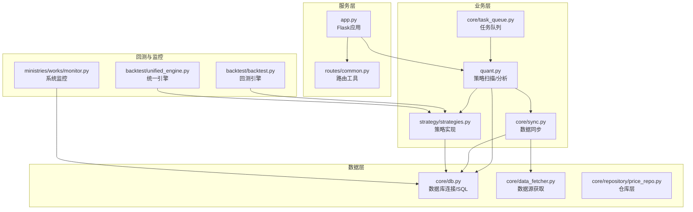
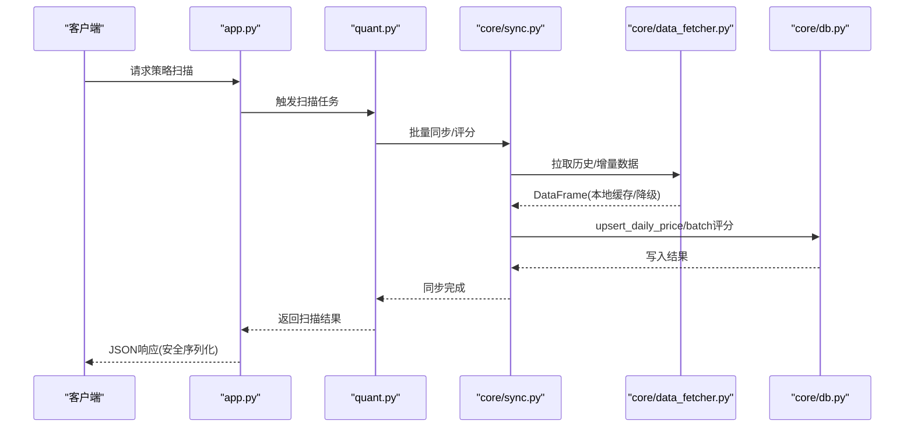
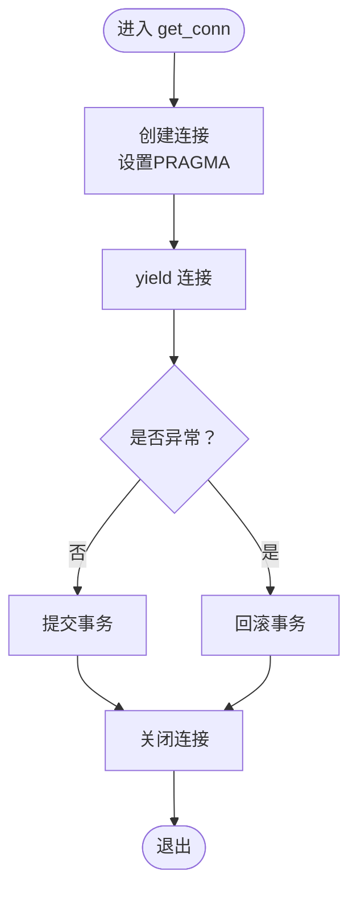
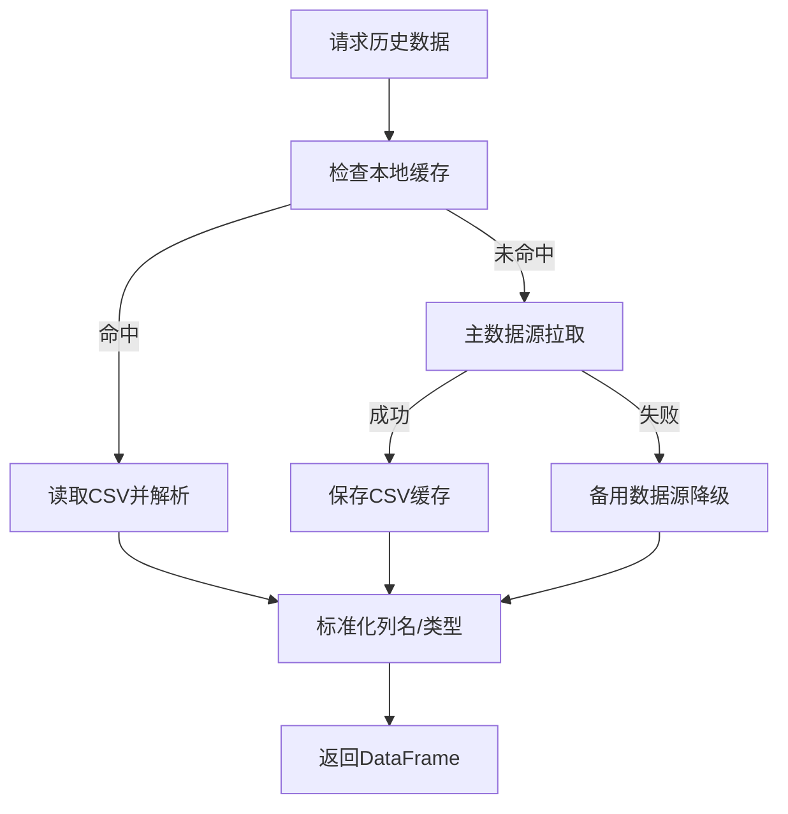
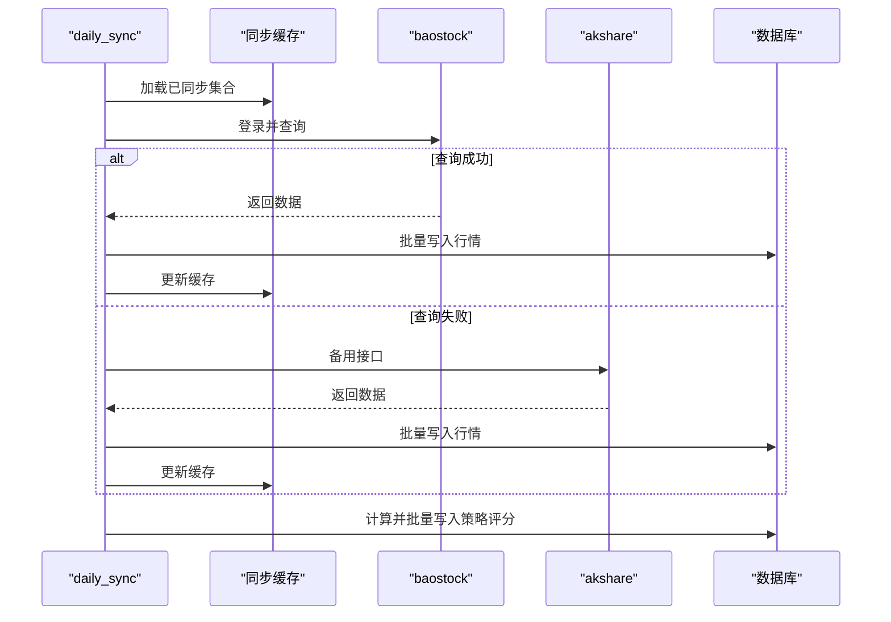
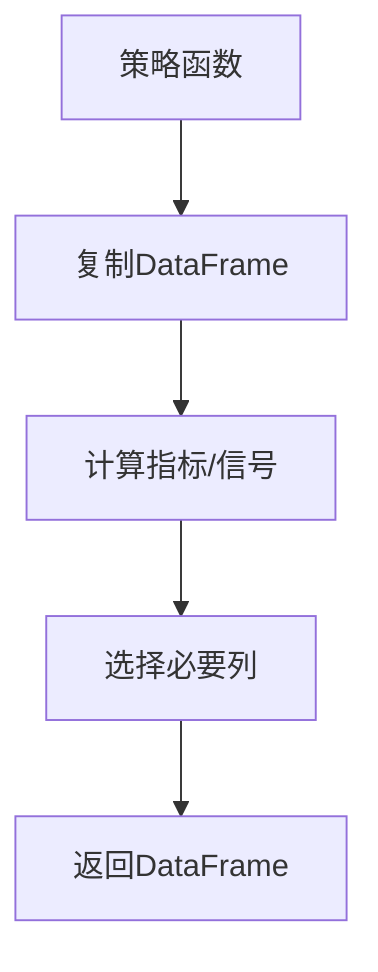
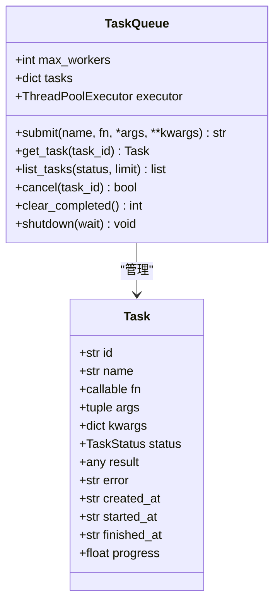
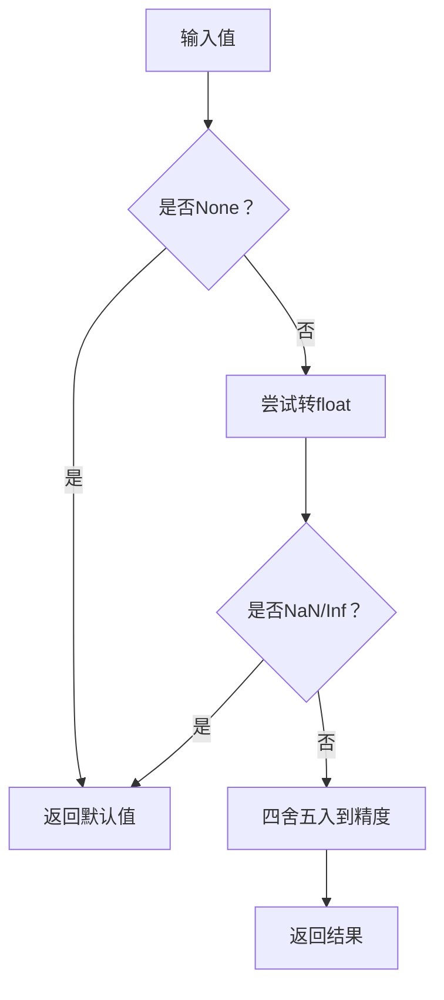
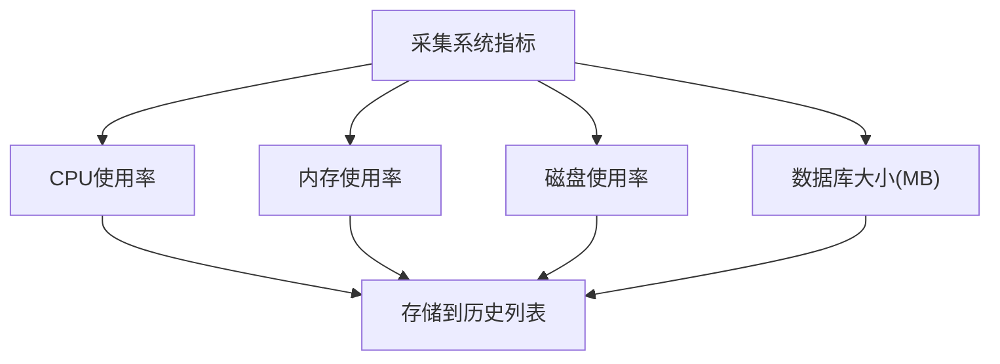
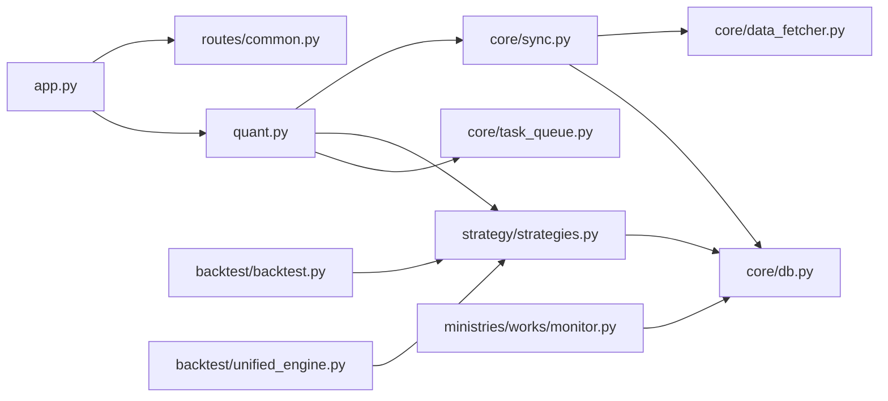

# 内存管理

<cite>
**本文档引用的文件**
- [quant.py](file://quant.py)
- [app.py](file://app.py)
- [core/db.py](file://core/db.py)
- [core/data_fetcher.py](file://core/data_fetcher.py)
- [core/sync.py](file://core/sync.py)
- [core/task_queue.py](file://core/task_queue.py)
- [strategy/strategies.py](file://strategy/strategies.py)
- [backtest/backtest.py](file://backtest/backtest.py)
- [backtest/unified_engine.py](file://backtest/unified_engine.py)
- [routes/common.py](file://routes/common.py)
- [ministries/works/monitor.py](file://ministries/works/monitor.py)
- [core/repository/price_repo.py](file://core/repository/price_repo.py)
</cite>

## 目录
1. [简介](#简介)
2. [项目结构](#项目结构)
3. [核心组件](#核心组件)
4. [架构总览](#架构总览)
5. [详细组件分析](#详细组件分析)
6. [依赖关系分析](#依赖关系分析)
7. [性能考量](#性能考量)
8. [故障排查指南](#故障排查指南)
9. [结论](#结论)
10. [附录](#附录)

## 简介
本文件面向AIQuant系统的内存管理，结合项目实际代码，系统阐述Python内存管理最佳实践、大数据集处理优化策略、pandas DataFrame内存优化方案、缓存机制设计与实现、内存泄漏检测与预防方法、多进程/多线程环境下的内存共享与隔离策略，以及内存使用监控与性能分析工具的使用指南。文档旨在帮助开发者在量化交易场景中高效、稳定地管理内存，避免内存泄漏与过度占用，提升整体系统性能与可靠性。

## 项目结构
AIQuant采用模块化分层架构，围绕“数据获取-数据同步-策略分析-回测-服务路由-监控”六大主线组织代码。与内存管理密切相关的模块包括：
- 数据层：core/db.py、core/data_fetcher.py、core/repository/price_repo.py
- 业务层：core/sync.py、strategy/strategies.py、quant.py
- 执行与并发：core/task_queue.py
- 服务与路由：app.py、routes/common.py
- 监控与告警：ministries/works/monitor.py
- 回测引擎：backtest/backtest.py、backtest/unified_engine.py

图示来源
- [app.py:1-164](file://app.py#L1-L164)
- [quant.py:1-631](file://quant.py#L1-L631)
- [core/sync.py:1-760](file://core/sync.py#L1-L760)
- [strategy/strategies.py:1-431](file://strategy/strategies.py#L1-L431)
- [core/db.py:1-800](file://core/db.py#L1-L800)
- [core/data_fetcher.py:1-578](file://core/data_fetcher.py#L1-L578)
- [core/task_queue.py:1-222](file://core/task_queue.py#L1-L222)
- [backtest/backtest.py:1-517](file://backtest/backtest.py#L1-L517)
- [backtest/unified_engine.py:1-143](file://backtest/unified_engine.py#L1-L143)
- [ministries/works/monitor.py:1-54](file://ministries/works/monitor.py#L1-L54)

章节来源
- [app.py:1-164](file://app.py#L1-L164)
- [quant.py:1-631](file://quant.py#L1-L631)
- [core/sync.py:1-760](file://core/sync.py#L1-L760)
- [strategy/strategies.py:1-431](file://strategy/strategies.py#L1-L431)
- [core/db.py:1-800](file://core/db.py#L1-L800)
- [core/data_fetcher.py:1-578](file://core/data_fetcher.py#L1-L578)
- [core/task_queue.py:1-222](file://core/task_queue.py#L1-L222)
- [backtest/backtest.py:1-517](file://backtest/backtest.py#L1-L517)
- [backtest/unified_engine.py:1-143](file://backtest/unified_engine.py#L1-L143)
- [ministries/works/monitor.py:1-54](file://ministries/works/monitor.py#L1-L54)

## 核心组件
- 数据库连接与事务管理：通过上下文管理器确保连接正确提交/回滚/关闭，减少长连接带来的内存占用与锁竞争。
- 数据获取与缓存：本地CSV缓存与断点续传，避免重复下载与解析，降低内存峰值。
- 策略与回测：策略返回的DataFrame仅保留必要列，回测引擎按需计算，避免不必要的中间副本。
- 任务队列：线程池执行器控制并发，任务状态字典避免长期持有大量对象。
- 路由与序列化：安全的JSON序列化工具，避免NaN/Inf导致的内存与序列化问题。
- 系统监控：采集CPU/内存/磁盘/数据库大小等指标，便于定位内存增长与异常。

章节来源
- [core/db.py:26-39](file://core/db.py#L26-L39)
- [core/data_fetcher.py:194-223](file://core/data_fetcher.py#L194-L223)
- [strategy/strategies.py:17-27](file://strategy/strategies.py#L17-L27)
- [backtest/backtest.py:121-131](file://backtest/backtest.py#L121-L131)
- [core/task_queue.py:54-61](file://core/task_queue.py#L54-L61)
- [routes/common.py:9-31](file://routes/common.py#L9-L31)
- [ministries/works/monitor.py:36-54](file://ministries/works/monitor.py#L36-L54)

## 架构总览
AIQuant的内存管理贯穿数据获取、入库、策略计算、回测与服务响应全流程。关键策略包括：
- 数据获取层：本地缓存优先、失败降级、按需解析，避免重复IO与大对象驻留。
- 数据库层：连接池化（单连接+上下文管理）、批量写入、索引与列裁剪，降低存储与查询开销。
- 计算层：策略返回列裁剪、回测延迟执行、滑点与手续费计算在内存中即时完成，避免中间变量累积。
- 服务层：路由工具对NaN/Inf进行安全转换，序列化时仅保留必要字段，减少JSON体积。
- 监控层：定期采集系统指标，结合数据库大小变化定位内存泄漏与异常增长。

图示来源
- [app.py:124-145](file://app.py#L124-L145)
- [quant.py:433-546](file://quant.py#L433-L546)
- [core/sync.py:462-668](file://core/sync.py#L462-L668)
- [core/data_fetcher.py:173-223](file://core/data_fetcher.py#L173-L223)
- [core/db.py:543-578](file://core/db.py#L543-L578)
- [routes/common.py:22-31](file://routes/common.py#L22-L31)

## 详细组件分析

### 数据库连接与事务管理（core/db.py）
- 使用上下文管理器确保连接生命周期可控，异常时自动回滚，最终关闭连接，避免连接泄漏。
- WAL模式与同步级别配置在性能与一致性之间取得平衡。
- 批量写入与索引维护减少重复IO与锁竞争。

图示来源
- [core/db.py:26-39](file://core/db.py#L26-L39)

章节来源
- [core/db.py:26-39](file://core/db.py#L26-L39)
- [core/db.py:543-578](file://core/db.py#L543-L578)
- [core/db.py:631-665](file://core/db.py#L631-L665)

### 数据获取与缓存（core/data_fetcher.py）
- 本地CSV缓存：优先读取本地缓存，避免重复网络请求与解析。
- 失败降级：主数据源失败自动切换备用数据源，保证可用性。
- 代码格式转换与数据类型标准化，减少后续处理的内存与CPU开销。

图示来源
- [core/data_fetcher.py:173-223](file://core/data_fetcher.py#L173-L223)
- [core/data_fetcher.py:194-223](file://core/data_fetcher.py#L194-L223)

章节来源
- [core/data_fetcher.py:173-223](file://core/data_fetcher.py#L173-L223)
- [core/data_fetcher.py:194-223](file://core/data_fetcher.py#L194-L223)

### 数据同步与批量写入（core/sync.py）
- 断点续传：基于缓存文件记录已同步股票，支持异常中断后恢复。
- 批量写入：策略评分与行情数据批量写入数据库，减少事务开销。
- 过滤与跳过：ST/退市/北交所等过滤规则减少无效数据处理。

图示来源
- [core/sync.py:462-668](file://core/sync.py#L462-L668)
- [core/sync.py:422-450](file://core/sync.py#L422-L450)
- [core/sync.py:675-702](file://core/sync.py#L675-L702)

章节来源
- [core/sync.py:462-668](file://core/sync.py#L462-L668)
- [core/sync.py:422-450](file://core/sync.py#L422-L450)
- [core/sync.py:675-702](file://core/sync.py#L675-L702)

### 策略与回测（strategy/strategies.py、backtest/backtest.py）
- 策略返回列裁剪：仅保留close/open/volume/信号列，减少DataFrame体积与GC压力。
- 回测延迟执行：T+1规则延迟买卖，避免当日信号泄露与重复计算。
- 滑点与手续费即时计算，减少中间变量累积。

图示来源
- [strategy/strategies.py:17-27](file://strategy/strategies.py#L17-L27)
- [backtest/backtest.py:121-131](file://backtest/backtest.py#L121-L131)

章节来源
- [strategy/strategies.py:17-27](file://strategy/strategies.py#L17-L27)
- [backtest/backtest.py:121-131](file://backtest/backtest.py#L121-L131)

### 任务队列与并发（core/task_queue.py）
- 线程池执行器控制并发度，避免过多线程导致内存与CPU争用。
- 任务状态字典集中管理，支持清理已完成任务释放内存。
- 回调通知机制避免阻塞主线程，降低内存堆积风险。

图示来源
- [core/task_queue.py:51-61](file://core/task_queue.py#L51-L61)
- [core/task_queue.py:102-124](file://core/task_queue.py#L102-L124)
- [core/task_queue.py:142-160](file://core/task_queue.py#L142-L160)

章节来源
- [core/task_queue.py:51-61](file://core/task_queue.py#L51-L61)
- [core/task_queue.py:102-124](file://core/task_queue.py#L102-L124)
- [core/task_queue.py:142-160](file://core/task_queue.py#L142-L160)

### 路由与序列化安全（routes/common.py）
- 安全浮点转换：对NaN/Inf进行兜底，避免序列化异常与内存浪费。
- JSON安全转换：仅保留必要列，减少响应体体积与GC压力。

图示来源
- [routes/common.py:9-19](file://routes/common.py#L9-L19)
- [routes/common.py:22-31](file://routes/common.py#L22-L31)

章节来源
- [routes/common.py:9-19](file://routes/common.py#L9-L19)
- [routes/common.py:22-31](file://routes/common.py#L22-L31)

### 系统监控与内存指标（ministries/works/monitor.py）
- 定期采集CPU/内存/磁盘使用率，数据库文件大小，辅助定位内存泄漏与异常增长。
- 历史指标存储便于趋势分析与告警触发。

图示来源
- [ministries/works/monitor.py:36-54](file://ministries/works/monitor.py#L36-L54)

章节来源
- [ministries/works/monitor.py:36-54](file://ministries/works/monitor.py#L36-L54)

## 依赖关系分析
- app.py依赖各路由模块提供REST接口，路由层依赖routes/common.py进行数据安全转换。
- quant.py依赖core/sync.py与strategy/strategies.py进行策略扫描与评分写入。
- core/sync.py依赖core/data_fetcher.py与core/db.py进行数据获取与入库。
- backtest/backtest.py与backtest/unified_engine.py依赖strategy/strategies.py生成信号。
- core/task_queue.py为异步任务提供并发执行能力。
- ministries/works/monitor.py依赖psutil与数据库路径获取系统与DB指标。

图示来源
- [app.py:1-164](file://app.py#L1-L164)
- [quant.py:1-631](file://quant.py#L1-L631)
- [core/sync.py:1-760](file://core/sync.py#L1-L760)
- [strategy/strategies.py:1-431](file://strategy/strategies.py#L1-L431)
- [core/db.py:1-800](file://core/db.py#L1-L800)
- [core/data_fetcher.py:1-578](file://core/data_fetcher.py#L1-L578)
- [core/task_queue.py:1-222](file://core/task_queue.py#L1-L222)
- [backtest/backtest.py:1-517](file://backtest/backtest.py#L1-L517)
- [backtest/unified_engine.py:1-143](file://backtest/unified_engine.py#L1-L143)
- [ministries/works/monitor.py:1-54](file://ministries/works/monitor.py#L1-L54)

章节来源
- [app.py:1-164](file://app.py#L1-L164)
- [quant.py:1-631](file://quant.py#L1-L631)
- [core/sync.py:1-760](file://core/sync.py#L1-L760)
- [strategy/strategies.py:1-431](file://strategy/strategies.py#L1-L431)
- [core/db.py:1-800](file://core/db.py#L1-L800)
- [core/data_fetcher.py:1-578](file://core/data_fetcher.py#L1-L578)
- [core/task_queue.py:1-222](file://core/task_queue.py#L1-L222)
- [backtest/backtest.py:1-517](file://backtest/backtest.py#L1-L517)
- [backtest/unified_engine.py:1-143](file://backtest/unified_engine.py#L1-L143)
- [ministries/works/monitor.py:1-54](file://ministries/works/monitor.py#L1-L54)

## 性能考量
- 大数据集处理
  - 分块处理：在数据获取与同步中采用批次与间隔，避免一次性加载过多数据。
  - 流式计算：尽量在数据库侧完成聚合与过滤，减少DataFrame尺寸。
  - 内存映射：对于超大CSV，考虑使用惰性读取与分块处理（建议在后续扩展）。
- pandas DataFrame内存优化
  - 列裁剪：仅保留必要列，策略返回列裁剪与路由序列化安全转换。
  - 数据类型转换：数值列使用合适dtype，避免object类型。
  - 稀疏矩阵：适用于高稀疏度场景（建议在后续扩展）。
  - 内存压缩：CSV缓存与数据库索引减少重复存储。
- 缓存机制
  - LRU缓存：本地缓存文件（CSV）+断点续传缓存（JSON）。
  - TTL缓存：缓存文件按时间戳管理，结合清理策略。
  - 内存上限控制：任务队列清理已完成任务，避免长期持有。
- 多进程/多线程
  - 线程池控制并发，避免过多线程导致内存与CPU争用。
  - baostock登录会话需独立管理，避免跨线程共享导致的不稳定。
- 监控与剖析
  - 系统指标：CPU/内存/磁盘/数据库大小定期采集。
  - 性能分析：结合pandas性能分析与Python内存剖析工具定位热点。

## 故障排查指南
- 内存泄漏检测
  - 使用弱引用：在需要解除循环引用的场景使用weakref（建议在后续扩展）。
  - 上下文管理器：确保资源正确释放（数据库连接、文件句柄）。
  - 资源清理：任务队列定期清理已完成任务，监控模块定期清理历史指标。
- 常见问题
  - DataFrame过大：检查策略返回列裁剪与路由序列化安全转换。
  - 数据库连接泄漏：确认上下文管理器使用与异常处理。
  - 缓存未命中：检查缓存目录权限与文件格式。
  - 并发异常：baostock登录需独立会话，避免跨线程共享。

章节来源
- [core/db.py:26-39](file://core/db.py#L26-L39)
- [core/task_queue.py:151-160](file://core/task_queue.py#L151-L160)
- [ministries/works/monitor.py:36-54](file://ministries/works/monitor.py#L36-L54)

## 结论
AIQuant在内存管理方面通过上下文管理器、本地缓存、批量写入、列裁剪与任务队列清理等策略，有效降低了内存峰值与GC压力。建议在后续版本中引入内存映射文件、稀疏矩阵、弱引用与更细粒度的性能剖析工具，进一步提升大数据场景下的内存效率与稳定性。

## 附录
- 大模型推理与显存管理：本项目未包含大模型推理模块，建议在独立服务中使用显存管理工具（如CUDA内存管理、混合精度训练）与模型分片/量化技术，并通过独立进程隔离显存占用，避免与量化交易主流程互相干扰。