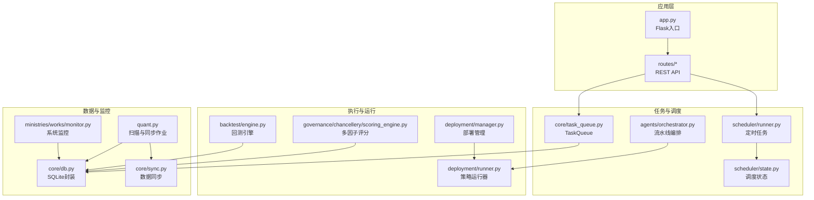
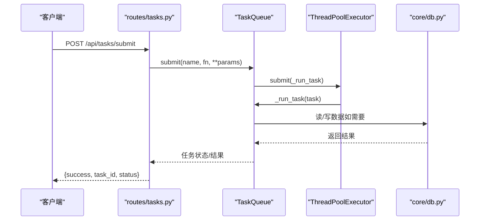
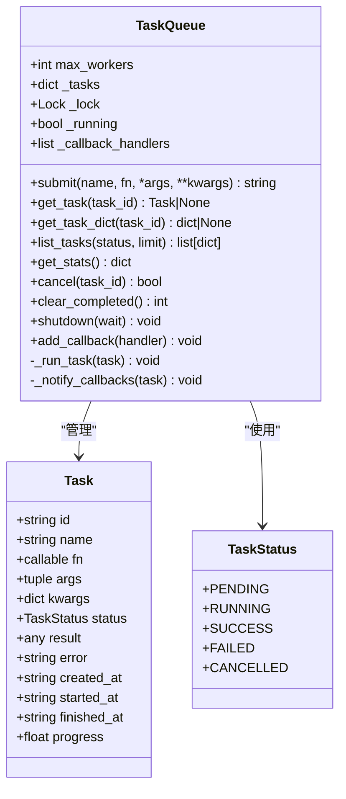
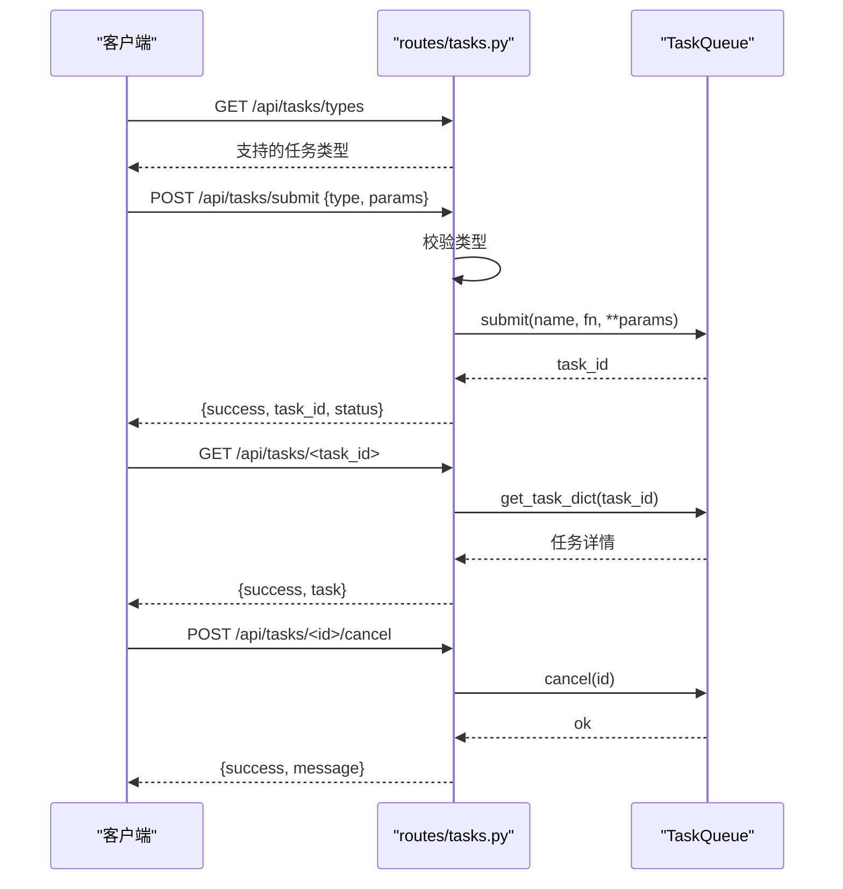
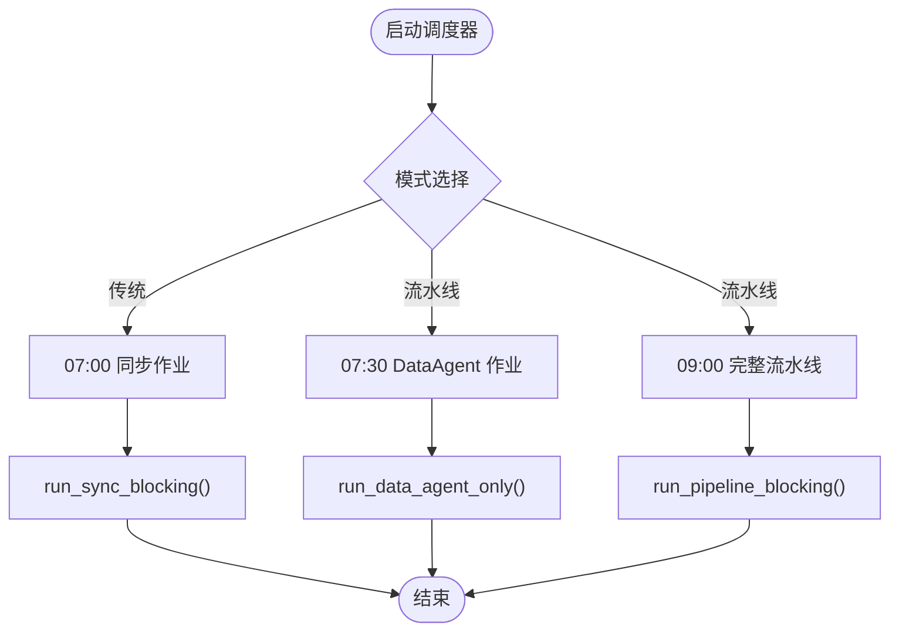
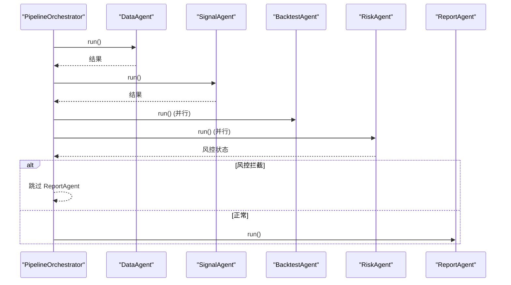
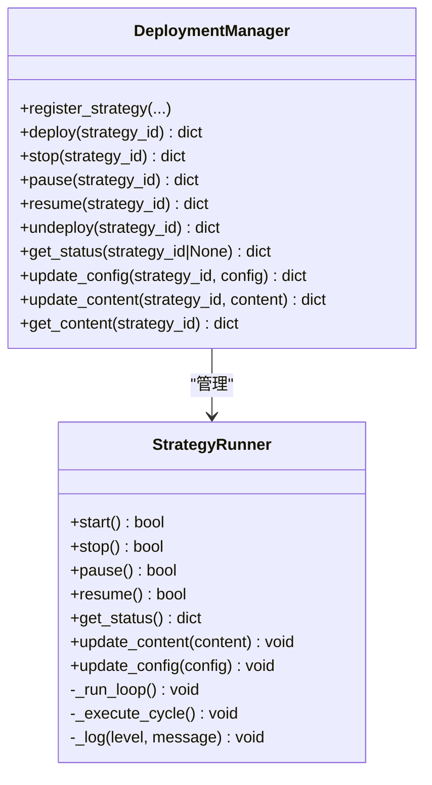
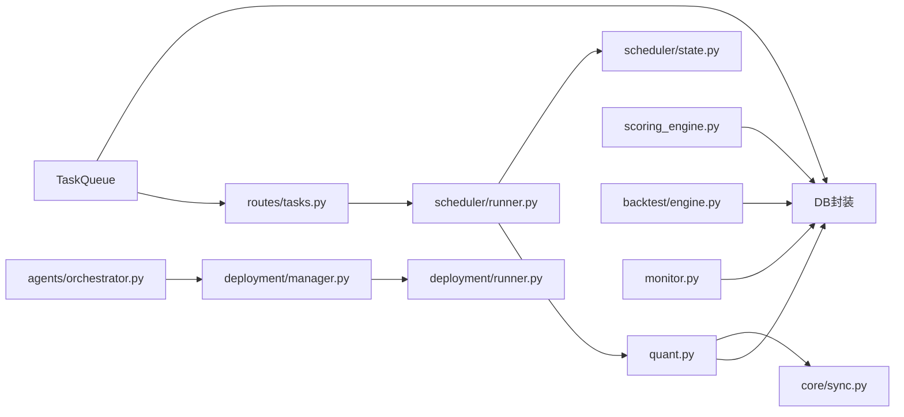

# 任务队列管理

<cite>
**本文引用的文件**
- [core/task_queue.py](file://core/task_queue.py)
- [routes/tasks.py](file://routes/tasks.py)
- [scheduler/runner.py](file://scheduler/runner.py)
- [scheduler/state.py](file://scheduler/state.py)
- [agents/orchestrator.py](file://agents/orchestrator.py)
- [deployment/manager.py](file://deployment/manager.py)
- [deployment/runner.py](file://deployment/runner.py)
- [backtest/engine.py](file://backtest/engine.py)
- [governance/chancellery/scoring_engine.py](file://governance/chancellery/scoring_engine.py)
- [core/db.py](file://core/db.py)
- [quant.py](file://quant.py)
- [core/sync.py](file://core/sync.py)
- [ministries/works/monitor.py](file://ministries/works/monitor.py)
- [app.py](file://app.py)
</cite>

## 目录
1. [简介](#简介)
2. [项目结构](#项目结构)
3. [核心组件](#核心组件)
4. [架构总览](#架构总览)
5. [详细组件分析](#详细组件分析)
6. [依赖关系分析](#依赖关系分析)
7. [性能考虑](#性能考虑)
8. [故障排查指南](#故障排查指南)
9. [结论](#结论)
10. [附录](#附录)

## 简介
本技术文档围绕任务队列管理系统展开，系统采用轻量级内存队列与线程池执行器，提供异步任务提交、执行、状态跟踪、结果查询与回调通知能力。同时结合调度器、多Agent流水线编排、策略部署运行器以及数据库持久化，形成从“任务提交—执行—状态—存储—监控”的闭环。文档重点阐述：
- 任务生命周期与状态流转
- 任务优先级与负载均衡策略
- 资源分配与并发控制
- 性能优化与内存管理
- 任务状态跟踪与监控
- 与数据库的集成与一致性
- 扩展性与分布式化思路
- 在量化系统中的应用场景（数据同步、策略扫描、回测任务）

## 项目结构
任务队列相关的核心模块分布如下：
- 核心队列与API：core/task_queue.py、routes/tasks.py
- 调度与定时：scheduler/runner.py、scheduler/state.py
- 多Agent流水线：agents/orchestrator.py
- 策略部署与运行：deployment/manager.py、deployment/runner.py
- 量化引擎与评分：backtest/engine.py、governance/chancellery/scoring_engine.py
- 数据库与数据同步：core/db.py、core/sync.py
- 监控与系统指标：ministries/works/monitor.py
- 应用入口与蓝图：app.py、quant.py

图表来源
- [app.py:1-164](file://app.py#L1-L164)
- [routes/tasks.py:1-178](file://routes/tasks.py#L1-L178)
- [core/task_queue.py:1-222](file://core/task_queue.py#L1-L222)
- [scheduler/runner.py:1-212](file://scheduler/runner.py#L1-L212)
- [scheduler/state.py:1-45](file://scheduler/state.py#L1-L45)
- [agents/orchestrator.py:1-263](file://agents/orchestrator.py#L1-L263)
- [deployment/manager.py:1-216](file://deployment/manager.py#L1-L216)
- [deployment/runner.py:1-182](file://deployment/runner.py#L1-L182)
- [backtest/engine.py:1-174](file://backtest/engine.py#L1-L174)
- [governance/chancellery/scoring_engine.py:1-370](file://governance/chancellery/scoring_engine.py#L1-L370)
- [core/db.py:1-800](file://core/db.py#L1-L800)
- [core/sync.py:1-760](file://core/sync.py#L1-L760)
- [ministries/works/monitor.py:1-113](file://ministries/works/monitor.py#L1-L113)
- [quant.py:1-631](file://quant.py#L1-L631)

章节来源
- [app.py:1-164](file://app.py#L1-L164)
- [routes/tasks.py:1-178](file://routes/tasks.py#L1-L178)
- [core/task_queue.py:1-222](file://core/task_queue.py#L1-L222)

## 核心组件
- 任务队列 TaskQueue：提供任务提交、执行、状态跟踪、统计、清理与回调通知；基于线程池并发执行，支持取消未执行任务。
- 任务 Task：承载任务元数据、状态、结果与时间戳。
- 任务状态 TaskStatus：枚举 pending/running/success/failed/cancelled。
- API 路由 routes/tasks.py：提供提交、查询、列表、取消、清理、统计等接口，并内置演示任务、回测任务与批量评分任务。
- 调度器 scheduler/runner.py：基于 schedule 库的定时任务线程，支持传统模式与多Agent流水线模式。
- 多Agent流水线编排 agents/orchestrator.py：串行/并行组合，支持风控拦截与状态持久化。
- 策略部署与运行 deployment/manager.py、deployment/runner.py：策略注册、部署、启停、暂停/恢复、运行统计与日志。
- 量化引擎与评分 backtest/engine.py、governance/chancellery/scoring_engine.py：回测与多因子评分，支撑任务内容。
- 数据库 core/db.py、core/sync.py：SQLite封装、建表迁移、数据写入/读取、策略评分批量写入、同步日志。
- 监控 ministries/works/monitor.py：系统指标采集与健康检查。

章节来源
- [core/task_queue.py:25-196](file://core/task_queue.py#L25-L196)
- [routes/tasks.py:20-178](file://routes/tasks.py#L20-L178)
- [scheduler/runner.py:158-212](file://scheduler/runner.py#L158-L212)
- [agents/orchestrator.py:36-176](file://agents/orchestrator.py#L36-L176)
- [deployment/manager.py:24-185](file://deployment/manager.py#L24-L185)
- [deployment/runner.py:44-182](file://deployment/runner.py#L44-L182)
- [backtest/engine.py:72-174](file://backtest/engine.py#L72-L174)
- [governance/chancellery/scoring_engine.py:246-370](file://governance/chancellery/scoring_engine.py#L246-L370)
- [core/db.py:26-467](file://core/db.py#L26-L467)
- [core/sync.py:462-702](file://core/sync.py#L462-L702)
- [ministries/works/monitor.py:29-113](file://ministries/works/monitor.py#L29-L113)

## 架构总览
任务队列系统采用“API网关—任务队列—线程池执行—数据库/引擎”的分层架构。API层负责任务注册与查询；任务队列负责状态管理与并发执行；线程池执行具体任务；数据库与引擎提供数据与计算能力；调度器与流水线编排负责周期性与流程化任务。

图表来源
- [routes/tasks.py:93-114](file://routes/tasks.py#L93-L114)
- [core/task_queue.py:64-99](file://core/task_queue.py#L64-L99)
- [core/db.py:543-666](file://core/db.py#L543-L666)

## 详细组件分析

### 任务队列 TaskQueue 设计
- 任务提交：生成唯一任务ID，写入任务字典，提交至线程池执行。
- 任务执行：切换状态为 running，捕获异常并标记失败，最终回调通知。
- 状态查询：支持按ID查询、列表过滤与统计。
- 控制与清理：仅对 pending 状态可取消；可清理已完成任务释放内存。
- 回调通知：任务完成后触发回调处理器（可用于通知/持久化）。

图表来源
- [core/task_queue.py:25-196](file://core/task_queue.py#L25-L196)

章节来源
- [core/task_queue.py:51-196](file://core/task_queue.py#L51-L196)

### API 任务接口 routes/tasks.py
- 任务类型注册：demo、backtest、batch_score。
- 提交流程：校验类型、构造任务、提交队列并返回任务ID与状态。
- 查询与统计：按ID查询、列表过滤、统计信息。
- 控制操作：取消任务、清理已完成任务。

图表来源
- [routes/tasks.py:84-178](file://routes/tasks.py#L84-L178)
- [core/task_queue.py:102-160](file://core/task_queue.py#L102-L160)

章节来源
- [routes/tasks.py:20-178](file://routes/tasks.py#L20-L178)

### 调度器与定时任务 scheduler/runner.py
- 传统模式：07:00 同步、09:00 扫描。
- 多Agent流水线模式：07:30 DataAgent 预同步、09:00 完整流水线。
- 线程安全：通过状态共享与锁保护；调度线程守护运行。
- 作业包装：_job_* 封装后台线程执行，避免重复触发。

图表来源
- [scheduler/runner.py:158-212](file://scheduler/runner.py#L158-L212)
- [scheduler/state.py:24-45](file://scheduler/state.py#L24-L45)

章节来源
- [scheduler/runner.py:158-212](file://scheduler/runner.py#L158-L212)
- [scheduler/state.py:1-45](file://scheduler/state.py#L1-L45)

### 多Agent流水线编排 agents/orchestrator.py
- 阶段化执行：DataAgent → SignalAgent → {BacktestAgent, RiskAgent} 并行 → ReportAgent。
- 风控拦截：RiskAgent 若为 block，则跳过 ReportAgent。
- 状态持久化：Agent 执行状态与上下文可查询与历史记录。
- 并行执行：使用线程池并行启动多个Agent。

图表来源
- [agents/orchestrator.py:81-176](file://agents/orchestrator.py#L81-L176)

章节来源
- [agents/orchestrator.py:36-263](file://agents/orchestrator.py#L36-L263)

### 策略部署与运行 deployment/manager.py、deployment/runner.py
- 部署管理：注册、部署、启停、暂停/恢复、配置热更新、内容更新、状态查询。
- 策略运行器：独立线程循环执行，支持暂停/恢复、异常处理与日志记录。
- 统计与日志：运行统计、错误计数与日志截断。

图表来源
- [deployment/manager.py:24-216](file://deployment/manager.py#L24-L216)
- [deployment/runner.py:44-182](file://deployment/runner.py#L44-L182)

章节来源
- [deployment/manager.py:24-216](file://deployment/manager.py#L24-L216)
- [deployment/runner.py:44-182](file://deployment/runner.py#L44-L182)

### 量化引擎与评分 backtest/engine.py、governance/chancellery/scoring_engine.py
- 回测引擎：封装 Backtrader，提供策略运行、分析器提取与结果封装。
- 多因子评分：趋势、动量、波动率、成交量、质量五大因子，支持权重配置与评分等级。

章节来源
- [backtest/engine.py:72-174](file://backtest/engine.py#L72-L174)
- [governance/chancellery/scoring_engine.py:246-370](file://governance/chancellery/scoring_engine.py#L246-L370)

### 数据库与数据同步 core/db.py、core/sync.py
- 数据库封装：连接管理、建表/迁移、批量写入、查询与索引。
- 数据同步：历史初始化、增量同步、策略评分批量写入、指数同步、断点续传与缓存。
- 量化作业：扫描与同步作业在 quant.py 中调度。

章节来源
- [core/db.py:26-467](file://core/db.py#L26-L467)
- [core/sync.py:462-702](file://core/sync.py#L462-L702)
- [quant.py:433-546](file://quant.py#L433-L546)

### 监控与系统指标 ministries/works/monitor.py
- 指标采集：CPU、内存、磁盘、数据库大小、活动连接数、待处理订单、1小时错误数。
- 健康检查：基于最新指标判断健康状态。

章节来源
- [ministries/works/monitor.py:29-113](file://ministries/works/monitor.py#L29-L113)

## 依赖关系分析
- TaskQueue 依赖线程池与锁，对外暴露提交、查询、统计、清理与回调接口。
- routes/tasks.py 依赖 TaskQueue，并注册任务类型与API路由。
- scheduler/runner.py 依赖调度库与状态模块，封装同步与扫描作业。
- agents/orchestrator.py 依赖各Agent模块，实现串行/并行与风控拦截。
- deployment/manager.py 依赖 deployment/runner.py，提供策略生命周期管理。
- backtest/engine.py 与 governance/chancellery/scoring_engine.py 为任务内容提供计算能力。
- core/db.py 与 core/sync.py 为任务与扫描提供数据支撑。
- ministries/works/monitor.py 为系统健康提供观测指标。

图表来源
- [core/task_queue.py:51-196](file://core/task_queue.py#L51-L196)
- [routes/tasks.py:15-178](file://routes/tasks.py#L15-L178)
- [scheduler/runner.py:158-212](file://scheduler/runner.py#L158-L212)
- [scheduler/state.py:24-45](file://scheduler/state.py#L24-L45)
- [agents/orchestrator.py:81-176](file://agents/orchestrator.py#L81-L176)
- [deployment/manager.py:24-185](file://deployment/manager.py#L24-L185)
- [deployment/runner.py:44-182](file://deployment/runner.py#L44-L182)
- [backtest/engine.py:72-174](file://backtest/engine.py#L72-L174)
- [governance/chancellery/scoring_engine.py:246-370](file://governance/chancellery/scoring_engine.py#L246-L370)
- [core/db.py:26-467](file://core/db.py#L26-L467)
- [core/sync.py:462-702](file://core/sync.py#L462-L702)
- [ministries/works/monitor.py:29-113](file://ministries/works/monitor.py#L29-L113)

章节来源
- [app.py:1-164](file://app.py#L1-L164)

## 性能考虑
- 并发与线程池：TaskQueue 使用线程池执行任务，max_workers 控制并发度；合理设置可提升吞吐，但需关注CPU/IO瓶颈与资源竞争。
- 队列长度与内存：任务完成后需定期清理已完成任务，避免内存累积；可结合统计接口监控队列规模。
- I/O 密集与数据库：数据同步与评分写入涉及大量数据库写入，建议批量写入与索引优化；回测任务应避免阻塞主线程。
- 调度与定时：定时任务线程为守护线程，避免阻塞主进程；注意避免重复触发与竞态。
- 监控与告警：系统监控模块提供关键指标，建议结合阈值告警与日志聚合。

[本节为通用指导，无需特定文件引用]

## 故障排查指南
- 任务状态异常
  - 检查任务状态与错误信息：查询任务详情确认 status 与 error 字段。
  - 回调异常：回调处理器抛出异常会被捕获并打印，检查回调链路。
- 数据库问题
  - 连接与事务：使用上下文管理器确保提交/回滚；检查 WAL 模式与同步级别。
  - 写入失败：批量写入时逐条处理异常，必要时重试或降级。
- 调度与流水线
  - 调度器状态：确认调度线程存活与状态标志；避免重复触发。
  - 流水线中断：风控拦截会跳过后续阶段，检查风控状态与拦截原因。
- 策略运行器
  - 异常处理：异常后进入 ERROR 状态并短暂等待，检查日志与错误计数。
- 监控
  - CPU/内存/磁盘/数据库大小异常：结合监控模块输出定位瓶颈。

章节来源
- [core/task_queue.py:173-180](file://core/task_queue.py#L173-L180)
- [core/db.py:26-40](file://core/db.py#L26-L40)
- [scheduler/state.py:24-45](file://scheduler/state.py#L24-L45)
- [agents/orchestrator.py:143-151](file://agents/orchestrator.py#L143-L151)
- [deployment/runner.py:116-131](file://deployment/runner.py#L116-L131)
- [ministries/works/monitor.py:91-101](file://ministries/works/monitor.py#L91-L101)

## 结论
该任务队列系统以轻量级内存队列为核心，结合线程池并发执行与Flask API，实现了从任务提交到状态查询的完整闭环。通过调度器与多Agent流水线编排，系统能够支撑数据同步、策略扫描与回测等量化场景。数据库封装与监控模块提供了可靠的数据持久化与可观测性。未来可在队列长度控制、内存回收、回调链路优化、数据库写入批量化等方面进一步增强；在扩展性方面，可引入消息中间件与分布式部署以支持更高并发与水平扩展。

[本节为总结性内容，无需特定文件引用]

## 附录
- 任务类型
  - demo：演示任务，支持失败模拟。
  - backtest：异步回测任务，封装回测引擎。
  - batch_score：批量评分任务，调用多因子评分引擎与数据源管理器。
- 关键接口
  - 提交：POST /api/tasks/submit
  - 查询：GET /api/tasks/{id}
  - 列表：GET /api/tasks
  - 取消：POST /api/tasks/{id}/cancel
  - 清理：POST /api/tasks/clear
  - 统计：GET /api/tasks/stats
  - 类型：GET /api/tasks/types

章节来源
- [routes/tasks.py:20-178](file://routes/tasks.py#L20-L178)
- [backtest/engine.py:164-174](file://backtest/engine.py#L164-L174)
- [governance/chancellery/scoring_engine.py:360-370](file://governance/chancellery/scoring_engine.py#L360-L370)