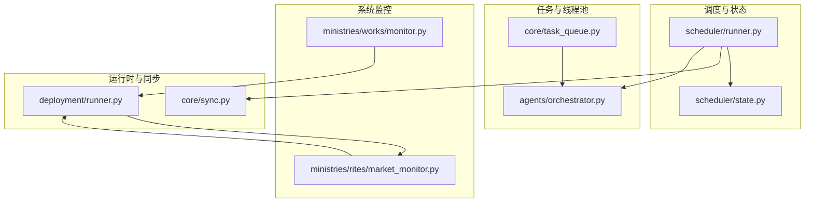
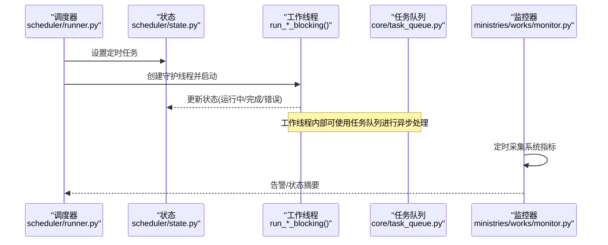
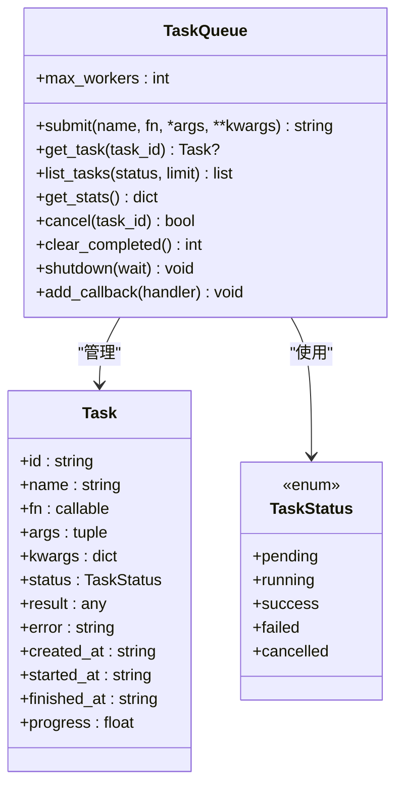
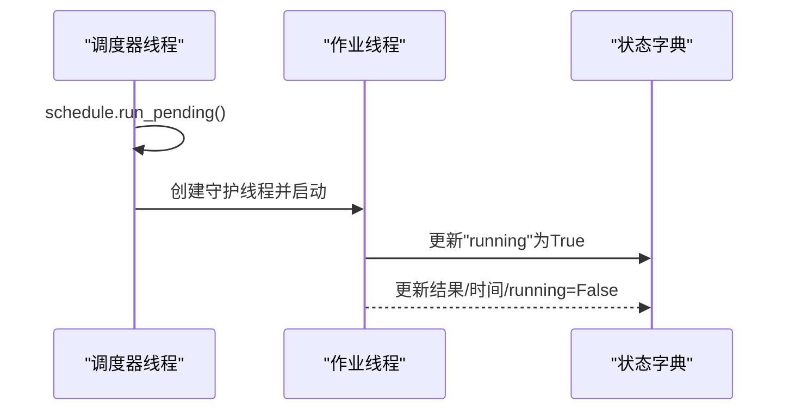
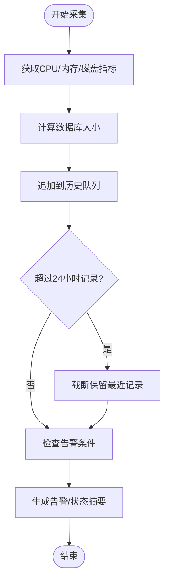
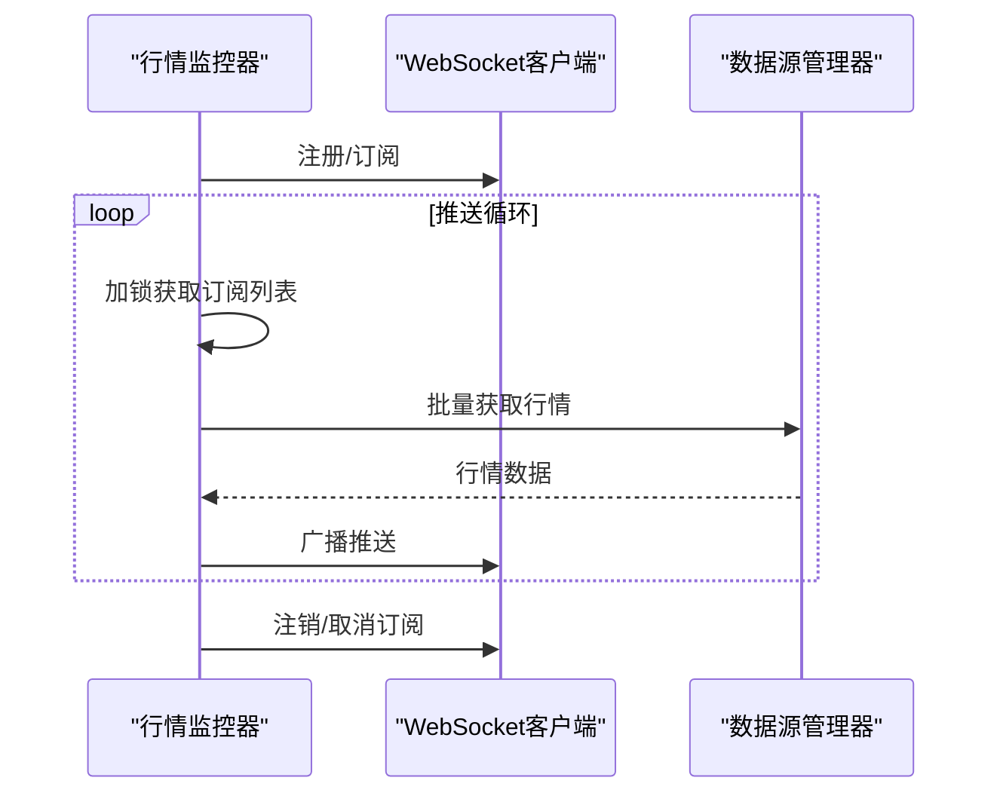
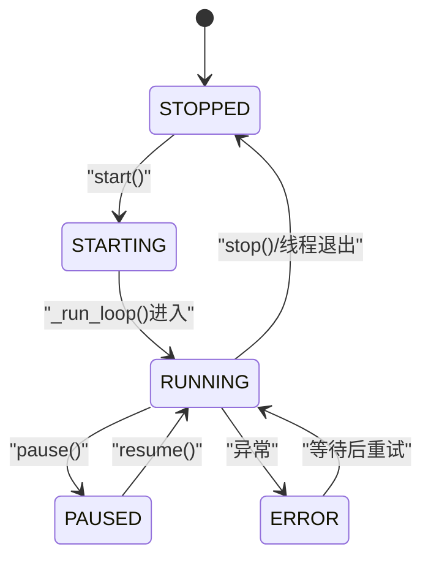
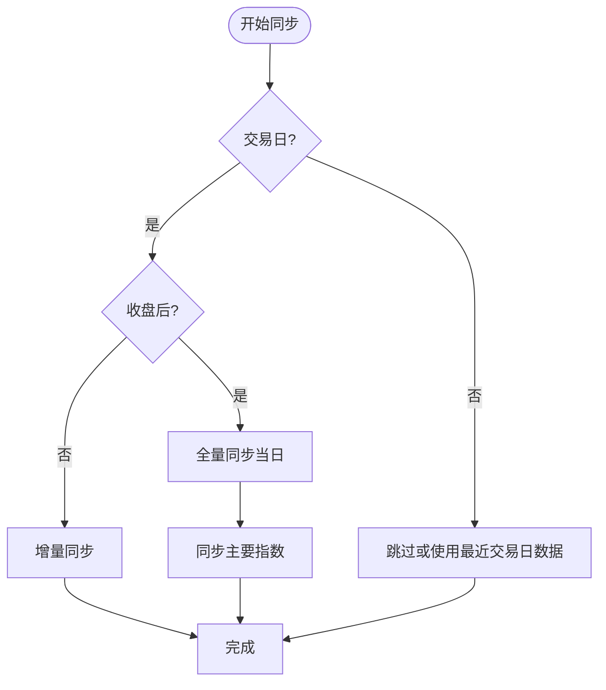
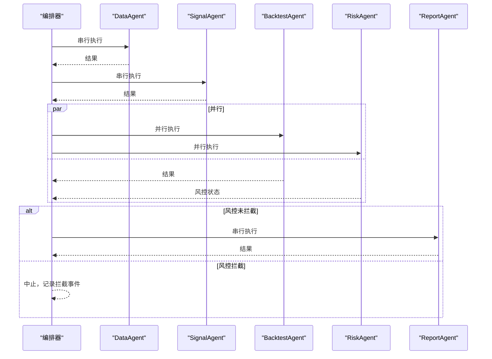
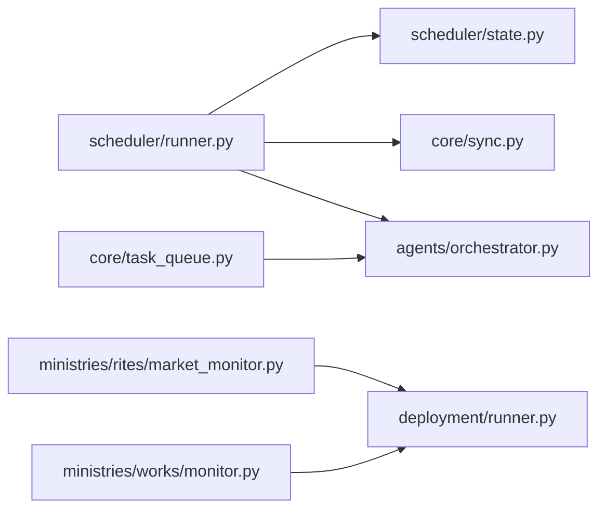

# 后台线程管理

<cite>
**本文引用的文件**
- [core/task_queue.py](file://core/task_queue.py)
- [scheduler/runner.py](file://scheduler/runner.py)
- [scheduler/state.py](file://scheduler/state.py)
- [ministries/works/monitor.py](file://ministries/works/monitor.py)
- [ministries/rites/market_monitor.py](file://ministries/rites/market_monitor.py)
- [deployment/runner.py](file://deployment/runner.py)
- [core/sync.py](file://core/sync.py)
- [agents/orchestrator.py](file://agents/orchestrator.py)
</cite>

## 目录
1. [简介](#简介)
2. [项目结构](#项目结构)
3. [核心组件](#核心组件)
4. [架构总览](#架构总览)
5. [组件详解](#组件详解)
6. [依赖关系分析](#依赖关系分析)
7. [性能与监控](#性能与监控)
8. [故障排查指南](#故障排查指南)
9. [结论](#结论)
10. [附录](#附录)

## 简介
本文件面向量化系统的后台线程管理，系统性阐述多线程在数据同步、策略执行、实时行情推送与系统监控中的应用。重点覆盖以下主题：
- 线程创建、生命周期管理与资源控制
- 后台线程设计模式：守护线程、工作线程、监控线程的职责划分
- 线程安全：共享资源保护、线程间通信与一致性保障
- 线程池使用与管理：线程复用、连接池与资源回收
- 异常处理与错误恢复：异常捕获、线程重启与系统稳定性
- 性能监控与调优：线程状态、CPU/内存使用与潜在泄漏检测
- 应用场景：数据初始化、异步处理与系统维护任务

## 项目结构
围绕后台线程管理的关键模块如下：
- 任务队列与线程池：core/task_queue.py
- 定时调度与后台线程：scheduler/runner.py、scheduler/state.py
- 系统监控：ministries/works/monitor.py
- 实时行情监控与推送：ministries/rites/market_monitor.py
- 策略运行时（独立线程）：deployment/runner.py
- 数据同步（多线程并发）：core/sync.py
- 多Agent流水线编排（并行执行）：agents/orchestrator.py

图表来源
- [scheduler/runner.py:158-182](file://scheduler/runner.py#L158-L182)
- [scheduler/state.py:1-45](file://scheduler/state.py#L1-L45)
- [core/task_queue.py:51-82](file://core/task_queue.py#L51-L82)
- [agents/orchestrator.py:36-53](file://agents/orchestrator.py#L36-L53)
- [ministries/works/monitor.py:29-101](file://ministries/works/monitor.py#L29-L101)
- [ministries/rites/market_monitor.py:21-36](file://ministries/rites/market_monitor.py#L21-L36)
- [deployment/runner.py:44-68](file://deployment/runner.py#L44-L68)
- [core/sync.py:15-21](file://core/sync.py#L15-L21)

章节来源
- [scheduler/runner.py:158-182](file://scheduler/runner.py#L158-L182)
- [scheduler/state.py:1-45](file://scheduler/state.py#L1-L45)
- [core/task_queue.py:51-82](file://core/task_queue.py#L51-L82)
- [agents/orchestrator.py:36-53](file://agents/orchestrator.py#L36-L53)
- [ministries/works/monitor.py:29-101](file://ministries/works/monitor.py#L29-L101)
- [ministries/rites/market_monitor.py:21-36](file://ministries/rites/market_monitor.py#L21-L36)
- [deployment/runner.py:44-68](file://deployment/runner.py#L44-L68)
- [core/sync.py:15-21](file://core/sync.py#L15-L21)

## 核心组件
- 任务队列与线程池：提供轻量异步任务提交、状态跟踪、回调通知与线程池执行能力，适合回测、批量评分、数据同步等场景。
- 定时调度器：基于schedule库与守护线程，按固定时间点触发数据同步、策略扫描与多Agent流水线。
- 系统监控器：采集CPU/内存/磁盘/数据库大小等指标，支持告警与状态摘要。
- 实时行情监控器：管理WebSocket客户端、订阅关系与推送线程，支持批量拉取与订阅广播。
- 策略运行时：在独立守护线程中执行策略周期，具备暂停/恢复/错误计数与日志记录。
- 数据同步：支持多线程并发抓取与入库，包含过滤规则、批次控制与错误容错。
- 多Agent流水线：编排DataAgent→SignalAgent→(BacktestAgent,RiskAgent)→ReportAgent，支持并行与风控拦截。

章节来源
- [core/task_queue.py:51-166](file://core/task_queue.py#L51-L166)
- [scheduler/runner.py:158-212](file://scheduler/runner.py#L158-L212)
- [ministries/works/monitor.py:29-101](file://ministries/works/monitor.py#L29-L101)
- [ministries/rites/market_monitor.py:21-131](file://ministries/rites/market_monitor.py#L21-L131)
- [deployment/runner.py:44-131](file://deployment/runner.py#L44-L131)
- [core/sync.py:39-72](file://core/sync.py#L39-L72)
- [agents/orchestrator.py:36-175](file://agents/orchestrator.py#L36-L175)

## 架构总览
后台线程体系由“调度线程”“工作线程”“守护线程”“监控线程”协同构成，配合线程池与锁实现高并发与稳定性。

图表来源
- [scheduler/runner.py:158-182](file://scheduler/runner.py#L158-L182)
- [scheduler/state.py:24-45](file://scheduler/state.py#L24-L45)
- [core/task_queue.py:51-99](file://core/task_queue.py#L51-L99)
- [ministries/works/monitor.py:36-101](file://ministries/works/monitor.py#L36-L101)

## 组件详解

### 任务队列与线程池（TaskQueue）
- 设计要点
  - 使用线程池执行器承载并发任务，支持最大并发数配置。
  - 任务状态枚举：待定、运行中、成功、失败、取消。
  - 通过全局锁保护任务字典与回调列表，确保线程安全。
  - 提供任务提交、查询、统计、取消、清理与优雅关闭。
- 关键流程
  - 提交任务：生成唯一ID，封装Task，加入字典，提交至线程池。
  - 执行任务：设置运行中状态与开始时间，捕获异常并标记失败，最终通知回调。
  - 统计与清理：按状态统计，清理已完成任务释放内存。
- 线程安全
  - 所有任务字典访问均加锁；回调在独立try块中执行，避免互相影响。
- 适用场景
  - 回测、批量评分、数据同步等异步任务。

图表来源
- [core/task_queue.py:25-49](file://core/task_queue.py#L25-L49)
- [core/task_queue.py:51-166](file://core/task_queue.py#L51-L166)

章节来源
- [core/task_queue.py:51-166](file://core/task_queue.py#L51-L166)

### 定时调度器与后台线程（Scheduler）
- 设计要点
  - 使用守护线程运行调度循环，按分钟轮询执行待处理任务。
  - 传统模式：定时触发数据同步与策略扫描。
  - 流水线模式：07:30预同步数据，09:00完整流水线。
  - 状态共享：通过进程内字典保存运行状态，避免重复触发。
- 关键流程
  - 启动调度线程：创建守护线程，循环执行schedule.run_pending。
  - 作业包装：每个作业在独立守护线程中执行，防止阻塞调度。
  - 状态更新：作业完成后更新状态字典，供UI/API查询。
- 线程安全
  - 状态字典更新由调用方保证线程安全；调度线程与作业线程之间通过状态字典通信。

图表来源
- [scheduler/runner.py:158-182](file://scheduler/runner.py#L158-L182)
- [scheduler/runner.py:186-212](file://scheduler/runner.py#L186-L212)
- [scheduler/state.py:6-21](file://scheduler/state.py#L6-L21)

章节来源
- [scheduler/runner.py:158-212](file://scheduler/runner.py#L158-L212)
- [scheduler/state.py:1-45](file://scheduler/state.py#L1-L45)

### 系统监控器（SystemMonitor）
- 设计要点
  - 定时采集CPU/内存/磁盘使用率，计算数据库大小，记录历史指标。
  - 提供告警检查与状态摘要，便于运维与自动化告警。
- 关键流程
  - 采集：使用psutil获取系统指标，拼装指标对象并入历史队列。
  - 告警：根据阈值生成告警并累计。
  - 状态：输出健康状态与关键指标摘要。
- 线程安全
  - 指标采集与告警检查在单线程环境下进行，历史队列长度限制在24小时。

图表来源
- [ministries/works/monitor.py:36-101](file://ministries/works/monitor.py#L36-L101)

章节来源
- [ministries/works/monitor.py:29-101](file://ministries/works/monitor.py#L29-L101)

### 实时行情监控器（MarketMonitor）
- 设计要点
  - 管理WebSocket客户端连接、订阅关系与推送线程。
  - 采用守护线程定期批量拉取行情并广播给订阅者。
  - 通过锁保护客户端与订阅表，避免竞态。
- 关键流程
  - 注册/订阅/取消订阅：更新clients与subscriptions。
  - 推送循环：按批次拉取行情，逐个推送至订阅者。
  - 异常处理：单只股票异常不影响整体推送。
- 线程安全
  - 所有共享结构（clients、subscriptions）访问加锁；推送过程也加锁。

图表来源
- [ministries/rites/market_monitor.py:39-93](file://ministries/rites/market_monitor.py#L39-L93)
- [ministries/rites/market_monitor.py:124-131](file://ministries/rites/market_monitor.py#L124-L131)
- [ministries/rites/market_monitor.py:133-193](file://ministries/rites/market_monitor.py#L133-L193)

章节来源
- [ministries/rites/market_monitor.py:21-131](file://ministries/rites/market_monitor.py#L21-L131)

### 策略运行时（StrategyRunner）
- 设计要点
  - 在独立守护线程中执行策略周期，支持启动/停止/暂停/恢复。
  - 使用Event作为停止信号，循环中sleep控制频率。
  - 异常捕获与错误计数，进入ERROR状态并短暂等待后重试。
  - 日志与统计数据持久化，便于查询与审计。
- 关键流程
  - 启动：创建守护线程，进入STARTING→RUNNING。
  - 循环：若RUNNING则执行周期逻辑，否则sleep。
  - 异常：记录错误、增加计数、进入ERROR并等待。
  - 停止：设置停止事件，线程退出，状态置STOPPED。

图表来源
- [deployment/runner.py:69-131](file://deployment/runner.py#L69-L131)

章节来源
- [deployment/runner.py:44-131](file://deployment/runner.py#L44-L131)

### 数据同步（多线程并发）
- 设计要点
  - 利用线程池并发抓取股票与指数数据，支持批次与间隔控制。
  - 包含过滤规则（ST/退市/北交所等），避免无效请求。
  - 收盘后全量同步当日，盘中增量补缺。
- 关键流程
  - 判断交易日与收盘时间，决定全量/增量。
  - 批量处理股票，逐只同步并计算策略分。
  - 指数同步与汇总统计。

图表来源
- [core/sync.py:39-87](file://core/sync.py#L39-L87)
- [scheduler/runner.py:57-87](file://scheduler/runner.py#L57-L87)

章节来源
- [core/sync.py:39-87](file://core/sync.py#L39-L87)
- [scheduler/runner.py:57-87](file://scheduler/runner.py#L57-L87)

### 多Agent流水线（并行执行与风控拦截）
- 设计要点
  - 编排DataAgent→SignalAgent→(BacktestAgent,RiskAgent)→ReportAgent。
  - 并行执行BacktestAgent与RiskAgent，风控拦截点阻止后续阶段。
  - 支持回调钩子：on_agent_start/on_agent_finish。
- 关键流程
  - 串行阶段：任一阶段失败即中止。
  - 并行阶段：使用线程池并行执行，合并结果。
  - 风控拦截：若RiskAgent为BLOCK，则跳过报表阶段。

图表来源
- [agents/orchestrator.py:81-175](file://agents/orchestrator.py#L81-L175)

章节来源
- [agents/orchestrator.py:36-175](file://agents/orchestrator.py#L36-L175)

## 依赖关系分析
- 组件耦合
  - 调度器依赖状态字典与各后台任务函数；后台任务函数依赖各自业务模块。
  - 任务队列被多处异步任务使用，形成通用执行基础设施。
  - 实时行情监控器依赖数据源管理器，推送线程与业务线程解耦。
- 外部依赖
  - schedule：定时任务调度。
  - psutil：系统指标采集。
  - concurrent.futures：线程池执行器。
  - threading：守护线程、锁与事件。
- 潜在风险
  - 状态字典共享需调用方保证线程安全。
  - 线程池与IO密集型任务需合理设置max_workers，避免过载。
  - 守护线程退出时机需谨慎，避免资源未释放。

图表来源
- [scheduler/runner.py:158-182](file://scheduler/runner.py#L158-L182)
- [scheduler/state.py:1-45](file://scheduler/state.py#L1-L45)
- [core/task_queue.py:51-82](file://core/task_queue.py#L51-L82)
- [agents/orchestrator.py:36-53](file://agents/orchestrator.py#L36-L53)
- [ministries/rites/market_monitor.py:21-36](file://ministries/rites/market_monitor.py#L21-L36)
- [ministries/works/monitor.py:29-101](file://ministries/works/monitor.py#L29-L101)

章节来源
- [scheduler/runner.py:158-182](file://scheduler/runner.py#L158-L182)
- [core/task_queue.py:51-82](file://core/task_queue.py#L51-L82)
- [agents/orchestrator.py:36-53](file://agents/orchestrator.py#L36-L53)
- [ministries/rites/market_monitor.py:21-36](file://ministries/rites/market_monitor.py#L21-L36)
- [ministries/works/monitor.py:29-101](file://ministries/works/monitor.py#L29-L101)

## 性能与监控
- 线程池与并发
  - 任务队列与Agent编排器均使用线程池，建议根据CPU核数与IO特性调整max_workers。
  - 对于IO密集型（网络/数据库），可适度提高并发；对于CPU密集型，应谨慎提升。
- CPU/内存/磁盘
  - 使用系统监控器定期采集指标，结合告警阈值进行预警。
  - 数据库大小与连接数纳入监控，避免膨胀导致性能下降。
- 线程状态与健康
  - 定时调度器与守护线程均通过状态字典对外暴露运行状态。
  - 策略运行时提供日志与统计数据，便于定位异常与评估性能。
- 调优建议
  - 控制批大小与批次间隔，避免瞬时压力过大。
  - 对高频推送场景，采用限流与背压策略（例如减少推送频率或合并消息）。
  - 对长时间运行的线程，定期检查资源占用并进行回收。

[本节为通用指导，无需具体文件引用]

## 故障排查指南
- 调度器无法启动/重复触发
  - 检查状态字典running标志与调度线程存活状态。
  - 确认作业线程是否正确设置running=True并在完成后置False。
- 任务队列异常
  - 查看任务状态与错误信息；确认回调异常不会影响其他回调。
  - 清理已完成任务，避免内存累积。
- 策略运行时频繁ERROR
  - 检查异常日志与错误计数；确认异常后等待5秒重试是否合理。
  - 调整策略函数健壮性与外部依赖可用性。
- 实时行情推送失败
  - 检查订阅表与客户端连接状态；确认推送循环中的异常被捕获。
  - 降低推送频率或分批处理，避免阻塞。
- 数据同步卡顿
  - 检查过滤规则与批次间隔；确认网络/接口可用性。
  - 收盘后全量同步与盘中增量同步策略是否匹配业务需求。

章节来源
- [scheduler/state.py:6-21](file://scheduler/state.py#L6-L21)
- [scheduler/runner.py:186-212](file://scheduler/runner.py#L186-L212)
- [core/task_queue.py:169-180](file://core/task_queue.py#L169-L180)
- [deployment/runner.py:116-131](file://deployment/runner.py#L116-L131)
- [ministries/rites/market_monitor.py:124-131](file://ministries/rites/market_monitor.py#L124-L131)
- [core/sync.py:39-87](file://core/sync.py#L39-L87)

## 结论
本系统通过“调度线程+工作线程+守护线程+监控线程”的组合，实现了量化系统后台任务的稳定执行与可观测性。任务队列与线程池提供了高效的异步执行能力；调度器与状态字典确保了任务的有序触发；系统监控与策略运行时增强了稳定性与可维护性。建议在生产环境中持续优化线程池参数、完善异常恢复与资源回收，并加强监控告警与日志审计。

[本节为总结，无需具体文件引用]

## 附录
- 关键实现位置索引
  - 任务队列与线程池：[core/task_queue.py:51-166](file://core/task_queue.py#L51-L166)
  - 定时调度与作业：[scheduler/runner.py:158-212](file://scheduler/runner.py#L158-L212)、[scheduler/state.py:1-45](file://scheduler/state.py#L1-L45)
  - 系统监控：[ministries/works/monitor.py:29-101](file://ministries/works/monitor.py#L29-L101)
  - 实时行情监控：[ministries/rites/market_monitor.py:21-131](file://ministries/rites/market_monitor.py#L21-L131)
  - 策略运行时：[deployment/runner.py:44-131](file://deployment/runner.py#L44-L131)
  - 数据同步：[core/sync.py:39-87](file://core/sync.py#L39-L87)
  - 多Agent流水线：[agents/orchestrator.py:36-175](file://agents/orchestrator.py#L36-L175)

[本节为索引，无需具体文件引用]