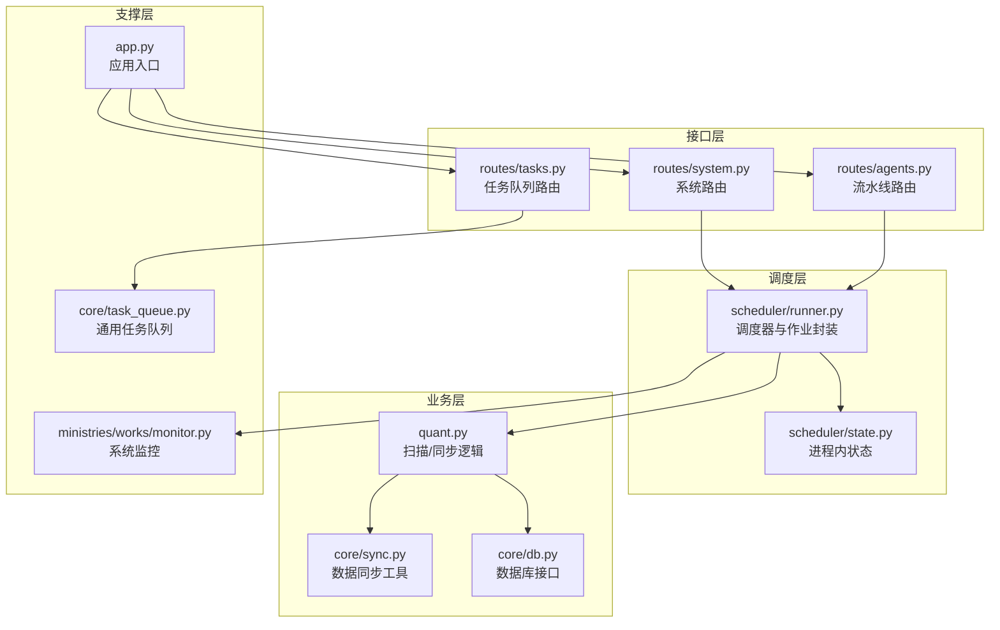
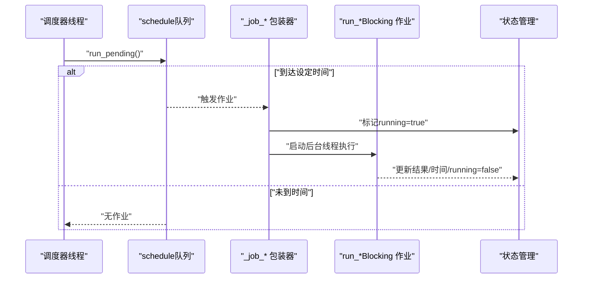
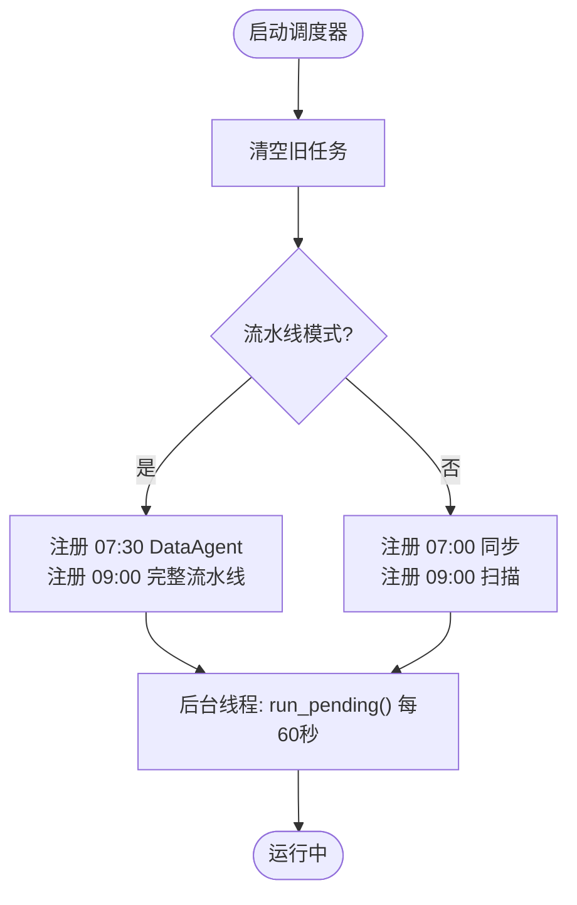
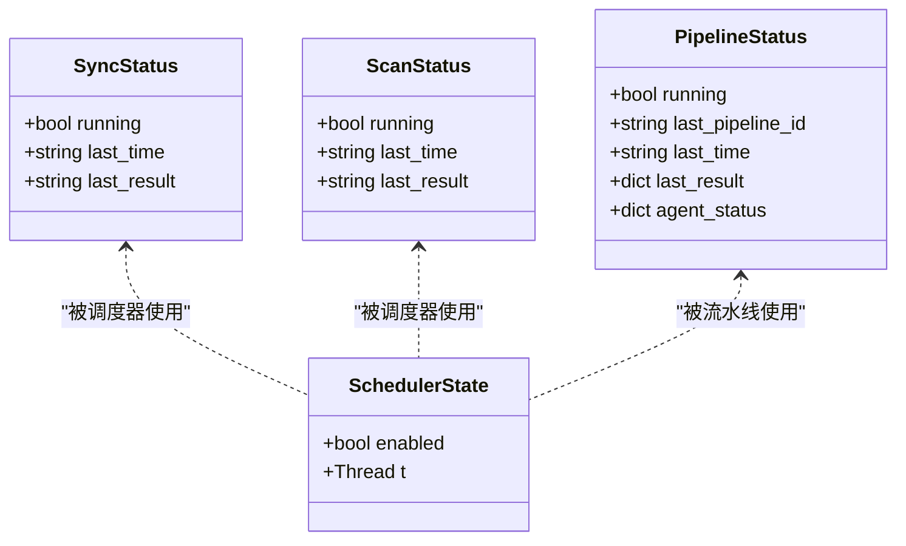
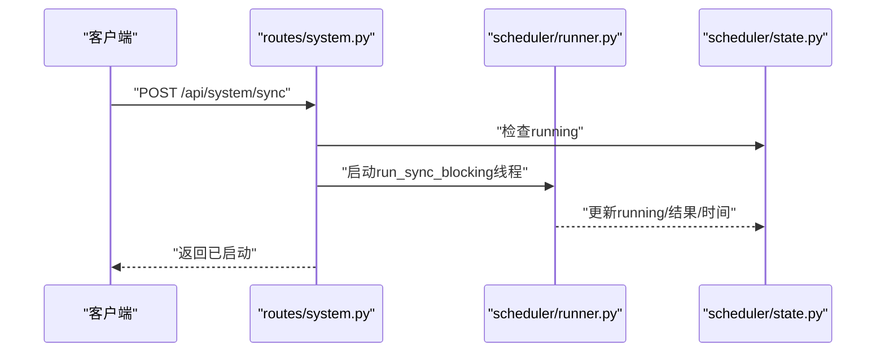
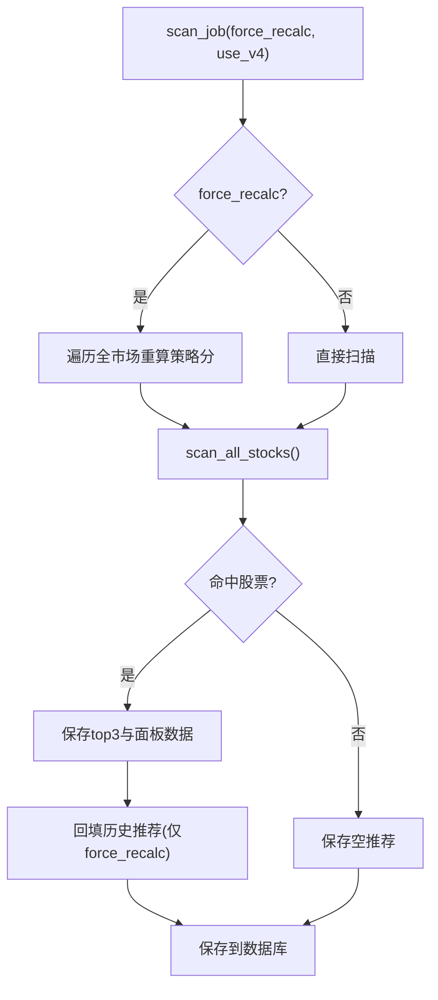
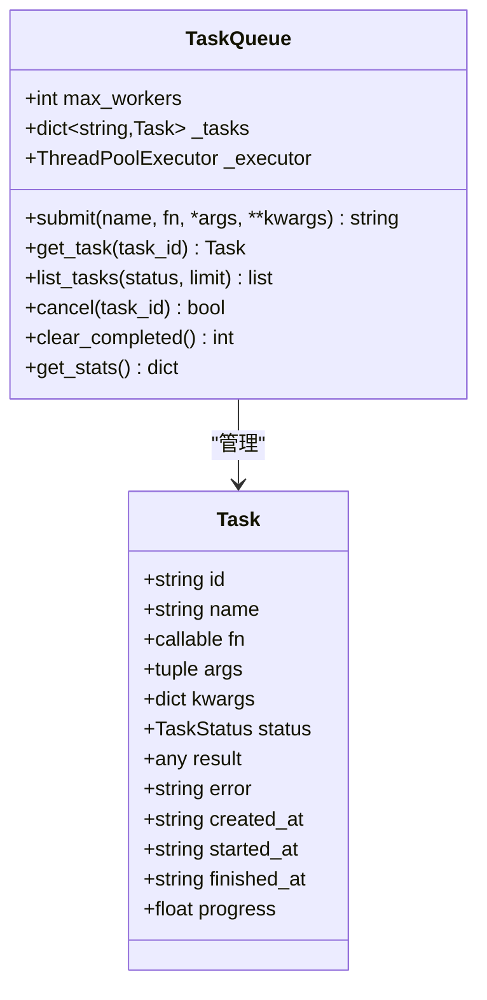
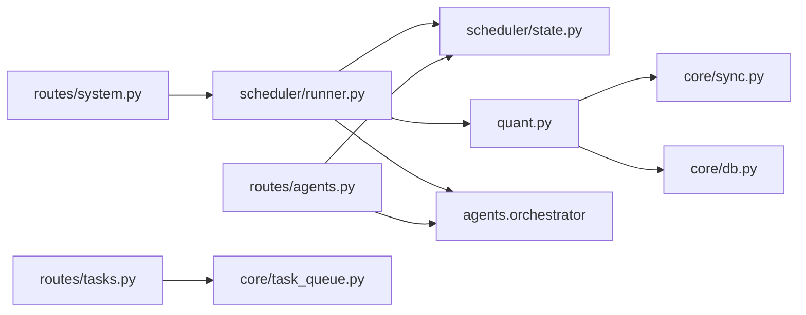

# 定时任务调度

<cite>
**本文引用的文件**
- [scheduler/runner.py](file://scheduler/runner.py)
- [scheduler/state.py](file://scheduler/state.py)
- [routes/system.py](file://routes/system.py)
- [routes/agents.py](file://routes/agents.py)
- [quant.py](file://quant.py)
- [core/db.py](file://core/db.py)
- [core/sync.py](file://core/sync.py)
- [core/task_queue.py](file://core/task_queue.py)
- [routes/tasks.py](file://routes/tasks.py)
- [ministries/works/monitor.py](file://ministries/works/monitor.py)
- [app.py](file://app.py)
</cite>

## 目录
1. [简介](#简介)
2. [项目结构](#项目结构)
3. [核心组件](#核心组件)
4. [架构总览](#架构总览)
5. [详细组件分析](#详细组件分析)
6. [依赖分析](#依赖分析)
7. [性能考虑](#性能考虑)
8. [故障排查指南](#故障排查指南)
9. [结论](#结论)
10. [附录](#附录)

## 简介
本文件面向“定时任务调度系统”的技术文档，聚焦基于 schedule 库的任务调度实现，涵盖任务注册、执行时机与调度策略；定时任务的状态管理（执行状态、暂停/恢复、异常处理）；配置管理（执行时间、频率、条件触发）；性能优化（任务去重、资源限制、执行效率）；监控与日志（执行统计、性能指标、故障诊断）；以及在量化系统中的关键作用（数据同步、策略扫描、系统维护自动化）。同时提供扩展方案（动态任务添加、任务依赖、批量任务管理）。

## 项目结构
定时任务调度涉及以下关键模块：
- 调度器与作业封装：scheduler/runner.py
- 调度状态管理：scheduler/state.py
- 系统路由（手动触发与状态查询）：routes/system.py
- 多Agent流水线路由：routes/agents.py
- 量化核心扫描与同步逻辑：quant.py
- 数据库与同步工具：core/db.py、core/sync.py
- 通用任务队列（异步任务）：core/task_queue.py、routes/tasks.py
- 系统监控与健康检查：ministries/works/monitor.py
- 应用入口与蓝图注册：app.py

**图表来源**
- [scheduler/runner.py:158-182](file://scheduler/runner.py#L158-L182)
- [scheduler/state.py:5-21](file://scheduler/state.py#L5-L21)
- [routes/system.py:7-9](file://routes/system.py#L7-L9)
- [routes/agents.py:14-16](file://routes/agents.py#L14-L16)
- [quant.py:433-546](file://quant.py#L433-L546)
- [core/sync.py:39-59](file://core/sync.py#L39-L59)
- [core/db.py:26-39](file://core/db.py#L26-L39)
- [core/task_queue.py:51-99](file://core/task_queue.py#L51-L99)
- [ministries/works/monitor.py:29-60](file://ministries/works/monitor.py#L29-L60)
- [app.py:39-72](file://app.py#L39-L72)

**章节来源**
- [scheduler/runner.py:158-182](file://scheduler/runner.py#L158-L182)
- [scheduler/state.py:5-21](file://scheduler/state.py#L5-L21)
- [routes/system.py:7-9](file://routes/system.py#L7-L9)
- [routes/agents.py:14-16](file://routes/agents.py#L14-L16)
- [quant.py:433-546](file://quant.py#L433-L546)
- [core/sync.py:39-59](file://core/sync.py#L39-L59)
- [core/db.py:26-39](file://core/db.py#L26-L39)
- [core/task_queue.py:51-99](file://core/task_queue.py#L51-L99)
- [ministries/works/monitor.py:29-60](file://ministries/works/monitor.py#L29-L60)
- [app.py:39-72](file://app.py#L39-L72)

## 核心组件
- 调度器与作业封装（scheduler/runner.py）
  - 提供传统模式与多Agent流水线模式的定时任务注册与执行。
  - 通过 schedule 库在后台线程中周期性检查并执行待处理任务。
  - 作业包装器负责状态标记与线程隔离，避免重复执行。
- 调度状态管理（scheduler/state.py）
  - 维护同步/扫描状态、调度器运行状态、流水线状态与各Agent实时状态。
  - 提供更新流水线状态的统一入口，便于监控与调试。
- 系统路由（routes/system.py）
  - 对外暴露手动触发同步/扫描、查询状态、启停定时调度的HTTP接口。
  - 与调度器状态共享，实现REST驱动的调度控制。
- 多Agent流水线路由（routes/agents.py）
  - 提供流水线状态查询、手动触发完整流水线与单Agent执行、历史查询等。
  - 与调度器状态联动，支持流水线模式下的状态可视化。
- 量化核心（quant.py）
  - 实际扫描与同步逻辑的实现者，包含策略扫描、信号保存、历史回填等功能。
  - 传统模式下也注册了基于 schedule 的定时任务。
- 数据库与同步工具（core/db.py、core/sync.py）
  - 数据库连接管理、表结构初始化与常用查询。
  - 同步工具提供交易日判断、收盘后判断、指数同步等能力。
- 通用任务队列（core/task_queue.py、routes/tasks.py）
  - 提供异步任务提交、状态跟踪、结果查询、统计与清理。
  - 适用于回测、批量评分等长耗时任务的解耦执行。
- 系统监控（ministries/works/monitor.py）
  - 收集CPU/内存/磁盘/数据库大小等指标，支持告警与状态摘要。
- 应用入口（app.py）
  - 蓝图注册与全局路由，承载调度器与任务队列的HTTP接口。

**章节来源**
- [scheduler/runner.py:186-212](file://scheduler/runner.py#L186-L212)
- [scheduler/state.py:24-45](file://scheduler/state.py#L24-L45)
- [routes/system.py:12-83](file://routes/system.py#L12-L83)
- [routes/agents.py:22-48](file://routes/agents.py#L22-L48)
- [quant.py:433-546](file://quant.py#L433-L546)
- [core/db.py:26-39](file://core/db.py#L26-L39)
- [core/sync.py:39-59](file://core/sync.py#L39-L59)
- [core/task_queue.py:51-99](file://core/task_queue.py#L51-L99)
- [routes/tasks.py:93-113](file://routes/tasks.py#L93-L113)
- [ministries/works/monitor.py:36-60](file://ministries/works/monitor.py#L36-L60)
- [app.py:39-72](file://app.py#L39-L72)

## 架构总览
定时任务调度采用“调度器 + 作业封装 + 状态管理 + 接口路由”的分层设计。调度器在后台线程中轮询 schedule 队列，根据时间触发对应作业；作业在独立线程中执行，避免阻塞调度循环；状态通过共享字典进行管理，并通过HTTP接口对外暴露。

**图表来源**
- [scheduler/runner.py:160-163](file://scheduler/runner.py#L160-L163)
- [scheduler/runner.py:186-212](file://scheduler/runner.py#L186-L212)
- [scheduler/state.py:6-7](file://scheduler/state.py#L6-L7)

**章节来源**
- [scheduler/runner.py:158-182](file://scheduler/runner.py#L158-L182)
- [scheduler/runner.py:186-212](file://scheduler/runner.py#L186-L212)
- [scheduler/state.py:6-7](file://scheduler/state.py#L6-L7)

## 详细组件分析

### 调度器与作业封装（scheduler/runner.py）
- 两种模式
  - 传统模式：07:00 数据同步，09:00 策略扫描。
  - 多Agent流水线模式：07:30 预同步DataAgent，09:00 完整流水线。
- 作业包装器
  - _job_sync/_job_scan/_job_data_agent/_job_pipeline：检查状态后启动独立线程执行。
  - 避免重复执行：若正在运行则直接返回。
- 调度器启动
  - 清空旧任务，按模式注册每日固定时间点的任务。
  - 启动守护线程持续调用 schedule.run_pending()。

**图表来源**
- [scheduler/runner.py:165-181](file://scheduler/runner.py#L165-L181)

**章节来源**
- [scheduler/runner.py:165-181](file://scheduler/runner.py#L165-L181)
- [scheduler/runner.py:186-212](file://scheduler/runner.py#L186-L212)

### 状态管理（scheduler/state.py）
- 传统模式状态
  - SYNC_STATUS：同步执行状态、最后时间、最后结果。
  - SCAN_STATUS：扫描执行状态、最后时间、最后结果。
  - SCHEDULER_RUNNING/SCHEDULER_THREAD：调度器开关与线程句柄。
- 流水线模式状态
  - PIPELINE_STATUS：流水线运行开关、最近ID、最近时间、最近结果、各Agent状态。
  - update_pipeline_status：原子性更新流水线状态（线程安全由调用方保证）。

**图表来源**
- [scheduler/state.py:6-21](file://scheduler/state.py#L6-L21)

**章节来源**
- [scheduler/state.py:6-21](file://scheduler/state.py#L6-L21)
- [scheduler/state.py:24-45](file://scheduler/state.py#L24-L45)

### 接口路由（routes/system.py）
- /api/system/sync：手动触发数据同步（异步后台执行），防重复。
- /api/system/scan：手动触发策略扫描（支持force_recalc/use_v4参数）。
- /api/system/status：查询同步/扫描/调度器状态。
- /api/system/scheduler：启停定时调度器。
- /api/system/auto_check：页面加载时自动检查是否需要扫描。

**图表来源**
- [routes/system.py:12-21](file://routes/system.py#L12-L21)
- [scheduler/runner.py:29-87](file://scheduler/runner.py#L29-L87)
- [scheduler/state.py:6-7](file://scheduler/state.py#L6-L7)

**章节来源**
- [routes/system.py:12-83](file://routes/system.py#L12-L83)

### 多Agent流水线路由（routes/agents.py）
- /api/agents/status：查询流水线运行状态与当前Agent状态。
- /api/agents/run：手动触发完整流水线。
- /api/agents/run/<name>：手动触发单个Agent。
- /api/agents/history：查询最近执行历史。
- /api/agents/report：查看最新报告。
- /api/agents/governance：查看流水线架构信息。

**章节来源**
- [routes/agents.py:22-127](file://routes/agents.py#L22-L127)

### 量化核心（quant.py）
- scan_job：策略扫描任务（支持v4与5策略融合），包含强制重算、回填历史推荐、保存信号与消息构建。
- sync_job：每日收盘后同步任务，包含缓存清理。
- 传统模式注册：在独立脚本中注册07:00同步与09:00扫描。

**图表来源**
- [quant.py:433-546](file://quant.py#L433-L546)
- [quant.py:289-337](file://quant.py#L289-L337)

**章节来源**
- [quant.py:433-546](file://quant.py#L433-L546)
- [quant.py:552-567](file://quant.py#L552-L567)

### 数据库与同步工具（core/db.py、core/sync.py）
- 数据库连接管理：上下文管理器、WAL模式、超时与回滚。
- 同步工具：交易日判断、收盘后判断、指数同步、股票列表更新等。

**章节来源**
- [core/db.py:26-39](file://core/db.py#L26-L39)
- [core/sync.py:39-59](file://core/sync.py#L39-L59)

### 通用任务队列（core/task_queue.py、routes/tasks.py）
- 任务对象：id/name/fn/args/kwargs/status/result/error/时间戳/进度。
- 队列：线程池执行、状态跟踪、回调通知、统计与清理。
- 路由：提交任务、查询任务、取消任务、清理完成任务、统计。

**图表来源**
- [core/task_queue.py:34-49](file://core/task_queue.py#L34-L49)
- [core/task_queue.py:51-99](file://core/task_queue.py#L51-L99)

**章节来源**
- [core/task_queue.py:51-99](file://core/task_queue.py#L51-L99)
- [routes/tasks.py:93-113](file://routes/tasks.py#L93-L113)

### 系统监控（ministries/works/monitor.py）
- 指标采集：CPU/内存/磁盘/数据库大小/活动连接/挂单数/1小时错误数。
- 告警检查：超过阈值产生警告/严重告警。
- 状态摘要：健康状态与最新指标。

**章节来源**
- [ministries/works/monitor.py:36-101](file://ministries/works/monitor.py#L36-L101)

## 依赖分析
- 调度器依赖
  - scheduler/runner.py 依赖 scheduler/state.py 的状态字典。
  - 传统模式依赖 quant.py 的 scan_job/sync_job。
  - 流水线模式依赖 agents.orchestrator 的 run_pipeline/run_single。
- 接口层依赖
  - routes/system.py 依赖 scheduler/runner.py 的 run_*Blocking 与 start_scheduler。
  - routes/agents.py 依赖 agents.orchestrator 与 scheduler/state.py 的 PIPELINE_STATUS。
- 业务层依赖
  - quant.py 依赖 core/sync.py 与 core/db.py 的数据库/同步工具。
- 任务队列依赖
  - routes/tasks.py 依赖 core/task_queue.py 的 TaskQueue。

**图表来源**
- [scheduler/runner.py:17-20](file://scheduler/runner.py#L17-L20)
- [routes/system.py:8-9](file://routes/system.py#L8-L9)
- [routes/agents.py:14-16](file://routes/agents.py#L14-L16)
- [quant.py:23-25](file://quant.py#L23-L25)
- [routes/tasks.py:15](file://routes/tasks.py#L15)

**章节来源**
- [scheduler/runner.py:17-20](file://scheduler/runner.py#L17-L20)
- [routes/system.py:8-9](file://routes/system.py#L8-L9)
- [routes/agents.py:14-16](file://routes/agents.py#L14-L16)
- [quant.py:23-25](file://quant.py#L23-L25)
- [routes/tasks.py:15](file://routes/tasks.py#L15)

## 性能考虑
- 任务去重
  - 作业包装器在启动前检查 running 状态，避免重复执行。
- 资源限制
  - 传统模式使用独立线程执行，避免阻塞调度循环。
  - 任务队列使用线程池，max_workers 控制并发度。
- 执行效率
  - schedule.run_pending() 每60秒检查一次，降低CPU占用。
  - 数据同步按交易日与收盘后判断，减少无效请求。
  - 指数同步与股票列表更新采用批量处理与并发。
- I/O与数据库
  - 数据库连接使用上下文管理器与WAL模式，提升并发写入性能。
- 监控与告警
  - 系统监控定期采集指标，及时发现资源瓶颈。

**章节来源**
- [scheduler/runner.py:186-212](file://scheduler/runner.py#L186-L212)
- [core/task_queue.py:54-56](file://core/task_queue.py#L54-L56)
- [scheduler/runner.py:160-163](file://scheduler/runner.py#L160-L163)
- [core/sync.py:39-59](file://core/sync.py#L39-L59)
- [core/db.py:26-39](file://core/db.py#L26-L39)
- [ministries/works/monitor.py:36-60](file://ministries/works/monitor.py#L36-L60)

## 故障排查指南
- 常见问题
  - 同步/扫描未执行：检查调度器开关与时间点是否正确注册。
  - 重复执行：确认作业包装器的 running 状态检查逻辑。
  - 手动触发失败：查看接口返回的错误信息（如“正在运行”）。
  - 数据库异常：检查连接超时与事务回滚机制。
- 排查步骤
  - 通过 /api/system/status 与 /api/agents/status 查看状态。
  - 检查调度器线程是否存活与 enabled 状态。
  - 关注 quant.py 的 scan_job/sync_job 输出与异常堆栈。
  - 使用系统监控接口获取CPU/内存/磁盘使用情况。
- 日志与追踪
  - 作业执行过程中的异常会被捕获并记录到状态 last_result。
  - 任务队列提供任务状态与错误信息，便于定位失败原因。

**章节来源**
- [routes/system.py:46-83](file://routes/system.py#L46-L83)
- [routes/agents.py:22-48](file://routes/agents.py#L22-L48)
- [scheduler/runner.py:29-87](file://scheduler/runner.py#L29-L87)
- [quant.py:433-546](file://quant.py#L433-L546)
- [ministries/works/monitor.py:62-101](file://ministries/works/monitor.py#L62-L101)

## 结论
该定时任务调度系统以 schedule 库为核心，结合进程内状态管理与HTTP接口，实现了稳定可靠的自动化执行。系统支持传统模式与多Agent流水线模式，具备良好的扩展性与可观测性。通过任务去重、线程隔离与资源限制，保障了执行效率与稳定性。配合任务队列与系统监控，能够满足量化系统中数据同步、策略扫描与系统维护等关键任务的自动化需求。

## 附录
- 配置与扩展建议
  - 动态任务添加：可在调度器启动时动态注册 schedule 任务，注意状态管理与线程安全。
  - 任务依赖：通过任务队列与状态管理实现依赖链路（如先DataAgent再流水线）。
  - 批量任务管理：利用任务队列的批量提交与统计接口，统一管理长耗时任务。
  - 条件触发：在作业包装器中加入更多前置条件（如交易日、收盘后、数据新鲜度）。
  - 频率控制：通过环境变量或配置中心调整执行时间与并发度。