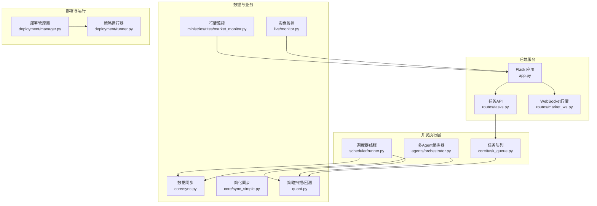
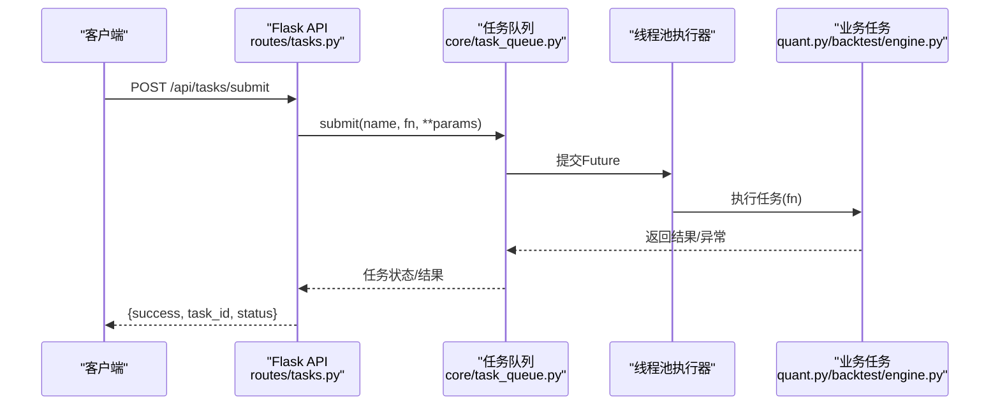
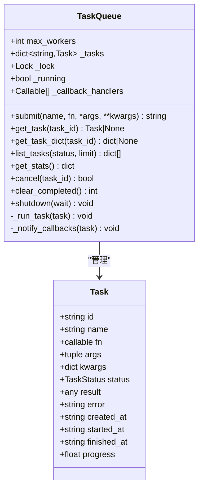
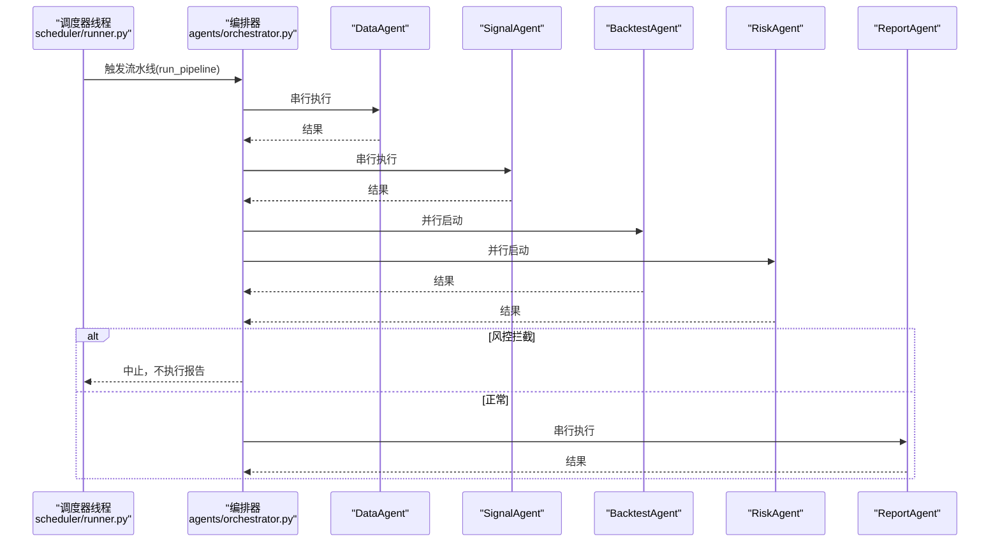
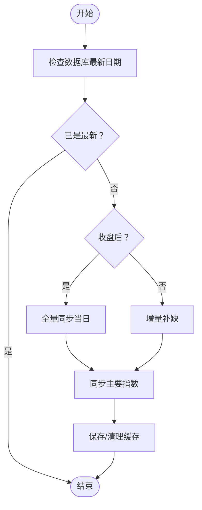
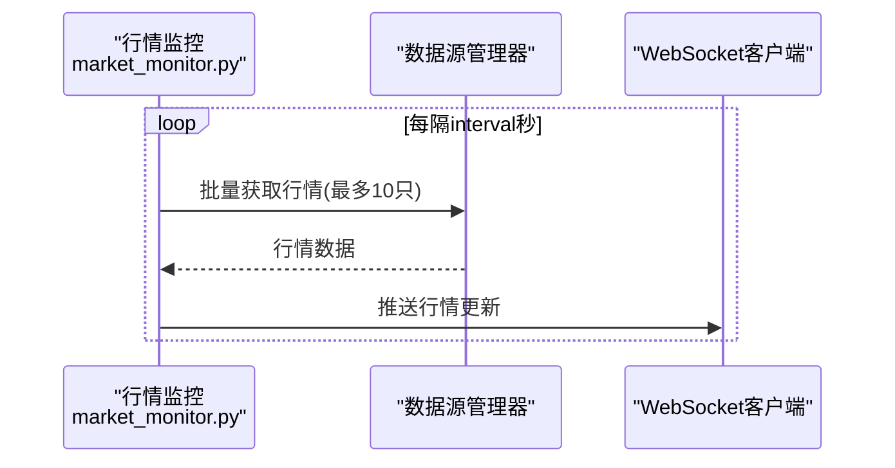
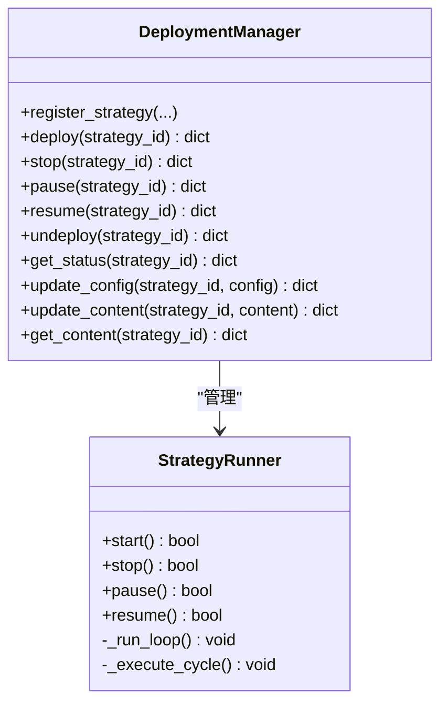
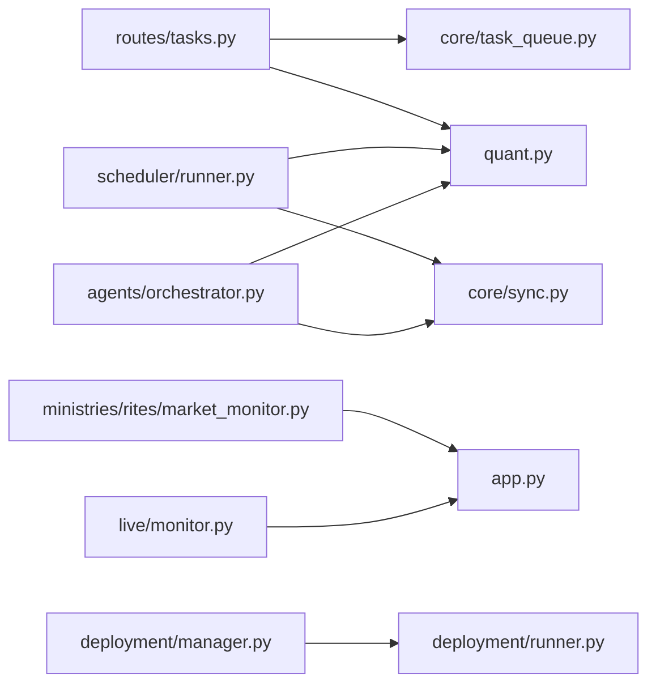

# 并发处理

<cite>
**本文引用的文件**
- [core/task_queue.py](file://core/task_queue.py)
- [routes/tasks.py](file://routes/tasks.py)
- [scheduler/runner.py](file://scheduler/runner.py)
- [scheduler/state.py](file://scheduler/state.py)
- [agents/orchestrator.py](file://agents/orchestrator.py)
- [core/sync.py](file://core/sync.py)
- [core/sync_simple.py](file://core/sync_simple.py)
- [quant.py](file://quant.py)
- [app.py](file://app.py)
- [ministries/rites/market_monitor.py](file://ministries/rites/market_monitor.py)
- [live/monitor.py](file://live/monitor.py)
- [deployment/manager.py](file://deployment/manager.py)
- [deployment/runner.py](file://deployment/runner.py)
</cite>

## 目录
1. [引言](#引言)
2. [项目结构](#项目结构)
3. [核心组件](#核心组件)
4. [架构总览](#架构总览)
5. [详细组件分析](#详细组件分析)
6. [依赖分析](#依赖分析)
7. [性能考量](#性能考量)
8. [故障排查指南](#故障排查指南)
9. [结论](#结论)
10. [附录](#附录)

## 引言
本文件面向AIQuant系统的并发处理能力，系统性梳理了多线程编程、异步任务队列、定时调度、生产者-消费者模式、并发数据结构与锁机制、以及性能测试与调优策略，并给出分布式与集群化扩展建议。目标是帮助开发者在量化场景下构建稳定、可扩展、可观测的并发体系。

## 项目结构
AIQuant采用“后端API + 定时调度 + 多Agent流水线 + 实时监控”的分层架构，结合轻量线程池与线程安全容器，支撑数据同步、策略扫描、回测、实时行情推送与实盘监控等高并发需求。

图表来源
- [app.py:148-164](file://app.py#L148-L164)
- [scheduler/runner.py:158-182](file://scheduler/runner.py#L158-L182)
- [agents/orchestrator.py:81-175](file://agents/orchestrator.py#L81-L175)
- [core/task_queue.py:51-82](file://core/task_queue.py#L51-L82)
- [core/sync.py:462-469](file://core/sync.py#L462-L469)
- [core/sync_simple.py:24-90](file://core/sync_simple.py#L24-L90)
- [quant.py:433-546](file://quant.py#L433-L546)
- [ministries/rites/market_monitor.py:108-131](file://ministries/rites/market_monitor.py#L108-L131)
- [live/monitor.py:70-98](file://live/monitor.py#L70-L98)
- [deployment/manager.py:24-130](file://deployment/manager.py#L24-L130)
- [deployment/runner.py:69-135](file://deployment/runner.py#L69-L135)

章节来源
- [app.py:148-164](file://app.py#L148-L164)
- [scheduler/runner.py:158-182](file://scheduler/runner.py#L158-L182)
- [agents/orchestrator.py:81-175](file://agents/orchestrator.py#L81-L175)
- [core/task_queue.py:51-82](file://core/task_queue.py#L51-L82)
- [core/sync.py:462-469](file://core/sync.py#L462-L469)
- [core/sync_simple.py:24-90](file://core/sync_simple.py#L24-L90)
- [quant.py:433-546](file://quant.py#L433-L546)
- [ministries/rites/market_monitor.py:108-131](file://ministries/rites/market_monitor.py#L108-L131)
- [live/monitor.py:70-98](file://live/monitor.py#L70-L98)
- [deployment/manager.py:24-130](file://deployment/manager.py#L24-L130)
- [deployment/runner.py:69-135](file://deployment/runner.py#L69-L135)

## 核心组件
- 任务队列与异步执行：基于线程池的轻量任务队列，支持任务提交、状态跟踪、回调与清理。
- 定时调度器：基于后台线程与调度库，支持传统模式与多Agent流水线模式。
- 多Agent编排器：串行/并行组合，带状态持久化与错误处理。
- 数据同步：支持历史初始化与增量同步，兼顾线程安全与断点续传。
- 实时监控：行情推送与实盘监控，线程安全容器与锁保护。
- 部署与运行：策略注册、启动/停止/暂停/恢复与状态持久化。

章节来源
- [core/task_queue.py:51-171](file://core/task_queue.py#L51-L171)
- [scheduler/runner.py:158-212](file://scheduler/runner.py#L158-L212)
- [agents/orchestrator.py:36-175](file://agents/orchestrator.py#L36-L175)
- [core/sync.py:319-389](file://core/sync.py#L319-L389)
- [ministries/rites/market_monitor.py:21-131](file://ministries/rites/market_monitor.py#L21-L131)
- [live/monitor.py:55-98](file://live/monitor.py#L55-L98)
- [deployment/manager.py:24-130](file://deployment/manager.py#L24-L130)
- [deployment/runner.py:69-135](file://deployment/runner.py#L69-L135)

## 架构总览
系统通过API路由接入任务队列与调度器，利用线程池与线程安全容器实现高并发任务执行；定时器驱动数据同步与策略扫描；多Agent编排器串联数据准备、信号生成、风控与报告；实时监控保障交易过程中的可观测性。

图表来源
- [routes/tasks.py:93-113](file://routes/tasks.py#L93-L113)
- [core/task_queue.py:64-82](file://core/task_queue.py#L64-L82)
- [core/task_queue.py:84-98](file://core/task_queue.py#L84-L98)
- [quant.py:33-37](file://quant.py#L33-L37)

章节来源
- [routes/tasks.py:93-113](file://routes/tasks.py#L93-L113)
- [core/task_queue.py:64-98](file://core/task_queue.py#L64-L98)
- [quant.py:33-37](file://quant.py#L33-L37)

## 详细组件分析

### 任务队列与异步执行
- 设计要点
  - 任务对象包含状态、结果、错误、时间戳与进度字段，便于追踪与统计。
  - 使用线程池执行器承载并发任务，避免主线程阻塞。
  - 通过全局锁保护共享状态（任务字典、回调列表），确保线程安全。
  - 支持任务取消（仅对待执行）、清理已完成任务、回调通知与统计查询。
- 关键流程
  - 提交：生成任务ID，写入任务字典，提交至线程池。
  - 执行：切换状态为运行，捕获异常并记录，最终回调通知。
  - 查询：支持按ID、按状态、按时间排序与限制数量。
  - 控制：取消、清理、关闭。
- 并发与锁
  - 所有对外读写（任务字典、回调列表）均在锁内进行。
  - 线程池大小可配置，避免过度竞争与资源耗尽。

图表来源
- [core/task_queue.py:25-49](file://core/task_queue.py#L25-L49)
- [core/task_queue.py:51-171](file://core/task_queue.py#L51-L171)

章节来源
- [core/task_queue.py:51-171](file://core/task_queue.py#L51-L171)

### 定时调度器与多Agent流水线
- 定时调度器
  - 后台线程循环检查定时任务，避免阻塞主线程。
  - 支持传统模式（同步/扫描）与流水线模式（DataAgent → SignalAgent → 并行 Backtest/Risk → ReportAgent）。
  - 状态通过进程内字典维护，注意跨线程访问需加锁。
- 多Agent编排器
  - 串行阶段：DataAgent → SignalAgent。
  - 并行阶段：BacktestAgent 与 RiskAgent 并行执行。
  - 风控拦截：若RiskAgent判定为Block，则跳过报告阶段。
  - 线程安全：编排器内部使用锁保护运行状态与历史记录。

图表来源
- [scheduler/runner.py:108-137](file://scheduler/runner.py#L108-L137)
- [agents/orchestrator.py:81-175](file://agents/orchestrator.py#L81-L175)

章节来源
- [scheduler/runner.py:158-212](file://scheduler/runner.py#L158-L212)
- [agents/orchestrator.py:81-175](file://agents/orchestrator.py#L81-L175)

### 数据同步与线程安全
- 历史初始化与增量同步
  - 历史初始化：批量股票、批次间隔与基础间隔，支持断点续传与缓存。
  - 增量同步：每日收盘后全量当日，盘中增量补缺；baostock单线程限制，采用登录/登出与缓存策略。
- 线程安全
  - 同步缓存使用文件存储，避免多线程共享状态；异常时保留缓存以支持断点续传。
  - 过滤规则与跳过逻辑在多处使用，减少无效请求。

图表来源
- [core/sync.py:462-469](file://core/sync.py#L462-L469)
- [core/sync.py:548-668](file://core/sync.py#L548-L668)
- [core/sync.py:422-450](file://core/sync.py#L422-L450)

章节来源
- [core/sync.py:319-389](file://core/sync.py#L319-L389)
- [core/sync.py:462-469](file://core/sync.py#L462-L469)
- [core/sync.py:548-668](file://core/sync.py#L548-L668)

### 实时监控与生产者-消费者模式
- 行情监控（生产者-消费者）
  - 生产者：定时拉取行情，批量获取并推送。
  - 消费者：WebSocket客户端订阅，按股票分发。
  - 线程安全：客户端与订阅表在锁内更新；批量拉取避免过载。
- 实盘监控（消费者）
  - 定时扫描持仓，检查止损/止盈/异动阈值，触发告警并回调处理。
  - 线程安全：告警列表与计数在锁内维护，回调异常隔离。

图表来源
- [ministries/rites/market_monitor.py:124-151](file://ministries/rites/market_monitor.py#L124-L151)
- [ministries/rites/market_monitor.py:175-193](file://ministries/rites/market_monitor.py#L175-L193)

章节来源
- [ministries/rites/market_monitor.py:108-131](file://ministries/rites/market_monitor.py#L108-L131)
- [ministries/rites/market_monitor.py:133-193](file://ministries/rites/market_monitor.py#L133-L193)
- [live/monitor.py:70-98](file://live/monitor.py#L70-L98)
- [live/monitor.py:158-186](file://live/monitor.py#L158-L186)

### 部署与运行（策略生命周期）
- 部署管理器
  - 注册/部署/停止/暂停/恢复/注销策略，持久化部署记录。
  - 线程安全：内部状态与记录文件访问需考虑并发。
- 策略运行器
  - 启动/停止/暂停/恢复策略运行线程，异常处理与统计。
  - 线程安全：状态切换与日志在锁内更新。

图表来源
- [deployment/manager.py:24-130](file://deployment/manager.py#L24-L130)
- [deployment/runner.py:69-135](file://deployment/runner.py#L69-L135)

章节来源
- [deployment/manager.py:24-130](file://deployment/manager.py#L24-L130)
- [deployment/runner.py:69-135](file://deployment/runner.py#L69-L135)

## 依赖分析
- 组件耦合
  - API层依赖任务队列与调度器；调度器依赖数据同步与策略扫描；编排器依赖Agent实现；监控依赖数据源与订单管理。
- 外部依赖
  - schedule（定时）、flask/flask-sock（HTTP/WebSocket）、akshare/baostock（行情数据）、pandas（数据处理）。
- 潜在环路
  - 未发现直接循环导入；API与业务模块通过函数调用解耦。

图表来源
- [routes/tasks.py:15-18](file://routes/tasks.py#L15-L18)
- [core/task_queue.py:54-58](file://core/task_queue.py#L54-L58)
- [scheduler/runner.py:32-36](file://scheduler/runner.py#L32-L36)
- [agents/orchestrator.py:181-211](file://agents/orchestrator.py#L181-L211)
- [ministries/rites/market_monitor.py:34](file://ministries/rites/market_monitor.py#L34)
- [live/monitor.py:20-21](file://live/monitor.py#L20-L21)
- [deployment/manager.py:17](file://deployment/manager.py#L17)
- [deployment/runner.py:59-62](file://deployment/runner.py#L59-L62)

章节来源
- [routes/tasks.py:15-18](file://routes/tasks.py#L15-L18)
- [core/task_queue.py:54-58](file://core/task_queue.py#L54-L58)
- [scheduler/runner.py:32-36](file://scheduler/runner.py#L32-L36)
- [agents/orchestrator.py:181-211](file://agents/orchestrator.py#L181-L211)
- [ministries/rites/market_monitor.py:34](file://ministries/rites/market_monitor.py#L34)
- [live/monitor.py:20-21](file://live/monitor.py#L20-L21)
- [deployment/manager.py:17](file://deployment/manager.py#L17)
- [deployment/runner.py:59-62](file://deployment/runner.py#L59-L62)

## 性能考量
- 线程池与并发度
  - 任务队列默认工作线程数可调；根据CPU核数与IO密集程度选择合适上限，避免过多上下文切换。
  - 数据同步中批量与批次间隔控制，平衡吞吐与限流。
- 锁粒度与争用
  - 任务队列与监控器均使用细粒度锁保护共享状态；尽量缩短持有时间，避免在锁内做耗时操作。
- 资源限制与背压
  - 行情推送限制批量大小（每次最多10只），避免瞬时过载。
  - 实盘监控告警计数限制单股告警频率，防止风暴。
- 统计与可观测性
  - 任务队列提供统计接口；调度状态与流水线状态可查询；建议增加指标上报与日志采样。

[本节为通用指导，无需特定文件引用]

## 故障排查指南
- 任务队列
  - 任务长时间Pending：检查max_workers是否过小或任务阻塞；查看统计与回调异常。
  - 任务取消失败：仅待执行任务可取消。
- 定时调度
  - 任务重复执行：确认状态标记与线程安全；检查调度线程是否存活。
- 数据同步
  - baostock单线程限制：登录/登出需在任务内独立执行；缓存失败时检查磁盘权限。
- 实时监控
  - WebSocket推送失败：检查连接状态与发送异常；确认订阅表一致性。
- 部署运行
  - 策略状态不一致：检查启动/停止/暂停流程与锁保护；查看运行日志。

章节来源
- [core/task_queue.py:142-150](file://core/task_queue.py#L142-L150)
- [scheduler/runner.py:186-212](file://scheduler/runner.py#L186-L212)
- [core/sync.py:240-246](file://core/sync.py#L240-L246)
- [ministries/rites/market_monitor.py:186-193](file://ministries/rites/market_monitor.py#L186-L193)
- [deployment/runner.py:111-135](file://deployment/runner.py#L111-L135)

## 结论
AIQuant在并发处理方面采用“线程池 + 线程安全容器 + 定时调度 + 多Agent编排”的组合，既满足量化场景的高吞吐需求，又保持良好的可观测性与可维护性。建议在生产环境中进一步完善指标采集、限流与熔断、以及分布式扩展方案。

[本节为总结，无需特定文件引用]

## 附录

### 并发最佳实践清单
- 线程安全
  - 共享状态使用锁保护；避免在锁内执行IO或长耗时操作。
  - 使用不可变数据结构或线程局部存储减少锁争用。
- 锁机制与死锁预防
  - 统一锁顺序；避免嵌套锁；必要时使用超时与重试。
  - 优先使用高级并发原语（如线程池、队列）替代裸锁。
- 异步与协程
  - Python标准库偏向线程池与事件循环；协程适用于IO密集型（如WebSocket）。
  - 对于阻塞IO，优先线程池；对于高并发网络请求，可考虑异步框架。
- 任务队列与工作池
  - 任务粒度适中；避免过大导致饥饿；合理设置队列长度与超时。
  - 负载均衡：按CPU/IO特性分配不同类型任务；监控队列长度与执行时延。
- 定时任务调度
  - 任务优先级：紧急任务独立线程；普通任务合并调度。
  - 资源限制：CPU/内存/网络带宽；动态调整并发度。
  - 动态调整：根据历史执行时延与系统负载自适应。
- 并发数据结构
  - 选择线程安全集合（如队列、堆）；避免共享可变对象。
  - 原子操作：使用内置原子类型或锁保护；减少竞态。
- 生产者-消费者
  - 缓冲区管理：固定大小队列 + 背压；消费者失败重试。
  - 吞吐量优化：批量拉取/推送、批处理、异步回调。
- 性能测试与调优
  - 压力测试：逐步提升并发度，观察延迟与错误率。
  - 瓶颈分析：CPU/IO/锁争用/网络；定位热点函数与锁竞争。
  - 调优策略：线程池大小、批处理大小、缓存策略、限流与熔断。
- 分布式与集群
  - 任务分发：中心化/去中心化；一致性哈希与重试。
  - 状态共享：Redis/数据库；注意序列化与版本兼容。
  - 可观测性：统一指标、日志与追踪；告警与自愈。

[本节为通用指导，无需特定文件引用]