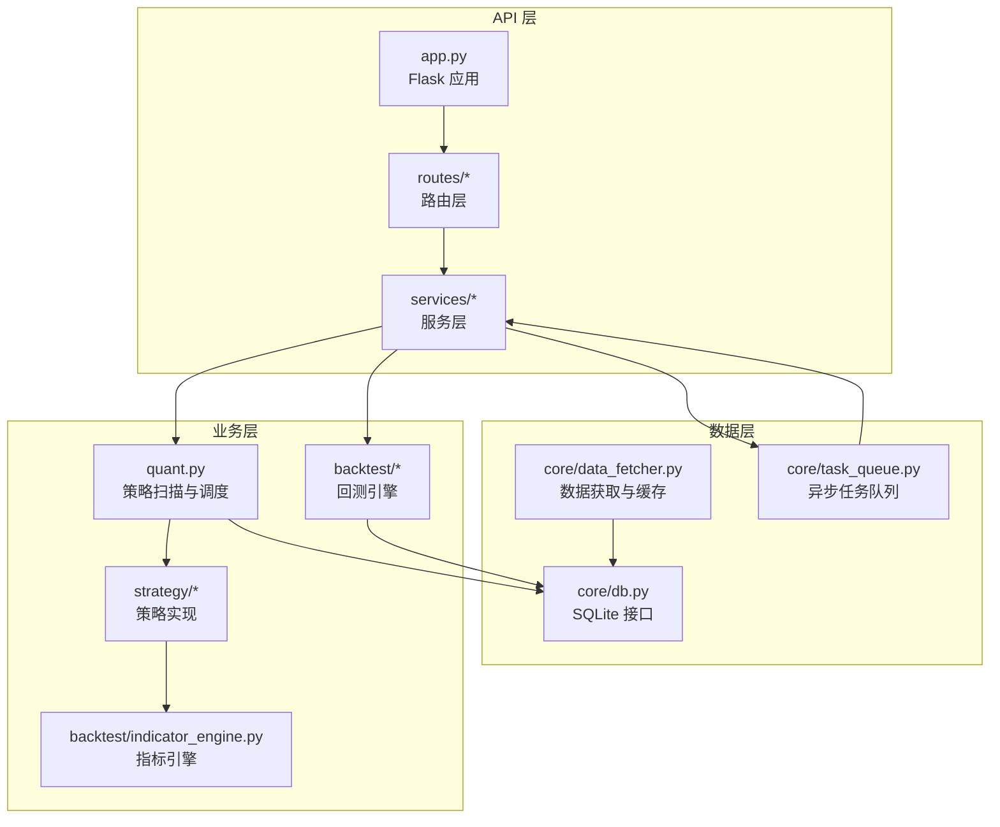
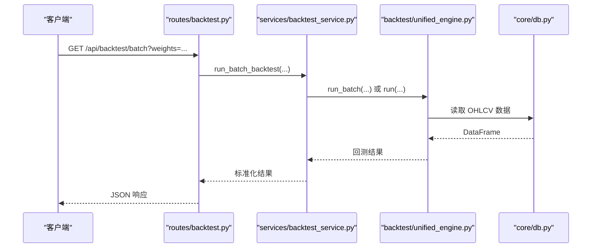
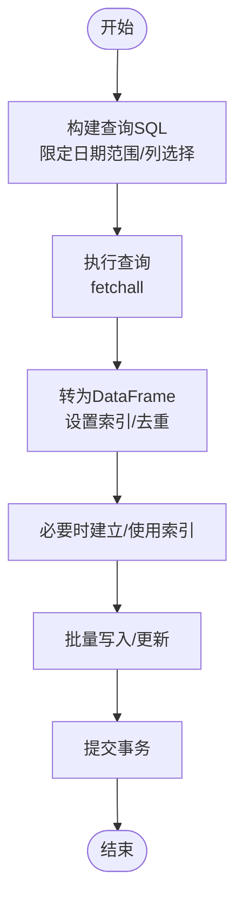
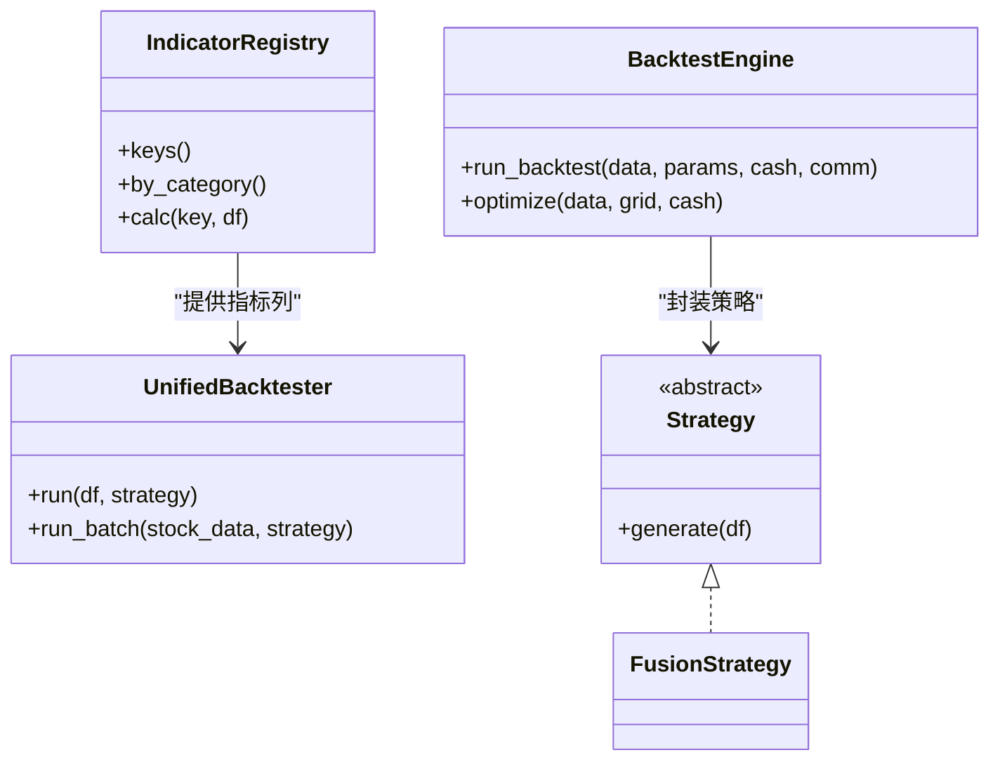
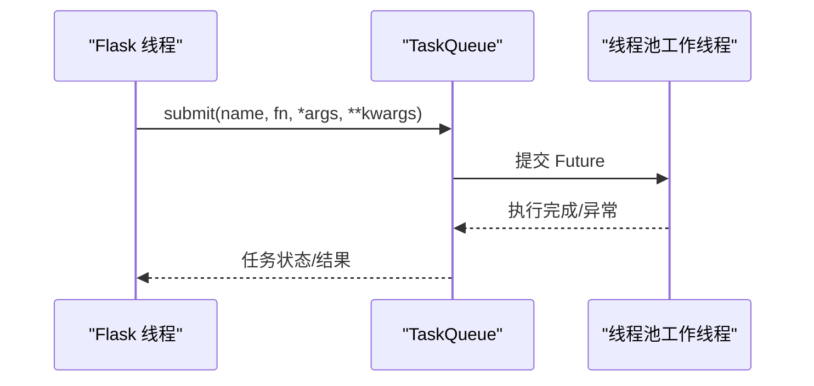
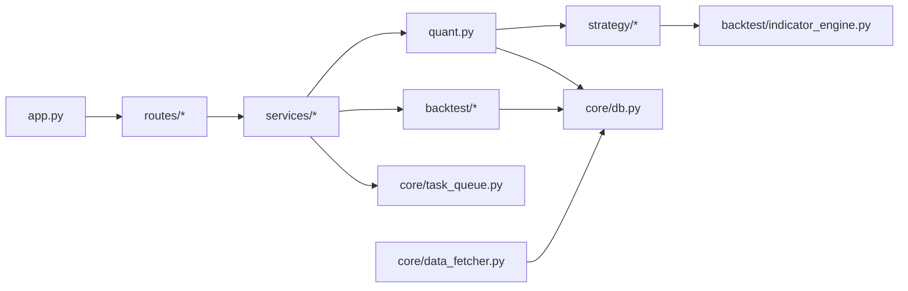

# 性能优化

<cite>
**本文引用的文件**
- [app.py](file://app.py)
- [quant.py](file://quant.py)
- [core/db.py](file://core/db.py)
- [core/data_fetcher.py](file://core/data_fetcher.py)
- [strategy/strategies.py](file://strategy/strategies.py)
- [backtest/indicator_engine.py](file://backtest/indicator_engine.py)
- [backtest/engine.py](file://backtest/engine.py)
- [backtest/unified_engine.py](file://backtest/unified_engine.py)
- [services/backtest_service.py](file://services/backtest_service.py)
- [routes/backtest.py](file://routes/backtest.py)
- [core/task_queue.py](file://core/task_queue.py)
- [config/settings.py](file://config/settings.py)
- [docs/architecture_review.md](file://docs/architecture_review.md)
</cite>

## 目录
1. [简介](#简介)
2. [项目结构](#项目结构)
3. [核心组件](#核心组件)
4. [架构总览](#架构总览)
5. [详细组件分析](#详细组件分析)
6. [依赖关系分析](#依赖关系分析)
7. [性能考量](#性能考量)
8. [故障排查指南](#故障排查指南)
9. [结论](#结论)
10. [附录](#附录)

## 简介
本文件面向性能工程师，系统梳理 AIQuant 量化系统在数据库、算法、内存与并发方面的性能优化策略与落地方法。内容覆盖：
- 数据库优化：查询优化、索引设计、连接池与事务策略
- 算法优化：指标计算、回测引擎性能、数据处理加速
- 内存管理：对象池与缓存、垃圾回收优化
- 并发处理：多线程、异步任务队列、负载均衡
- 性能监控与分析：指标、基准测试与工具使用
- 系统瓶颈识别与解决方案
- 大数据量、流式计算与实时性能优化
- 系统化调优方法与最佳实践

## 项目结构
系统采用“Flask API + 策略与回测引擎 + 数据层”的分层组织，核心模块如下：
- API 层：路由与服务调用，负责对外暴露接口
- 业务层：策略、回测、数据同步等核心业务逻辑
- 数据层：SQLite 存储与数据获取，支持缓存与降级
- 调度与任务：定时任务与异步任务队列

图表来源
- [app.py:1-164](file://app.py#L1-L164)
- [quant.py:1-631](file://quant.py#L1-L631)
- [core/db.py:1-800](file://core/db.py#L1-L800)
- [core/data_fetcher.py:1-578](file://core/data_fetcher.py#L1-L578)
- [strategy/strategies.py:1-431](file://strategy/strategies.py#L1-L431)
- [backtest/indicator_engine.py:1-433](file://backtest/indicator_engine.py#L1-L433)
- [backtest/engine.py:1-174](file://backtest/engine.py#L1-L174)
- [backtest/unified_engine.py:1-143](file://backtest/unified_engine.py#L1-L143)
- [services/backtest_service.py:1-135](file://services/backtest_service.py#L1-L135)
- [routes/backtest.py:1-45](file://routes/backtest.py#L1-L45)
- [core/task_queue.py:1-222](file://core/task_queue.py#L1-L222)

章节来源
- [app.py:1-164](file://app.py#L1-L164)
- [docs/architecture_review.md:1-314](file://docs/architecture_review.md#L1-L314)

## 核心组件
- 数据库层（SQLite）：提供建表、索引、批量写入、查询与统计能力，支持 WAL 模式与 PRAGMA 调优
- 数据获取层：baostock/akshare 主备数据源，本地 CSV 缓存，线程安全登录与降级
- 策略层：多策略评分与融合，支持 v3/v4 超跌反弹策略
- 指标引擎：集中注册与批量计算常用技术指标，避免重复计算
- 回测引擎：Backtrader 封装与通用回测引擎，支持参数优化与资金曲线
- 任务队列：轻量线程池任务队列，支持状态跟踪与回调
- API 与服务：路由薄层，服务编排与参数校验

章节来源
- [core/db.py:1-800](file://core/db.py#L1-L800)
- [core/data_fetcher.py:1-578](file://core/data_fetcher.py#L1-L578)
- [strategy/strategies.py:1-431](file://strategy/strategies.py#L1-L431)
- [backtest/indicator_engine.py:1-433](file://backtest/indicator_engine.py#L1-L433)
- [backtest/engine.py:1-174](file://backtest/engine.py#L1-L174)
- [backtest/unified_engine.py:1-143](file://backtest/unified_engine.py#L1-L143)
- [core/task_queue.py:1-222](file://core/task_queue.py#L1-L222)
- [services/backtest_service.py:1-135](file://services/backtest_service.py#L1-L135)
- [routes/backtest.py:1-45](file://routes/backtest.py#L1-L45)

## 架构总览
系统采用“薄路由 + 服务编排 + 任务队列 + 数据层”的架构，API 层仅负责参数解析与调用服务，业务逻辑集中在服务与策略模块，数据访问通过统一的数据库接口与缓存策略完成。

图表来源
- [routes/backtest.py:12-45](file://routes/backtest.py#L12-L45)
- [services/backtest_service.py:10-74](file://services/backtest_service.py#L10-L74)
- [backtest/unified_engine.py:108-143](file://backtest/unified_engine.py#L108-L143)
- [core/db.py:631-666](file://core/db.py#L631-L666)

## 详细组件分析

### 数据库优化策略
- 查询优化
  - 使用复合索引与唯一索引减少扫描范围：如按 (code, trade_date) 查询日线数据，避免全表扫描
  - 限定查询范围：按日期区间过滤，减少 Pandas 转换成本
  - 使用原生 SQL 与 fetchall，避免不必要的 ORM 层
- 索引设计
  - 日线表：code+date、date 索引；信号表：scan_date+code 唯一索引；指数表：code+date、date 索引
  - 交易与持仓表：按 code/status/date 建立索引，支撑高频查询
- 连接与事务
  - 使用上下文管理器确保事务提交/回滚，避免资源泄漏
  - PRAGMA 调优：WAL 模式提升并发写入，NORMAL 同步级别平衡性能与可靠性
- 批量写入
  - 使用 executemany/批量 UPDATE，减少往返次数
  - 分批写入策略，避免单次事务过大导致锁竞争

图表来源
- [core/db.py:631-666](file://core/db.py#L631-L666)
- [core/db.py:543-579](file://core/db.py#L543-L579)
- [core/db.py:26-39](file://core/db.py#L26-L39)

章节来源
- [core/db.py:1-800](file://core/db.py#L1-L800)

### 算法优化方法
- 指标计算优化
  - 指标注册与批量计算：集中注册常用指标，避免重复计算，统一赋值避免索引对齐问题
  - 滚动窗口与 EMA/STD：使用向量化运算，减少显式循环
- 回测引擎性能提升
  - 通用回测引擎：统一资金曲线、手续费、滑点、止损止盈逻辑，减少重复实现
  - Backtrader 封装：参数化策略与分析器，减少样板代码
- 数据处理加速
  - 策略评分映射：将各策略 0-3 分映射到 0-10 分，融合到 0-50 分，避免重复计算
  - v4 超跌反弹：提前过滤条件（20日跌幅、MA5 站上、温和放量、RSI 区间、不创新低、成交额门槛）

图表来源
- [backtest/indicator_engine.py:140-285](file://backtest/indicator_engine.py#L140-L285)
- [backtest/unified_engine.py:59-143](file://backtest/unified_engine.py#L59-L143)
- [backtest/engine.py:39-174](file://backtest/engine.py#L39-L174)
- [strategy/strategies.py:367-431](file://strategy/strategies.py#L367-L431)

章节来源
- [backtest/indicator_engine.py:1-433](file://backtest/indicator_engine.py#L1-L433)
- [backtest/unified_engine.py:1-143](file://backtest/unified_engine.py#L1-L143)
- [backtest/engine.py:1-174](file://backtest/engine.py#L1-L174)
- [strategy/strategies.py:1-431](file://strategy/strategies.py#L1-L431)

### 内存管理最佳实践
- 缓存策略
  - 数据获取层：本地 CSV 缓存目录，命中则直接读取，避免重复网络请求
  - 指标计算：批量计算后一次性赋值，减少临时对象
- 对象池与重用
  - 指标注册表单例，避免重复构造
  - 任务队列线程池复用，减少线程创建开销
- 垃圾回收优化
  - 避免在热路径上创建大对象，尽量复用 DataFrame 列
  - 及时释放不需要的中间变量，减少峰值内存占用

章节来源
- [core/data_fetcher.py:194-223](file://core/data_fetcher.py#L194-L223)
- [backtest/indicator_engine.py:287-358](file://backtest/indicator_engine.py#L287-L358)
- [core/task_queue.py:51-222](file://core/task_queue.py#L51-L222)

### 并发处理实现
- 多线程
  - 定时任务：schedule + 线程，后台初始化与数据同步
  - API 启动：threaded=True，支持多请求并发
- 异步处理
  - 任务队列：ThreadPoolExecutor + 状态跟踪，支持回调与统计
- 负载均衡
  - 批量回测：按股票分片执行，统一结果聚合
  - 数据同步：批量大小配置，避免单次 IO 压力过大

图表来源
- [core/task_queue.py:64-100](file://core/task_queue.py#L64-L100)
- [app.py:148-164](file://app.py#L148-L164)

章节来源
- [core/task_queue.py:1-222](file://core/task_queue.py#L1-L222)
- [app.py:1-164](file://app.py#L1-L164)

### 性能监控与分析
- 监控指标
  - 数据库：表行数、索引命中率、慢查询、锁等待
  - 策略扫描：全市场扫描耗时、命中数量、回填进度
  - 回测：单/批量回测耗时、交易数量、胜率、最大回撤
  - 任务队列：任务数、成功/失败率、平均耗时
- 基准测试
  - 回测参数网格：固定数据集与参数组合，记录吞吐与稳定性
  - 批量评分：不同策略权重组合的耗时对比
- 工具使用
  - Python：cProfile、line_profiler、memory_profiler
  - SQLite：EXPLAIN QUERY PLAN、ANALYZE
  - Pandas：numba/cython（可选）加速热点函数

章节来源
- [services/backtest_service.py:10-74](file://services/backtest_service.py#L10-L74)
- [core/task_queue.py:125-139](file://core/task_queue.py#L125-L139)
- [quant.py:433-546](file://quant.py#L433-L546)

### 系统瓶颈识别与解决方案
- 瓶颈识别
  - 数据库：缺少复合索引导致全表扫描；批量写入未使用 executemany
  - 算法：重复计算指标与信号；策略融合未向量化
  - 并发：线程池过小；API 未启用异步
- 解决方案
  - 增补索引与优化查询路径
  - 指标注册与批量计算，统一输出列
  - 扩展线程池与引入任务队列
  - 分层重构：API 路由薄层、服务编排、调度独立

章节来源
- [docs/architecture_review.md:32-156](file://docs/architecture_review.md#L32-L156)
- [core/db.py:92-93](file://core/db.py#L92-L93)
- [backtest/indicator_engine.py:287-358](file://backtest/indicator_engine.py#L287-L358)
- [core/task_queue.py:54-56](file://core/task_queue.py#L54-L56)

### 大数据量处理、流式计算与实时性能优化
- 大数据量处理
  - 分页/分批：按日期窗口或股票分片读取与处理
  - 向量化：Pandas/Numpy 滚动与聚合，减少循环
- 流式计算
  - 指标引擎：按需注册与计算，避免一次性计算所有指标
  - 实时行情：WebSocket 推送 + 缓存更新
- 实时性能优化
  - 读写分离：扫描与回测读取与写入分离
  - 缓存预热：热点数据与指标提前计算并缓存

章节来源
- [backtest/indicator_engine.py:287-358](file://backtest/indicator_engine.py#L287-L358)
- [core/data_fetcher.py:194-223](file://core/data_fetcher.py#L194-L223)
- [app.py:26-75](file://app.py#L26-L75)

### 性能调优的系统化方法与最佳实践
- 方法论
  - 建立性能基线：确定关键路径与指标
  - 逐层优化：数据库 → 算法 → 并发 → I/O
  - A/B 对比：变更前后对比指标变化
- 最佳实践
  - 索引先行：先评估查询模式再设计索引
  - 批量优先：批量写入/读取，减少往返
  - 单一职责：回测引擎与策略解耦
  - 可观测性：埋点与日志，定位热点

章节来源
- [docs/architecture_review.md:251-314](file://docs/architecture_review.md#L251-L314)

## 依赖关系分析

图表来源
- [app.py:1-164](file://app.py#L1-L164)
- [quant.py:1-631](file://quant.py#L1-L631)
- [core/db.py:1-800](file://core/db.py#L1-L800)
- [core/data_fetcher.py:1-578](file://core/data_fetcher.py#L1-L578)
- [strategy/strategies.py:1-431](file://strategy/strategies.py#L1-L431)
- [backtest/indicator_engine.py:1-433](file://backtest/indicator_engine.py#L1-L433)
- [backtest/engine.py:1-174](file://backtest/engine.py#L1-L174)
- [backtest/unified_engine.py:1-143](file://backtest/unified_engine.py#L1-L143)
- [services/backtest_service.py:1-135](file://services/backtest_service.py#L1-L135)
- [core/task_queue.py:1-222](file://core/task_queue.py#L1-L222)

章节来源
- [app.py:1-164](file://app.py#L1-L164)
- [quant.py:1-631](file://quant.py#L1-L631)
- [core/db.py:1-800](file://core/db.py#L1-L800)
- [core/data_fetcher.py:1-578](file://core/data_fetcher.py#L1-L578)
- [strategy/strategies.py:1-431](file://strategy/strategies.py#L1-L431)
- [backtest/indicator_engine.py:1-433](file://backtest/indicator_engine.py#L1-L433)
- [backtest/engine.py:1-174](file://backtest/engine.py#L1-L174)
- [backtest/unified_engine.py:1-143](file://backtest/unified_engine.py#L1-L143)
- [services/backtest_service.py:1-135](file://services/backtest_service.py#L1-L135)
- [core/task_queue.py:1-222](file://core/task_queue.py#L1-L222)

## 性能考量
- 数据库
  - WAL + NORMAL 同步：写入吞吐提升，牺牲极小一致性
  - 复合索引：按查询模式设计，减少全表扫描
  - 批量写入：executemany 与批量 UPDATE
- 算法
  - 指标注册与批量计算：避免重复计算
  - 策略融合：向量化映射与加权求和
- 并发
  - 线程池大小：根据 CPU 与 I/O 特性调整
  - 任务队列：状态跟踪与回调，便于可观测
- API
  - 线程化启动：支持并发请求
  - 路由薄层：降低耦合，便于扩展

章节来源
- [core/db.py:26-39](file://core/db.py#L26-L39)
- [backtest/indicator_engine.py:287-358](file://backtest/indicator_engine.py#L287-L358)
- [strategy/strategies.py:367-431](file://strategy/strategies.py#L367-L431)
- [core/task_queue.py:54-56](file://core/task_queue.py#L54-L56)
- [app.py:148-164](file://app.py#L148-L164)

## 故障排查指南
- 数据库异常
  - 检查索引是否存在与是否生效
  - 查看慢查询与锁等待，必要时重建索引
- 回测异常
  - 校验输入 DataFrame 是否包含 open 列（T+1 执行需要）
  - 检查参数合法性与策略返回列
- 任务队列异常
  - 查看任务状态与错误信息
  - 检查线程池大小与回调异常
- API 异常
  - 查看路由参数与服务返回
  - 关注跨域与 WebSocket 连接

章节来源
- [backtest/unified_engine.py:119-132](file://backtest/unified_engine.py#L119-L132)
- [core/task_queue.py:84-99](file://core/task_queue.py#L84-L99)
- [routes/backtest.py:12-45](file://routes/backtest.py#L12-L45)

## 结论
通过对数据库、算法、内存与并发的系统化优化，AIQuant 可在保证功能完整性的同时显著提升性能与可维护性。建议优先实施索引优化与指标批量计算，随后推进分层重构与任务队列扩展，最终形成完善的性能监控与调优闭环。

## 附录
- 配置中心：DB 路径、API 端口、定时任务时间、同步批次大小、日志级别
- 回测参数：初始资金、最大持仓、单仓限额、止损止盈、动态仓位、市场择时等
- 策略参数：默认权重、阈值、v4 超跌反弹参数

章节来源
- [config/settings.py:1-25](file://config/settings.py#L1-L25)
- [services/backtest_service.py:10-74](file://services/backtest_service.py#L10-L74)
- [quant.py:43-51](file://quant.py#L43-L51)