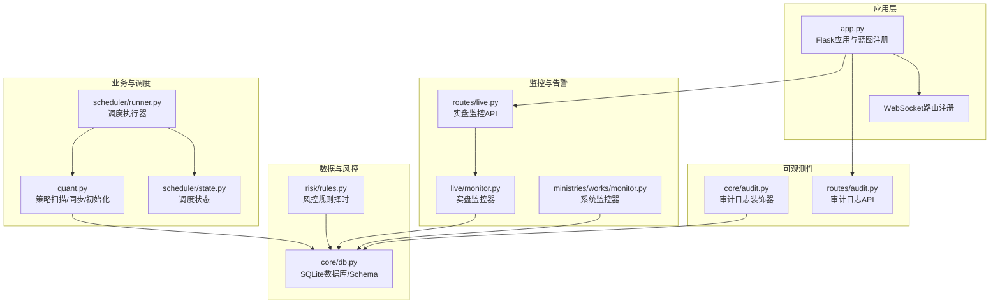
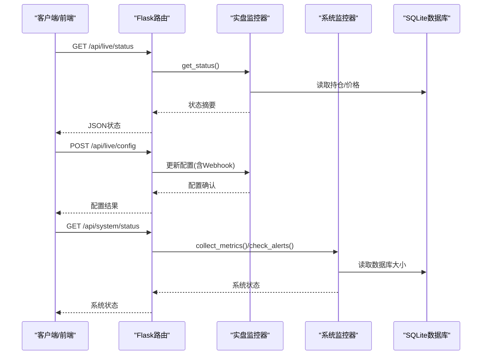
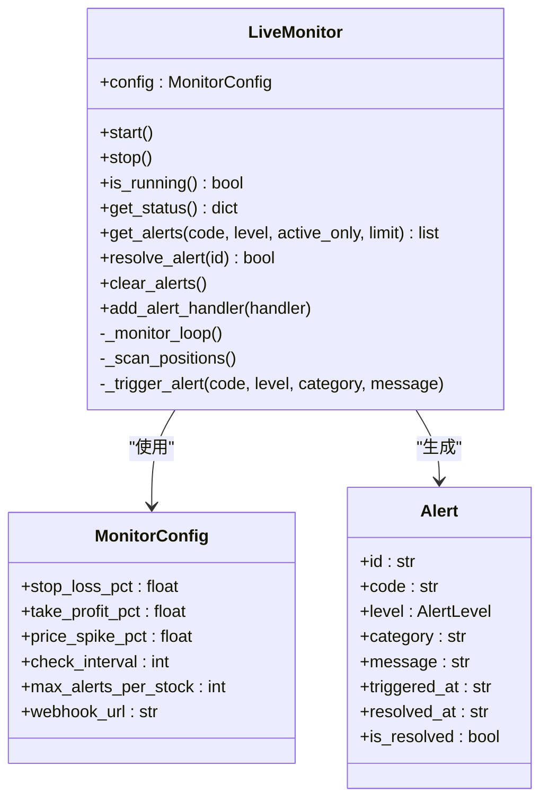
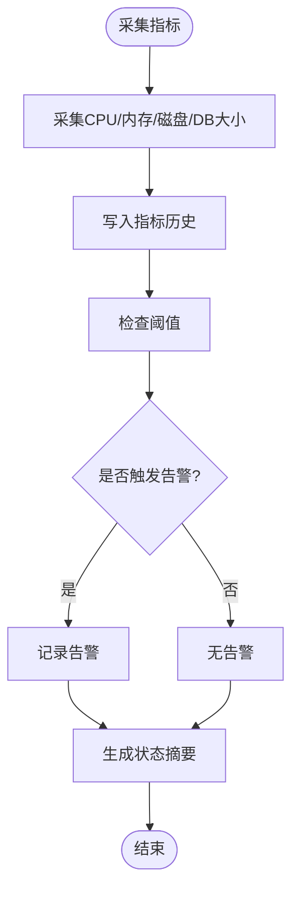
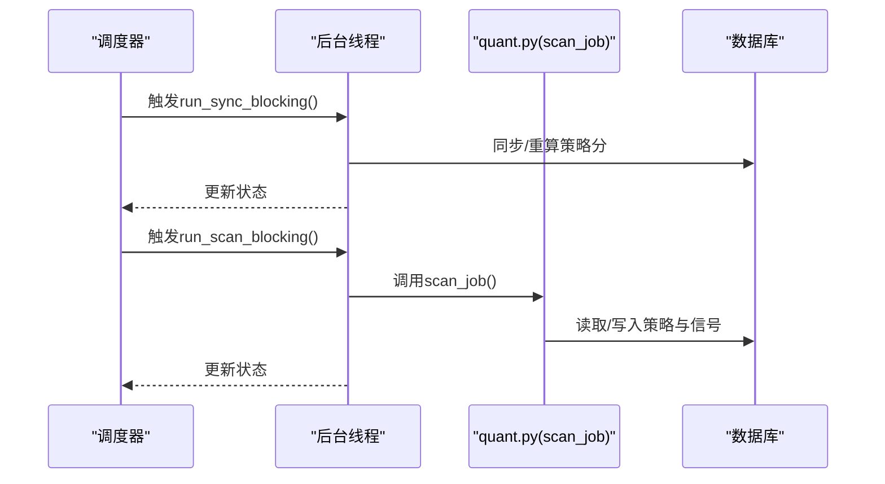
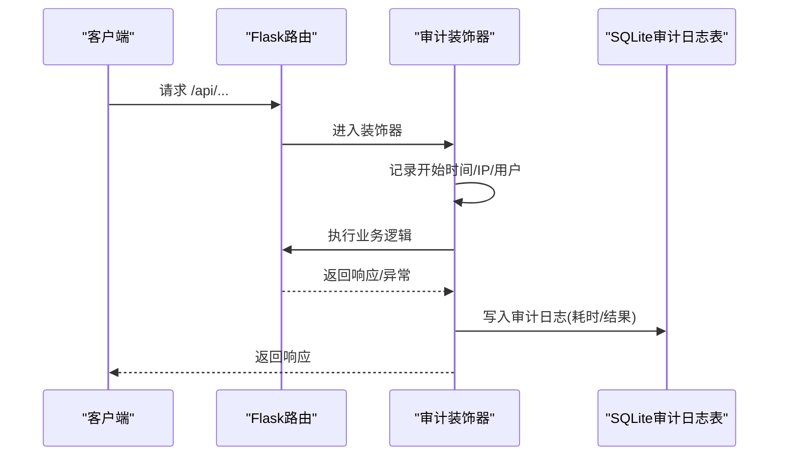
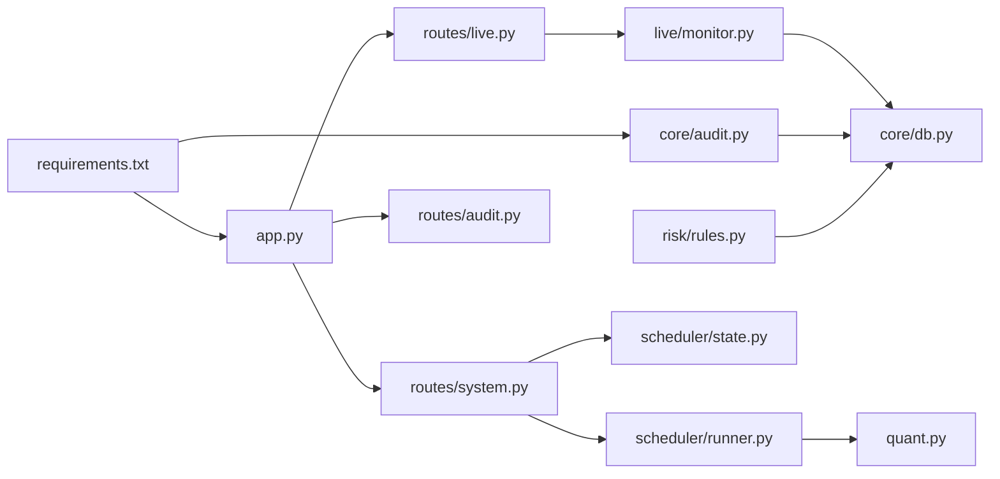

# 性能监控

<cite>
**本文引用的文件**
- [app.py](file://app.py)
- [live/monitor.py](file://live/monitor.py)
- [routes/live.py](file://routes/live.py)
- [ministries/works/monitor.py](file://ministries/works/monitor.py)
- [quant.py](file://quant.py)
- [requirements.txt](file://requirements.txt)
- [routes/system.py](file://routes/system.py)
- [core/db.py](file://core/db.py)
- [scheduler/state.py](file://scheduler/state.py)
- [scheduler/runner.py](file://scheduler/runner.py)
- [risk/rules.py](file://risk/rules.py)
- [core/audit.py](file://core/audit.py)
- [routes/audit.py](file://routes/audit.py)
- [test_pipeline.py](file://test_pipeline.py)
</cite>

## 目录
1. [简介](#简介)
2. [项目结构](#项目结构)
3. [核心组件](#核心组件)
4. [架构总览](#架构总览)
5. [详细组件分析](#详细组件分析)
6. [依赖分析](#依赖分析)
7. [性能考虑](#性能考虑)
8. [故障排查指南](#故障排查指南)
9. [结论](#结论)
10. [附录](#附录)

## 简介
本技术文档面向AIQuant系统的性能监控，围绕关键性能指标（KPI）定义与测量、监控工具选择与配置、实时监控实现、瓶颈识别方法、基准测试设计与执行、性能数据存储与分析、以及持续优化流程进行系统化阐述。文档结合当前仓库中的内置监控（系统资源、实盘告警）、调度与任务状态、审计日志与API耗时统计等能力，给出可落地的实践建议与扩展路径。

## 项目结构
AIQuant采用Flask后端提供REST API与WebSocket，核心业务逻辑集中在quant.py与调度模块中，监控与告警分布在实盘监控与系统监控模块，并通过路由暴露状态查询与配置更新接口。

图表来源
- [app.py:1-164](file://app.py#L1-L164)
- [live/monitor.py:1-286](file://live/monitor.py#L1-L286)
- [routes/live.py:1-126](file://routes/live.py#L1-L126)
- [ministries/works/monitor.py:1-114](file://ministries/works/monitor.py#L1-L114)
- [quant.py:1-631](file://quant.py#L1-L631)
- [scheduler/state.py:1-45](file://scheduler/state.py#L1-L45)
- [scheduler/runner.py:1-212](file://scheduler/runner.py#L1-L212)
- [core/db.py:1-800](file://core/db.py#L1-L800)
- [risk/rules.py:106-129](file://risk/rules.py#L106-L129)
- [core/audit.py:1-146](file://core/audit.py#L1-L146)
- [routes/audit.py:1-50](file://routes/audit.py#L1-L50)

章节来源
- [app.py:1-164](file://app.py#L1-L164)
- [quant.py:1-631](file://quant.py#L1-L631)

## 核心组件
- 实盘监控器：周期扫描持仓、计算浮盈亏与涨跌幅、触发止损/止盈/价格异动告警，支持Webhook推送与状态查询。
- 系统监控器：采集CPU/内存/磁盘使用率与数据库大小，提供健康状态与告警检查。
- 调度与状态：提供传统同步/扫描与多Agent流水线两种模式，维护任务状态与流水线节点状态。
- 审计日志：对API调用进行耗时统计与结果记录，便于事后分析与性能追踪。
- 数据层：SQLite数据库承载策略评分、行情、风控事件、审计日志等，提供基础指标查询与统计。

章节来源
- [live/monitor.py:55-286](file://live/monitor.py#L55-L286)
- [ministries/works/monitor.py:29-114](file://ministries/works/monitor.py#L29-L114)
- [scheduler/state.py:1-45](file://scheduler/state.py#L1-L45)
- [scheduler/runner.py:1-212](file://scheduler/runner.py#L1-L212)
- [core/audit.py:16-92](file://core/audit.py#L16-L92)
- [core/db.py:1-800](file://core/db.py#L1-L800)

## 架构总览
AIQuant的性能监控以“采集-聚合-告警-查询”闭环为核心，结合调度与审计日志形成完整的可观测性体系。

图表来源
- [routes/live.py:22-126](file://routes/live.py#L22-L126)
- [live/monitor.py:204-246](file://live/monitor.py#L204-L246)
- [ministries/works/monitor.py:36-101](file://ministries/works/monitor.py#L36-L101)
- [routes/system.py:46-152](file://routes/system.py#L46-L152)

## 详细组件分析

### 实盘监控器（LiveMonitor）
- 关键职责：定时扫描持仓、风控阈值检查、价格异动检测、告警生成与Webhook推送、状态查询与告警清理。
- KPI与指标：
  - 响应时间：单次扫描耗时（可结合审计日志装饰器统计API耗时）。
  - 吞吐量：单位时间内扫描的股票数（可基于扫描循环与进度打印估算）。
  - 错误率：扫描异常次数/总扫描次数（可扩展审计日志记录失败）。
  - 资源利用率：监控线程占用CPU/内存（可扩展系统监控器采集）。
- 告警机制：支持等级化（info/warning/critical），限制同股票告警频率，支持回调与Webhook推送。
- 可视化：通过API返回状态与告警列表，前端可渲染实时监控面板。

图表来源
- [live/monitor.py:44-286](file://live/monitor.py#L44-L286)

章节来源
- [live/monitor.py:55-286](file://live/monitor.py#L55-L286)
- [routes/live.py:14-126](file://routes/live.py#L14-L126)

### 系统监控器（SystemMonitor）
- 关键职责：采集系统资源指标（CPU/内存/磁盘），计算数据库大小，检查阈值并生成告警，提供健康状态摘要。
- KPI与指标：
  - CPU使用率、内存使用率、磁盘使用率、数据库大小（MB）。
  - 告警触发次数与级别分布。
- 历史保留：默认保留最近24小时的指标（每分钟一条）。

图表来源
- [ministries/works/monitor.py:36-101](file://ministries/works/monitor.py#L36-L101)

章节来源
- [ministries/works/monitor.py:29-114](file://ministries/works/monitor.py#L29-L114)
- [routes/system.py:46-152](file://routes/system.py#L46-L152)

### 调度与任务状态（Scheduler）
- 模式：传统模式（07:00同步/09:00扫描）与多Agent流水线模式（07:30数据Agent/09:00完整流水线）。
- 状态：维护同步/扫描/流水线运行状态、最后执行时间与结果，支持启用/禁用调度器。
- 任务执行：后台线程执行同步与扫描，流水线模式支持单Agent与完整流水线运行。

图表来源
- [scheduler/runner.py:29-102](file://scheduler/runner.py#L29-L102)
- [scheduler/state.py:1-45](file://scheduler/state.py#L1-L45)
- [quant.py:433-546](file://quant.py#L433-L546)

章节来源
- [scheduler/runner.py:1-212](file://scheduler/runner.py#L1-L212)
- [scheduler/state.py:1-45](file://scheduler/state.py#L1-L45)
- [quant.py:1-631](file://quant.py#L1-L631)

### 审计日志与API耗时（Audit）
- 装饰器：对API调用自动记录耗时、结果与资源标识，便于性能分析与异常定位。
- 查询：提供分页与过滤的日志查询接口，支持统计今日操作数等。

图表来源
- [core/audit.py:41-92](file://core/audit.py#L41-L92)
- [routes/audit.py:16-50](file://routes/audit.py#L16-L50)

章节来源
- [core/audit.py:16-146](file://core/audit.py#L16-L146)
- [routes/audit.py:1-50](file://routes/audit.py#L1-L50)

## 依赖分析
- 外部依赖：Flask、Flask-Sock、pandas、plotly、requests、schedule、psutil、joblib等。
- 内部模块耦合：
  - app.py注册路由与启动监控线程，依赖实盘监控与系统监控模块。
  - routes/live.py依赖live/monitor.py；routes/system.py依赖scheduler/state与scheduler/runner。
  - 审计日志贯穿API层，依赖core/db.py写入审计日志表。
  - 风控规则依赖指数数据（MA5/MA20）进行择时判断，数据来源于core/db.py的指数表。

图表来源
- [requirements.txt:1-9](file://requirements.txt#L1-L9)
- [app.py:1-164](file://app.py#L1-L164)
- [routes/live.py:14-126](file://routes/live.py#L14-L126)
- [routes/system.py:12-152](file://routes/system.py#L12-L152)
- [scheduler/runner.py:17-212](file://scheduler/runner.py#L17-L212)
- [scheduler/state.py:1-45](file://scheduler/state.py#L1-L45)
- [core/db.py:1-800](file://core/db.py#L1-L800)
- [risk/rules.py:106-129](file://risk/rules.py#L106-L129)

章节来源
- [requirements.txt:1-9](file://requirements.txt#L1-L9)
- [app.py:1-164](file://app.py#L1-L164)
- [core/db.py:1-800](file://core/db.py#L1-L800)

## 性能考虑
- 响应时间
  - API层面：利用审计日志装饰器自动记录耗时，结合路由返回JSON，便于前端展示与监控。
  - 业务层面：策略扫描与数据同步为IO密集型，注意数据库连接池与索引使用；可参考数据库层的WAL与PRAGMA设置。
- 吞吐量
  - 扫描全市场股票时，建议分批处理与进度打印，避免长时间阻塞；可结合调度器的后台线程模式。
  - 数据同步支持盘中增量与收盘全量，减少不必要的网络与IO开销。
- 资源利用率
  - 系统监控器采集CPU/内存/磁盘与数据库大小，建议设置阈值并联动告警。
  - 实盘监控器使用守护线程与固定间隔扫描，避免主线程阻塞。
- 错误率
  - 对异常进行捕获与日志记录，结合审计日志统计失败次数与占比。
  - Webhook推送失败应具备重试与降级策略（当前实现已包含基本异常处理）。

[本节为通用性能指导，不直接分析具体文件]

## 故障排查指南
- 实盘监控告警
  - 通过API查询状态与告警列表，定位触发阈值与频率限制。
  - 使用解决接口标记告警已处理，避免重复推送。
- 系统健康
  - 查看系统状态摘要与告警数量，关注CPU/内存/磁盘阈值。
  - 若数据库过大，可定期清理缓存与归档历史数据。
- 调度与任务
  - 检查调度器开关与任务状态，确认是否处于运行中。
  - 若扫描/同步卡住，查看状态中的最后结果与时间。
- 审计日志
  - 通过审计日志API查询特定动作或用户，定位异常请求与耗时峰值。
  - 结合数据库日志表（sync_log）查看同步任务的耗时与成功率。

章节来源
- [routes/live.py:22-126](file://routes/live.py#L22-L126)
- [ministries/works/monitor.py:86-114](file://ministries/works/monitor.py#L86-L114)
- [routes/system.py:46-152](file://routes/system.py#L46-L152)
- [routes/audit.py:16-50](file://routes/audit.py#L16-L50)
- [core/audit.py:107-146](file://core/audit.py#L107-L146)

## 结论
AIQuant已具备基础的性能监控能力：实盘告警、系统资源采集、调度状态与审计日志。建议在此基础上扩展指标采集（如数据库慢查询、队列长度）、引入时序数据库与可视化面板、完善告警分级与通知渠道，并建立性能基准测试与回归流程，持续优化系统性能与稳定性。

[本节为总结性内容，不直接分析具体文件]

## 附录

### 关键KPI定义与测量建议
- 响应时间
  - API响应时间：通过审计日志装饰器自动统计；前端可叠加WebSocket消息延迟。
  - 业务任务耗时：策略扫描/数据同步的后台任务耗时，结合状态接口记录。
- 吞吐量
  - 股票扫描速率：单位时间内扫描的股票数量；可基于进度打印与状态接口统计。
  - 数据同步速率：单位时间内同步的数据条目数。
- 资源利用率
  - CPU/内存/磁盘使用率：系统监控器采集；数据库大小定期统计。
- 错误率
  - API错误率：审计日志中失败/异常计数；业务任务异常计数。

[本节为概念性说明，不直接分析具体文件]

### 实时性能监控实现方案
- 指标采集
  - 系统指标：系统监控器定时采集并保留历史。
  - 业务指标：审计日志记录API耗时与结果；可扩展埋点记录策略扫描耗时。
- 告警机制
  - 阈值告警：CPU/内存/磁盘超过阈值触发；实盘监控器支持Webhook推送。
  - 状态告警：调度器状态异常、任务超时等。
- 可视化展示
  - 前端仪表板：展示系统状态、告警数量、任务状态与关键指标趋势图。
  - 建议使用图表库（如仓库中使用的plotly）绘制趋势图。

[本节为概念性说明，不直接分析具体文件]

### 性能瓶颈识别方法
- 热点分析
  - 审计日志按动作/用户聚合，识别耗时峰值与高频操作。
  - 策略扫描阶段逐策略耗时统计，定位最慢环节。
- 依赖分析
  - 数据库查询：关注指数/行情/信号表的索引使用与慢查询日志。
  - 外部数据源：网络请求耗时与失败率统计。
- 容量规划
  - 基于历史指标与增长趋势，评估CPU/内存/磁盘/带宽需求。

[本节为概念性说明，不直接分析具体文件]

### 性能基准测试设计与执行
- 负载测试
  - 模拟多用户并发调用关键API，观察响应时间与错误率。
- 压力测试
  - 提高并发与数据规模，观察系统极限与退化点。
- 稳定性测试
  - 长时间运行（如24小时），监控资源与告警变化。
- 端到端测试
  - 使用测试脚本模拟Agent流水线，统计各Agent耗时与整体耗时。

章节来源
- [test_pipeline.py:167-391](file://test_pipeline.py#L167-L391)

### 性能数据存储与分析
- 存储
  - 时序数据库：建议引入InfluxDB/ClickHouse等，存储系统指标与业务指标。
  - 数据库：继续使用SQLite存储审计日志、风控事件与同步日志。
- 分析
  - 趋势预测：基于历史指标进行简单预测（如滑动平均、指数平滑）。
  - 异常检测：基于阈值与统计模型识别异常波动。

[本节为概念性说明，不直接分析具体文件]

### 持续改进流程
- A/B测试
  - 对策略参数或扫描策略进行A/B对比，评估收益与风险。
- 灰度发布
  - 逐步扩大流量，监控关键指标与告警，及时回滚。
- 回滚机制
  - 版本化配置与快速回滚脚本，确保异常时可快速恢复。

[本节为概念性说明，不直接分析具体文件]