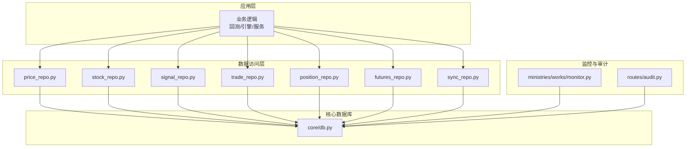
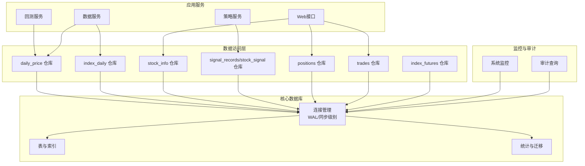
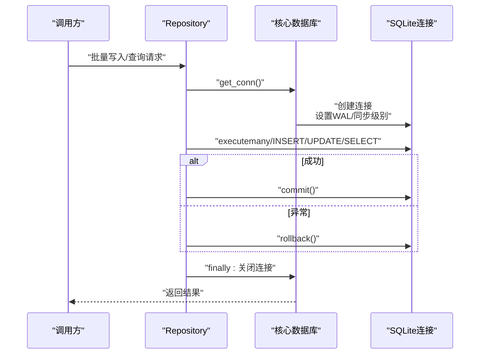
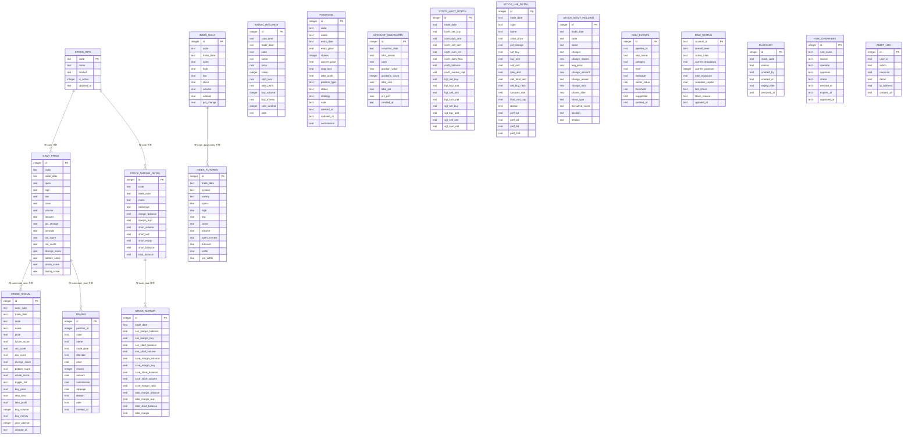
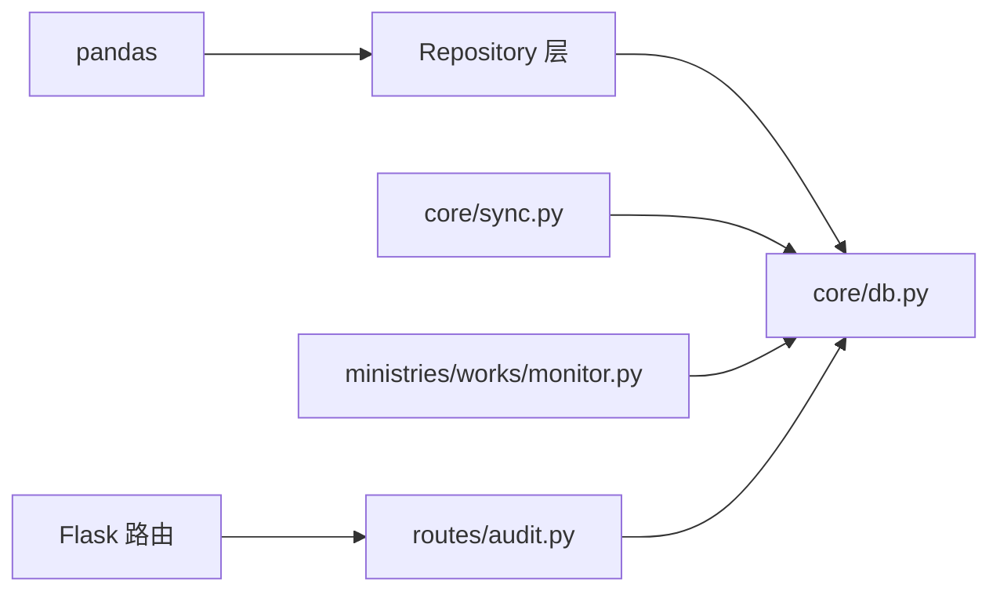

# 数据库优化

<cite>
**本文引用的文件**
- [core/db.py](file://core/db.py)
- [core/repository/price_repo.py](file://core/repository/price_repo.py)
- [core/repository/stock_repo.py](file://core/repository/stock_repo.py)
- [core/repository/signal_repo.py](file://core/repository/signal_repo.py)
- [core/repository/trade_repo.py](file://core/repository/trade_repo.py)
- [core/repository/position_repo.py](file://core/repository/position_repo.py)
- [core/repository/futures_repo.py](file://core/repository/futures_repo.py)
- [core/repository/sync_repo.py](file://core/repository/sync_repo.py)
- [ministries/works/monitor.py](file://ministries/works/monitor.py)
- [routes/audit.py](file://routes/audit.py)
- [core/sync.py](file://core/sync.py)
- [requirements.txt](file://requirements.txt)
</cite>

## 目录
1. [简介](#简介)
2. [项目结构](#项目结构)
3. [核心组件](#核心组件)
4. [架构总览](#架构总览)
5. [详细组件分析](#详细组件分析)
6. [依赖关系分析](#依赖关系分析)
7. [性能考量](#性能考量)
8. [故障排查指南](#故障排查指南)
9. [结论](#结论)
10. [附录](#附录)

## 简介
本技术文档聚焦于AIQuant系统中SQLite数据库的优化策略与实践，围绕以下目标展开：
- 查询优化：SQL语句优化、索引设计原则、查询计划分析
- 连接池与并发：连接管理、事务与并发控制
- 表结构优化：字段类型、约束、索引策略
- 数据访问模式：批量操作、延迟加载、缓存策略
- 性能监控与调优：指标采集、慢查询分析、工具使用
- 大数据场景：分页、全文搜索、复合索引
- 维护最佳实践：定期优化、统计信息、存储空间管理

## 项目结构
AIQuant采用“核心模块+按表拆分的数据访问层”组织数据库相关代码：
- 核心数据库模块：统一连接、建表、迁移、统计与基础CRUD
- 数据访问层（Repository）：按表拆分，封装对单一表的CRUD与常用查询
- 监控与审计：系统指标采集、审计日志查询
- 同步与回测：数据同步流程、策略评分写入

图表来源
- [core/db.py:57-466](file://core/db.py#L57-L466)
- [core/repository/price_repo.py:1-237](file://core/repository/price_repo.py#L1-L237)
- [core/repository/stock_repo.py:1-80](file://core/repository/stock_repo.py#L1-L80)
- [core/repository/signal_repo.py:1-119](file://core/repository/signal_repo.py#L1-L119)
- [core/repository/trade_repo.py:1-77](file://core/repository/trade_repo.py#L1-L77)
- [core/repository/position_repo.py:1-138](file://core/repository/position_repo.py#L1-L138)
- [core/repository/futures_repo.py:1-108](file://core/repository/futures_repo.py#L1-L108)
- [core/repository/sync_repo.py:36-54](file://core/repository/sync_repo.py#L36-L54)
- [ministries/works/monitor.py:1-113](file://ministries/works/monitor.py#L1-L113)
- [routes/audit.py:52-78](file://routes/audit.py#L52-L78)

章节来源
- [core/db.py:57-466](file://core/db.py#L57-L466)
- [core/repository/price_repo.py:1-237](file://core/repository/price_repo.py#L1-L237)
- [core/repository/stock_repo.py:1-80](file://core/repository/stock_repo.py#L1-L80)
- [core/repository/signal_repo.py:1-119](file://core/repository/signal_repo.py#L1-L119)
- [core/repository/trade_repo.py:1-77](file://core/repository/trade_repo.py#L1-L77)
- [core/repository/position_repo.py:1-138](file://core/repository/position_repo.py#L1-L138)
- [core/repository/futures_repo.py:1-108](file://core/repository/futures_repo.py#L1-L108)
- [core/repository/sync_repo.py:36-54](file://core/repository/sync_repo.py#L36-L54)
- [ministries/works/monitor.py:1-113](file://ministries/works/monitor.py#L1-L113)
- [routes/audit.py:52-78](file://routes/audit.py#L52-L78)

## 核心组件
- 连接管理与事务
  - 使用上下文管理器确保事务提交/回滚与连接关闭
  - WAL模式与同步级别权衡性能与一致性
- 建表与迁移
  - 初始化时一次性执行建表与索引创建
  - 安全地为旧表追加列，避免破坏性变更
- 数据访问层
  - 按表拆分的Repository封装常用查询与写入
  - 提供批量写入、条件查询、统计汇总等能力
- 监控与审计
  - 系统指标采集（CPU/内存/磁盘/数据库大小）
  - 审计日志按天统计与趋势查询

章节来源
- [core/db.py:26-40](file://core/db.py#L26-L40)
- [core/db.py:57-466](file://core/db.py#L57-L466)
- [core/repository/price_repo.py:13-47](file://core/repository/price_repo.py#L13-L47)
- [core/repository/stock_repo.py:13-28](file://core/repository/stock_repo.py#L13-L28)
- [core/repository/signal_repo.py:14-43](file://core/repository/signal_repo.py#L14-L43)
- [core/repository/trade_repo.py:12-37](file://core/repository/trade_repo.py#L12-L37)
- [core/repository/position_repo.py:12-24](file://core/repository/position_repo.py#L12-L24)
- [core/repository/futures_repo.py:27-71](file://core/repository/futures_repo.py#L27-L71)
- [ministries/works/monitor.py:36-60](file://ministries/works/monitor.py#L36-L60)
- [routes/audit.py:52-78](file://routes/audit.py#L52-L78)

## 架构总览
下图展示数据库层在系统中的位置与交互关系。

图表来源
- [core/db.py:26-40](file://core/db.py#L26-L40)
- [core/db.py:57-466](file://core/db.py#L57-L466)
- [core/repository/price_repo.py:1-237](file://core/repository/price_repo.py#L1-L237)
- [core/repository/stock_repo.py:1-80](file://core/repository/stock_repo.py#L1-L80)
- [core/repository/signal_repo.py:1-119](file://core/repository/signal_repo.py#L1-L119)
- [core/repository/trade_repo.py:1-77](file://core/repository/trade_repo.py#L1-L77)
- [core/repository/position_repo.py:1-138](file://core/repository/position_repo.py#L1-L138)
- [core/repository/futures_repo.py:1-108](file://core/repository/futures_repo.py#L1-L108)
- [ministries/works/monitor.py:1-113](file://ministries/works/monitor.py#L1-L113)
- [routes/audit.py:52-78](file://routes/audit.py#L52-L78)

## 详细组件分析

### 连接管理与事务控制
- 连接生命周期
  - 使用上下文管理器创建连接，设置WAL与同步级别
  - 正常路径提交，异常路径回滚，最终关闭连接
- 事务边界
  - 批量写入（executemany/ON CONFLICT）在单连接内进行，保证原子性
  - 部分写入路径显式关闭外键检查以提升性能，随后commit
- 并发与锁
  - WAL模式提升读写并发，NORMAL同步级别在性能与可靠性间折中

图表来源
- [core/db.py:26-40](file://core/db.py#L26-L40)
- [core/repository/price_repo.py:36-47](file://core/repository/price_repo.py#L36-L47)
- [core/repository/price_repo.py:79-92](file://core/repository/price_repo.py#L79-L92)
- [core/repository/signal_repo.py:86-98](file://core/repository/signal_repo.py#L86-L98)

章节来源
- [core/db.py:26-40](file://core/db.py#L26-L40)
- [core/repository/price_repo.py:36-47](file://core/repository/price_repo.py#L36-L47)
- [core/repository/price_repo.py:79-92](file://core/repository/price_repo.py#L79-L92)
- [core/repository/signal_repo.py:86-98](file://core/repository/signal_repo.py#L86-L98)

### 表结构与索引策略
- 主要表与关键索引
  - daily_price：主键自增，唯一索引(code, trade_date)，常用索引(trade_date)
  - index_daily：同上，用于大盘指数行情
  - stock_signal：唯一索引(scan_date, code)，常用索引(trade_date)
  - positions/trades/account_snapshots：按code/status/date建立索引
  - 其他专业因子表（如融资融券、龙虎榜、股指期货）均具备日期/代码复合索引或唯一索引
- 字段类型与约束
  - 价格/成交量等数值型使用REAL，字符串使用TEXT，日期统一为TEXT
  - 多处使用UNIQUE约束保证数据完整性
  - 外键检查在批量写入时临时关闭以提升吞吐

图表来源
- [core/db.py:61-466](file://core/db.py#L61-L466)

章节来源
- [core/db.py:61-466](file://core/db.py#L61-L466)

### 查询优化与SQL语句优化
- 常见查询模式
  - 按股票代码与日期范围查询行情：使用复合索引(code, trade_date)与索引(trade_date)
  - 按日期查询信号/交易：使用索引(trade_date)
  - 按状态/代码查询持仓：使用索引(status)与索引(code)
- 优化建议
  - 使用EXPLAIN QUERY PLAN分析查询计划，确认索引被使用
  - 避免SELECT *，明确所需列，减少I/O
  - 对高频过滤条件（如trade_date、code）保持索引
  - 对COUNT(*)等聚合查询，尽量利用索引或物化视图/中间表

章节来源
- [core/repository/price_repo.py:95-129](file://core/repository/price_repo.py#L95-L129)
- [core/repository/signal_repo.py:102-113](file://core/repository/signal_repo.py#L102-L113)
- [core/repository/trade_repo.py:26-37](file://core/repository/trade_repo.py#L26-L37)
- [core/repository/position_repo.py:85-92](file://core/repository/position_repo.py#L85-L92)

### 索引设计原则
- 复合索引优先
  - 日常查询多以“股票+日期”组合出现，优先建立(code, trade_date)复合索引
  - trade_date单独索引满足按日期过滤需求
- 唯一索引
  - 防止重复写入，保障数据完整性（如unique(code, trade_date)）
- 覆盖索引
  - 在高频查询中，考虑将查询所需列纳入索引，减少回表

章节来源
- [core/db.py:92-93](file://core/db.py#L92-L93)
- [core/db.py:135-136](file://core/db.py#L135-L136)
- [core/db.py:187-188](file://core/db.py#L187-L188)
- [core/db.py:207-208](file://core/db.py#L207-L208)
- [core/db.py:223](file://core/db.py#L223)
- [core/db.py:242](file://core/db.py#L242)
- [core/db.py:261](file://core/db.py#L261)
- [core/db.py:305](file://core/db.py#L305)
- [core/db.py:331](file://core/db.py#L331)
- [core/db.py:353](file://core/db.py#L353)
- [core/db.py:397](file://core/db.py#L397)

### 查询计划分析
- 使用SQLite EXPLAIN QUERY PLAN定位索引使用情况
- 关注回表次数、索引扫描范围与排序开销
- 对大表全表扫描的查询，优先通过WHERE条件引导索引

[本节为通用指导，不直接分析特定文件]

### 数据访问模式优化
- 批量操作
  - executemany + ON CONFLICT：适合高吞吐写入，减少往返
  - 分批提交：大批量时分批处理，避免长事务占用
- 延迟加载
  - 按需查询：仅在需要时加载完整行情或因子序列
  - 分页查询：对长序列采用LIMIT/OFFSET或基于游标的时间窗口
- 缓存策略
  - 热点数据缓存：近期行情与活跃股票可缓存于内存
  - 结果集缓存：对复杂聚合查询结果进行短期缓存

章节来源
- [core/repository/price_repo.py:13-47](file://core/repository/price_repo.py#L13-L47)
- [core/repository/price_repo.py:50-92](file://core/repository/price_repo.py#L50-L92)
- [core/repository/signal_repo.py:14-43](file://core/repository/signal_repo.py#L14-L43)
- [core/repository/trade_repo.py:12-37](file://core/repository/trade_repo.py#L12-L37)
- [core/repository/position_repo.py:12-24](file://core/repository/position_repo.py#L12-L24)

### 大数据量下的分页查询、全文搜索与复合索引
- 分页查询
  - 使用LIMIT与OFFSET实现分页，结合索引(trade_date/code)提升性能
  - 对时间序列分页，建议使用“最后一条记录的日期/ID”作为游标
- 全文搜索
  - SQLite内置FTS5可用于文本检索，但本项目未见FTS使用
  - 若需全文检索，可在schema层面引入FTS表或采用外部搜索引擎
- 复合索引
  - 优先为高频过滤组合建立复合索引，如(code, trade_date)

章节来源
- [core/repository/price_repo.py:95-129](file://core/repository/price_repo.py#L95-L129)
- [core/db.py:92-93](file://core/db.py#L92-L93)
- [core/db.py:135-136](file://core/db.py#L135-L136)

### 数据库维护最佳实践
- 定期优化
  - VACUUM/ANALYZE：定期清理碎片与更新统计信息（SQLite建议周期性执行）
- 统计信息更新
  - ANALYZE帮助查询优化器生成更优执行计划
- 存储空间管理
  - 监控数据库文件大小，清理历史无用数据（如归档旧信号/日志）

章节来源
- [ministries/works/monitor.py:48-58](file://ministries/works/monitor.py#L48-L58)

## 依赖关系分析
- 组件耦合
  - Repository层依赖核心数据库模块的连接管理
  - 业务服务通过Repository间接访问数据库
- 外部依赖
  - pandas用于DataFrame与数据库之间的高效转换
  - Flask路由用于审计查询与系统状态展示

图表来源
- [core/db.py:26-40](file://core/db.py#L26-L40)
- [core/sync.py:675-682](file://core/sync.py#L675-L682)
- [ministries/works/monitor.py:1-113](file://ministries/works/monitor.py#L1-L113)
- [routes/audit.py:52-78](file://routes/audit.py#L52-L78)
- [requirements.txt:3](file://requirements.txt#L3)

章节来源
- [core/db.py:26-40](file://core/db.py#L26-L40)
- [core/sync.py:675-682](file://core/sync.py#L675-L682)
- [ministries/works/monitor.py:1-113](file://ministries/works/monitor.py#L1-L113)
- [routes/audit.py:52-78](file://routes/audit.py#L52-L78)
- [requirements.txt:3](file://requirements.txt#L3)

## 性能考量
- 连接与并发
  - 使用WAL模式与合理的同步级别，平衡性能与可靠性
  - 控制事务粒度，避免长时间持有锁
- 写入性能
  - 批量写入优先使用executemany + ON CONFLICT
  - 在批量更新时临时关闭外键检查，减少约束校验开销
- 读取性能
  - 为高频查询列建立合适索引，避免全表扫描
  - 使用EXPLAIN QUERY PLAN验证索引命中
- 监控指标
  - CPU/内存/磁盘使用率与数据库文件大小
  - 审计日志按天统计，辅助评估系统负载

章节来源
- [core/db.py:28-31](file://core/db.py#L28-L31)
- [core/repository/price_repo.py:79-92](file://core/repository/price_repo.py#L79-L92)
- [ministries/works/monitor.py:36-60](file://ministries/works/monitor.py#L36-L60)
- [routes/audit.py:52-78](file://routes/audit.py#L52-L78)

## 故障排查指南
- 常见问题
  - 写入失败或事务未提交：检查上下文管理器是否正确捕获异常并回滚
  - 索引未生效：使用EXPLAIN QUERY PLAN确认查询计划，调整WHERE条件或索引
  - 外键约束导致批量写入缓慢：确认是否已临时关闭外键检查
- 审计与诊断
  - 审计日志按天统计与趋势查询，辅助定位异常时段
  - 系统监控采集数据库大小与资源使用，及时发现容量与性能瓶颈

章节来源
- [core/db.py:26-40](file://core/db.py#L26-L40)
- [routes/audit.py:52-78](file://routes/audit.py#L52-L78)
- [ministries/works/monitor.py:62-84](file://ministries/works/monitor.py#L62-L84)

## 结论
通过对AIQuant数据库层的结构梳理与优化策略实施，可在保证数据一致性的前提下显著提升读写性能与可维护性。建议持续关注查询计划、索引命中与批量写入策略，并结合系统监控与审计日志进行性能治理与容量规划。

## 附录
- 快速参考
  - 连接管理：WAL模式、同步级别、事务提交/回滚
  - 建表与索引：复合索引、唯一索引、外键检查开关
  - 批量写入：executemany + ON CONFLICT、分批提交
  - 监控指标：CPU/内存/磁盘/数据库大小、审计日志统计