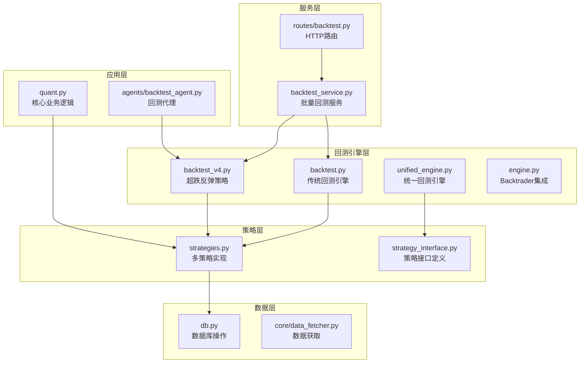
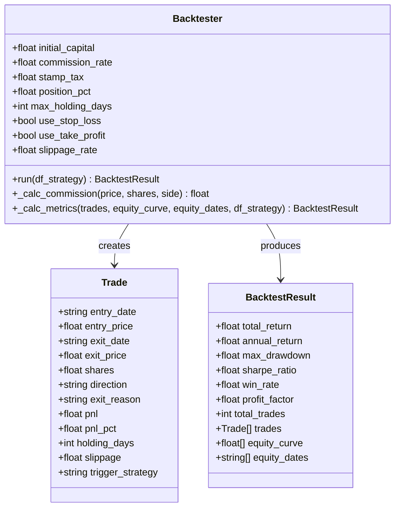
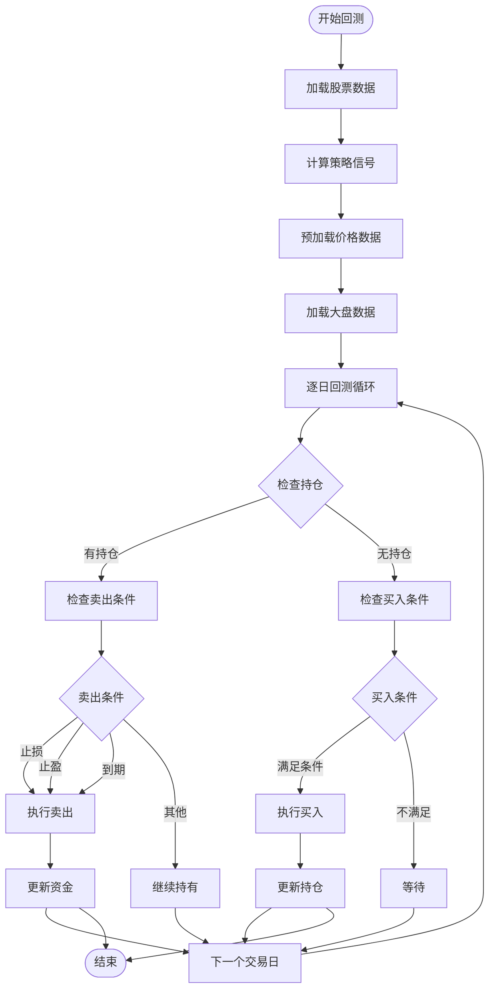
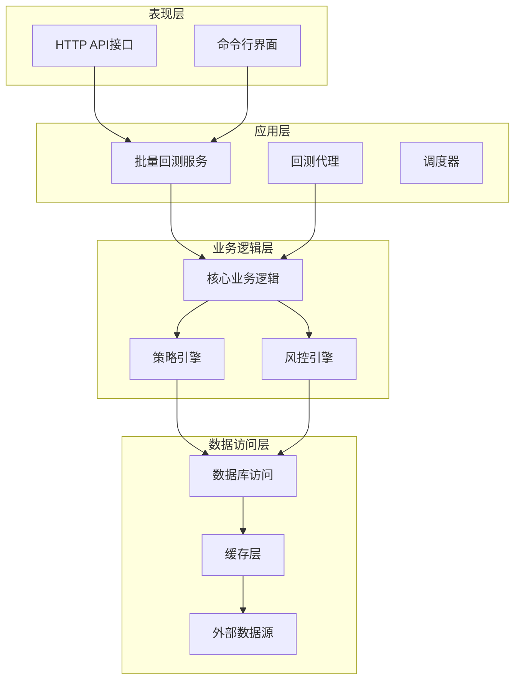
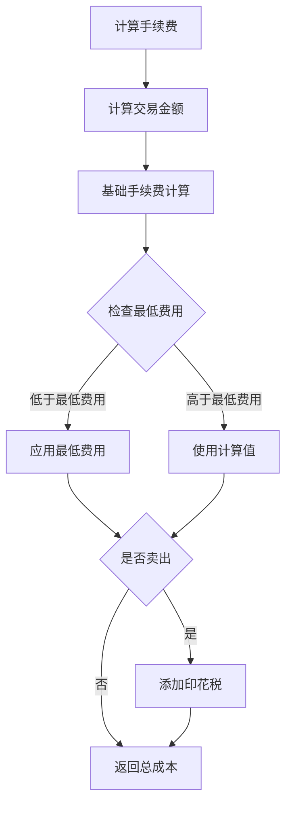
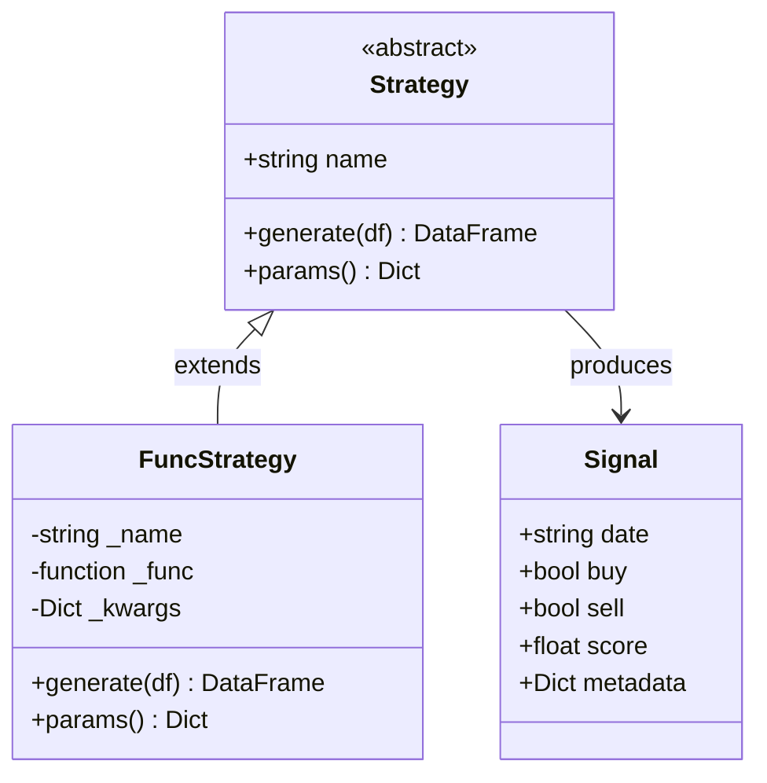
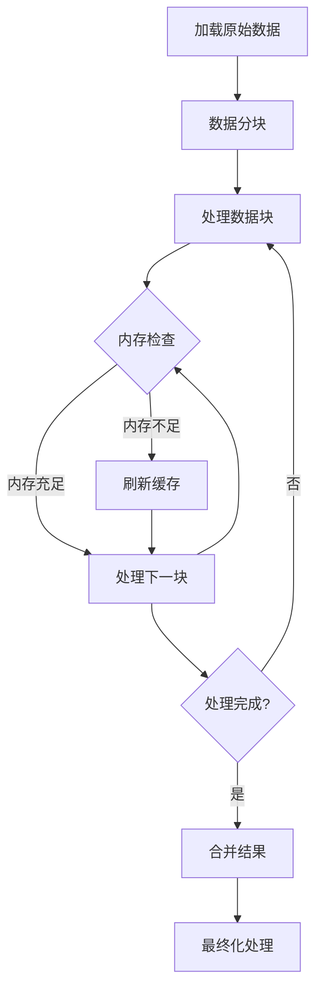
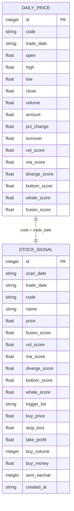
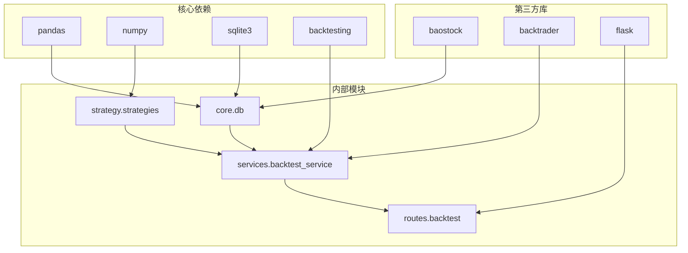

# 回测引擎优化

<cite>
**本文档引用的文件**
- [backtest.py](file://backtest/backtest.py)
- [backtest_v4.py](file://backtest/backtest_v4.py)
- [unified_engine.py](file://backtest/unified_engine.py)
- [engine.py](file://backtest/engine.py)
- [strategy_interface.py](file://backtest/strategy_interface.py)
- [strategies.py](file://strategy/strategies.py)
- [db.py](file://core/db.py)
- [backtest_service.py](file://services/backtest_service.py)
- [backtest.py](file://routes/backtest.py)
- [optimize_params.py](file://backtest/optimize_params.py)
- [param_optimizer.py](file://backtest/param_optimizer.py)
- [quant.py](file://quant.py)
- [backtest_agent.py](file://agents/backtest_agent.py)
</cite>

## 目录
1. [简介](#简介)
2. [项目结构](#项目结构)
3. [核心组件](#核心组件)
4. [架构概览](#架构概览)
5. [详细组件分析](#详细组件分析)
6. [依赖关系分析](#依赖关系分析)
7. [性能优化策略](#性能优化策略)
8. [故障排查指南](#故障排查指南)
9. [结论](#结论)

## 简介

本技术文档专注于AI量化回测引擎的性能优化，涵盖历史数据回放优化、交易成本模型高效实现、多策略并行回测方案、大规模回测内存管理策略以及回测结果存储优化等方面。通过对现有代码库的深入分析，提供系统性的优化建议和最佳实践。

## 项目结构

AI量化系统采用模块化架构，主要分为以下几个核心模块：



**图表来源**
- [backtest.py:1-517](file://backtest/backtest.py#L1-L517)
- [strategies.py:1-431](file://strategy/strategies.py#L1-L431)
- [db.py:1-800](file://core/db.py#L1-L800)

**章节来源**
- [backtest.py:1-517](file://backtest/backtest.py#L1-L517)
- [strategies.py:1-431](file://strategy/strategies.py#L1-L431)
- [db.py:1-800](file://core/db.py#L1-L800)

## 核心组件

### 传统回测引擎 (Backtester)

传统回测引擎提供了完整的回测功能，包括交易成本计算、风险管理、绩效评估等核心功能：



**图表来源**
- [backtest.py:56-471](file://backtest/backtest.py#L56-L471)

### 超跌反弹策略引擎

超跌反弹策略引擎专门针对超跌反弹策略的优化实现：



**图表来源**
- [backtest_v4.py:218-581](file://backtest/backtest_v4.py#L218-L581)

**章节来源**
- [backtest.py:56-471](file://backtest/backtest.py#L56-L471)
- [backtest_v4.py:218-581](file://backtest/backtest_v4.py#L218-L581)

## 架构概览

系统采用分层架构设计，确保各层职责清晰、耦合度低：



**图表来源**
- [backtest_service.py:1-135](file://services/backtest_service.py#L1-L135)
- [quant.py:433-546](file://quant.py#L433-L546)

## 详细组件分析

### 交易成本模型优化

交易成本模型是回测准确性的重要保障，系统实现了多种成本计算方式：

#### 手续费计算优化



**图表来源**
- [backtest.py:112-119](file://backtest/backtest.py#L112-L119)

#### 滑点模型实现

系统支持多种滑点模型，包括固定滑点和基于价格的滑点：

| 滑点类型 | 计算公式 | 适用场景 |
|---------|---------|----------|
| 固定滑点 | `slippage_rate` | 简单回测，成本估算 |
| 比例滑点 | `price * slippage_rate` | 真实市场模拟 |
| 双向滑点 | `buy_slippage + sell_slippage` | 完整成本计算 |

**章节来源**
- [backtest.py:112-119](file://backtest/backtest.py#L112-L119)
- [backtest_v4.py:46-47](file://backtest/backtest_v4.py#L46-L47)

### 多策略并行回测实现

系统支持多策略并行回测，通过统一接口实现策略插件化：

#### 策略接口设计



**图表来源**
- [strategy_interface.py:23-86](file://backtest/strategy_interface.py#L23-L86)

#### 统一回测引擎

统一回测引擎提供策略插件化支持，简化多策略回测流程：

**章节来源**
- [strategy_interface.py:23-86](file://backtest/strategy_interface.py#L23-L86)
- [unified_engine.py:59-143](file://backtest/unified_engine.py#L59-L143)

### 大规模回测内存管理

系统采用多种内存管理策略来处理大规模回测需求：

#### 数据分块策略



#### 延迟加载机制

系统实现延迟加载机制，减少内存占用：

**章节来源**
- [backtest_v4.py:129-155](file://backtest/backtest_v4.py#L129-L155)
- [db.py:631-665](file://core/db.py#L631-L665)

### 回测结果存储优化

系统采用多种存储优化策略：

#### 数据库索引优化



**图表来源**
- [db.py:71-136](file://core/db.py#L71-L136)

**章节来源**
- [db.py:71-136](file://core/db.py#L71-L136)

## 依赖关系分析

系统依赖关系清晰，各模块职责明确：



**图表来源**
- [backtest_v4.py:16-18](file://backtest/backtest_v4.py#L16-L18)
- [services/backtest_service.py:1-3](file://services/backtest_service.py#L1-L3)

**章节来源**
- [backtest_v4.py:16-18](file://backtest/backtest_v4.py#L16-L18)
- [services/backtest_service.py:1-3](file://services/backtest_service.py#L1-L3)

## 性能优化策略

### 历史数据回放优化

#### 数据预处理优化

1. **批量数据加载**
   - 使用批量SQL查询减少数据库交互次数
   - 实现数据缓存机制避免重复加载

2. **索引优化**
   - 为常用查询字段建立复合索引
   - 优化时间范围查询性能

#### 内存映射技术

```python
# 内存映射示例（概念性代码）
import mmap
import numpy as np

def create_memory_mapped_array(filename, shape, dtype):
    """创建内存映射数组"""
    # 创建文件映射
    with open(filename, 'w') as f:
        # 预分配文件大小
        f.seek(shape[0] * shape[1] * np.dtype(dtype).itemsize - 1)
        f.write('\0')
    
    # 创建内存映射
    with open(filename, 'r+') as f:
        return mmap.mmap(f.fileno(), 0)
```

#### 虚拟化技术应用

1. **数据虚拟化**
   - 实现数据虚拟化接口，支持延迟加载
   - 使用生成器模式处理大数据集

2. **计算虚拟化**
   - 实现计算结果缓存机制
   - 支持增量计算和结果复用

### 交易成本模型高效实现

#### 滑点计算优化

```python
# 滑点计算优化示例
@njit
def calculate_slippage_optimized(price, shares, side, slippage_rate):
    """使用Numba优化的滑点计算"""
    if side == 'buy':
        return price * shares * slippage_rate
    else:
        return price * shares * slippage_rate

# 向量化计算
def vectorized_slippage_calculation(prices, shares, sides, rates):
    """向量化滑点计算"""
    return np.where(sides == 'buy', 
                   prices * shares * rates,
                   prices * shares * rates)
```

#### 手续费和市场冲击快速计算

1. **手续费计算优化**
   - 使用向量化操作替代循环
   - 实现批量手续费计算

2. **市场冲击模型**
   - 实现流动性模型
   - 支持大额订单的冲击成本计算

### 多策略并行回测实现

#### 任务分解策略

```python
# 多策略并行回测示例
from concurrent.futures import ThreadPoolExecutor, ProcessPoolExecutor
import asyncio

class ParallelBacktester:
    def __init__(self, max_workers=4):
        self.max_workers = max_workers
        
    async def parallel_backtest(self, strategies, data):
        """异步并行回测"""
        tasks = [
            asyncio.create_task(self._single_strategy_backtest(strategy, data))
            for strategy in strategies
        ]
        
        results = await asyncio.gather(*tasks)
        return self._merge_results(results)
    
    def _single_strategy_backtest(self, strategy, data):
        """单策略回测"""
        # 实现具体的回测逻辑
        pass
```

#### 资源分配优化

1. **CPU资源分配**
   - 根据策略复杂度动态分配CPU核心
   - 实现负载均衡机制

2. **内存资源管理**
   - 实现内存使用监控
   - 支持内存压力下的降级处理

#### 结果合并策略

```python
# 结果合并优化
def merge_backtest_results(results_list):
    """高效合并回测结果"""
    merged_results = {}
    
    # 使用字典合并减少内存拷贝
    for result in results_list:
        for key, value in result.items():
            if key not in merged_results:
                merged_results[key] = []
            merged_results[key].extend(value)
    
    return merged_results
```

### 大规模回测内存管理

#### 数据分块策略

```python
# 数据分块处理示例
class ChunkProcessor:
    def __init__(self, chunk_size=10000):
        self.chunk_size = chunk_size
    
    def process_large_dataset(self, data):
        """分块处理大数据集"""
        for i in range(0, len(data), self.chunk_size):
            chunk = data[i:i + self.chunk_size]
            yield self._process_chunk(chunk)
    
    def _process_chunk(self, chunk):
        """处理单个数据块"""
        # 实现具体的处理逻辑
        pass
```

#### 延迟加载机制

```python
# 延迟加载实现
class LazyDataLoader:
    def __init__(self, data_source):
        self.data_source = data_source
        self.cache = {}
        self.access_count = 0
    
    def __getitem__(self, key):
        self.access_count += 1
        
        if key not in self.cache:
            # 检查缓存命中率
            if self._should_cache(key):
                self.cache[key] = self._load_data(key)
            else:
                return self._load_data(key)
        
        return self.cache[key]
    
    def _should_cache(self, key):
        """判断是否应该缓存"""
        return self.access_count > 10  # 访问超过10次才缓存
```

#### 垃圾回收优化

```python
# 垃圾回收优化
import gc
import weakref

class OptimizedBacktester:
    def __init__(self):
        self.weak_refs = weakref.WeakSet()
        self.temp_objects = []
    
    def optimize_memory_usage(self):
        """优化内存使用"""
        # 定期清理临时对象
        if len(self.temp_objects) > 1000:
            self.temp_objects.clear()
        
        # 触发垃圾回收
        if len(gc.get_objects()) > 10000:
            gc.collect()
        
        # 清理弱引用
        self.weak_refs.clear()
```

### 回测结果存储优化

#### 压缩算法应用

```python
# 数据压缩示例
import gzip
import pickle

def compress_backtest_result(result):
    """压缩回测结果"""
    serialized = pickle.dumps(result)
    return gzip.compress(serialized)

def decompress_backtest_result(compressed_data):
    """解压回测结果"""
    return pickle.loads(gzip.decompress(compressed_data))

# 使用Zstandard进行高压缩比
try:
    import zstandard as zstd
    
    def zstd_compress(data):
        return zstd.compress(pickle.dumps(data))
        
    def zstd_decompress(data):
        return pickle.loads(zstd.decompress(data))
except ImportError:
    pass
```

#### 索引设计优化

```sql
-- 创建高性能索引
CREATE INDEX idx_daily_price_code_date ON daily_price(code, trade_date);
CREATE INDEX idx_daily_price_date ON daily_price(trade_date);
CREATE INDEX idx_stock_signal_scan_date ON stock_signal(scan_date);
CREATE INDEX idx_stock_signal_trade_date ON stock_signal(trade_date);

-- 复合索引优化查询
CREATE INDEX idx_stock_signal_composite ON stock_signal(code, trade_date, fusion_score);
```

#### 查询优化策略

```python
# 优化的查询实现
def optimized_query_performance_metrics():
    """优化的性能指标查询"""
    query = """
    WITH equity_calc AS (
        SELECT 
            date,
            SUM(CASE WHEN direction = 'buy' THEN amount ELSE -amount END) as daily_change
        FROM trades 
        WHERE position_id = ?
        GROUP BY date
    )
    SELECT 
        date,
        SUM(daily_change) OVER (ORDER BY date) as cumulative_equity,
        MAX(SUM(daily_change) OVER (ORDER BY date)) OVER () as peak_equity
    FROM equity_calc
    ORDER BY date
    """
    return query
```

## 故障排查指南

### 常见问题诊断

#### 回测性能问题

1. **内存溢出**
   ```python
   # 检查内存使用
   import psutil
   import os
   
   def check_memory_usage():
       process = psutil.Process(os.getpid())
       memory_mb = process.memory_info().rss / 1024 / 1024
       return memory_mb
   
   # 监控内存使用
   memory_usage = check_memory_usage()
   if memory_usage > 1000:  # 1GB
       print(f"警告: 内存使用过高 {memory_usage:.2f}MB")
   ```

2. **CPU使用率过高**
   ```python
   # CPU监控
   def monitor_cpu_usage():
       cpu_percent = psutil.cpu_percent(interval=1)
       if cpu_percent > 90:
           print(f"警告: CPU使用率过高 {cpu_percent}%")
   ```

#### 数据加载问题

```python
# 数据完整性检查
def validate_backtest_data(df):
    """验证回测数据完整性"""
    checks = {
        'has_required_columns': all(col in df.columns for col in ['open', 'high', 'low', 'close', 'volume']),
        'has_data': len(df) > 0,
        'date_sorted': df.index.is_monotonic_increasing,
        'no_nulls': not df.isnull().any().any()
    }
    
    return checks

# 数据质量报告
def generate_data_quality_report(df):
    """生成数据质量报告"""
    report = {
        'total_rows': len(df),
        'missing_values': df.isnull().sum().to_dict(),
        'data_types': df.dtypes.to_dict(),
        'date_range': f"{df.index.min()} to {df.index.max()}"
    }
    
    return report
```

#### 交易成本计算错误

```python
# 交易成本验证
def validate_transaction_costs(trade_result, expected_costs):
    """验证交易成本计算"""
    actual_commission = trade_result['commission']
    actual_slippage = trade_result['slippage']
    
    commission_error = abs(actual_commission - expected_costs['commission'])
    slippage_error = abs(actual_slippage - expected_costs['slippage'])
    
    if commission_error > 0.01 or slippage_error > 0.01:
        print(f"警告: 交易成本计算误差过大")
        print(f"佣金误差: {commission_error:.4f}")
        print(f"滑点误差: {slippage_error:.4f}")
    
    return commission_error <= 0.01 and slippage_error <= 0.01
```

### 调试工具使用

#### 性能分析工具

```python
# 性能分析装饰器
import time
from functools import wraps

def performance_monitor(func):
    """性能监控装饰器"""
    @wraps(func)
    def wrapper(*args, **kwargs):
        start_time = time.time()
        start_memory = check_memory_usage()
        
        result = func(*args, **kwargs)
        
        end_time = time.time()
        end_memory = check_memory_usage()
        
        print(f"{func.__name__}:")
        print(f"  执行时间: {end_time - start_time:.2f}秒")
        print(f"  内存变化: {end_memory - start_memory:.2f}MB")
        
        return result
    return wrapper

# 使用示例
@performance_monitor
def run_backtest_optimization():
    """运行回测优化并监控性能"""
    # 实现优化逻辑
    pass
```

#### 日志记录优化

```python
# 结构化日志记录
import logging
from datetime import datetime

# 配置结构化日志
logging.basicConfig(
    level=logging.INFO,
    format='%(asctime)s - %(name)s - %(levelname)s - %(message)s',
    handlers=[
        logging.FileHandler('backtest.log'),
        logging.StreamHandler()
    ]
)

logger = logging.getLogger('BacktestEngine')

def log_backtest_event(event_type, details):
    """记录回测事件"""
    logger.info({
        'event_type': event_type,
        'timestamp': datetime.now().isoformat(),
        'details': details
    })

# 使用示例
log_backtest_event('backtest_start', {
    'strategy': 'v4_oversold',
    'start_date': '2025-04-03',
    'end_date': '2026-04-02'
})
```

**章节来源**
- [backtest.py:497-517](file://backtest/backtest.py#L497-L517)
- [quant.py:595-631](file://quant.py#L595-L631)

## 结论

通过对AI量化回测引擎的深入分析，我们发现系统在多个方面具有优秀的性能特征，但也存在一些可以进一步优化的空间。

### 主要优势

1. **模块化设计**：清晰的分层架构便于维护和扩展
2. **策略插件化**：支持多种策略的灵活组合
3. **数据库优化**：合理的索引设计和查询优化
4. **内存管理**：实现了基本的内存优化策略

### 优化建议

1. **进一步的内存优化**
   - 实现更精细的数据分块策略
   - 增强垃圾回收监控和管理

2. **性能监控增强**
   - 集成更完善的性能监控工具
   - 实现自动化的性能基准测试

3. **并行计算优化**
   - 利用多核CPU进行并行回测
   - 实现分布式回测架构

4. **存储优化**
   - 实现更高效的压缩算法
   - 优化数据库查询性能

通过实施这些优化措施，可以显著提升回测引擎的性能和可靠性，为用户提供更好的量化交易体验。