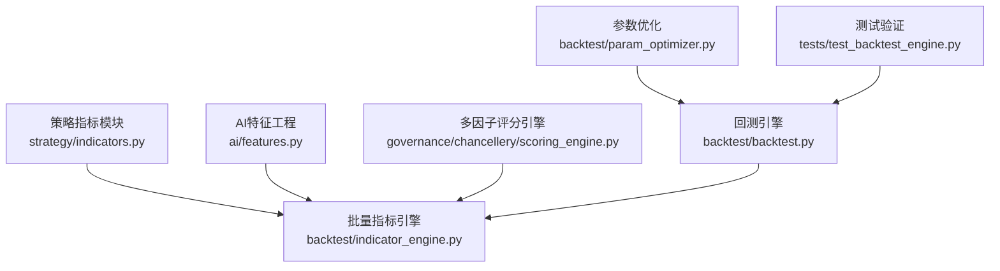
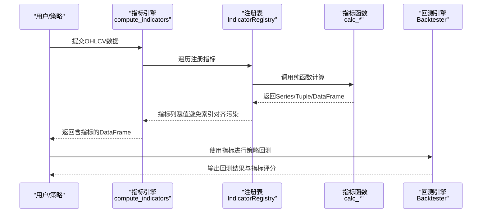
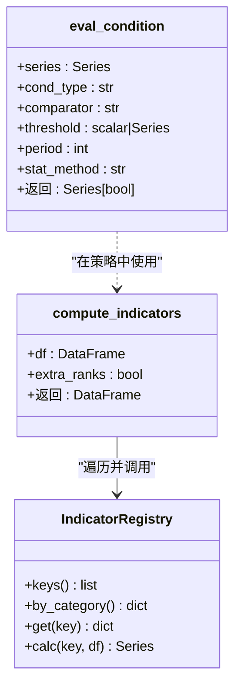
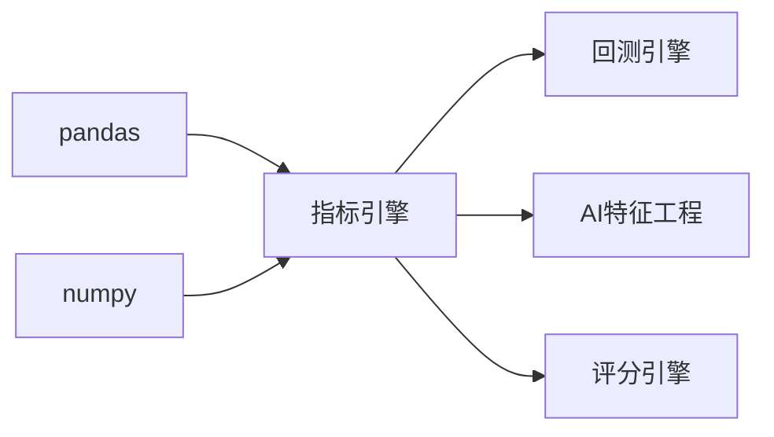
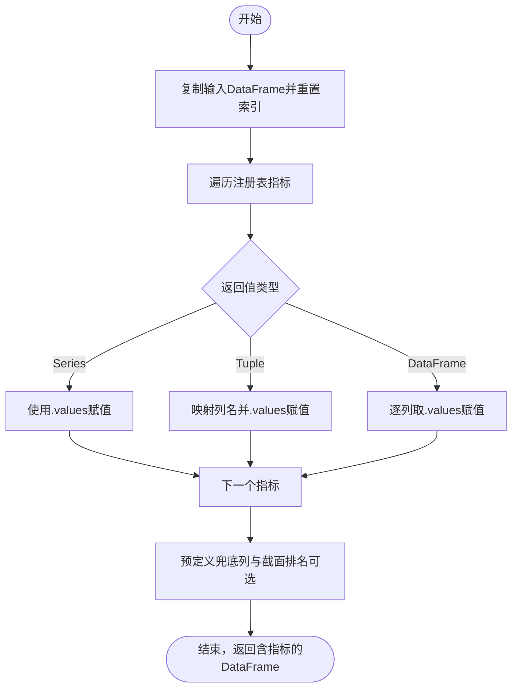

# 指标计算优化

<cite>
**本文档引用的文件**   
- [strategy/indicators.py](file://strategy/indicators.py)
- [backtest/indicator_engine.py](file://backtest/indicator_engine.py)
- [ai/features.py](file://ai/features.py)
- [governance/chancellery/scoring_engine.py](file://governance/chancellery/scoring_engine.py)
- [backtest/backtest.py](file://backtest/backtest.py)
- [backtest/param_optimizer.py](file://backtest/param_optimizer.py)
- [tests/test_backtest_engine.py](file://tests/test_backtest_engine.py)
</cite>

## 目录
1. [引言](#引言)
2. [项目结构](#项目结构)
3. [核心组件](#核心组件)
4. [架构概览](#架构概览)
5. [详细组件分析](#详细组件分析)
6. [依赖分析](#依赖分析)
7. [性能考量](#性能考量)
8. [故障排查指南](#故障排查指南)
9. [结论](#结论)
10. [附录](#附录)

## 引言
本文件聚焦于技术指标计算的向量化实现与性能优化，围绕移动平均线（MA/EMA）、RSI、MACD、KDJ、布林带（BOLL）、ATR、威廉指标（%R）、CCI、OBV、VWAP、量比等常用指标，系统梳理当前实现中的向量化路径、滚动窗口计算策略、索引对齐与赋值安全性、以及可扩展的缓存与批处理机制。同时给出滚动窗口与增量更新的实践建议、多时间框架处理思路、并行化与潜在的GPU加速方向，并提供性能测试与基准评估方法。

## 项目结构
本项目在“策略”“回测”“AI特征工程”“评分引擎”等多个子模块中实现了指标计算与使用，形成“指标定义—批量计算—条件判定—回测评估”的闭环。关键文件分布如下：
- 指标定义与批量计算：strategy/indicators.py、backtest/indicator_engine.py
- AI特征工程：ai/features.py
- 多因子评分：governance/chancellery/scoring_engine.py
- 回测与参数优化：backtest/backtest.py、backtest/param_optimizer.py
- 测试与验证：tests/test_backtest_engine.py

**图表来源**
- [strategy/indicators.py:1-244](file://strategy/indicators.py#L1-L244)
- [backtest/indicator_engine.py:1-433](file://backtest/indicator_engine.py#L1-L433)
- [ai/features.py:1-189](file://ai/features.py#L1-L189)
- [governance/chancellery/scoring_engine.py:1-370](file://governance/chancellery/scoring_engine.py#L1-L370)
- [backtest/backtest.py:1-200](file://backtest/backtest.py#L1-L200)
- [backtest/param_optimizer.py:43-80](file://backtest/param_optimizer.py#L43-L80)
- [tests/test_backtest_engine.py:1-130](file://tests/test_backtest_engine.py#L1-L130)

**章节来源**
- [strategy/indicators.py:1-244](file://strategy/indicators.py#L1-L244)
- [backtest/indicator_engine.py:1-433](file://backtest/indicator_engine.py#L1-L433)

## 核心组件
- 指标定义与批量计算引擎：提供纯函数式的指标计算函数与注册表，支持批量计算与条件判定，强调无状态与可组合性。
- AI特征工程：在K线基础上构建趋势、动量、波动、量价、形态等特征，便于后续模型训练。
- 多因子评分引擎：以因子为粒度计算得分，支持权重配置与信号汇总。
- 回测与参数优化：提供交易执行、成本计算、风控与参数寻优能力，支撑指标策略的实证评估。

**章节来源**
- [backtest/indicator_engine.py:140-273](file://backtest/indicator_engine.py#L140-L273)
- [ai/features.py:82-159](file://ai/features.py#L82-L159)
- [governance/chancellery/scoring_engine.py:246-314](file://governance/chancellery/scoring_engine.py#L246-L314)
- [backtest/backtest.py:56-120](file://backtest/backtest.py#L56-L120)
- [backtest/param_optimizer.py:43-80](file://backtest/param_optimizer.py#L43-L80)

## 架构概览
指标计算的总体流程为：输入OHLCV数据 → 批量计算引擎注册并计算指标 → 条件判定与策略生成 → 回测执行与评估 → 参数优化迭代。

**图表来源**
- [backtest/indicator_engine.py:287-358](file://backtest/indicator_engine.py#L287-L358)
- [backtest/indicator_engine.py:140-273](file://backtest/indicator_engine.py#L140-L273)
- [backtest/backtest.py:121-200](file://backtest/backtest.py#L121-L200)

## 详细组件分析

### 批量指标引擎与注册表
- 注册表负责维护指标键、显示名、计算函数与分类信息，支持按类别检索与统一计算。
- 批量计算函数遍历注册表，调用对应计算函数，对返回值进行类型分支处理，确保列赋值时不发生索引对齐污染。
- 条件判定函数提供点位、窗口内全满足/任一满足、滚动统计等条件表达能力，便于策略筛选。

**图表来源**
- [backtest/indicator_engine.py:140-273](file://backtest/indicator_engine.py#L140-L273)
- [backtest/indicator_engine.py:287-358](file://backtest/indicator_engine.py#L287-L358)
- [backtest/indicator_engine.py:361-432](file://backtest/indicator_engine.py#L361-L432)

**章节来源**
- [backtest/indicator_engine.py:140-273](file://backtest/indicator_engine.py#L140-L273)
- [backtest/indicator_engine.py:287-358](file://backtest/indicator_engine.py#L287-L358)
- [backtest/indicator_engine.py:361-432](file://backtest/indicator_engine.py#L361-L432)

### 移动平均线（MA/EMA）
- MA通过滚动均值实现，EMA通过指数加权实现，两者均支持多周期组合输出。
- 建议：在批量计算中优先使用向量化EWMA，避免显式循环；对多周期MA，可先构造统一窗口的滚动对象，再按列提取。

**章节来源**
- [strategy/indicators.py:13-26](file://strategy/indicators.py#L13-L26)
- [backtest/indicator_engine.py:46-51](file://backtest/indicator_engine.py#L46-L51)

### RSI（相对强弱指数）
- 实现要点：差分、正负分离、EWMA平滑、安全除法、最终公式转换。
- 建议：使用clip保护除零，避免NaN传播；对多周期RSI，可共享delta与gain/loss的EWMA中间结果。

**章节来源**
- [strategy/indicators.py:46-60](file://strategy/indicators.py#L46-L60)
- [backtest/indicator_engine.py:54-60](file://backtest/indicator_engine.py#L54-L60)
- [ai/features.py:29-37](file://ai/features.py#L29-L37)

### MACD（指数平滑异同移动平均线）
- 实现要点：快慢EMA差得到DIF，DIF的信号EMA得到DEA，柱状图为两者的差倍数。
- 建议：复用快慢EMA中间结果，避免重复计算；对返回值为tuple的指标，统一用.values赋值，防止索引对齐。

**章节来源**
- [strategy/indicators.py:29-43](file://strategy/indicators.py#L29-L43)
- [backtest/indicator_engine.py:74-81](file://backtest/indicator_engine.py#L74-L81)
- [ai/features.py:40-47](file://ai/features.py#L40-L47)

### KDJ（随机指标）
- 实现要点：滚动极值、RSV计算、指数平滑K/D、J=3K-2D。
- 建议：使用安全除法避免除零；K/D的EWMA平滑可复用。

**章节来源**
- [strategy/indicators.py:63-82](file://strategy/indicators.py#L63-L82)
- [backtest/indicator_engine.py:63-71](file://backtest/indicator_engine.py#L63-L71)

### 布林带（BOLL）
- 实现要点：中轨MA、标准差STD、上下轨与带宽。
- 建议：先计算MA与STD，再组合上下轨与带宽，避免重复滚动。

**章节来源**
- [strategy/indicators.py:85-100](file://strategy/indicators.py#L85-L100)
- [backtest/indicator_engine.py:84-90](file://backtest/indicator_engine.py#L84-L90)
- [ai/features.py:50-57](file://ai/features.py#L50-L57)

### ATR（平均真实波幅）
- 实现要点：TR计算（高-低、绝对价差），滚动均值。
- 建议：使用向量化concat与max实现TR，再滚动均值。

**章节来源**
- [strategy/indicators.py:103-114](file://strategy/indicators.py#L103-L114)
- [backtest/indicator_engine.py:110-116](file://backtest/indicator_engine.py#L110-L116)
- [governance/chancellery/scoring_engine.py:145-150](file://governance/chancellery/scoring_engine.py#L145-L150)

### 威廉指标（%R）
- 实现要点：滚动最高/最低、安全除法、线性变换。
- 建议：与RSI类似，使用安全除法与滚动极值。

**章节来源**
- [backtest/indicator_engine.py:93-98](file://backtest/indicator_engine.py#L93-L98)

### CCI（商品通道指标）
- 实现要点：典型价格、滚动均值、滚动绝对偏差（MAD）。
- 建议：MAD可用rolling+apply实现，注意常数缩放。

**章节来源**
- [strategy/indicators.py:134-143](file://strategy/indicators.py#L134-L143)
- [backtest/indicator_engine.py:101-107](file://backtest/indicator_engine.py#L101-L107)

### OBV（能量潮）与VWAP（成交量加权均价）
- 实现要点：OBV基于方向与成交量累加；VWAP为滚动加权和/滚动成交量和。
- 建议：OBV可用向量化sign(diff)+cumsum；VWAP注意分母安全。

**章节来源**
- [strategy/indicators.py:117-131](file://strategy/indicators.py#L117-L131)
- [ai/features.py:69-79](file://ai/features.py#L69-L79)
- [ai/features.py:120-124](file://ai/features.py#L120-L124)

### 量比（Volume Ratio）
- 实现要点：当日量/过去N日均量。
- 建议：使用安全除法，避免0均量。

**章节来源**
- [strategy/indicators.py:182-189](file://strategy/indicators.py#L182-L189)
- [backtest/indicator_engine.py:125-127](file://backtest/indicator_engine.py#L125-L127)

### 条件判定与滚动窗口
- 提供点位条件、窗口内全满足/任一满足、滚动统计（均值/最大/最小/和/标准差）等条件表达。
- 建议：all_n/any_n使用rolling+min/max并设置min_periods；stat_n根据stat_method选择对应滚动聚合。

**章节来源**
- [backtest/indicator_engine.py:361-432](file://backtest/indicator_engine.py#L361-L432)

### 指标缓存机制设计
- 现状：回测模块提供“截面排名/分位”等后处理列，但未见针对指标计算结果的通用缓存。
- 设计建议：
  - 以“日期+代码+指标集”为键，缓存批量计算后的指标列，避免重复计算。
  - 在compute_indicators前后增加缓存命中检测与写入逻辑，结合数据库或本地持久化。
  - 对高频访问的指标（如MA/EMA/RSI/MACD），优先从缓存读取，失败再计算。

**章节来源**
- [backtest/indicator_engine.py:287-358](file://backtest/indicator_engine.py#L287-L358)

### 多时间框架指标优化
- 现状：未见跨时间框架的指标对齐与插值实现。
- 优化建议：
  - 对高频数据（分钟/5分钟）与日线指标进行对齐，采用最近邻或线性插值。
  - 对高频指标（如分钟K线RSI）按日聚合时，保留滚动窗口的中间状态（如EWMA alpha、窗口和/计数）以便日线增量更新。
  - 使用分组与重采样策略，减少重复计算。

[本节为概念性内容，不直接分析具体文件，故无“章节来源”]

### 并行化与GPU加速
- 并行化现状：回测模块在Agent层面支持并行执行不同任务，但指标计算本身未见多进程/多线程并行。
- 并行化建议：
  - 指标计算：对多标的独立计算采用多进程池，按标的分片；对单标的多周期指标可并行化EWMA/滚动聚合。
  - 向量化：优先使用NumPy/Pandas向量化，减少Python循环。
  - GPU加速：对大规模滚动窗口与EWMA，可考虑使用Numba/JAX/PyTorch（CUDA）进行核函数加速；注意数据搬运与内存布局。
- 注意事项：并行时需保证索引对齐与列赋值的安全性，避免竞态。

[本节为概念性内容，不直接分析具体文件，故无“章节来源”]

## 依赖分析
- 指标引擎依赖pandas/numpy，强调纯函数与无状态，利于组合与测试。
- 条件判定函数依赖滚动窗口与布尔比较，提供策略筛选能力。
- 回测引擎依赖指标列进行交易决策与风控，形成闭环。

**图表来源**
- [backtest/indicator_engine.py:9-10](file://backtest/indicator_engine.py#L9-L10)
- [ai/features.py:12-13](file://ai/features.py#L12-L13)
- [governance/chancellery/scoring_engine.py:20-21](file://governance/chancellery/scoring_engine.py#L20-L21)

**章节来源**
- [backtest/indicator_engine.py:9-10](file://backtest/indicator_engine.py#L9-L10)
- [ai/features.py:12-13](file://ai/features.py#L12-L13)
- [governance/chancellery/scoring_engine.py:20-21](file://governance/chancellery/scoring_engine.py#L20-L21)

## 性能考量
- 向量化优先：使用pandas/numpy内置函数替代显式循环；对EWMA/滚动聚合，尽量共享中间结果。
- 索引对齐与赋值安全：批量计算中统一使用.values赋值，避免Series索引对齐导致的列污染。
- 内存与I/O：
  - 减少中间DataFrame拷贝，必要时就地修改。
  - 对高频指标（MA/RSI/MACD）建立缓存，降低重复计算。
- 并行与GPU：
  - 多标的并行计算；对EWMA/滚动窗口核函数可尝试JIT加速。
- 回测成本控制：在回测中预计算ATR/波动率，避免每笔交易重复计算。

[本节为一般性指导，不直接分析具体文件，故无“章节来源”]

## 故障排查指南
- 索引对齐问题：若出现列值错位或NaN异常，检查是否使用了Series直接赋值而非.values。
- 除零与数值稳定：使用安全除法（clip）避免0分母；对RSI/CCI等指标，注意分母为0的保护。
- 条件判定边界：all_n/any_n需设置min_periods；stat_n需指定stat_method。
- 回测T+1与滑点：确认信号日不成交，次日开盘价执行；滑点应用于开盘价。

**章节来源**
- [backtest/indicator_engine.py:17-19](file://backtest/indicator_engine.py#L17-L19)
- [backtest/indicator_engine.py:404-412](file://backtest/indicator_engine.py#L404-L412)
- [backtest/indicator_engine.py:414-429](file://backtest/indicator_engine.py#L414-L429)
- [tests/test_backtest_engine.py:19-91](file://tests/test_backtest_engine.py#L19-L91)
- [backtest/backtest.py:190-200](file://backtest/backtest.py#L190-L200)

## 结论
当前项目在指标定义与批量计算方面具备良好的向量化基础，注册表与纯函数设计提升了可组合性与可测试性。为进一步提升性能，建议引入指标缓存、滚动窗口中间状态复用、并行化与潜在的GPU加速，并在多时间框架场景下完善对齐与增量更新策略。通过严格的测试与基准评估，持续优化指标计算效率与策略回测稳定性。

## 附录

### 指标计算流程（批量引擎）

**图表来源**
- [backtest/indicator_engine.py:287-358](file://backtest/indicator_engine.py#L287-L358)

### 性能测试与基准评估方法
- 方法：对相同数据集分别运行不同实现（含缓存/并行/GPU），记录CPU时间、内存占用、吞吐量。
- 指标：单次计算耗时、批量处理吞吐、缓存命中率、回测总耗时。
- 基准：以“无缓存+单进程+纯pandas”为基线，对比优化后改进幅度。
- 回归验证：在回测中对比策略收益、胜率、最大回撤等指标，确保优化不引入偏差。

**章节来源**
- [backtest/param_optimizer.py:43-80](file://backtest/param_optimizer.py#L43-L80)
- [tests/test_backtest_engine.py:1-130](file://tests/test_backtest_engine.py#L1-L130)