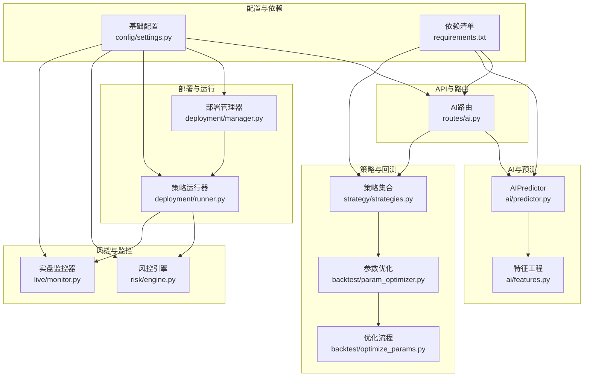
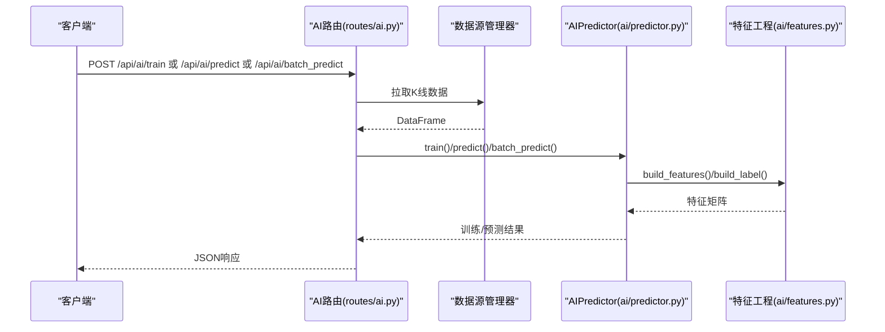
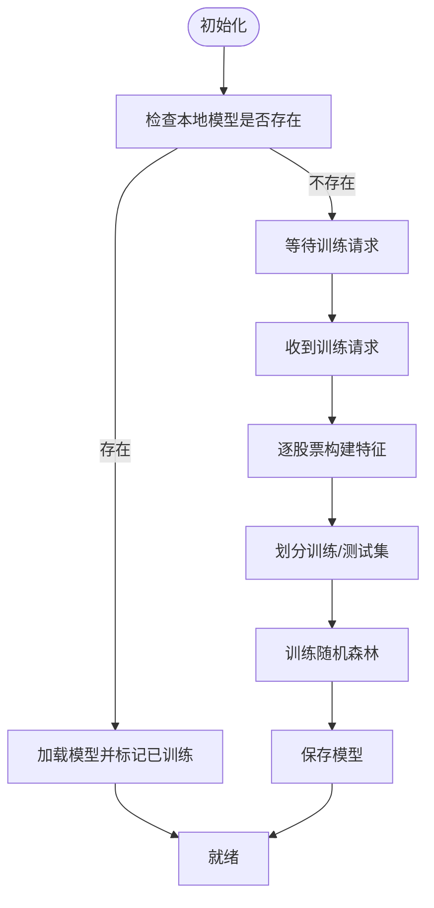
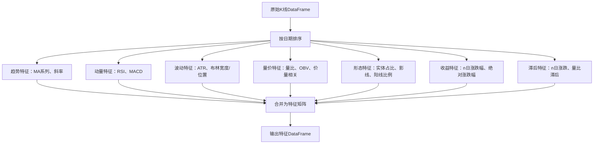
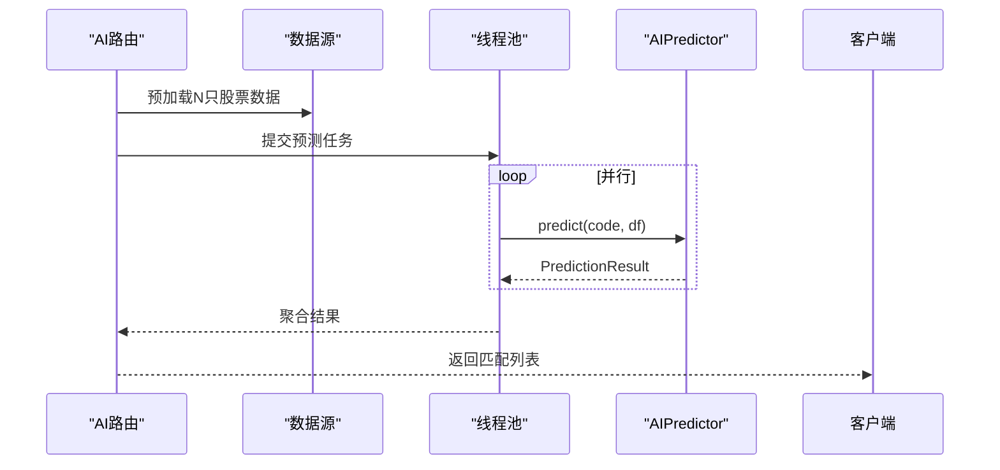
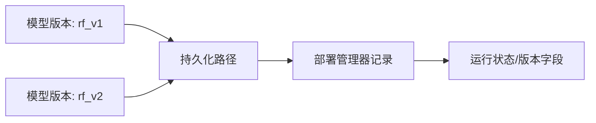
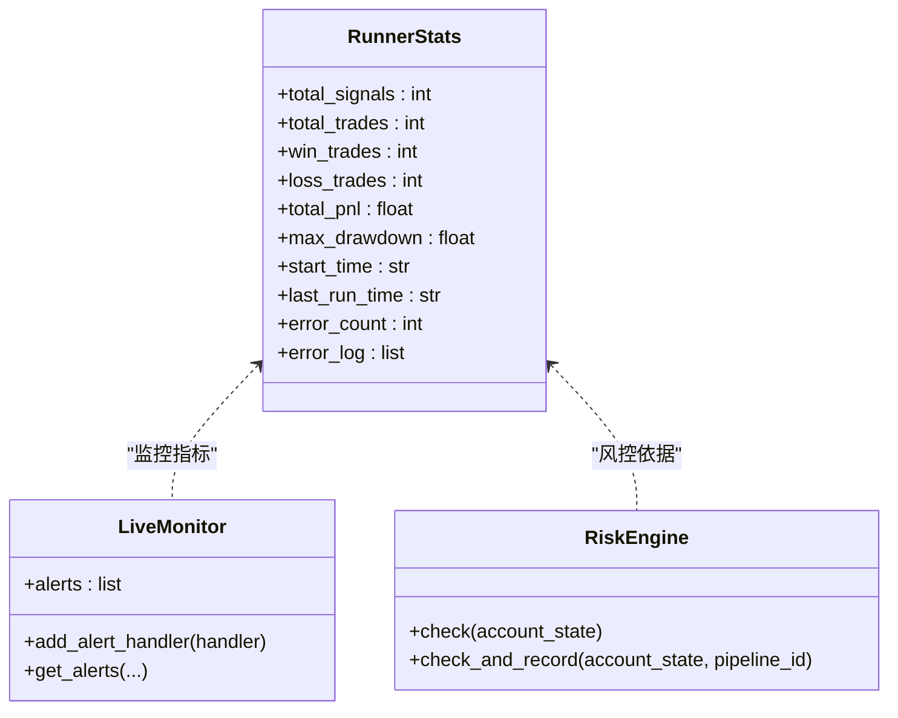
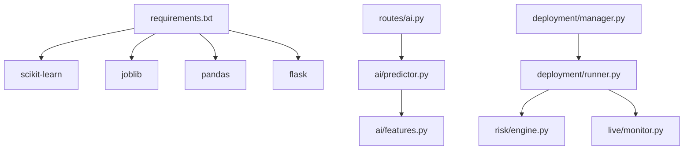

# 机器学习模型优化

<cite>
**本文引用的文件**
- [ai/predictor.py](file://ai/predictor.py)
- [ai/features.py](file://ai/features.py)
- [routes/ai.py](file://routes/ai.py)
- [deployment/manager.py](file://deployment/manager.py)
- [deployment/runner.py](file://deployment/runner.py)
- [live/monitor.py](file://live/monitor.py)
- [risk/engine.py](file://risk/engine.py)
- [strategy/strategies.py](file://strategy/strategies.py)
- [backtest/param_optimizer.py](file://backtest/param_optimizer.py)
- [backtest/optimize_params.py](file://backtest/optimize_params.py)
- [config/settings.py](file://config/settings.py)
- [requirements.txt](file://requirements.txt)
</cite>

## 目录
1. [引言](#引言)
2. [项目结构](#项目结构)
3. [核心组件](#核心组件)
4. [架构总览](#架构总览)
5. [详细组件分析](#详细组件分析)
6. [依赖分析](#依赖分析)
7. [性能考虑](#性能考虑)
8. [故障排查指南](#故障排查指南)
9. [结论](#结论)
10. [附录](#附录)

## 引言
本文件面向“机器学习模型推理优化”的专业需求，结合仓库现有AI预测与回测体系，系统梳理模型加载与初始化、特征工程、批处理推理、模型压缩与量化、版本管理与A/B测试、在线学习与增量训练、性能监控与回归检测、以及GPU加速与硬件优化等主题。由于当前仓库以传统CPU机器学习为主（随机森林），本文在保持与代码一致的前提下，给出可扩展至深度学习与高性能推理的实践建议与迁移路径。

## 项目结构
项目采用“三省六部”组织方式，AI预测与特征工程位于AI子模块，API路由提供训练、预测、批量扫描等接口，部署管理器负责策略运行与状态管理，风控引擎与实盘监控贯穿交易生命周期，策略模块提供多策略与融合打分，回测与参数优化支撑策略迭代。

图示来源
- [ai/predictor.py:44-241](file://ai/predictor.py#L44-L241)
- [ai/features.py:82-189](file://ai/features.py#L82-L189)
- [routes/ai.py:18-342](file://routes/ai.py#L18-L342)
- [deployment/manager.py:24-216](file://deployment/manager.py#L24-L216)
- [deployment/runner.py:44-182](file://deployment/runner.py#L44-L182)
- [risk/engine.py:13-168](file://risk/engine.py#L13-L168)
- [live/monitor.py:55-286](file://live/monitor.py#L55-L286)
- [strategy/strategies.py:1-431](file://strategy/strategies.py#L1-L431)
- [backtest/param_optimizer.py:144-215](file://backtest/param_optimizer.py#L144-L215)
- [backtest/optimize_params.py:120-154](file://backtest/optimize_params.py#L120-L154)
- [config/settings.py:1-25](file://config/settings.py#L1-L25)
- [requirements.txt:1-9](file://requirements.txt#L1-L9)

章节来源
- [routes/ai.py:18-342](file://routes/ai.py#L18-L342)
- [ai/predictor.py:44-241](file://ai/predictor.py#L44-L241)
- [ai/features.py:82-189](file://ai/features.py#L82-L189)
- [deployment/manager.py:24-216](file://deployment/manager.py#L24-L216)
- [deployment/runner.py:44-182](file://deployment/runner.py#L44-L182)
- [risk/engine.py:13-168](file://risk/engine.py#L13-L168)
- [live/monitor.py:55-286](file://live/monitor.py#L55-L286)
- [strategy/strategies.py:1-431](file://strategy/strategies.py#L1-L431)
- [backtest/param_optimizer.py:144-215](file://backtest/param_optimizer.py#L144-L215)
- [backtest/optimize_params.py:120-154](file://backtest/optimize_params.py#L120-L154)
- [config/settings.py:1-25](file://config/settings.py#L1-L25)
- [requirements.txt:1-9](file://requirements.txt#L1-L9)

## 核心组件
- AIPredictor：封装随机森林模型的训练、加载、保存、单/批量预测与特征重要性导出，具备基础置信度输出。
- 特征工程：构建趋势、动量、波动、量价、形态与滞后类特征，形成固定特征列集合。
- AI路由：提供训练、单/批量预测、扫描全市场、特征重要性查询等HTTP接口。
- 部署管理器与策略运行器：提供策略注册、部署、启停、暂停/恢复、热更新与运行统计。
- 实盘监控器：定时扫描持仓、价格异动、止损止盈触发与告警推送。
- 风控引擎：规则化风控检查、状态入库与事件审计。
- 策略与回测：多策略与融合打分，参数优化与步行优化框架。

章节来源
- [ai/predictor.py:44-241](file://ai/predictor.py#L44-L241)
- [ai/features.py:82-189](file://ai/features.py#L82-L189)
- [routes/ai.py:67-342](file://routes/ai.py#L67-L342)
- [deployment/manager.py:24-216](file://deployment/manager.py#L24-L216)
- [deployment/runner.py:44-182](file://deployment/runner.py#L44-L182)
- [live/monitor.py:55-286](file://live/monitor.py#L55-L286)
- [risk/engine.py:13-168](file://risk/engine.py#L13-L168)
- [strategy/strategies.py:1-431](file://strategy/strategies.py#L1-L431)

## 架构总览
AI预测流水线由“数据获取→特征工程→模型推理→结果聚合→对外服务”构成；部署与运行器负责策略生命周期管理；风控与监控贯穿交易执行；回测与参数优化驱动策略迭代。

图示来源
- [routes/ai.py:85-222](file://routes/ai.py#L85-L222)
- [ai/predictor.py:70-208](file://ai/predictor.py#L70-L208)
- [ai/features.py:82-189](file://ai/features.py#L82-L189)

## 详细组件分析

### 模型加载与初始化优化
- 模型缓存：AIPredictor在构造时尝试从本地持久化路径加载模型，若成功则标记为已训练，避免重复训练。
- 懒加载：首次训练或预测时才进行特征工程与模型推断，减少冷启动成本。
- 预热机制：可通过API的扫描接口一次性预加载多只股票数据，配合并发预测实现“预热”效果。

图示来源
- [ai/predictor.py:47-68](file://ai/predictor.py#L47-L68)
- [ai/predictor.py:70-148](file://ai/predictor.py#L70-L148)

章节来源
- [ai/predictor.py:47-68](file://ai/predictor.py#L47-L68)
- [ai/predictor.py:70-148](file://ai/predictor.py#L70-L148)
- [routes/ai.py:224-328](file://routes/ai.py#L224-L328)

### 特征工程性能优化
- 特征选择：使用固定特征列集合，便于模型稳定与可解释性；可结合特征重要性动态裁剪。
- 降维技术：当前以特征工程为主，未见显式降维；可引入PCA/ICA或基于重要性的递归特征消除。
- 实时特征计算：特征工程函数对DataFrame进行向量化计算，建议在数据源侧缓存常用指标，减少重复计算。

图示来源
- [ai/features.py:82-159](file://ai/features.py#L82-L159)

章节来源
- [ai/features.py:82-189](file://ai/features.py#L82-L189)

### 模型预测的批处理优化
- 输入数据整理：路由层按股票代码批量拉取数据并排序，避免重复查库。
- 并行推理：扫描接口使用线程池并发预测，利用CPU多核提升吞吐。
- 结果聚合：按置信度排序并补充名称与最新价格，便于前端展示。

图示来源
- [routes/ai.py:224-328](file://routes/ai.py#L224-L328)
- [ai/predictor.py:150-208](file://ai/predictor.py#L150-L208)

章节来源
- [routes/ai.py:224-328](file://routes/ai.py#L224-L328)
- [ai/predictor.py:150-208](file://ai/predictor.py#L150-L208)

### 模型压缩与量化技术
- 剪枝：可将特征重要性较低的特征剔除，降低维度与计算量。
- 蒸馏：以大模型软标签指导小模型训练，提升泛化与速度。
- INT8量化：当前随机森林为CPU可执行树模型，不涉及INT8；若迁移到ONNXRuntime/TensorRT，可启用INT8/混合精度。

章节来源
- [ai/predictor.py:210-228](file://ai/predictor.py#L210-L228)
- [ai/features.py:176-188](file://ai/features.py#L176-L188)

### 模型版本管理与A/B测试
- 版本管理：模型持久化路径固定，可通过版本号后缀区分；部署管理器记录注册/部署时间与状态。
- A/B测试：可在路由层按策略/模型版本分流请求，记录命中与指标，结合回测框架评估差异。

图示来源
- [ai/predictor.py:194-195](file://ai/predictor.py#L194-L195)
- [ai/predictor.py:220-228](file://ai/predictor.py#L220-L228)
- [deployment/manager.py:52-62](file://deployment/manager.py#L52-L62)

章节来源
- [ai/predictor.py:194-195](file://ai/predictor.py#L194-L195)
- [ai/predictor.py:220-228](file://ai/predictor.py#L220-L228)
- [deployment/manager.py:52-62](file://deployment/manager.py#L52-L62)

### 在线学习与增量训练
- 当前实现为离线训练与静态模型；若需在线学习，可引入在线/增量学习算法（如SGD族、在线朴素贝叶斯）或定期微调策略。
- 建议：以滑动窗口数据增量训练，结合A/B分流验证新模型收益。

章节来源
- [ai/predictor.py:70-148](file://ai/predictor.py#L70-L148)

### 模型性能监控、准确率跟踪与性能回归检测
- 性能监控：部署运行器内置统计字段（信号数、交易数、盈亏、最大回撤、错误计数），可用于模型/策略健康度观测。
- 准确率跟踪：路由层提供特征重要性查询，结合回测指标（胜率、夏普、最大回撤）评估模型稳定性。
- 回归检测：通过对比历史指标序列与阈值告警，结合实盘监控器的价格异动与风控引擎的阻断事件，快速定位回归。

图示来源
- [deployment/runner.py:29-42](file://deployment/runner.py#L29-L42)
- [live/monitor.py:31-42](file://live/monitor.py#L31-L42)
- [risk/engine.py:19-71](file://risk/engine.py#L19-L71)

章节来源
- [deployment/runner.py:29-42](file://deployment/runner.py#L29-L42)
- [live/monitor.py:55-286](file://live/monitor.py#L55-L286)
- [risk/engine.py:19-71](file://risk/engine.py#L19-L71)

### GPU加速与硬件特定优化
- 当前依赖为scikit-learn与joblib，未使用GPU；若迁移到深度学习框架，可启用TensorRT/ONNXRuntime GPU后端、混合精度与张量并行。
- 硬件优化：合理设置线程数（n_jobs）、NUMA亲和、内存池与缓存预热，减少I/O瓶颈。

章节来源
- [requirements.txt:1-9](file://requirements.txt#L1-L9)
- [ai/predictor.py:119-126](file://ai/predictor.py#L119-L126)

## 依赖分析
- 外部依赖：pandas、numpy、scikit-learn、joblib、flask等，满足CPU机器学习与Web服务需求。
- 模块耦合：AI路由依赖AIPredictor与数据源管理器；部署管理器与策略运行器解耦于业务逻辑；风控与监控分别独立维护。

图示来源
- [requirements.txt:1-9](file://requirements.txt#L1-L9)
- [routes/ai.py:14-15](file://routes/ai.py#L14-L15)
- [ai/predictor.py](file://ai/predictor.py#L24)
- [ai/features.py:12-13](file://ai/features.py#L12-L13)
- [deployment/manager.py](file://deployment/manager.py#L17)
- [deployment/runner.py:17-18](file://deployment/runner.py#L17-L18)
- [risk/engine.py:8-9](file://risk/engine.py#L8-L9)
- [live/monitor.py:20-21](file://live/monitor.py#L20-L21)

章节来源
- [requirements.txt:1-9](file://requirements.txt#L1-L9)
- [routes/ai.py:14-15](file://routes/ai.py#L14-L15)
- [ai/predictor.py](file://ai/predictor.py#L24)
- [ai/features.py:12-13](file://ai/features.py#L12-L13)
- [deployment/manager.py](file://deployment/manager.py#L17)
- [deployment/runner.py:17-18](file://deployment/runner.py#L17-L18)
- [risk/engine.py:8-9](file://risk/engine.py#L8-L9)
- [live/monitor.py:20-21](file://live/monitor.py#L20-L21)

## 性能考虑
- CPU并行：随机森林训练启用多核（n_jobs=-1），预测阶段建议按批次与线程池并发。
- I/O与缓存：数据拉取与特征工程为CPU密集，建议在数据源层缓存常用指标，减少重复计算。
- 模型体积：通过特征选择与模型剪枝降低特征维度，缩短推理时间。
- 线程与资源：部署运行器使用守护线程与事件控制，避免资源泄漏；监控器限制告警频率，防止噪声。

章节来源
- [ai/predictor.py:119-126](file://ai/predictor.py#L119-L126)
- [routes/ai.py:274-289](file://routes/ai.py#L274-L289)
- [deployment/runner.py:69-131](file://deployment/runner.py#L69-L131)
- [live/monitor.py:160-162](file://live/monitor.py#L160-L162)

## 故障排查指南
- 模型加载失败：检查模型持久化路径与权限，确认文件完整性。
- 训练数据不足：路由层对股票数据长度有阈值要求，确保数据源可用与时间窗口足够。
- 预测异常：捕获异常并记录，检查特征工程是否产生缺失值或异常波动。
- 运行器异常：查看运行统计中的错误计数与日志，定位具体策略函数异常。
- 风控阻断：查询风控事件与状态，确认阻断原因与建议。

章节来源
- [ai/predictor.py:54-62](file://ai/predictor.py#L54-L62)
- [routes/ai.py:115-125](file://routes/ai.py#L115-L125)
- [routes/ai.py:172-173](file://routes/ai.py#L172-L173)
- [deployment/runner.py:121-128](file://deployment/runner.py#L121-L128)
- [risk/engine.py:73-127](file://risk/engine.py#L73-L127)

## 结论
本项目以随机森林为核心，提供了从数据到预测的完整链路与可扩展的部署、监控与风控体系。针对推理优化，建议在保持现有特征工程与模型缓存的基础上，引入特征选择与剪枝、并发批处理与线程池、以及版本化与A/B分流；在深度学习迁移时，结合ONNXRuntime/TensorRT与混合精度实现GPU加速与INT8量化。同时，持续的回测与指标监控将保障模型性能与稳定性。

## 附录
- 策略融合与参数优化：多策略融合打分与参数优化框架，支持网格/快速网格/遗传算法/步行优化等多种策略。
- 配置与启动：基础配置文件定义API主机、端口与定时任务时间，便于本地与生产环境部署。

章节来源
- [strategy/strategies.py:368-431](file://strategy/strategies.py#L368-L431)
- [backtest/param_optimizer.py:144-215](file://backtest/param_optimizer.py#L144-L215)
- [backtest/optimize_params.py:120-154](file://backtest/optimize_params.py#L120-L154)
- [config/settings.py:11-24](file://config/settings.py#L11-L24)