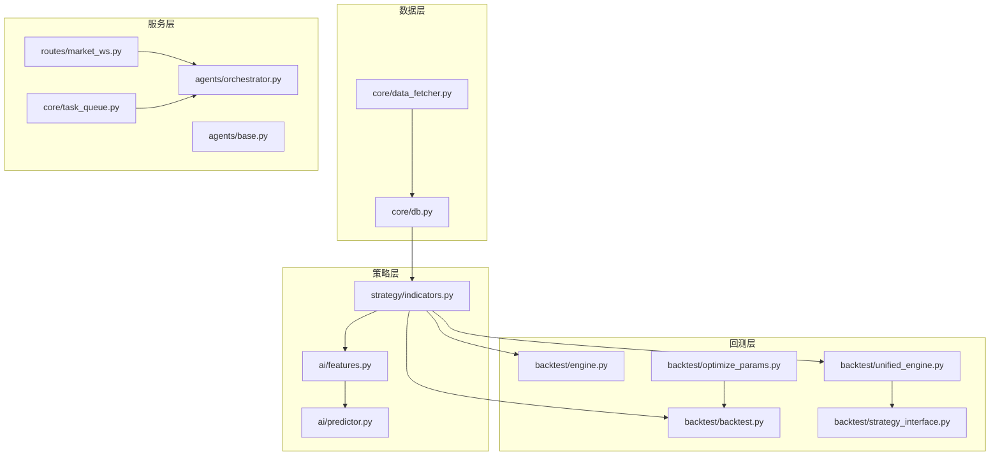
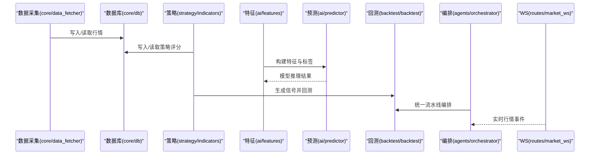
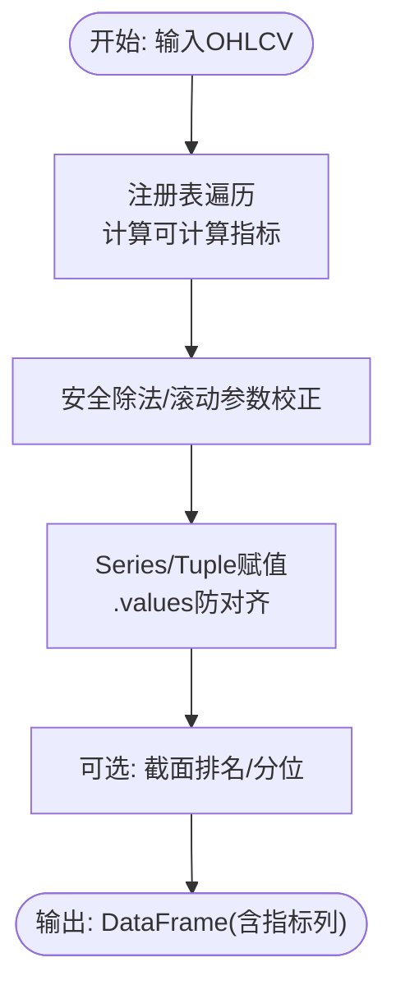
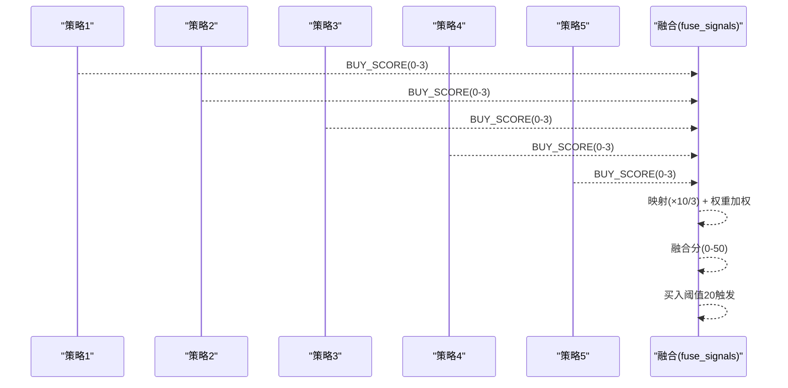
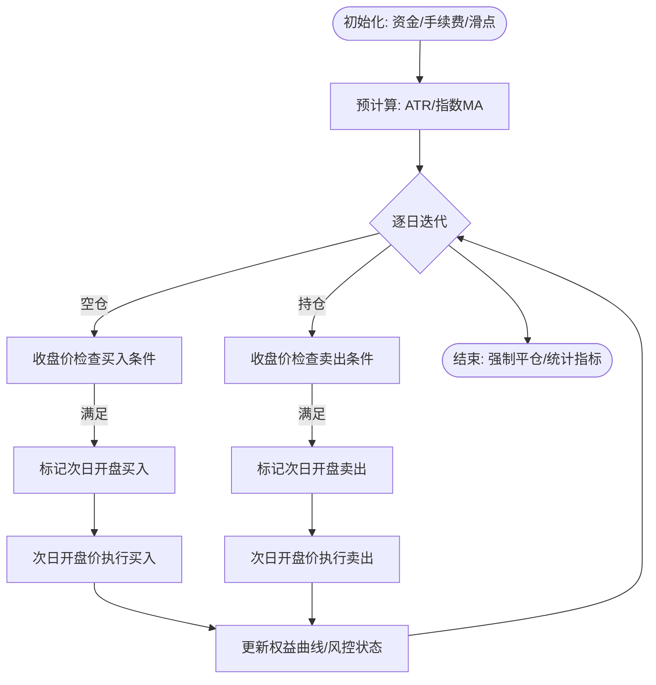
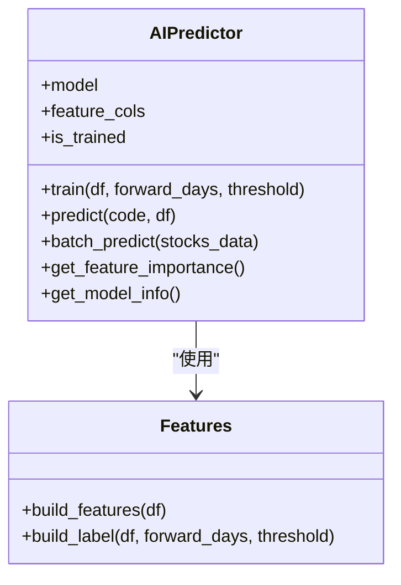
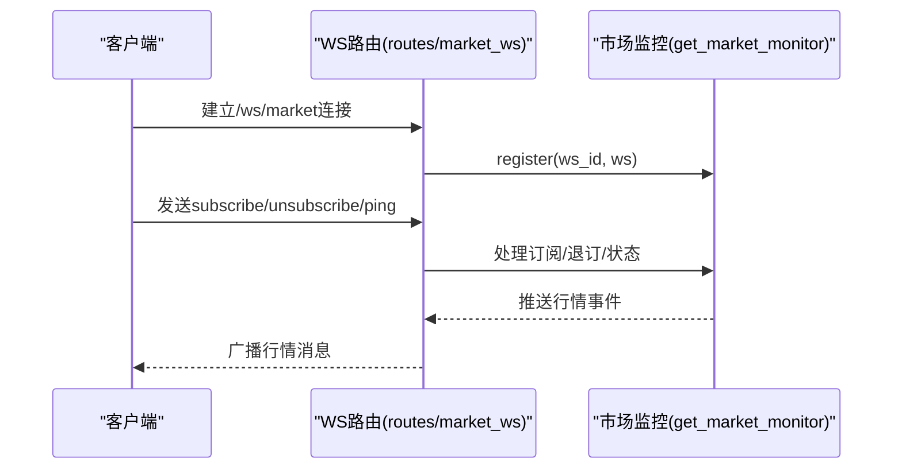
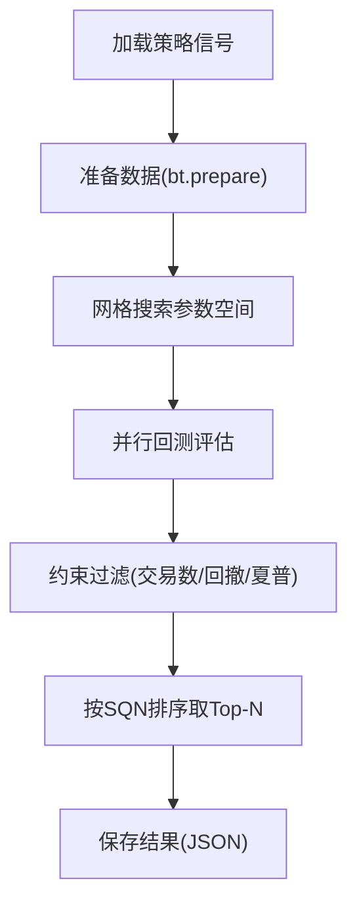
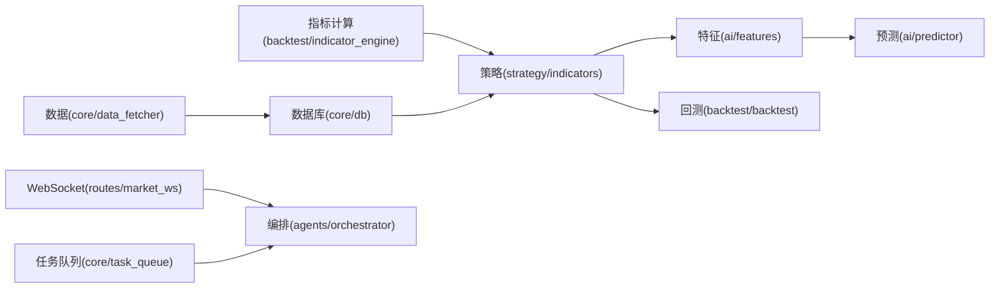

# 算法优化

<cite>
**本文引用的文件**
- [backtest/indicator_engine.py](file://backtest/indicator_engine.py)
- [strategy/indicators.py](file://strategy/indicators.py)
- [ai/features.py](file://ai/features.py)
- [ai/predictor.py](file://ai/predictor.py)
- [backtest/backtest.py](file://backtest/backtest.py)
- [backtest/engine.py](file://backtest/engine.py)
- [backtest/unified_engine.py](file://backtest/unified_engine.py)
- [backtest/strategy_interface.py](file://backtest/strategy_interface.py)
- [core/data_fetcher.py](file://core/data_fetcher.py)
- [core/db.py](file://core/db.py)
- [routes/market_ws.py](file://routes/market_ws.py)
- [core/task_queue.py](file://core/task_queue.py)
- [agents/orchestrator.py](file://agents/orchestrator.py)
- [agents/base.py](file://agents/base.py)
- [backtest/optimize_params.py](file://backtest/optimize_params.py)
</cite>

## 目录
1. [简介](#简介)
2. [项目结构](#项目结构)
3. [核心组件](#核心组件)
4. [架构总览](#架构总览)
5. [详细组件分析](#详细组件分析)
6. [依赖分析](#依赖分析)
7. [性能考量](#性能考量)
8. [故障排查指南](#故障排查指南)
9. [结论](#结论)
10. [附录](#附录)

## 简介
本文件面向AIQuant系统的算法优化，聚焦以下主题：
- 技术指标计算优化：向量化、NumPy数组、循环展开
- 策略算法性能提升：缓存、预计算、增量更新
- 回测引擎优化：时间序列处理、内存映射、并行计算
- 机器学习推理优化：模型压缩、量化、GPU加速
- 复杂度分析、基准测试与瓶颈识别
- 实时数据处理：流式计算、滑动窗口、事件驱动
- 调试工具、性能分析器与内存泄漏检测

## 项目结构
AIQuant采用模块化分层设计，围绕“数据采集-策略生成-回测评估-风控-报表”的流水线组织：
- 数据层：数据源接入与缓存（baostock/akshare）、本地SQLite数据库
- 策略层：多策略信号生成与融合
- 回测层：统一回测引擎与参数优化
- 服务层：WebSocket实时行情、任务队列、编排器
- AI层：特征工程与预测模型

图表来源
- [core/data_fetcher.py:1-578](file://core/data_fetcher.py#L1-L578)
- [core/db.py:1-800](file://core/db.py#L1-L800)
- [strategy/indicators.py:1-244](file://strategy/indicators.py#L1-L244)
- [ai/features.py:1-189](file://ai/features.py#L1-L189)
- [ai/predictor.py:1-241](file://ai/predictor.py#L1-L241)
- [backtest/backtest.py:1-517](file://backtest/backtest.py#L1-L517)
- [backtest/engine.py:1-174](file://backtest/engine.py#L1-L174)
- [backtest/unified_engine.py:1-143](file://backtest/unified_engine.py#L1-L143)
- [backtest/strategy_interface.py:1-86](file://backtest/strategy_interface.py#L1-L86)
- [backtest/optimize_params.py:1-462](file://backtest/optimize_params.py#L1-L462)
- [routes/market_ws.py:1-142](file://routes/market_ws.py#L1-L142)
- [core/task_queue.py:1-222](file://core/task_queue.py#L1-L222)
- [agents/orchestrator.py:1-263](file://agents/orchestrator.py#L1-L263)
- [agents/base.py:1-120](file://agents/base.py#L1-L120)

章节来源
- [core/data_fetcher.py:1-578](file://core/data_fetcher.py#L1-L578)
- [core/db.py:1-800](file://core/db.py#L1-L800)
- [strategy/indicators.py:1-244](file://strategy/indicators.py#L1-L244)
- [ai/features.py:1-189](file://ai/features.py#L1-L189)
- [ai/predictor.py:1-241](file://ai/predictor.py#L1-L241)
- [backtest/backtest.py:1-517](file://backtest/backtest.py#L1-L517)
- [backtest/engine.py:1-174](file://backtest/engine.py#L1-L174)
- [backtest/unified_engine.py:1-143](file://backtest/unified_engine.py#L1-L143)
- [backtest/strategy_interface.py:1-86](file://backtest/strategy_interface.py#L1-L86)
- [backtest/optimize_params.py:1-462](file://backtest/optimize_params.py#L1-L462)
- [routes/market_ws.py:1-142](file://routes/market_ws.py#L1-L142)
- [core/task_queue.py:1-222](file://core/task_queue.py#L1-L222)
- [agents/orchestrator.py:1-263](file://agents/orchestrator.py#L1-L263)
- [agents/base.py:1-120](file://agents/base.py#L1-L120)

## 核心组件
- 指标计算引擎：批量计算与注册表，支持向量化与安全除法
- 策略模块：多策略评分与融合，支持T+1回测
- 回测引擎：统一资金曲线、风控与评估指标
- 数据与缓存：本地SQLite与数据缓存，支持批量写入与索引
- 实时服务：WebSocket行情推送与客户端管理
- 编排与任务：三省六部制流水线与任务队列

章节来源
- [backtest/indicator_engine.py:1-433](file://backtest/indicator_engine.py#L1-L433)
- [strategy/indicators.py:1-244](file://strategy/indicators.py#L1-L244)
- [backtest/backtest.py:1-517](file://backtest/backtest.py#L1-L517)
- [core/db.py:1-800](file://core/db.py#L1-L800)
- [routes/market_ws.py:1-142](file://routes/market_ws.py#L1-L142)
- [agents/orchestrator.py:1-263](file://agents/orchestrator.py#L1-L263)
- [core/task_queue.py:1-222](file://core/task_queue.py#L1-L222)

## 架构总览
AIQuant以“策略-回测-风控-报表”为主线，结合数据层与服务层形成闭环。策略层产出信号，回测层评估策略，风控层拦截风险，报表层汇总结果；数据层负责行情与指标的持久化与缓存；服务层提供实时推送与异步任务。

图表来源
- [core/data_fetcher.py:1-578](file://core/data_fetcher.py#L1-L578)
- [core/db.py:1-800](file://core/db.py#L1-L800)
- [strategy/indicators.py:1-244](file://strategy/indicators.py#L1-L244)
- [ai/features.py:1-189](file://ai/features.py#L1-L189)
- [ai/predictor.py:1-241](file://ai/predictor.py#L1-L241)
- [backtest/backtest.py:1-517](file://backtest/backtest.py#L1-L517)
- [agents/orchestrator.py:1-263](file://agents/orchestrator.py#L1-L263)
- [routes/market_ws.py:1-142](file://routes/market_ws.py#L1-L142)

## 详细组件分析

### 指标计算与向量化优化
- 批量指标引擎：集中注册与批量计算，避免重复计算，支持tuple/series混合返回
- 安全除法与滚动窗口：统一使用clip与min_periods，避免除零与空窗
- NumPy向量化：利用rolling/ewm/shift等原生向量化操作，减少显式循环
- 索引对齐防护：通过.values赋值避免pandas按index对齐导致的列污染

图表来源
- [backtest/indicator_engine.py:287-358](file://backtest/indicator_engine.py#L287-L358)

章节来源
- [backtest/indicator_engine.py:1-433](file://backtest/indicator_engine.py#L1-L433)
- [strategy/indicators.py:1-244](file://strategy/indicators.py#L1-L244)

### 策略评分与融合的性能优化
- 预计算与缓存：将MA/RSI/MACD等指标预先计算并写入数据库，回测时直接读取
- 融合映射：将各策略评分从0-3线性映射至0-10，再按权重加权，避免重复计算
- T+1延迟执行：通过延迟队列在次日开盘价执行，减少未来数据泄露风险

图表来源
- [strategy/indicators.py:367-431](file://strategy/indicators.py#L367-L431)

章节来源
- [strategy/indicators.py:1-431](file://strategy/indicators.py#L1-L431)
- [core/db.py:581-630](file://core/db.py#L581-L630)

### 回测引擎的算法优化
- 资金曲线与风控：统一计算年化收益、最大回撤、夏普比率、盈亏比
- 动态仓位：基于ATR波动率动态调整有效仓位比例
- 大盘择时：基于指数均线过滤开仓时机
- 回撤熔断：连续亏损与回撤阈值触发暂停开仓

图表来源
- [backtest/backtest.py:121-410](file://backtest/backtest.py#L121-L410)

章节来源
- [backtest/backtest.py:1-517](file://backtest/backtest.py#L1-L517)
- [backtest/unified_engine.py:1-143](file://backtest/unified_engine.py#L1-L143)
- [backtest/strategy_interface.py:1-86](file://backtest/strategy_interface.py#L1-L86)

### 机器学习推理优化
- 特征工程：使用rolling/ewm/shift等向量化操作构建趋势、动量、波动、量价等特征
- 模型压缩：使用joblib持久化，便于快速加载与部署
- 并行训练：n_jobs=-1启用多核并行训练
- 二分类映射：将多分类标签映射为二分类，降低模型复杂度

图表来源
- [ai/predictor.py:44-241](file://ai/predictor.py#L44-L241)
- [ai/features.py:82-189](file://ai/features.py#L82-L189)

章节来源
- [ai/predictor.py:1-241](file://ai/predictor.py#L1-L241)
- [ai/features.py:1-189](file://ai/features.py#L1-L189)

### 实时数据处理与事件驱动
- WebSocket路由：连接管理、订阅/退订、心跳与状态查询
- 市场监控：客户端注册与状态维护，支持手动启停推送
- 事件驱动：编排器监听实时事件，触发流水线执行

图表来源
- [routes/market_ws.py:72-123](file://routes/market_ws.py#L72-L123)

章节来源
- [routes/market_ws.py:1-142](file://routes/market_ws.py#L1-L142)
- [agents/orchestrator.py:1-263](file://agents/orchestrator.py#L1-L263)

### 参数优化与并行计算
- 网格搜索：score_threshold、止损/止盈倍数、最大持仓天数、仓位比例
- 约束过滤：最少交易数、最大回撤上限、最低夏普比率
- 并行评估：多参数组合并行回测，最大化SQN综合质量指标

图表来源
- [backtest/optimize_params.py:120-177](file://backtest/optimize_params.py#L120-L177)

章节来源
- [backtest/optimize_params.py:1-462](file://backtest/optimize_params.py#L1-L462)

## 依赖分析
- 指标层依赖pandas/numpy进行向量化计算
- 策略层依赖指标层输出，回测层依赖策略层信号
- 数据层提供OHLCV与指标的持久化能力
- 服务层通过WebSocket与编排器解耦，支持异步任务

图表来源
- [backtest/indicator_engine.py:1-433](file://backtest/indicator_engine.py#L1-L433)
- [strategy/indicators.py:1-244](file://strategy/indicators.py#L1-L244)
- [ai/features.py:1-189](file://ai/features.py#L1-L189)
- [ai/predictor.py:1-241](file://ai/predictor.py#L1-L241)
- [backtest/backtest.py:1-517](file://backtest/backtest.py#L1-L517)
- [core/data_fetcher.py:1-578](file://core/data_fetcher.py#L1-L578)
- [core/db.py:1-800](file://core/db.py#L1-L800)
- [routes/market_ws.py:1-142](file://routes/market_ws.py#L1-L142)
- [core/task_queue.py:1-222](file://core/task_queue.py#L1-L222)
- [agents/orchestrator.py:1-263](file://agents/orchestrator.py#L1-L263)

章节来源
- [backtest/indicator_engine.py:1-433](file://backtest/indicator_engine.py#L1-L433)
- [strategy/indicators.py:1-244](file://strategy/indicators.py#L1-L244)
- [ai/features.py:1-189](file://ai/features.py#L1-L189)
- [ai/predictor.py:1-241](file://ai/predictor.py#L1-L241)
- [backtest/backtest.py:1-517](file://backtest/backtest.py#L1-L517)
- [core/data_fetcher.py:1-578](file://core/data_fetcher.py#L1-L578)
- [core/db.py:1-800](file://core/db.py#L1-L800)
- [routes/market_ws.py:1-142](file://routes/market_ws.py#L1-L142)
- [core/task_queue.py:1-222](file://core/task_queue.py#L1-L222)
- [agents/orchestrator.py:1-263](file://agents/orchestrator.py#L1-L263)

## 性能考量
- 向量化与NumPy
  - 使用rolling/ewm/shift等原生向量化操作，避免Python循环
  - 通过.values赋值避免索引对齐带来的额外开销
- 缓存与预计算
  - 指标注册表集中计算，避免重复计算
  - 将策略评分批量写入数据库，回测时直接读取
- 并行与异步
  - 参数优化采用网格搜索并行评估
  - 任务队列支持多线程执行与回调通知
- 内存与I/O
  - SQLite WAL模式与索引优化，提升写入与查询性能
  - 数据缓存文件减少重复拉取

## 故障排查指南
- 回测失败
  - 检查信号列是否包含open列（T+1执行需要）
  - 核对参数组合是否满足约束（交易数/回撤/夏普）
- 数据缺失
  - 确认数据缓存文件是否存在与完整性
  - 检查数据库索引与唯一约束是否正确
- 实时推送异常
  - 查看WebSocket连接状态与客户端列表
  - 检查市场监控器启动状态与错误日志

章节来源
- [backtest/backtest.py:121-131](file://backtest/backtest.py#L121-L131)
- [backtest/optimize_params.py:80-86](file://backtest/optimize_params.py#L80-L86)
- [core/data_fetcher.py:194-223](file://core/data_fetcher.py#L194-L223)
- [core/db.py:458-467](file://core/db.py#L458-L467)
- [routes/market_ws.py:26-65](file://routes/market_ws.py#L26-L65)

## 结论
AIQuant在指标计算、策略融合、回测评估与实时服务方面已形成较为完善的向量化与并行化体系。建议进一步引入：
- GPU加速：对大规模特征与模型推理进行加速
- 内存映射：对超大数据集进行内存映射读取
- 滑动窗口优化：针对高频数据的窗口计算进行缓存与增量更新
- 性能剖析：结合性能分析器定位热点函数与瓶颈

## 附录
- 复杂度概览
  - 指标计算：O(N×K)，N为交易日数，K为指标个数
  - 策略融合：O(N×S)，S为策略数
  - 回测：O(N)，逐日状态更新
  - 参数优化：O(G×P)，G为网格规模，P为并行度
- 基准测试建议
  - 使用perf_counter/line_profiler定位热点
  - 对关键函数进行单元基准测试（pytest-benchmark）
- 瓶颈识别
  - I/O瓶颈：数据库写入/读取、文件缓存
  - CPU瓶颈：特征工程、模型推理、参数搜索
  - 内存瓶颈：DataFrame拼接、索引对齐、特征维度