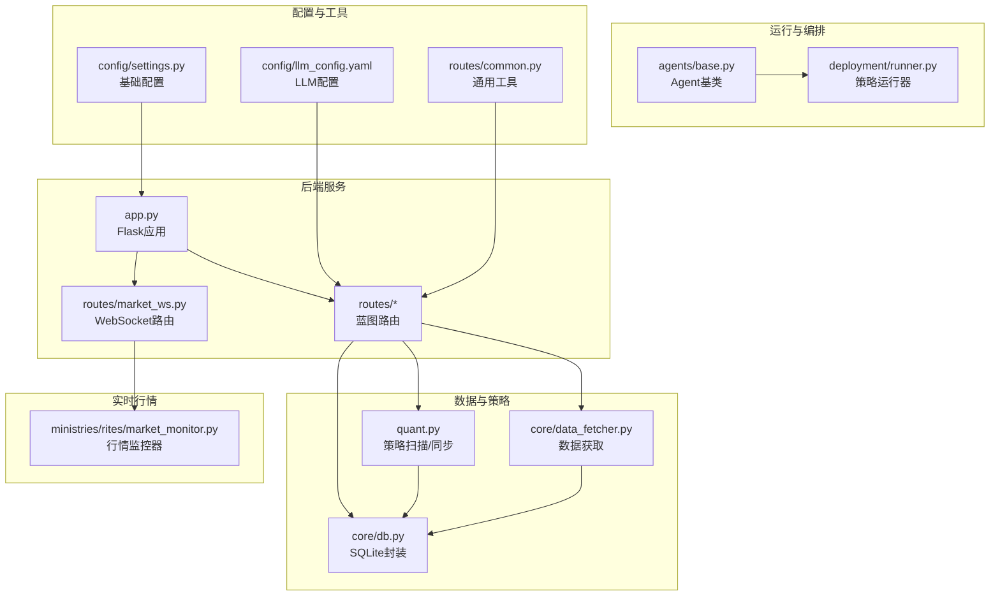
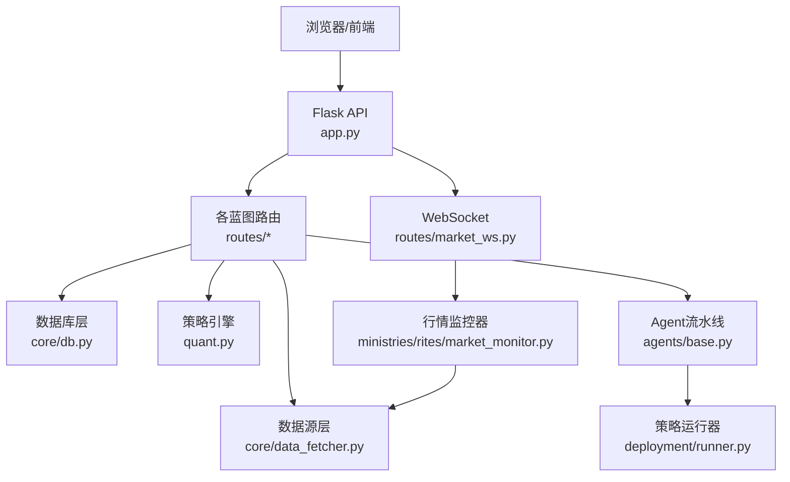
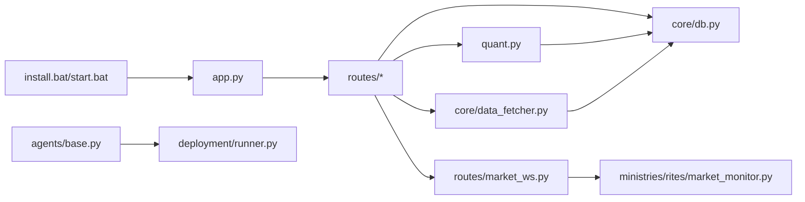

# 常见问题

<cite>
**本文引用的文件**
- [README.md](file://README.md)
- [requirements.txt](file://requirements.txt)
- [install.bat](file://install.bat)
- [start.bat](file://start.bat)
- [start-bg.bat](file://start-bg.bat)
- [app.py](file://app.py)
- [quant.py](file://quant.py)
- [config/settings.py](file://config/settings.py)
- [config/llm_config.yaml](file://config/llm_config.yaml)
- [core/db.py](file://core/db.py)
- [core/data_fetcher.py](file://core/data_fetcher.py)
- [routes/market_ws.py](file://routes/market_ws.py)
- [ministries/rites/market_monitor.py](file://ministries/rites/market_monitor.py)
- [agents/base.py](file://agents/base.py)
- [deployment/runner.py](file://deployment/runner.py)
- [routes/common.py](file://routes/common.py)
- [routes/audit.py](file://routes/audit.py)
- [core/audit.py](file://core/audit.py)
</cite>

## 目录
1. [简介](#简介)
2. [项目结构](#项目结构)
3. [核心组件](#核心组件)
4. [架构总览](#架构总览)
5. [详细组件分析](#详细组件分析)
6. [依赖关系分析](#依赖关系分析)
7. [性能考量](#性能考量)
8. [故障排查指南](#故障排查指南)
9. [结论](#结论)
10. [附录](#附录)

## 简介
本指南面向AIQuant系统使用者与运维人员，聚焦安装、配置、API调用、Agent执行、数据库、策略执行、WebSocket连接等常见问题，提供可操作的诊断步骤与解决方案，并给出典型错误信息示例与定位要点。

## 项目结构
AIQuant采用“后端API + 蓝图路由 + 模块化子系统”的组织方式，核心入口为Flask应用，通过蓝图聚合各功能域路由；数据层以SQLite为主，策略与扫描逻辑集中在量化脚本中；实时行情通过WebSocket推送；Agent流水线与运行器负责异步任务编排与执行。

**图表来源**
- [app.py:1-164](file://app.py#L1-L164)
- [routes/market_ws.py:1-142](file://routes/market_ws.py#L1-L142)
- [core/db.py:1-1213](file://core/db.py#L1-L1213)
- [core/data_fetcher.py:1-578](file://core/data_fetcher.py#L1-L578)
- [quant.py:1-631](file://quant.py#L1-L631)
- [ministries/rites/market_monitor.py:1-244](file://ministries/rites/market_monitor.py#L1-L244)
- [agents/base.py:1-120](file://agents/base.py#L1-L120)
- [deployment/runner.py:1-182](file://deployment/runner.py#L1-L182)
- [config/settings.py:1-25](file://config/settings.py#L1-L25)
- [config/llm_config.yaml:1-23](file://config/llm_config.yaml#L1-L23)
- [routes/common.py:1-32](file://routes/common.py#L1-L32)

**章节来源**
- [README.md:1-3](file://README.md#L1-L3)
- [app.py:1-164](file://app.py#L1-L164)

## 核心组件
- 后端API与路由：集中于app.py，注册多个蓝图，提供健康检查、仪表板、WebSocket等能力。
- 数据与策略：quant.py负责策略扫描、评分、回填与定时任务；core/db.py提供SQLite封装与表结构；core/data_fetcher.py封装baostock/akshare数据源。
- 实时行情：routes/market_ws.py提供/ws/market，ministries/rites/market_monitor.py维护订阅与推送。
- Agent与运行器：agents/base.py定义Agent基类与上下文；deployment/runner.py提供策略运行器的状态机与日志。
- 配置：config/settings.py提供数据库、API、定时任务等基础配置；config/llm_config.yaml提供LLM相关参数。
- 通用工具：routes/common.py提供安全数值转换与DataFrame转JSON工具。

**章节来源**
- [app.py:1-164](file://app.py#L1-L164)
- [quant.py:1-631](file://quant.py#L1-L631)
- [core/db.py:1-1213](file://core/db.py#L1-L1213)
- [core/data_fetcher.py:1-578](file://core/data_fetcher.py#L1-L578)
- [routes/market_ws.py:1-142](file://routes/market_ws.py#L1-L142)
- [ministries/rites/market_monitor.py:1-244](file://ministries/rites/market_monitor.py#L1-L244)
- [agents/base.py:1-120](file://agents/base.py#L1-L120)
- [deployment/runner.py:1-182](file://deployment/runner.py#L1-L182)
- [config/settings.py:1-25](file://config/settings.py#L1-L25)
- [config/llm_config.yaml:1-23](file://config/llm_config.yaml#L1-L23)
- [routes/common.py:1-32](file://routes/common.py#L1-L32)

## 架构总览
系统采用“单机服务 + 本地数据库 + WebSocket推送”的轻量架构。后端通过蓝图扩展功能域，数据层以SQLite持久化，策略扫描与同步在后台线程/定时任务中执行，实时行情通过WebSocket推送至订阅客户端。

**图表来源**
- [app.py:1-164](file://app.py#L1-L164)
- [routes/market_ws.py:1-142](file://routes/market_ws.py#L1-L142)
- [ministries/rites/market_monitor.py:1-244](file://ministries/rites/market_monitor.py#L1-L244)
- [core/db.py:1-1213](file://core/db.py#L1-L1213)
- [core/data_fetcher.py:1-578](file://core/data_fetcher.py#L1-L578)
- [quant.py:1-631](file://quant.py#L1-L631)
- [agents/base.py:1-120](file://agents/base.py#L1-L120)
- [deployment/runner.py:1-182](file://deployment/runner.py#L1-L182)

## 详细组件分析

### 安装与依赖问题
- Python版本要求：安装脚本会检测Python是否存在，建议使用Python 3.11+。
- 依赖安装：requirements.txt声明了核心依赖；install.bat会升级pip并安装依赖；start.bat会在缺失Flask等依赖时自动安装。
- 常见问题与解决
  - 依赖安装失败：确认pip可用且网络可达；必要时手动执行requirements.txt中的安装命令。
  - 端口占用：start.bat会检测并尝试终止占用5000端口的进程；如失败请以管理员权限处理。
  - 后台启动：start-bg.bat静默启动后端并在前台打开仪表板。

**章节来源**
- [requirements.txt:1-9](file://requirements.txt#L1-L9)
- [install.bat:1-32](file://install.bat#L1-L32)
- [start.bat:1-91](file://start.bat#L1-L91)
- [start-bg.bat:1-36](file://start-bg.bat#L1-L36)

### 配置文件错误
- 路径配置：数据库路径由config/settings.py拼接，确保工作目录正确。
- 参数格式：config/llm_config.yaml支持环境变量覆盖，注意键名与类型（如timeout为数值）。
- 权限问题：确保运行账户对工作目录有读写权限，以便创建数据库与缓存文件。

**章节来源**
- [config/settings.py:1-25](file://config/settings.py#L1-L25)
- [config/llm_config.yaml:1-23](file://config/llm_config.yaml#L1-L23)

### API调用失败
- 健康检查：访问/api/health确认服务可用。
- 全局错误处理：404/500错误会被统一捕获并返回JSON。
- 常见错误
  - 404：路径不存在或蓝图未注册。
  - 500：服务器内部异常，查看后端日志定位具体路由与处理逻辑。
- 建议排查
  - 检查路由注册顺序与蓝图导入。
  - 关注app.py中的全局错误处理器输出。

**章节来源**
- [app.py:124-145](file://app.py#L124-L145)

### Agent执行异常
- Agent基类提供统一的执行包装，自动记录异常堆栈与耗时。
- 常见原因
  - 上下文数据缺失：AgentContext中共享数据未按约定设置。
  - 子类未实现抽象方法：导致调用时报错。
  - 并发/锁竞争：多Agent并发时注意共享状态保护。
- 建议排查
  - 查看AgentResult中的error字段与堆栈。
  - 检查AgentContext的get/set与results收集。

**章节来源**
- [agents/base.py:1-120](file://agents/base.py#L1-L120)

### 数据库连接问题
- 连接超时：SQLite连接默认超时30秒，可通过调整系统IO或减少并发写入缓解。
- 权限拒绝：确保数据库文件与所在目录具备读写权限。
- 表结构不匹配：init_db会自动迁移新增列与索引，若自定义修改需谨慎。
- 建议排查
  - 检查DB_PATH与工作目录一致性。
  - 关注迁移过程中的异常日志。

**章节来源**
- [core/db.py:26-40](file://core/db.py#L26-L40)
- [core/db.py:57-467](file://core/db.py#L57-L467)

### 策略执行失败
- 参数错误：策略阈值、仓位、止盈止损等参数需与回测验证一致。
- 数据缺失：若行情数据不足或为空，策略分析会返回None或跳过。
- 计算异常：量化指标计算依赖连续数据，缺失或异常会导致NaN/Inf，需在路由层进行安全转换。
- 建议排查
  - 检查quant.py中的输入校验与异常捕获。
  - 使用routes/common.py的安全转换工具处理NaN/Inf。

**章节来源**
- [quant.py:70-143](file://quant.py#L70-L143)
- [quant.py:177-283](file://quant.py#L177-L283)
- [routes/common.py:9-32](file://routes/common.py#L9-L32)

### WebSocket连接问题
- 连接中断：检查routes/market_ws.py中的接收与异常处理，以及ministries/rites/market_monitor.py的推送循环。
- 消息丢失：确认订阅列表与推送锁保护，避免并发写入导致丢包。
- 心跳检测：客户端应发送ping消息，服务端返回pong。
- 建议排查
  - 查看服务端打印的异常日志。
  - 确认订阅码格式与大小写。

**章节来源**
- [routes/market_ws.py:67-142](file://routes/market_ws.py#L67-L142)
- [ministries/rites/market_monitor.py:108-211](file://ministries/rites/market_monitor.py#L108-L211)

## 依赖关系分析
- 安装与启动：install.bat与start.bat分别负责依赖安装与服务启动，确保Python版本与端口可用。
- API与路由：app.py集中注册蓝图，routes/*提供具体接口；WebSocket路由通过sock集成。
- 数据与策略：quant.py依赖core/db.py与core/data_fetcher.py；策略扫描与同步在独立线程中运行。
- 实时行情：routes/market_ws.py依赖ministries/rites/market_monitor.py；后者通过数据源管理器获取行情并推送。
- 运行与编排：agents/base.py与deployment/runner.py共同支撑Agent流水线与策略运行器。

**图表来源**
- [install.bat:1-32](file://install.bat#L1-L32)
- [start.bat:1-91](file://start.bat#L1-L91)
- [app.py:1-164](file://app.py#L1-L164)
- [routes/market_ws.py:1-142](file://routes/market_ws.py#L1-L142)
- [ministries/rites/market_monitor.py:1-244](file://ministries/rites/market_monitor.py#L1-L244)
- [core/db.py:1-1213](file://core/db.py#L1-L1213)
- [core/data_fetcher.py:1-578](file://core/data_fetcher.py#L1-L578)
- [quant.py:1-631](file://quant.py#L1-L631)
- [agents/base.py:1-120](file://agents/base.py#L1-L120)
- [deployment/runner.py:1-182](file://deployment/runner.py#L1-L182)

**章节来源**
- [install.bat:1-32](file://install.bat#L1-L32)
- [start.bat:1-91](file://start.bat#L1-L91)
- [app.py:1-164](file://app.py#L1-L164)
- [routes/market_ws.py:1-142](file://routes/market_ws.py#L1-L142)
- [ministries/rites/market_monitor.py:1-244](file://ministries/rites/market_monitor.py#L1-L244)
- [core/db.py:1-1213](file://core/db.py#L1-L1213)
- [core/data_fetcher.py:1-578](file://core/data_fetcher.py#L1-L578)
- [quant.py:1-631](file://quant.py#L1-L631)
- [agents/base.py:1-120](file://agents/base.py#L1-L120)
- [deployment/runner.py:1-182](file://deployment/runner.py#L1-L182)

## 性能考量
- 数据库并发：SQLite WAL模式与PRAGMA设置有助于提升并发写入性能，但仍建议避免高并发写入。
- 策略扫描：批量处理与分批回填可降低内存峰值与IO压力。
- WebSocket推送：按批次推送与锁保护可减少阻塞与丢包。
- 数据缓存：data_cache目录用于缓存历史数据，减少重复拉取。

[本节为通用指导，无需列出章节来源]

## 故障排查指南

### 安装与启动
- 症状：启动脚本报错提示Python未找到或依赖安装失败
  - 排查要点：确认Python 3.11+已安装并加入PATH；网络可访问pip源；必要时手动执行requirements.txt安装命令。
  - 解决方案：使用install.bat升级pip并安装依赖；或在start.bat中手动执行pip安装命令。
- 症状：端口5000被占用
  - 排查要点：start.bat会尝试终止占用进程；如失败请以管理员权限处理。
  - 解决方案：手动结束占用进程或更换端口。

**章节来源**
- [install.bat:13-32](file://install.bat#L13-L32)
- [start.bat:42-58](file://start.bat#L42-L58)

### 配置文件
- 症状：数据库路径不正确导致无法创建或读取数据库
  - 排查要点：核对config/settings.py中的DB_PATH拼接逻辑与工作目录。
  - 解决方案：确保工作目录正确，或显式设置DB_PATH。
- 症状：LLM配置无效或API调用失败
  - 排查要点：检查config/llm_config.yaml键名与类型；确认环境变量覆盖生效。
  - 解决方案：使用环境变量覆盖敏感参数，避免硬编码泄露。

**章节来源**
- [config/settings.py:6-8](file://config/settings.py#L6-L8)
- [config/llm_config.yaml:1-23](file://config/llm_config.yaml#L1-L23)

### API调用
- 症状：访问/api/health返回404或500
  - 排查要点：确认蓝图已注册；检查全局错误处理器输出。
  - 解决方案：重新启动服务；检查路由注册顺序与蓝图导入。

**章节来源**
- [app.py:124-145](file://app.py#L124-L145)

### Agent执行
- 症状：Agent执行报错或结果为空
  - 排查要点：查看AgentResult.error字段与堆栈；确认AgentContext共享数据已正确设置。
  - 解决方案：完善子类_execute实现；在并发场景下加强锁保护。

**章节来源**
- [agents/base.py:93-120](file://agents/base.py#L93-L120)

### 数据库
- 症状：连接超时或权限不足
  - 排查要点：检查DB_PATH与权限；关注init_db迁移过程。
  - 解决方案：调整系统IO或减少并发；赋予目录读写权限。

**章节来源**
- [core/db.py:26-40](file://core/db.py#L26-L40)
- [core/db.py:57-467](file://core/db.py#L57-L467)

### 策略执行
- 症状：策略扫描无结果或异常
  - 排查要点：检查行情数据是否充足；使用routes/common.py进行安全转换。
  - 解决方案：补齐历史数据；在量化计算中处理NaN/Inf。

**章节来源**
- [quant.py:70-143](file://quant.py#L70-L143)
- [quant.py:177-283](file://quant.py#L177-L283)
- [routes/common.py:9-32](file://routes/common.py#L9-L32)

### WebSocket
- 症状：连接中断、消息丢失、心跳失败
  - 排查要点：检查routes/market_ws.py与ministries/rites/market_monitor.py的日志；确认订阅码格式。
  - 解决方案：修复推送循环异常；加强锁保护；客户端定期发送ping。

**章节来源**
- [routes/market_ws.py:67-142](file://routes/market_ws.py#L67-L142)
- [ministries/rites/market_monitor.py:108-211](file://ministries/rites/market_monitor.py#L108-L211)

## 结论
本指南围绕AIQuant系统的关键环节提供了系统化的故障排查流程与解决方案。建议在日常运维中结合日志与状态接口进行快速定位，并遵循最小变更原则逐步验证修复效果。

[本节为总结性内容，无需列出章节来源]

## 附录

### 常见错误信息示例
- 安装阶段
  - “Python not found. Please install Python 3.11+”
  - “Failed to install dependencies.”
- 启动阶段
  - “Found old service on port 5000. Stopping...”
  - “Service already running.”
- API阶段
  - “404: /api/nonexistent not found”
  - “500: Internal Server Error”
- 数据库阶段
  - “OperationalError: no such table”（表结构不匹配）
  - “database is locked”（并发写入）
- WebSocket阶段
  - “推送异常: ...”
  - “获取 {code} 失败: ...”

**章节来源**
- [install.bat:14-18](file://install.bat#L14-L18)
- [install.bat:31-36](file://install.bat#L31-L36)
- [start.bat:44-54](file://start.bat#L44-L54)
- [start.bat:19-24](file://start.bat#L19-L24)
- [app.py:137-144](file://app.py#L137-L144)
- [core/db.py:47-50](file://core/db.py#L47-L50)
- [ministries/rites/market_monitor.py:129-131](file://ministries/rites/market_monitor.py#L129-L131)