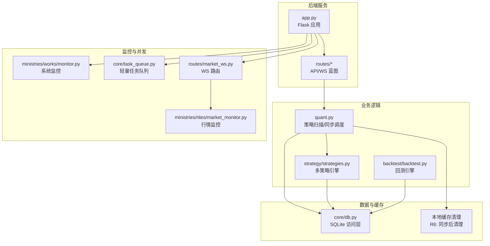
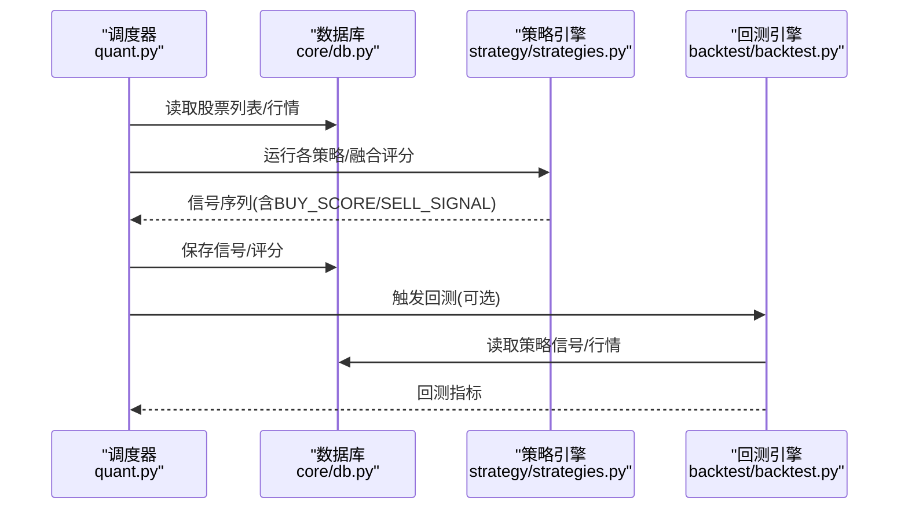
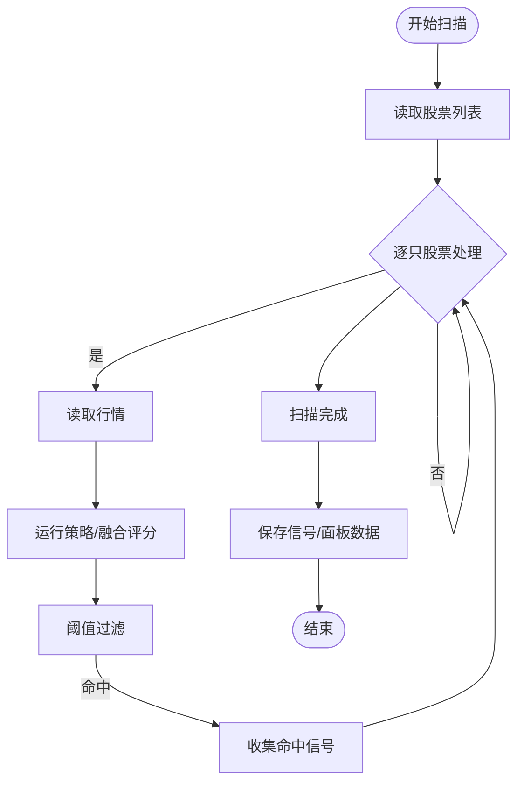
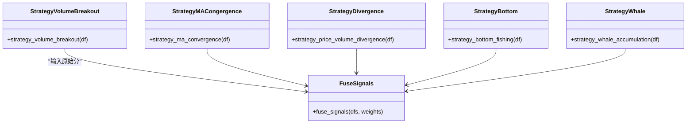
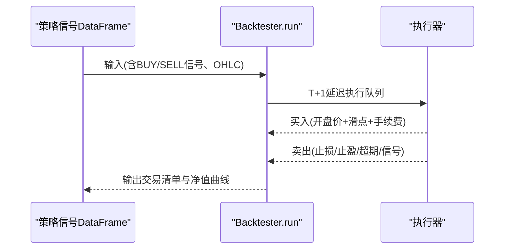
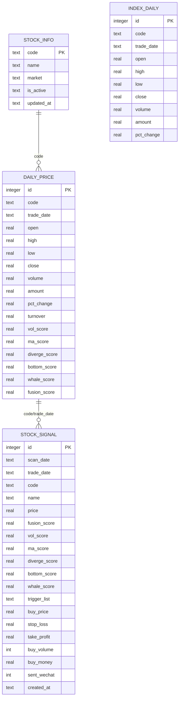
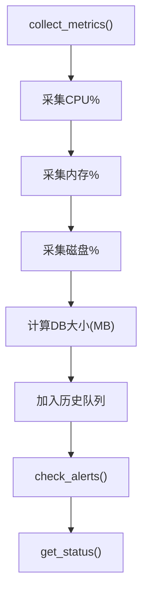
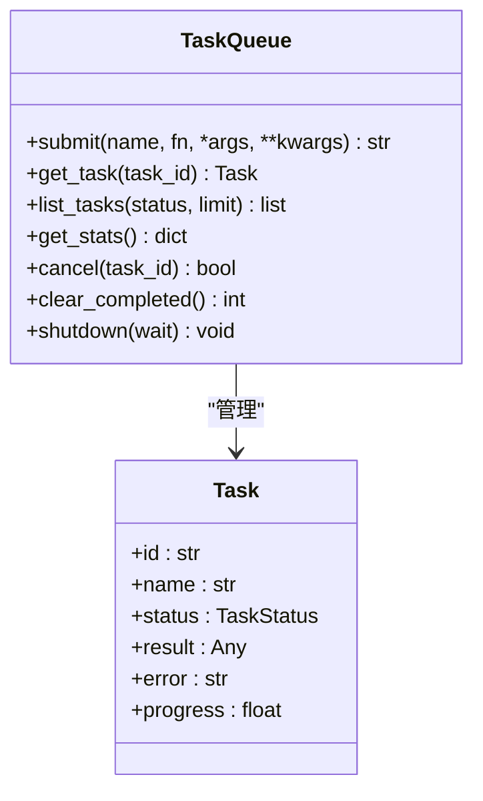
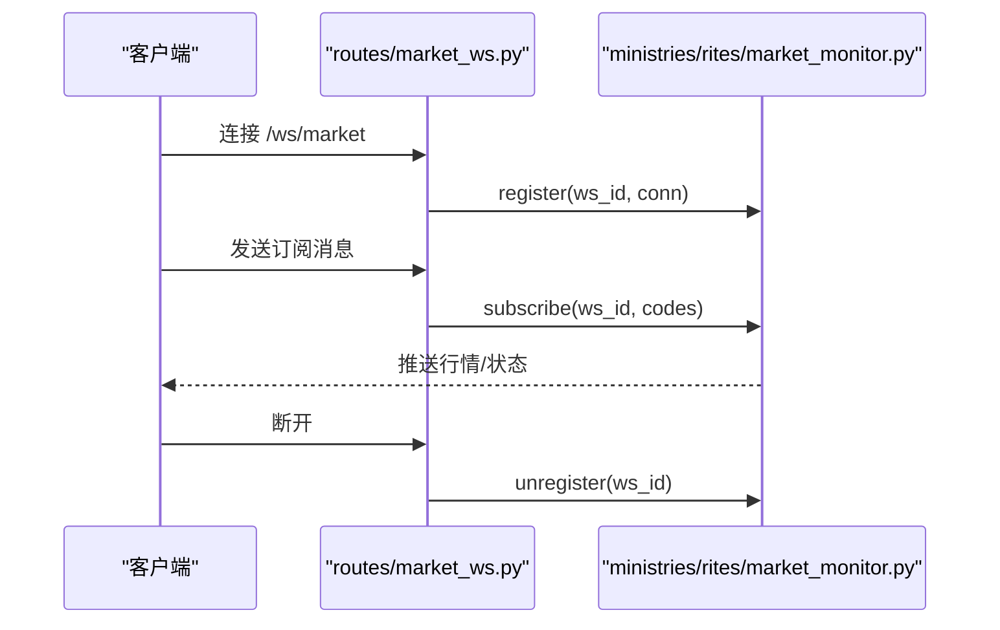
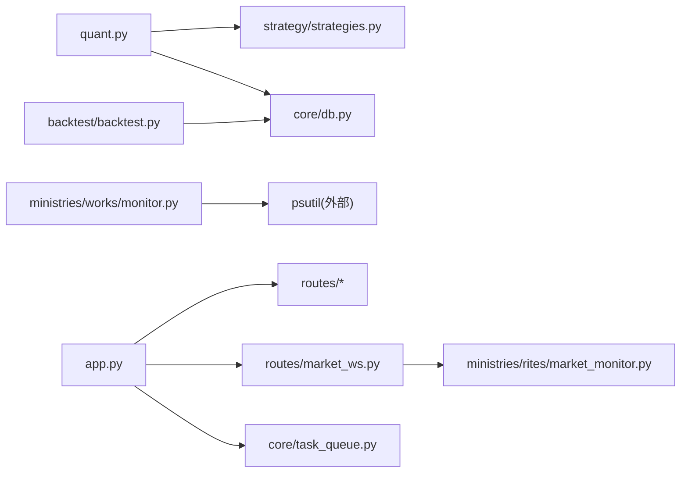

# 性能诊断

<cite>
**本文引用的文件**
- [README.md](file://README.md)
- [quant.py](file://quant.py)
- [app.py](file://app.py)
- [requirements.txt](file://requirements.txt)
- [core/db.py](file://core/db.py)
- [ministries/works/monitor.py](file://ministries/works/monitor.py)
- [core/task_queue.py](file://core/task_queue.py)
- [backtest/backtest.py](file://backtest/backtest.py)
- [strategy/strategies.py](file://strategy/strategies.py)
- [routes/market_ws.py](file://routes/market_ws.py)
- [ministries/rites/market_monitor.py](file://ministries/rites/market_monitor.py)
</cite>

## 目录
1. [简介](#简介)
2. [项目结构](#项目结构)
3. [核心组件](#核心组件)
4. [架构总览](#架构总览)
5. [详细组件分析](#详细组件分析)
6. [依赖关系分析](#依赖关系分析)
7. [性能考量](#性能考量)
8. [故障排查指南](#故障排查指南)
9. [结论](#结论)
10. [附录](#附录)

## 简介
本指南面向AIQuant量化系统，聚焦性能诊断与优化。内容覆盖：
- 关键性能指标定义与测量方法（CPU、内存、磁盘、数据库、网络）
- 系统瓶颈识别（热点函数、内存泄漏、并发冲突）
- 性能测试工具使用（cProfile、memory_profiler、line_profiler）
- 数据库性能优化（查询、索引、事务）
- 缓存与并发策略（数据缓存、计算缓存、线程池、锁竞争）
- 回测性能优化（数据预处理、算法优化、批量处理）
- 典型问题的诊断步骤、工具示例与优化方案

## 项目结构
AIQuant采用模块化分层设计：后端API（Flask）、策略与回测引擎、数据访问层（SQLite）、监控与WebSocket行情推送、任务队列等。整体以“策略扫描 + 数据同步”为核心调度流程。

图表来源
- [app.py:1-164](file://app.py#L1-L164)
- [quant.py:1-631](file://quant.py#L1-L631)
- [strategy/strategies.py:1-431](file://strategy/strategies.py#L1-L431)
- [backtest/backtest.py:1-517](file://backtest/backtest.py#L1-L517)
- [core/db.py:1-1213](file://core/db.py#L1-L1213)
- [ministries/works/monitor.py:1-114](file://ministries/works/monitor.py#L1-L114)
- [core/task_queue.py:1-222](file://core/task_queue.py#L1-L222)
- [routes/market_ws.py:1-141](file://routes/market_ws.py#L1-L141)
- [ministries/rites/market_monitor.py:1-106](file://ministries/rites/market_monitor.py#L1-L106)

章节来源
- [README.md:1-3](file://README.md#L1-L3)
- [app.py:1-164](file://app.py#L1-L164)

## 核心组件
- 策略扫描与调度：定时任务驱动策略扫描与数据同步，涉及全市场遍历、策略评分、信号入库等。
- 策略引擎：多策略独立实现，支持融合评分，返回信号序列供回测使用。
- 回测引擎：支持T+1执行、止损止盈、滑点、手续费、动态仓位等，输出绩效指标。
- 数据访问层：SQLite封装、索引与事务配置、批量写入、统计查询。
- 监控与告警：系统指标采集（CPU/内存/磁盘/DB大小）、告警阈值、状态摘要。
- 任务队列：轻量线程池任务队列，支持任务提交、状态跟踪、回调通知。
- WebSocket行情：行情订阅/退订、客户端生命周期管理、广播消息。

章节来源
- [quant.py:285-546](file://quant.py#L285-L546)
- [strategy/strategies.py:1-431](file://strategy/strategies.py#L1-L431)
- [backtest/backtest.py:1-517](file://backtest/backtest.py#L1-L517)
- [core/db.py:26-467](file://core/db.py#L26-L467)
- [ministries/works/monitor.py:16-114](file://ministries/works/monitor.py#L16-L114)
- [core/task_queue.py:51-222](file://core/task_queue.py#L51-L222)
- [routes/market_ws.py:1-141](file://routes/market_ws.py#L1-L141)
- [ministries/rites/market_monitor.py:1-106](file://ministries/rites/market_monitor.py#L1-L106)

## 架构总览
系统以“策略扫描 + 数据同步”为主线，配合回测与风控模块，形成闭环。数据层采用SQLite，具备WAL模式与索引优化；监控模块提供系统健康度与告警；WebSocket负责行情推送；任务队列支撑异步任务。

图表来源
- [quant.py:289-337](file://quant.py#L289-L337)
- [strategy/strategies.py:36-255](file://strategy/strategies.py#L36-L255)
- [backtest/backtest.py:121-409](file://backtest/backtest.py#L121-L409)
- [core/db.py:519-665](file://core/db.py#L519-L665)

## 详细组件分析

### 策略扫描与调度（quant.py）
- 全市场扫描：遍历股票列表，按策略计算评分，筛选Top N，保存至信号表。
- v4超跌反弹与5策略融合：两种评分路径，分别返回不同字段与阈值。
- 数据同步：每日收盘后同步行情，同步完成后清理缓存（R6）。
- 性能关注点：全量遍历、策略计算、数据库写入、信号入库。

图表来源
- [quant.py:289-337](file://quant.py#L289-L337)
- [quant.py:433-546](file://quant.py#L433-L546)

章节来源
- [quant.py:289-337](file://quant.py#L289-L337)
- [quant.py:433-546](file://quant.py#L433-L546)

### 策略引擎（strategy/strategies.py）
- 五类策略：放量突破、均线粘合、量价背离、抄底、主力建仓，均输出BUY_SCORE与信号列。
- 融合策略：将各策略原始分映射到0-10，按权重加权融合，得到0-50融合分。
- 性能关注点：滚动窗口计算（MA/RSI/ATR等）的复杂度与内存占用。

图表来源
- [strategy/strategies.py:36-255](file://strategy/strategies.py#L36-L255)
- [strategy/strategies.py:368-431](file://strategy/strategies.py#L368-L431)

章节来源
- [strategy/strategies.py:1-431](file://strategy/strategies.py#L1-L431)

### 回测引擎（backtest/backtest.py）
- 执行规则：T+1（信号日判断，次日开盘执行），支持止损止盈、滑点、手续费、动态仓位。
- 指标计算：总收益、年化收益、最大回撤、夏普比率、胜率、盈亏比、Alpha等。
- 性能关注点：时间序列迭代、延迟执行队列、动态仓位计算、滑点与手续费成本。

图表来源
- [backtest/backtest.py:121-409](file://backtest/backtest.py#L121-L409)

章节来源
- [backtest/backtest.py:1-517](file://backtest/backtest.py#L1-L517)

### 数据访问层（core/db.py）
- 连接管理：WAL模式、NORMAL同步、上下文管理、超时设置。
- 表与索引：日线行情、指数行情、信号、持仓、交易、风控事件等，配套索引。
- 批量写入：upsert_daily_price、upsert_index_daily、update_strategy_scores_batch。
- 统计查询：db_stats、get_stock_count_in_db、get_latest_date等。

图表来源
- [core/db.py:57-467](file://core/db.py#L57-L467)

章节来源
- [core/db.py:26-467](file://core/db.py#L26-L467)
- [core/db.py:921-940](file://core/db.py#L921-L940)

### 系统监控（ministries/works/monitor.py）
- 指标采集：CPU、内存、磁盘、DB大小。
- 告警阈值：CPU>80%、内存>85%、磁盘>90%。
- 状态摘要：健康/警告状态、最近指标、告警计数。

图表来源
- [ministries/works/monitor.py:36-101](file://ministries/works/monitor.py#L36-L101)

章节来源
- [ministries/works/monitor.py:16-114](file://ministries/works/monitor.py#L16-L114)

### 任务队列（core/task_queue.py）
- 线程池执行器，支持任务提交、状态跟踪、回调通知、统计查询。
- 适用于回测、批量评分、数据同步等异步任务。

图表来源
- [core/task_queue.py:51-222](file://core/task_queue.py#L51-L222)

章节来源
- [core/task_queue.py:1-222](file://core/task_queue.py#L1-L222)

### WebSocket行情（routes/market_ws.py + ministries/rites/market_monitor.py）
- 蓝图路由：/api/market/status、/api/market/clients、/ws/market。
- 行情监控：客户端注册/退订、订阅管理、广播消息、系统状态。

图表来源
- [routes/market_ws.py:72-123](file://routes/market_ws.py#L72-L123)
- [ministries/rites/market_monitor.py:39-105](file://ministries/rites/market_monitor.py#L39-L105)

章节来源
- [routes/market_ws.py:1-141](file://routes/market_ws.py#L1-L141)
- [ministries/rites/market_monitor.py:1-106](file://ministries/rites/market_monitor.py#L1-L106)

## 依赖关系分析
- 外部依赖：Flask、Flask-Sock、pandas、numpy、plotly、scikit-learn、joblib、psutil（监控）。
- 内部耦合：quant.py依赖策略与数据库；策略依赖pandas/numpy；回测依赖策略输出；监控依赖psutil；WS依赖数据源管理器。

图表来源
- [quant.py:23-35](file://quant.py#L23-L35)
- [strategy/strategies.py:28-30](file://strategy/strategies.py#L28-L30)
- [backtest/backtest.py:9-13](file://backtest/backtest.py#L9-L13)
- [ministries/works/monitor.py:38-46](file://ministries/works/monitor.py#L38-L46)
- [app.py:5-37](file://app.py#L5-L37)
- [routes/market_ws.py:15-23](file://routes/market_ws.py#L15-L23)
- [ministries/rites/market_monitor.py:18](file://ministries/rites/market_monitor.py#L18)

章节来源
- [requirements.txt:1-9](file://requirements.txt#L1-L9)

## 性能考量
- CPU使用率
  - 指标含义：单位时间内CPU忙闲比例，过高可能由密集计算或锁竞争导致。
  - 测量方法：监控模块采集、系统自带工具（Windows资源监视器）。
  - 优化建议：减少滚动窗口重复计算、合并DataFrame操作、使用向量化、限制并发。
- 内存占用
  - 指标含义：进程常驻集大小，异常增长可能指示泄漏或大对象未释放。
  - 测量方法：监控模块内存百分比、进程内存快照。
  - 优化建议：及时释放中间DataFrame、避免闭包持有大对象、使用chunk处理大数据。
- 磁盘I/O
  - 指标含义：读写吞吐与队列长度，高延迟可能来自随机写或索引碎片。
  - 测量方法：系统性能计数器、监控模块磁盘百分比。
  - 优化建议：批量写入、启用WAL、合理索引、定期维护。
- 数据库性能
  - 查询优化：使用索引覆盖、避免SELECT *、限制返回列、分页或分批处理。
  - 索引使用：按查询模式建立复合索引，如(daily_price.code, trade_date)。
  - 连接池配置：SQLite默认连接，注意事务粒度与超时；批量写入时减少提交次数。
- 缓存策略
  - 数据缓存：本地CSV缓存（R6同步后清理），避免重复下载。
  - 计算缓存：策略评分可按日期写入数据库，避免重复计算。
  - 失效策略：基于日期/版本号，增量更新。
- 并发处理
  - 线程池：TaskQueue默认4线程，可根据CPU核数调整；避免长时间阻塞任务。
  - 异步任务：回测、评分、同步等可异步化，提高吞吐。
  - 锁竞争：减少全局锁范围，使用细粒度锁或无锁结构。
- 回测性能
  - 数据预处理：提前计算指标（MA/RSI/ATR），减少回测时重复计算。
  - 算法优化：向量化替代循环、使用numba（如适用）、减少DataFrame拷贝。
  - 批量处理：批量评分与批量写入，降低I/O放大。

[本节为通用指导，不直接分析具体文件]

## 故障排查指南
- 系统指标异常
  - 现象：CPU/内存/磁盘持续偏高。
  - 排查：查看监控历史与告警，定位峰值时段；结合策略扫描与回测任务时间窗。
  - 优化：拆分任务、限流、增加线程池容量或节点。
- 扫描/评分卡顿
  - 现象：全市场扫描耗时长。
  - 排查：量化扫描函数逐股票执行，检查数据库读写与策略计算耗时。
  - 优化：批量评分、缓存中间结果、减少无效计算。
- 回测慢
  - 现象：回测时间长。
  - 排查：检查信号列与OHLC列完整性、是否存在大量T+1延迟执行。
  - 优化：预计算指标、向量化、减少滑点与手续费模拟开销。
- 数据库写入慢
  - 现象：批量写入耗时。
  - 排查：检查事务提交频率、索引数量、写入模式。
  - 优化：批量插入、关闭外键检查、WAL模式、减少索引重建。
- WebSocket连接异常
  - 现象：客户端断连、订阅无效。
  - 排查：检查路由注册、客户端消息解析、订阅管理。
  - 优化：完善错误处理与心跳、限制订阅数量、清理僵尸连接。

章节来源
- [ministries/works/monitor.py:62-101](file://ministries/works/monitor.py#L62-L101)
- [quant.py:433-546](file://quant.py#L433-L546)
- [backtest/backtest.py:121-409](file://backtest/backtest.py#L121-L409)
- [core/db.py:543-629](file://core/db.py#L543-L629)
- [routes/market_ws.py:72-123](file://routes/market_ws.py#L72-L123)

## 结论
AIQuant的性能瓶颈主要集中在策略计算、数据库I/O与并发调度。通过指标监控、任务异步化、批量处理、索引优化与缓存策略，可显著提升系统吞吐与稳定性。建议在生产环境部署监控告警，并定期进行性能回归测试。

[本节为总结，不直接分析具体文件]

## 附录

### 性能测试工具使用（Python内置）
- cProfile（热点函数分析）
  - 使用方法：在策略扫描或回测入口包裹profile.run或使用profile.Profile，生成统计文件。
  - 关注点：策略函数调用次数、总耗时、自耗时，定位最慢函数。
- memory_profiler（内存泄漏检测）
  - 使用方法：@profile装饰器或line_profiler，逐行观测内存变化。
  - 关注点：DataFrame构造与合并、闭包捕获、全局变量。
- line_profiler（逐行性能）
  - 使用方法：kernprof -l -v 脚本.py，查看每行执行时间。
  - 关注点：滚动窗口计算、向量化替代、I/O等待。

[本节为通用指导，不直接分析具体文件]