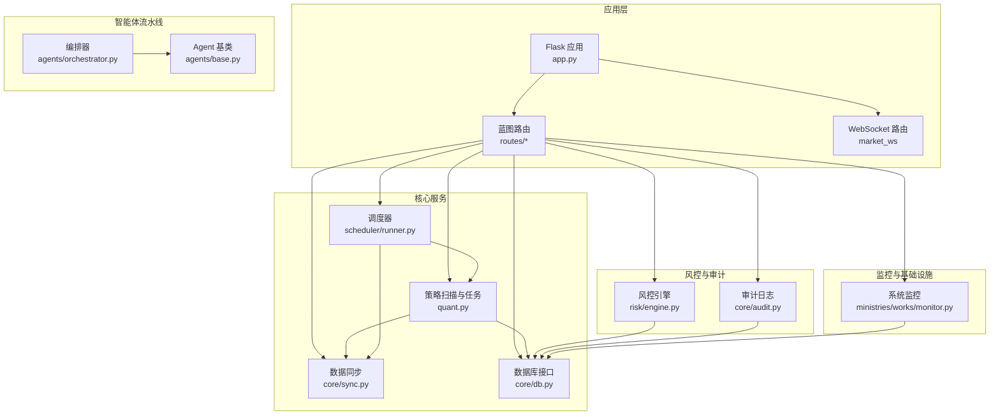
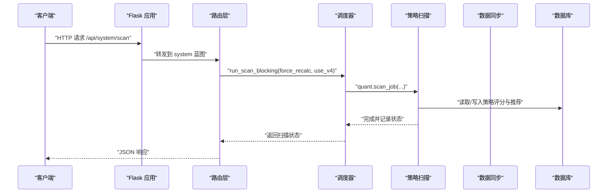
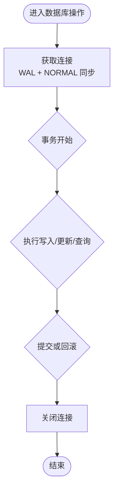
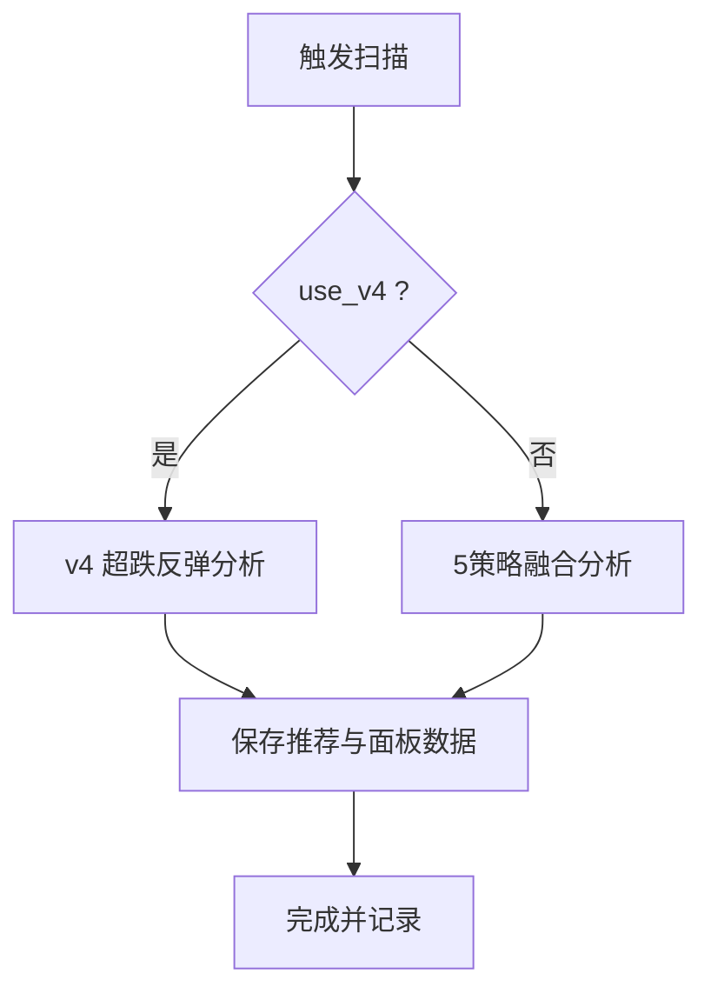
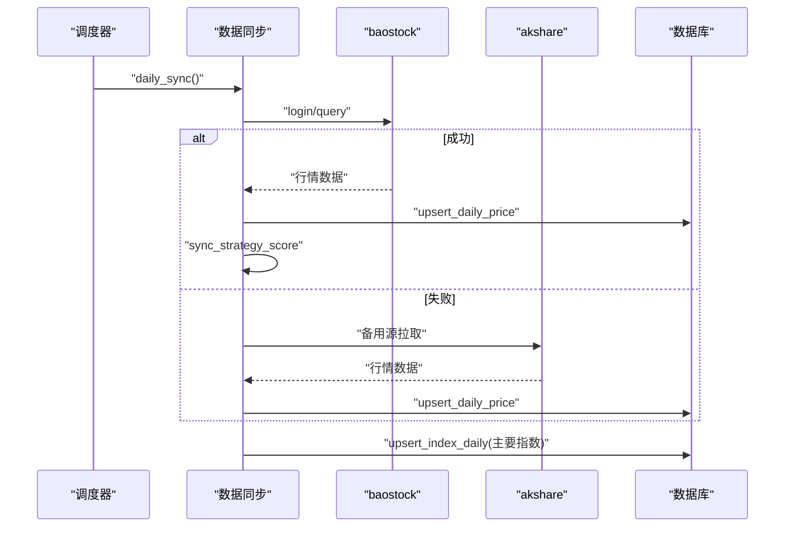
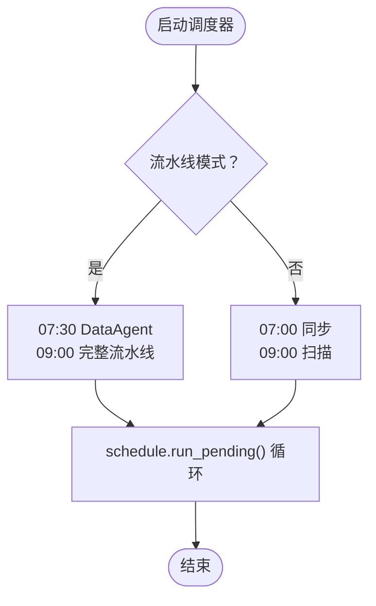
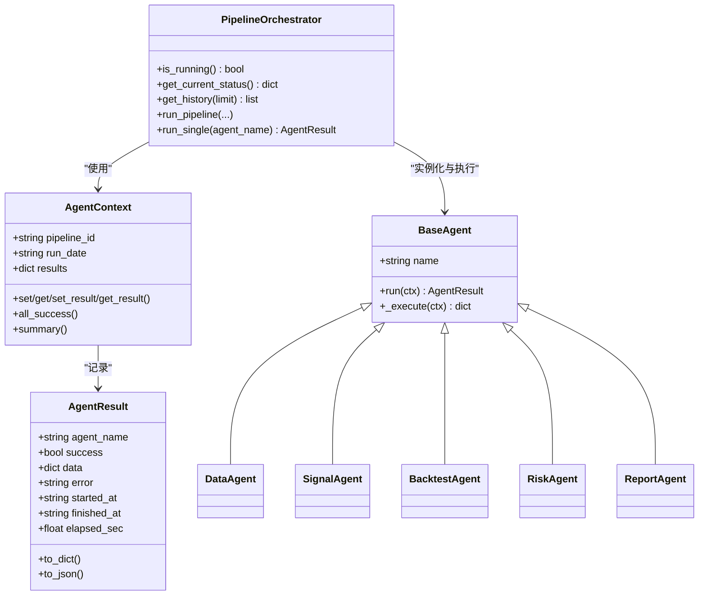
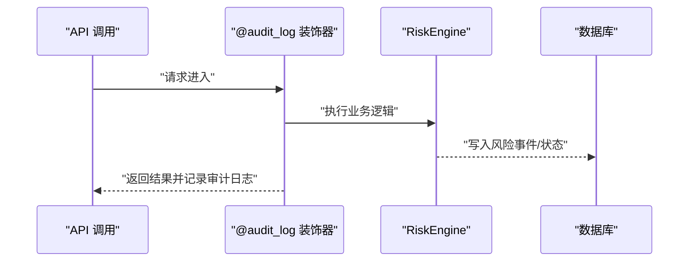
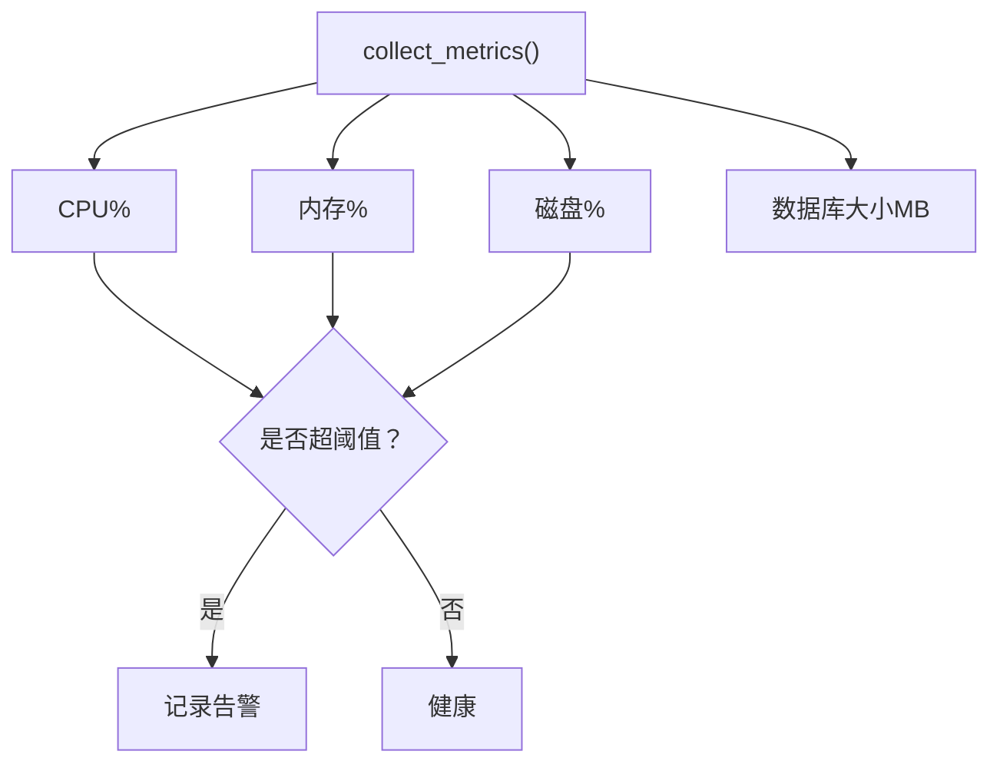
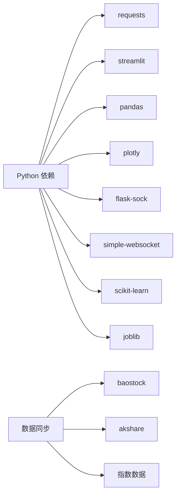

# 故障排查

<cite>
**本文引用的文件**
- [README.md](file://README.md)
- [app.py](file://app.py)
- [quant.py](file://quant.py)
- [config/settings.py](file://config/settings.py)
- [core/db.py](file://core/db.py)
- [agents/base.py](file://agents/base.py)
- [routes/system.py](file://routes/system.py)
- [scheduler/runner.py](file://scheduler/runner.py)
- [core/sync.py](file://core/sync.py)
- [routes/common.py](file://routes/common.py)
- [requirements.txt](file://requirements.txt)
- [core/audit.py](file://core/audit.py)
- [ministries/works/monitor.py](file://ministries/works/monitor.py)
- [risk/engine.py](file://risk/engine.py)
- [agents/orchestrator.py](file://agents/orchestrator.py)
</cite>

## 目录
1. [简介](#简介)
2. [项目结构](#项目结构)
3. [核心组件](#核心组件)
4. [架构总览](#架构总览)
5. [详细组件分析](#详细组件分析)
6. [依赖分析](#依赖分析)
7. [性能考虑](#性能考虑)
8. [故障排查指南](#故障排查指南)
9. [结论](#结论)
10. [附录](#附录)

## 简介
本指南面向技术支持与运维人员，围绕AIQuant系统提供系统化的故障排查方法与流程。内容覆盖安装与环境、配置错误、运行时异常、日志分析、性能诊断、健康检查、数据库与API问题、Agent执行异常、网络与权限、依赖缺失、以及预防与稳定性保障建议。文档同时给出标准化的处理流程，帮助快速定位与恢复。

## 项目结构
AIQuant采用Flask后端+多模块分工的架构：数据采集与同步、策略扫描、定时调度、Agent流水线、风控与审计、监控与告警等模块协同工作。前端通过REST API与WebSocket进行交互，系统提供健康检查与调试路由。

**图表来源**
- [app.py:1-164](file://app.py#L1-L164)
- [routes/system.py:1-152](file://routes/system.py#L1-L152)
- [scheduler/runner.py:1-212](file://scheduler/runner.py#L1-L212)
- [quant.py:1-631](file://quant.py#L1-L631)
- [core/sync.py:1-760](file://core/sync.py#L1-L760)
- [core/db.py:1-1213](file://core/db.py#L1-L1213)
- [agents/orchestrator.py:1-263](file://agents/orchestrator.py#L1-L263)
- [agents/base.py:1-120](file://agents/base.py#L1-L120)
- [risk/engine.py:1-168](file://risk/engine.py#L1-L168)
- [core/audit.py:1-110](file://core/audit.py#L1-L110)
- [ministries/works/monitor.py:1-114](file://ministries/works/monitor.py#L1-L114)

**章节来源**
- [README.md:1-3](file://README.md#L1-L3)
- [app.py:1-164](file://app.py#L1-L164)

## 核心组件
- Flask后端与路由：提供REST API与WebSocket，注册系统、数据、交易、风控、LLM等蓝图，并内置健康检查与调试路由。
- 数据同步与数据库：封装SQLite建表、连接、迁移、写入与查询，支持指数与股票行情、策略评分、同步日志等。
- 策略扫描与任务：提供v4与5策略融合扫描、每日定时任务、强制重算与回填历史推荐。
- 调度器：支持传统模式与多Agent流水线模式，定时触发同步与扫描，或触发完整流水线。
- Agent流水线：三省六部制编排，串行+并行组合，统一结果记录与异常捕获。
- 风控与审计：风控引擎执行规则并落库，审计装饰器自动记录API调用耗时与结果。
- 监控与告警：系统指标采集、健康状态与告警阈值检查。

**章节来源**
- [app.py:1-164](file://app.py#L1-L164)
- [core/db.py:1-1213](file://core/db.py#L1-L1213)
- [quant.py:1-631](file://quant.py#L1-L631)
- [scheduler/runner.py:1-212](file://scheduler/runner.py#L1-L212)
- [agents/orchestrator.py:1-263](file://agents/orchestrator.py#L1-L263)
- [agents/base.py:1-120](file://agents/base.py#L1-L120)
- [risk/engine.py:1-168](file://risk/engine.py#L1-L168)
- [core/audit.py:1-110](file://core/audit.py#L1-L110)
- [ministries/works/monitor.py:1-114](file://ministries/works/monitor.py#L1-L114)

## 架构总览
系统通过Flask对外提供HTTP与WebSocket接口，内部通过蓝图路由分发至调度器、策略扫描、数据同步、数据库、风控与审计等模块。Agent流水线在需要时由调度器或手动触发，形成完整的自动化工作流。

**图表来源**
- [routes/system.py:24-44](file://routes/system.py#L24-L44)
- [scheduler/runner.py:90-102](file://scheduler/runner.py#L90-L102)
- [quant.py:433-546](file://quant.py#L433-L546)
- [core/db.py:781-806](file://core/db.py#L781-L806)

## 详细组件分析

### 数据库与连接
- 连接管理：使用上下文管理器确保事务提交/回滚与连接关闭，设置WAL与同步模式以平衡性能与可靠性。
- 建表与迁移：自动创建多表（股票信息、日线行情、指数、信号、风控事件、审计日志等），并安全地为旧表增加列。
- 查询与写入：提供批量写入、策略评分批量更新、指数行情写入与查询、最新日期与覆盖率判断等。
- 同步日志：记录每次同步的总次数、成功/失败、耗时与备注，便于追踪与回溯。

**图表来源**
- [core/db.py:26-40](file://core/db.py#L26-L40)
- [core/db.py:57-467](file://core/db.py#L57-L467)
- [core/db.py:581-630](file://core/db.py#L581-L630)
- [core/db.py:675-702](file://core/db.py#L675-L702)

**章节来源**
- [core/db.py:1-1213](file://core/db.py#L1-L1213)

### 策略扫描与任务
- 扫描模式：支持v4超跌反弹与5策略融合，可选择强制重算全市场策略分，或仅筛选。
- 历史回填：在强制重算模式下，将历史融合分达到阈值的日期回填至推荐表，便于面板对比。
- 时间控制：每日14:15执行扫描，保存到数据库并生成消息；若无命中则记录空仓提示。
- 异常兜底：扫描过程中的异常会被捕获并记录，避免中断整个流程。

**图表来源**
- [quant.py:289-338](file://quant.py#L289-L338)
- [quant.py:433-546](file://quant.py#L433-L546)
- [quant.py:344-431](file://quant.py#L344-L431)

**章节来源**
- [quant.py:1-631](file://quant.py#L1-L631)

### 数据同步与指数
- 数据源：主数据源baostock，备用akshare；支持断点续传与缓存。
- 过滤规则：跳过ST、退市、北交所等不支持或不适用的标的。
- 增量同步：单线程查询，登录一次，逐只股票拉取并写入，完成后同步主要指数。
- 策略评分：同步完成后为每只股票计算并批量写入策略评分，覆盖历史日期。

**图表来源**
- [core/sync.py:462-669](file://core/sync.py#L462-L669)
- [core/sync.py:217-314](file://core/sync.py#L217-L314)
- [core/sync.py:675-702](file://core/sync.py#L675-L702)

**章节来源**
- [core/sync.py:1-760](file://core/sync.py#L1-L760)

### 调度器与定时任务
- 传统模式：07:00同步，09:00扫描。
- 多Agent流水线模式：07:30 DataAgent，09:00完整流水线。
- 状态管理：使用共享状态字典记录运行状态、最后结果与时间，避免并发冲突。
- 作业封装：定时任务通过线程触发后台执行，防止阻塞主线程。

**图表来源**
- [scheduler/runner.py:158-182](file://scheduler/runner.py#L158-L182)
- [scheduler/runner.py:186-212](file://scheduler/runner.py#L186-L212)

**章节来源**
- [scheduler/runner.py:1-212](file://scheduler/runner.py#L1-L212)

### Agent流水线与编排
- 编排器：负责三省六部制流水线的串行与并行执行，统一上下文、结果记录与异常处理。
- Agent基类：统一执行计时、异常捕获与结果封装，便于监控与审计。
- 门下省一票否决：若风控结果为BLOCK，拦截后续阶段，避免错误扩散。

**图表来源**
- [agents/base.py:20-120](file://agents/base.py#L20-L120)
- [agents/orchestrator.py:36-263](file://agents/orchestrator.py#L36-L263)

**章节来源**
- [agents/base.py:1-120](file://agents/base.py#L1-L120)
- [agents/orchestrator.py:1-263](file://agents/orchestrator.py#L1-L263)

### 风控与审计
- 风控引擎：遍历规则集，聚合最严格的风险等级，记录事件与状态到数据库。
- 审计日志：装饰器自动记录API耗时、结果与异常，提取资源标识，便于追踪。

**图表来源**
- [core/audit.py:41-92](file://core/audit.py#L41-L92)
- [risk/engine.py:51-72](file://risk/engine.py#L51-L72)

**章节来源**
- [core/audit.py:1-110](file://core/audit.py#L1-L110)
- [risk/engine.py:1-168](file://risk/engine.py#L1-L168)

### 监控与告警
- 指标采集：CPU、内存、磁盘、数据库大小等，历史保留最近24小时。
- 告警阈值：CPU>80%、内存>85%、磁盘>90%，超过触发告警。
- 状态摘要：根据最新指标输出健康状态与告警数量。

**图表来源**
- [ministries/works/monitor.py:36-101](file://ministries/works/monitor.py#L36-L101)

**章节来源**
- [ministries/works/monitor.py:1-114](file://ministries/works/monitor.py#L1-L114)

## 依赖分析
- Python包：requests、streamlit、pandas、plotly、flask-sock、simple-websocket、scikit-learn、joblib。
- 数据源：baostock为主，akshare为备选；指数数据来自baostock指数代码映射。
- 外部接口：交易日判断依赖第三方接口，失败时按工作日回退。

**图表来源**
- [requirements.txt:1-9](file://requirements.txt#L1-L9)
- [core/sync.py:47-53](file://core/sync.py#L47-L53)
- [core/sync.py:98-114](file://core/sync.py#L98-L114)

**章节来源**
- [requirements.txt:1-9](file://requirements.txt#L1-L9)
- [core/sync.py:1-760](file://core/sync.py#L1-L760)

## 性能考虑
- 数据库：WAL模式与NORMAL同步兼顾并发与可靠性；批量写入与索引设计减少查询成本。
- 同步：baostock单线程查询，避免线程安全问题；提供断点续传与缓存，降低重复成本。
- 策略评分：批量更新策略分，覆盖历史日期，减少回测时重复计算。
- 监控：定期采集指标，历史窗口控制在合理范围，避免内存膨胀。

[本节为通用指导，无需特定文件引用]

## 故障排查指南

### 一、安装与环境问题
- 症状
  - 启动报错找不到模块或包缺失。
  - 后端无法启动或端口被占用。
- 诊断步骤
  - 检查Python版本与虚拟环境是否正确激活。
  - 安装依赖：pip install -r requirements.txt。
  - 确认端口5000未被占用，或修改配置中的API_PORT。
- 解决方案
  - 使用隔离环境安装依赖，避免系统包冲突。
  - 如需更换端口，修改配置文件中的API_PORT并重启服务。

**章节来源**
- [requirements.txt:1-9](file://requirements.txt#L1-L9)
- [config/settings.py:11-13](file://config/settings.py#L11-L13)

### 二、配置错误
- 症状
  - 数据库路径不正确导致初始化失败。
  - 定时任务时间与预期不符。
  - 日志级别设置不当导致难以定位问题。
- 诊断步骤
  - 检查DB_PATH是否存在与可写。
  - 核对SCHEDULE_SYNC_TIME与SCHEDULE_SCAN_TIME。
  - 查看LOG_LEVEL是否为INFO或更低级别以便输出详细日志。
- 解决方案
  - 确保DB_PATH指向core目录下的quant.db。
  - 按需调整定时时间，确认调度器已启用。
  - 提升日志级别以获取更多上下文信息。

**章节来源**
- [config/settings.py:6-25](file://config/settings.py#L6-L25)
- [core/db.py:19](file://core/db.py#L19)

### 三、运行时异常
- 症状
  - API返回500错误或异常堆栈。
  - 扫描/同步任务卡住或重复执行。
- 诊断步骤
  - 访问 /api/health 检查服务连通性。
  - 查看全局错误处理器返回的错误信息。
  - 检查系统状态路由，确认扫描/同步状态与最后结果。
- 解决方案
  - 修复异常后重试；必要时清理状态标志位。
  - 若任务长时间运行，检查是否有并发冲突或资源竞争。

**章节来源**
- [app.py:136-145](file://app.py#L136-L145)
- [routes/system.py:46-64](file://routes/system.py#L46-L64)

### 四、日志分析技巧
- 日志级别
  - LOG_LEVEL默认INFO，可在运行时调整以获取更详细信息。
- 关键信息提取
  - 审计日志：通过装饰器自动记录耗时、结果与异常，便于回溯。
  - 同步日志：记录每次同步的总次数、成功/失败与耗时。
- 问题定位方法
  - 结合系统状态与审计日志，定位异常发生的时间窗口。
  - 使用调试路由查看路由表与健康状态，辅助判断接口层问题。

**章节来源**
- [config/settings.py:24](file://config/settings.py#L24)
- [core/audit.py:41-92](file://core/audit.py#L41-L92)
- [core/db.py:909-919](file://core/db.py#L909-L919)
- [app.py:124-128](file://app.py#L124-L128)

### 五、性能诊断与监控
- 指标采集
  - CPU使用率、内存占用、磁盘使用率、数据库大小。
- 监控告警
  - CPU>80%、内存>85%、磁盘>90%触发告警。
- 使用建议
  - 定期查看系统状态摘要，关注告警数量变化。
  - 在高峰期前后观察指标波动，结合同步/扫描任务时间窗分析。

**章节来源**
- [ministries/works/monitor.py:36-101](file://ministries/works/monitor.py#L36-L101)

### 六、系统健康检查清单
- 基础连通性
  - /api/health 返回“ok”。
  - WebSocket连接正常（行情ws://localhost:5000/ws/market）。
- 数据完整性
  - 最新日期与覆盖率满足预期，无长时间未更新。
  - 指数数据同步正常。
- 任务状态
  - 定时任务已启用，扫描/同步状态未长期处于“运行中”。
- 审计与风控
  - 审计日志正常写入，风控事件无大量警告或阻断。

**章节来源**
- [app.py:131-134](file://app.py#L131-L134)
- [routes/system.py:85-152](file://routes/system.py#L85-L152)
- [risk/engine.py:155-168](file://risk/engine.py#L155-L168)

### 七、数据库连接问题
- 症状
  - 初始化失败、建表失败或写入异常。
- 诊断步骤
  - 检查DB_PATH是否存在与权限。
  - 查看连接上下文是否正确提交/回滚。
  - 确认WAL与同步模式设置是否合理。
- 解决方案
  - 修复路径与权限；必要时重建数据库文件。
  - 确保事务边界清晰，异常时自动回滚。

**章节来源**
- [core/db.py:26-40](file://core/db.py#L26-L40)
- [core/db.py:57-467](file://core/db.py#L57-L467)

### 八、API调用失败
- 症状
  - /api/system/scan 返回“扫描正在进行中”，或返回错误。
- 诊断步骤
  - 检查SCAN_STATUS是否被标记为“运行中”。
  - 查看run_scan_blocking的最后结果与异常信息。
  - 确认use_v4与force_recalc参数是否正确传递。
- 解决方案
  - 等待当前任务完成或重置状态标志。
  - 修正参数后重试；必要时手动触发一次性任务。

**章节来源**
- [routes/system.py:24-44](file://routes/system.py#L24-L44)
- [scheduler/runner.py:90-102](file://scheduler/runner.py#L90-L102)

### 九、Agent执行异常
- 症状
  - 流水线某阶段失败，或风控拦截导致后续阶段跳过。
- 诊断步骤
  - 通过编排器状态查询当前执行摘要。
  - 检查AgentResult中的error字段与耗时。
  - 关注风控状态是否为BLOCK。
- 解决方案
  - 修复失败Agent的输入或依赖；必要时重试。
  - 若风控拦截，先处理阻断原因再继续。

**章节来源**
- [agents/orchestrator.py:67-76](file://agents/orchestrator.py#L67-L76)
- [agents/base.py:93-114](file://agents/base.py#L93-L114)
- [risk/engine.py:129-154](file://risk/engine.py#L129-L154)

### 十、网络连接问题
- 症状
  - 同步失败、指数数据为空、登录baostock失败。
- 诊断步骤
  - 检查baostock登录是否成功，错误码与消息。
  - 确认akshare备用源是否可用。
  - 核对交易日判断接口是否可用，失败时按工作日回退。
- 解决方案
  - 更换网络或代理；重试登录。
  - 切换到akshare备用源；必要时人工补数据。

**章节来源**
- [core/sync.py:238-314](file://core/sync.py#L238-L314)
- [core/sync.py:47-53](file://core/sync.py#L47-L53)

### 十一、权限配置错误
- 症状
  - 数据库写入失败、文件权限不足。
- 诊断步骤
  - 检查DB_PATH所在目录的读写权限。
  - 确认进程以足够权限运行。
- 解决方案
  - 修改目录权限或以管理员身份运行。
  - 使用隔离环境避免权限冲突。

**章节来源**
- [core/db.py:19](file://core/db.py#L19)

### 十二、依赖缺失
- 症状
  - 导入模块失败或功能不可用。
- 诊断步骤
  - 检查requirements.txt中声明的包是否安装。
  - 确认第三方库（如baostock、akshare）可用。
- 解决方案
  - 重新安装依赖；升级或降级到兼容版本。

**章节来源**
- [requirements.txt:1-9](file://requirements.txt#L1-L9)

### 十三、标准化故障处理流程
- 步骤
  - 快速健康检查：/api/health、系统状态、监控告警。
  - 定位问题域：API、数据库、同步、扫描、Agent、风控。
  - 收集证据：审计日志、同步日志、Agent结果、错误堆栈。
  - 修复与验证：修复后重试，观察指标与状态变化。
  - 归档与复盘：记录根因与改进措施，更新预案。

**章节来源**
- [app.py:131-134](file://app.py#L131-L134)
- [routes/system.py:46-64](file://routes/system.py#L46-L64)
- [core/audit.py:41-92](file://core/audit.py#L41-L92)
- [ministries/works/monitor.py:86-101](file://ministries/works/monitor.py#L86-L101)

## 结论
通过建立完善的日志与监控体系、规范的调度与流水线编排、以及标准化的故障处理流程，AIQuant系统能够在复杂的数据与业务场景中保持稳定运行。建议持续优化同步与策略评分的性能，强化风控与审计的自动化能力，并定期演练故障恢复流程，以提升整体系统韧性。

## 附录
- 常用路由
  - /api/health：健康检查
  - /api/system/status：系统状态
  - /api/system/sync：触发数据同步
  - /api/system/scan：触发策略扫描
  - /api/debug/routes：调试路由表
- 常用指标
  - CPU使用率、内存占用、磁盘使用率、数据库大小、告警数量

**章节来源**
- [app.py:131-134](file://app.py#L131-L134)
- [routes/system.py:46-64](file://routes/system.py#L46-L64)
- [ministries/works/monitor.py:86-101](file://ministries/works/monitor.py#L86-L101)