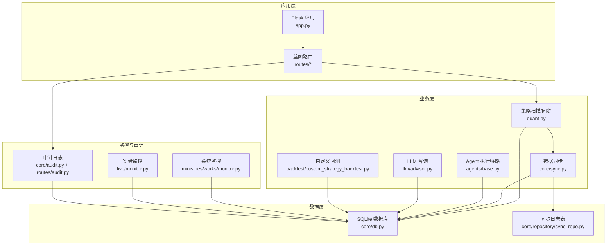
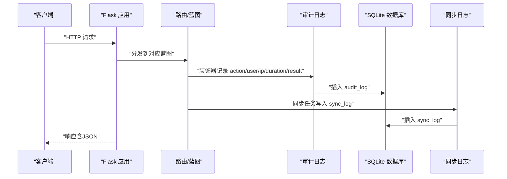
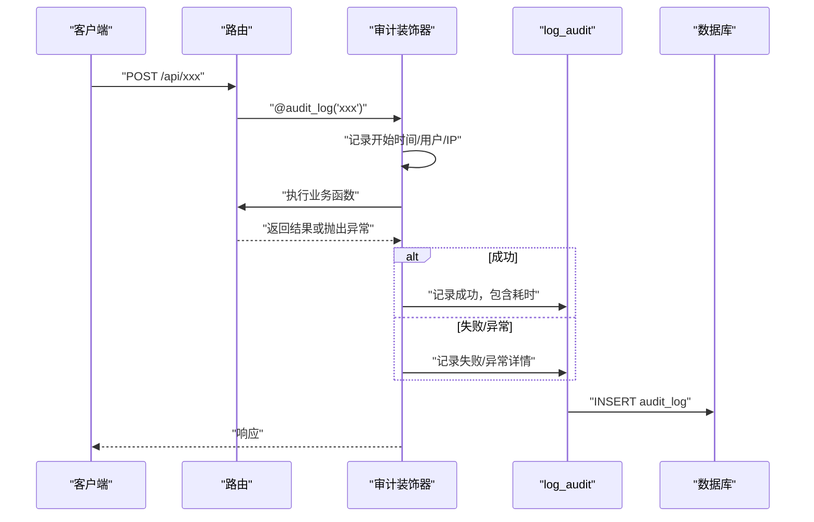
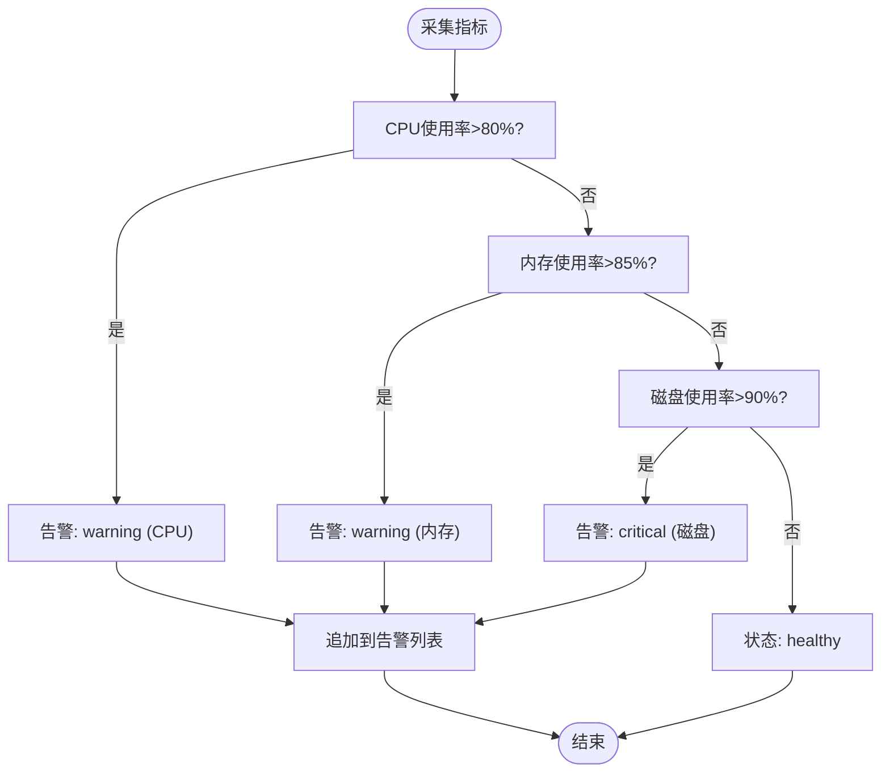
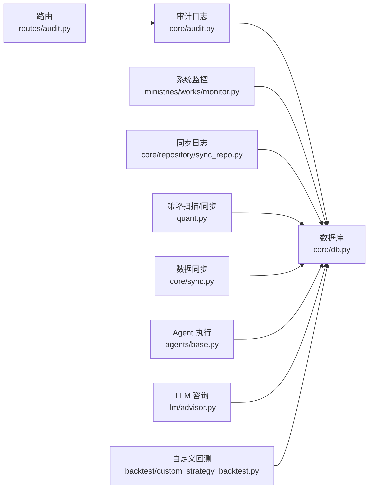
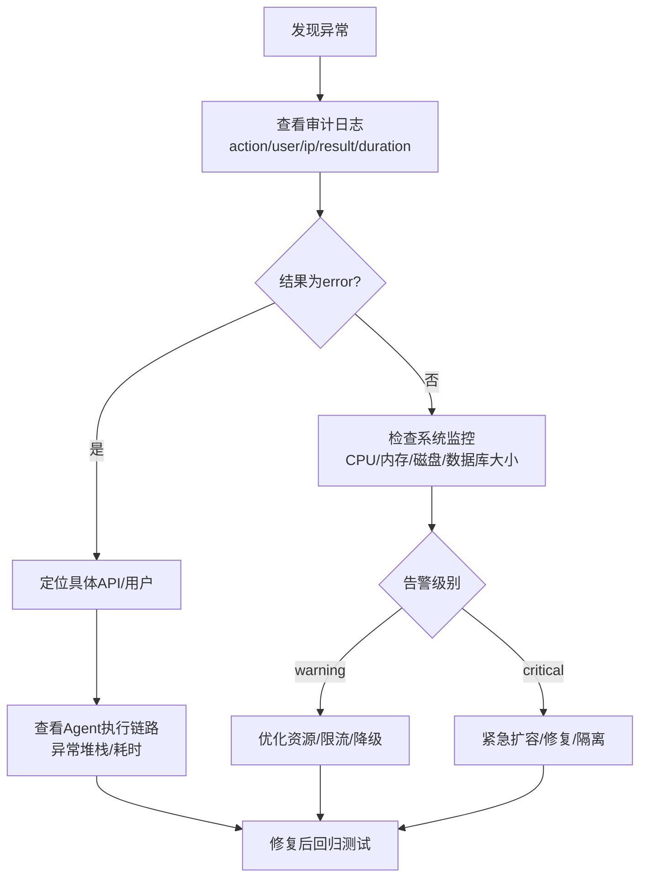

# 日志分析

<cite>
**本文引用的文件**
- [app.py](file://app.py)
- [quant.py](file://quant.py)
- [config/settings.py](file://config/settings.py)
- [core/db.py](file://core/db.py)
- [core/audit.py](file://core/audit.py)
- [routes/audit.py](file://routes/audit.py)
- [core/sync.py](file://core/sync.py)
- [core/repository/sync_repo.py](file://core/repository/sync_repo.py)
- [ministries/works/monitor.py](file://ministries/works/monitor.py)
- [live/monitor.py](file://live/monitor.py)
- [agents/base.py](file://agents/base.py)
- [llm/advisor.py](file://llm/advisor.py)
- [backtest/custom_strategy_backtest.py](file://backtest/custom_strategy_backtest.py)
</cite>

## 目录
1. [简介](#简介)
2. [项目结构](#项目结构)
3. [核心组件](#核心组件)
4. [架构总览](#架构总览)
5. [详细组件分析](#详细组件分析)
6. [依赖分析](#依赖分析)
7. [性能考虑](#性能考虑)
8. [故障排查指南](#故障排查指南)
9. [结论](#结论)
10. [附录](#附录)

## 简介
本指南面向技术支持与运维人员，系统化讲解AIQuant系统的日志体系与分析方法。内容覆盖日志级别与分类、关键字段提取、日志位置与命名规则、问题定位流程、日志工具与技巧、以及日志轮转与备份建议。通过对审计日志、系统监控、任务队列、Agent执行链路、LLM与回测模块等关键路径的深入解析，帮助快速定位错误传播路径、状态变化与性能瓶颈。

## 项目结构
AIQuant采用“Flask应用 + SQLite数据库 + 模块化子系统”的架构。日志贯穿以下层面：
- 应用层：Flask全局错误处理与路由装饰器记录审计日志
- 数据层：数据库初始化、同步日志、审计日志表
- 监控层：系统指标采集与告警
- 业务层：策略扫描、数据同步、Agent执行、LLM与回测

图表来源
- [app.py:147-164](file://app.py#L147-L164)
- [quant.py:433-546](file://quant.py#L433-L546)
- [core/sync.py:136-176](file://core/sync.py#L136-L176)
- [core/audit.py:16-39](file://core/audit.py#L16-L39)
- [routes/audit.py:16-38](file://routes/audit.py#L16-L38)
- [ministries/works/monitor.py:36-101](file://ministries/works/monitor.py#L36-L101)
- [live/monitor.py:218-254](file://live/monitor.py#L218-L254)
- [core/db.py:57-467](file://core/db.py#L57-L467)
- [core/repository/sync_repo.py:18-25](file://core/repository/sync_repo.py#L18-L25)

章节来源
- [app.py:147-164](file://app.py#L147-L164)
- [config/settings.py:23-25](file://config/settings.py#L23-L25)

## 核心组件
- 审计日志系统：统一记录API调用、结果与耗时，便于追踪用户行为与错误传播路径
- 系统监控：采集CPU/内存/磁盘/数据库大小等指标，触发告警
- 数据同步日志：记录同步批次、成功/失败、耗时与备注
- Agent执行链路：每个Agent封装执行、计时与异常堆栈，便于定位执行阶段问题
- LLM与回测：提供JSON解析与错误捕获，便于定位策略脚本执行异常

章节来源
- [core/audit.py:16-92](file://core/audit.py#L16-L92)
- [routes/audit.py:16-38](file://routes/audit.py#L16-L38)
- [ministries/works/monitor.py:36-101](file://ministries/works/monitor.py#L36-L101)
- [core/repository/sync_repo.py:18-25](file://core/repository/sync_repo.py#L18-L25)
- [agents/base.py:93-114](file://agents/base.py#L93-L114)
- [llm/advisor.py:189-212](file://llm/advisor.py#L189-L212)
- [backtest/custom_strategy_backtest.py:176-189](file://backtest/custom_strategy_backtest.py#L176-L189)

## 架构总览
下图展示日志在系统中的流向与落盘位置：

图表来源
- [app.py:147-164](file://app.py#L147-L164)
- [routes/audit.py:16-38](file://routes/audit.py#L16-L38)
- [core/audit.py:16-92](file://core/audit.py#L16-L92)
- [core/repository/sync_repo.py:18-25](file://core/repository/sync_repo.py#L18-L25)
- [core/db.py:416-427](file://core/db.py#L416-L427)

## 详细组件分析

### 审计日志系统
- 记录字段：用户ID、操作动作、资源、详情（含耗时）、客户端IP、时间戳
- 装饰器自动记录API调用耗时与结果状态，异常时记录异常信息
- 提供分页查询与统计接口，支持按动作与用户过滤

图表来源
- [core/audit.py:41-92](file://core/audit.py#L41-L92)
- [routes/audit.py:16-38](file://routes/audit.py#L16-L38)
- [core/db.py:416-427](file://core/db.py#L416-L427)

章节来源
- [core/audit.py:16-92](file://core/audit.py#L16-L92)
- [routes/audit.py:16-78](file://routes/audit.py#L16-L78)

### 系统监控与告警
- 指标采集：CPU、内存、磁盘使用率、数据库大小、连接数、待处理订单、1小时错误数
- 告警阈值：CPU>80%、内存>85%、磁盘>90%，分别标记warning/critical
- 状态摘要：根据最新指标给出健康状态

图表来源
- [ministries/works/monitor.py:36-101](file://ministries/works/monitor.py#L36-L101)

章节来源
- [ministries/works/monitor.py:36-101](file://ministries/works/monitor.py#L36-L101)

### 数据同步日志
- 记录字段：同步时间、类型、总量、成功数、失败数、耗时、备注
- 用于评估同步任务的吞吐与稳定性

章节来源
- [core/repository/sync_repo.py:18-25](file://core/repository/sync_repo.py#L18-L25)
- [core/db.py:909-914](file://core/db.py#L909-L914)

### Agent执行链路日志
- 每个Agent封装执行过程，自动记录开始/结束时间、耗时、异常堆栈
- 便于定位具体Agent阶段的错误与性能瓶颈

章节来源
- [agents/base.py:93-114](file://agents/base.py#L93-L114)

### LLM与回测模块日志
- LLM：提供JSON解析容错，记录原始响应与解析错误
- 回测：捕获语法与执行错误，返回明确的错误信息

章节来源
- [llm/advisor.py:189-212](file://llm/advisor.py#L189-L212)
- [backtest/custom_strategy_backtest.py:176-189](file://backtest/custom_strategy_backtest.py#L176-L189)

## 依赖分析
- 审计日志依赖数据库连接与蓝图路由
- 系统监控依赖psutil与数据库路径
- 数据同步依赖第三方数据源与数据库批量写入
- Agent与LLM/回测模块依赖数据库与策略/模型能力

图表来源
- [core/audit.py:16-39](file://core/audit.py#L16-L39)
- [routes/audit.py:16-38](file://routes/audit.py#L16-L38)
- [ministries/works/monitor.py:36-101](file://ministries/works/monitor.py#L36-L101)
- [core/repository/sync_repo.py:18-25](file://core/repository/sync_repo.py#L18-L25)
- [quant.py:433-546](file://quant.py#L433-L546)
- [core/sync.py:136-176](file://core/sync.py#L136-L176)
- [agents/base.py:93-114](file://agents/base.py#L93-L114)
- [llm/advisor.py:189-212](file://llm/advisor.py#L189-L212)
- [backtest/custom_strategy_backtest.py:176-189](file://backtest/custom_strategy_backtest.py#L176-L189)

## 性能考虑
- 审计日志与同步日志均写入SQLite，注意高并发下的WAL模式与索引设计
- 系统监控每分钟采集一次，建议在生产环境降低采集频率或异步化
- Agent执行链路记录耗时，可用于热点Agent的优化与并行化

## 故障排查指南

### 日志级别与分类
- DEBUG：开发调试期使用，本项目未显式设置DEBUG级别
- INFO：系统正常运行信息（如扫描进度、同步进度、健康状态摘要）
- WARNING：资源使用率偏高或出现可恢复异常（如监控阈值触发）
- ERROR：严重错误（如数据库写入失败、同步异常、Agent执行异常、回测脚本错误）
- CRITICAL：系统级故障（如磁盘占用过高、数据库不可用）

章节来源
- [config/settings.py:24](file://config/settings.py#L24)
- [ministries/works/monitor.py:71-81](file://ministries/works/monitor.py#L71-L81)
- [core/sync.py:174](file://core/sync.py#L174)
- [agents/base.py:109](file://agents/base.py#L109)
- [backtest/custom_strategy_backtest.py:180](file://backtest/custom_strategy_backtest.py#L180)

### 关键日志字段提取
- 时间戳：审计日志与同步日志均包含时间字段，用于排序与趋势分析
- 错误堆栈：Agent执行链路会记录异常类型与堆栈，便于定位
- 性能指标：系统监控输出CPU/内存/磁盘/数据库大小等指标
- 请求上下文：审计日志包含用户ID、IP地址、耗时、结果状态

章节来源
- [core/audit.py:16-39](file://core/audit.py#L16-L39)
- [core/audit.py:71-92](file://core/audit.py#L71-L92)
- [ministries/works/monitor.py:36-101](file://ministries/works/monitor.py#L36-L101)
- [agents/base.py:109](file://agents/base.py#L109)

### 日志文件位置与命名规则
- 数据库：SQLite文件位于数据库模块内，路径随模块路径确定
- 日志表：审计日志表与同步日志表均在数据库内，无需单独文件
- 建议：若需外部日志文件，可在应用启动处增加标准日志配置，并将审计/同步日志同时写入文件与数据库

章节来源
- [core/db.py:19](file://core/db.py#L19)
- [core/db.py:416-427](file://core/db.py#L416-L427)
- [core/repository/sync_repo.py:18-25](file://core/repository/sync_repo.py#L18-L25)

### 问题定位流程
- 定位错误传播路径：从审计日志的用户ID、IP、动作、耗时与结果入手，结合Agent执行链路的异常堆栈
- 状态变化记录：查看系统监控的健康状态与告警列表，确认资源瓶颈
- 性能瓶颈识别：关注Agent耗时、同步批次耗时、数据库写入耗时

图表来源
- [core/audit.py:71-92](file://core/audit.py#L71-L92)
- [agents/base.py:109](file://agents/base.py#L109)
- [ministries/works/monitor.py:71-101](file://ministries/works/monitor.py#L71-L101)

### 日志分析工具与技巧
- grep：按关键字过滤（如“ERROR”、“异常”、“失败”）
- 正则：提取时间戳、耗时、异常类型、资源ID
- 日志聚合：将审计日志与同步日志按时间轴合并，观察业务与系统资源的关联
- 可视化：将系统监控指标与审计统计导出到可视化平台进行趋势分析

### 关键日志字段含义
- 请求ID：审计日志中的资源字段可映射到业务实体ID
- 用户标识：审计日志中的user_id
- 策略名称：Agent执行链路中的agent_name
- Agent状态：执行结果success/失败信息与异常堆栈
- 实时监控：系统监控的指标与告警级别

章节来源
- [core/audit.py:16-39](file://core/audit.py#L16-L39)
- [agents/base.py:93-114](file://agents/base.py#L93-L114)
- [ministries/works/monitor.py:36-101](file://ministries/works/monitor.py#L36-L101)

### 日志轮转与清理策略
- 建议：当启用外部日志文件时，采用滚动日志策略（按大小或时间轮转），保留7-30天
- 清理：定期清理旧日志与缓存文件（如同步模块的缓存清理逻辑）

章节来源
- [quant.py:558-565](file://quant.py#L558-L565)

### 日志存储与备份
- 存储：数据库文件与日志表同机存放，建议开启数据库WAL模式提升并发
- 备份：定期备份数据库文件，结合审计日志与同步日志进行完整性校验

章节来源
- [core/db.py:26-40](file://core/db.py#L26-L40)

## 结论
AIQuant的日志体系以审计日志为核心，辅以系统监控、同步日志与Agent执行链路日志，形成完整的可观测性闭环。通过统一的字段与查询接口，可以高效定位错误传播路径、识别性能瓶颈并评估系统健康状态。建议在生产环境中启用外部日志文件与轮转策略，并结合可视化工具进行持续监控与预警。

## 附录

### 标准化日志分析流程
- 步骤1：确认异常发生时间窗，抓取审计日志与系统监控指标
- 步骤2：定位具体API与用户，核对Agent执行链路与耗时
- 步骤3：检查同步日志与数据库写入情况，排除数据源/网络问题
- 步骤4：根据告警级别采取相应措施（优化/扩容/隔离）
- 步骤5：修复后回归测试并持续观察

### 问题定位模板
- 问题描述：
- 发生时间：
- 影响范围：
- 审计日志检索关键词：
- Agent执行链路异常堆栈：
- 系统监控指标峰值：
- 处理措施与结果：