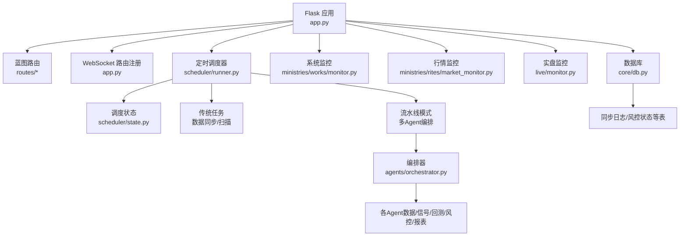
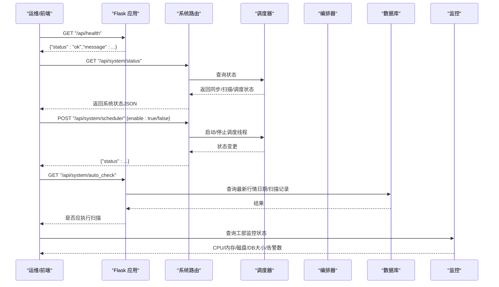
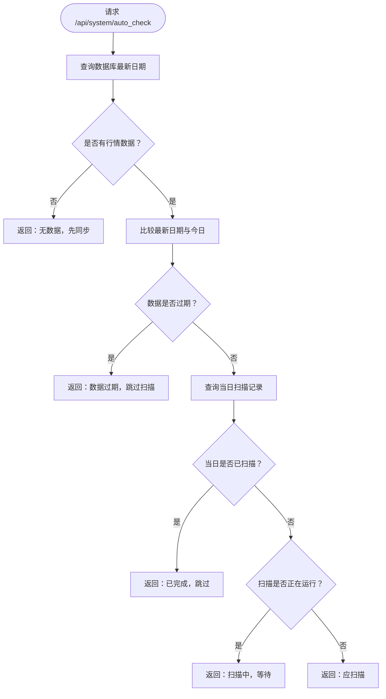
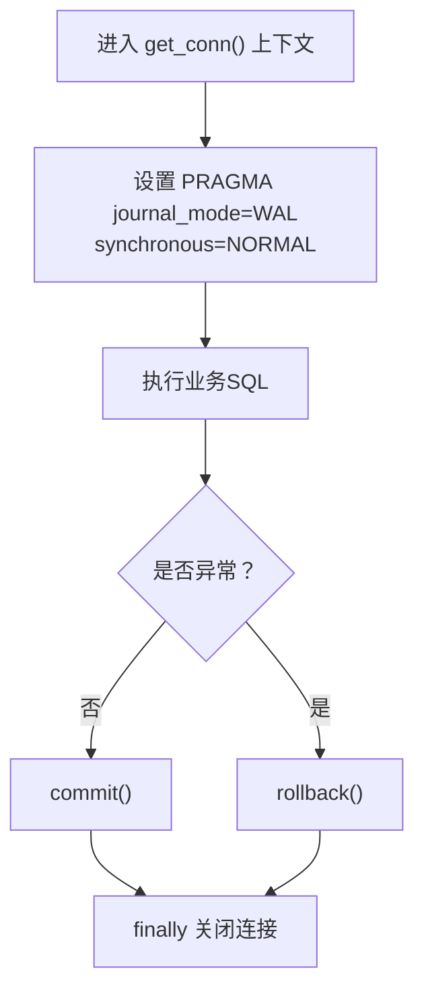
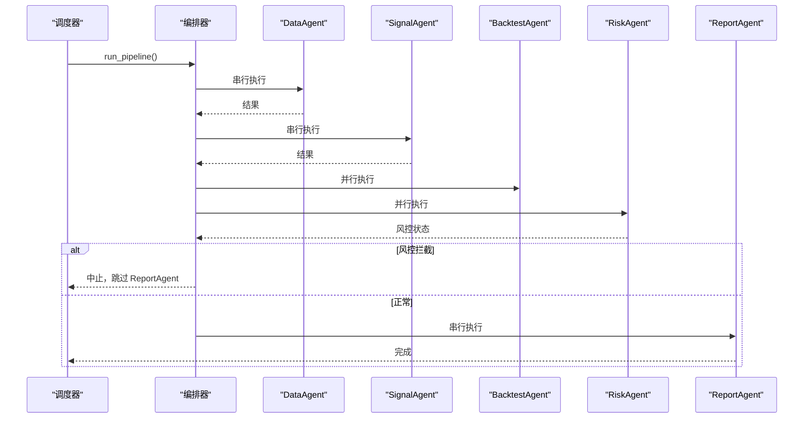
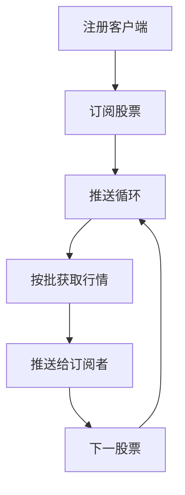
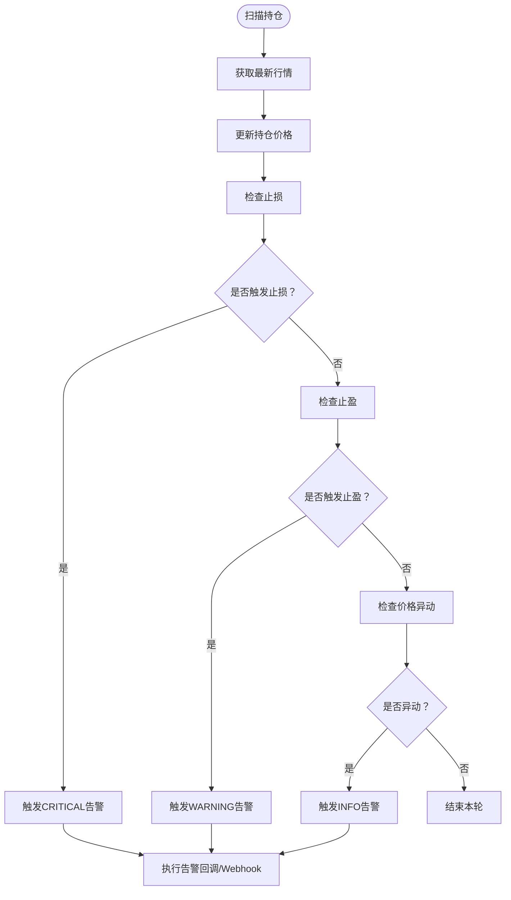
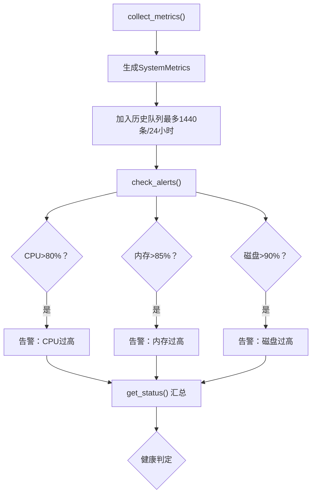
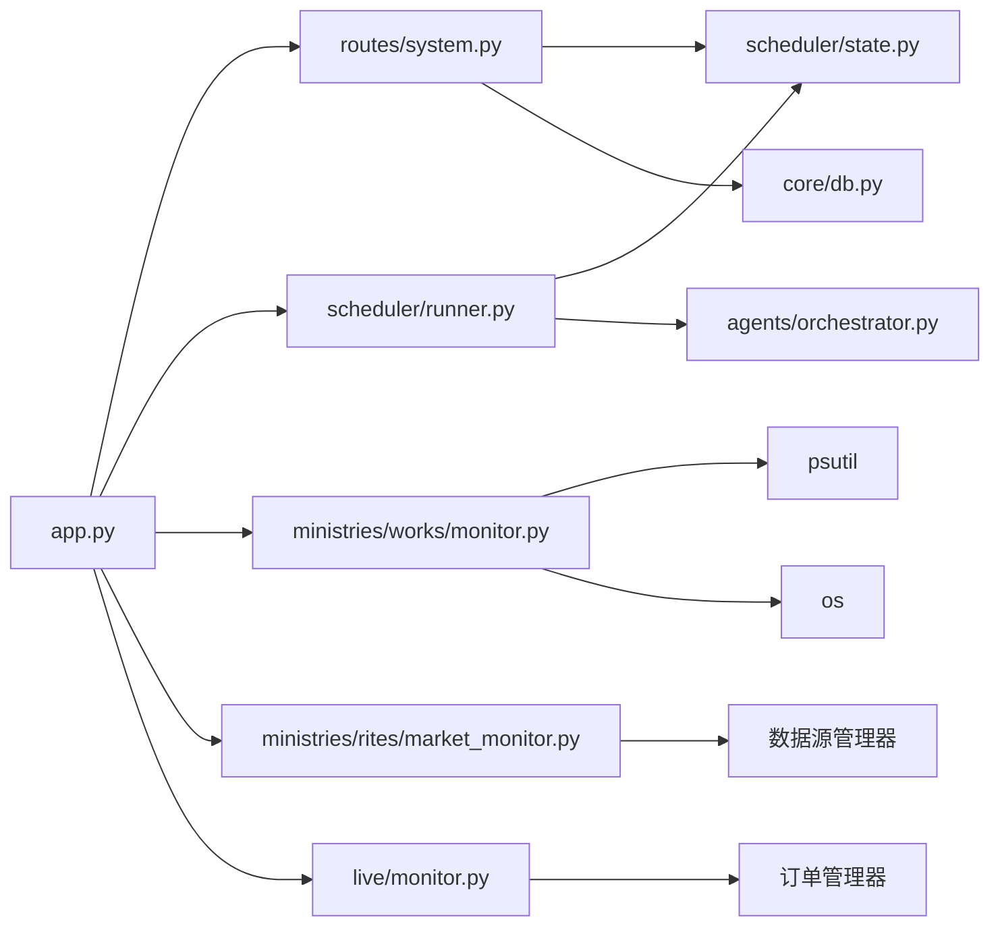

# 系统健康检查

<cite>
**本文引用的文件**
- [app.py](file://app.py)
- [settings.py](file://config/settings.py)
- [db.py](file://core/db.py)
- [orchestrator.py](file://agents/orchestrator.py)
- [runner.py](file://scheduler/runner.py)
- [state.py](file://scheduler/state.py)
- [system.py](file://routes/system.py)
- [monitor.py（行情监控）](file://ministries/rites/market_monitor.py)
- [monitor.py（实盘监控）](file://live/monitor.py)
- [monitor.py（工部监控）](file://ministries/works/monitor.py)
- [requirements.txt](file://requirements.txt)
- [risk/engine.py](file://risk/engine.py)
- [risk/rules.py](file://risk/rules.py)
- [sync_repo.py](file://core/repository/sync_repo.py)
</cite>

## 目录
1. [简介](#简介)
2. [项目结构](#项目结构)
3. [核心组件](#核心组件)
4. [架构总览](#架构总览)
5. [详细组件分析](#详细组件分析)
6. [依赖分析](#依赖分析)
7. [性能考量](#性能考量)
8. [故障排查指南](#故障排查指南)
9. [结论](#结论)
10. [附录](#附录)

## 简介
本文件面向AIQuant系统的运维与开发团队，提供一套可落地的系统健康检查清单与自检方法。内容覆盖服务启动状态、数据库连接、Agent流水线运行、API接口可用性、定时任务与状态监控、关键健康指标阈值、自检工具与异常恢复机制、容量评估与预防性维护建议，并给出标准化的健康检查报告模板与问题处理流程。

## 项目结构
AIQuant采用“蓝图路由 + 模块化职能”的组织方式，核心入口为Flask应用，通过蓝图注册各类业务路由；调度器负责定时任务；监控模块分别负责行情推送、实盘监控与系统资源监控；数据库为SQLite本地文件；风险引擎提供风控检查与记录。

**图表来源**
- [app.py:1-164](file://app.py#L1-L164)
- [runner.py:158-182](file://scheduler/runner.py#L158-L182)
- [orchestrator.py:36-175](file://agents/orchestrator.py#L36-L175)
- [monitor.py（工部监控）:29-101](file://ministries/works/monitor.py#L29-L101)
- [monitor.py（行情监控）:21-131](file://ministries/rites/market_monitor.py#L21-L131)
- [monitor.py（实盘监控）:55-87](file://live/monitor.py#L55-L87)
- [db.py:19-466](file://core/db.py#L19-L466)

**章节来源**
- [app.py:1-164](file://app.py#L1-L164)
- [runner.py:158-182](file://scheduler/runner.py#L158-L182)
- [orchestrator.py:36-175](file://agents/orchestrator.py#L36-L175)
- [monitor.py（工部监控）:29-101](file://ministries/works/monitor.py#L29-L101)
- [monitor.py（行情监控）:21-131](file://ministries/rites/market_monitor.py#L21-L131)
- [monitor.py（实盘监控）:55-87](file://live/monitor.py#L55-L87)
- [db.py:19-466](file://core/db.py#L19-L466)

## 核心组件
- API与路由层：提供健康检查、系统状态、触发同步/扫描、调度启停等接口。
- 定时调度器：支持传统模式与流水线模式，分别执行数据同步/扫描与多Agent流水线。
- 编排器：定义三省六部式流水线，串行/并行组合，支持状态持久化与中断逻辑。
- 监控模块：
  - 工部监控：采集CPU/内存/磁盘/数据库大小等指标，生成健康状态与告警。
  - 礼部监控：WebSocket行情推送，维护订阅与客户端连接。
  - 兵部监控：实盘监控，止损/止盈/异动告警，支持Webhook推送。
- 数据库：SQLite本地文件，提供建表/迁移/写入/查询等能力，并记录同步日志与风控状态。
- 风控引擎：对账户状态进行风控检查，记录事件与状态快照。

**章节来源**
- [system.py:46-83](file://routes/system.py#L46-L83)
- [runner.py:158-212](file://scheduler/runner.py#L158-L212)
- [orchestrator.py:36-175](file://agents/orchestrator.py#L36-L175)
- [monitor.py（工部监控）:29-101](file://ministries/works/monitor.py#L29-L101)
- [monitor.py（行情监控）:21-131](file://ministries/rites/market_monitor.py#L21-L131)
- [monitor.py（实盘监控）:55-87](file://live/monitor.py#L55-L87)
- [db.py:19-466](file://core/db.py#L19-L466)
- [risk/engine.py:51-71](file://risk/engine.py#L51-L71)

## 架构总览
系统健康检查涉及以下关键路径：
- API健康检查：/api/health
- 系统状态查询：/api/system/status
- 定时任务状态与启停：/api/system/scheduler
- 数据库可用性：连接上下文与建表/迁移逻辑
- Agent流水线：编排器状态与各Agent状态
- 监控链路：工部监控指标、行情监控连接数、实盘监控告警

**图表来源**
- [app.py:131-133](file://app.py#L131-L133)
- [system.py:46-83](file://routes/system.py#L46-L83)
- [system.py:85-151](file://routes/system.py#L85-L151)
- [runner.py:158-182](file://scheduler/runner.py#L158-L182)
- [orchestrator.py:64-76](file://agents/orchestrator.py#L64-L76)
- [monitor.py（工部监控）:86-101](file://ministries/works/monitor.py#L86-L101)

## 详细组件分析

### API健康检查与系统状态
- 健康检查接口：/api/health 返回系统运行状态。
- 系统状态接口：/api/system/status 返回同步/扫描/调度状态。
- 自动检查接口：/api/system/auto_check 基于数据库最新日期与扫描记录判断是否应执行扫描。
- 调度启停接口：/api/system/scheduler 支持开启/关闭定时任务。

**图表来源**
- [system.py:85-151](file://routes/system.py#L85-L151)

**章节来源**
- [app.py:131-133](file://app.py#L131-L133)
- [system.py:46-83](file://routes/system.py#L46-L83)
- [system.py:85-151](file://routes/system.py#L85-L151)

### 数据库连接与可用性
- 连接管理：提供上下文管理器，设置WAL与同步参数，自动提交/回滚/关闭连接。
- 初始化建表：首次运行自动创建所有表与索引，并进行列迁移与索引修复。
- 同步日志：记录每次同步的总量/成功/失败/耗时，便于追踪与恢复。

**图表来源**
- [db.py:26-39](file://core/db.py#L26-L39)
- [db.py:57-466](file://core/db.py#L57-L466)
- [sync_repo.py:18-33](file://core/repository/sync_repo.py#L18-L33)

**章节来源**
- [db.py:26-39](file://core/db.py#L26-L39)
- [db.py:57-466](file://core/db.py#L57-L466)
- [sync_repo.py:18-33](file://core/repository/sync_repo.py#L18-L33)

### 多Agent流水线与运行状态
- 编排器：定义三省六部流水线，支持串行/并行，状态持久化，异常处理与重试。
- 状态查询：提供当前运行状态、历史记录、并行Agent状态更新。
- 定时触发：流水线模式下07:30预同步数据，09:00完整流水线。

**图表来源**
- [runner.py:108-137](file://scheduler/runner.py#L108-L137)
- [orchestrator.py:81-175](file://agents/orchestrator.py#L81-L175)

**章节来源**
- [runner.py:108-137](file://scheduler/runner.py#L108-L137)
- [orchestrator.py:81-175](file://agents/orchestrator.py#L81-L175)
- [state.py:15-45](file://scheduler/state.py#L15-L45)

### WebSocket行情监控
- 客户端注册/订阅/退订：维护ws_id、订阅集合与连接时间。
- 行情推送：按批次批量获取并推送至订阅者，异常处理与广播系统事件。
- 状态查询：返回运行状态、客户端数、订阅数、股票数等。

**图表来源**
- [monitor.py（行情监控）:39-93](file://ministries/rites/market_monitor.py#L39-L93)
- [monitor.py（行情监控）:124-151](file://ministries/rites/market_monitor.py#L124-L151)
- [monitor.py（行情监控）:214-231](file://ministries/rites/market_monitor.py#L214-L231)

**章节来源**
- [monitor.py（行情监控）:39-93](file://ministries/rites/market_monitor.py#L39-L93)
- [monitor.py（行情监控）:124-151](file://ministries/rites/market_monitor.py#L124-L151)
- [monitor.py（行情监控）:214-231](file://ministries/rites/market_monitor.py#L214-L231)

### 实盘监控与告警
- 监控配置：止损/止盈/异动阈值、扫描间隔、最大告警数、Webhook地址。
- 告警触发：浮盈/浮亏达到阈值或当日涨跌幅超限，记录告警并回调处理。
- 状态查询：返回运行状态、间隔、活跃告警数、阈值等。

**图表来源**
- [monitor.py（实盘监控）:102-154](file://live/monitor.py#L102-L154)
- [monitor.py（实盘监控）:158-186](file://live/monitor.py#L158-L186)

**章节来源**
- [monitor.py（实盘监控）:102-154](file://live/monitor.py#L102-L154)
- [monitor.py（实盘监控）:158-186](file://live/monitor.py#L158-L186)
- [monitor.py（实盘监控）:204-245](file://live/monitor.py#L204-L245)

### 工部系统监控与健康指标
- 指标采集：CPU/内存/磁盘使用率，数据库大小（MB），错误计数等。
- 健康判定：CPU<70%且内存<80%视为健康；超过阈值产生告警。
- 告警检查：CPU>80%，内存>85%，磁盘>90%触发告警。

**图表来源**
- [monitor.py（工部监控）:36-60](file://ministries/works/monitor.py#L36-L60)
- [monitor.py（工部监控）:62-84](file://ministries/works/monitor.py#L62-L84)
- [monitor.py（工部监控）:86-101](file://ministries/works/monitor.py#L86-L101)

**章节来源**
- [monitor.py（工部监控）:36-60](file://ministries/works/monitor.py#L36-L60)
- [monitor.py（工部监控）:62-84](file://ministries/works/monitor.py#L62-L84)
- [monitor.py（工部监控）:86-101](file://ministries/works/monitor.py#L86-L101)

### 风控检查与状态记录
- 风控检查：对账户状态执行多项规则检查，生成总体级别与拦截原因。
- 状态记录：将检查结果与状态写入数据库，便于审计与追溯。

**章节来源**
- [risk/engine.py:51-71](file://risk/engine.py#L51-L71)
- [risk/rules.py:257-289](file://risk/rules.py#L257-L289)

## 依赖分析
- 外部依赖：requests、pandas、plotly、flask-sock、simple-websocket、scikit-learn、joblib。
- 运行时依赖：psutil（用于系统监控）。
- 组件耦合：
  - app.py 依赖各蓝图与监控器单例。
  - scheduler 依赖 core/db 与 agents/orchestrator。
  - routes/system 依赖 scheduler/state 与 core/db。
  - monitor.py（工部）依赖 psutil 与 os。
  - monitor.py（行情/实盘）依赖数据源与订单管理器。

**图表来源**
- [app.py:1-164](file://app.py#L1-L164)
- [system.py:1-152](file://routes/system.py#L1-L152)
- [runner.py:1-212](file://scheduler/runner.py#L1-L212)
- [monitor.py（工部监控）:38-54](file://ministries/works/monitor.py#L38-L54)
- [monitor.py（行情监控）:18-35](file://ministries/rites/market_monitor.py#L18-L35)
- [monitor.py（实盘监控）:20-22](file://live/monitor.py#L20-L22)

**章节来源**
- [requirements.txt:1-9](file://requirements.txt#L1-L9)
- [app.py:1-164](file://app.py#L1-L164)
- [system.py:1-152](file://routes/system.py#L1-L152)
- [runner.py:1-212](file://scheduler/runner.py#L1-L212)
- [monitor.py（工部监控）:38-54](file://ministries/works/monitor.py#L38-L54)
- [monitor.py（行情监控）:18-35](file://ministries/rites/market_monitor.py#L18-L35)
- [monitor.py（实盘监控）:20-22](file://live/monitor.py#L20-L22)

## 性能考量
- 数据库并发：启用WAL与NORMAL同步，提升写入并发与可靠性。
- 批量写入：行情与指数数据采用批量插入/更新，减少事务开销。
- 监控采样：工部监控每分钟采集一次，历史保留24小时，避免高负载。
- 行情推送：按批获取（每次最多10只），降低数据源压力。
- 实盘扫描：默认30秒间隔，可根据机器性能调整。

**章节来源**
- [db.py:28-30](file://core/db.py#L28-L30)
- [monitor.py（工部监控）:56-58](file://ministries/works/monitor.py#L56-L58)
- [monitor.py（行情监控）:141-144](file://ministries/rites/market_monitor.py#L141-L144)
- [monitor.py（实盘监控）:48-50](file://live/monitor.py#L48-L50)

## 故障排查指南
- API不可达
  - 检查 /api/health 是否返回ok。
  - 查看全局错误处理器返回的404/500信息。
- 定时任务未执行
  - 使用 /api/system/scheduler 控制开关，确认调度线程已启动。
  - 检查流水线模式环境变量与调度时间。
- 数据同步失败
  - 查看同步状态与最后结果，确认是否在运行中。
  - 检查数据库连接与建表/迁移是否成功。
  - 核对同步日志表记录，定位失败批次。
- Agent流水线中断
  - 通过 /api/system/status 查询流水线状态与各Agent状态。
  - 若风控拦截，检查风险状态与拦截原因。
- WebSocket行情断连
  - 检查行情监控状态，确认客户端数与订阅数。
  - 核对数据源可用性与推送异常日志。
- 实盘告警未触发
  - 核对止损/止盈/异动阈值配置。
  - 检查告警回调与Webhook推送状态。
- 系统资源紧张
  - 使用工部监控状态查看CPU/内存/磁盘使用率。
  - 根据告警阈值进行扩容或优化。

**章节来源**
- [app.py:137-144](file://app.py#L137-L144)
- [system.py:66-83](file://routes/system.py#L66-L83)
- [runner.py:158-182](file://scheduler/runner.py#L158-L182)
- [db.py:57-466](file://core/db.py#L57-L466)
- [sync_repo.py:18-33](file://core/repository/sync_repo.py#L18-L33)
- [orchestrator.py:64-76](file://agents/orchestrator.py#L64-L76)
- [monitor.py（工部监控）:86-101](file://ministries/works/monitor.py#L86-L101)
- [monitor.py（行情监控）:214-231](file://ministries/rites/market_monitor.py#L214-L231)
- [monitor.py（实盘监控）:158-186](file://live/monitor.py#L158-L186)

## 结论
本健康检查体系以API健康检查为入口，结合系统状态查询、定时任务与流水线编排、数据库可用性、行情与实盘监控、以及工部系统监控，形成闭环的健康保障。通过明确的阈值与告警机制，配合标准化的报告模板与问题处理流程，可有效提升系统的稳定性与可维护性。

## 附录

### 健康检查清单（运维手册）
- 服务启动状态
  - 访问 /api/health，确认返回ok。
  - 检查Flask启动日志与WebSocket行情服务是否启动。
- 数据库连接状态
  - 确认 get_conn() 上下文工作正常。
  - 验证建表/迁移是否完成，索引是否存在。
- Agent运行状态
  - 通过 /api/system/status 查询流水线状态与各Agent状态。
  - 检查流水线模式与调度时间。
- API接口可用性
  - 调用 /api/system/status、/api/system/scheduler、/api/system/auto_check。
  - 验证错误处理返回格式一致。
- 监控链路
  - 工部监控：CPU/内存/磁盘/DB大小健康阈值检查。
  - 行情监控：客户端数、订阅数、推送异常。
  - 实盘监控：告警阈值、告警回调、Webhook。
- 风控检查
  - 核对风控状态与拦截原因，检查风控日志表。

**章节来源**
- [app.py:131-133](file://app.py#L131-L133)
- [system.py:46-83](file://routes/system.py#L46-L83)
- [system.py:85-151](file://routes/system.py#L85-L151)
- [monitor.py（工部监控）:86-101](file://ministries/works/monitor.py#L86-L101)
- [monitor.py（行情监控）:214-231](file://ministries/rites/market_monitor.py#L214-L231)
- [monitor.py（实盘监控）:204-245](file://live/monitor.py#L204-L245)
- [risk/engine.py:51-71](file://risk/engine.py#L51-L71)

### 自动化方法与配置
- 定时任务配置
  - 传统模式：07:00 同步，09:00 扫描。
  - 流水线模式：07:30 DataAgent，09:00 完整流水线。
  - 可通过环境变量切换流水线模式。
- 状态监控脚本
  - 工部监控：每分钟采集一次，保留24小时历史。
  - 行情监控：按批推送，异常捕获与广播。
  - 实盘监控：默认30秒扫描间隔。
- 告警机制
  - CPU>80%、内存>85%、磁盘>90%触发告警。
  - 实盘告警支持Webhook推送。

**章节来源**
- [runner.py:167-176](file://scheduler/runner.py#L167-L176)
- [runner.py:108-137](file://scheduler/runner.py#L108-L137)
- [monitor.py（工部监控）:56-58](file://ministries/works/monitor.py#L56-L58)
- [monitor.py（行情监控）:141-144](file://ministries/rites/market_monitor.py#L141-L144)
- [monitor.py（实盘监控）:48-50](file://live/monitor.py#L48-L50)
- [monitor.py（工部监控）:71-81](file://ministries/works/monitor.py#L71-L81)

### 关键健康指标与阈值
- 进程存活检查：API进程、调度线程、监控线程。
- 内存使用率：阈值85%，超过触发告警。
- 磁盘空间：阈值90%，超过触发告警。
- CPU使用率：阈值80%，超过触发告警。
- 数据库大小：监控DB文件大小（MB）。
- 网络连接状态：WebSocket客户端数、订阅数、推送异常次数。

**章节来源**
- [monitor.py（工部监控）:71-81](file://ministries/works/monitor.py#L71-L81)
- [monitor.py（工部监控）:48-54](file://ministries/works/monitor.py#L48-L54)
- [monitor.py（行情监控）:214-231](file://ministries/rites/market_monitor.py#L214-L231)

### 系统自检工具与使用方法
- 数据库完整性检查
  - 检查表结构与索引是否存在。
  - 校验唯一索引与冲突更新逻辑。
- 文件系统检查
  - 检查DB文件存在与大小。
  - 检查日志目录与报告目录权限。
- 依赖库版本验证
  - 校验requirements.txt中的版本范围。
  - 运行前安装依赖，确保psutil可用。

**章节来源**
- [db.py:57-466](file://core/db.py#L57-L466)
- [monitor.py（工部监控）:48-54](file://ministries/works/monitor.py#L48-L54)
- [requirements.txt:1-9](file://requirements.txt#L1-L9)

### 异常状态的自动恢复机制
- 服务重启：通过进程管理器（如Supervisor/Docker）自动拉起。
- 连接重连：数据库连接异常时自动回滚并重试。
- 数据同步：失败批次记录在同步日志表，支持重跑。
- 风控拦截：拦截后记录拦截原因，待人工审批后解除。

**章节来源**
- [db.py:35-36](file://core/db.py#L35-L36)
- [sync_repo.py:18-33](file://core/repository/sync_repo.py#L18-L33)
- [risk/engine.py:51-71](file://risk/engine.py#L51-L71)

### 系统容量评估方法
- 最大并发处理能力
  - 数据库WAL模式与批量写入能力。
  - 行情推送批大小与扫描间隔。
- 数据存储容量
  - DB文件大小（MB）持续监控。
  - 历史数据保留策略与压缩。
- 网络带宽需求
  - WebSocket客户端数与推送频率。
  - 行情推送批大小与数据包大小。

**章节来源**
- [db.py:28-30](file://core/db.py#L28-L30)
- [monitor.py（工部监控）:48-54](file://ministries/works/monitor.py#L48-L54)
- [monitor.py（行情监控）:141-144](file://ministries/rites/market_monitor.py#L141-L144)

### 故障预防措施
- 定期维护计划
  - 每日检查 /api/system/auto_check，确保扫描按时执行。
  - 每周清理历史日志与告警。
- 性能预警设置
  - 设置CPU/内存/磁盘阈值告警。
  - 监控DB大小增长趋势。
- 容量规划建议
  - 根据股票数量与数据密度估算DB大小。
  - 评估WebSocket并发与带宽峰值。

**章节来源**
- [system.py:85-151](file://routes/system.py#L85-L151)
- [monitor.py（工部监控）:71-81](file://ministries/works/monitor.py#L71-L81)
- [monitor.py（工部监控）:48-54](file://ministries/works/monitor.py#L48-L54)

### 标准化健康检查报告模板
- 报告头
  - 检查时间、检查人、系统版本。
- 检查项
  - 服务启动状态、API可用性、数据库连接、Agent运行状态、定时任务、监控链路、资源使用、风控状态。
- 结果与建议
  - 正常/警告/异常、处置建议、后续跟踪。
- 附件
  - 状态JSON截图、告警列表、同步日志片段。

**章节来源**
- [system.py:46-83](file://routes/system.py#L46-L83)
- [monitor.py（工部监控）:86-101](file://ministries/works/monitor.py#L86-L101)
- [sync_repo.py:28-33](file://core/repository/sync_repo.py#L28-L33)