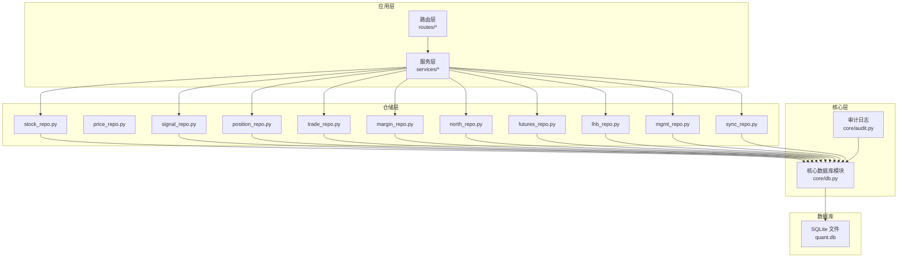
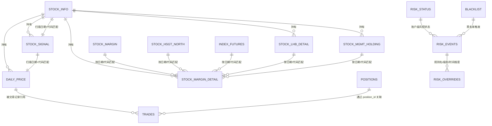
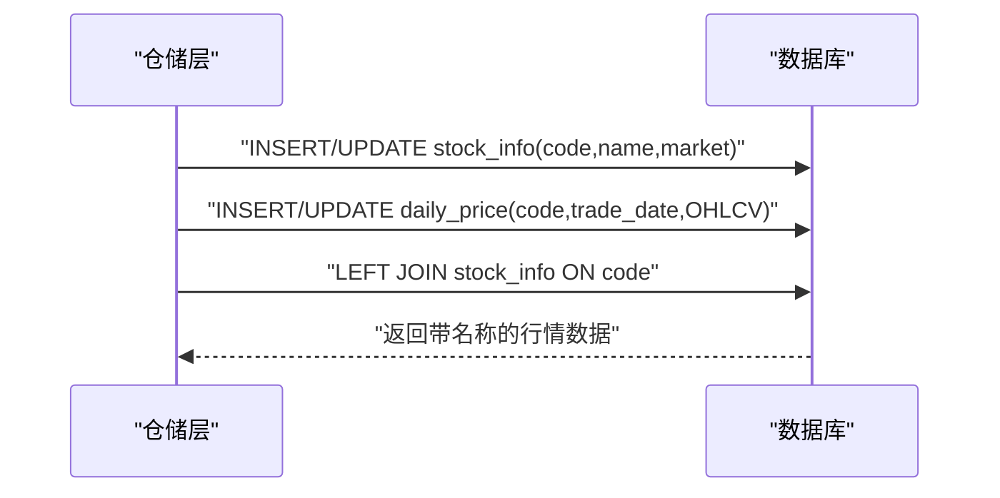
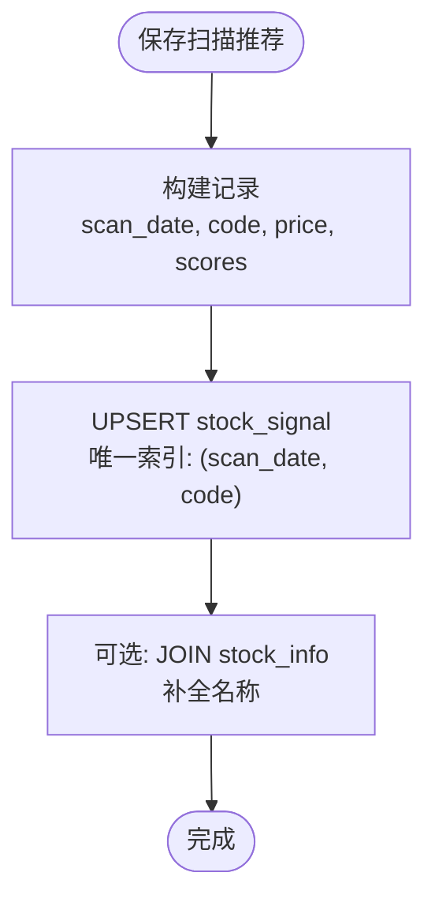
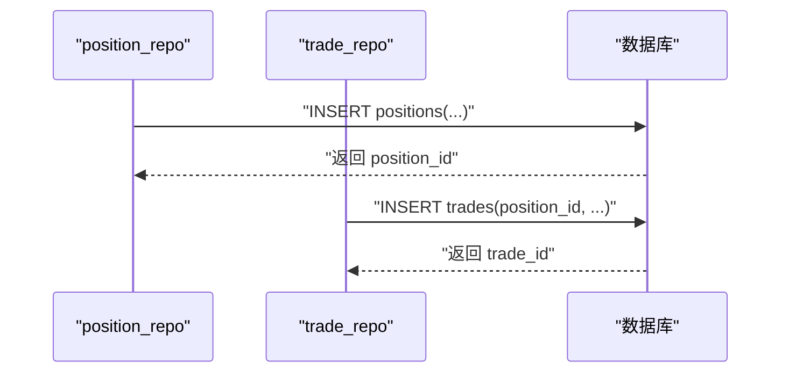
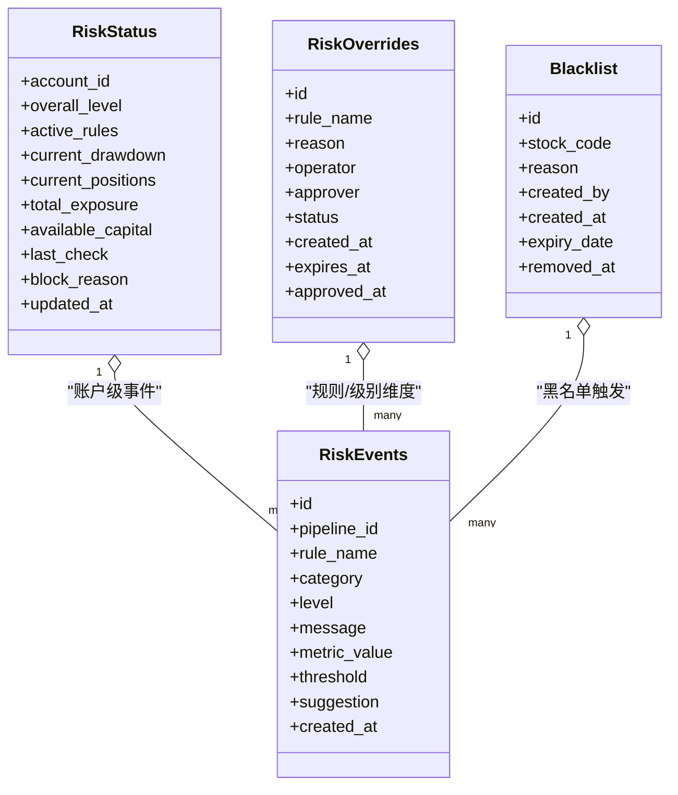
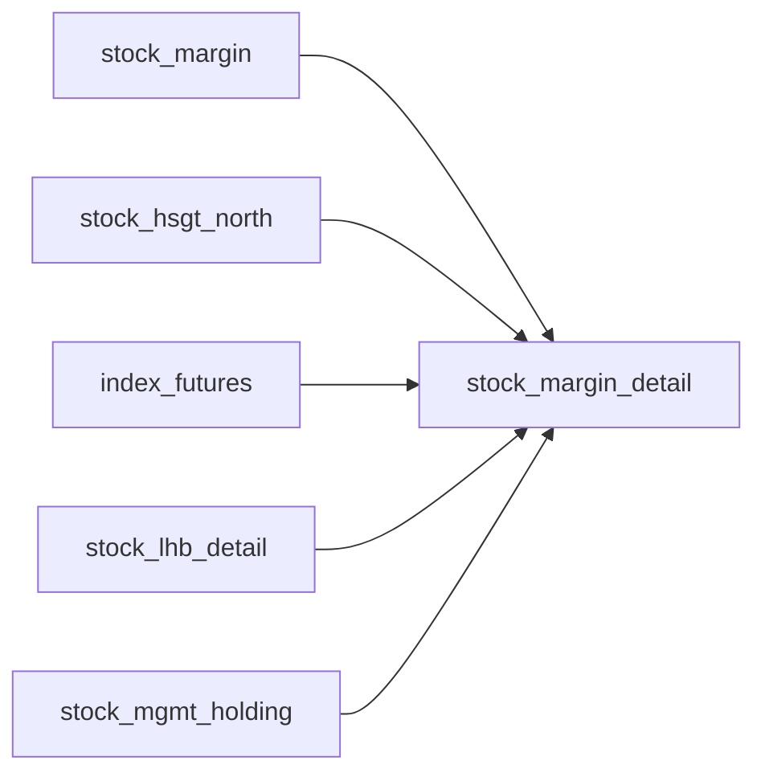
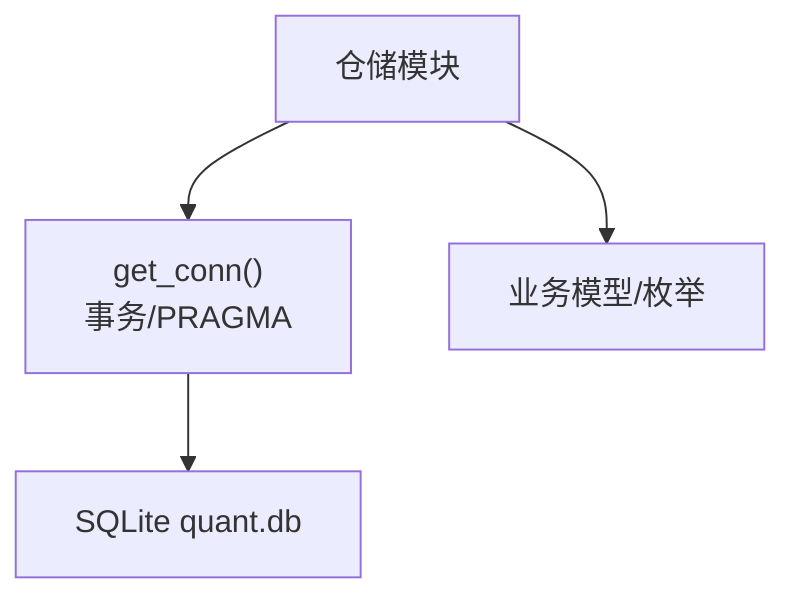

# 实体关系图

<cite>
**本文引用的文件**
- [core/db.py](file://core/db.py)
- [core/repository/stock_repo.py](file://core/repository/stock_repo.py)
- [core/repository/position_repo.py](file://core/repository/position_repo.py)
- [core/repository/trade_repo.py](file://core/repository/trade_repo.py)
- [core/repository/signal_repo.py](file://core/repository/signal_repo.py)
- [core/repository/margin_repo.py](file://core/repository/margin_repo.py)
- [core/repository/north_repo.py](file://core/repository/north_repo.py)
- [core/repository/futures_repo.py](file://core/repository/futures_repo.py)
- [core/repository/lhb_repo.py](file://core/repository/lhb_repo.py)
- [core/repository/mgmt_repo.py](file://core/repository/mgmt_repo.py)
- [core/repository/sync_repo.py](file://core/repository/sync_repo.py)
- [core/audit.py](file://core/audit.py)
- [risk/models.py](file://risk/models.py)
</cite>

## 目录
1. [简介](#简介)
2. [项目结构](#项目结构)
3. [核心组件](#核心组件)
4. [架构总览](#架构总览)
5. [详细组件分析](#详细组件分析)
6. [依赖分析](#依赖分析)
7. [性能考虑](#性能考虑)
8. [故障排查指南](#故障排查指南)
9. [结论](#结论)
10. [附录](#附录)

## 简介
本文件面向AIQuant项目的数据库实体关系，基于现有代码库中的建表语句与数据访问层实现，绘制完整的ERD图表并解释表间关联、外键约束与引用完整性设计。文档还涵盖数据流向、业务逻辑在数据库层面的体现、关系解读方法与查询优化建议，并提供系统架构理解与数据库设计的可视化参考。

## 项目结构
AIQuant采用“路由-服务-仓储-数据库”的分层架构。数据库层以SQLite为核心，通过核心模块统一初始化与迁移，再由各领域仓储模块提供面向表的操作接口。下图给出与本ERD相关的关键文件与职责映射。

**图表来源**
- [core/db.py](file://core/db.py)
- [core/audit.py](file://core/audit.py)
- [core/repository/stock_repo.py](file://core/repository/stock_repo.py)
- [core/repository/position_repo.py](file://core/repository/position_repo.py)
- [core/repository/trade_repo.py](file://core/repository/trade_repo.py)
- [core/repository/signal_repo.py](file://core/repository/signal_repo.py)
- [core/repository/margin_repo.py](file://core/repository/margin_repo.py)
- [core/repository/north_repo.py](file://core/repository/north_repo.py)
- [core/repository/futures_repo.py](file://core/repository/futures_repo.py)
- [core/repository/lhb_repo.py](file://core/repository/lhb_repo.py)
- [core/repository/mgmt_repo.py](file://core/repository/mgmt_repo.py)
- [core/repository/sync_repo.py](file://core/repository/sync_repo.py)

**章节来源**
- [core/db.py](file://core/db.py)
- [core/audit.py](file://core/audit.py)

## 核心组件
本节聚焦数据库层的建表与迁移逻辑，以及仓储层对表的封装。以下表格列出关键表及其主键/唯一约束与典型索引，作为后续ERD的基础。

- 股票基础信息：stock_info
  - 主键：code
  - 字段要点：name、market、is_active、updated_at
  - 关联：被 positions.name 与 stock_signal.name 作为补充字段使用
- 日线行情：daily_price
  - 主键：id（自增）
  - 唯一：(code, trade_date)
  - 索引：idx_daily_code_date、idx_daily_date
  - 关联：被 positions 通过 code 关联补全最新价
- 指数日线：index_daily
  - 主键：id（自增）
  - 唯一：(code, trade_date)
  - 索引：idx_index_code_date、idx_index_date
- 策略扫描推荐：stock_signal
  - 主键：id（自增）
  - 唯一：(scan_date, code)
  - 索引：idx_sig_scan_trade_code、idx_sig_trade_date
- 旧策略筛选记录：signal_records
  - 主键：id（自增）
  - 索引：idx_signal_date
- 数据同步日志：sync_log
  - 主键：id（自增）
- 持仓记录：positions
  - 主键：id（自增）
  - 索引：idx_position_code、idx_position_status
- 交易记录：trades
  - 主键：id（自增）
  - 索引：idx_trade_code、idx_trade_date
- 账户资产快照：account_snapshots
  - 主键：id（自增）
  - 索引：idx_snapshot_date
- 融资融券汇总：stock_margin
  - 主键：id（自增）
  - 唯一：trade_date
  - 索引：idx_margin_date
- 融资融券明细：stock_margin_detail
  - 主键：id（自增）
  - 唯一：(code, trade_date)
  - 索引：idx_md_code_date
- 北向资金：stock_hsgt_north
  - 主键：id（自增）
  - 唯一：trade_date
  - 索引：idx_hsgt_date
- 指数期货：index_futures
  - 主键：id（自增）
  - 唯一：(trade_date, symbol)
  - 索引：idx_if_date、idx_if_date_var
- 龙虎榜明细：stock_lhb_detail
  - 主键：id（自增）
  - 唯一：(trade_date, code)
  - 索引：idx_lhb_date、idx_lhb_code
- 高管增减持：stock_mgmt_holding
  - 主键：id（自增）
  - 唯一：(trade_date, code, changer, change_shares, avg_price)
  - 索引：idx_mh_date、idx_mh_code
- 风控事件：risk_events
  - 主键：id（自增）
  - 索引：idx_risk_events_time、idx_risk_events_level
- 风控状态：risk_status
  - 主键：account_id
- 黑名单：blacklist
  - 主键：id（自增）
  - 唯一：stock_code
  - 索引：idx_blacklist_expiry
- 风控豁免：risk_overrides
  - 主键：id（自增）
  - 索引：idx_override_status、idx_override_expires
- 审计日志：audit_log
  - 主键：id（自增）
  - 索引：idx_audit_time

**章节来源**
- [core/db.py](file://core/db.py)

## 架构总览
下图展示AIQuant数据库实体关系图（ERD），标注一对一、一对多、多对多关系及外键约束与引用完整性设计。图中所有节点均来自上述表定义与仓储调用关系。

**图表来源**
- [core/db.py](file://core/db.py)
- [core/repository/position_repo.py](file://core/repository/position_repo.py)
- [core/repository/trade_repo.py](file://core/repository/trade_repo.py)
- [core/repository/signal_repo.py](file://core/repository/signal_repo.py)
- [core/repository/margin_repo.py](file://core/repository/margin_repo.py)
- [core/repository/north_repo.py](file://core/repository/north_repo.py)
- [core/repository/futures_repo.py](file://core/repository/futures_repo.py)
- [core/repository/lhb_repo.py](file://core/repository/lhb_repo.py)
- [core/repository/mgmt_repo.py](file://core/repository/mgmt_repo.py)
- [risk/models.py](file://risk/models.py)

## 详细组件分析

### 股票与行情：stock_info ↔ daily_price
- 关系：一对一（按代码）+ 一对多（单股票多交易日）
- 约束：stock_info.code 为主键；daily_price(code, trade_date) 唯一
- 引用完整性：positions 通过 code 关联 stock_info 补全名称；查询时可左连接获取最新价
- 业务含义：stock_info 描述股票元数据；daily_price 存储逐日OHLCV与策略评分；二者共同支撑回测与信号生成

**图表来源**
- [core/db.py](file://core/db.py)
- [core/repository/stock_repo.py](file://core/repository/stock_repo.py)

**章节来源**
- [core/db.py](file://core/db.py)
- [core/repository/stock_repo.py](file://core/repository/stock_repo.py)

### 信号与行情：stock_signal ↔ daily_price / stock_info
- 关系：一对多（单扫描日期多股票）；通过 scan_date+code 唯一
- 约束：stock_signal.scan_date+code 唯一；与 daily_price(code, trade_date) 结构相似
- 引用完整性：查询时可与 stock_info 对齐名称，或与 daily_price 最新收盘价对齐
- 业务含义：stock_signal 记录每日策略扫描推荐，用于交易执行与复盘

**图表来源**
- [core/db.py](file://core/db.py)
- [core/repository/signal_repo.py](file://core/repository/signal_repo.py)

**章节来源**
- [core/db.py](file://core/db.py)
- [core/repository/signal_repo.py](file://core/repository/signal_repo.py)

### 持仓与交易：positions ↔ trades
- 关系：一对一（position_id）→ 多（同一持仓多次交易）
- 约束：trades.position_id 可为空（非必须），但通常与 positions.id 关联
- 引用完整性：查询持仓时可左连接 trades 统计成交明细
- 业务含义：positions 记录开仓信息；trades 记录每次买卖动作，形成交易流水

**图表来源**
- [core/repository/position_repo.py](file://core/repository/position_repo.py)
- [core/repository/trade_repo.py](file://core/repository/trade_repo.py)

**章节来源**
- [core/repository/position_repo.py](file://core/repository/position_repo.py)
- [core/repository/trade_repo.py](file://core/repository/trade_repo.py)

### 资金与风控：risk_events / risk_status / risk_overrides / blacklist
- 关系：risk_events 与 risk_status 为一对多（账户级状态对应多条事件）；risk_overrides 与规则/审批流程相关；blacklist 与风控事件触发相关
- 约束：risk_status.account_id 主键；risk_overrides.status/expires_at 索引
- 业务含义：记录风控检查结果、状态快照、豁免申请与黑名单管理，支撑风控引擎决策

**图表来源**
- [core/db.py](file://core/db.py)
- [risk/models.py](file://risk/models.py)

**章节来源**
- [core/db.py](file://core/db.py)
- [risk/models.py](file://risk/models.py)

### 其他主题数据：融资融券、北向资金、指数期货、龙虎榜、高管增减持
- 关系：各自表内按日期/代码唯一，便于与行情/信号对齐
- 约束：多表具有 trade_date/code 唯一索引；多数表提供按日期范围查询接口
- 业务含义：为因子工程与主题轮动策略提供数据基础

**图表来源**
- [core/db.py](file://core/db.py)
- [core/repository/margin_repo.py](file://core/repository/margin_repo.py)
- [core/repository/north_repo.py](file://core/repository/north_repo.py)
- [core/repository/futures_repo.py](file://core/repository/futures_repo.py)
- [core/repository/lhb_repo.py](file://core/repository/lhb_repo.py)
- [core/repository/mgmt_repo.py](file://core/repository/mgmt_repo.py)

**章节来源**
- [core/db.py](file://core/db.py)
- [core/repository/margin_repo.py](file://core/repository/margin_repo.py)
- [core/repository/north_repo.py](file://core/repository/north_repo.py)
- [core/repository/futures_repo.py](file://core/repository/futures_repo.py)
- [core/repository/lhb_repo.py](file://core/repository/lhb_repo.py)
- [core/repository/mgmt_repo.py](file://core/repository/mgmt_repo.py)

## 依赖分析
- 仓储层对核心数据库模块的依赖：所有仓储模块通过 _get_conn() 使用 core.db.get_conn() 获取连接，保证事务、超时与PRAGMA设置一致
- 业务依赖：positions 依赖 daily_price 的最新收盘价进行浮盈浮亏计算；stock_signal 依赖 stock_info 的名称字段
- 外键约束：SQLite 默认不强制外键约束，项目通过唯一索引与业务逻辑保障引用完整性；如需强约束，可在迁移脚本中启用 PRAGMA foreign_keys=ON 并显式声明外键

**图表来源**
- [core/db.py](file://core/db.py)
- [core/audit.py](file://core/audit.py)
- [risk/models.py](file://risk/models.py)

**章节来源**
- [core/db.py](file://core/db.py)
- [core/audit.py](file://core/audit.py)
- [risk/models.py](file://risk/models.py)

## 性能考虑
- 唯一索引与冲突处理
  - daily_price(code, trade_date)、stock_signal(scan_date, code)、stock_margin_detail(code, trade_date) 等唯一索引避免重复写入，配合 UPSERT/ON CONFLICT 提升吞吐
- 查询路径优化
  - 按日期范围查询时优先使用日期索引（如 idx_daily_date、idx_sig_trade_date、idx_snapshot_date 等）
  - 聚合统计（如 get_position_summary）尽量利用子查询与 LEFT JOIN，减少跨表扫描
- 写入路径优化
  - 批量写入使用 executemany + PRAGMA foreign_keys=OFF（在明确无外键约束影响时）可显著降低开销
  - 分批更新策略评分（update_strategy_scores_batch）避免大事务锁竞争
- 连接与并发
  - WAL 模式与 NORMAL 同步参数已在连接层启用，提升并发写入能力

**章节来源**
- [core/db.py](file://core/db.py)

## 故障排查指南
- 常见问题
  - 数据重复：确认唯一索引是否存在冲突；检查 UPSERT 逻辑是否正确
  - 查询慢：核对是否命中索引；避免在 WHERE 子句中对列进行函数转换
  - 事务异常：检查 try/except/finally 是否正确提交/回滚
- 审计与追踪
  - 使用审计日志接口记录关键操作（如交易、风控豁免），便于问题定位
- 数据一致性
  - 若启用外键约束，注意删除/更新顺序；否则通过唯一索引与业务校验保障一致性

**章节来源**
- [core/audit.py](file://core/audit.py)
- [core/db.py](file://core/db.py)

## 结论
本ERD基于AIQuant现有数据库建模与仓储实现，清晰展示了股票、行情、信号、持仓、交易、风控与主题数据之间的关系。通过唯一索引与业务逻辑保障引用完整性，结合合理的索引与批量写入策略，系统在中小规模数据下具备良好的性能与可维护性。若未来扩展至更大体量，建议评估外键约束与分区策略，并引入更完善的指标监控与审计体系。

## 附录
- 关系解读方法
  - 实线箭头表示“被引用”方向；虚线表示“可选关联”
  - 主键字段以 PK 标注；唯一索引字段以 UK 标注；索引字段以 IDX 标注
- 查询优化建议
  - 优先使用复合索引覆盖查询条件
  - 避免 SELECT *，仅选择必要列
  - 对日期范围查询使用索引列，避免在 WHERE 中对列应用函数
  - 批量写入时关闭外键检查（在无外键约束前提下）