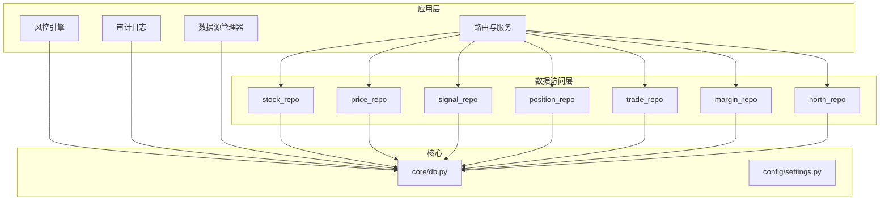
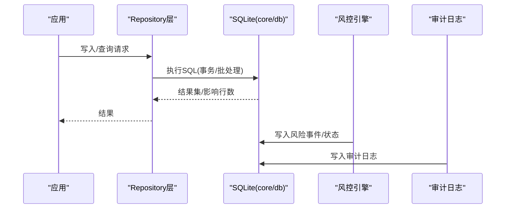
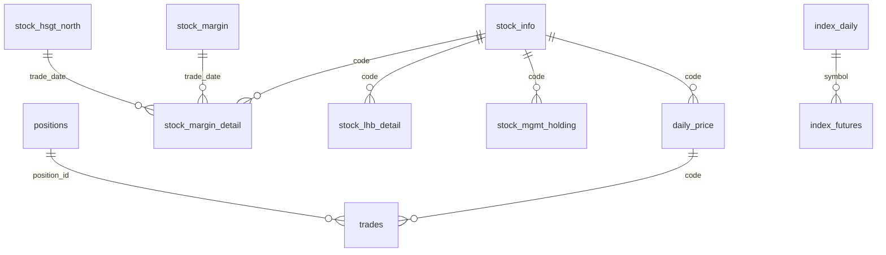
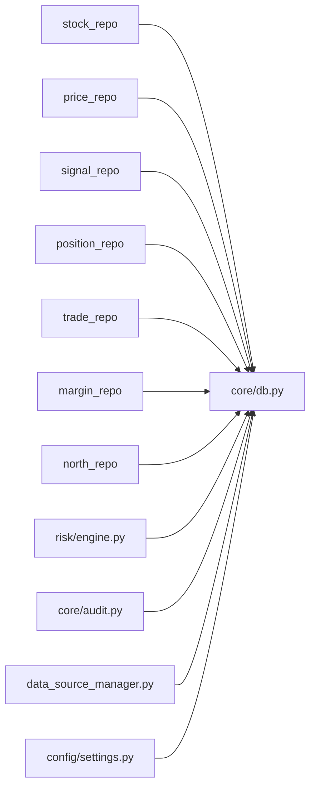

# 数据库设计

<cite>
**本文引用的文件**
- [core/db.py](file://core/db.py)
- [config/settings.py](file://config/settings.py)
- [core/repository/__init__.py](file://core/repository/__init__.py)
- [core/repository/stock_repo.py](file://core/repository/stock_repo.py)
- [core/repository/price_repo.py](file://core/repository/price_repo.py)
- [core/repository/signal_repo.py](file://core/repository/signal_repo.py)
- [core/repository/position_repo.py](file://core/repository/position_repo.py)
- [core/repository/trade_repo.py](file://core/repository/trade_repo.py)
- [core/repository/margin_repo.py](file://core/repository/margin_repo.py)
- [core/repository/north_repo.py](file://core/repository/north_repo.py)
- [core/audit.py](file://core/audit.py)
- [risk/engine.py](file://risk/engine.py)
- [ministries/rites/data_source_manager.py](file://ministries/rites/data_source_manager.py)
</cite>

## 目录
1. [简介](#简介)
2. [项目结构](#项目结构)
3. [核心组件](#核心组件)
4. [架构总览](#架构总览)
5. [详细组件分析](#详细组件分析)
6. [依赖分析](#依赖分析)
7. [性能考虑](#性能考虑)
8. [故障排查指南](#故障排查指南)
9. [结论](#结论)
10. [附录](#附录)

## 简介
本文件面向AIQuant项目的数据库设计，基于本地SQLite存储，覆盖表结构、字段定义、主键/索引/约束、实体关系、数据访问模式、缓存策略、性能优化、数据生命周期与归档、迁移与版本管理、安全与访问控制、以及DBA运维要点。内容以仓库中的数据库初始化脚本与各Repository层实现为依据，确保可追溯与可落地。

## 项目结构
数据库位于本地文件系统，由核心模块负责初始化、连接管理与迁移；数据访问层按表拆分，封装CRUD与常用查询；风控、审计、数据源管理等模块与数据库交互形成闭环。

图表来源
- [core/db.py](file://core/db.py)
- [config/settings.py](file://config/settings.py)
- [core/repository/stock_repo.py](file://core/repository/stock_repo.py)
- [core/repository/price_repo.py](file://core/repository/price_repo.py)
- [core/repository/signal_repo.py](file://core/repository/signal_repo.py)
- [core/repository/position_repo.py](file://core/repository/position_repo.py)
- [core/repository/trade_repo.py](file://core/repository/trade_repo.py)
- [core/repository/margin_repo.py](file://core/repository/margin_repo.py)
- [core/repository/north_repo.py](file://core/repository/north_repo.py)
- [core/audit.py](file://core/audit.py)
- [risk/engine.py](file://risk/engine.py)
- [ministries/rites/data_source_manager.py](file://ministries/rites/data_source_manager.py)

章节来源
- [core/db.py](file://core/db.py)
- [config/settings.py](file://config/settings.py)
- [core/repository/__init__.py](file://core/repository/__init__.py)

## 核心组件
- 连接与初始化：提供SQLite连接上下文、WAL模式、同步级别、行工厂、建表脚本与迁移逻辑。
- 数据访问层：按表拆分的Repository，封装批量写入、Upsert、查询与统计。
- 风控与审计：风控事件与状态写入数据库；审计日志记录与查询。
- 数据源管理：统一数据源接口，本地数据源直连数据库。

章节来源
- [core/db.py](file://core/db.py)
- [core/repository/stock_repo.py](file://core/repository/stock_repo.py)
- [core/repository/price_repo.py](file://core/repository/price_repo.py)
- [core/repository/signal_repo.py](file://core/repository/signal_repo.py)
- [core/repository/position_repo.py](file://core/repository/position_repo.py)
- [core/repository/trade_repo.py](file://core/repository/trade_repo.py)
- [core/repository/margin_repo.py](file://core/repository/margin_repo.py)
- [core/repository/north_repo.py](file://core/repository/north_repo.py)
- [core/audit.py](file://core/audit.py)
- [risk/engine.py](file://risk/engine.py)
- [ministries/rites/data_source_manager.py](file://ministries/rites/data_source_manager.py)

## 架构总览
数据库采用“本地SQLite + Repository分层 + 应用侧集成”的轻量架构。初始化时一次性创建全部表与索引，并提供安全的列扩展与索引补建逻辑。应用通过Repository层进行数据读写，风控与审计模块直接写入专用表，数据源管理器在需要时回退到本地数据库。

图表来源
- [core/db.py](file://core/db.py)
- [risk/engine.py](file://risk/engine.py)
- [core/audit.py](file://core/audit.py)

## 详细组件分析

### 表结构与字段定义
以下为数据库中定义的核心表及关键字段说明（字段类型与约束均来自建表脚本）。为避免冗长，此处给出字段清单与约束说明，不展示具体SQL。

- stock_info（股票基础信息）
  - 字段：code（主键）、name、market、is_active、updated_at
  - 约束：code为主键；新增市值字段total_shares、circ_shares（迁移补充）

- daily_price（日线行情与策略评分）
  - 字段：id（主键自增）、code、trade_date、open、high、low、close、volume、amount、pct_change、turnover、vol_score、ma_score、diverge_score、bottom_score、whale_score、fusion_score、strategy_score、strategy_signal
  - 约束：code+trade_date唯一；索引idx_daily_code_date、idx_daily_date

- index_daily（指数日线）
  - 字段：id（主键自增）、code、trade_date、open、high、low、close、volume、amount、pct_change
  - 约束：code+trade_date唯一；索引idx_index_code_date、idx_index_date

- stock_signal（策略扫描推荐）
  - 字段：id（主键自增）、scan_date、trade_date、code、name、price、fusion_score、vol_score、ma_score、diverge_score、bottom_score、whale_score、trigger_list、buy_price、stop_loss、take_profit、buy_volume、buy_money、sent_wechat、created_at
  - 约束：scan_date+code唯一；索引idx_sig_scan_trade_code、idx_sig_trade_date

- signal_records（历史扫描记录，兼容）
  - 字段：id（主键自增）、scan_time、trade_date、code、name、price、score、stop_loss、take_profit、buy_volume、buy_money、sent_wechat、note
  - 约束：无显式PK，索引idx_signal_date

- sync_log（数据同步日志）
  - 字段：id（主键自增）、sync_time、sync_type、total、success、failed、duration_s、note

- positions（持仓记录）
  - 字段：id（主键自增）、code、name、entry_date、entry_price、shares、current_price、stop_loss、take_profit、position_type、status、strategy、note、created_at、updated_at、commission
  - 约束：索引idx_position_code、idx_position_status

- trades（交易记录）
  - 字段：id（主键自增）、position_id、code、name、trade_date、direction、price、shares、amount、commission、slippage、reason、note、created_at
  - 约束：索引idx_trade_code、idx_trade_date

- account_snapshots（账户资产快照）
  - 字段：id（主键自增）、snapshot_date、total_assets、cash、position_value、positions_count、total_cost、total_pnl、pnl_pct、created_at
  - 约束：索引idx_snapshot_date

- stock_margin（融资融券汇总）
  - 字段：id（主键自增）、trade_date、sse_margin_balance、sse_margin_buy、sse_short_balance、sse_short_volume、szse_margin_balance、szse_margin_buy、szse_short_balance、szse_short_volume、szse_margin_ratio、total_margin_balance、total_margin_buy、total_short_balance、total_margin
  - 约束：trade_date唯一；索引idx_margin_date

- stock_margin_detail（融资融券明细）
  - 字段：id（主键自增）、code、trade_date、name、exchange、margin_balance、margin_buy、margin_repay、short_volume、short_sell、short_repay、short_balance、total_balance
  - 约束：code+trade_date唯一；索引idx_md_code_date

- stock_hsgt_north（北向资金）
  - 字段：id（主键自增）、trade_date、north_net_buy、north_buy_amt、north_sell_amt、north_cum_net、north_daily_flow、north_balance、north_market_cap、hgt_net_buy、hgt_buy_amt、hgt_sell_amt、hgt_cum_net、hgt_daily_flow、sgt_net_buy、sgt_buy_amt、sgt_sell_amt、sgt_cum_net、sgt_daily_flow
  - 约束：trade_date唯一；索引idx_hsgt_date

- index_futures（指数期货）
  - 字段：id（主键自增）、trade_date、symbol、variety、open、high、low、close、volume、open_interest、turnover、settle、pre_settle
  - 约束：trade_date+symbol唯一；索引idx_if_date、idx_if_date_var

- stock_lhb_detail（龙虎榜明细）
  - 字段：id（主键自增）、trade_date、code、name、close_price、pct_change、net_buy、buy_amt、sell_amt、total_amt、mkt_total_amt、net_buy_ratio、turnover_rate、float_mkt_cap、reason、perf_1d、perf_2d、perf_5d、perf_10d
  - 约束：trade_date+code唯一；索引idx_lhb_date、idx_lhb_code

- stock_mgmt_holding（高管增减持）
  - 字段：id（主键自增）、trade_date、code、name、changer、change_shares、avg_price、change_amount、change_reason、change_ratio、shares_after、share_type、executive_name、position、relation
  - 约束：多字段组合唯一；索引idx_mh_date、idx_mh_code

- risk_events（风控事件）
  - 字段：id（主键自增）、pipeline_id、rule_name、category、level、message、metric_value、threshold、suggestion、created_at
  - 约束：索引idx_risk_events_time、idx_risk_events_level

- risk_status（风控状态快照）
  - 字段：account_id（主键）、overall_level、active_rules、current_drawdown、current_positions、total_exposure、available_capital、last_check、block_reason、updated_at

- blacklist（黑名单）
  - 字段：id（主键自增）、stock_code、reason、created_by、created_at、expiry_date、removed_at
  - 约束：stock_code唯一；索引idx_blacklist_expiry

- risk_overrides（风控豁免）
  - 字段：id（主键自增）、rule_name、reason、operator、approver、status、created_at、expires_at、approved_at
  - 约束：索引idx_override_status、idx_override_expires

- audit_log（审计日志）
  - 字段：id（主键自增）、user_id、action、resource、detail、ip_address、created_at
  - 约束：索引idx_audit_time

章节来源
- [core/db.py](file://core/db.py)

### 实体关系图

图表来源
- [core/db.py](file://core/db.py)

### 数据访问模式与缓存策略
- 连接管理：使用上下文管理器，启用WAL与NORMAL同步，Row工厂，自动提交/回滚与关闭。
- 批量写入：Repository层普遍采用executemany与ON CONFLICT DO UPDATE，减少往返开销。
- 缓存策略：未见应用层缓存实现；建议对热点查询（如最新日期、账户快照）在应用层做短期缓存，结合数据库索引与分区策略。
- 事务边界：Repository层单次操作通常在单事务内完成；跨表一致性操作建议在上层编排事务。

章节来源
- [core/db.py](file://core/db.py)
- [core/repository/price_repo.py](file://core/repository/price_repo.py)
- [core/repository/trade_repo.py](file://core/repository/trade_repo.py)

### 数据验证与业务规则
- 数据清洗：Repository层对数值字段进行空值/格式清理，避免脏数据入库。
- 唯一性约束：多表通过UNIQUE或复合主键保证唯一性，如daily_price(code, trade_date)、stock_signal(scan_date, code)、stock_margin_detail(code, trade_date)等。
- 约束与默认值：如positions.status默认值、stock_info.is_active默认值、risk_status.account_id主键等。
- 业务规则落地：风控事件与状态写入专用表，审计日志统一记录，便于合规与追踪。

章节来源
- [core/repository/price_repo.py](file://core/repository/price_repo.py)
- [core/repository/margin_repo.py](file://core/repository/margin_repo.py)
- [core/repository/north_repo.py](file://core/repository/north_repo.py)
- [risk/engine.py](file://risk/engine.py)
- [core/audit.py](file://core/audit.py)

### 数据生命周期、保留策略与归档
- 生命周期：日线与指数日线数据作为核心资产长期保留；风控事件与审计日志按业务需求定期清理。
- 保留策略：未在代码中定义明确的TTL策略；建议结合业务设定滚动窗口（如仅保留N年日线数据）。
- 归档规则：未见归档实现；建议对历史冷数据导出至离线存储或压缩归档，同时保留索引与元数据以便检索。

章节来源
- [core/db.py](file://core/db.py)

### 数据迁移路径与版本管理
- 迁移策略：init_db中一次性建表与索引；通过_safe_add_column安全地为现有表增加列；对唯一索引进行修正与补建。
- 版本管理：未见显式的schema版本号；建议引入版本表或注释标记，配合迁移脚本进行演进。

章节来源
- [core/db.py](file://core/db.py)

### 数据安全、隐私与访问控制
- 访问控制：未见数据库级权限控制；建议限制文件系统权限，仅允许运行用户访问DB文件。
- 审计与合规：审计日志统一记录操作者、时间、资源与结果，支持事后追溯。
- 隐私保护：未见敏感字段加密；建议对审计日志中的IP等信息进行脱敏处理。

章节来源
- [core/audit.py](file://core/audit.py)

### 查询性能与索引设计
- 索引策略：围绕高频查询建立复合索引与单列索引，如按code+date查询的日线表、按日期查询的指数表、按状态过滤的持仓表等。
- 查询优化：使用参数化查询与LIMIT限制结果集；对大数据量表建议分页与范围查询。
- 索引维护：迁移阶段对缺失索引进行补建，确保查询效率。

章节来源
- [core/db.py](file://core/db.py)

## 依赖分析
- Repository层依赖core/db.py提供的连接与SQL能力。
- 风控与审计模块直接依赖数据库写入。
- 数据源管理器在本地模式下依赖core/db.py的查询能力。
- 配置模块提供DB路径等基础参数。

图表来源
- [core/db.py](file://core/db.py)
- [config/settings.py](file://config/settings.py)
- [core/repository/stock_repo.py](file://core/repository/stock_repo.py)
- [core/repository/price_repo.py](file://core/repository/price_repo.py)
- [core/repository/signal_repo.py](file://core/repository/signal_repo.py)
- [core/repository/position_repo.py](file://core/repository/position_repo.py)
- [core/repository/trade_repo.py](file://core/repository/trade_repo.py)
- [core/repository/margin_repo.py](file://core/repository/margin_repo.py)
- [core/repository/north_repo.py](file://core/repository/north_repo.py)
- [risk/engine.py](file://risk/engine.py)
- [core/audit.py](file://core/audit.py)
- [ministries/rites/data_source_manager.py](file://ministries/rites/data_source_manager.py)

## 性能考虑
- 存储引擎：SQLite WAL模式提升并发写入；NORMAL同步在性能与可靠性间折中。
- 批量写入：使用executemany与UPSERT减少网络往返。
- 索引选择：针对高频过滤与排序字段建立索引；避免过度索引导致写入成本上升。
- 查询限制：对大结果集使用LIMIT与分页；尽量缩小查询范围。
- 统计与监控：通过db_stats输出数据库规模与时间范围，辅助容量规划。

章节来源
- [core/db.py](file://core/db.py)

## 故障排查指南
- 初始化失败：确认DB路径存在且可写；检查建表语句语法。
- 迁移异常：关注_safe_add_column与索引补建过程中的异常；必要时手动执行修复。
- 查询慢：核对WHERE与ORDER BY是否命中索引；避免SELECT *；使用LIMIT。
- 写入冲突：确认ON CONFLICT策略是否符合预期；检查UNIQUE约束。
- 审计与风控：核对审计日志与风控事件表写入是否成功；检查时间戳与状态字段。

章节来源
- [core/db.py](file://core/db.py)
- [core/audit.py](file://core/audit.py)
- [risk/engine.py](file://risk/engine.py)

## 结论
该数据库设计以SQLite为核心，采用Repository分层与一次性建表/迁移策略，满足日线、指数、风控、审计等多场景需求。建议后续完善版本管理、TTL与归档策略、应用层缓存与索引治理，并加强安全与访问控制，以支撑更大规模与更复杂业务的发展。

## 附录
- 示例数据：未在代码中提供；建议通过Repository层的批量写入函数导入测试数据。
- 配置项：DB_PATH、API_HOST、API_PORT、定时任务时间等由配置模块提供。

章节来源
- [config/settings.py](file://config/settings.py)