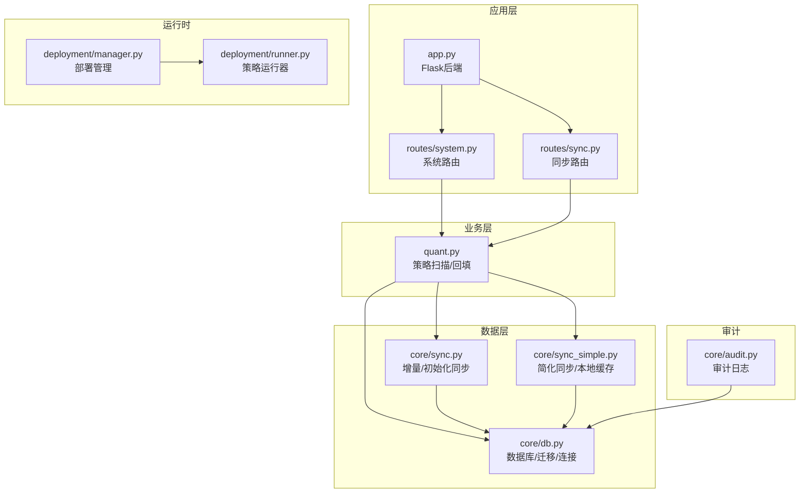
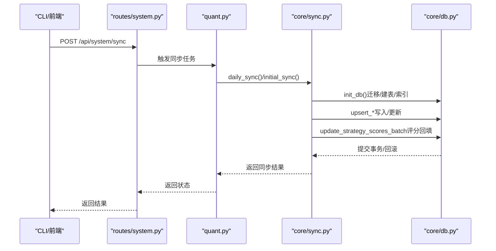
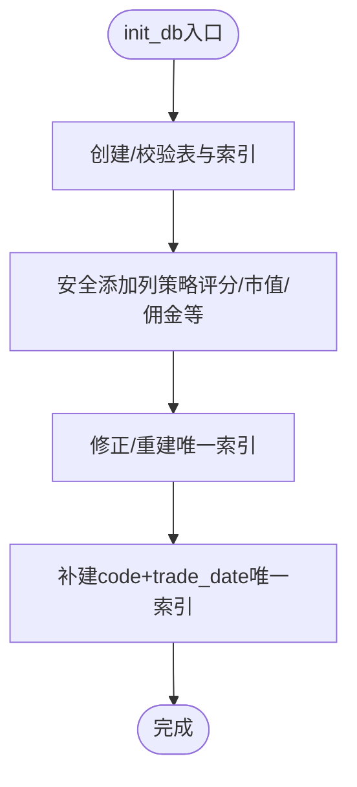
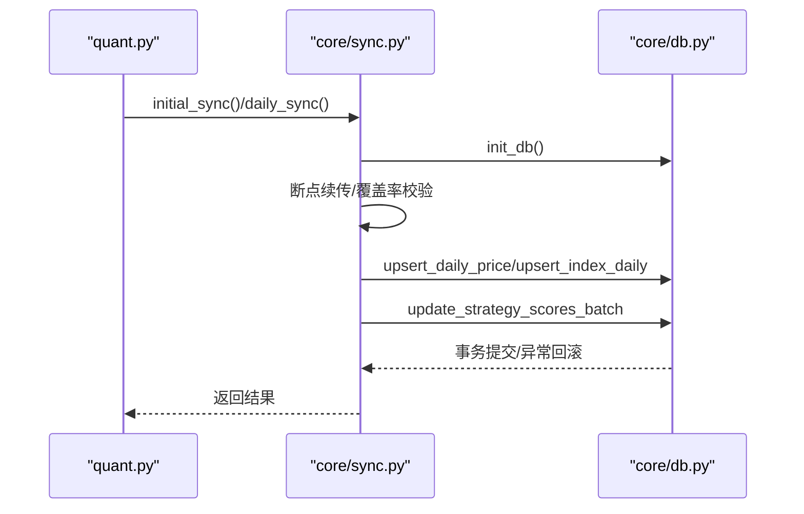
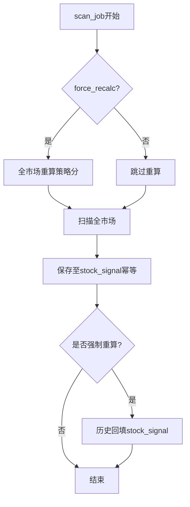
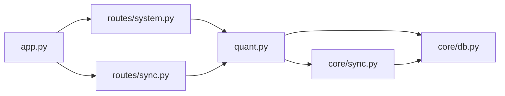

# 数据迁移

<cite>
**本文引用的文件**
- [core/db.py](file://core/db.py)
- [core/sync.py](file://core/sync.py)
- [core/sync_simple.py](file://core/sync_simple.py)
- [quant.py](file://quant.py)
- [routes/system.py](file://routes/system.py)
- [routes/sync.py](file://routes/sync.py)
- [app.py](file://app.py)
- [deployment/manager.py](file://deployment/manager.py)
- [deployment/runner.py](file://deployment/runner.py)
- [core/audit.py](file://core/audit.py)
</cite>

## 目录
1. [简介](#简介)
2. [项目结构](#项目结构)
3. [核心组件](#核心组件)
4. [架构总览](#架构总览)
5. [详细组件分析](#详细组件分析)
6. [依赖分析](#依赖分析)
7. [性能考虑](#性能考虑)
8. [故障排查指南](#故障排查指南)
9. [结论](#结论)
10. [附录](#附录)

## 简介
本文件面向AIQuant系统，聚焦“数据迁移”主题，系统化阐述数据库版本升级与表结构变更的处理策略、安全添加列的方法与兼容性保障、数据迁移脚本的执行流程与回滚机制、表结构演进的最佳实践与注意事项，并给出迁移过程中的数据备份与恢复策略，以及面对不兼容数据库版本与迁移失败时的处置建议。目标是为系统维护与升级提供可靠、可追溯、可回滚的数据迁移指导。

## 项目结构
AIQuant采用“本地SQLite + Python模块化”的轻量架构。数据迁移与同步主要集中在以下模块：
- 数据库与迁移：core/db.py
- 数据同步与迁移：core/sync.py、core/sync_simple.py
- 策略扫描与回填：quant.py
- API路由与触发：routes/system.py、routes/sync.py
- 应用入口与监控：app.py
- 策略部署与运行：deployment/manager.py、deployment/runner.py
- 审计日志：core/audit.py

图表来源
- [app.py:148-164](file://app.py#L148-L164)
- [routes/system.py:12-44](file://routes/system.py#L12-L44)
- [routes/sync.py:23-140](file://routes/sync.py#L23-L140)
- [quant.py:549-589](file://quant.py#L549-L589)
- [core/db.py:57-466](file://core/db.py#L57-L466)
- [core/sync.py:319-390](file://core/sync.py#L319-L390)
- [core/sync_simple.py:24-91](file://core/sync_simple.py#L24-L91)
- [deployment/manager.py:24-129](file://deployment/manager.py#L24-L129)
- [deployment/runner.py:44-110](file://deployment/runner.py#L44-L110)
- [core/audit.py:16-39](file://core/audit.py#L16-L39)

章节来源
- [app.py:148-164](file://app.py#L148-L164)
- [routes/system.py:12-44](file://routes/system.py#L12-L44)
- [routes/sync.py:23-140](file://routes/sync.py#L23-L140)
- [quant.py:549-589](file://quant.py#L549-L589)
- [core/db.py:57-466](file://core/db.py#L57-L466)
- [core/sync.py:319-390](file://core/sync.py#L319-L390)
- [core/sync_simple.py:24-91](file://core/sync_simple.py#L24-L91)
- [deployment/manager.py:24-129](file://deployment/manager.py#L24-L129)
- [deployment/runner.py:44-110](file://deployment/runner.py#L44-L110)
- [core/audit.py:16-39](file://core/audit.py#L16-L39)

## 核心组件
- 数据库初始化与迁移：负责首次建表、安全添加列、索引修正与补充、历史数据迁移与兼容性处理。
- 数据同步与迁移：负责全量初始化与增量同步，断点续传、覆盖率校验、策略评分回填。
- 策略扫描与回填：负责扫描命中结果写入stock_signal，支持历史回填与幂等写入。
- API触发与状态：提供系统同步/扫描接口，状态查询与调度启停。
- 审计日志：记录关键操作，便于追踪迁移与同步行为。

章节来源
- [core/db.py:57-466](file://core/db.py#L57-L466)
- [core/sync.py:319-390](file://core/sync.py#L319-L390)
- [quant.py:344-431](file://quant.py#L344-L431)
- [routes/system.py:12-44](file://routes/system.py#L12-L44)
- [core/audit.py:16-39](file://core/audit.py#L16-L39)

## 架构总览
AIQuant的数据迁移与同步遵循“先迁移/兼容，再写入”的原则。系统通过init_db集中处理表结构与列的兼容性，随后在同步流程中进行数据迁移与评分回填，最后通过审计日志与状态接口提供可观测性。

图表来源
- [routes/system.py:12-44](file://routes/system.py#L12-L44)
- [quant.py:549-589](file://quant.py#L549-L589)
- [core/sync.py:319-390](file://core/sync.py#L319-L390)
- [core/db.py:57-466](file://core/db.py#L57-L466)

## 详细组件分析

### 数据库初始化与迁移（core/db.py）
- 建表与索引：使用executescript一次性创建所有表与索引，确保幂等与一致性。
- 安全添加列：通过_safe_add_column封装，捕获OperationalError以跳过“列已存在”错误，实现向后兼容。
- 迁移步骤：
  - 为daily_price补充策略评分列与信号列。
  - 为positions补充commission列。
  - 为stock_info补充市值相关列。
  - 修正stock_signal唯一索引，确保扫描维度正确。
  - 补建唯一索引，保证code+trade_date组合唯一性。
- 连接管理：使用上下文管理器，自动commit/rollback，确保事务一致性。

图表来源
- [core/db.py:57-466](file://core/db.py#L57-L466)

章节来源
- [core/db.py:45-50](file://core/db.py#L45-L50)
- [core/db.py:57-466](file://core/db.py#L57-L466)

### 数据同步与迁移（core/sync.py）
- 初始化同步（initial_sync）：首次拉取历史数据，支持断点续传与进度打印，完成后记录同步日志。
- 增量同步（daily_sync）：单线程拉取当日数据，基于覆盖率阈值动态确定起止日期，支持缓存与断点续传。
- 策略评分回填（sync_strategy_score/update_strategy_scores_batch）：对历史全量计算并写入策略评分，支持批量更新。
- 指数数据同步：同步主要指数到index_daily表，供大盘择时使用。
- 过滤规则：跳过ST、退市、北交所等不支持或不适用的股票。

图表来源
- [core/sync.py:319-390](file://core/sync.py#L319-L390)
- [core/sync.py:462-668](file://core/sync.py#L462-L668)
- [core/sync.py:675-702](file://core/sync.py#L675-L702)
- [core/db.py:57-466](file://core/db.py#L57-L466)

章节来源
- [core/sync.py:319-390](file://core/sync.py#L319-L390)
- [core/sync.py:462-668](file://core/sync.py#L462-L668)
- [core/sync.py:675-702](file://core/sync.py#L675-L702)

### 策略扫描与回填（quant.py）
- 扫描任务（scan_job）：支持v4超跌反弹与5策略融合两种模式，可选择强制重算策略分。
- 历史回填（_backfill_stock_signal_progress）：将历史中融合分达到阈值的日期写入stock_signal，使用INSERT OR REPLACE实现幂等。
- stock_signal写入：包含触发策略列表、买卖金额与止盈止损等字段，便于面板展示与回测。

图表来源
- [quant.py:433-495](file://quant.py#L433-L495)
- [quant.py:344-431](file://quant.py#L344-L431)

章节来源
- [quant.py:433-495](file://quant.py#L433-L495)
- [quant.py:344-431](file://quant.py#L344-L431)

### API触发与状态（routes/system.py、routes/sync.py）
- 系统同步/扫描接口：提供POST触发，内部通过线程异步执行，避免阻塞。
- 状态查询：返回同步/扫描运行状态、最近时间与结果。
- 历史评分补算接口：对全市场历史评分进行补算并回填stock_signal。

章节来源
- [routes/system.py:12-44](file://routes/system.py#L12-L44)
- [routes/system.py:46-63](file://routes/system.py#L46-L63)
- [routes/system.py:85-152](file://routes/system.py#L85-L152)
- [routes/sync.py:23-140](file://routes/sync.py#L23-L140)

### 审计日志（core/audit.py）
- 统一日志记录：提供装饰器与API调用记录，包含操作类型、资源、详情、IP与结果。
- 查询接口：支持按action与user_id过滤，分页查询。

章节来源
- [core/audit.py:16-39](file://core/audit.py#L16-L39)
- [core/audit.py:107-147](file://core/audit.py#L107-L147)

## 依赖分析
- 模块耦合：
  - routes/system.py与routes/sync.py依赖quant.py的任务调度与执行。
  - quant.py依赖core/sync.py进行数据同步，依赖core/db.py进行数据库操作。
  - core/sync.py依赖core/db.py进行建表/迁移与数据写入。
  - deployment/manager.py与deployment/runner.py与策略运行相关，与数据迁移无直接耦合。
- 外部依赖：
  - SQLite（本地文件数据库）。
  - 第三方数据源（akshare/baostock），用于行情与指数数据。
- 潜在循环依赖：未发现直接循环依赖，模块职责清晰。

图表来源
- [routes/system.py:12-44](file://routes/system.py#L12-L44)
- [routes/sync.py:23-140](file://routes/sync.py#L23-L140)
- [quant.py:549-589](file://quant.py#L549-L589)
- [core/sync.py:319-390](file://core/sync.py#L319-L390)
- [core/db.py:57-466](file://core/db.py#L57-L466)
- [app.py:148-164](file://app.py#L148-L164)

章节来源
- [routes/system.py:12-44](file://routes/system.py#L12-L44)
- [routes/sync.py:23-140](file://routes/sync.py#L23-L140)
- [quant.py:549-589](file://quant.py#L549-L589)
- [core/sync.py:319-390](file://core/sync.py#L319-L390)
- [core/db.py:57-466](file://core/db.py#L57-L466)
- [app.py:148-164](file://app.py#L148-L164)

## 性能考虑
- SQLite WAL模式与NORMAL同步：在并发与可靠性之间取得平衡，适合本地轻量场景。
- 批量写入与事务：upsert_*与update_strategy_scores_batch使用executemany与显式事务，减少往返开销。
- 断点续传与缓存：同步模块内置缓存文件与进度记录，避免重复拉取。
- 线程与锁：策略运行器使用线程与锁保护状态，避免竞态。
- 建议：
  - 大规模回填时分批处理，避免长时间持有锁。
  - 合理设置索引，避免全表扫描。
  - 在高并发场景评估是否迁移到更高性能的数据库。

[本节为通用建议，无需特定文件引用]

## 故障排查指南
- 迁移失败（列已存在/索引冲突）：
  - 现象：OperationalError或索引重复。
  - 处理：_safe_add_column与索引修正逻辑已捕获异常并跳过；确认init_db执行顺序与异常日志。
- 同步中断/数据缺失：
  - 检查断点缓存文件是否存在，确认缓存目录权限。
  - 校验覆盖率阈值与交易日判断逻辑，必要时降低阈值。
- 策略评分未回填：
  - 确认update_strategy_scores_batch调用链与最小历史长度要求。
  - 使用历史评分补算接口进行全量回填。
- 审计与可观测性：
  - 通过审计日志定位异常操作与异常堆栈。
  - 通过系统状态接口确认同步/扫描状态。

章节来源
- [core/db.py:45-50](file://core/db.py#L45-L50)
- [core/sync.py:462-668](file://core/sync.py#L462-L668)
- [routes/sync.py:23-140](file://routes/sync.py#L23-L140)
- [core/audit.py:16-39](file://core/audit.py#L16-L39)

## 结论
AIQuant通过“集中迁移+幂等写入+断点续传+审计日志”的设计，在SQLite本地环境下实现了稳健的数据迁移与同步。核心策略包括：使用_safe_add_column与索引修正保障兼容性；在init_db中集中处理表结构；在同步流程中进行数据迁移与评分回填；通过API与状态接口提供可控的触发与观测。对于不兼容版本与失败场景，系统具备异常捕获、缓存断点与审计追踪能力，可有效支撑维护与升级。

[本节为总结，无需特定文件引用]

## 附录

### 数据迁移最佳实践与注意事项
- 设计阶段
  - 明确版本号与迁移清单，确保幂等与可逆。
  - 优先使用ALTER TABLE ADD COLUMN与CREATE INDEX IF NOT EXISTS。
- 迁移执行
  - 在init_db中集中执行，避免分散逻辑。
  - 对于大数据量回填，采用分批与事务包裹，避免长事务锁表。
  - 使用INSERT OR REPLACE/ON CONFLICT实现幂等写入。
- 兼容性
  - 通过异常捕获跳过已存在对象，避免重复执行失败。
  - 为关键表建立唯一索引，防止重复数据。
- 备份与回滚
  - 迁移前备份数据库文件；失败时回滚到备份。
  - 使用审计日志记录关键操作，便于追踪与回溯。
- 监控与告警
  - 通过同步日志与状态接口监控迁移进度与成功率。
  - 对异常进行分级告警，确保及时修复。

[本节为通用建议，无需特定文件引用]