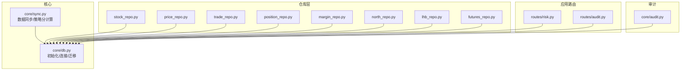
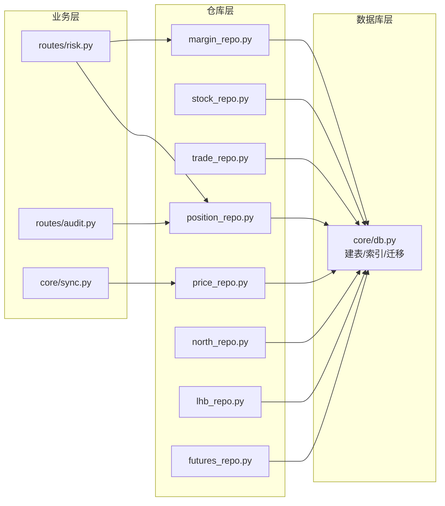
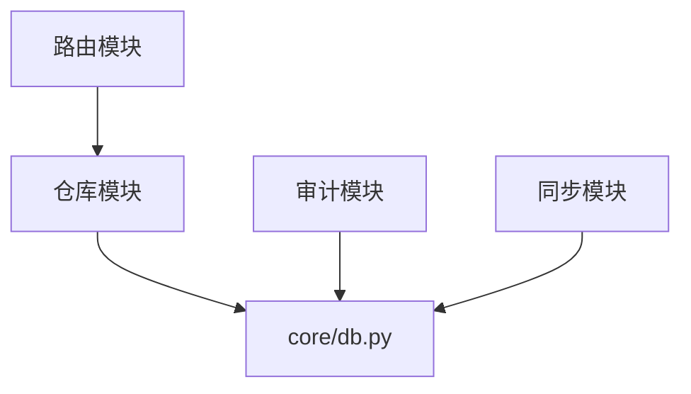

# 索引与约束

<cite>
**本文引用的文件**
- [core/db.py](file://core/db.py)
- [core/sync.py](file://core/sync.py)
- [core/repository/stock_repo.py](file://core/repository/stock_repo.py)
- [core/repository/price_repo.py](file://core/repository/price_repo.py)
- [core/repository/trade_repo.py](file://core/repository/trade_repo.py)
- [core/repository/position_repo.py](file://core/repository/position_repo.py)
- [core/repository/margin_repo.py](file://core/repository/margin_repo.py)
- [core/repository/north_repo.py](file://core/repository/north_repo.py)
- [core/repository/lhb_repo.py](file://core/repository/lhb_repo.py)
- [core/repository/futures_repo.py](file://core/repository/futures_repo.py)
- [core/audit.py](file://core/audit.py)
- [routes/risk.py](file://routes/risk.py)
- [routes/audit.py](file://routes/audit.py)
</cite>

## 目录
1. [简介](#简介)
2. [项目结构](#项目结构)
3. [核心组件](#核心组件)
4. [架构总览](#架构总览)
5. [详细组件分析](#详细组件分析)
6. [依赖关系分析](#依赖关系分析)
7. [性能考量](#性能考量)
8. [故障排查指南](#故障排查指南)
9. [结论](#结论)
10. [附录](#附录)

## 简介
本文件聚焦于 AIQuant 项目的数据库索引与约束设计，系统梳理建表语句中的主键、唯一约束、外键约束、复合索引与单列索引的创建目的、查询优化效果与业务意义，并结合实际查询与写入模式给出索引使用建议、维护策略与性能调优方法。内容以 SQLite 本地数据库为核心，覆盖行情、指数、信号、交易、风控、审计等关键业务表。

## 项目结构
AIQuant 的数据库初始化集中在核心模块中，采用一次性脚本创建所有表及索引，并在后续版本演进中进行列迁移与索引补建。数据访问层通过仓库模块对核心模块暴露统一接口，保证查询与写入的一致性与可维护性。

图表来源
- [core/db.py:57-467](file://core/db.py#L57-L467)
- [core/sync.py:17-21](file://core/sync.py#L17-L21)
- [core/repository/price_repo.py:8-10](file://core/repository/price_repo.py#L8-L10)
- [routes/risk.py:26](file://routes/risk.py#L26)
- [routes/audit.py:13](file://routes/audit.py#L13)
- [core/audit.py:13](file://core/audit.py#L13)

章节来源
- [core/db.py:57-467](file://core/db.py#L57-L467)
- [core/sync.py:17-21](file://core/sync.py#L17-L21)

## 核心组件
- 数据库初始化与连接管理：提供连接上下文、WAL 模式、同步级别设置，以及建表/索引脚本与列迁移逻辑。
- 仓库模块：封装各业务表的读写接口，统一使用核心模块提供的连接与 SQL。
- 应用路由：面向风控、审计等模块的查询接口，依赖仓库与核心模块。
- 审计系统：统一记录审计日志，便于追踪操作行为与性能。

章节来源
- [core/db.py:26-39](file://core/db.py#L26-L39)
- [core/db.py:57-467](file://core/db.py#L57-L467)
- [core/audit.py:16-39](file://core/audit.py#L16-L39)

## 架构总览
下图展示数据库层与业务层的交互关系，突出索引与约束在查询与写入中的作用。

图表来源
- [core/sync.py:17-21](file://core/sync.py#L17-L21)
- [core/repository/price_repo.py:8-10](file://core/repository/price_repo.py#L8-L10)
- [core/repository/stock_repo.py:8-10](file://core/repository/stock_repo.py#L8-L10)
- [core/repository/trade_repo.py:7-9](file://core/repository/trade_repo.py#L7-L9)
- [core/repository/position_repo.py:7-9](file://core/repository/position_repo.py#L7-L9)
- [core/repository/margin_repo.py:7-9](file://core/repository/margin_repo.py#L7-L9)
- [core/repository/north_repo.py:7-9](file://core/repository/north_repo.py#L7-L9)
- [core/repository/lhb_repo.py:7-9](file://core/repository/lhb_repo.py#L7-L9)
- [core/repository/futures_repo.py:7-9](file://core/repository/futures_repo.py#L7-L9)
- [core/db.py:57-467](file://core/db.py#L57-L467)

## 详细组件分析

### 股票基本信息表 stock_info
- 主键：code（文本，主键）
- 唯一约束：无
- 约束设计原则：code 作为唯一标识，主键约束确保唯一性与快速定位；其余字段非空约束体现在插入逻辑中。
- 查询优化：仓库层常用按 code 查询名称或批量获取股票列表，建议在 code 字段上保持主键以获得 O(log N) 查找与去重效率。
- 写入模式：Upsert（ON CONFLICT(code) DO UPDATE）保证幂等写入。

章节来源
- [core/db.py:63-69](file://core/db.py#L63-L69)
- [core/repository/stock_repo.py:13-28](file://core/repository/stock_repo.py#L13-L28)

### 日线行情表 daily_price
- 主键：id（自增整型）
- 唯一约束：UNIQUE(code, trade_date)
- 索引：
  - idx_daily_code_date(code, trade_date)：复合索引，覆盖按股票+日期的唯一写入与高效范围查询。
  - idx_daily_date(trade_date)：单列索引，支持按日期过滤的场景。
- 设计要点：
  - 唯一约束确保“同股票同日期”不重复。
  - 复合索引优先满足“按股票定位 + 日期范围”的查询/写入模式。
  - 单列索引服务于“仅按日期过滤”的场景。
- 写入模式：Upsert（ON CONFLICT(code, trade_date) DO UPDATE）。
- 查询模式：按 code + 日期范围查询，或仅按日期过滤。

章节来源
- [core/db.py:72-93](file://core/db.py#L72-L93)
- [core/repository/price_repo.py:13-47](file://core/repository/price_repo.py#L13-L47)
- [core/repository/price_repo.py:95-129](file://core/repository/price_repo.py#L95-L129)

### 指数日行情表 index_daily
- 主键：id（自增整型）
- 唯一约束：UNIQUE(code, trade_date)
- 索引：
  - idx_index_code_date(code, trade_date)
  - idx_index_date(trade_date)
- 设计要点：与 daily_price 类似的复合唯一与索引策略，满足指数行情的高频写入与查询。

章节来源
- [core/db.py:96-111](file://core/db.py#L96-L111)
- [core/repository/price_repo.py:134-167](file://core/repository/price_repo.py#L134-L167)

### 策略信号表 stock_signal
- 主键：id（自增整型）
- 唯一约束：UNIQUE(scan_date, code)
- 索引：
  - idx_sig_scan_trade_code(scan_date, code)
  - idx_sig_trade_date(trade_date)
- 设计要点：唯一约束确保“同扫描日期同股票”不重复；复合索引支撑按扫描日期聚合与按股票检索；单列索引支撑按交易日过滤。

章节来源
- [core/db.py:113-137](file://core/db.py#L113-L137)
- [core/sync.py:781-806](file://core/sync.py#L781-L806)

### 交易记录表 trades
- 主键：id（自增整型）
- 索引：
  - idx_trade_code(code)
  - idx_trade_date(trade_date)
- 设计要点：支撑按股票与按日期的查询，满足交易流水检索与回测统计。

章节来源
- [core/db.py:191-209](file://core/db.py#L191-L209)
- [core/repository/trade_repo.py:12-37](file://core/repository/trade_repo.py#L12-L37)

### 持仓记录表 positions
- 主键：id（自增整型）
- 索引：
  - idx_position_code(code)
  - idx_position_status(status)
- 设计要点：按股票与状态查询，支撑“持有中”持仓的快速检索与风控状态统计。

章节来源
- [core/db.py:169-186](file://core/db.py#L169-L186)
- [core/repository/position_repo.py:85-92](file://core/repository/position_repo.py#L85-L92)

### 账户快照表 account_snapshots
- 主键：id（自增整型）
- 索引：idx_snapshot_date(snapshot_date)
- 设计要点：按日期排序与范围查询，支撑回撤与收益曲线计算。

章节来源
- [core/db.py:211-223](file://core/db.py#L211-L223)
- [core/repository/trade_repo.py:60-76](file://core/repository/trade_repo.py#L60-L76)

### 融资融券汇总表 stock_margin
- 主键：id（自增整型）
- 唯一约束：UNIQUE(trade_date)
- 索引：idx_margin_date(trade_date)
- 设计要点：按日期唯一写入与查询，支撑宏观资金面分析。

章节来源
- [core/db.py:226-244](file://core/db.py#L226-L244)
- [core/repository/margin_repo.py:29-80](file://core/repository/margin_repo.py#L29-L80)

### 融资融券明细表 stock_margin_detail
- 主键：id（自增整型）
- 唯一约束：UNIQUE(code, trade_date)
- 索引：idx_md_code_date(code, trade_date)
- 设计要点：按股票+日期唯一写入，支撑个股两融明细查询。

章节来源
- [core/db.py:247-263](file://core/db.py#L247-L263)
- [core/repository/margin_repo.py:114-162](file://core/repository/margin_repo.py#L114-L162)

### 北向资金表 stock_hsgt_north
- 主键：id（自增整型）
- 唯一约束：UNIQUE(trade_date)
- 索引：idx_hsgt_date(trade_date)
- 设计要点：按日期唯一写入与查询，支撑北向资金趋势分析。

章节来源
- [core/db.py:266-288](file://core/db.py#L266-L288)
- [core/repository/north_repo.py:27-87](file://core/repository/north_repo.py#L27-L87)

### 指数期货表 index_futures
- 主键：id（自增整型）
- 唯一约束：UNIQUE(trade_date, symbol)
- 索引：
  - idx_if_date(trade_date)
  - idx_if_date_var(trade_date, variety)
- 设计要点：按日期与品种维度查询，支撑跨品种比较与时间序列分析。

章节来源
- [core/db.py:291-309](file://core/db.py#L291-L309)
- [core/repository/futures_repo.py:27-71](file://core/repository/futures_repo.py#L27-L71)

### 龙虎榜明细表 stock_lhb_detail
- 主键：id（自增整型）
- 唯一约束：UNIQUE(trade_date, code)
- 索引：
  - idx_lhb_date(trade_date)
  - idx_lhb_code(code)
- 设计要点：按日期与股票维度查询，支撑热点事件追踪。

章节来源
- [core/db.py:311-335](file://core/db.py#L311-L335)
- [core/repository/lhb_repo.py:27-69](file://core/repository/lhb_repo.py#L27-L69)

### 风控事件表 risk_events
- 主键：id（自增整型）
- 索引：
  - idx_risk_events_time(created_at DESC)
  - idx_risk_events_level(level)
- 设计要点：按时间倒序查询与按等级过滤，支撑风控事件监控与告警。

章节来源
- [core/db.py:359-372](file://core/db.py#L359-L372)
- [routes/risk.py:52-64](file://routes/risk.py#L52-L64)

### 风控状态表 risk_status
- 主键：account_id（文本，主键）
- 设计要点：按账户 ID 快速读取与更新，支撑风控引擎状态查询。

章节来源
- [core/db.py:375-386](file://core/db.py#L375-L386)

### 黑名单表 blacklist
- 主键：id（自增整型）
- 唯一约束：UNIQUE(stock_code)
- 索引：idx_blacklist_expiry(expiry_date)
- 设计要点：按股票唯一控制与按到期时间过滤，支撑风控拦截与清理。

章节来源
- [core/db.py:389-399](file://core/db.py#L389-L399)
- [routes/risk.py:112-126](file://routes/risk.py#L112-L126)

### 风控豁免表 risk_overrides
- 主键：id（自增整型）
- 索引：
  - idx_override_status(status)
  - idx_override_expires(expires_at)
- 设计要点：按状态与到期时间查询，支撑豁免审批与过期清理。

章节来源
- [core/db.py:402-414](file://core/db.py#L402-L414)
- [routes/risk.py:207-225](file://routes/risk.py#L207-L225)

### 审计日志表 audit_log
- 主键：id（自增整型）
- 索引：idx_audit_time(created_at DESC)
- 设计要点：按时间倒序查询，支撑审计与合规追溯。

章节来源
- [core/db.py:417-427](file://core/db.py#L417-L427)
- [core/audit.py:16-39](file://core/audit.py#L16-L39)
- [routes/audit.py:16-38](file://routes/audit.py#L16-L38)

## 依赖关系分析
- 仓库模块统一依赖核心模块的连接与 SQL，避免分散的连接管理与 SQL 维护成本。
- 路由层通过仓库模块间接依赖数据库层，形成清晰的分层边界。
- 审计模块与风控模块共享数据库层，支撑运营与合规需求。

图表来源
- [core/repository/price_repo.py:8-10](file://core/repository/price_repo.py#L8-L10)
- [core/db.py:57-467](file://core/db.py#L57-L467)
- [core/audit.py:13](file://core/audit.py#L13)
- [core/sync.py:17-21](file://core/sync.py#L17-L21)

章节来源
- [core/repository/price_repo.py:8-10](file://core/repository/price_repo.py#L8-L10)
- [core/audit.py:13](file://core/audit.py#L13)
- [core/sync.py:17-21](file://core/sync.py#L17-L21)

## 性能考量
- 索引选择策略
  - 复合索引优先匹配最左前缀的查询模式。例如：
    - daily_price(code, trade_date) 适合“按股票定位 + 日期范围”查询与 Upsert 冲突键。
    - stock_signal(scan_date, code) 适合“按扫描日期聚合 + 按股票检索”。
    - index_daily(code, trade_date) 与 stock_margin_detail(code, trade_date) 同理。
  - 单列索引用于独立过滤条件，如按 trade_date 过滤。
- 写入性能
  - Upsert（ON CONFLICT）减少重复写入与二次查询开销。
  - 批量写入（executemany）显著降低往返次数。
- 查询优化
  - 使用 EXPLAIN QUERY PLAN 分析查询计划，确认索引被正确使用。
  - 避免在索引列上使用函数或隐式转换，防止索引失效。
- 索引维护
  - 定期评估索引选择性与覆盖度，移除冗余索引。
  - 在大批量写入期间考虑禁用非必要索引，写入后再重建。
- WAL 与同步
  - WAL 模式提升并发写入吞吐；NORMAL 同步级别在性能与安全性间取得平衡。

章节来源
- [core/db.py:26-39](file://core/db.py#L26-L39)
- [core/db.py:57-467](file://core/db.py#L57-L467)
- [core/repository/price_repo.py:13-47](file://core/repository/price_repo.py#L13-L47)

## 故障排查指南
- 常见问题
  - 写入冲突：确认 Upsert 冲突键是否与唯一约束一致（如 code+trade_date、trade_date 唯一）。
  - 查询慢：检查 WHERE 条件是否命中索引；避免在索引列上使用函数或 LIKE '%x'。
  - 数据不一致：核对事务边界与 PRAGMA 设置，确保写入一致性。
- 审计与风控
  - 审计日志查询：按 created_at 倒序分页，注意 limit 控制。
  - 风控事件查询：按 level 过滤与按时间倒序，结合状态表快速定位账户级风控状态。

章节来源
- [core/db.py:417-427](file://core/db.py#L417-L427)
- [routes/audit.py:16-38](file://routes/audit.py#L16-L38)
- [routes/risk.py:52-64](file://routes/risk.py#L52-L64)

## 结论
AIQuant 的数据库设计围绕“高频写入 + 精准查询”的目标展开：以主键与唯一约束保障数据完整性，以复合索引覆盖核心查询模式，以单列索引支撑独立过滤条件。通过 Upsert、批量写入与 WAL 模式，兼顾了性能与可靠性。建议持续关注查询计划与索引使用情况，定期评估索引有效性，确保在数据规模增长过程中维持稳定性能。

## 附录
- 关键索引与约束一览
  - daily_price：主键(id)，唯一(code, trade_date)，索引(code, trade_date)、idx_daily_date(trade_date)
  - index_daily：主键(id)，唯一(code, trade_date)，索引(code, trade_date)、idx_index_date(trade_date)
  - stock_signal：主键(id)，唯一(scan_date, code)，索引(scan_date, code)、idx_sig_trade_date(trade_date)
  - trades：主键(id)，索引(code)、idx_trade_date(trade_date)
  - positions：主键(id)，索引(code)、idx_position_status(status)
  - account_snapshots：主键(id)，索引(snapshot_date)
  - stock_margin：主键(id)，唯一(trade_date)，索引(idx_margin_date(trade_date))
  - stock_margin_detail：主键(id)，唯一(code, trade_date)，索引(code, trade_date)
  - stock_hsgt_north：主键(id)，唯一(trade_date)，索引(trade_date)
  - index_futures：主键(id)，唯一(trade_date, symbol)，索引(trade_date)、(trade_date, variety)
  - stock_lhb_detail：主键(id)，唯一(trade_date, code)，索引(trade_date)、(code)
  - risk_events：主键(id)，索引(created_at DESC)、(level)
  - risk_status：主键(account_id)
  - blacklist：主键(id)，唯一(stock_code)，索引(expiry_date)
  - risk_overrides：主键(id)，索引(status)、(expires_at)
  - audit_log：主键(id)，索引(created_at DESC)

章节来源
- [core/db.py:63-427](file://core/db.py#L63-L427)