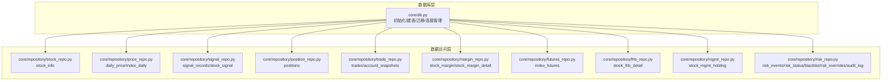
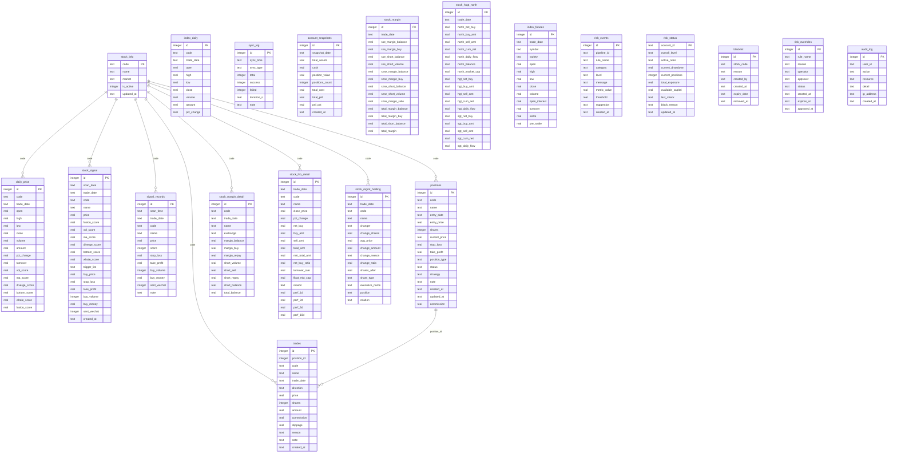
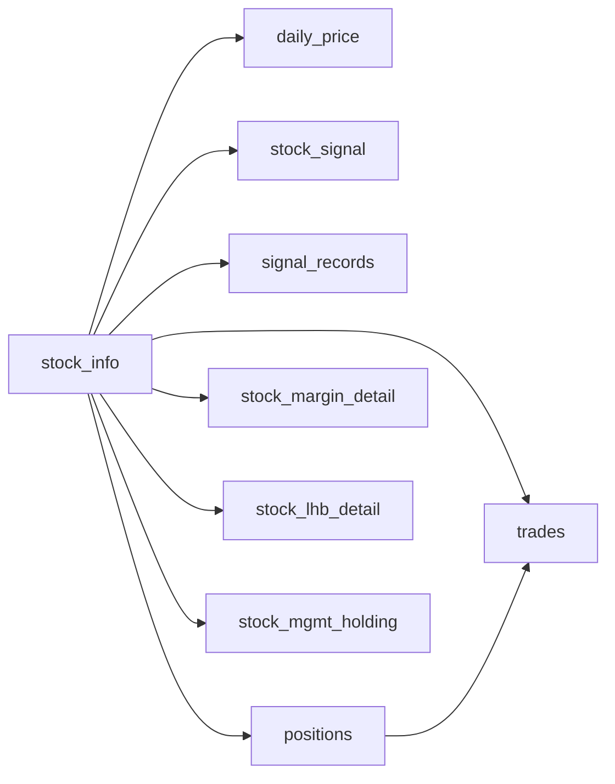

# 表结构设计

<cite>
**本文档引用的文件**
- [core/db.py](file://core/db.py)
- [core/repository/stock_repo.py](file://core/repository/stock_repo.py)
- [core/repository/position_repo.py](file://core/repository/position_repo.py)
- [core/repository/trade_repo.py](file://core/repository/trade_repo.py)
- [core/repository/signal_repo.py](file://core/repository/signal_repo.py)
- [core/repository/margin_repo.py](file://core/repository/margin_repo.py)
</cite>

## 目录
1. [简介](#简介)
2. [项目结构](#项目结构)
3. [核心组件](#核心组件)
4. [架构总览](#架构总览)
5. [详细组件分析](#详细组件分析)
6. [依赖分析](#依赖分析)
7. [性能考虑](#性能考虑)
8. [故障排查指南](#故障排查指南)
9. [结论](#结论)

## 简介
本文件面向数据库管理员与开发者，系统化梳理 AIQuant 项目中 SQLite 数据库的表结构设计。内容涵盖：
- 每个表的字段定义、数据类型与约束
- 主键、外键与唯一约束的设计原则
- 各表的业务用途与数据含义
- 字段级注释说明与 SQL 创建语句路径
- 表之间的关系与引用完整性约束
- 面向运维与开发的最佳实践建议

## 项目结构
AIQuant 使用本地 SQLite 文件作为数据存储，核心建表逻辑集中在数据库模块中，并通过数据访问层（Repository）对各表进行统一的 CRUD 操作封装。下图展示与表结构相关的核心文件与职责：

图表来源
- [core/db.py:57-466](file://core/db.py#L57-L466)
- [core/repository/stock_repo.py:13-80](file://core/repository/stock_repo.py#L13-L80)
- [core/repository/position_repo.py:12-138](file://core/repository/position_repo.py#L12-L138)
- [core/repository/trade_repo.py:12-77](file://core/repository/trade_repo.py#L12-L77)
- [core/repository/signal_repo.py:14-119](file://core/repository/signal_repo.py#L14-L119)
- [core/repository/margin_repo.py:29-186](file://core/repository/margin_repo.py#L29-L186)

章节来源
- [core/db.py:57-466](file://core/db.py#L57-L466)

## 核心组件
本节概述数据库初始化流程与关键组件职责：
- 初始化与连接管理：负责数据库连接参数设置、事务控制与异常回滚。
- 建表与迁移：集中执行建表 SQL 与列迁移，确保版本演进的兼容性。
- 数据访问层：将业务操作映射到具体表的 CRUD，屏蔽底层 SQL 细节。

章节来源
- [core/db.py:26-41](file://core/db.py#L26-L41)
- [core/db.py:57-466](file://core/db.py#L57-L466)

## 架构总览
下图展示数据库表之间的关系与引用完整性约束（基于现有建表与使用逻辑推导）：

图表来源
- [core/db.py:61-426](file://core/db.py#L61-L426)

## 详细组件分析

### 股票基本信息表 stock_info
- 业务用途：维护股票基础信息，如代码、名称、市场、是否有效、更新时间等。
- 主键：code（文本，唯一标识）
- 约束与默认值：
  - name：非空
  - is_active：整型，默认 1（表示启用）
  - updated_at：文本，记录最后更新时间
- 字段级注释：
  - code：股票代码（主键）
  - name：股票名称（非空）
  - market：交易所或市场标识
  - is_active：是否启用（1 启用，0 禁用）
  - updated_at：更新时间戳
- 关系与引用：
  - 与 daily_price、stock_signal、signal_records、positions、trades、stock_margin_detail、stock_lhb_detail、stock_mgmt_holding 等表通过 code 建立一对多关联。
- SQL 创建语句路径
  - [core/db.py:63-69](file://core/db.py#L63-L69)

章节来源
- [core/db.py:63-69](file://core/db.py#L63-L69)
- [core/repository/stock_repo.py:13-80](file://core/repository/stock_repo.py#L13-L80)

### 日线行情表 daily_price
- 业务用途：存储每只股票的日级别行情（开盘、最高、最低、收盘、成交量、成交额、涨跌幅、换手率等），并包含策略评分字段。
- 主键：id（自增整型）
- 唯一约束：(code, trade_date)（组合唯一）
- 索引：idx_daily_code_date(code, trade_date)，idx_daily_date(trade_date)
- 字段级注释：
  - id：自增主键
  - code：股票代码
  - trade_date：交易日期
  - open/high/low/close：OHLC 价格
  - volume/amount：成交量、成交额
  - pct_change：涨跌幅
  - turnover：换手率
  - vol_score/ma_score/diverge_score/bottom_score/whale_score/fusion_score：策略评分（0-10 或 0-50）
- 关系与引用：
  - 与 stock_info 通过 code 建立一对多关联。
- SQL 创建语句路径
  - [core/db.py:72-93](file://core/db.py#L72-L93)

章节来源
- [core/db.py:72-93](file://core/db.py#L72-L93)

### 指数日行情表 index_daily
- 业务用途：存储主要指数（如沪深300/中证500/中证1000）的日行情，用于大盘择时。
- 主键：id（自增整型）
- 唯一约束：(code, trade_date)
- 索引：idx_index_code_date(code, trade_date)，idx_index_date(trade_date)
- 字段级注释：
  - code：指数代码
  - trade_date：交易日期
  - open/high/low/close：OHLC
  - volume/amount：成交量、成交额
  - pct_change：涨跌幅
- SQL 创建语句路径
  - [core/db.py:96-110](file://core/db.py#L96-L110)

章节来源
- [core/db.py:96-110](file://core/db.py#L96-L110)

### 策略扫描推荐表 stock_signal
- 业务用途：保存每日策略扫描的推荐清单，包含融合评分与各子策略评分、止盈止损、买卖金额等。
- 主键：id（自增整型）
- 唯一约束：(scan_date, code)
- 索引：idx_sig_scan_trade_code(scan_date, code)，idx_sig_trade_date(trade_date)
- 字段级注释：
  - scan_date：扫描日期
  - trade_date：交易日期
  - code/name/price：股票代码、名称、当前价格
  - fusion_score/vol_score/ma_score/diverge_score/bottom_score/whale_score：各策略评分
  - trigger_list：触发策略名列表（JSON 文本）
  - buy_price/stop_loss/take_profit：买入价、止损、止盈
  - buy_volume/buy_money：买入数量、买入金额
  - sent_wechat：是否推送微信（0/1）
  - created_at：创建时间
- SQL 创建语句路径
  - [core/db.py:113-136](file://core/db.py#L113-L136)

章节来源
- [core/db.py:113-136](file://core/db.py#L113-L136)
- [core/repository/signal_repo.py:46-99](file://core/repository/signal_repo.py#L46-L99)

### 策略筛选记录表 signal_records（兼容旧表）
- 业务用途：历史兼容表，记录策略筛选结果。
- 主键：id（自增整型）
- 索引：idx_signal_date(trade_date)
- 字段级注释：
  - scan_time：扫描时间
  - trade_date：交易日期
  - code/name/price/score：股票信息与评分
  - stop_loss/take_profit：止损、止盈
  - buy_volume/buy_money：买入数量、金额
  - sent_wechat：是否推送微信
  - note：备注
- SQL 创建语句路径
  - [core/db.py:139-154](file://core/db.py#L139-L154)

章节来源
- [core/db.py:139-154](file://core/db.py#L139-L154)

### 数据同步日志表 sync_log
- 业务用途：记录数据同步任务的执行情况（成功/失败/耗时等）。
- 主键：id（自增整型）
- 字段级注释：
  - sync_time：同步时间
  - sync_type：同步类型
  - total/success/failed：总数、成功数、失败数
  - duration_s：耗时（秒）
  - note：备注
- SQL 创建语句路径
  - [core/db.py:157-166](file://core/db.py#L157-L166)

章节来源
- [core/db.py:157-166](file://core/db.py#L157-L166)

### 持仓记录表 positions
- 业务用途：记录实盘或回测中的持仓状态与风控参数。
- 主键：id（自增整型）
- 索引：idx_position_code(code)，idx_position_status(status)
- 字段级注释：
  - code/name/entry_date/entry_price/shares：股票代码、名称、建仓日期、建仓价、股数
  - current_price：当前价（用于浮动盈亏）
  - stop_loss/take_profit：止损、止盈
  - position_type：持仓类型（默认 long）
  - status：状态（默认 holding）
  - strategy：策略名称
  - note：备注
  - created_at/updated_at：创建与更新时间
  - commission：佣金（默认 0）
- 关系与引用：
  - 与 trades 通过 position_id 建立一对多关联。
- SQL 创建语句路径
  - [core/db.py:169-189](file://core/db.py#L169-L189)

章节来源
- [core/db.py:169-189](file://core/db.py#L169-L189)
- [core/repository/position_repo.py:12-138](file://core/repository/position_repo.py#L12-L138)

### 交易记录表 trades
- 业务用途：记录每次买卖产生的交易明细。
- 主键：id（自增整型）
- 索引：idx_trade_code(code)，idx_trade_date(trade_date)
- 字段级注释：
  - position_id：所属持仓 ID
  - code/name/trade_date：股票代码、名称、交易日期
  - direction：方向（如 buy/sell）
  - price/shares/amount：成交价、股数、成交金额
  - commission/slippage：手续费、滑点
  - reason/note：原因、备注
  - created_at：创建时间
- 关系与引用：
  - 与 positions 通过 position_id 建立一对多关联。
- SQL 创建语句路径
  - [core/db.py:191-209](file://core/db.py#L191-L209)

章节来源
- [core/db.py:191-209](file://core/db.py#L191-L209)

### 账户资产快照表 account_snapshots
- 业务用途：记录每日账户资产快照（总资产、现金、持仓价值、盈亏等）。
- 主键：id（自增整型）
- 索引：idx_snapshot_date(snapshot_date)
- 字段级注释：
  - snapshot_date：快照日期
  - total_assets/cash/position_value：总资产、现金、持仓价值
  - positions_count：持仓数量
  - total_cost/total_pnl/pnl_pct：总成本、总盈亏、盈亏百分比
  - created_at：创建时间
- SQL 创建语证路径
  - [core/db.py:211-223](file://core/db.py#L211-L223)

章节来源
- [core/db.py:211-223](file://core/db.py#L211-L223)
- [core/repository/trade_repo.py:42-77](file://core/repository/trade_repo.py#L42-L77)

### 融资融券汇总表 stock_margin
- 业务用途：记录全市场的融资融券汇总数据。
- 主键：id（自增整型）
- 唯一约束：(trade_date)
- 索引：idx_margin_date(trade_date)
- 字段级注释：
  - trade_date：交易日期
  - sse_* / szse_* / total_*：上交所/深交所/合计相关指标
- SQL 创建语句路径
  - [core/db.py:226-244](file://core/db.py#L226-L244)

章节来源
- [core/db.py:226-244](file://core/db.py#L226-L244)
- [core/repository/margin_repo.py:29-103](file://core/repository/margin_repo.py#L29-L103)

### 融资融券明细表 stock_margin_detail
- 业务用途：记录个股的融资融券明细。
- 主键：id（自增整型）
- 唯一约束：(code, trade_date)
- 索引：idx_md_code_date(code, trade_date)
- 字段级注释：
  - code/name/exchange：股票代码、名称、交易所
  - trade_date：交易日期
  - margin_balance/margin_buy/margin_repay：融资余额/买入/偿还
  - short_volume/short_sell/short_repay：融券余量/卖出/偿还
  - short_balance/total_balance：融券余额/融资融券余额
- SQL 创建语句路径
  - [core/db.py:247-263](file://core/db.py#L247-L263)

章节来源
- [core/db.py:247-263](file://core/db.py#L247-L263)
- [core/repository/margin_repo.py:114-186](file://core/repository/margin_repo.py#L114-L186)

### 北向资金表 stock_hsgt_north
- 业务用途：记录沪深港通北向资金流向。
- 主键：id（自增整型）
- 唯一约束：(trade_date)
- 索引：idx_hsgt_date(trade_date)
- 字段级注释：
  - trade_date：交易日期
  - north_* / hgt_* / sgt_*：北向/HGT/SGT 相关指标
- SQL 创建语句路径
  - [core/db.py:266-288](file://core/db.py#L266-L288)

章节来源
- [core/db.py:266-288](file://core/db.py#L266-L288)

### 指数期货表 index_futures
- 业务用途：记录股指期货的行情数据。
- 主键：id（自增整型）
- 唯一约束：(trade_date, symbol)
- 索引：idx_if_date(trade_date)，idx_if_date_var(trade_date, variety)
- 字段级注释：
  - trade_date：交易日期
  - symbol：合约代码
  - variety：品种
  - open/high/low/close：OHLC
  - volume/open_interest/turnover：成交量、持仓量、成交额
  - settle/pre_settle：结算价、昨结算价
- SQL 创建语句路径
  - [core/db.py:291-309](file://core/db.py#L291-L309)

章节来源
- [core/db.py:291-309](file://core/db.py#L291-L309)

### 龙虎榜明细表 stock_lhb_detail
- 业务用途：记录个股龙虎榜交易明细。
- 主键：id（自增整型）
- 唯一约束：(trade_date, code)
- 索引：idx_lhb_date(trade_date)，idx_lhb_code(code)
- 字段级注释：
  - trade_date/code/name：交易日期、股票代码、名称
  - close_price/pct_change：收盘价、涨跌幅
  - net_buy/buy_amt/sell_amt/total_amt：净买额、买入额、卖出额、成交总额
  - mkt_total_amt/net_buy_ratio/turnover_rate：市场总成交额、净买比例、换手率
  - float_mkt_cap：流通市值
  - reason：上榜原因
  - perf_1d/perf_2d/perf_5d/perf_10d：次日及多日涨跌幅
- SQL 创建语句路径
  - [core/db.py:311-335](file://core/db.py#L311-L335)

章节来源
- [core/db.py:311-335](file://core/db.py#L311-L335)

### 高管增减持表 stock_mgmt_holding
- 业务用途：记录上市公司高管的增减持行为。
- 主键：id（自增整型）
- 唯一约束：(trade_date, code, changer, change_shares, avg_price)
- 索引：idx_mh_date(trade_date)，idx_mh_code(code)
- 字段级注释：
  - trade_date：交易日期
  - code/name/changer：股票代码、名称、变动人
  - change_shares/avg_price/change_amount：变动股数、均价、变动金额
  - change_reason/change_ratio：变动原因、变动比例
  - shares_after/share_type：变动后持股数、股份性质
  - executive_name/position/relation：高管姓名、职位、关系
- SQL 创建语句路径
  - [core/db.py:337-357](file://core/db.py#L337-L357)

章节来源
- [core/db.py:337-357](file://core/db.py#L337-L357)

### 风控事件表 risk_events
- 业务用途：记录风控规则触发事件。
- 主键：id（自增整型）
- 索引：idx_risk_events_time(created_at DESC)，idx_risk_events_level(level)
- 字段级注释：
  - pipeline_id：流水线 ID
  - rule_name/category/level：规则名、类别、等级
  - message/metric_value/threshold：消息、指标值、阈值
  - suggestion：建议
  - created_at：创建时间
- SQL 创建语句路径
  - [core/db.py:359-372](file://core/db.py#L359-L372)

章节来源
- [core/db.py:359-372](file://core/db.py#L359-L372)

### 风控状态表 risk_status
- 业务用途：记录账户风控状态快照。
- 主键：account_id（文本，账户标识）
- 字段级注释：
  - account_id：账户 ID（主键）
  - overall_level：总体风险等级
  - active_rules：活跃规则
  - current_drawdown/current_positions/total_exposure/available_capital：当前回撤、持仓数、总敞口、可用资金
  - last_check/block_reason：最后检查时间、阻断原因
  - updated_at：更新时间
- SQL 创建语句路径
  - [core/db.py:375-386](file://core/db.py#L375-L386)

章节来源
- [core/db.py:375-386](file://core/db.py#L375-L386)

### 黑名单表 blacklist
- 业务用途：记录被限制交易的股票代码。
- 主键：id（自增整型）
- 唯一约束：(stock_code)
- 索引：idx_blacklist_expiry(expiry_date)
- 字段级注释：
  - stock_code：股票代码（唯一）
  - reason：原因
  - created_by：创建者（默认 system）
  - created_at/expiry_date/removed_at：创建时间、到期时间、移除时间
- SQL 创建语句路径
  - [core/db.py:389-399](file://core/db.py#L389-L399)

章节来源
- [core/db.py:389-399](file://core/db.py#L389-L399)

### 风控豁免表 risk_overrides
- 业务用途：记录风控豁免申请与审批。
- 主键：id（自增整型）
- 索引：idx_override_status(status)，idx_override_expires(expires_at)
- 字段级注释：
  - rule_name/reason/operator/approver：规则名、原因、操作员、审批人
  - status：状态（默认 pending）
  - created_at/expires_at/approved_at：创建时间、到期时间、审批时间
- SQL 创建语句路径
  - [core/db.py:402-414](file://core/db.py#L402-L414)

章节来源
- [core/db.py:402-414](file://core/db.py#L402-L414)

### 审计日志表 audit_log
- 业务用途：记录用户操作审计。
- 主键：id（自增整型）
- 索引：idx_audit_time(created_at DESC)
- 字段级注释：
  - user_id/action/resource/detail/ip_address：用户 ID、动作、资源、详情、IP 地址
  - created_at：创建时间
- SQL 创建语句路径
  - [core/db.py:417-426](file://core/db.py#L417-L426)

章节来源
- [core/db.py:417-426](file://core/db.py#L417-L426)

## 依赖分析
- 表间关系与引用完整性：
  - stock_info 与 daily_price、stock_signal、signal_records、positions、trades、stock_margin_detail、stock_lhb_detail、stock_mgmt_holding 通过 code 建立一对多关联。
  - positions 与 trades 通过 position_id 建立一对多关联。
  - 多表具有唯一约束（如 (code, trade_date)、(trade_date)、(stock_code)、(trade_date, symbol) 等）以保证数据一致性。
- 数据访问层依赖：
  - 各 Repository 通过 core/db.py 提供的连接与事务机制进行数据操作，避免直接拼接 SQL，降低耦合度。
- 迁移与兼容：
  - 建表脚本集中于 core/db.py，迁移逻辑通过安全添加列与索引重建保障版本演进。

图表来源
- [core/db.py:61-426](file://core/db.py#L61-L426)

章节来源
- [core/db.py:61-426](file://core/db.py#L61-L426)

## 性能考虑
- 连接与事务：
  - 使用 WAL 模式与 NORMAL 同步策略提升并发写入性能，同时保持数据安全平衡。
  - 事务自动提交/回滚，异常时回滚，减少脏数据风险。
- 索引策略：
  - 在高频查询字段（如 code、trade_date、scan_date、status 等）建立复合索引，显著降低查询成本。
- 数据类型选择：
  - 数值型采用 REAL，文本型采用 TEXT，满足金融数值精度与可读性需求。
- 唯一约束：
  - 对关键组合（如 (code, trade_date)、(trade_date)、(stock_code)、(trade_date, symbol)）建立唯一约束，避免重复数据。
- 批量写入：
  - 使用 executemany 与 ON CONFLICT/INSERT OR REPLACE 优化批量写入与去重。

章节来源
- [core/db.py:26-41](file://core/db.py#L26-L41)
- [core/db.py:61-426](file://core/db.py#L61-L426)

## 故障排查指南
- 常见问题定位：
  - 唯一约束冲突：检查 (code, trade_date)、(trade_date)、(stock_code)、(trade_date, symbol) 等唯一键是否重复。
  - 缺少索引导致慢查询：针对高频过滤字段（如 code、trade_date、status）确认索引是否存在。
  - 迁移失败：确认列是否已存在，使用安全添加列逻辑避免重复执行。
- 排查步骤：
  - 使用 db_stats 查询数据库概要统计，确认数据范围与完整性。
  - 检查 sync_log 记录，定位数据同步异常。
  - 核对 risk_events 与 risk_status，确认风控拦截原因。
- 参考路径：
  - [core/db.py:921-939](file://core/db.py#L921-L939)
  - [core/db.py:899-914](file://core/db.py#L899-L914)
  - [core/db.py:359-372](file://core/db.py#L359-L372)
  - [core/db.py:375-386](file://core/db.py#L375-L386)

章节来源
- [core/db.py:921-939](file://core/db.py#L921-L939)
- [core/db.py:899-914](file://core/db.py#L899-L914)
- [core/db.py:359-372](file://core/db.py#L359-L372)
- [core/db.py:375-386](file://core/db.py#L375-L386)

## 结论
本表结构设计围绕“行情数据 + 策略信号 + 实盘交易 + 风控审计”的核心业务域展开，通过明确的主键、唯一约束与索引策略，兼顾了查询效率与数据一致性。配合数据访问层的统一封装与迁移机制，为后续扩展与维护提供了清晰的边界与可演进的路径。建议在生产环境中持续关注索引命中率、唯一约束冲突与 WAL 模式的监控，以维持稳定高效的运行状态。