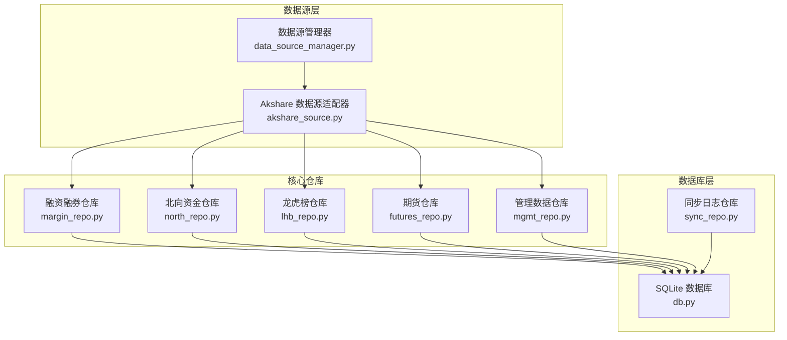
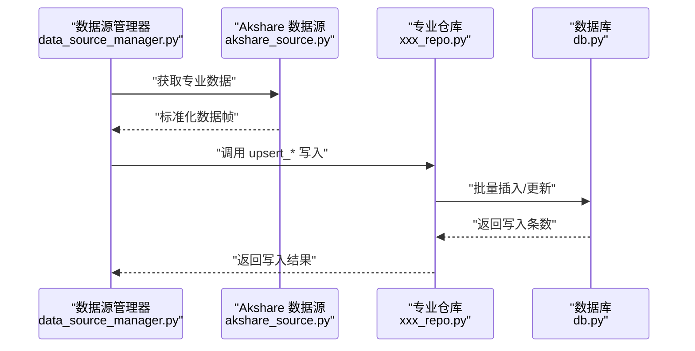
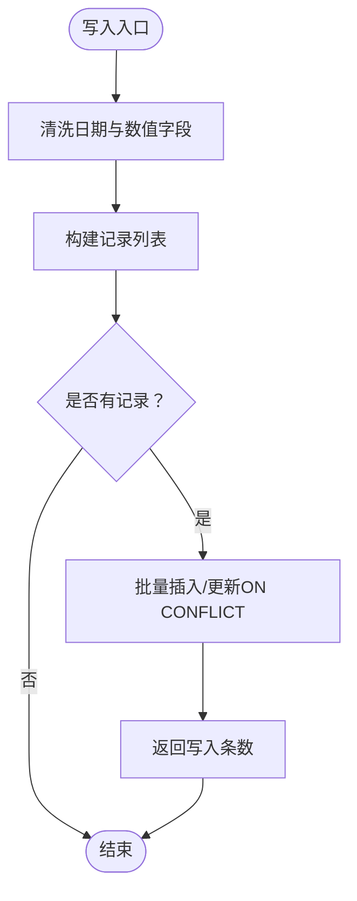
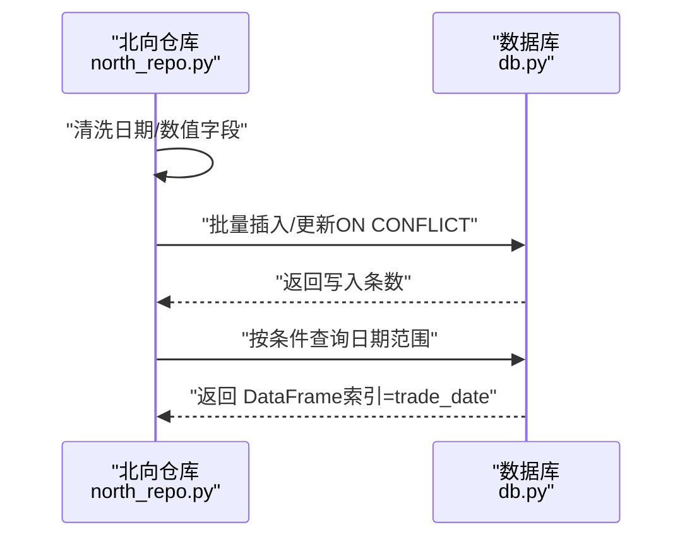
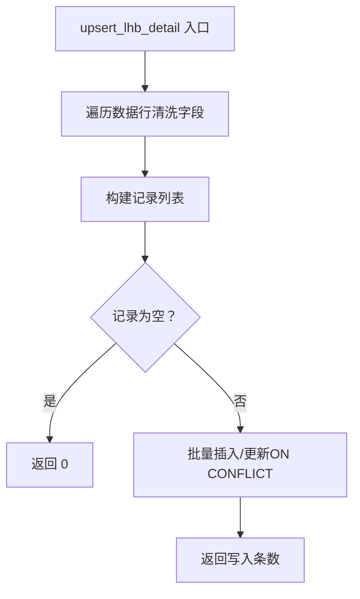
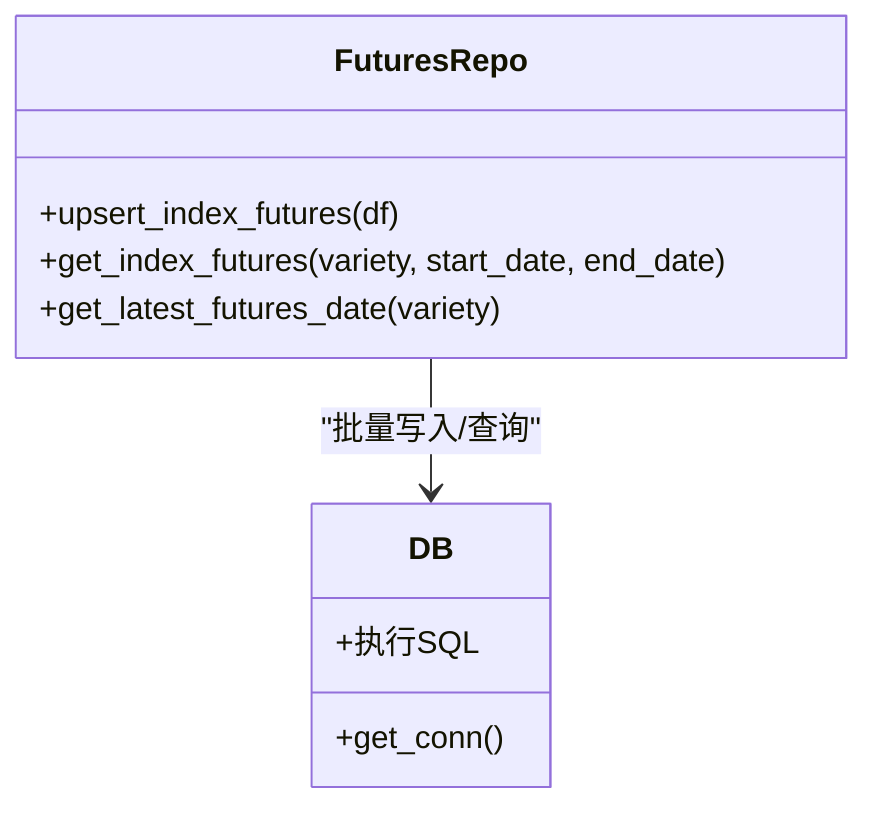
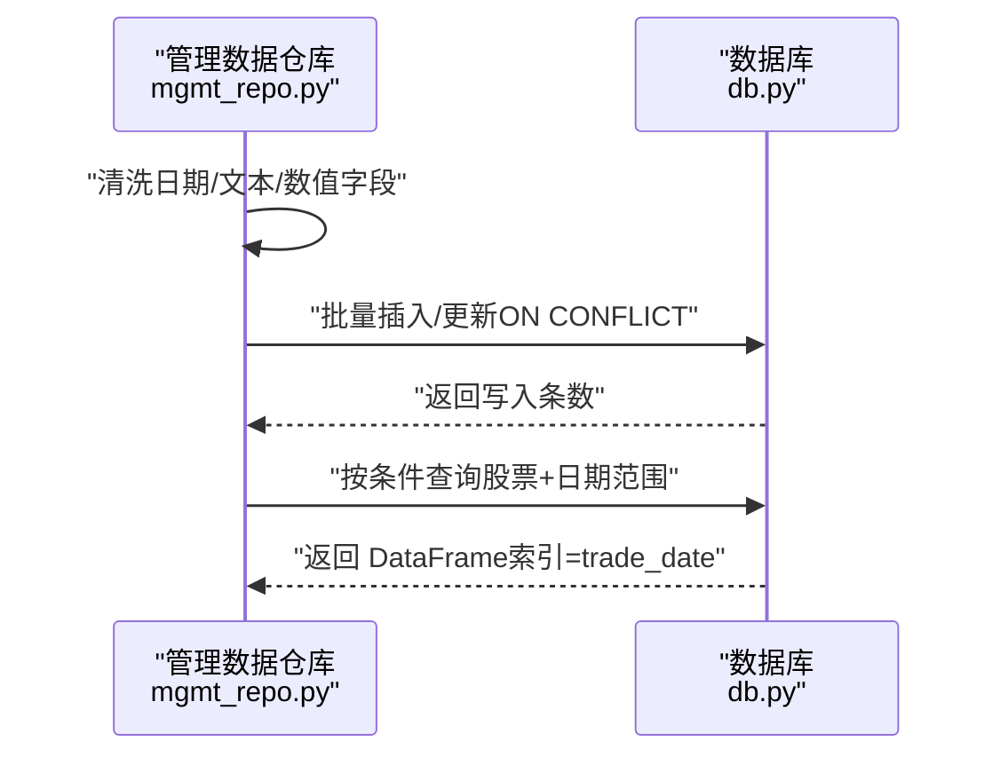
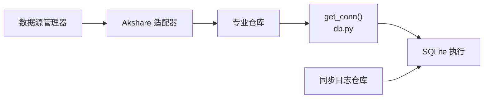

# 专业数据仓库

<cite>
**本文引用的文件**
- [margin_repo.py](file://core/repository/margin_repo.py)
- [north_repo.py](file://core/repository/north_repo.py)
- [lhb_repo.py](file://core/repository/lhb_repo.py)
- [futures_repo.py](file://core/repository/futures_repo.py)
- [mgmt_repo.py](file://core/repository/mgmt_repo.py)
- [db.py](file://core/db.py)
- [sync_repo.py](file://core/repository/sync_repo.py)
- [data_source_manager.py](file://ministries/rites/data_source_manager.py)
- [akshare_source.py](file://ministries/rites/akshare_source.py)
</cite>

## 目录
1. [简介](#简介)
2. [项目结构](#项目结构)
3. [核心组件](#核心组件)
4. [架构总览](#架构总览)
5. [详细组件分析](#详细组件分析)
6. [依赖关系分析](#依赖关系分析)
7. [性能考量](#性能考量)
8. [故障排查指南](#故障排查指南)
9. [结论](#结论)
10. [附录](#附录)

## 简介
本文件系统性梳理 AIQuant 专业数据仓库集合，覆盖融资融券（margin_repo）、北向资金（north_repo）、龙虎榜（lhb_repo）、期货（futures_repo）、管理数据（mgmt_repo）五大专业数据仓库。内容包括：
- 各专业数据的特点与存储结构
- 查询接口与数据访问模式
- 与主数据流的集成方式与数据同步机制
- 使用场景与分析方法示例

## 项目结构
专业数据仓库位于 core/repository 下，围绕 SQLite 数据库进行数据的入库与查询；数据库初始化与表结构定义集中在 core/db.py；数据源统一由 ministries/rites 下的数据源管理器负责接入与切换。

图表来源
- [margin_repo.py:1-186](file://core/repository/margin_repo.py#L1-L186)
- [north_repo.py:1-117](file://core/repository/north_repo.py#L1-L117)
- [lhb_repo.py:1-99](file://core/repository/lhb_repo.py#L1-L99)
- [futures_repo.py:1-109](file://core/repository/futures_repo.py#L1-L109)
- [mgmt_repo.py:1-103](file://core/repository/mgmt_repo.py#L1-L103)
- [db.py:225-357](file://core/db.py#L225-L357)
- [sync_repo.py:18-55](file://core/repository/sync_repo.py#L18-L55)
- [data_source_manager.py:111-190](file://ministries/rites/data_source_manager.py#L111-L190)
- [akshare_source.py:15-135](file://ministries/rites/akshare_source.py#L15-L135)

章节来源
- [margin_repo.py:1-186](file://core/repository/margin_repo.py#L1-L186)
- [north_repo.py:1-117](file://core/repository/north_repo.py#L1-L117)
- [lhb_repo.py:1-99](file://core/repository/lhb_repo.py#L1-L99)
- [futures_repo.py:1-109](file://core/repository/futures_repo.py#L1-L109)
- [mgmt_repo.py:1-103](file://core/repository/mgmt_repo.py#L1-L103)
- [db.py:225-357](file://core/db.py#L225-L357)
- [sync_repo.py:18-55](file://core/repository/sync_repo.py#L18-L55)
- [data_source_manager.py:111-190](file://ministries/rites/data_source_manager.py#L111-L190)
- [akshare_source.py:15-135](file://ministries/rites/akshare_source.py#L15-L135)

## 核心组件
- 融资融券仓库（margin_repo）
  - 提供全市场融资融券汇总与个股明细的入库与查询接口
  - 支持按日期范围过滤与索引化查询
- 北向资金仓库（north_repo）
  - 提供沪深港通北向资金的汇总数据入库与查询接口
  - 支持按日期范围过滤与索引化查询
- 龙虎榜仓库（lhb_repo）
  - 提供个股龙虎榜明细的入库与查询接口
  - 支持按日期范围与净买额排序查询
- 期货仓库（futures_repo）
  - 提供指数期货的入库与查询接口
  - 支持品种维度过滤与日期范围查询
- 管理数据仓库（mgmt_repo）
  - 提供高管持股变动的入库与查询接口
  - 支持按股票代码与日期范围过滤查询

章节来源
- [margin_repo.py:29-186](file://core/repository/margin_repo.py#L29-L186)
- [north_repo.py:27-117](file://core/repository/north_repo.py#L27-L117)
- [lhb_repo.py:27-99](file://core/repository/lhb_repo.py#L27-L99)
- [futures_repo.py:27-109](file://core/repository/futures_repo.py#L27-L109)
- [mgmt_repo.py:27-103](file://core/repository/mgmt_repo.py#L27-L103)

## 架构总览
专业数据仓库通过统一的数据库连接与事务管理，实现数据的批量写入与幂等更新；查询接口返回标准化的 pandas DataFrame，并以 trade_date 作为索引，便于时间序列分析。数据源层通过数据源管理器统一调度，优先使用本地数据库，异常时可回退到外部数据源（如 Akshare）。

图表来源
- [data_source_manager.py:153-178](file://ministries/rites/data_source_manager.py#L153-L178)
- [akshare_source.py:45-82](file://ministries/rites/akshare_source.py#L45-L82)
- [margin_repo.py:29-80](file://core/repository/margin_repo.py#L29-L80)
- [north_repo.py:27-87](file://core/repository/north_repo.py#L27-L87)
- [lhb_repo.py:27-69](file://core/repository/lhb_repo.py#L27-L69)
- [futures_repo.py:27-71](file://core/repository/futures_repo.py#L27-L71)
- [mgmt_repo.py:27-70](file://core/repository/mgmt_repo.py#L27-L70)
- [db.py:27-40](file://core/db.py#L27-L40)

## 详细组件分析

### 融资融券仓库（margin_repo）
- 存储结构
  - 全市场汇总表：stock_margin（按交易日唯一）
  - 个股明细表：stock_margin_detail（按股票+交易日唯一）
- 关键接口
  - upsert_market_margin：批量写入全市场汇总
  - upsert_margin_detail：批量写入个股明细
  - get_market_margin：按日期范围查询汇总
  - get_margin_detail：按股票与日期范围查询明细
  - get_latest_margin_date：查询最新可用日期
- 数据特点
  - 字段包含上交所/深交所的融资/融券余额与买入/卖出额，以及全市场合计
  - 日期字段支持多种输入格式，统一清洗为标准日期
  - 写入采用 ON CONFLICT 幂等更新，避免重复写入
- 使用场景
  - 资金面趋势分析、杠杆资金流向监测、跨市场资金对比

图表来源
- [margin_repo.py:29-80](file://core/repository/margin_repo.py#L29-L80)
- [margin_repo.py:114-162](file://core/repository/margin_repo.py#L114-L162)

章节来源
- [margin_repo.py:29-186](file://core/repository/margin_repo.py#L29-L186)
- [db.py:225-263](file://core/db.py#L225-L263)

### 北向资金仓库（north_repo）
- 存储结构
  - 汇总表：stock_hsgt_north（按交易日唯一）
- 关键接口
  - upsert_north_money：批量写入北向资金汇总
  - get_north_money：按日期范围查询
  - get_latest_hsgt_date：查询最新可用日期
- 数据特点
  - 字段覆盖北向（沪/深/港股通）净买入、买入/卖出金额、累计净额、日流量、余额、市值等
  - 日期字段统一清洗，数值字段空值处理为 None
- 使用场景
  - 外资流入流出监测、北向风格轮动分析、资金面情绪指标构建

图表来源
- [north_repo.py:27-117](file://core/repository/north_repo.py#L27-L117)
- [db.py:265-288](file://core/db.py#L265-L288)

章节来源
- [north_repo.py:27-117](file://core/repository/north_repo.py#L27-L117)
- [db.py:265-288](file://core/db.py#L265-L288)

### 龙虎榜仓库（lhb_repo）
- 存储结构
  - 明细表：stock_lhb_detail（按交易日+股票唯一）
- 关键接口
  - upsert_lhb_detail：批量写入龙虎榜明细
  - get_lhb_detail：按日期范围查询，按交易日降序、净买额降序
  - get_latest_lhb_date：查询最新可用日期
- 数据特点
  - 字段包含个股价格、涨跌幅、换手率、总买/卖、净买额及上榜原因
  - 日期字段统一清洗，数值字段空值处理为 None
- 使用场景
  - 异动追踪、游资行为识别、短期趋势验证

图表来源
- [lhb_repo.py:27-69](file://core/repository/lhb_repo.py#L27-L69)
- [db.py:310-335](file://core/db.py#L310-L335)

章节来源
- [lhb_repo.py:27-99](file://core/repository/lhb_repo.py#L27-L99)
- [db.py:310-335](file://core/db.py#L310-L335)

### 期货仓库（futures_repo）
- 存储结构
  - 指数期货表：index_futures（按交易日+合约唯一）
- 关键接口
  - upsert_index_futures：批量写入指数期货数据
  - get_index_futures：按品种与日期范围查询
  - get_latest_futures_date：查询最新可用日期（可选品种过滤）
- 数据特点
  - 字段包含开盘/最高/最低/收盘、成交量、持仓量、成交额、结算价、前结算价
  - 日期字段统一清洗，数值字段空值处理为 None
- 使用场景
  - 商品/金融期货趋势跟踪、跨期套利、波动率研究

图表来源
- [futures_repo.py:27-109](file://core/repository/futures_repo.py#L27-L109)
- [db.py:290-308](file://core/db.py#L290-L308)

章节来源
- [futures_repo.py:27-109](file://core/repository/futures_repo.py#L27-L109)
- [db.py:290-308](file://core/db.py#L290-L308)

### 管理数据仓库（mgmt_repo）
- 存储结构
  - 高管持股表：stock_mgmt_holding（按交易日+股票+披露人+变动量+均价唯一）
- 关键接口
  - upsert_mgmt_holding：批量写入高管持股变动
  - get_mgmt_holding：按股票与日期范围查询（按日期倒序）
  - get_latest_mgmt_holding_date：查询最新可用日期
- 数据特点
  - 字段包含披露日期、高管姓名、职位、与关系、变动数量与比例、变动后持股等
  - 日期字段统一清洗，数值字段空值处理为 None
- 使用场景
  - 高管行为监控、内部人交易信号、公司治理观察

图表来源
- [mgmt_repo.py:27-103](file://core/repository/mgmt_repo.py#L27-L103)
- [db.py:336-357](file://core/db.py#L336-L357)

章节来源
- [mgmt_repo.py:27-103](file://core/repository/mgmt_repo.py#L27-L103)
- [db.py:336-357](file://core/db.py#L336-L357)

## 依赖关系分析
- 仓库到数据库
  - 所有专业仓库均通过 core/db.py 的 get_conn() 获取连接，使用上下文管理器确保事务提交/回滚与连接关闭
  - 写入采用批量 executemany + ON CONFLICT 幂等更新，避免重复键冲突
- 仓库到数据源
  - 数据源管理器提供统一接口，优先使用本地数据库；当本地不可用或无数据时，回退到外部数据源（如 Akshare）
  - Akshare 适配器负责标准化字段与日期格式，输出与仓库期望一致的数据帧
- 同步与日志
  - sync_repo 提供同步日志写入与数据库统计查询能力，便于观测数据同步质量与规模

图表来源
- [db.py:27-40](file://core/db.py#L27-L40)
- [data_source_manager.py:153-178](file://ministries/rites/data_source_manager.py#L153-L178)
- [akshare_source.py:45-82](file://ministries/rites/akshare_source.py#L45-L82)
- [sync_repo.py:18-34](file://core/repository/sync_repo.py#L18-L34)

章节来源
- [db.py:27-40](file://core/db.py#L27-L40)
- [data_source_manager.py:111-190](file://ministries/rites/data_source_manager.py#L111-L190)
- [akshare_source.py:15-135](file://ministries/rites/akshare_source.py#L15-L135)
- [sync_repo.py:18-55](file://core/repository/sync_repo.py#L18-L55)

## 性能考量
- 批量写入
  - 采用 executemany + ON CONFLICT，减少单条插入开销，提高吞吐
- 索引优化
  - 各专业表均建立关键查询维度的索引（如 trade_date、code、组合唯一键），降低查询成本
- 事务与并发
  - 使用 WAL 模式与 NORMAL 同步策略，在并发写入与可靠性间取得平衡
- 数据类型与空值处理
  - 统一清洗日期与数值字段，避免无效值影响查询与分析

## 故障排查指南
- 写入无记录
  - 检查输入数据是否为空或字段缺失；确认日期字段格式是否可被清洗函数接受
- 查询为空
  - 确认日期范围参数格式（YYYY-MM-DD 或 YYYYMMDD）与表中存储一致
  - 检查索引是否存在且未被破坏
- 数据源不可用
  - 通过数据源管理器健康检查接口查看可用性；必要时切换主数据源或启用备用数据源
- 同步质量
  - 通过同步日志仓库查看最近同步批次的总条数、成功/失败数与耗时，定位异常批次

章节来源
- [sync_repo.py:18-55](file://core/repository/sync_repo.py#L18-L55)
- [data_source_manager.py:136-151](file://ministries/rites/data_source_manager.py#L136-L151)

## 结论
专业数据仓库以统一的入库/查询模式与数据库层紧密耦合，具备良好的扩展性与稳定性。通过数据源管理器与外部数据源（如 Akshare）的协同，实现了数据获取的弹性与可靠性。建议在生产环境中结合索引与批量写入策略，持续监控同步日志与数据源健康状态，保障专业数据的完整性与时效性。

## 附录
- 数据库表结构概览（节选）
  - stock_margin：全市场融资融券汇总
  - stock_margin_detail：个股融资融券明细
  - stock_hsgt_north：北向资金汇总
  - stock_lhb_detail：龙虎榜明细
  - index_futures：指数期货
  - stock_mgmt_holding：高管持股变动
- 常用查询模式
  - 按日期范围过滤：WHERE trade_date BETWEEN ? AND ?
  - 按股票过滤：WHERE code=?
  - 按品种过滤：WHERE variety=?
  - 排序：ORDER BY trade_date ASC/DESC、net_buy DESC 等

章节来源
- [db.py:225-357](file://core/db.py#L225-L357)