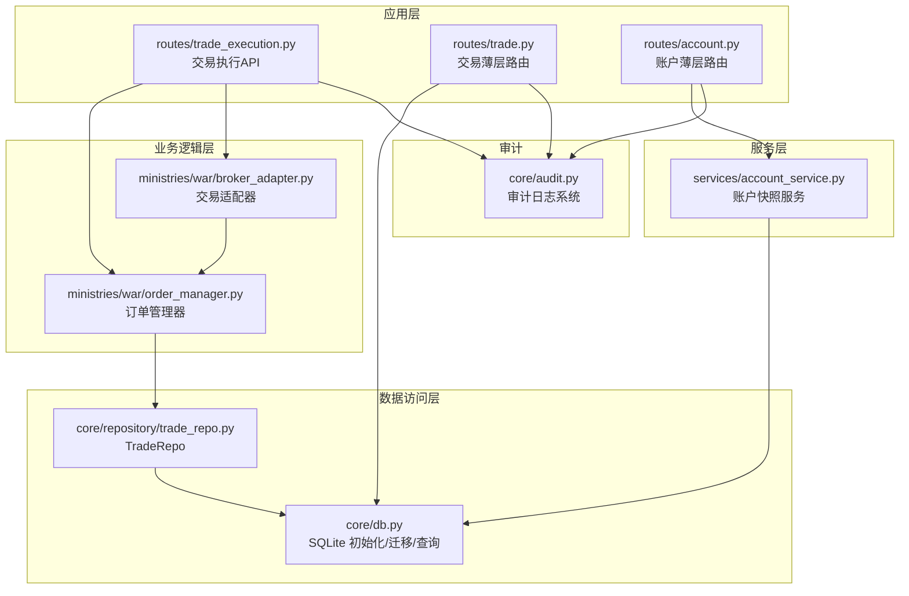
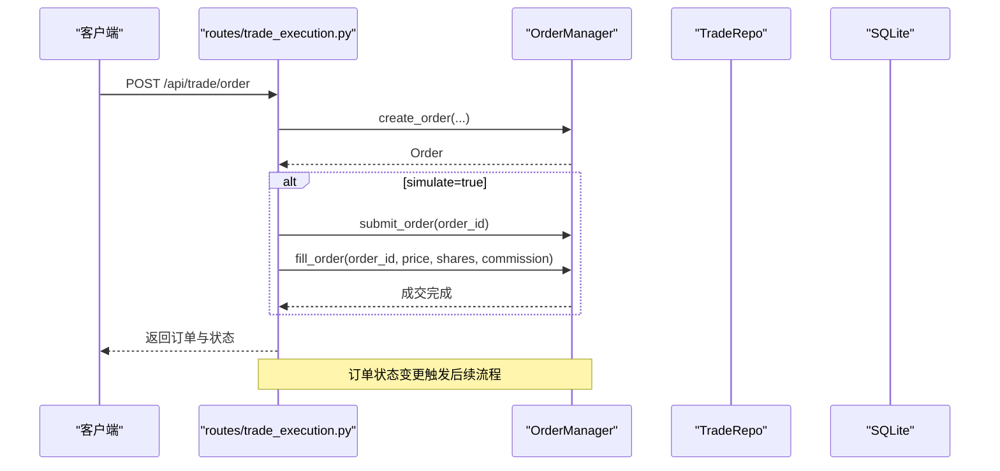
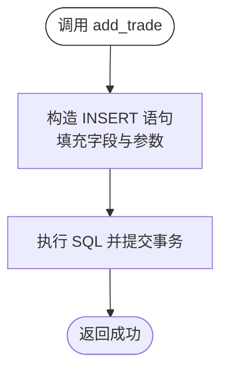
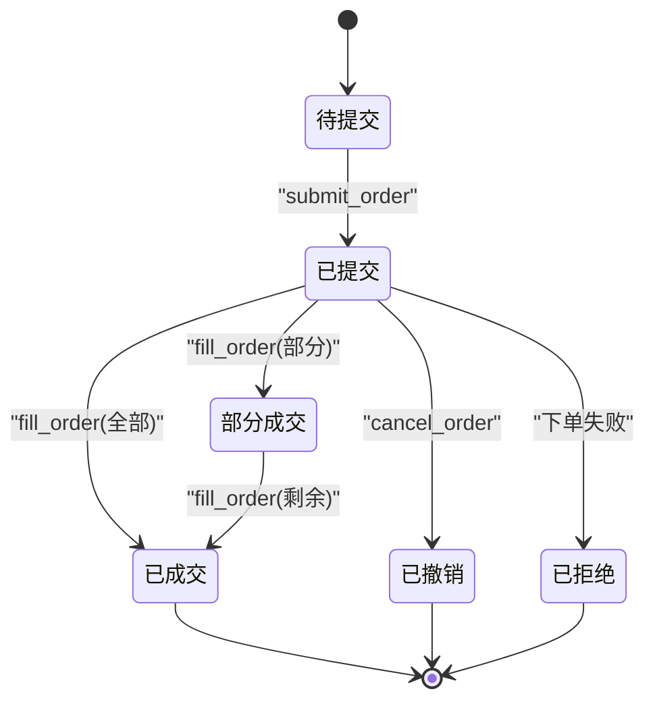
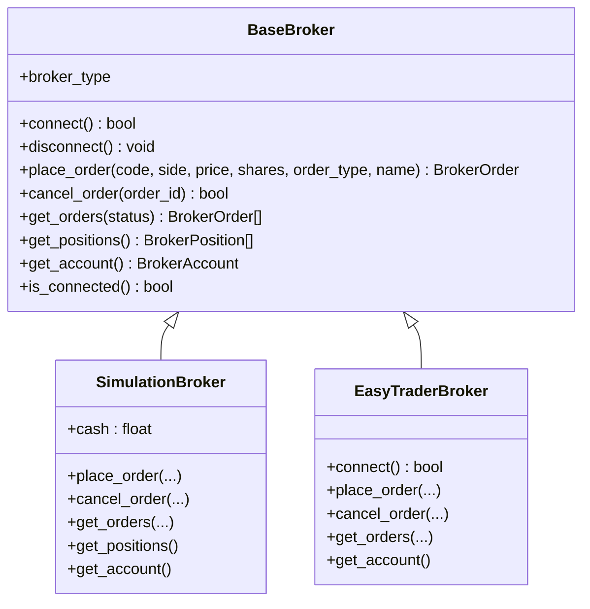
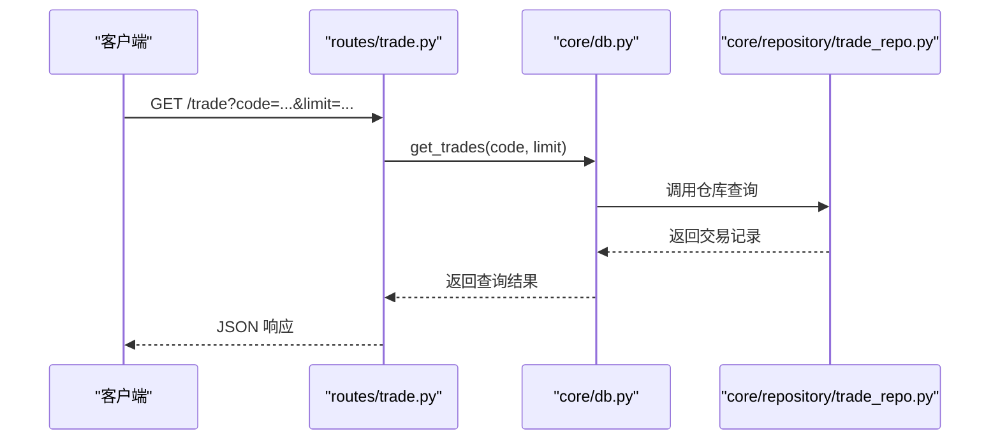
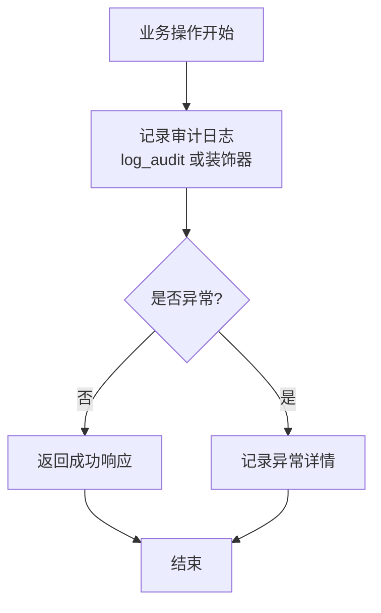
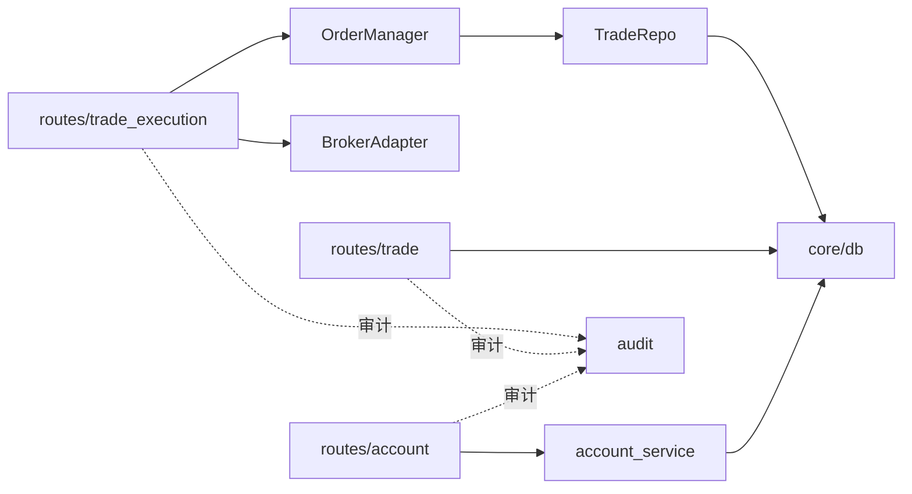
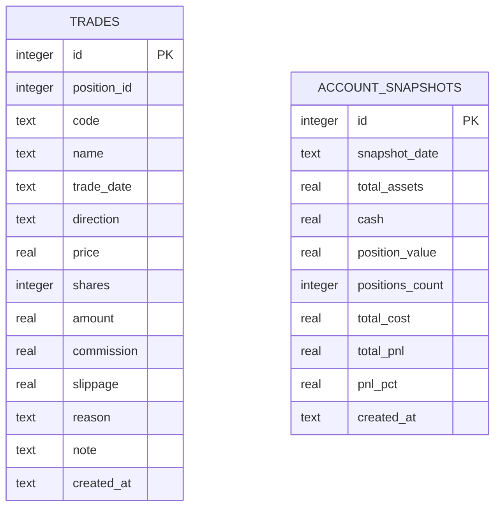

# 交易记录仓库

<cite>
**本文引用的文件**
- [trade_repo.py](file://core/repository/trade_repo.py)
- [db.py](file://core/db.py)
- [order_manager.py](file://ministries/war/order_manager.py)
- [broker_adapter.py](file://ministries/war/broker_adapter.py)
- [trade_execution.py](file://routes/trade_execution.py)
- [trade.py](file://routes/trade.py)
- [account_service.py](file://services/account_service.py)
- [account.py](file://routes/account.py)
- [audit.py](file://core/audit.py)
</cite>

## 目录
1. [简介](#简介)
2. [项目结构](#项目结构)
3. [核心组件](#核心组件)
4. [架构总览](#架构总览)
5. [详细组件分析](#详细组件分析)
6. [依赖关系分析](#依赖关系分析)
7. [性能考量](#性能考量)
8. [故障排查指南](#故障排查指南)
9. [结论](#结论)
10. [附录](#附录)

## 简介
本文件为 AIQuant 的 TradeRepo 交易记录仓库提供系统化技术文档，聚焦于交易订单的存储结构与管理接口，涵盖委托订单、成交记录、撤单操作、状态流转与同步策略，并给出订单查询、成交统计、交易分析的使用示例，以及交易数据的审计追踪与合规性实现建议。文档同时对数据库表结构、路由层薄层封装、订单管理器与交易适配器进行深入解析，帮助开发者快速理解与扩展交易数据管理能力。

## 项目结构
TradeRepo 所在路径位于 core/repository，围绕 SQLite 数据库存储 trades 与 account_snapshots 表构建；上层通过薄层路由暴露查询与写入接口；订单生命周期由 order_manager 管理；交易执行通过 trade_execution 路由与 broker_adapter 抽象层协同；审计日志由 core/audit 提供统一记录与查询能力。

图表来源
- [trade_execution.py:1-217](file://routes/trade_execution.py#L1-L217)
- [trade.py:1-43](file://routes/trade.py#L1-L43)
- [account.py:1-38](file://routes/account.py#L1-L38)
- [order_manager.py:1-211](file://ministries/war/order_manager.py#L1-L211)
- [broker_adapter.py:1-413](file://ministries/war/broker_adapter.py#L1-L413)
- [trade_repo.py:1-77](file://core/repository/trade_repo.py#L1-L77)
- [db.py:190-223](file://core/db.py#L190-L223)
- [audit.py:1-147](file://core/audit.py#L1-L147)

章节来源
- [trade_repo.py:1-77](file://core/repository/trade_repo.py#L1-L77)
- [db.py:190-223](file://core/db.py#L190-L223)
- [order_manager.py:1-211](file://ministries/war/order_manager.py#L1-L211)
- [broker_adapter.py:1-413](file://ministries/war/broker_adapter.py#L1-L413)
- [trade_execution.py:1-217](file://routes/trade_execution.py#L1-L217)
- [trade.py:1-43](file://routes/trade.py#L1-L43)
- [account_service.py:1-31](file://services/account_service.py#L1-L31)
- [account.py:1-38](file://routes/account.py#L1-L38)
- [audit.py:1-147](file://core/audit.py#L1-L147)

## 核心组件
- 交易记录仓库 TradeRepo：封装 trades 与 account_snapshots 表的增删改查，提供交易记录写入、按条件查询、账户快照保存与查询等接口。
- 订单管理器 OrderManager：维护订单生命周期（创建、提交、成交、撤单），并联动持仓管理与成交记录生成。
- 交易适配器 BrokerAdapter：抽象统一下单、撤单、查询等接口，支持模拟与实盘切换。
- 路由薄层：routes 层负责参数校验、调用服务层或数据访问层，并返回标准化 JSON。
- 审计日志：统一记录用户行为、操作结果与异常，便于合规与审计追踪。

章节来源
- [trade_repo.py:12-77](file://core/repository/trade_repo.py#L12-L77)
- [order_manager.py:69-211](file://ministries/war/order_manager.py#L69-L211)
- [broker_adapter.py:84-132](file://ministries/war/broker_adapter.py#L84-L132)
- [trade_execution.py:23-179](file://routes/trade_execution.py#L23-L179)
- [audit.py:16-92](file://core/audit.py#L16-L92)

## 架构总览
TradeRepo 作为数据访问层，向上提供两类核心能力：
- 交易记录管理：新增成交记录、按股票代码与时间范围查询交易明细。
- 账户快照管理：保存每日账户资产快照，支持覆盖更新与历史查询。

订单生命周期由 OrderManager 在内存中维护，交易执行路由在创建订单后可选择模拟成交，从而触发订单状态变更与持仓更新；审计日志贯穿关键操作，确保可追溯。

图表来源
- [trade_execution.py:23-58](file://routes/trade_execution.py#L23-L58)
- [order_manager.py:76-126](file://ministries/war/order_manager.py#L76-L126)

章节来源
- [trade_execution.py:23-179](file://routes/trade_execution.py#L23-L179)
- [order_manager.py:69-211](file://ministries/war/order_manager.py#L69-L211)
- [trade_repo.py:12-77](file://core/repository/trade_repo.py#L12-L77)
- [db.py:190-223](file://core/db.py#L190-L223)

## 详细组件分析

### 交易记录仓库 TradeRepo
- 存储结构
  - trades 表：记录每笔成交，包含 position_id、code、name、trade_date、direction、price、shares、amount、commission、slippage、reason、note、created_at 等字段。
  - account_snapshots 表：记录每日账户快照，包含 snapshot_date、total_assets、cash、position_value、positions_count、total_cost、total_pnl、pnl_pct、created_at 等字段。
- 接口能力
  - 新增交易记录：add_trade(...)，支持传入 position_id、code、name、trade_date、direction、price、shares、pnl、strategy、remark 等。
  - 查询交易记录：get_trades(code=None, limit=100)，支持按股票过滤与限制返回条数。
  - 保存账户快照：save_account_snapshot(total_assets, cash, position_value, positions_count, total_cost, total_pnl, pnl_pct)，按日期去重更新。
  - 查询账户快照：get_account_snapshots(days=30)、get_latest_snapshot()。
- 数据一致性与并发
  - 使用上下文管理器获取连接，开启 WAL 模式与 NORMAL 同步，保证并发写入与崩溃恢复。
  - 账户快照采用按日期覆盖更新策略，避免重复快照导致的数据冗余。

图表来源
- [trade_repo.py:12-24](file://core/repository/trade_repo.py#L12-L24)

章节来源
- [trade_repo.py:12-77](file://core/repository/trade_repo.py#L12-L77)
- [db.py:190-223](file://core/db.py#L190-L223)

### 订单管理器 OrderManager
- 订单状态机
  - PENDING → SUBMITTED → PARTIAL/FILLED 或 CANCELLED/REJECTED
  - 支持部分成交与完全成交两种路径，成交时自动更新持仓。
- 关键方法
  - create_order(...)：生成唯一订单号，设置创建时间与原因。
  - submit_order(...)：提交订单并记录提交时间。
  - fill_order(...)：按成交价格与数量更新订单与持仓，计算佣金。
  - cancel_order(...)：在未成交状态下撤销订单。
  - get_orders(status, limit)、get_positions(status)：查询订单与持仓列表。
  - update_position_price(...)：更新持仓当前价格与浮动盈亏。
- 持仓管理
  - 新建持仓：当无同代码持有仓位时创建新 Position。
  - 加仓/减仓：同代码持有仓位时累加成本与份额，卖出时减少份额并可能关闭。

图表来源
- [order_manager.py:16-24](file://ministries/war/order_manager.py#L16-L24)
- [order_manager.py:93-134](file://ministries/war/order_manager.py#L93-L134)

章节来源
- [order_manager.py:69-211](file://ministries/war/order_manager.py#L69-L211)

### 交易适配器 BrokerAdapter
- 抽象接口
  - BaseBroker：定义 connect、disconnect、place_order、cancel_order、get_orders、get_positions、get_account、is_connected 等统一接口。
- 实现类型
  - SimulationBroker：模拟交易，支持下单、撤单、即时成交与资金冻结/解冻，内部维护订单与持仓字典。
  - EasyTraderBroker：预留对接第三方交易客户端（如同花顺），提供下单、撤单、查询等能力。
- 状态映射
  - 模拟订单状态：pending → submitted → filled/cancelled/rejected。
  - 实盘状态：由外部系统返回，适配器负责转换为统一结构。

图表来源
- [broker_adapter.py:84-132](file://ministries/war/broker_adapter.py#L84-L132)
- [broker_adapter.py:134-250](file://ministries/war/broker_adapter.py#L134-L250)
- [broker_adapter.py:252-354](file://ministries/war/broker_adapter.py#L252-L354)

章节来源
- [broker_adapter.py:1-413](file://ministries/war/broker_adapter.py#L1-L413)

### 路由薄层与服务层
- 交易薄层 routes/trade.py
  - GET /trade：查询交易记录，支持 code 与 limit 参数。
  - POST /trade/add：新增交易记录，接收 position_id、code、name、trade_date、direction、price、shares、commission、reason、note 等。
- 交易执行薄层 routes/trade_execution.py
  - POST /api/trade/order：创建订单，支持 simulate 参数控制是否自动模拟成交。
  - GET /api/trade/orders：查询订单列表，支持 status 与 limit。
  - POST /api/trade/order/<id>/cancel：撤销订单。
  - GET /api/trade/positions：查询持仓列表并实时更新当前价格。
  - POST /api/trade/position/update：批量更新持仓价格。
  - GET /api/trade/account：计算账户概览（现金、市值、资产、收益、手续费等）。
  - POST /api/trade/simulate/fill：手动模拟成交。
- 账户薄层 routes/account.py
  - GET /account/snapshots：获取账户快照历史。
  - GET /account/snapshot/latest：获取最新快照。
  - POST /account/snapshot/save：保存账户快照。
- 服务层 services/account_service.py
  - 提供 get_snapshots、get_latest_snapshot、save_snapshot 等封装。

图表来源
- [trade.py:12-20](file://routes/trade.py#L12-L20)
- [trade_repo.py:26-37](file://core/repository/trade_repo.py#L26-L37)
- [db.py:1042-1045](file://core/db.py#L1042-L1045)

章节来源
- [trade.py:1-43](file://routes/trade.py#L1-L43)
- [trade_execution.py:1-217](file://routes/trade_execution.py#L1-L217)
- [account.py:1-38](file://routes/account.py#L1-L38)
- [account_service.py:1-31](file://services/account_service.py#L1-L31)
- [trade_repo.py:12-77](file://core/repository/trade_repo.py#L12-L77)
- [db.py:1042-1045](file://core/db.py#L1042-L1045)

### 审计日志与合规
- 审计日志表 audit_log：包含 user_id、action、resource、detail、ip_address、created_at 字段。
- 日志记录
  - log_audit(...)：手动记录审计日志。
  - audit_log(...)：装饰器自动记录 API 调用的耗时、结果与资源标识。
- 日志查询
  - get_audit_logs(...)：支持按 action、user_id 分页查询，返回列表与总数。
- 合规建议
  - 对敏感操作（下单、撤单、成交、账户快照保存）启用审计装饰器。
  - 记录关键字段（订单号、股票代码、金额、IP 地址、用户 ID）以便追溯。
  - 定期归档与备份审计日志，满足监管要求。

图表来源
- [audit.py:16-92](file://core/audit.py#L16-L92)
- [audit.py:107-146](file://core/audit.py#L107-L146)

章节来源
- [audit.py:1-147](file://core/audit.py#L1-L147)

## 依赖关系分析
- TradeRepo 依赖 core/db 的连接管理与表结构定义。
- 订单管理器与 TradeRepo 解耦，通过订单状态变更间接影响交易记录生成。
- 路由薄层依赖服务层或直接依赖 TradeRepo，实现对外 API。
- 审计日志独立于业务逻辑，通过装饰器或手动调用注入。

图表来源
- [order_manager.py:69-211](file://ministries/war/order_manager.py#L69-L211)
- [trade_repo.py:12-77](file://core/repository/trade_repo.py#L12-L77)
- [db.py:190-223](file://core/db.py#L190-L223)
- [trade_execution.py:23-179](file://routes/trade_execution.py#L23-L179)
- [broker_adapter.py:84-132](file://ministries/war/broker_adapter.py#L84-L132)
- [trade.py:12-20](file://routes/trade.py#L12-L20)
- [account.py:11-37](file://routes/account.py#L11-L37)
- [account_service.py:10-30](file://services/account_service.py#L10-L30)
- [audit.py:16-92](file://core/audit.py#L16-L92)

章节来源
- [order_manager.py:69-211](file://ministries/war/order_manager.py#L69-L211)
- [trade_repo.py:12-77](file://core/repository/trade_repo.py#L12-L77)
- [db.py:190-223](file://core/db.py#L190-L223)
- [trade_execution.py:23-179](file://routes/trade_execution.py#L23-L179)
- [broker_adapter.py:84-132](file://ministries/war/broker_adapter.py#L84-L132)
- [trade.py:12-20](file://routes/trade.py#L12-L20)
- [account.py:11-37](file://routes/account.py#L11-L37)
- [account_service.py:10-30](file://services/account_service.py#L10-L30)
- [audit.py:16-92](file://core/audit.py#L16-L92)

## 性能考量
- 数据库并发
  - 使用 WAL 模式与 NORMAL 同步，兼顾写入性能与可靠性。
  - 交易与账户快照写入采用单事务提交，减少锁竞争。
- 查询优化
  - trades 与 account_snapshots 建有索引，按 code、trade_date、snapshot_date 排序查询。
  - 查询接口支持 limit 控制返回量，避免大结果集。
- 内存管理
  - OrderManager 在内存中维护订单与持仓，适合中小规模回测与模拟交易场景。
  - 实盘场景建议结合 BrokerAdapter 的异步回调与持久化策略，降低内存压力。

[本节为通用性能讨论，不直接分析具体文件]

## 故障排查指南
- 交易记录无法写入
  - 检查数据库连接与权限，确认 WAL 模式与事务提交是否正常。
  - 核对字段类型与约束，确保 price、shares、direction 等参数合法。
- 订单状态异常
  - 确认 create_order、submit_order、fill_order、cancel_order 的调用顺序与前置条件。
  - 模拟交易下，检查资金是否充足与成交是否立即完成。
- 账户快照重复
  - 确认按日期覆盖更新逻辑，避免重复插入导致的异常。
- 审计日志缺失
  - 检查审计装饰器是否正确包裹 API，或是否手动调用了 log_audit。
  - 确认 audit_log 表是否存在且可写。

章节来源
- [trade_repo.py:12-77](file://core/repository/trade_repo.py#L12-L77)
- [order_manager.py:76-134](file://ministries/war/order_manager.py#L76-L134)
- [db.py:1051-1081](file://core/db.py#L1051-L1081)
- [audit.py:16-92](file://core/audit.py#L16-L92)

## 结论
TradeRepo 以 SQLite 为核心，提供了简洁可靠的交易记录与账户快照管理能力；配合 OrderManager 的订单状态机与 BrokerAdapter 的抽象接口，形成从下单到成交、从内存到持久化的完整闭环。通过路由薄层与审计日志，系统具备良好的可扩展性与合规性基础。建议在实盘场景中进一步完善 BrokerAdapter 的回调与持久化策略，并加强审计日志的自动化与归档机制。

[本节为总结性内容，不直接分析具体文件]

## 附录

### 使用示例与最佳实践
- 订单查询
  - 使用 routes/trade_execution 的 GET /api/trade/orders，支持按 status 与 limit 过滤。
  - 参考路径：[routes/trade_execution.py:61-71](file://routes/trade_execution.py#L61-L71)
- 成交统计
  - 通过 TradeRepo 的 get_trades(code, limit) 获取历史成交明细，结合前端聚合计算。
  - 参考路径：[core/repository/trade_repo.py:26-37](file://core/repository/trade_repo.py#L26-L37)
- 交易分析
  - 使用 routes/trade_execution 的 GET /api/trade/account 获取账户概览，包含总收益、手续费、持仓数量等指标。
  - 参考路径：[routes/trade_execution.py:128-160](file://routes/trade_execution.py#L128-L160)
- 审计追踪
  - 对关键 API 添加审计装饰器，记录操作人、IP、耗时与结果。
  - 参考路径：[core/audit.py:41-92](file://core/audit.py#L41-L92)

### 数据模型图

图表来源
- [db.py:190-223](file://core/db.py#L190-L223)