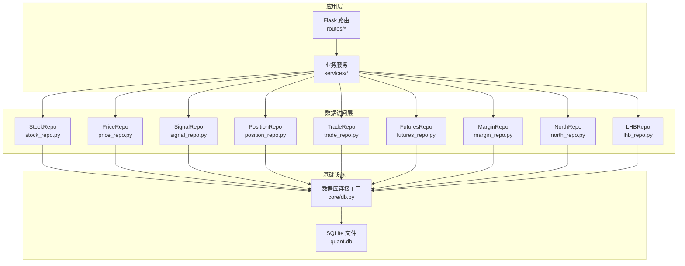
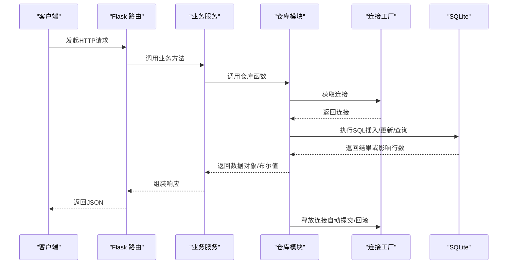
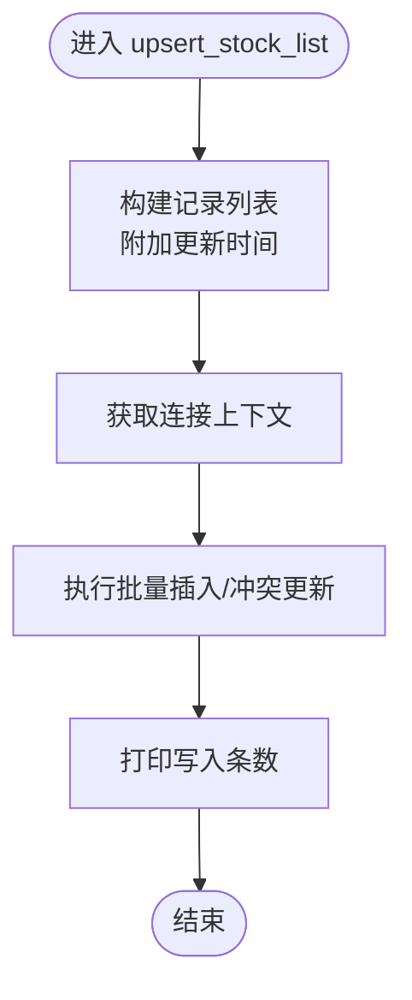
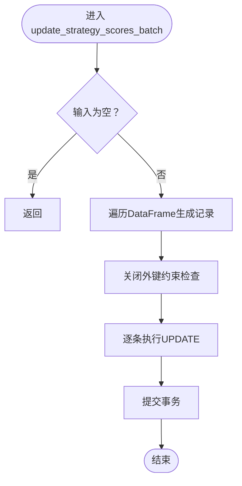
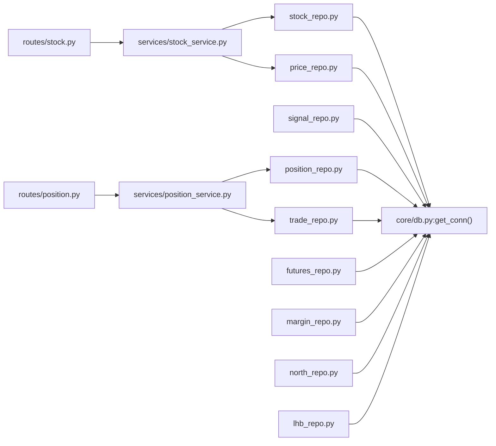

# 仓库模式实现

<cite>
**本文引用的文件**
- [core/repository/__init__.py](file://core/repository/__init__.py)
- [core/db.py](file://core/db.py)
- [core/repository/stock_repo.py](file://core/repository/stock_repo.py)
- [core/repository/price_repo.py](file://core/repository/price_repo.py)
- [core/repository/signal_repo.py](file://core/repository/signal_repo.py)
- [core/repository/position_repo.py](file://core/repository/position_repo.py)
- [core/repository/trade_repo.py](file://core/repository/trade_repo.py)
- [core/repository/futures_repo.py](file://core/repository/futures_repo.py)
- [core/repository/margin_repo.py](file://core/repository/margin_repo.py)
- [core/repository/north_repo.py](file://core/repository/north_repo.py)
- [core/repository/lhb_repo.py](file://core/repository/lhb_repo.py)
- [services/stock_service.py](file://services/stock_service.py)
- [services/position_service.py](file://services/position_service.py)
- [routes/stock.py](file://routes/stock.py)
- [routes/position.py](file://routes/position.py)
- [tests/test_repository.py](file://tests/test_repository.py)
</cite>

## 目录
1. [简介](#简介)
2. [项目结构](#项目结构)
3. [核心组件](#核心组件)
4. [架构总览](#架构总览)
5. [详细组件分析](#详细组件分析)
6. [依赖分析](#依赖分析)
7. [性能考虑](#性能考虑)
8. [故障排查指南](#故障排查指南)
9. [结论](#结论)
10. [附录](#附录)

## 简介
本文件系统化阐述 AIQuant 项目中“仓库模式”的实现与应用，重点说明数据访问层的职责划分、统一抽象与封装机制，以及其在量化系统中的价值。仓库模式通过将每个表的 CRUD 操作集中在一个模块中，屏蔽底层数据库细节，提升代码复用性、可测试性与可维护性。本文覆盖以下仓库类及其职责：
- StockRepo：股票信息仓库（stock_info）
- PriceRepo：日线行情仓库（daily_price/index_daily）
- SignalRepo：信号记录仓库（signal_records/stock_signal）
- PositionRepo：持仓仓库（positions）
- TradeRepo：交易记录与账户快照仓库（trades/account_snapshots）
- FuturesRepo/MarginRepo/NorthRepo/LHBRepo：扩展主题数据仓库

同时，本文解释仓库模式与数据库连接管理的关系、错误处理与事务管理策略、性能优化建议，并给出使用示例与最佳实践。

## 项目结构
仓库模式位于 core/repository 目录，采用“按表拆分”的数据访问层组织方式，每个仓库负责单一表的 CRUD 与常用查询。核心数据库连接管理由 core/db 提供，仓库模块通过统一的连接工厂获取连接，确保事务一致性与资源回收。

**图示来源**
- [core/repository/__init__.py:1-7](file://core/repository/__init__.py#L1-L7)
- [core/db.py:26-40](file://core/db.py#L26-L40)
- [core/repository/stock_repo.py:8-10](file://core/repository/stock_repo.py#L8-L10)
- [core/repository/price_repo.py:8-10](file://core/repository/price_repo.py#L8-L10)
- [core/repository/signal_repo.py:9-11](file://core/repository/signal_repo.py#L9-L11)
- [core/repository/position_repo.py:7-9](file://core/repository/position_repo.py#L7-L9)
- [core/repository/trade_repo.py:7-9](file://core/repository/trade_repo.py#L7-L9)
- [core/repository/futures_repo.py:7-9](file://core/repository/futures_repo.py#L7-L9)
- [core/repository/margin_repo.py:7-9](file://core/repository/margin_repo.py#L7-L9)
- [core/repository/north_repo.py:7-9](file://core/repository/north_repo.py#L7-L9)
- [core/repository/lhb_repo.py:7-9](file://core/repository/lhb_repo.py#L7-L9)

**章节来源**
- [core/repository/__init__.py:1-7](file://core/repository/__init__.py#L1-L7)

## 核心组件
- StockRepo（股票信息仓库）
  - 职责：批量写入/更新股票列表、更新股本信息、查询股票清单与名称映射
  - 关键函数：upsert_stock_list、batch_update_market_cap、get_all_stocks、get_stock_name、get_market_cap_map
- PriceRepo（日线行情仓库）
  - 职责：批量写入日线行情、更新策略评分、查询日线/指数行情、查询最新交易日、统计股票数量
  - 关键函数：upsert_daily_price、update_strategy_scores_batch、get_daily_price、upsert_index_daily、get_index_daily、get_latest_date、get_latest_date_all、has_today_data、get_stock_count_in_db
- SignalRepo（信号记录仓库）
  - 职责：保存策略筛选结果与扫描推荐、查询当日/历史信号
  - 关键函数：save_signals、save_scan_signals、get_signals、get_today_signals
- PositionRepo（持仓仓库）
  - 职责：新增/平仓/部分平仓、更新当前价、查询持仓、按 ID/代码查询、删除、汇总统计
  - 关键函数：add_position、close_position、partial_close_position、update_position_price、get_positions、get_position_by_id、get_position_by_code、delete_position、get_position_summary
- TradeRepo（交易记录与账户快照仓库）
  - 职责：新增交易记录、查询交易、保存账户快照、查询最近快照、查询最新快照
  - 关键函数：add_trade、get_trades、save_account_snapshot、get_account_snapshots、get_latest_snapshot
- 扩展主题仓库
  - FuturesRepo：指数期货数据入库与查询
  - MarginRepo：融资融券汇总与明细入库与查询
  - NorthRepo：北向资金数据入库与查询
  - LHBRepo：龙虎榜明细入库与查询

这些仓库均通过统一的连接工厂获取连接，保证事务控制与资源释放的一致性。

**章节来源**
- [core/repository/stock_repo.py:13-80](file://core/repository/stock_repo.py#L13-L80)
- [core/repository/price_repo.py:13-237](file://core/repository/price_repo.py#L13-L237)
- [core/repository/signal_repo.py:14-119](file://core/repository/signal_repo.py#L14-L119)
- [core/repository/position_repo.py:12-138](file://core/repository/position_repo.py#L12-L138)
- [core/repository/trade_repo.py:12-77](file://core/repository/trade_repo.py#L12-L77)
- [core/repository/futures_repo.py:27-109](file://core/repository/futures_repo.py#L27-L109)
- [core/repository/margin_repo.py:29-186](file://core/repository/margin_repo.py#L29-L186)
- [core/repository/north_repo.py:27-117](file://core/repository/north_repo.py#L27-L117)
- [core/repository/lhb_repo.py:27-99](file://core/repository/lhb_repo.py#L27-L99)

## 架构总览
仓库模式将“业务服务”与“数据持久化”解耦，业务服务通过调用仓库函数完成数据操作，避免直接嵌入 SQL 与连接管理逻辑。统一的连接工厂提供事务语义与资源回收，确保异常时自动回滚与连接关闭。

**图示来源**
- [core/db.py:26-40](file://core/db.py#L26-L40)
- [core/repository/stock_repo.py:18-28](file://core/repository/stock_repo.py#L18-L28)
- [core/repository/price_repo.py:36-47](file://core/repository/price_repo.py#L36-L47)
- [core/repository/signal_repo.py:22-43](file://core/repository/signal_repo.py#L22-L43)
- [core/repository/position_repo.py:16-24](file://core/repository/position_repo.py#L16-L24)
- [core/repository/trade_repo.py:16-23](file://core/repository/trade_repo.py#L16-L23)

## 详细组件分析

### StockRepo（股票信息仓库）
- 设计要点
  - 使用“按主键冲突更新”的写入策略，保证幂等性
  - 提供批量更新与单条更新能力，兼顾性能与灵活性
  - 查询接口支持活跃股票过滤与名称映射
- 数据结构与复杂度
  - 写入：executemany 批处理，时间复杂度 O(n)
  - 查询：基于索引的条件查询，时间复杂度近似 O(log n) + 结果集
- 错误处理与事务
  - 仓库内部使用上下文管理器获取连接，异常自动回滚
- 最佳实践
  - 批量写入前先构造好记录列表，减少多次往返
  - 使用 get_market_cap_map 进行内存级映射，降低重复查询成本

**图示来源**
- [core/repository/stock_repo.py:13-28](file://core/repository/stock_repo.py#L13-L28)

**章节来源**
- [core/repository/stock_repo.py:13-80](file://core/repository/stock_repo.py#L13-L80)

### PriceRepo（日线行情仓库）
- 设计要点
  - 支持日线与指数行情分别入库，统一使用 ON CONFLICT 更新
  - 策略评分独立批量更新，避免频繁写入行情主表
  - 提供日期格式化与范围查询，便于回测与分析
- 数据结构与复杂度
  - upsert_daily_price：O(n)
  - update_strategy_scores_batch：逐条 UPDATE，注意 PRAGMA foreign_keys=OFF 以提升性能
  - get_daily_price/get_index_daily：基于索引的范围查询，O(k) + 排序
- 错误处理与事务
  - 评分更新显式 commit，确保批量更新原子性
- 最佳实践
  - 回测前先写入行情，再单独写入策略评分
  - 使用 get_latest_date/get_latest_date_all 判断数据新鲜度

**图示来源**
- [core/repository/price_repo.py:50-93](file://core/repository/price_repo.py#L50-L93)

**章节来源**
- [core/repository/price_repo.py:13-237](file://core/repository/price_repo.py#L13-L237)

### SignalRepo（信号记录仓库）
- 设计要点
  - 两套存储：signal_records（历史筛选记录）、stock_signal（扫描推荐）
  - 保存时统一注入扫描时间与交易日，便于后续统计
- 数据结构与复杂度
  - 保存：executemany，O(n)
  - 查询：基于日期与限制条数，O(k)
- 最佳实践
  - 推送微信后标记 sent_wechat 字段，便于后续去重与统计

**章节来源**
- [core/repository/signal_repo.py:14-119](file://core/repository/signal_repo.py#L14-L119)

### PositionRepo（持仓仓库）
- 设计要点
  - 支持新增、全平、部分平仓、更新当前价、按状态/ID/代码查询、删除、汇总
  - 部分平仓逻辑：先减仓，再新增一条已平仓记录，保持审计完整性
- 数据结构与复杂度
  - 新增：INSERT，O(1)
  - 部分平仓：UPDATE + INSERT，O(1)
  - 汇总：全表聚合，O(n)
- 最佳实践
  - 平仓时同时计算 pnl 与 pnl_pct，便于前端展示
  - 定期刷新 current_price，结合风控策略使用

**章节来源**
- [core/repository/position_repo.py:12-138](file://core/repository/position_repo.py#L12-L138)

### TradeRepo（交易记录与账户快照仓库）
- 设计要点
  - 交易记录与账户快照分离存储，支持按代码/日期查询
  - 账户快照使用 ON CONFLICT 更新，避免重复写入
- 数据结构与复杂度
  - 新增交易：INSERT，O(1)
  - 保存快照：INSERT/UPDATE，O(1)
- 最佳实践
  - 回测/实盘结束后保存当日快照，便于复盘

**章节来源**
- [core/repository/trade_repo.py:12-77](file://core/repository/trade_repo.py#L12-L77)

### 扩展主题仓库（Futures/Margin/North/LHB）
- 设计要点
  - 统一清洗与格式化逻辑（日期、数值），保证入库一致性
  - 使用 ON CONFLICT 更新，支持增量同步
- 最佳实践
  - 同步前先清理缺失字段，避免空值污染
  - 按品种/日期范围查询，支持多维度分析

**章节来源**
- [core/repository/futures_repo.py:27-109](file://core/repository/futures_repo.py#L27-L109)
- [core/repository/margin_repo.py:29-186](file://core/repository/margin_repo.py#L29-L186)
- [core/repository/north_repo.py:27-117](file://core/repository/north_repo.py#L27-L117)
- [core/repository/lhb_repo.py:27-99](file://core/repository/lhb_repo.py#L27-L99)

## 依赖分析
- 仓库模块依赖关系
  - 所有仓库模块均依赖 core/db 的连接工厂，确保事务与资源管理一致
  - 业务服务与路由层通过仓库模块间接依赖数据库
- 外部依赖
  - pandas 用于数据结构转换与批量处理
  - sqlite3 作为本地存储引擎

**图示来源**
- [core/repository/stock_repo.py:8-10](file://core/repository/stock_repo.py#L8-L10)
- [core/repository/price_repo.py:8-10](file://core/repository/price_repo.py#L8-L10)
- [core/repository/signal_repo.py:9-11](file://core/repository/signal_repo.py#L9-L11)
- [core/repository/position_repo.py:7-9](file://core/repository/position_repo.py#L7-L9)
- [core/repository/trade_repo.py:7-9](file://core/repository/trade_repo.py#L7-L9)
- [core/repository/futures_repo.py:7-9](file://core/repository/futures_repo.py#L7-L9)
- [core/repository/margin_repo.py:7-9](file://core/repository/margin_repo.py#L7-L9)
- [core/repository/north_repo.py:7-9](file://core/repository/north_repo.py#L7-L9)
- [core/repository/lhb_repo.py:7-9](file://core/repository/lhb_repo.py#L7-L9)
- [services/stock_service.py:8](file://services/stock_service.py#L8)
- [services/position_service.py:8](file://services/position_service.py#L8)
- [routes/stock.py:10](file://routes/stock.py#L10)
- [routes/position.py:8](file://routes/position.py#L8)

**章节来源**
- [core/db.py:26-40](file://core/db.py#L26-L40)
- [services/stock_service.py:8](file://services/stock_service.py#L8)
- [services/position_service.py:8](file://services/position_service.py#L8)
- [routes/stock.py:10](file://routes/stock.py#L10)
- [routes/position.py:8](file://routes/position.py#L8)

## 性能考虑
- 连接与事务
  - 使用 WAL 模式与 NORMAL 同步策略，在并发与可靠性间取得平衡
  - 上下文管理器确保异常自动回滚与连接关闭，避免资源泄漏
- 批量写入
  - executemany 与 ON CONFLICT 更新显著降低往返次数
  - 策略评分批量更新显式关闭外键检查，减少约束校验开销
- 索引与查询
  - 为高频查询字段建立复合索引与单列索引，加速范围查询与去重
- 数据类型与清洗
  - 统一日期格式与数值清洗，减少无效写入与后续解析成本
- I/O 与缓存
  - 对热点查询结果进行内存映射（如股本映射），减少重复查询

**章节来源**
- [core/db.py:26-40](file://core/db.py#L26-L40)
- [core/repository/price_repo.py:80-92](file://core/repository/price_repo.py#L80-L92)
- [core/repository/stock_repo.py:53-59](file://core/repository/stock_repo.py#L53-L59)

## 故障排查指南
- 常见问题
  - 写入失败或数据未更新：检查连接是否在异常时被回滚；确认 ON CONFLICT 条件是否匹配
  - 策略评分未更新：确认 update_strategy_scores_batch 是否显式提交；检查 PRAGMA 设置
  - 查询为空：确认日期格式与范围；检查索引是否存在
- 调试建议
  - 在仓库函数入口打印关键参数与影响行数，便于定位问题
  - 使用 get_latest_date/get_latest_date_all 校验数据新鲜度
  - 对于持仓与交易，核对状态字段与关联关系
- 单元测试
  - 通过 tests/test_repository.py 验证仓库函数可导入与签名正确

**章节来源**
- [tests/test_repository.py:11-82](file://tests/test_repository.py#L11-L82)

## 结论
仓库模式在 AIQuant 中实现了数据访问层的清晰职责划分与统一抽象，显著提升了系统的可维护性与可测试性。通过统一的连接工厂与事务管理，仓库模块屏蔽了数据库细节，使业务服务专注于领域逻辑。配合批量写入、索引优化与数据清洗策略，系统在性能与稳定性方面表现良好。建议在新功能开发中优先使用仓库模块，逐步替换遗留的直接数据库访问代码。

## 附录

### 使用示例与最佳实践
- 股票列表入库
  - 步骤：准备记录列表 → 调用 upsert_stock_list → 校验写入条数
  - 参考路径：[core/repository/stock_repo.py:13-28](file://core/repository/stock_repo.py#L13-L28)
- 日线行情入库与评分更新
  - 步骤：DataFrame 转换 → upsert_daily_price → update_strategy_scores_batch
  - 参考路径：[core/repository/price_repo.py:13-47](file://core/repository/price_repo.py#L13-L47)、[core/repository/price_repo.py:50-93](file://core/repository/price_repo.py#L50-L93)
- 信号保存
  - 步骤：组装信号列表 → save_signals/save_scan_signals
  - 参考路径：[core/repository/signal_repo.py:14-43](file://core/repository/signal_repo.py#L14-L43)、[core/repository/signal_repo.py:46-99](file://core/repository/signal_repo.py#L46-L99)
- 新增/平仓/部分平仓
  - 步骤：add_position → close_position/partial_close_position → 更新当前价
  - 参考路径：[core/repository/position_repo.py:12-74](file://core/repository/position_repo.py#L12-L74)
- 交易与账户快照
  - 步骤：add_trade → save_account_snapshot → get_account_snapshots
  - 参考路径：[core/repository/trade_repo.py:12-58](file://core/repository/trade_repo.py#L12-L58)
- 路由与服务集成
  - 参考路径：[routes/stock.py:27-87](file://routes/stock.py#L27-L87)、[routes/position.py:15-115](file://routes/position.py#L15-L115)
  - 服务层封装：[services/stock_service.py:23-45](file://services/stock_service.py#L23-L45)、[services/position_service.py:12-58](file://services/position_service.py#L12-L58)

### 错误处理与事务管理
- 事务语义
  - 连接工厂在 try 块结束时提交，异常时回滚，finally 关闭连接
  - 评分批量更新显式 commit，确保原子性
- 异常传播
  - 仓库层不吞掉异常，交由上层服务与路由处理
- 最佳实践
  - 在业务服务层捕获并记录异常，返回友好错误信息
  - 对于幂等写入（ON CONFLICT），无需重复处理冲突

**章节来源**
- [core/db.py:26-40](file://core/db.py#L26-L40)
- [core/repository/price_repo.py:80-92](file://core/repository/price_repo.py#L80-L92)