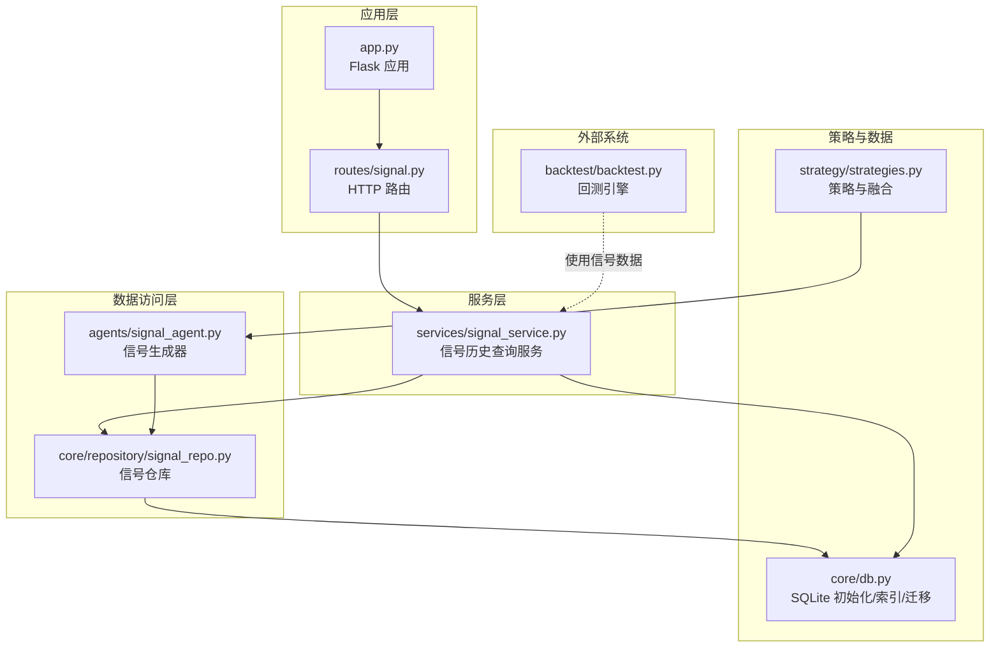
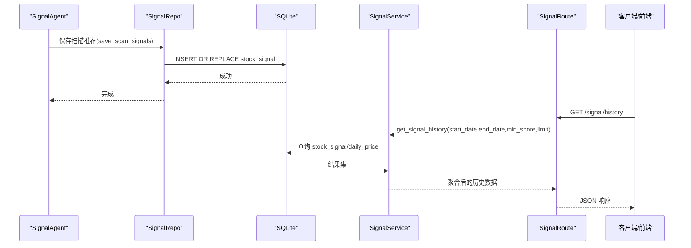
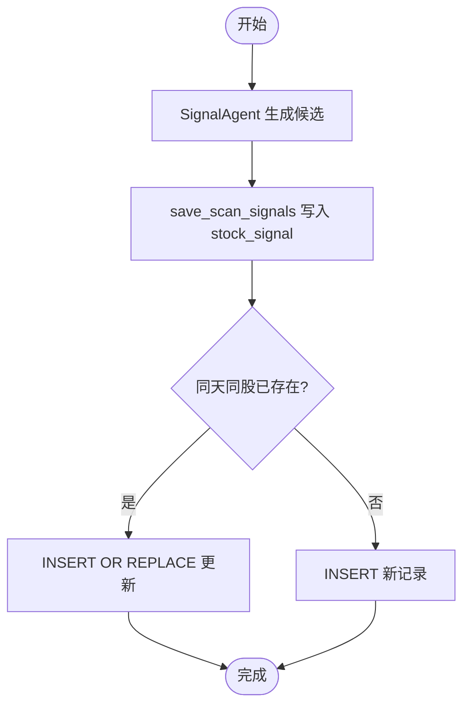
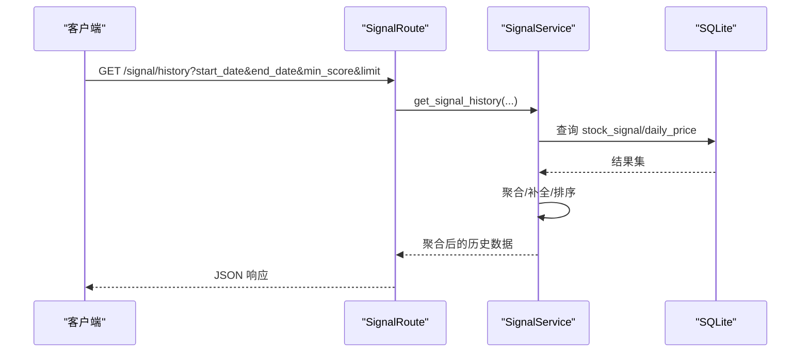
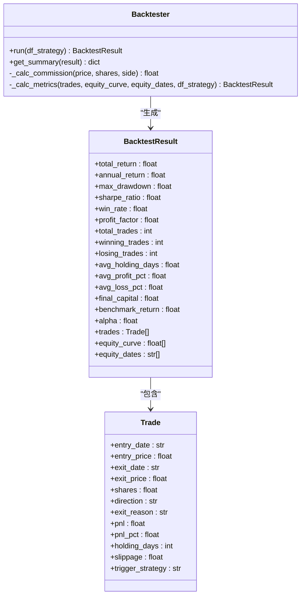
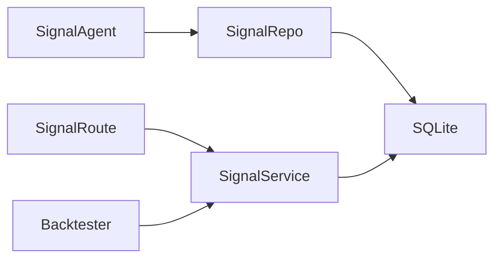

# 信号记录仓库

<cite>
**本文引用的文件**
- [signal_repo.py](file://core/repository/signal_repo.py)
- [signal_service.py](file://services/signal_service.py)
- [signal.py](file://routes/signal.py)
- [db.py](file://core/db.py)
- [signal_agent.py](file://agents/signal_agent.py)
- [strategies.py](file://strategy/strategies.py)
- [backtest.py](file://backtest/backtest.py)
- [app.py](file://app.py)
</cite>

## 目录
1. [简介](#简介)
2. [项目结构](#项目结构)
3. [核心组件](#核心组件)
4. [架构总览](#架构总览)
5. [详细组件分析](#详细组件分析)
6. [依赖关系分析](#依赖关系分析)
7. [性能考量](#性能考量)
8. [故障排查指南](#故障排查指南)
9. [结论](#结论)
10. [附录](#附录)

## 简介
本文件为 AIQuant 的 SignalRepo 信号记录仓库提供系统化技术文档，覆盖以下主题：
- 信号存储格式与字段定义（信号类型、时间戳、股票代码、信号强度等）
- 查询接口与服务层设计（历史查询、分页与过滤）
- 信号数据生命周期管理（生成、更新、过期策略）
- 使用示例（查询、统计分析、回测数据准备）
- 索引优化与查询性能提升策略

## 项目结构
围绕信号仓库的关键文件组织如下：
- 数据访问层：core/repository/signal_repo.py
- 服务层：services/signal_service.py
- 路由层：routes/signal.py
- 数据库与表结构：core/db.py
- 信号生成器：agents/signal_agent.py
- 策略与融合：strategy/strategies.py
- 回测引擎：backtest/backtest.py
- 应用入口：app.py

图表来源
- [app.py:1-164](file://app.py#L1-L164)
- [routes/signal.py:1-46](file://routes/signal.py#L1-L46)
- [services/signal_service.py:1-243](file://services/signal_service.py#L1-L243)
- [core/repository/signal_repo.py:1-119](file://core/repository/signal_repo.py#L1-L119)
- [agents/signal_agent.py:1-213](file://agents/signal_agent.py#L1-L213)
- [strategy/strategies.py:1-200](file://strategy/strategies.py#L1-L200)
- [core/db.py:112-154](file://core/db.py#L112-L154)
- [backtest/backtest.py:1-517](file://backtest/backtest.py#L1-L517)

章节来源
- [app.py:1-164](file://app.py#L1-L164)
- [routes/signal.py:1-46](file://routes/signal.py#L1-L46)
- [services/signal_service.py:1-243](file://services/signal_service.py#L1-L243)
- [core/repository/signal_repo.py:1-119](file://core/repository/signal_repo.py#L1-L119)
- [agents/signal_agent.py:1-213](file://agents/signal_agent.py#L1-L213)
- [strategy/strategies.py:1-200](file://strategy/strategies.py#L1-L200)
- [core/db.py:112-154](file://core/db.py#L112-L154)
- [backtest/backtest.py:1-517](file://backtest/backtest.py#L1-L517)

## 核心组件
- 信号仓库（数据访问层）
  - 提供保存筛选结果与扫描推荐的接口，支持批量插入与去重更新。
  - 字段涵盖时间戳、交易日、股票代码、名称、价格、评分、止盈止损、买卖金额/手数、微信推送标记等。
- 信号服务（服务层）
  - 提供历史查询接口，支持按日期范围、最低评分、限制条数等条件过滤。
  - 支持“融合信号”和“超跌反弹”两类历史推荐的聚合与补全。
- 信号路由（路由层）
  - 对外暴露 HTTP 接口，接收日期范围、最低评分、限制条数等参数。
- 数据库与索引
  - 初始化 stock_signal 与 signal_records 表，并建立唯一索引与普通索引以优化查询。
- 信号生成器
  - 运行多策略融合与超跌反弹策略，生成候选列表并保存至 stock_signal 表。
- 回测引擎
  - 使用信号数据进行 T+1 回测，支持止损止盈、动态仓位、熔断风控等。

章节来源
- [core/repository/signal_repo.py:14-119](file://core/repository/signal_repo.py#L14-L119)
- [services/signal_service.py:12-243](file://services/signal_service.py#L12-L243)
- [routes/signal.py:12-46](file://routes/signal.py#L12-L46)
- [core/db.py:112-154](file://core/db.py#L112-L154)
- [agents/signal_agent.py:41-108](file://agents/signal_agent.py#L41-L108)
- [backtest/backtest.py:56-410](file://backtest/backtest.py#L56-L410)

## 架构总览
信号仓库贯穿“生成 → 存储 → 查询 → 回测”的完整链路，采用分层设计，职责清晰。

图表来源
- [agents/signal_agent.py:85-93](file://agents/signal_agent.py#L85-L93)
- [core/repository/signal_repo.py:46-99](file://core/repository/signal_repo.py#L46-L99)
- [core/db.py:112-154](file://core/db.py#L112-L154)
- [services/signal_service.py:12-122](file://services/signal_service.py#L12-L122)
- [routes/signal.py:12-27](file://routes/signal.py#L12-L27)

## 详细组件分析

### 信号存储格式与字段管理
- stock_signal 表（每日策略扫描推荐）
  - 关键字段：scan_date、trade_date、code、name、price、fusion_score、vol_score、ma_score、diverge_score、bottom_score、whale_score、trigger_list、buy_price、stop_loss、take_profit、buy_volume、buy_money、sent_wechat、created_at
  - 索引：唯一索引 idx_sig_scan_trade_code(scan_date, code)，普通索引 idx_sig_trade_date(trade_date)
- signal_records 表（旧表，兼容用）
  - 关键字段：scan_time、trade_date、code、name、price、score、stop_loss、take_profit、buy_volume、buy_money、sent_wechat、note
  - 索引：idx_signal_date(trade_date)

字段含义与用途
- 时间戳类：scan_time（旧表）、scan_date/trade_date（新表），用于区分扫描日期与交易日期
- 股票标识：code/name
- 价格与强度：price、fusion_score、vol_score、ma_score、diverge_score、bottom_score、whale_score
- 止盈止损：stop_loss、take_profit
- 买卖规模：buy_volume（手）、buy_money（元）
- 触发条件：trigger_list（JSON 字符串，如“放量突破”、“均线粘合”等）
- 微信推送：sent_wechat（0/1）
- 创建时间：created_at（新表）

章节来源
- [core/db.py:112-154](file://core/db.py#L112-L154)
- [core/repository/signal_repo.py:46-99](file://core/repository/signal_repo.py#L46-L99)
- [core/repository/signal_repo.py:14-44](file://core/repository/signal_repo.py#L14-L44)

### 信号生成与生命周期管理
- 生成阶段
  - SignalAgent 运行多策略融合与超跌反弹策略，生成候选列表，调用 save_scan_signals 写入 stock_signal
  - 生成逻辑包含评分缩放、止盈止损计算、触发列表构建等
- 更新与去重
  - stock_signal 使用“INSERT OR REPLACE”，保证同一天同一股票的记录被替换，避免重复
- 过期处理
  - 代码未显式实现自动过期删除；可通过业务策略定期清理旧数据或在查询侧限定日期范围

图表来源
- [agents/signal_agent.py:85-93](file://agents/signal_agent.py#L85-L93)
- [core/repository/signal_repo.py:86-99](file://core/repository/signal_repo.py#L86-L99)

章节来源
- [agents/signal_agent.py:41-108](file://agents/signal_agent.py#L41-L108)
- [core/repository/signal_repo.py:46-99](file://core/repository/signal_repo.py#L46-L99)

### 查询接口与服务层
- 历史查询接口
  - get_signal_history：融合信号历史推荐，支持评分阈值、日期范围、限制条数，自动补全不足日期的推荐
  - get_signal_history_v4：超跌反弹历史推荐，按“超跌反弹”标签过滤
- 参数与行为
  - start_date/end_date：日期范围
  - min_score：最低融合评分
  - limit：每日期限
  - 返回结构：包含起止日期、日期列表、分组后的推荐集合

图表来源
- [routes/signal.py:12-27](file://routes/signal.py#L12-L27)
- [services/signal_service.py:12-122](file://services/signal_service.py#L12-L122)

章节来源
- [routes/signal.py:12-46](file://routes/signal.py#L12-L46)
- [services/signal_service.py:12-243](file://services/signal_service.py#L12-L243)

### 回测数据准备与使用
- 回测引擎使用信号数据进行 T+1 执行，支持：
  - 止损止盈
  - 动态仓位（基于 ATR 波动率）
  - 大盘择时（均线过滤）
  - 熔断风控（回撤与连续亏损）
- 信号溯源：识别触发策略（放量突破、均线粘合、量价背离、抄底、主力建仓）
- 交易成本：手续费与印花税、滑点

图表来源
- [backtest/backtest.py:16-494](file://backtest/backtest.py#L16-L494)

章节来源
- [backtest/backtest.py:56-410](file://backtest/backtest.py#L56-L410)

## 依赖关系分析
- SignalAgent 依赖策略模块与数据库读写，生成候选并保存至 stock_signal
- SignalService 依赖数据库连接与表结构，负责跨表聚合与补全
- SignalRepo 依赖数据库连接，提供批量写入与去重更新
- 路由层依赖服务层，对外提供 HTTP 接口
- 回测引擎依赖信号数据与策略评分列，进行 T+1 回测

图表来源
- [agents/signal_agent.py:17-28](file://agents/signal_agent.py#L17-L28)
- [core/repository/signal_repo.py:9-11](file://core/repository/signal_repo.py#L9-L11)
- [services/signal_service.py:9](file://services/signal_service.py#L9)
- [routes/signal.py:9](file://routes/signal.py#L9)
- [backtest/backtest.py:161](file://backtest/backtest.py#L161)

章节来源
- [agents/signal_agent.py:17-28](file://agents/signal_agent.py#L17-L28)
- [core/repository/signal_repo.py:9-11](file://core/repository/signal_repo.py#L9-L11)
- [services/signal_service.py:9](file://services/signal_service.py#L9)
- [routes/signal.py:9](file://routes/signal.py#L9)
- [backtest/backtest.py:161](file://backtest/backtest.py#L161)

## 性能考量
- 索引优化
  - stock_signal：唯一索引 idx_sig_scan_trade_code(scan_date, code)、普通索引 idx_sig_trade_date(trade_date)
  - signal_records：普通索引 idx_signal_date(trade_date)
  - daily_price：idx_daily_code_date(code, trade_date)、idx_daily_date(trade_date)
- 查询优化建议
  - 优先使用 trade_date 过滤与 LIMIT 控制结果集大小
  - 对 trigger_list 进行 JSON 解析时注意异常处理与缓存
  - 聚合时尽量减少跨表 JOIN，必要时先提取日期集合再批量查询
- 写入优化
  - 使用 INSERT OR REPLACE 保证幂等，避免重复写入
  - 批量插入 executemany 提升吞吐
- 数据库配置
  - WAL 模式与 NORMAL 同步提升并发写入性能
  - row_factory=sqlite3.Row 便于字典式访问

章节来源
- [core/db.py:112-154](file://core/db.py#L112-L154)
- [core/repository/signal_repo.py:22-43](file://core/repository/signal_repo.py#L22-L43)
- [services/signal_service.py:29-41](file://services/signal_service.py#L29-L41)

## 故障排查指南
- 常见问题
  - 查询无结果：确认日期范围是否正确、是否超过数据存在区间
  - 评分异常：检查策略评分列是否存在、是否为空或 NaN
  - JSON 解析失败：trigger_list 可能为字符串或数组，需容错处理
  - 写入冲突：stock_signal 已有同天同股记录，INSERT OR REPLACE 会更新
- 日志与调试
  - 服务层捕获异常并返回错误信息
  - 路由层打印堆栈以便定位问题
- 建议
  - 在生产环境增加数据库连接池与超时设置
  - 对高频查询增加缓存层（如 Redis）以减轻数据库压力

章节来源
- [services/signal_service.py:48-52](file://services/signal_service.py#L48-L52)
- [routes/signal.py:24-27](file://routes/signal.py#L24-L27)

## 结论
SignalRepo 通过清晰的分层设计与完善的索引策略，实现了信号的高效生成、存储与查询。结合服务层的历史聚合与补全能力，以及回测引擎的 T+1 执行模型，为策略研究与实盘回测提供了可靠的数据基础。建议在生产环境中进一步引入缓存与连接池，并持续优化查询路径与索引覆盖。

## 附录

### 使用示例

- 查询融合信号历史
  - 请求：GET /signal/history?start_date=YYYY-MM-DD&end_date=YYYY-MM-DD&min_score=15&limit=100
  - 返回：包含日期列表与按日期分组的推荐集合
- 查询超跌反弹历史
  - 请求：GET /signal/history_v4?start_date=YYYY-MM-DD&end_date=YYYY-MM-DD&min_score=15&limit=50
  - 返回：仅包含“超跌反弹”标签的推荐
- 回测数据准备
  - 从服务层获取历史推荐，转换为 DataFrame，包含 BUY_SIGNAL/SELL_SIGNAL 与策略评分列，交由回测引擎执行 T+1 回测

章节来源
- [routes/signal.py:12-46](file://routes/signal.py#L12-L46)
- [services/signal_service.py:12-243](file://services/signal_service.py#L12-L243)
- [backtest/backtest.py:121-410](file://backtest/backtest.py#L121-L410)