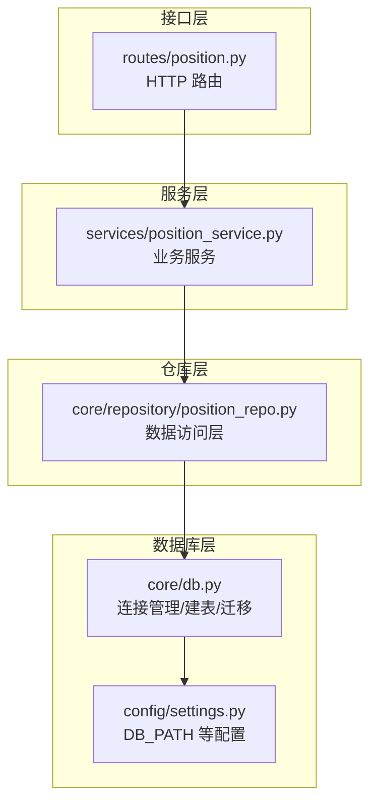
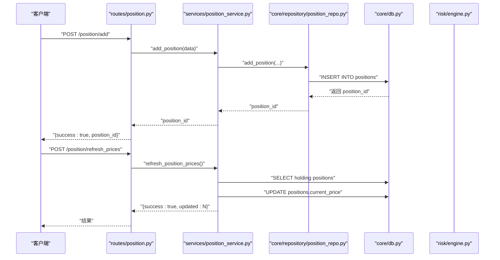
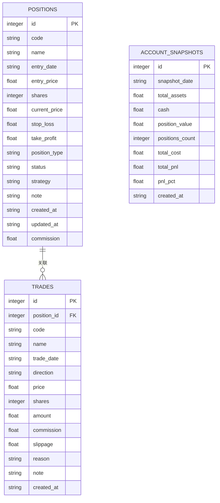
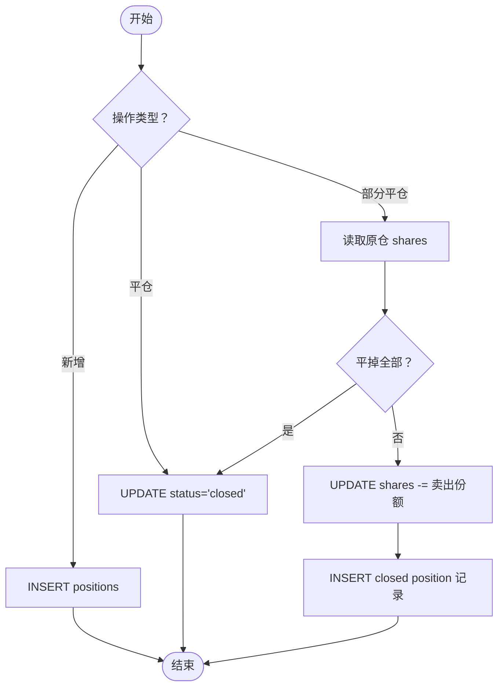
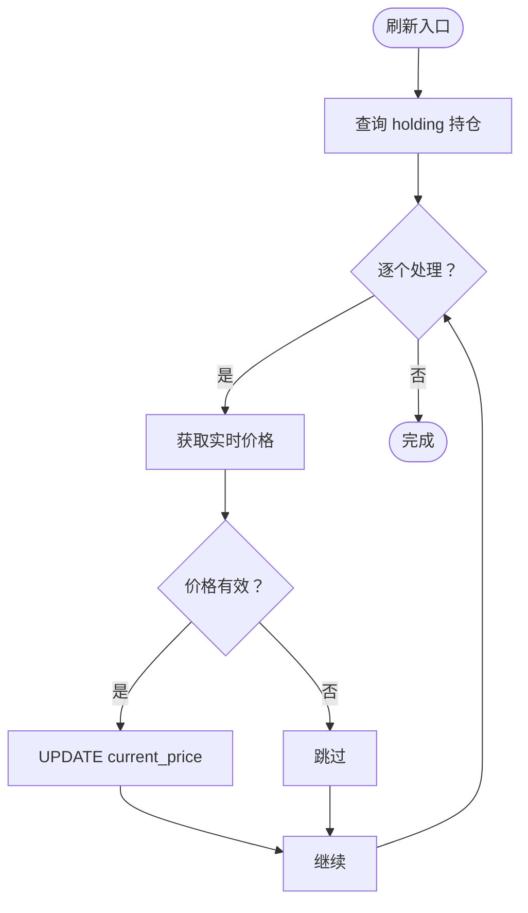
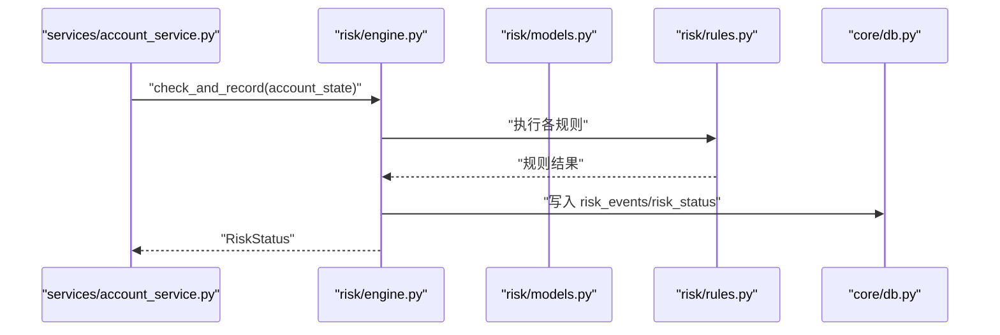
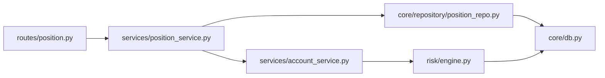

# 持仓管理仓库

<cite>
**本文引用的文件**
- [position_repo.py](file://core/repository/position_repo.py)
- [position_service.py](file://services/position_service.py)
- [position.py](file://routes/position.py)
- [db.py](file://core/db.py)
- [settings.py](file://config/settings.py)
- [account_service.py](file://services/account_service.py)
- [engine.py](file://risk/engine.py)
- [models.py](file://risk/models.py)
- [rules.py](file://risk/rules.py)
- [test_repository.py](file://tests/test_repository.py)
</cite>

## 目录
1. [简介](#简介)
2. [项目结构](#项目结构)
3. [核心组件](#核心组件)
4. [架构总览](#架构总览)
5. [详细组件分析](#详细组件分析)
6. [依赖分析](#依赖分析)
7. [性能考虑](#性能考虑)
8. [故障排查指南](#故障排查指南)
9. [结论](#结论)
10. [附录](#附录)

## 简介
本文件系统性阐述 AIQuant 项目中的 PositionRepo 持仓管理仓库，覆盖以下方面：
- 持仓数据结构设计与表结构
- 管理接口与业务流程（当前持仓、历史持仓、平仓/部分平仓、价格刷新、汇总统计）
- 持仓计算逻辑（可用仓位、冻结仓位、持仓成本、浮动盈亏等）
- 使用示例（查询、调整、风险计算）
- 并发访问控制与数据一致性保障机制

## 项目结构
PositionRepo 所在层次清晰，采用“路由 → 服务 → 仓库 → 数据库”的分层架构，职责边界明确：
- 路由层负责 HTTP 接口与参数校验
- 服务层封装业务逻辑与计算
- 仓库层封装数据访问（SQL 操作）
- 数据库层提供连接管理与表结构

图表来源
- [position.py:1-116](file://routes/position.py#L1-L116)
- [position_service.py:1-80](file://services/position_service.py#L1-L80)
- [position_repo.py:1-138](file://core/repository/position_repo.py#L1-L138)
- [db.py:1-200](file://core/db.py#L1-L200)
- [settings.py:1-25](file://config/settings.py#L1-L25)

章节来源
- [position.py:1-116](file://routes/position.py#L1-L116)
- [position_service.py:1-80](file://services/position_service.py#L1-L80)
- [position_repo.py:1-138](file://core/repository/position_repo.py#L1-L138)
- [db.py:1-200](file://core/db.py#L1-L200)
- [settings.py:1-25](file://config/settings.py#L1-L25)

## 核心组件
- 数据表：positions（持仓记录）、trades（交易记录）、account_snapshots（账户快照）
- 仓库接口：新增、平仓、部分平仓、更新当前价、查询、汇总统计
- 服务接口：对外暴露的业务方法，补充浮动盈亏计算、批量刷新价格等
- 路由接口：REST API，统一入口
- 风控集成：通过风控引擎与规则，结合账户快照进行风控检查

章节来源
- [db.py:168-223](file://core/db.py#L168-L223)
- [position_repo.py:12-137](file://core/repository/position_repo.py#L12-L137)
- [position_service.py:12-79](file://services/position_service.py#L12-L79)
- [position.py:15-115](file://routes/position.py#L15-L115)

## 架构总览
下图展示从 HTTP 请求到数据库写入的完整调用链路，以及与风控模块的衔接。

图表来源
- [position.py:25-115](file://routes/position.py#L25-L115)
- [position_service.py:25-79](file://services/position_service.py#L25-L79)
- [position_repo.py:12-82](file://core/repository/position_repo.py#L12-L82)
- [db.py:26-39](file://core/db.py#L26-L39)

## 详细组件分析

### 数据模型与表结构
- positions 表：存储每笔持仓的代码、名称、入场日期/价格、份额、当前价、止盈止损、方向、状态、策略、备注、时间戳及手续费等
- trades 表：记录每笔交易明细（方向、价格、数量、金额、手续费、滑点、原因等）
- account_snapshots 表：账户资产快照（总资产、现金、持仓市值、总成本、总盈亏、盈亏率、记录时间）

图表来源
- [db.py:168-223](file://core/db.py#L168-L223)

章节来源
- [db.py:168-223](file://core/db.py#L168-L223)

### 仓库接口与处理逻辑
- 新增持仓：插入 positions，状态初始为“holding”，返回 position_id
- 平仓：更新 exit_date、exit_price、status 为“closed”，并可写入盈亏
- 部分平仓：若平掉全部份额则走平仓流程；否则减少原仓份额，并新增一条已平仓记录
- 更新当前价：用于浮动盈亏计算
- 查询接口：按状态列出、按 ID/代码查询、删除
- 汇总统计：计算总市值、总成本、总盈亏、总盈亏率、数量

图表来源
- [position_repo.py:12-74](file://core/repository/position_repo.py#L12-L74)

章节来源
- [position_repo.py:12-137](file://core/repository/position_repo.py#L12-L137)

### 服务层计算与扩展
- 浮动盈亏计算：基于 entry_price 与 current_price 计算单仓 pnl 与 pnl_pct
- 批量刷新：遍历 holding 持仓，拉取实时价格并更新 current_price
- 汇总统计：仓库层提供基础汇总，服务层可在此基础上扩展

图表来源
- [position_service.py:66-79](file://services/position_service.py#L66-L79)

章节来源
- [position_service.py:12-79](file://services/position_service.py#L12-L79)

### 路由层与参数校验
- /list：按 status 查询（默认 holding）
- /add：新增持仓
- /close：平仓（需 position_id、exit_price）
- /partial_close：部分平仓（需 position_id、exit_price、shares）
- /update_price：更新当前价
- /summary：汇总统计
- /delete：删除持仓
- /refresh_prices：批量刷新价格

章节来源
- [position.py:15-115](file://routes/position.py#L15-L115)

### 风控集成与账户快照
- 账户快照：服务层提供保存与查询账户快照的能力，包含总资产、现金、持仓市值、总成本、总盈亏、盈亏率等
- 风控引擎：根据账户状态、总仓位、可用资金等指标执行规则检查，输出整体风险等级与事件记录
- 规则示例：行业集中度、总仓位上限等

图表来源
- [account_service.py:10-31](file://services/account_service.py#L10-L31)
- [engine.py:51-71](file://risk/engine.py#L51-L71)
- [models.py:28-78](file://risk/models.py#L28-L78)
- [rules.py:276-289](file://risk/rules.py#L276-L289)

章节来源
- [account_service.py:10-31](file://services/account_service.py#L10-L31)
- [engine.py:1-168](file://risk/engine.py#L1-L168)
- [models.py:1-78](file://risk/models.py#L1-L78)
- [rules.py:257-289](file://risk/rules.py#L257-L289)

## 依赖分析
- 路由依赖服务层
- 服务层依赖仓库层
- 仓库层依赖数据库连接管理
- 风控模块独立于持仓模块，但共享数据库作为数据源

图表来源
- [position.py:1-116](file://routes/position.py#L1-L116)
- [position_service.py:1-80](file://services/position_service.py#L1-L80)
- [position_repo.py:1-138](file://core/repository/position_repo.py#L1-L138)
- [db.py:1-200](file://core/db.py#L1-L200)
- [account_service.py:1-31](file://services/account_service.py#L1-L31)
- [engine.py:1-168](file://risk/engine.py#L1-L168)

章节来源
- [position.py:1-116](file://routes/position.py#L1-L116)
- [position_service.py:1-80](file://services/position_service.py#L1-L80)
- [position_repo.py:1-138](file://core/repository/position_repo.py#L1-L138)
- [db.py:1-200](file://core/db.py#L1-L200)
- [account_service.py:1-31](file://services/account_service.py#L1-L31)
- [engine.py:1-168](file://risk/engine.py#L1-L168)

## 性能考虑
- 连接管理：使用 WAL 模式与 NORMAL 同步策略，提升并发写入吞吐与可靠性
- 索引优化：positions 表对 code、status 建有索引，有利于高频查询
- 批量刷新：服务层提供批量刷新接口，避免逐条更新带来的网络与事务开销
- 事务边界：每个仓库方法内使用上下文管理器确保提交/回滚与连接释放

章节来源
- [db.py:26-39](file://core/db.py#L26-L39)
- [db.py:187-188](file://core/db.py#L187-L188)
- [position_service.py:66-79](file://services/position_service.py#L66-L79)

## 故障排查指南
- 参数缺失：路由层对必填字段进行校验，返回 400 错误
- 数据库异常：路由层捕获异常并返回 500，便于定位
- 事务回滚：数据库连接管理器在异常时自动回滚，避免脏写
- 测试验证：单元测试覆盖仓库导入与基础行为，确保接口可用性

章节来源
- [position.py:15-115](file://routes/position.py#L15-L115)
- [db.py:26-39](file://core/db.py#L26-L39)
- [test_repository.py:37-47](file://tests/test_repository.py#L37-L47)

## 结论
PositionRepo 以清晰的分层设计实现了对 positions 表的完整 CRUD 与统计能力，配合服务层的计算与风控模块，形成从数据到业务再到风控的闭环。通过 WAL 模式、索引与批量操作等手段，兼顾了性能与一致性；路由层的参数校验与异常处理提升了系统的健壮性。

## 附录

### 关键指标与计算逻辑
- 持仓成本：成本价 × 持有份额（sum(entry_price × shares)）
- 持仓市值：当前价 × 持有份额（sum(current_price × shares)）
- 浮动盈亏：市值 − 成本
- 盈亏率：浮动盈亏 ÷ 成本 × 100%
- 可用仓位：通常指未占用保证金的头寸，具体取决于保证金模型
- 冻结仓位：因挂单、强平或风控而暂时不可交易的头寸

章节来源
- [position_repo.py:120-137](file://core/repository/position_repo.py#L120-L137)
- [position_service.py:12-22](file://services/position_service.py#L12-L22)

### 使用示例（路径指引）
- 查询当前持仓：GET /position/list?status=holding
  - 参考：[position.py:15-22](file://routes/position.py#L15-L22)
- 新增持仓：POST /position/add
  - 参考：[position.py:25-32](file://routes/position.py#L25-L32)
- 平仓：POST /position/close
  - 参考：[position.py:35-48](file://routes/position.py#L35-L48)
- 部分平仓：POST /position/partial_close
  - 参考：[position.py:51-67](file://routes/position.py#L51-L67)
- 更新当前价：POST /position/update_price
  - 参考：[position.py:70-82](file://routes/position.py#L70-L82)
- 汇总统计：GET /position/summary
  - 参考：[position.py:85-91](file://routes/position.py#L85-L91)
- 删除持仓：POST /position/delete
  - 参考：[position.py:94-105](file://routes/position.py#L94-L105)
- 批量刷新价格：POST /position/refresh_prices
  - 参考：[position.py:108-115](file://routes/position.py#L108-L115)

### 并发访问控制与一致性
- 事务：每个仓库方法在独立事务中执行，异常自动回滚
- 连接池：通过上下文管理器确保连接复用与释放
- WAL 模式：提升并发写入稳定性
- 索引：对高频查询字段建立索引，降低锁竞争

章节来源
- [db.py:26-39](file://core/db.py#L26-L39)
- [db.py:187-188](file://core/db.py#L187-L188)