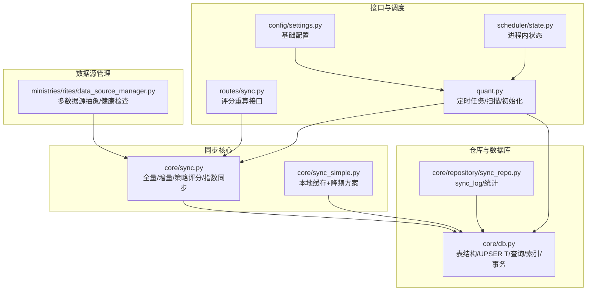
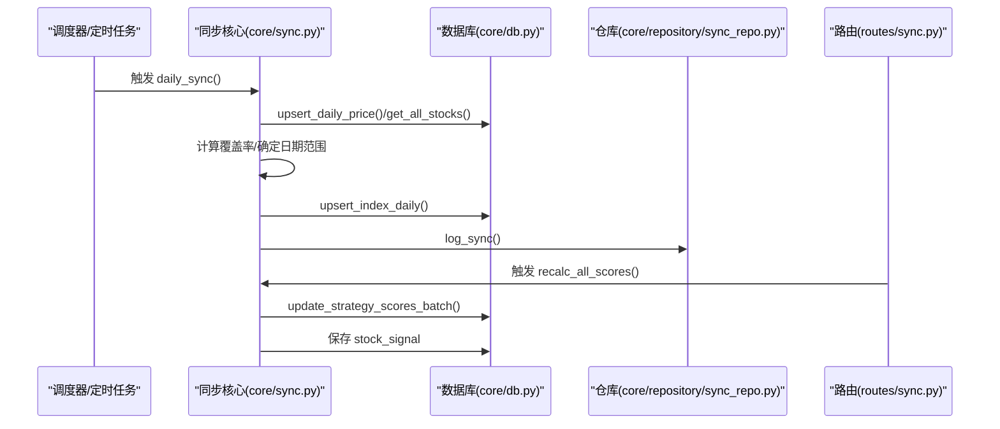
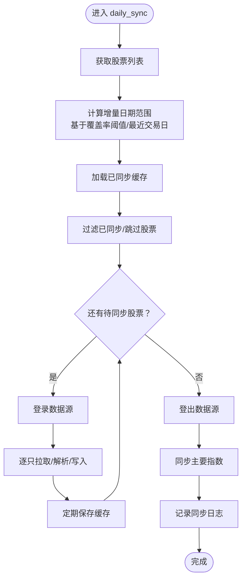
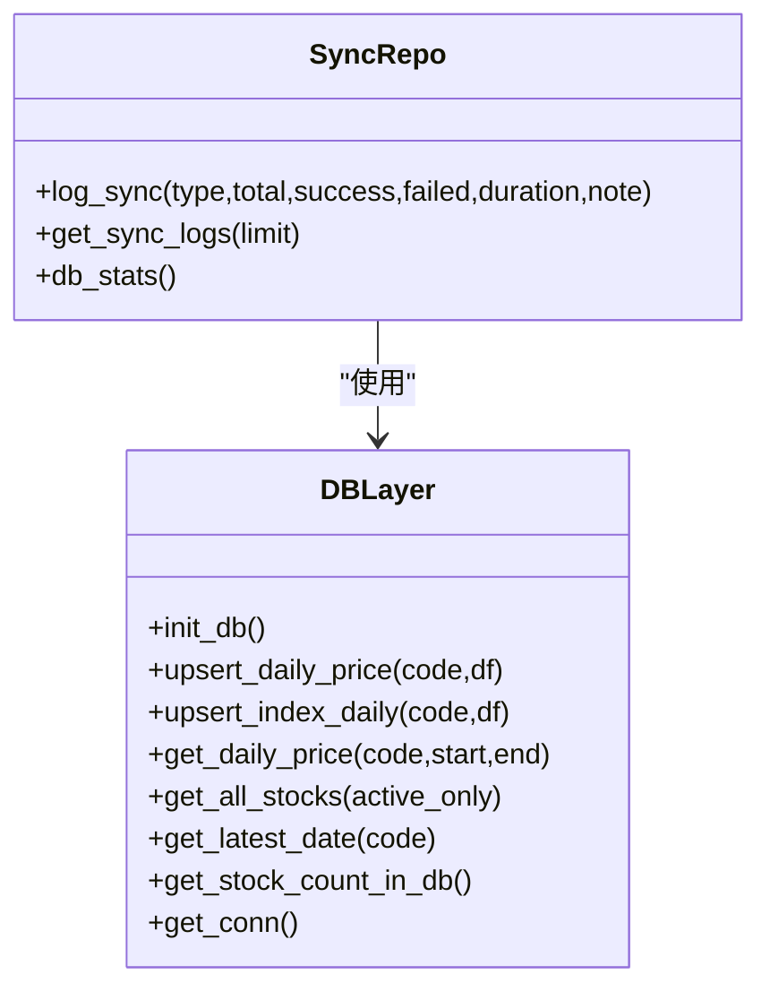
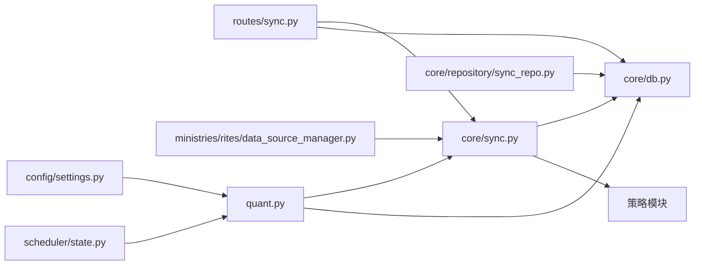

# 数据同步仓库

<cite>
**本文引用的文件**
- [core/sync.py](file://core/sync.py)
- [core/sync_simple.py](file://core/sync_simple.py)
- [core/repository/sync_repo.py](file://core/repository/sync_repo.py)
- [core/db.py](file://core/db.py)
- [routes/sync.py](file://routes/sync.py)
- [ministries/rites/data_source_manager.py](file://ministries/rites/data_source_manager.py)
- [quant.py](file://quant.py)
- [config/settings.py](file://config/settings.py)
- [scheduler/state.py](file://scheduler/state.py)
</cite>

## 目录
1. [简介](#简介)
2. [项目结构](#项目结构)
3. [核心组件](#核心组件)
4. [架构总览](#架构总览)
5. [详细组件分析](#详细组件分析)
6. [依赖关系分析](#依赖关系分析)
7. [性能考量](#性能考量)
8. [故障排除指南](#故障排除指南)
9. [结论](#结论)
10. [附录](#附录)

## 简介
本文件面向AIQuant项目的“数据同步仓库”（SyncRepo）能力，系统性阐述其数据同步机制与策略，包括：
- 全量初始化与断点续传
- 增量同步与覆盖率控制
- 同步状态跟踪与日志记录
- 失败重试与错误恢复
- 监控与配置
- 大数据量下的性能优化与资源管理

目标读者既包括开发者也包括运维与业务人员，力求以循序渐进的方式呈现技术细节与实践建议。

## 项目结构
围绕数据同步仓库的关键文件与职责如下：
- 核心同步模块：负责全量/增量同步、策略评分、指数同步、缓存与日志
- 数据库层：提供upsert、查询、统计、索引与事务保障
- 路由接口：对外暴露同步与评分重算的HTTP接口
- 数据源管理：抽象多数据源接入与健康检查
- 配置与调度：提供基础配置与进程内调度状态

图表来源
- [core/sync.py:1-760](file://core/sync.py#L1-L760)
- [core/sync_simple.py:1-173](file://core/sync_simple.py#L1-L173)
- [core/repository/sync_repo.py:1-55](file://core/repository/sync_repo.py#L1-L55)
- [core/db.py:1-1213](file://core/db.py#L1-L1213)
- [routes/sync.py:1-140](file://routes/sync.py#L1-L140)
- [quant.py:1-631](file://quant.py#L1-L631)
- [config/settings.py:1-25](file://config/settings.py#L1-L25)
- [scheduler/state.py:1-44](file://scheduler/state.py#L1-L44)
- [ministries/rites/data_source_manager.py:1-190](file://ministries/rites/data_source_manager.py#L1-L190)

章节来源
- [core/sync.py:1-760](file://core/sync.py#L1-L760)
- [core/db.py:1-1213](file://core/db.py#L1-L1213)

## 核心组件
- 同步核心模块（core/sync.py）
  - 提供全量初始化（断点续传）、增量同步（单线程/缓存）、策略评分批量写入、指数同步、日志记录与统计
  - 关键函数：initial_sync、daily_sync、sync_strategy_score、log_sync、db_stats
- 简化同步模块（core/sync_simple.py）
  - 本地CSV缓存导入与超级降频增量拉新，适合资源受限或网络受限场景
- 仓库与数据库（core/repository/sync_repo.py、core/db.py）
  - sync_repo封装sync_log写入与查询、数据库统计
  - db.py提供upsert、查询、索引、事务、迁移与表结构定义
- 路由接口（routes/sync.py）
  - 提供全量策略评分重算接口，写入stock_signal
- 数据源管理（ministries/rites/data_source_manager.py）
  - 抽象多数据源、健康检查、主备切换
- 配置与调度（config/settings.py、quant.py、scheduler/state.py）
  - 基础配置、定时任务、进程内状态

章节来源
- [core/sync.py:1-760](file://core/sync.py#L1-L760)
- [core/sync_simple.py:1-173](file://core/sync_simple.py#L1-L173)
- [core/repository/sync_repo.py:1-55](file://core/repository/sync_repo.py#L1-L55)
- [core/db.py:1-1213](file://core/db.py#L1-L1213)
- [routes/sync.py:1-140](file://routes/sync.py#L1-L140)
- [ministries/rites/data_source_manager.py:1-190](file://ministries/rites/data_source_manager.py#L1-L190)
- [config/settings.py:1-25](file://config/settings.py#L1-L25)
- [quant.py:1-631](file://quant.py#L1-L631)
- [scheduler/state.py:1-44](file://scheduler/state.py#L1-L44)

## 架构总览
数据同步仓库采用“模块化+仓储分离”的设计：
- 同步核心负责业务流程与策略计算
- 数据库层提供高性能写入与查询
- 仓库层封装日志与统计
- 路由层提供REST接口
- 数据源管理提供多源接入与健康检查
- 配置与调度贯穿整个生命周期

图表来源
- [core/sync.py:462-668](file://core/sync.py#L462-L668)
- [core/db.py:543-706](file://core/db.py#L543-L706)
- [core/repository/sync_repo.py:18-33](file://core/repository/sync_repo.py#L18-L33)
- [routes/sync.py:23-139](file://routes/sync.py#L23-L139)

## 详细组件分析

### 同步核心（core/sync.py）
- 全量初始化（断点续传）
  - 逻辑：拉取股票列表→遍历股票→按日期范围拉取行情→upsert写入→统计与日志
  - 断点续传：通过本地JSON缓存记录已同步股票集合，重启后自动跳过
  - 关键函数：initial_sync、_load_sync_cache、_save_sync_cache、_clear_sync_cache
- 增量同步（单线程）
  - 逻辑：确定增量日期范围（基于覆盖率阈值与最近交易日）→过滤已同步/跳过股票→单线程逐只拉取→upsert写入→实时保存缓存→完成后清理缓存
  - 覆盖率控制：min_coverage参数决定全市场覆盖率阈值，不足时执行全量补齐
  - 关键函数：daily_sync、_should_skip、_format_code_for_baostock
- 策略评分与写入
  - 逻辑：对历史行情运行5策略，融合得到FUSION_SCORE，批量写入daily_price
  - 关键函数：sync_strategy_score、update_strategy_scores_batch
- 指数同步
  - 逻辑：同步主要指数到index_daily表，供大盘择时使用
  - 关键函数：sync_index_data、sync_all_indices
- 日志与统计
  - 逻辑：写入sync_log，提供db_stats查询数据库概要
  - 关键函数：log_sync、get_sync_logs、db_stats

图表来源
- [core/sync.py:462-668](file://core/sync.py#L462-L668)
- [core/sync.py:415-460](file://core/sync.py#L415-L460)

章节来源
- [core/sync.py:1-760](file://core/sync.py#L1-L760)

### 简化同步（core/sync_simple.py）
- 本地CSV缓存导入：扫描data_cache目录，标准化列名，upsert写入，导入成功删除缓存文件
- 超级降频增量：对指定数量股票，每只间隔N秒请求，避免频繁请求导致限流
- 适用场景：资源受限、网络受限或临时应急

章节来源
- [core/sync_simple.py:1-173](file://core/sync_simple.py#L1-L173)

### 仓库与数据库（core/repository/sync_repo.py、core/db.py）
- 仓库层
  - log_sync：写入sync_log
  - get_sync_logs：查询最近N条同步日志
  - db_stats：数据库概要统计（股票数、行情记录数、最早/最新日期、数据库大小）
- 数据库层
  - 表结构：stock_info、daily_price、index_daily、stock_signal、sync_log等
  - upsert：upsert_daily_price、upsert_index_daily
  - 查询：get_daily_price、get_index_daily、get_all_stocks、get_latest_date等
  - 统计：get_stock_count_in_db、db_stats
  - 事务：get_conn上下文管理器，自动commit/rollback

图表来源
- [core/repository/sync_repo.py:18-54](file://core/repository/sync_repo.py#L18-L54)
- [core/db.py:543-706](file://core/db.py#L543-L706)
- [core/db.py:909-939](file://core/db.py#L909-L939)

章节来源
- [core/repository/sync_repo.py:1-55](file://core/repository/sync_repo.py#L1-L55)
- [core/db.py:1-1213](file://core/db.py#L1-L1213)

### 路由接口（routes/sync.py）
- /api/sync/recalc_all_scores：对全市场股票历史评分进行补算，并将高分日期写入stock_signal
- 该接口可作为手动触发的重算入口，便于修复或回填历史推荐

章节来源
- [routes/sync.py:23-139](file://routes/sync.py#L23-L139)

### 数据源管理（ministries/rites/data_source_manager.py）
- 抽象BaseDataSource，定义健康检查、日线数据获取、股票列表获取
- DataSourceManager：注册/切换主数据源，健康检查，自动切换备用数据源
- 为未来扩展多数据源（akshare/tushare/baostock/yfinance/local）提供统一接口

章节来源
- [ministries/rites/data_source_manager.py:1-190](file://ministries/rites/data_source_manager.py#L1-L190)

### 配置与调度（config/settings.py、quant.py、scheduler/state.py）
- config/settings.py：数据库路径、API主机端口、定时任务时间、同步批大小与日志级别
- quant.py：定时任务注册（07:00同步/09:00扫描）、后台初始化（首次运行自动拉取历史数据）、扫描与同步作业
- scheduler/state.py：进程内调度状态（兼容旧代码）与多Agent流水线状态

章节来源
- [config/settings.py:1-25](file://config/settings.py#L1-L25)
- [quant.py:549-589](file://quant.py#L549-L589)
- [scheduler/state.py:1-44](file://scheduler/state.py#L1-L44)

## 依赖关系分析
- 同步核心依赖数据库层进行upsert与查询，依赖策略模块进行评分计算
- 仓库层依赖数据库层进行日志与统计
- 路由层依赖同步核心与数据库层
- 数据源管理为同步核心提供多数据源抽象
- 配置与调度贯穿同步生命周期

图表来源
- [core/sync.py:1-760](file://core/sync.py#L1-L760)
- [core/db.py:1-1213](file://core/db.py#L1-L1213)
- [core/repository/sync_repo.py:1-55](file://core/repository/sync_repo.py#L1-L55)
- [routes/sync.py:1-140](file://routes/sync.py#L1-L140)
- [ministries/rites/data_source_manager.py:1-190](file://ministries/rites/data_source_manager.py#L1-L190)
- [quant.py:1-631](file://quant.py#L1-L631)
- [config/settings.py:1-25](file://config/settings.py#L1-L25)
- [scheduler/state.py:1-44](file://scheduler/state.py#L1-L44)

章节来源
- [core/sync.py:1-760](file://core/sync.py#L1-L760)
- [core/db.py:1-1213](file://core/db.py#L1-L1213)

## 性能考量
- 写入性能
  - WAL模式与NORMAL同步：提升并发写入性能与可靠性
  - upsert使用ON CONFLICT更新，避免重复插入
  - 批量写入：DataFrame批量转记录后一次性写入
- 查询性能
  - 为daily_price、index_daily、stock_signal建立复合索引与单列索引
  - 查询时按日期范围裁剪，减少扫描
- 并发与稳定性
  - 增量同步采用单线程（baostock线程不安全），通过缓存与断点续传避免重复工作
  - 本地缓存：.sync_cache目录保存已同步股票集合，支持断点续传
- 资源管理
  - 超级降频方案：每只股票请求间隔N秒，降低网络压力
  - 同步完成后清理旧CSV缓存文件，释放磁盘空间
- 策略评分
  - 全量历史评分写入daily_price，避免回测时重复计算

章节来源
- [core/db.py:26-40](file://core/db.py#L26-L40)
- [core/db.py:543-578](file://core/db.py#L543-L578)
- [core/sync.py:415-460](file://core/sync.py#L415-L460)
- [core/sync_simple.py:94-142](file://core/sync_simple.py#L94-L142)
- [quant.py:549-566](file://quant.py#L549-L566)

## 故障排除指南
- 常见问题与定位
  - 股票列表为空：先执行更新股票列表，再进行同步
  - 数据源不可用：检查数据源健康状态，必要时切换备用数据源
  - 增量同步无进展：检查覆盖率阈值与最近交易日判定，确认缓存文件是否存在
  - 策略评分失败：检查历史数据长度与策略计算依赖，必要时重算
- 日志与监控
  - 查看sync_log：定位同步类型、成功/失败数量、耗时
  - 查看db_stats：核对股票数、行情记录数、最早/最新日期、数据库大小
  - 进程内状态：查看调度状态与Agent状态
- 重试与恢复
  - 断点续传：缓存文件存在时自动跳过已同步股票
  - 重算接口：/api/sync/recalc_all_scores用于补算历史评分并回填stock_signal
- 网络与限流
  - 使用超级降频方案降低请求频率
  - 本地缓存导入优先，减少网络请求

章节来源
- [core/repository/sync_repo.py:18-33](file://core/repository/sync_repo.py#L18-L33)
- [core/db.py:909-939](file://core/db.py#L909-L939)
- [scheduler/state.py:1-44](file://scheduler/state.py#L1-L44)
- [routes/sync.py:23-139](file://routes/sync.py#L23-L139)
- [core/sync.py:415-460](file://core/sync.py#L415-L460)

## 结论
AIQuant的数据同步仓库以“全量断点续传 + 增量覆盖率控制 + 策略评分持久化 + 多数据源抽象 + 本地缓存与降频”为核心，构建了稳定、可监控、可扩展的数据同步体系。通过合理的索引、事务与批量写入策略，兼顾了性能与一致性；通过路由接口与进程内调度，实现了自动化与人工干预的灵活结合。

## 附录
- 配置项参考
  - 数据库路径、API主机端口、定时任务时间、同步批大小、日志级别
- 常用命令
  - 全量初始化：python -m core.sync init
  - 增量同步：python -m core.sync daily
  - 导入本地缓存：python -m core.sync_simple cache
  - 超级降频拉新：python -m core.sync_simple fetch [数量] [间隔秒数]
  - 查看统计：python -m core.sync stat

章节来源
- [config/settings.py:1-25](file://config/settings.py#L1-L25)
- [core/sync.py:734-760](file://core/sync.py#L734-L760)
- [core/sync_simple.py:146-172](file://core/sync_simple.py#L146-L172)