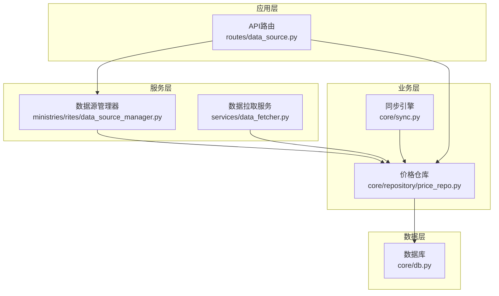
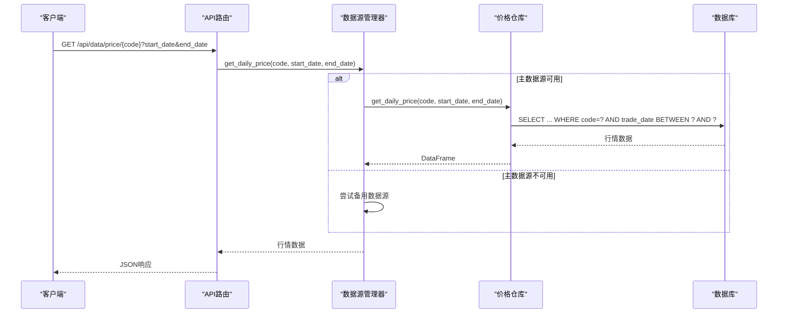
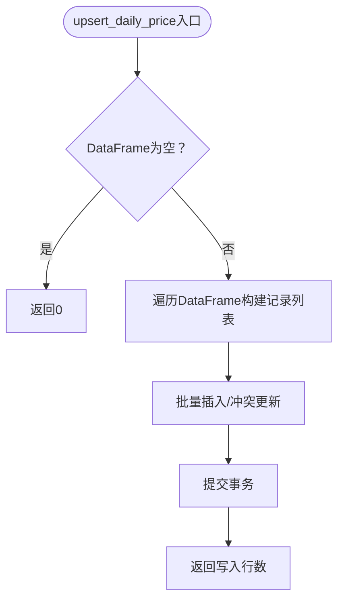
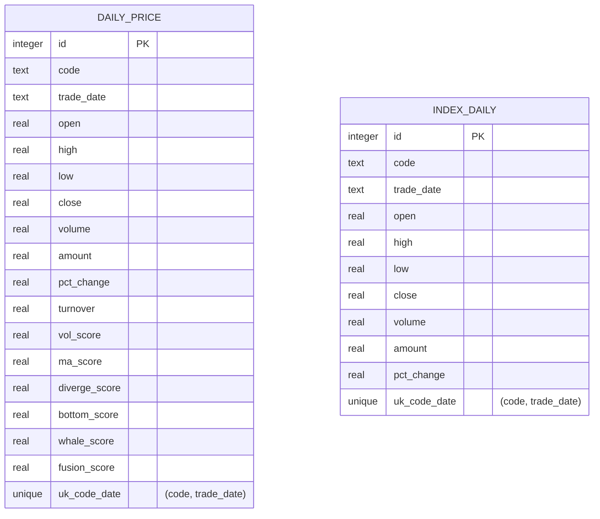
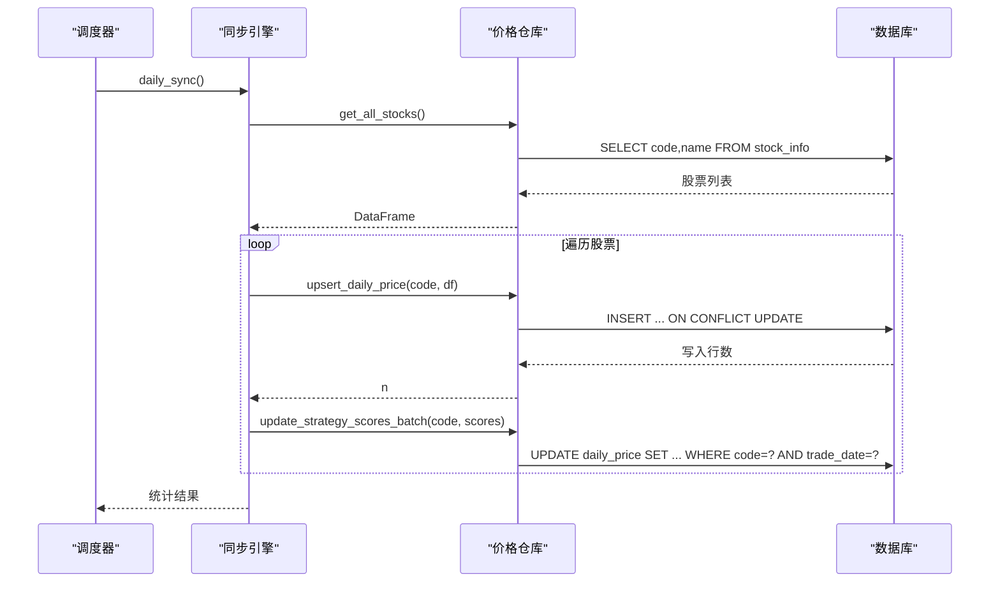
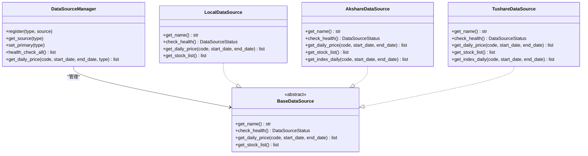
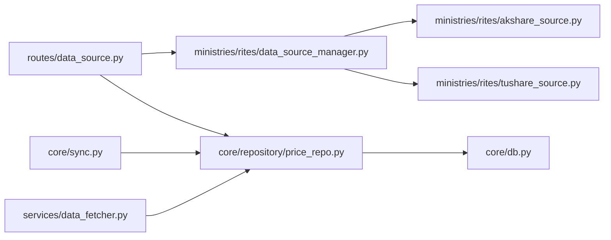

# 日线行情仓库

<cite>
**本文引用的文件**
- [price_repo.py](file://core/repository/price_repo.py)
- [db.py](file://core/db.py)
- [sync.py](file://core/sync.py)
- [data_fetcher.py](file://services/data_fetcher.py)
- [data_source_manager.py](file://ministries/rites/data_source_manager.py)
- [akshare_source.py](file://ministries/rites/akshare_source.py)
- [tushare_source.py](file://ministries/rites/tushare_source.py)
- [data_source.py](file://routes/data_source.py)
- [test_repository.py](file://tests/test_repository.py)
</cite>

## 目录
1. [简介](#简介)
2. [项目结构](#项目结构)
3. [核心组件](#核心组件)
4. [架构概览](#架构概览)
5. [详细组件分析](#详细组件分析)
6. [依赖分析](#依赖分析)
7. [性能考虑](#性能考虑)
8. [故障排查指南](#故障排查指南)
9. [结论](#结论)
10. [附录](#附录)

## 简介
本文件面向AIQuant项目的“日线行情仓库”，系统性阐述PriceRepo对日线行情数据的存储结构与查询接口，涵盖K线数据的插入、更新、查询流程；解释时间序列特性与数据完整性保障机制；提供批量导入、历史数据查询、最新行情获取等使用示例，并总结数据去重、异常值处理与数据质量检查的最佳实践。

## 项目结构
围绕日线行情仓库的关键模块分布如下：
- 数据访问层：core/repository/price_repo.py 提供统一的行情数据写入与查询接口
- 数据库层：core/db.py 定义SQLite表结构、连接管理与迁移逻辑
- 同步与策略：core/sync.py 负责历史/增量同步、策略评分计算与落库
- 数据源适配：ministries/rites/akshare_source.py、tushare_source.py、data_source_manager.py 提供多数据源接入与健康检查
- API路由：routes/data_source.py 提供HTTP接口，统一对外暴露数据源管理与行情查询
- 服务层：services/data_fetcher.py 提供在线拉取与入库封装
- 测试：tests/test_repository.py 验证仓库函数可导入与基本行为

图表来源
- [data_source.py:1-112](file://routes/data_source.py#L1-L112)
- [data_source_manager.py:1-190](file://ministries/rites/data_source_manager.py#L1-L190)
- [data_fetcher.py:1-106](file://services/data_fetcher.py#L1-L106)
- [sync.py:1-760](file://core/sync.py#L1-L760)
- [price_repo.py:1-237](file://core/repository/price_repo.py#L1-L237)
- [db.py:1-1213](file://core/db.py#L1-L1213)

章节来源
- [price_repo.py:1-237](file://core/repository/price_repo.py#L1-L237)
- [db.py:1-1213](file://core/db.py#L1-L1213)

## 核心组件
- daily_price表：存储个股日线行情与策略评分，具备唯一约束(code, trade_date)，并建立复合索引以优化查询
- index_daily表：存储主要指数日线行情，便于大盘择时
- 价格仓库(price_repo)：提供upsert_daily_price、get_daily_price、upsert_index_daily、get_index_daily、策略评分批量更新等接口
- 数据库(db)：连接管理、WAL模式、PRAGMA配置、建表与迁移
- 同步引擎(sync)：历史初始化、增量同步、策略评分计算与落库
- 数据源管理器：统一接入akshare、tushare、本地数据库等多数据源，支持健康检查与主备切换
- API路由：对外提供数据源列表、健康检查、主数据源切换、行情查询等REST接口

章节来源
- [price_repo.py:13-237](file://core/repository/price_repo.py#L13-L237)
- [db.py:57-467](file://core/db.py#L57-L467)
- [sync.py:1-760](file://core/sync.py#L1-L760)
- [data_source_manager.py:111-190](file://ministries/rites/data_source_manager.py#L111-L190)
- [data_source.py:25-112](file://routes/data_source.py#L25-L112)

## 架构概览
日线行情仓库采用“数据访问层 + 数据库层 + 业务层 + 服务层 + 应用层”的分层设计，数据流自上而下：
- API路由接收请求，委派至数据源管理器或价格仓库
- 数据源管理器负责多数据源健康检查与主备切换
- 价格仓库通过数据库连接执行批量写入与查询
- 同步引擎负责历史/增量同步与策略评分计算
- 数据库层提供SQLite WAL模式与索引优化

图表来源
- [data_source.py:89-112](file://routes/data_source.py#L89-L112)
- [data_source_manager.py:153-178](file://ministries/rites/data_source_manager.py#L153-L178)
- [price_repo.py:95-129](file://core/repository/price_repo.py#L95-L129)

## 详细组件分析

### 价格仓库（PriceRepo）接口
- upsert_daily_price(code, df)
  - 功能：将DataFrame行情数据写入daily_price表，冲突时按trade_date更新
  - 输入：DataFrame需包含open/high/low/close/volume/amount/pct_change/turnover列，索引为datetime
  - 输出：实际写入行数
  - 关键点：使用executemany + ON CONFLICT实现高效去重与更新
- get_daily_price(code, start_date, end_date, min_rows)
  - 功能：按日期范围查询个股日线行情，返回以trade_date为索引的DataFrame
  - 支持YYYY-MM-DD或YYYYMMDD两种日期格式
  - 返回空DataFrame表示无数据
- upsert_index_daily(code, df)
  - 功能：批量写入指数日线行情至index_daily表，冲突更新
- get_index_daily(code, start_date, end_date)
  - 功能：查询指数日线行情，返回以trade_date为索引的DataFrame
- update_strategy_scores_batch(code, scores_df)
  - 功能：批量更新策略评分（vol_score/ma_score/diverge_score/bottom_score/whale_score/fusion_score）
  - 仅更新评分字段，不改动OHLCV等行情数据
- 最新日期与存在性查询
  - get_latest_date(code)：获取某只股票在数据库中的最新交易日
  - get_latest_date_all()：获取全市场最新交易日
  - has_today_data(code)：判断某只股票今日是否有数据
  - get_stock_count_in_db()：数据库中有行情数据的股票数量

图表来源
- [price_repo.py:13-47](file://core/repository/price_repo.py#L13-L47)

章节来源
- [price_repo.py:13-237](file://core/repository/price_repo.py#L13-L237)

### 数据库层（SQLite）
- 表结构
  - daily_price：个股日线行情 + 策略评分字段，唯一约束(code, trade_date)，索引(idx_daily_code_date, idx_daily_date)
  - index_daily：指数日线行情，唯一约束(code, trade_date)，索引(idx_index_code_date, idx_index_date)
- 连接管理
  - get_conn()：使用WAL模式与NORMAL同步级别，row_factory=sqlite3.Row，自动commit/rollback/关闭
- 迁移与兼容
  - 自动为旧表补充策略评分列与commission列
  - 修正唯一索引，确保数据一致性

图表来源
- [db.py:71-110](file://core/db.py#L71-L110)

章节来源
- [db.py:26-40](file://core/db.py#L26-L40)
- [db.py:57-467](file://core/db.py#L57-L467)

### 同步与策略评分
- 历史初始化：initial_sync()，断点续传，支持baostock主数据源与akshare备用
- 增量同步：daily_sync()，单线程（baostock限制），自动计算覆盖率并补齐
- 策略评分：sync_strategy_score()，计算5个策略评分并融合，批量写入数据库
- 指数同步：sync_all_indices()，同步主要指数至index_daily表

图表来源
- [sync.py:462-668](file://core/sync.py#L462-L668)
- [price_repo.py:50-93](file://core/repository/price_repo.py#L50-L93)

章节来源
- [sync.py:1-760](file://core/sync.py#L1-L760)

### 数据源管理与API
- 数据源管理器
  - 支持LOCAL/AKSHARE/TUSHARE三种数据源
  - 健康检查：check_health()返回可用性与质量等级
  - 主备切换：set_primary()设置主数据源
  - 自动切换：get_daily_price()优先主数据源，失败则尝试备用
- API路由
  - GET /api/data/sources：列出数据源及质量
  - GET /api/data/health：健康检查
  - POST /api/data/switch：切换主数据源
  - GET /api/data/price/{code}：获取行情（自动选择数据源）

图表来源
- [data_source_manager.py:48-190](file://ministries/rites/data_source_manager.py#L48-L190)
- [akshare_source.py:15-135](file://ministries/rites/akshare_source.py#L15-L135)
- [tushare_source.py:16-167](file://ministries/rites/tushare_source.py#L16-L167)

章节来源
- [data_source_manager.py:111-190](file://ministries/rites/data_source_manager.py#L111-L190)
- [data_source.py:25-112](file://routes/data_source.py#L25-L112)

## 依赖分析
- 组件耦合
  - price_repo依赖core/db的连接管理与表结构定义
  - sync依赖price_repo进行批量写入与查询
  - data_source_manager依赖具体数据源实现（akshare/tushare/local）
  - API路由依赖data_source_manager与price_repo
- 外部依赖
  - SQLite：本地嵌入式数据库，WAL模式提升并发
  - akshare/tushare：第三方行情数据源
  - pandas：时间序列与DataFrame处理

图表来源
- [data_source.py:1-112](file://routes/data_source.py#L1-L112)
- [data_source_manager.py:1-190](file://ministries/rites/data_source_manager.py#L1-L190)
- [price_repo.py:1-237](file://core/repository/price_repo.py#L1-L237)
- [db.py:1-1213](file://core/db.py#L1-L1213)
- [sync.py:1-760](file://core/sync.py#L1-L760)
- [data_fetcher.py:1-106](file://services/data_fetcher.py#L1-L106)

章节来源
- [price_repo.py:8-10](file://core/repository/price_repo.py#L8-L10)
- [sync.py:17-21](file://core/sync.py#L17-L21)

## 性能考虑
- 存储层
  - WAL模式与NORMAL同步级别在性能与可靠性间取得平衡
  - 为daily_price与index_daily建立复合索引，加速按code+trade_date与按trade_date的查询
- 写入层
  - executemany + ON CONFLICT避免逐条INSERT，显著提升批量写入效率
  - 策略评分单独批量更新，减少不必要的字段变更
- 查询层
  - get_daily_price/get_index_daily按日期范围过滤并排序，返回DataFrame索引为trade_date，便于时间序列分析
- 并发与稳定性
  - get_conn()自动commit/rollback，异常时回滚，避免脏数据
  - 同步引擎支持断点续传与缓存，提高可靠性

章节来源
- [db.py:26-40](file://core/db.py#L26-L40)
- [db.py:92-110](file://core/db.py#L92-L110)
- [price_repo.py:36-47](file://core/repository/price_repo.py#L36-L47)
- [sync.py:462-668](file://core/sync.py#L462-L668)

## 故障排查指南
- 无数据返回
  - 检查get_daily_price/get_index_daily的日期范围是否正确（支持YYYY-MM-DD或YYYYMMDD）
  - 确认股票代码是否存在且已在数据库中
- 写入失败或未生效
  - 确认DataFrame列是否包含open/high/low/close/volume/amount/pct_change/turnover
  - 检查trade_date格式是否为YYYY-MM-DD
  - 查看upsert_daily_price返回的写入行数
- 数据源问题
  - 使用GET /api/data/health检查各数据源可用性与质量
  - 使用POST /api/data/switch切换主数据源
- 策略评分未更新
  - 确认已调用update_strategy_scores_batch或通过sync_strategy_score进行全量计算
  - 检查最小行数要求（min_rows参数）

章节来源
- [price_repo.py:95-129](file://core/repository/price_repo.py#L95-L129)
- [data_source.py:46-86](file://routes/data_source.py#L46-L86)
- [sync.py:675-701](file://core/sync.py#L675-L701)

## 结论
PriceRepo通过清晰的分层设计与完善的数据库索引，提供了高性能的日线行情存储与查询能力。配合多数据源管理与同步引擎，实现了历史/增量数据的可靠落地与策略评分的全量计算。建议在生产环境遵循本文最佳实践，确保数据质量与系统稳定性。

## 附录

### 使用示例（路径指引）
- 批量导入历史数据
  - 使用services/data_fetcher.batch_fetch_and_save(codes, days)进行批量拉取与入库
  - 或使用core/sync.initial_sync()进行全市场历史初始化
  - 参考：[data_fetcher.py:76-106](file://services/data_fetcher.py#L76-L106)、[sync.py:319-390](file://core/sync.py#L319-L390)
- 增量同步与策略评分
  - 使用core/sync.daily_sync()进行每日增量同步
  - 使用core/sync.sync_strategy_score()计算并写入策略评分
  - 参考：[sync.py:462-668](file://core/sync.py#L462-L668)、[sync.py:675-701](file://core/sync.py#L675-L701)
- 历史数据查询
  - 使用core/repository/price_repo.get_daily_price(code, start_date, end_date)
  - 参考：[price_repo.py:95-129](file://core/repository/price_repo.py#L95-L129)
- 最新行情获取
  - 使用core/repository/price_repo.get_latest_date(code)与has_today_data(code)
  - 参考：[price_repo.py:202-228](file://core/repository/price_repo.py#L202-L228)
- 指数行情
  - 使用core/repository/price_repo.upsert_index_daily与get_index_daily
  - 参考：[price_repo.py:134-197](file://core/repository/price_repo.py#L134-L197)

### 数据质量与最佳实践
- 去重与完整性
  - daily_price与index_daily均以(code, trade_date)作为唯一约束，避免重复写入
  - 使用ON CONFLICT UPDATE确保数据一致性
  - 参考：[db.py:90](file://core/db.py#L90)、[db.py:107](file://core/db.py#L107)
- 异常值处理
  - 在写入前确保DataFrame列齐全，缺失列可通过pct_change计算补齐
  - 参考：[data_fetcher.py:65-67](file://services/data_fetcher.py#L65-L67)
- 数据质量检查
  - 通过get_latest_date_all()与get_stock_count_in_db()监控全市场覆盖情况
  - 参考：[price_repo.py:211-237](file://core/repository/price_repo.py#L211-L237)
- API与数据源切换
  - 使用routes/data_source.py提供的接口进行数据源健康检查与主数据源切换
  - 参考：[data_source.py:25-86](file://routes/data_source.py#L25-L86)