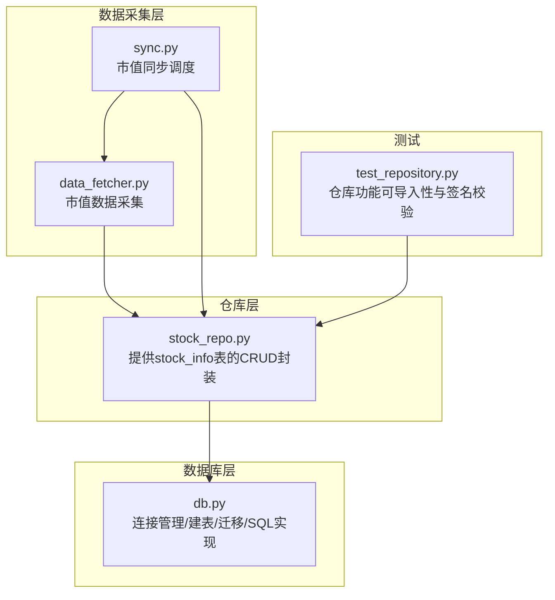
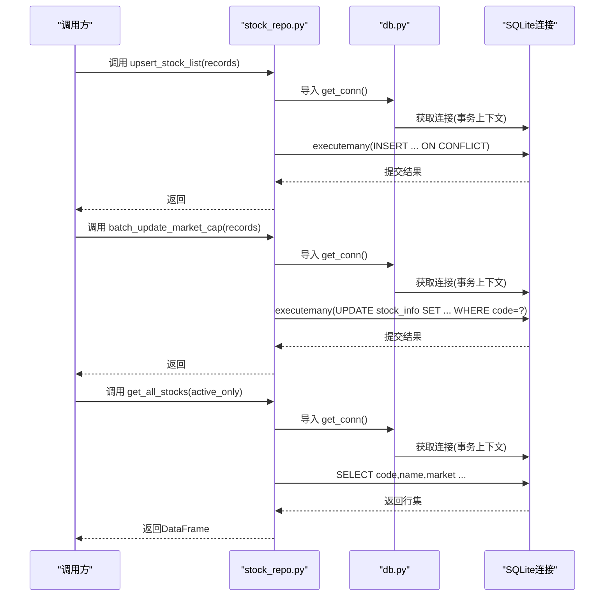
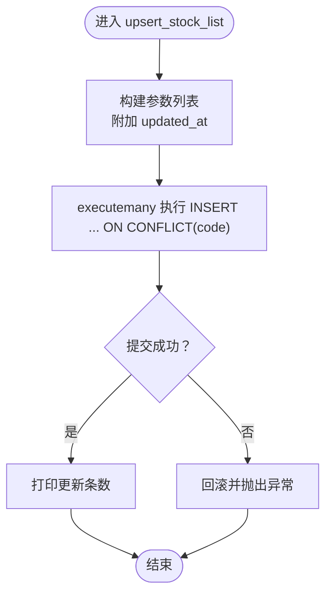
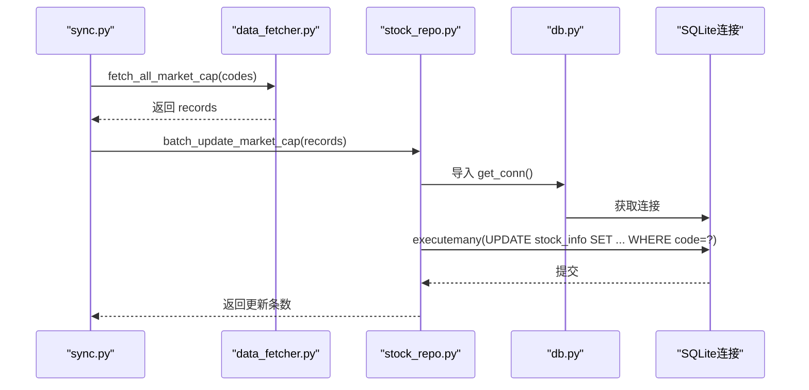
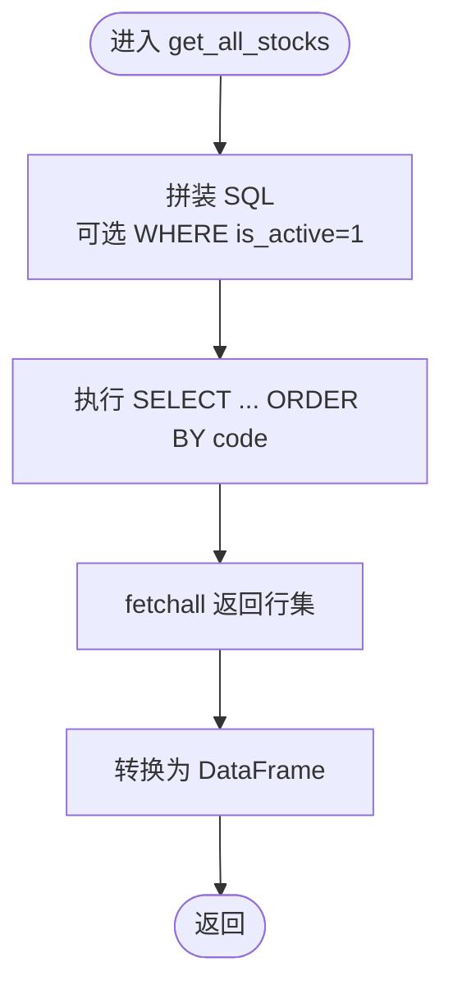
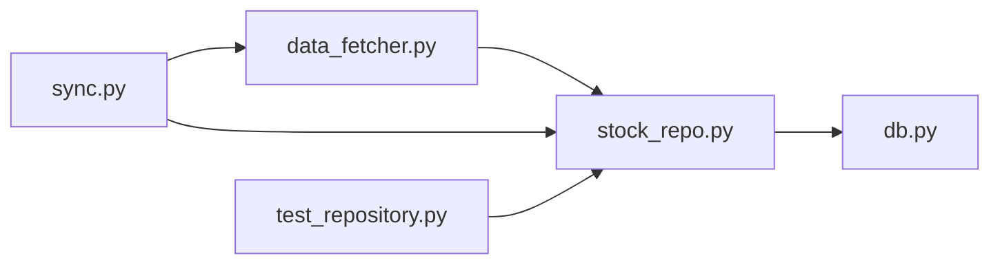

# 股票信息仓库

<cite>
**本文引用的文件**
- [stock_repo.py](file://core/repository/stock_repo.py)
- [db.py](file://core/db.py)
- [data_fetcher.py](file://core/data_fetcher.py)
- [sync.py](file://core/sync.py)
- [test_repository.py](file://tests/test_repository.py)
</cite>

## 目录
1. [简介](#简介)
2. [项目结构](#项目结构)
3. [核心组件](#核心组件)
4. [架构总览](#架构总览)
5. [详细组件分析](#详细组件分析)
6. [依赖关系分析](#依赖关系分析)
7. [性能考量](#性能考量)
8. [故障排查指南](#故障排查指南)
9. [结论](#结论)
10. [附录](#附录)

## 简介
本文件面向AIQuant项目的StockRepo股票信息仓库，系统化阐述stock_info表的数据访问实现，重点覆盖以下能力：
- 批量写入/更新（upsert_stock_list）
- 市值数据批量更新（batch_update_market_cap）
- 股票列表查询（get_all_stocks）
- 冲突处理机制（ON CONFLICT(code) DO UPDATE）
- 使用示例（批量导入、更新股本、查询基本信息）
- 错误处理策略与性能优化建议

## 项目结构
StockRepo位于core/repository目录下，提供对stock_info表的高层封装；底层数据库连接与建表逻辑由core/db.py统一管理。市值数据的采集与入库流程由core/data_fetcher.py与core/sync.py协同完成。

图表来源
- [stock_repo.py:1-80](file://core/repository/stock_repo.py#L1-L80)
- [db.py:26-40](file://core/db.py#L26-L40)
- [db.py:62-69](file://core/db.py#L62-L69)
- [data_fetcher.py:533-577](file://core/data_fetcher.py#L533-L577)
- [sync.py:715-728](file://core/sync.py#L715-L728)
- [test_repository.py:14-21](file://tests/test_repository.py#L14-L21)

章节来源
- [stock_repo.py:1-80](file://core/repository/stock_repo.py#L1-L80)
- [db.py:26-40](file://core/db.py#L26-L40)
- [db.py:62-69](file://core/db.py#L62-L69)
- [data_fetcher.py:533-577](file://core/data_fetcher.py#L533-L577)
- [sync.py:715-728](file://core/sync.py#L715-L728)
- [test_repository.py:14-21](file://tests/test_repository.py#L14-L21)

## 核心组件
- stock_repo.py：提供upsert_stock_list、batch_update_market_cap、get_all_stocks、get_stock_name、get_market_cap_map等方法，统一通过db.py提供的连接上下文执行SQL。
- db.py：提供get_conn连接管理、init_db建表与迁移、以及与stock_repo同名的SQL实现（upsert_stock_list、batch_update_market_cap、get_all_stocks、get_stock_name），确保仓库层与数据库层职责清晰。
- data_fetcher.py：负责从外部源批量获取市值数据（总股本/流通股本），返回records供批量入库。
- sync.py：协调数据采集与入库流程，封装sync_market_cap以驱动市值数据同步。
- test_repository.py：验证仓库模块可导入性及关键函数签名。

章节来源
- [stock_repo.py:13-28](file://core/repository/stock_repo.py#L13-L28)
- [stock_repo.py:40-50](file://core/repository/stock_repo.py#L40-L50)
- [stock_repo.py:62-70](file://core/repository/stock_repo.py#L62-L70)
- [stock_repo.py:73-79](file://core/repository/stock_repo.py#L73-L79)
- [db.py:470-485](file://core/db.py#L470-L485)
- [db.py:497-507](file://core/db.py#L497-L507)
- [db.py:519-527](file://core/db.py#L519-L527)
- [db.py:530-536](file://core/db.py#L530-L536)
- [data_fetcher.py:533-577](file://core/data_fetcher.py#L533-L577)
- [sync.py:715-728](file://core/sync.py#L715-L728)
- [test_repository.py:14-21](file://tests/test_repository.py#L14-L21)

## 架构总览
StockRepo采用“仓库层-数据库层-采集层”的分层设计，仓库层仅暴露简洁的Python接口，数据库层集中处理连接、事务与SQL实现，采集层负责外部数据获取，测试层保障接口稳定性。

图表来源
- [stock_repo.py:13-28](file://core/repository/stock_repo.py#L13-L28)
- [stock_repo.py:40-50](file://core/repository/stock_repo.py#L40-L50)
- [stock_repo.py:62-70](file://core/repository/stock_repo.py#L62-L70)
- [db.py:26-40](file://core/db.py#L26-L40)
- [db.py:470-485](file://core/db.py#L470-L485)
- [db.py:497-507](file://core/db.py#L497-L507)
- [db.py:519-527](file://core/db.py#L519-L527)

## 详细组件分析

### upsert_stock_list：批量写入/更新
- 功能要点
  - 接收records列表，每条记录包含code/name/market等字段
  - 自动注入updated_at时间戳，保证每次upsert都更新时间
  - 使用SQLite的ON CONFLICT(code) DO UPDATE语法，按主键冲突进行更新
  - 通过executemany高效批量执行
- 冲突处理机制
  - 当code已存在时，更新name、market、updated_at字段
  - excluded是SQLite的特殊伪表，代表本次插入的候选值
- 性能特征
  - 单次事务内批量提交，减少往返开销
  - 依赖主键code的唯一约束，避免重复插入

图表来源
- [stock_repo.py:18-28](file://core/repository/stock_repo.py#L18-L28)
- [db.py:475-485](file://core/db.py#L475-L485)

章节来源
- [stock_repo.py:13-28](file://core/repository/stock_repo.py#L13-L28)
- [db.py:470-485](file://core/db.py#L470-L485)

### batch_update_market_cap：批量更新市值数据
- 功能要点
  - 接收records列表，每条记录包含code、total_shares、circ_shares
  - 使用executemany批量UPDATE stock_info表
  - 适合从外部源（如data_fetcher）批量回填股本信息
- 使用场景
  - 同步全市场或部分股票的总股本/流通股本
  - 与sync_market_cap配合完成定时任务

图表来源
- [sync.py:715-728](file://core/sync.py#L715-L728)
- [data_fetcher.py:533-577](file://core/data_fetcher.py#L533-L577)
- [stock_repo.py:40-50](file://core/repository/stock_repo.py#L40-L50)
- [db.py:497-507](file://core/db.py#L497-L507)

章节来源
- [stock_repo.py:40-50](file://core/repository/stock_repo.py#L40-L50)
- [db.py:497-507](file://core/db.py#L497-L507)
- [sync.py:715-728](file://core/sync.py#L715-L728)
- [data_fetcher.py:533-577](file://core/data_fetcher.py#L533-L577)

### get_all_stocks：股票列表查询
- 功能要点
  - 支持active_only参数，默认仅返回is_active=1的股票
  - 查询code/name/market三列，并按code排序
  - 返回pandas.DataFrame，便于上层直接使用
- 应用场景
  - 策略扫描、回测引擎初始化时加载标的池
  - 前端展示或报表统计

图表来源
- [stock_repo.py:62-70](file://core/repository/stock_repo.py#L62-L70)
- [db.py:519-527](file://core/db.py#L519-L527)

章节来源
- [stock_repo.py:62-70](file://core/repository/stock_repo.py#L62-L70)
- [db.py:519-527](file://core/db.py#L519-L527)

### 其他辅助方法
- get_stock_name：按code查询name，不存在时回退返回code
- get_market_cap_map：返回{code: {"total_shares": ..., "circ_shares": ...}}的字典映射，过滤掉total_shares为空的记录

章节来源
- [stock_repo.py:73-79](file://core/repository/stock_repo.py#L73-L79)
- [stock_repo.py:53-59](file://core/repository/stock_repo.py#L53-L59)
- [db.py:530-536](file://core/db.py#L530-L536)
- [db.py:510-516](file://core/db.py#L510-L516)

## 依赖关系分析
- 仓库层依赖数据库层的连接上下文与SQL实现
- 采集层与同步层依赖仓库层的批量更新接口
- 测试层验证仓库接口的可导入性与签名

图表来源
- [stock_repo.py:8-10](file://core/repository/stock_repo.py#L8-L10)
- [db.py:26-40](file://core/db.py#L26-L40)
- [data_fetcher.py:533-577](file://core/data_fetcher.py#L533-L577)
- [sync.py:715-728](file://core/sync.py#L715-L728)
- [test_repository.py:14-21](file://tests/test_repository.py#L14-L21)

章节来源
- [stock_repo.py:8-10](file://core/repository/stock_repo.py#L8-L10)
- [db.py:26-40](file://core/db.py#L26-L40)
- [data_fetcher.py:533-577](file://core/data_fetcher.py#L533-L577)
- [sync.py:715-728](file://core/sync.py#L715-L728)
- [test_repository.py:14-21](file://tests/test_repository.py#L14-L21)

## 性能考量
- 连接与事务
  - 通过上下文管理器确保事务提交与异常回滚，避免资源泄漏
  - WAL模式与NORMAL同步策略在并发与可靠性间取得平衡
- 批量操作
  - 使用executemany减少网络/引擎往返次数
  - upsert_stock_list与batch_update_market_cap均采用批量执行
- 索引与查询
  - stock_info主键为code，适合按code的upsert与更新
  - get_all_stocks默认按code排序，有利于稳定输出与后续处理
- 建议
  - 在大批量导入前，确认records规模，合理分批提交
  - 对频繁查询的场景，可在上层缓存get_all_stocks结果
  - 如需更复杂的条件筛选，可在上层基于DataFrame二次过滤

章节来源
- [db.py:26-40](file://core/db.py#L26-L40)
- [stock_repo.py:18-28](file://core/repository/stock_repo.py#L18-L28)
- [stock_repo.py:45-50](file://core/repository/stock_repo.py#L45-L50)
- [stock_repo.py:62-70](file://core/repository/stock_repo.py#L62-L70)

## 故障排查指南
- 连接与事务
  - 若出现“数据库忙”或超时，检查timeout设置与并发写入情况
  - 异常时会自动rollback，确认上游是否有重试逻辑
- upsert冲突
  - 确认records中的code字段不为空且格式一致
  - 检查updated_at是否被正确注入
- 批量更新
  - 确认records中包含code、total_shares、circ_shares字段
  - 核对目标表字段类型与数值范围
- 查询
  - get_all_stocks若返回空DataFrame，检查is_active过滤条件与数据是否已入库
  - get_stock_name未命中时返回code，属预期行为

章节来源
- [db.py:26-40](file://core/db.py#L26-L40)
- [stock_repo.py:18-28](file://core/repository/stock_repo.py#L18-L28)
- [stock_repo.py:45-50](file://core/repository/stock_repo.py#L45-L50)
- [stock_repo.py:62-70](file://core/repository/stock_repo.py#L62-L70)
- [stock_repo.py:73-79](file://core/repository/stock_repo.py#L73-L79)

## 结论
StockRepo围绕stock_info表提供了简洁高效的仓库接口，结合db.py的连接与SQL实现，能够稳定支撑批量导入、市值数据回填与基础查询等核心需求。通过ON CONFLICT(code) DO UPDATE机制，实现了以code为主键的幂等upsert；配合executemany的批量执行，兼顾了易用性与性能。建议在生产环境中配合合理的分批策略与缓存机制，进一步提升吞吐与稳定性。

## 附录

### 使用示例（步骤说明）
- 批量导入股票列表
  - 准备records：包含code、name、market等字段
  - 调用upsert_stock_list(records)，内部自动注入updated_at并批量写入
  - 参考路径：[stock_repo.py:13-28](file://core/repository/stock_repo.py#L13-L28)
- 更新股本信息
  - 采集records：来自data_fetcher.fetch_all_market_cap
  - 调用batch_update_market_cap(records)批量回填total_shares/circ_shares
  - 参考路径：[sync.py:715-728](file://core/sync.py#L715-L728)、[stock_repo.py:40-50](file://core/repository/stock_repo.py#L40-L50)
- 查询股票基本信息
  - 调用get_all_stocks(active_only=True)获取DataFrame
  - 参考路径：[stock_repo.py:62-70](file://core/repository/stock_repo.py#L62-L70)

章节来源
- [stock_repo.py:13-28](file://core/repository/stock_repo.py#L13-L28)
- [stock_repo.py:40-50](file://core/repository/stock_repo.py#L40-L50)
- [stock_repo.py:62-70](file://core/repository/stock_repo.py#L62-L70)
- [sync.py:715-728](file://core/sync.py#L715-L728)