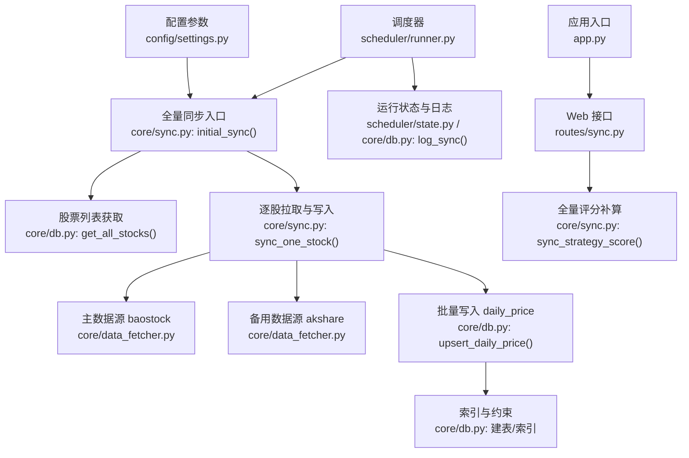
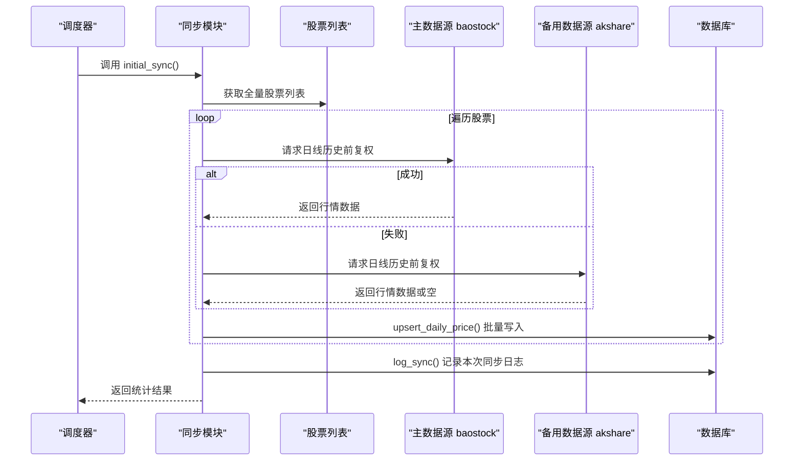
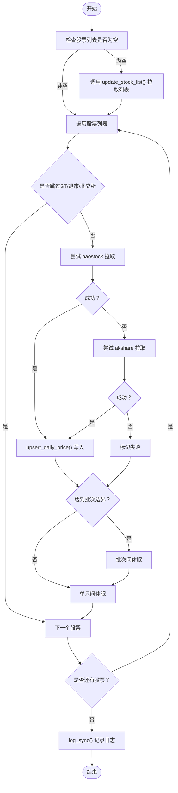
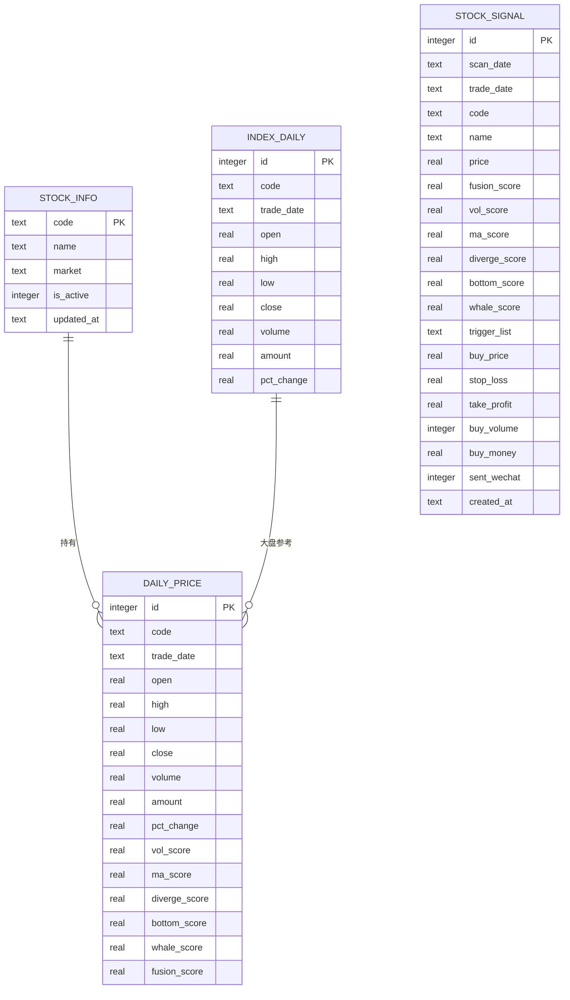
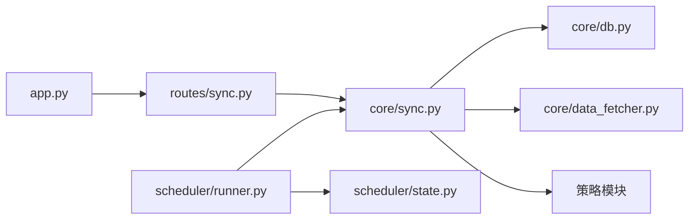

# 全量同步

<cite>
**本文引用的文件**
- [core/sync.py](file://core/sync.py)
- [core/db.py](file://core/db.py)
- [scheduler/runner.py](file://scheduler/runner.py)
- [scheduler/state.py](file://scheduler/state.py)
- [routes/sync.py](file://routes/sync.py)
- [config/settings.py](file://config/settings.py)
- [core/data_fetcher.py](file://core/data_fetcher.py)
- [core/repository/price_repo.py](file://core/repository/price_repo.py)
- [core/repository/futures_repo.py](file://core/repository/futures_repo.py)
- [app.py](file://app.py)
</cite>

## 目录
1. [简介](#简介)
2. [项目结构](#项目结构)
3. [核心组件](#核心组件)
4. [架构总览](#架构总览)
5. [详细组件分析](#详细组件分析)
6. [依赖分析](#依赖分析)
7. [性能考虑](#性能考虑)
8. [故障排查指南](#故障排查指南)
9. [结论](#结论)
10. [附录](#附录)

## 简介
本文件系统化阐述 AIQuant 的“全量同步”机制，覆盖首次初始化全量同步的触发条件与执行流程、股票列表获取、历史数据拉取与断点续传、算法实现（股票遍历策略、数据源切换、进度跟踪）、性能优化（批量处理、间隔控制、内存管理）、错误处理与重试、配置参数、以及与数据库的交互（批量插入、索引与事务）。目标是帮助开发者与运维人员准确理解并高效维护该同步体系。

## 项目结构
围绕全量同步的关键模块与文件如下：
- 同步主流程与策略：core/sync.py
- 数据库建表、索引与批量写入：core/db.py
- 调度与运行状态：scheduler/runner.py、scheduler/state.py
- Web 接口与评分补算：routes/sync.py
- 配置参数：config/settings.py
- 数据源封装与降级：core/data_fetcher.py
- 仓库层批量写入（指数等）：core/repository/price_repo.py、core/repository/futures_repo.py
- 应用入口注册蓝图：app.py

图示来源
- [scheduler/runner.py:57-87](file://scheduler/runner.py#L57-L87)
- [core/sync.py:319-389](file://core/sync.py#L319-L389)
- [core/db.py:61-166](file://core/db.py#L61-L166)
- [core/data_fetcher.py:79-166](file://core/data_fetcher.py#L79-L166)
- [routes/sync.py:23-140](file://routes/sync.py#L23-L140)
- [config/settings.py:19-22](file://config/settings.py#L19-L22)
- [app.py:13-72](file://app.py#L13-L72)

章节来源
- [scheduler/runner.py:57-87](file://scheduler/runner.py#L57-L87)
- [core/sync.py:319-389](file://core/sync.py#L319-L389)
- [core/db.py:61-166](file://core/db.py#L61-L166)
- [routes/sync.py:23-140](file://routes/sync.py#L23-L140)
- [config/settings.py:19-22](file://config/settings.py#L19-L22)
- [app.py:13-72](file://app.py#L13-L72)

## 核心组件
- 首次初始化全量同步：initial_sync()
  - 功能：拉取所有股票历史行情（baostock 主数据源，akshare 备用），支持断点续传与进度统计。
  - 关键参数：limit（限制股票数）、verbose（输出详情）。
  - 断点续传：通过 .sync_cache 缓存已同步股票集合，避免重复下载。
- 单只股票同步：sync_one_stock()
  - 数据源切换：优先 baostock，失败自动降级 akshare。
  - 代码格式转换：将 600/601/603/688/689 开头视为上交所，000/001/002/003/300/301 开头视为深交所，430/830/870/920 开头视为北交所（北交所跳过 baostock）。
- 增量同步：daily_sync()
  - 用途：每日增量更新，单线程（baostock 不支持多线程）。
  - 覆盖率策略：若近 5 日任一日覆盖率不足阈值，执行全量补齐。
- 股票列表：update_stock_list()
  - 从 akshare 拉取 A 股列表，过滤 ST、退市与北交所，写入 stock_info。
- 数据库写入：upsert_daily_price()
  - 批量插入 daily_price，ON CONFLICT 更新，确保幂等。
- 运行状态与日志：log_sync()、db_stats()、SYNC_STATUS
  - 记录每次同步的类型、耗时、成功/失败数，并提供数据库统计。

章节来源
- [core/sync.py:319-389](file://core/sync.py#L319-L389)
- [core/sync.py:217-314](file://core/sync.py#L217-L314)
- [core/sync.py:462-668](file://core/sync.py#L462-L668)
- [core/sync.py:136-176](file://core/sync.py#L136-L176)
- [core/db.py:61-166](file://core/db.py#L61-L166)
- [scheduler/state.py:6-7](file://scheduler/state.py#L6-L7)

## 架构总览
全量同步贯穿“调度—数据源—数据库”三层，采用“主数据源优先、备用数据源降级”的容错设计，并以 WAL 模式与索引优化保障写入性能与查询效率。

图示来源
- [core/sync.py:319-389](file://core/sync.py#L319-L389)
- [core/sync.py:217-314](file://core/sync.py#L217-L314)
- [core/db.py:61-166](file://core/db.py#L61-L166)

## 详细组件分析

### 首次初始化全量同步（触发条件与流程）
- 触发条件
  - 系统首次运行或手动执行 initial_sync()。
  - 若 stock_info 为空，先自动拉取股票列表。
- 执行流程
  - 获取股票列表（zip(code, name)）。
  - 逐只股票调用 sync_one_stock()，主数据源 baostock，失败则 akshare。
  - 每处理 BATCH_SIZE 只股票，休眠 INTER_BATCH_DELAY；每只股票休眠 BASE_INTERVAL。
  - 统计成功/失败数与 ETA，最终记录到 sync_log。
- 断点续传
  - 通过 .sync_cache 缓存已同步股票集合，避免重复下载。
  - 增量同步也采用相同缓存机制，便于盘中补缺时续传。

图示来源
- [core/sync.py:319-389](file://core/sync.py#L319-L389)
- [core/sync.py:217-314](file://core/sync.py#L217-L314)
- [core/sync.py:422-450](file://core/sync.py#L422-L450)

章节来源
- [core/sync.py:319-389](file://core/sync.py#L319-L389)
- [core/sync.py:422-450](file://core/sync.py#L422-L450)

### 股票遍历策略与数据源切换
- 遍历策略
  - 过滤规则：跳过 ST、退市、北交所（北交所股票 baostock 不支持）。
  - 顺序：按股票列表顺序依次处理，支持 limit 限制。
- 数据源切换
  - 主数据源：baostock（免费、稳定、无频率限制）。
  - 备用数据源：akshare（多接口降级，自动尝试多个接口）。
  - 代码格式转换：统一转换为 baostock 格式（sh./sz./bj. 前缀）。
- 指数同步
  - 主要指数（上证指数、深证成指、沪深300、中证500、中证1000）单独同步，写入 index_daily。

章节来源
- [core/sync.py:63-72](file://core/sync.py#L63-L72)
- [core/sync.py:181-215](file://core/sync.py#L181-L215)
- [core/sync.py:91-131](file://core/sync.py#L91-L131)
- [core/data_fetcher.py:79-166](file://core/data_fetcher.py#L79-L166)

### 进度跟踪与运行状态
- 进度跟踪
  - 控制台实时输出：当前序号、代码、名称、成功/失败、速度、ETA。
  - 批次边界：每处理 BATCH_SIZE 只股票输出批次进度。
- 运行状态
  - SYNC_STATUS：记录运行状态、上次时间与结果。
  - 调度器在收盘后执行全量同步，在盘中执行增量补缺。

章节来源
- [core/sync.py:354-378](file://core/sync.py#L354-L378)
- [scheduler/state.py:6-7](file://scheduler/state.py#L6-L7)
- [scheduler/runner.py:57-87](file://scheduler/runner.py#L57-L87)

### 与数据库的交互
- 建表与索引
  - daily_price：唯一索引 (code, trade_date)，二级索引 (trade_date)。
  - index_daily：唯一索引 (code, trade_date)，二级索引 (trade_date)。
  - WAL 模式与 PRAGMA 设置提升并发写入性能。
- 批量写入
  - upsert_daily_price()：executemany + ON CONFLICT DO UPDATE，确保幂等。
  - 指数批量写入：upsert_index_daily() 同理。
- 同步日志与统计
  - log_sync()：记录每次同步的类型、耗时、成功/失败数。
  - db_stats()：统计股票数、行情条数、最早/最晚日期、数据库大小。

图示来源
- [core/db.py:61-166](file://core/db.py#L61-L166)

章节来源
- [core/db.py:61-166](file://core/db.py#L61-L166)
- [core/db.py:672-706](file://core/db.py#L672-L706)
- [core/repository/price_repo.py:134-167](file://core/repository/price_repo.py#L134-L167)

### 全量同步算法实现
- 股票遍历策略
  - 过滤 + 顺序遍历，支持 limit 限制。
- 数据源切换
  - 先 baostock，失败再 akshare；akshare 多接口降级。
- 断点续传
  - 增量与全量均使用 .sync_cache 缓存已同步股票集合，支持部分完成时续传。
- 进度跟踪
  - 实时计算速度与 ETA，批次边界输出批次进度。

章节来源
- [core/sync.py:319-389](file://core/sync.py#L319-L389)
- [core/sync.py:422-450](file://core/sync.py#L422-L450)
- [core/sync.py:217-314](file://core/sync.py#L217-L314)

### 性能优化策略
- 批量处理
  - 批次处理：每 BATCH_SIZE 只股票统一休眠，减少频繁连接/断开成本。
  - 批量写入：executemany + ON CONFLICT，减少往返次数。
- 间隔控制
  - 单只间歇：BASE_INTERVAL；批次间歇：INTER_BATCH_DELAY。
- 内存管理
  - 逐行解析与 DataFrame 构建，避免一次性加载过多数据。
  - 缓存文件（.sync_cache）仅保存已同步集合，占用极小。
- 数据库优化
  - WAL 模式、索引（code,date）、PRAGMA 设置（journal_mode=WAL, synchronous=NORMAL）。

章节来源
- [core/sync.py:319-389](file://core/sync.py#L319-L389)
- [core/db.py:26-39](file://core/db.py#L26-L39)
- [core/db.py:61-166](file://core/db.py#L61-L166)

### 错误处理与重试机制
- 异常捕获
  - baostock 登录失败、查询失败、数据解析异常均被捕获并记录。
- 失败重试
  - 单只失败不影响整体流程，计入失败计数并继续。
- 数据完整性保证
  - upsert 写入确保重复日期覆盖；断点缓存避免重复下载。
- 增量同步的覆盖率策略
  - 若近 5 日覆盖率不足阈值，自动全量补齐，确保数据完整性。

章节来源
- [core/sync.py:241-246](file://core/sync.py#L241-L246)
- [core/sync.py:599-603](file://core/sync.py#L599-L603)
- [core/sync.py:494-510](file://core/sync.py#L494-L510)

### 配置参数
- 历史起始日期：HISTORY_START（默认 20240101）
- 单只间歇：BASE_INTERVAL（默认 0.05 秒）
- 批次大小：BATCH_SIZE（默认 100）
- 批次间歇：INTER_BATCH_DELAY（默认 0.5 秒）
- 调度时间：SCHEDULE_SYNC_TIME（默认 07:00）
- Web 接口：API_HOST、API_PORT、API_DEBUG
- 批量模式开关：SYNC_VERBOSE（默认 False）

章节来源
- [core/sync.py:31-35](file://core/sync.py#L31-L35)
- [config/settings.py:15-22](file://config/settings.py#L15-L22)

### 与数据库的交互细节
- 批量插入
  - upsert_daily_price()：将 DataFrame 转换为字典列表，executemany + ON CONFLICT。
- 索引优化
  - daily_price(code, trade_date)、index_daily(code, trade_date) 唯一索引；(trade_date) 辅助索引。
- 事务管理
  - 使用上下文管理器 get_conn()，自动 commit/rollback，保证一致性。

章节来源
- [core/db.py:61-166](file://core/db.py#L61-L166)
- [core/db.py:26-39](file://core/db.py#L26-L39)

## 依赖分析
- 模块耦合
  - core/sync.py 依赖 core/db.py（建表、upsert、统计、日志）、core/data_fetcher.py（数据源封装）、策略模块（评分写入）。
  - scheduler/runner.py 依赖 core/sync.py 与 get_all_stocks()，负责调度与状态更新。
  - routes/sync.py 依赖 core/sync.py 的评分补算能力。
- 外部依赖
  - baostock、akshare、pandas、sqlite3。

图示来源
- [core/sync.py:17-26](file://core/sync.py#L17-L26)
- [scheduler/runner.py:57-87](file://scheduler/runner.py#L57-L87)
- [routes/sync.py:12-20](file://routes/sync.py#L12-L20)
- [app.py:13-72](file://app.py#L13-L72)

章节来源
- [core/sync.py:17-26](file://core/sync.py#L17-L26)
- [scheduler/runner.py:57-87](file://scheduler/runner.py#L57-L87)
- [routes/sync.py:12-20](file://routes/sync.py#L12-L20)
- [app.py:13-72](file://app.py#L13-L72)

## 性能考虑
- 数据源选择
  - baostock 无频率限制，优先使用；akshare 作为降级与补充。
- 批处理与休眠
  - 合理设置 BATCH_SIZE 与 INTER_BATCH_DELAY，避免对上游接口造成压力。
- 写入优化
  - 使用 WAL 模式与索引，executemany + ON CONFLICT 提升吞吐。
- 内存与磁盘
  - 断点缓存仅保存集合，体积小；DataFrame 按需构建，避免大对象驻留。

## 故障排查指南
- 常见问题
  - 股票列表为空：先执行 update_stock_list()，确认网络与 akshare 可用。
  - baostock 登录失败：检查账号与网络；必要时降级至 akshare。
  - 北交所股票无法同步：北交所股票跳过 baostock，属预期行为。
  - 增量同步覆盖率不足：系统会自动全量补齐，关注日志与 db_stats()。
- 日志与状态
  - 查看 sync_log 最新记录与 db_stats() 统计信息。
  - 调度状态通过 SYNC_STATUS 观察。

章节来源
- [core/sync.py:136-176](file://core/sync.py#L136-L176)
- [core/sync.py:241-246](file://core/sync.py#L241-L246)
- [core/sync.py:494-510](file://core/sync.py#L494-L510)
- [core/db.py:899-914](file://core/db.py#L899-L914)
- [core/db.py:921-939](file://core/db.py#L921-L939)
- [scheduler/state.py:6-7](file://scheduler/state.py#L6-L7)

## 结论
AIQuant 的全量同步以“主数据源优先、备用数据源降级”为核心，结合断点续传、批次处理与索引优化，实现了高可靠、高性能的历史数据拉取与入库。通过清晰的日志与状态管理，配合增量同步的覆盖率策略，系统能够在不同网络与数据源环境下稳定运行，并为后续回测与策略评分提供高质量数据基础。

## 附录
- Web 接口
  - 全量评分补算：/sync/recalc_all_scores（路由定义于 routes/sync.py）
- 应用入口
  - 蓝图注册：app.py 中注册 sync_bp，提供同步相关接口。

章节来源
- [routes/sync.py:23-140](file://routes/sync.py#L23-L140)
- [app.py:13-72](file://app.py#L13-L72)