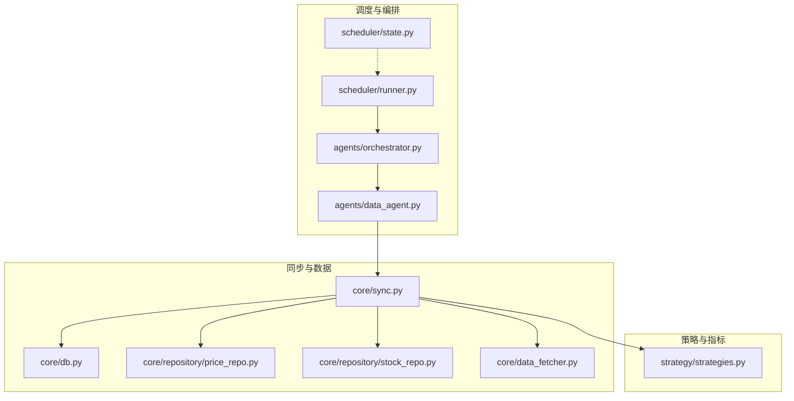
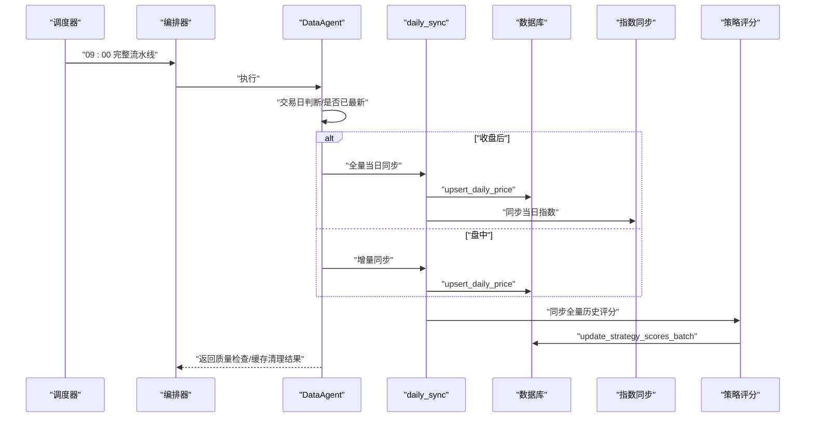
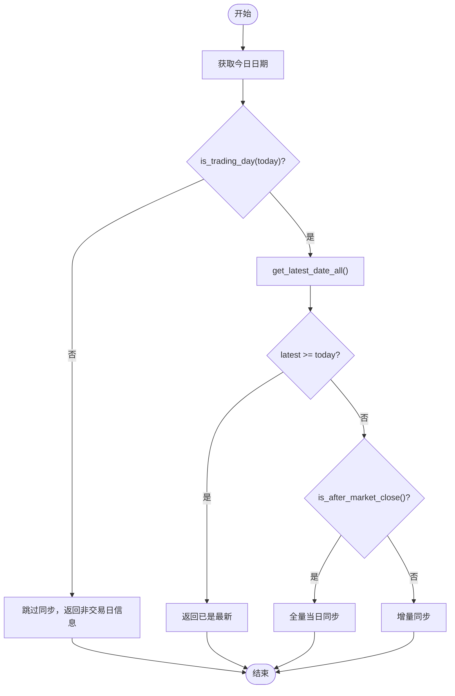
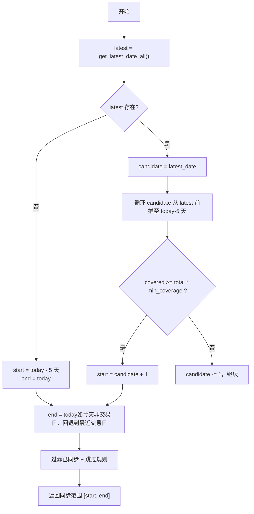
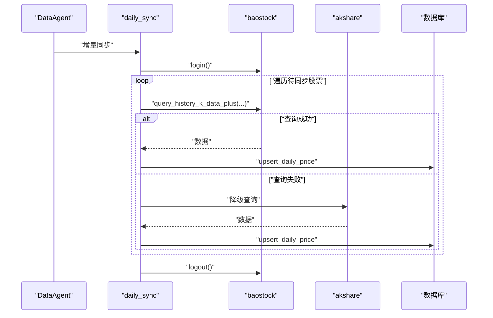
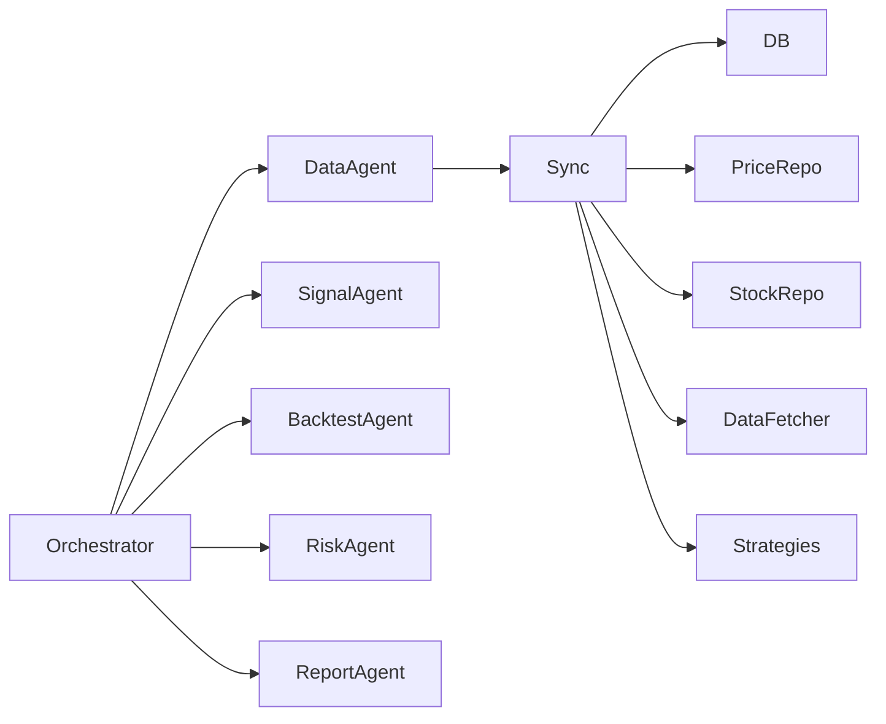

# 增量同步

<cite>
**本文引用的文件**
- [core/sync.py](file://core/sync.py)
- [agents/data_agent.py](file://agents/data_agent.py)
- [scheduler/runner.py](file://scheduler/runner.py)
- [scheduler/state.py](file://scheduler/state.py)
- [agents/orchestrator.py](file://agents/orchestrator.py)
- [core/db.py](file://core/db.py)
- [core/repository/price_repo.py](file://core/repository/price_repo.py)
- [core/repository/stock_repo.py](file://core/repository/stock_repo.py)
- [core/data_fetcher.py](file://core/data_fetcher.py)
- [strategy/strategies.py](file://strategy/strategies.py)
</cite>

## 目录
1. [简介](#简介)
2. [项目结构](#项目结构)
3. [核心组件](#核心组件)
4. [架构总览](#架构总览)
5. [详细组件分析](#详细组件分析)
6. [依赖关系分析](#依赖关系分析)
7. [性能考量](#性能考量)
8. [故障排查指南](#故障排查指南)
9. [结论](#结论)
10. [附录](#附录)

## 简介
本文档系统化阐述 AIQuant 的增量同步机制，覆盖每日增量同步的触发条件与执行流程、交易日判断、数据覆盖度评估与同步范围确定、算法实现（数据源选择策略、同步日期计算、股票过滤规则）、并发控制与线程安全、性能优化策略（批次处理、延迟控制、资源管理）、错误处理与重试（断点续传、缓存管理、故障恢复），以及与策略评分计算、指数数据同步等模块的集成方式。

## 项目结构
围绕增量同步的关键模块与文件如下：
- 核心同步逻辑：core/sync.py
- 数据代理（调度入口）：agents/data_agent.py
- 调度器与流水线：scheduler/runner.py、scheduler/state.py、agents/orchestrator.py
- 数据访问层：core/db.py、core/repository/price_repo.py、core/repository/stock_repo.py
- 数据源封装：core/data_fetcher.py
- 策略评分：strategy/strategies.py

图表来源
- [scheduler/runner.py:158-212](file://scheduler/runner.py#L158-L212)
- [agents/orchestrator.py:36-175](file://agents/orchestrator.py#L36-L175)
- [agents/data_agent.py:25-86](file://agents/data_agent.py#L25-L86)
- [core/sync.py:462-668](file://core/sync.py#L462-L668)
- [core/db.py:57-467](file://core/db.py#L57-L467)
- [core/repository/price_repo.py:13-93](file://core/repository/price_repo.py#L13-L93)
- [core/repository/stock_repo.py:13-80](file://core/repository/stock_repo.py#L13-L80)
- [core/data_fetcher.py:1-578](file://core/data_fetcher.py#L1-L578)
- [strategy/strategies.py:367-431](file://strategy/strategies.py#L367-L431)

章节来源
- [core/sync.py:1-760](file://core/sync.py#L1-L760)
- [agents/data_agent.py:1-167](file://agents/data_agent.py#L1-L167)
- [scheduler/runner.py:1-212](file://scheduler/runner.py#L1-L212)
- [scheduler/state.py:1-44](file://scheduler/state.py#L1-L44)
- [agents/orchestrator.py:1-263](file://agents/orchestrator.py#L1-L263)
- [core/db.py:1-1213](file://core/db.py#L1-L1213)
- [core/repository/price_repo.py:1-237](file://core/repository/price_repo.py#L1-L237)
- [core/repository/stock_repo.py:1-80](file://core/repository/stock_repo.py#L1-L80)
- [core/data_fetcher.py:1-578](file://core/data_fetcher.py#L1-L578)
- [strategy/strategies.py:1-431](file://strategy/strategies.py#L1-L431)

## 核心组件
- 交易日判断与时间窗口确定：is_trading_day、is_after_market_close、get_latest_date_all、get_stock_count_in_db
- 增量同步主流程：daily_sync（单线程，baostock 登录一次，逐只股票同步）
- 断点续传与缓存：_load_sync_cache/_save_sync_cache/_clear_sync_cache
- 股票过滤规则：_should_skip（ST/退市/北交所）
- 数据源选择：baostock（主）+ akshare（备用）
- 策略评分同步：sync_strategy_score（全量历史评分写入）
- 指数同步：sync_all_indices（仅同步到 end_date）

章节来源
- [core/sync.py:39-59](file://core/sync.py#L39-L59)
- [core/sync.py:462-668](file://core/sync.py#L462-L668)
- [core/sync.py:415-460](file://core/sync.py#L415-L460)
- [core/sync.py:63-72](file://core/sync.py#L63-L72)
- [core/sync.py:217-314](file://core/sync.py#L217-L314)
- [core/sync.py:675-702](file://core/sync.py#L675-L702)
- [core/sync.py:91-131](file://core/sync.py#L91-L131)

## 架构总览
增量同步在“多Agent流水线”模式下由 DataAgent 触发，内部根据是否收盘决定“全量当日”或“增量补缺”。核心流程如下：
- 交易日判断与是否已最新
- 若收盘：全量同步当日并同步指数
- 若盘中：增量同步（单线程，baostock 登录一次）
- 断点续传：缓存已同步股票，异常时保留缓存，完成后清理
- 策略评分：增量成功后同步全量历史评分

图表来源
- [scheduler/runner.py:108-137](file://scheduler/runner.py#L108-L137)
- [agents/orchestrator.py:81-175](file://agents/orchestrator.py#L81-L175)
- [agents/data_agent.py:31-121](file://agents/data_agent.py#L31-L121)
- [core/sync.py:462-668](file://core/sync.py#L462-L668)
- [core/repository/price_repo.py:13-48](file://core/repository/price_repo.py#L13-L48)
- [core/repository/price_repo.py:50-93](file://core/repository/price_repo.py#L50-L93)
- [core/sync.py:91-131](file://core/sync.py#L91-L131)

## 详细组件分析

### 交易日判断与时间窗口
- is_trading_day：基于 akshare 的交易日历判断，失败时按工作日回退
- is_after_market_close：判断 16:00 之后
- get_latest_date_all：全市场最新交易日
- get_stock_count_in_db：数据库中已有行情的股票数量

图表来源
- [core/sync.py:39-59](file://core/sync.py#L39-L59)
- [core/sync.py:475-527](file://core/sync.py#L475-L527)
- [core/db.py:749-756](file://core/db.py#L749-L756)
- [core/db.py:768-774](file://core/db.py#L768-L774)

章节来源
- [core/sync.py:39-59](file://core/sync.py#L39-L59)
- [core/sync.py:475-527](file://core/sync.py#L475-L527)
- [core/db.py:749-756](file://core/db.py#L749-L756)
- [core/db.py:768-774](file://core/db.py#L768-L774)

### 增量同步算法与范围确定
- 起始日期：从数据库最新日期向后推，寻找“近5日任一日期覆盖度≥min_coverage”的最早日期
- 结束日期：若今天为周末/节假日，向前取最近交易日
- 覆盖度评估：以“当日覆盖股票数/总股票数”作为指标，min_coverage 默认 0.9
- 股票过滤：跳过 ST/退市/北交所（baostock 不支持）

图表来源
- [core/sync.py:485-527](file://core/sync.py#L485-L527)
- [core/sync.py:499-507](file://core/sync.py#L499-L507)
- [core/sync.py:516-522](file://core/sync.py#L516-L522)
- [core/sync.py:63-72](file://core/sync.py#L63-L72)

章节来源
- [core/sync.py:485-527](file://core/sync.py#L485-L527)
- [core/sync.py:499-507](file://core/sync.py#L499-L507)
- [core/sync.py:516-522](file://core/sync.py#L516-L522)
- [core/sync.py:63-72](file://core/sync.py#L63-L72)

### 数据源选择与同步日期计算
- 主数据源：baostock（单线程登录一次，逐只查询）
- 备用数据源：akshare（降级）
- 日期格式转换：YYYY-MM-DD
- 同步范围：start_date ~ end_date（end_date 为最近交易日）

图表来源
- [agents/data_agent.py:88-120](file://agents/data_agent.py#L88-L120)
- [core/sync.py:548-644](file://core/sync.py#L548-L644)
- [core/sync.py:237-314](file://core/sync.py#L237-L314)
- [core/data_fetcher.py:79-134](file://core/data_fetcher.py#L79-L134)

章节来源
- [agents/data_agent.py:88-120](file://agents/data_agent.py#L88-L120)
- [core/sync.py:548-644](file://core/sync.py#L548-L644)
- [core/sync.py:237-314](file://core/sync.py#L237-L314)
- [core/data_fetcher.py:79-134](file://core/data_fetcher.py#L79-L134)

### 股票过滤规则
- ST/退市/特殊字符过滤
- 北交所股票（代码前缀 430/830/870/920）跳过（baostock 不支持）
- 代码格式转换：_format_code_for_baostock

章节来源
- [core/sync.py:63-72](file://core/sync.py#L63-L72)
- [core/sync.py:181-215](file://core/sync.py#L181-L215)

### 并发控制与线程安全
- daily_sync 采用单线程设计，baostock 不支持多线程，因此：
  - 仅在单线程内登录一次（bs.login），随后逐只查询
  - 异常时确保 bs.logout() 被调用
- 数据库连接：get_conn 使用 WAL 模式与 NORMAL 同步级别，提升并发写入性能
- baostock 连接管理：core/data_fetcher.py 提供全局锁与单例登录，确保线程安全

章节来源
- [core/sync.py:462-472](file://core/sync.py#L462-L472)
- [core/sync.py:548-552](file://core/sync.py#L548-L552)
- [core/sync.py:642-644](file://core/sync.py#L642-L644)
- [core/db.py:26-40](file://core/db.py#L26-L40)
- [core/data_fetcher.py:31-45](file://core/data_fetcher.py#L31-L45)

### 性能优化策略
- 批次处理：按股票数量分批，减少内存峰值
- 延迟控制：BASE_INTERVAL（0.05s）与 INTER_BATCH_DELAY（0.5s）降低请求压力
- 实时缓存：每 10 只保存一次同步缓存，便于断点续传
- 索引优化：数据库为 daily_price/index_daily 建立复合索引，加速查询与去重更新
- 评分写入：策略评分批量更新，避免逐行写入

章节来源
- [core/sync.py:31-35](file://core/sync.py#L31-L35)
- [core/sync.py:365-370](file://core/sync.py#L365-L370)
- [core/sync.py:632-634](file://core/sync.py#L632-L634)
- [core/db.py:92-93](file://core/db.py#L92-L93)
- [core/db.py:109-110](file://core/db.py#L109-L110)
- [core/repository/price_repo.py:79-92](file://core/repository/price_repo.py#L79-L92)

### 错误处理与重试机制
- 断点续传：_load_sync_cache/_save_sync_cache/_clear_sync_cache
- 异常保护：逐只股票 try-except，失败计数，不影响整体流程
- 登出保障：finally 确保 bs.logout()
- 备用数据源：baostock 失败自动降级 akshare
- 策略评分容错：DataAgent 中对 sync_strategy_score 的异常捕获

章节来源
- [core/sync.py:415-460](file://core/sync.py#L415-L460)
- [core/sync.py:638-644](file://core/sync.py#L638-L644)
- [core/sync.py:285-313](file://core/sync.py#L285-L313)
- [agents/data_agent.py:99-102](file://agents/data_agent.py#L99-L102)

### 与策略评分计算和指数同步的集成
- 策略评分：daily_sync 成功后调用 sync_strategy_score，全量历史评分写入 daily_price
- 指数同步：始终同步到 end_date，不受覆盖率影响，供大盘择时使用

章节来源
- [core/sync.py:675-702](file://core/sync.py#L675-L702)
- [core/sync.py:657-666](file://core/sync.py#L657-L666)
- [core/sync.py:91-131](file://core/sync.py#L91-L131)

## 依赖关系分析
- DataAgent 依赖 core/sync 的 daily_sync/is_trading_day/is_after_market_close
- daily_sync 依赖 core/db 的 get_all_stocks/get_latest_date_all/get_stock_count_in_db/upsert_daily_price/update_strategy_scores_batch
- daily_sync 依赖 core/data_fetcher 的 get_market_index（指数）
- daily_sync 依赖 strategy/strategies 的策略评分融合函数
- Orchestrator 串行/并行编排，依赖 agents/*.py 的具体 Agent

图表来源
- [agents/data_agent.py:18-22](file://agents/data_agent.py#L18-L22)
- [core/sync.py:17-26](file://core/sync.py#L17-L26)
- [agents/orchestrator.py:46-52](file://agents/orchestrator.py#L46-L52)

章节来源
- [agents/data_agent.py:18-22](file://agents/data_agent.py#L18-L22)
- [core/sync.py:17-26](file://core/sync.py#L17-L26)
- [agents/orchestrator.py:46-52](file://agents/orchestrator.py#L46-L52)

## 性能考量
- 单线程 baostock：避免多线程竞争，降低登录/查询复杂度
- 批次与延迟：BASE_INTERVAL 与 INTER_BATCH_DELAY 控制请求节奏
- 数据库 WAL：提升写入吞吐，减少锁争用
- 索引：复合索引加速 upsert 与查询
- 评分批量写入：避免逐行更新带来的 IO 放大

## 故障排查指南
- 增量同步无进展
  - 检查 is_trading_day 与 is_after_market_close 的返回
  - 确认 get_latest_date_all 是否为今日或最近交易日
- 断点续传未生效
  - 检查 .sync_cache 文件是否存在与内容
  - 确认异常时缓存被保存，完成后清理
- 策略评分缺失
  - daily_sync 成功后是否调用 sync_strategy_score
  - update_strategy_scores_batch 是否写入成功
- 指数未同步
  - end_date 是否为最近交易日
  - sync_all_indices 是否被调用

章节来源
- [core/sync.py:529-540](file://core/sync.py#L529-L540)
- [core/sync.py:646-650](file://core/sync.py#L646-L650)
- [core/sync.py:675-702](file://core/sync.py#L675-L702)
- [core/sync.py:657-666](file://core/sync.py#L657-L666)

## 结论
AIQuant 的增量同步以“交易日判断 + 覆盖度评估 + 单线程 baostock + 断点续传”为核心，结合 akshare 备用数据源与策略评分全量写入，形成稳定高效的每日同步流程。通过数据库索引、批次处理与延迟控制，兼顾了性能与可靠性；通过缓存与异常保护，实现了断点续传与故障恢复。与策略评分与指数同步的集成，进一步完善了数据链路与业务闭环。

## 附录
- 调度模式切换：通过环境变量 AGENT_MODE=pipeline 启用流水线模式
- 调度时间：流水线模式 07:30 预同步数据，09:00 完整流水线

章节来源
- [scheduler/runner.py:22-22](file://scheduler/runner.py#L22-L22)
- [scheduler/runner.py:167-176](file://scheduler/runner.py#L167-L176)