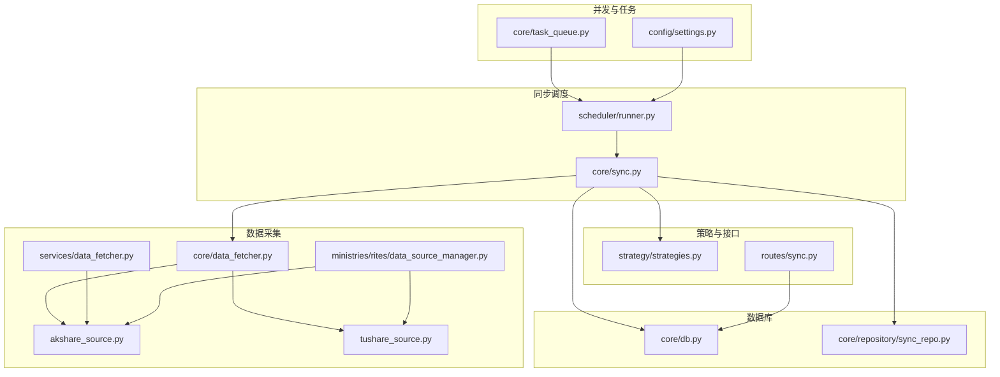
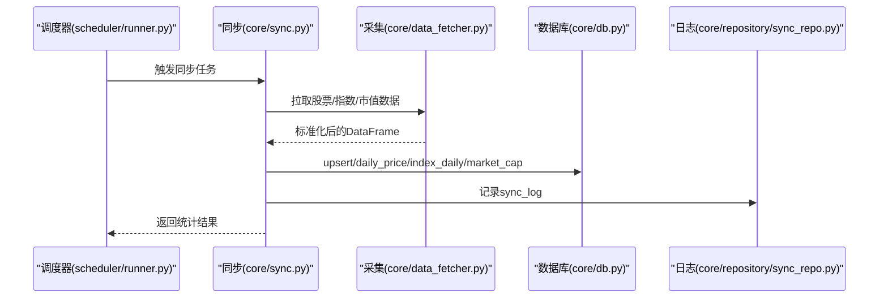
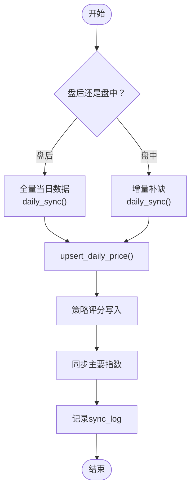
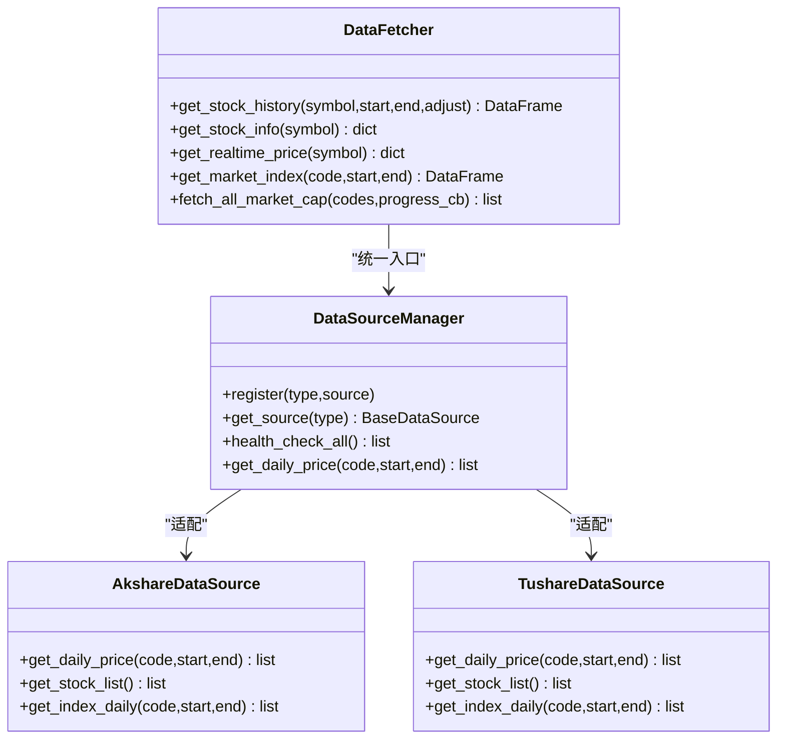
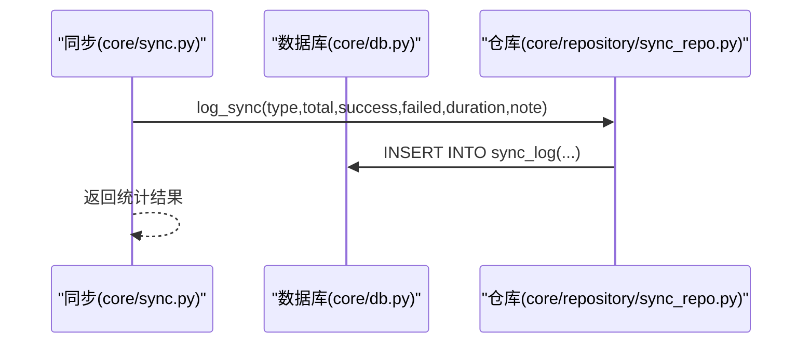
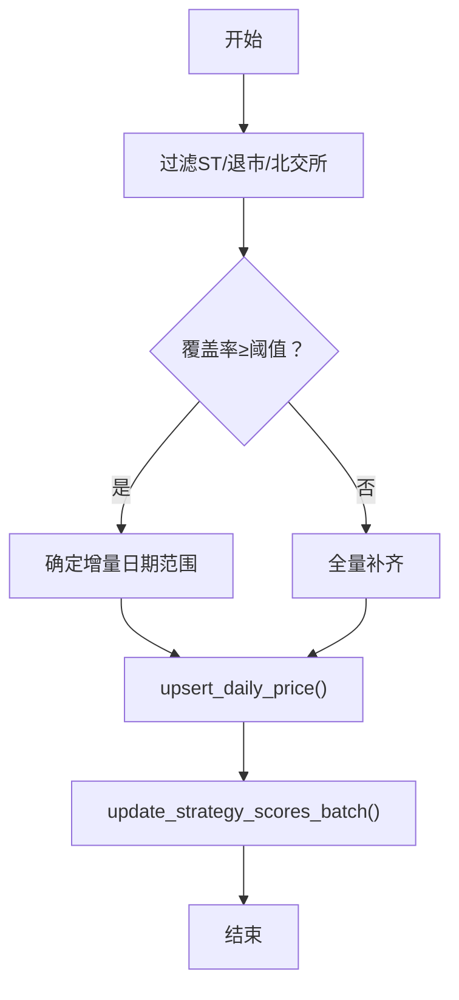
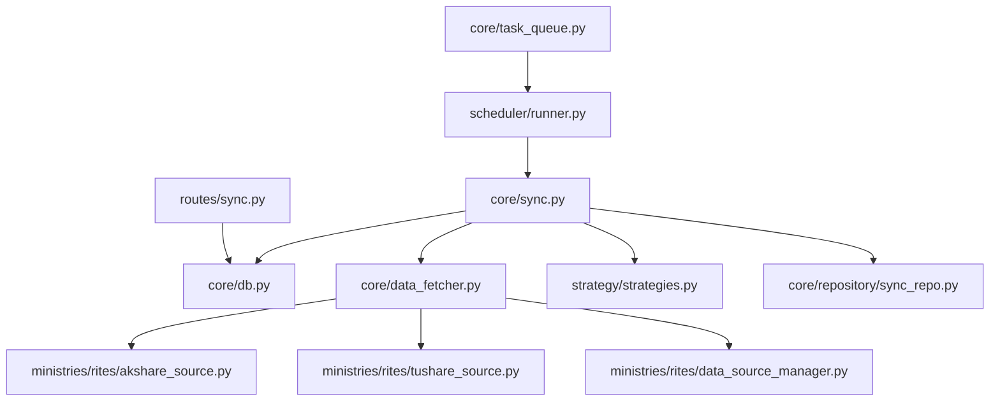

# 数据同步机制

<cite>
**本文档引用的文件**
- [core/sync.py](file://core/sync.py)
- [core/data_fetcher.py](file://core/data_fetcher.py)
- [core/db.py](file://core/db.py)
- [core/repository/sync_repo.py](file://core/repository/sync_repo.py)
- [ministries/rites/data_source_manager.py](file://ministries/rites/data_source_manager.py)
- [ministries/rites/akshare_source.py](file://ministries/rites/akshare_source.py)
- [ministries/rites/tushare_source.py](file://ministries/rites/tushare_source.py)
- [services/data_fetcher.py](file://services/data_fetcher.py)
- [strategy/strategies.py](file://strategy/strategies.py)
- [routes/sync.py](file://routes/sync.py)
- [scheduler/runner.py](file://scheduler/runner.py)
- [core/task_queue.py](file://core/task_queue.py)
- [config/settings.py](file://config/settings.py)
</cite>

## 目录
1. [简介](#简介)
2. [项目结构](#项目结构)
3. [核心组件](#核心组件)
4. [架构总览](#架构总览)
5. [详细组件分析](#详细组件分析)
6. [依赖关系分析](#依赖关系分析)
7. [性能考虑](#性能考虑)
8. [故障排查指南](#故障排查指南)
9. [结论](#结论)
10. [附录](#附录)

## 简介
本文件系统性阐述 AIQuant 的数据同步机制，涵盖整体架构、工作流程（全量、增量、实时）、数据采集器设计、同步日志与监控、数据质量保障、错误处理与重试、性能优化与并发控制、配置参数与调优建议，以及与外部数据源的集成方式与协议处理。

## 项目结构
AIQuant 的数据同步涉及以下关键模块：
- 同步调度与执行：core/sync.py、scheduler/runner.py
- 数据采集与转换：core/data_fetcher.py、services/data_fetcher.py
- 数据源适配：ministries/rites/data_source_manager.py、akshare_source.py、tushare_source.py
- 数据库层：core/db.py、core/repository/sync_repo.py
- 策略评分与融合：strategy/strategies.py
- 接口与监控：routes/sync.py
- 异步任务与并发：core/task_queue.py
- 配置：config/settings.py

**图表来源**
- [scheduler/runner.py:158-212](file://scheduler/runner.py#L158-L212)
- [core/sync.py:1-760](file://core/sync.py#L1-L760)
- [core/data_fetcher.py:1-578](file://core/data_fetcher.py#L1-L578)
- [services/data_fetcher.py:1-106](file://services/data_fetcher.py#L1-L106)
- [ministries/rites/data_source_manager.py:1-190](file://ministries/rites/data_source_manager.py#L1-L190)
- [ministries/rites/akshare_source.py:1-135](file://ministries/rites/akshare_source.py#L1-L135)
- [ministries/rites/tushare_source.py:1-167](file://ministries/rites/tushare_source.py#L1-L167)
- [core/db.py:1-800](file://core/db.py#L1-L800)
- [core/repository/sync_repo.py:1-55](file://core/repository/sync_repo.py#L1-L55)
- [strategy/strategies.py:1-431](file://strategy/strategies.py#L1-L431)
- [routes/sync.py:1-140](file://routes/sync.py#L1-L140)
- [core/task_queue.py:1-222](file://core/task_queue.py#L1-L222)
- [config/settings.py:1-25](file://config/settings.py#L1-L25)

**章节来源**
- [core/sync.py:1-760](file://core/sync.py#L1-L760)
- [core/data_fetcher.py:1-578](file://core/data_fetcher.py#L1-L578)
- [core/db.py:1-800](file://core/db.py#L1-L800)
- [ministries/rites/data_source_manager.py:1-190](file://ministries/rites/data_source_manager.py#L1-L190)
- [services/data_fetcher.py:1-106](file://services/data_fetcher.py#L1-L106)
- [strategy/strategies.py:1-431](file://strategy/strategies.py#L1-L431)
- [routes/sync.py:1-140](file://routes/sync.py#L1-L140)
- [scheduler/runner.py:1-212](file://scheduler/runner.py#L1-L212)
- [core/task_queue.py:1-222](file://core/task_queue.py#L1-L222)
- [config/settings.py:1-25](file://config/settings.py#L1-L25)

## 核心组件
- 同步调度器：负责定时任务、盘中/盘后策略、流水线模式切换。
- 数据采集器：统一入口，主数据源 baostock，备用 akshare/tushare，支持缓存与降级。
- 数据库层：SQLite，提供 upsert、批量写入、索引与约束，支持策略评分列迁移。
- 策略评分：多策略独立评分与融合，写入 daily_price。
- 同步日志：记录每次同步的类型、总量、成功/失败、耗时与备注。
- 并发与任务队列：轻量线程池任务队列，支持回调与状态查询。
- 配置中心：数据库路径、API、定时时间、同步批大小等。

**章节来源**
- [core/sync.py:1-760](file://core/sync.py#L1-L760)
- [core/data_fetcher.py:1-578](file://core/data_fetcher.py#L1-L578)
- [core/db.py:1-800](file://core/db.py#L1-L800)
- [core/repository/sync_repo.py:1-55](file://core/repository/sync_repo.py#L1-L55)
- [core/task_queue.py:1-222](file://core/task_queue.py#L1-L222)
- [config/settings.py:1-25](file://config/settings.py#L1-L25)

## 架构总览
AIQuant 的数据同步采用“调度驱动 + 多数据源适配 + 数据库持久化”的分层架构。核心流程：
- 调度器在固定时间触发同步任务，区分盘中增量与盘后全量。
- 数据采集器统一从 baostock 拉取，失败时自动降级至 akshare/tushare，并进行列标准化与类型转换。
- 数据写入数据库，同时计算并写入策略评分，最后记录同步日志。

**图表来源**
- [scheduler/runner.py:29-87](file://scheduler/runner.py#L29-L87)
- [core/sync.py:319-389](file://core/sync.py#L319-L389)
- [core/data_fetcher.py:173-223](file://core/data_fetcher.py#L173-L223)
- [core/db.py:543-706](file://core/db.py#L543-L706)
- [core/repository/sync_repo.py:18-25](file://core/repository/sync_repo.py#L18-L25)

## 详细组件分析

### 同步策略与流程
- 全量同步（首次/补录）：遍历股票列表，按批次拉取历史数据，支持断点续传缓存，写入 daily_price。
- 增量同步（盘后/盘中）：根据全市场覆盖率阈值动态确定日期范围，单线程访问 baostock，写入 daily_price 并同步主要指数。
- 实时同步（接口）：提供接口触发单只股票快速拉取与保存。

**图表来源**
- [core/sync.py:462-668](file://core/sync.py#L462-L668)
- [core/db.py:543-578](file://core/db.py#L543-L578)
- [core/repository/sync_repo.py:18-25](file://core/repository/sync_repo.py#L18-L25)

**章节来源**
- [core/sync.py:319-389](file://core/sync.py#L319-L389)
- [core/sync.py:462-668](file://core/sync.py#L462-L668)
- [core/db.py:543-578](file://core/db.py#L543-L578)
- [core/repository/sync_repo.py:18-25](file://core/repository/sync_repo.py#L18-L25)

### 数据采集器 DataFetcher 设计与实现
- 多数据源支持：主数据源 baostock，备用 akshare/tushare；akshare 提供多接口降级（东方财富→新浪）。
- 代码格式转换：统一转换为 baostock 格式（sh./sz./bj.），并支持 akshare 格式。
- 数据格式转换：列名标准化、数值类型转换、索引设置、空值过滤。
- 缓存与降级：本地 CSV 缓存，失败自动降级，异常捕获与提示。
- 市值数据：通过 baostock 换手率反推流通股本，无频率限制。

**图表来源**
- [core/data_fetcher.py:173-223](file://core/data_fetcher.py#L173-L223)
- [ministries/rites/data_source_manager.py:111-178](file://ministries/rites/data_source_manager.py#L111-L178)
- [ministries/rites/akshare_source.py:45-82](file://ministries/rites/akshare_source.py#L45-L82)
- [ministries/rites/tushare_source.py:65-103](file://ministries/rites/tushare_source.py#L65-L103)

**章节来源**
- [core/data_fetcher.py:79-134](file://core/data_fetcher.py#L79-L134)
- [core/data_fetcher.py:136-167](file://core/data_fetcher.py#L136-L167)
- [core/data_fetcher.py:371-424](file://core/data_fetcher.py#L371-L424)
- [ministries/rites/data_source_manager.py:111-178](file://ministries/rites/data_source_manager.py#L111-L178)
- [ministries/rites/akshare_source.py:45-82](file://ministries/rites/akshare_source.py#L45-L82)
- [ministries/rites/tushare_source.py:65-103](file://ministries/rites/tushare_source.py#L65-L103)

### 同步日志 SyncLog 记录机制与监控
- 记录内容：同步时间、类型、总量、成功/失败、耗时、备注。
- 存储位置：sync_log 表。
- 查询接口：提供最近 N 条日志查询。
- 监控：结合数据库统计接口输出同步状态与数据规模。

**图表来源**
- [core/sync.py:386-389](file://core/sync.py#L386-L389)
- [core/repository/sync_repo.py:18-25](file://core/repository/sync_repo.py#L18-L25)
- [core/db.py:157-166](file://core/db.py#L157-L166)

**章节来源**
- [core/repository/sync_repo.py:18-33](file://core/repository/sync_repo.py#L18-L33)
- [core/db.py:157-166](file://core/db.py#L157-L166)

### 数据质量保证
- 数据验证：数值列类型转换与空值过滤，过滤 ST/退市/北交所不支持股票。
- 去重处理：数据库唯一索引（code, trade_date），upsert 写入避免重复。
- 完整性检查：覆盖率阈值（min_coverage）动态确定增量日期范围，确保全市场覆盖。
- 策略评分完整性：全量历史评分写入 daily_price，便于回测直接读取。

**图表来源**
- [core/sync.py:395-413](file://core/sync.py#L395-L413)
- [core/sync.py:494-510](file://core/sync.py#L494-L510)
- [core/db.py:543-578](file://core/db.py#L543-L578)
- [core/db.py:581-629](file://core/db.py#L581-L629)

**章节来源**
- [core/sync.py:63-72](file://core/sync.py#L63-L72)
- [core/sync.py:494-510](file://core/sync.py#L494-L510)
- [core/db.py:543-578](file://core/db.py#L543-L578)
- [core/db.py:581-629](file://core/db.py#L581-L629)

### 错误处理、重试与故障恢复
- 主备降级：baostock 失败自动切换 akshare/tushare；akshare 内部多接口降级。
- 异常捕获：统一 try-except 捕获，记录失败原因，继续下一个股票。
- 断点续传：同步缓存文件记录已同步股票，部分完成保留缓存，全部完成后清理。
- 登录与会话：baostock 单实例登录，线程安全；失败抛出异常并终止当前任务。
- 故障恢复：调度器非运行态才允许再次触发，避免重复执行。

**章节来源**
- [core/data_fetcher.py:136-167](file://core/data_fetcher.py#L136-L167)
- [core/sync.py:422-450](file://core/sync.py#L422-L450)
- [core/sync.py:549-552](file://core/sync.py#L549-L552)
- [scheduler/runner.py:186-192](file://scheduler/runner.py#L186-L192)

### 性能优化、并发控制与资源管理
- 并发策略：盘后全量使用单线程访问 baostock（不支持多线程），盘中增量同样单线程；通过批次间隔与基础延迟控制请求节奏。
- 数据库优化：WAL 模式、NORMAL 同步级别、索引优化（code+date、date 等）。
- 缓存：本地 CSV 缓存减少重复请求。
- 任务队列：轻量线程池任务队列，支持回调与状态查询，适合单机异步任务场景。
- 资源管理：baostock 登出、异常回滚、连接超时设置。

**章节来源**
- [core/sync.py:31-35](file://core/sync.py#L31-L35)
- [core/sync.py:366-377](file://core/sync.py#L366-L377)
- [core/db.py:26-40](file://core/db.py#L26-L40)
- [core/task_queue.py:54-61](file://core/task_queue.py#L54-L61)
- [core/data_fetcher.py:28-45](file://core/data_fetcher.py#L28-L45)

### 同步配置参数与调优建议
- 基础配置：数据库路径、API 主机端口、定时时间、同步批大小、日志级别。
- 同步参数：历史起始日期、基础间隔、批次大小、批次间隔、覆盖率阈值。
- 调优建议：
  - 增量同步：适当提高 INTER_BATCH_DELAY 降低接口压力。
  - 全量同步：合理设置 BATCH_SIZE 与 BASE_INTERVAL，避免触发外部接口限流。
  - 覆盖率阈值：根据市场活跃度调整 min_coverage，平衡速度与完整性。
  - 数据库：定期维护索引与统计，关注 WAL 日志增长。

**章节来源**
- [config/settings.py:6-25](file://config/settings.py#L6-L25)
- [core/sync.py:31-35](file://core/sync.py#L31-L35)
- [core/sync.py:462-472](file://core/sync.py#L462-L472)

### 与外部数据源的集成方式与协议处理
- baostock：主数据源，统一登录、查询、解析、转换；无频率限制。
- akshare：备用数据源，多接口降级；列名标准化；支持指数与股票列表。
- tushare：可选备用数据源，需配置 Token；列名标准化；指数映射。
- 协议处理：HTTP/REST 接口，统一异常捕获与降级策略；本地缓存减少重复请求。

**章节来源**
- [core/data_fetcher.py:79-134](file://core/data_fetcher.py#L79-L134)
- [core/data_fetcher.py:136-167](file://core/data_fetcher.py#L136-L167)
- [ministries/rites/akshare_source.py:45-82](file://ministries/rites/akshare_source.py#L45-L82)
- [ministries/rites/tushare_source.py:65-103](file://ministries/rites/tushare_source.py#L65-L103)

## 依赖关系分析

**图表来源**
- [core/sync.py:17-26](file://core/sync.py#L17-L26)
- [core/data_fetcher.py:12-20](file://core/data_fetcher.py#L12-L20)
- [ministries/rites/data_source_manager.py:11-16](file://ministries/rites/data_source_manager.py#L11-L16)
- [routes/sync.py:10-20](file://routes/sync.py#L10-L20)
- [scheduler/runner.py:32-35](file://scheduler/runner.py#L32-L35)
- [core/task_queue.py:54-61](file://core/task_queue.py#L54-L61)

**章节来源**
- [core/sync.py:17-26](file://core/sync.py#L17-L26)
- [core/data_fetcher.py:12-20](file://core/data_fetcher.py#L12-L20)
- [ministries/rites/data_source_manager.py:11-16](file://ministries/rites/data_source_manager.py#L11-L16)
- [routes/sync.py:10-20](file://routes/sync.py#L10-L20)
- [scheduler/runner.py:32-35](file://scheduler/runner.py#L32-L35)
- [core/task_queue.py:54-61](file://core/task_queue.py#L54-L61)

## 性能考虑
- 请求节流：通过批次间隔与基础延迟控制请求速率，避免外部接口限流。
- 数据库写入：批量 upsert + 唯一索引，减少重复写入；WAL 模式提升并发写入性能。
- 缓存策略：本地 CSV 缓存短期复用，降低网络请求。
- 并发模型：单线程访问 baostock，避免会话冲突；线程池用于其他异步任务。
- 监控与统计：同步日志与数据库统计接口，便于性能评估与问题定位。

[本节为通用指导，无需特定文件来源]

## 故障排查指南
- 常见问题：
  - 网络异常：检查代理与 DNS；查看 baostock/akshare/tushare 可用性。
  - 登录失败：确认 baostock 账号状态；重试登录。
  - 数据为空：检查股票代码格式、过滤规则（ST/退市/北交所）。
  - 覆盖率不足：调整 min_coverage 阈值或手动触发全量补齐。
- 排查步骤：
  - 查看同步日志：最近 N 条 sync_log。
  - 检查数据库统计：股票数、行情条数、最新日期、数据库大小。
  - 单点测试：使用命令行触发 test/daily/init。
  - 任务队列：查询任务状态与回调结果。

**章节来源**
- [core/repository/sync_repo.py:28-33](file://core/repository/sync_repo.py#L28-L33)
- [core/db.py:36-54](file://core/db.py#L36-L54)
- [core/sync.py:734-760](file://core/sync.py#L734-L760)
- [core/task_queue.py:102-124](file://core/task_queue.py#L102-L124)

## 结论
AIQuant 的数据同步机制以“调度驱动 + 多数据源适配 + 数据库持久化”为核心，通过断点续传、覆盖率阈值、主备降级与统一日志，实现了高可靠、可监控、可扩展的数据同步体系。配合数据库优化、缓存与线程池任务队列，满足生产环境的性能与稳定性要求。

[本节为总结，无需特定文件来源]

## 附录
- 关键接口与路径：
  - 全量/增量同步：core/sync.py
  - 数据采集：core/data_fetcher.py、services/data_fetcher.py
  - 数据源适配：ministries/rites/data_source_manager.py、akshare_source.py、tushare_source.py
  - 数据库：core/db.py
  - 同步日志：core/repository/sync_repo.py
  - 策略评分：strategy/strategies.py
  - 接口：routes/sync.py
  - 调度：scheduler/runner.py
  - 任务队列：core/task_queue.py
  - 配置：config/settings.py

[本节为补充说明，无需特定文件来源]