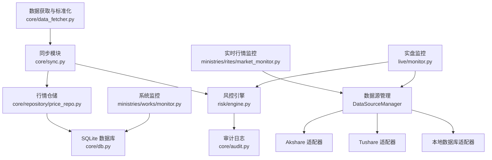
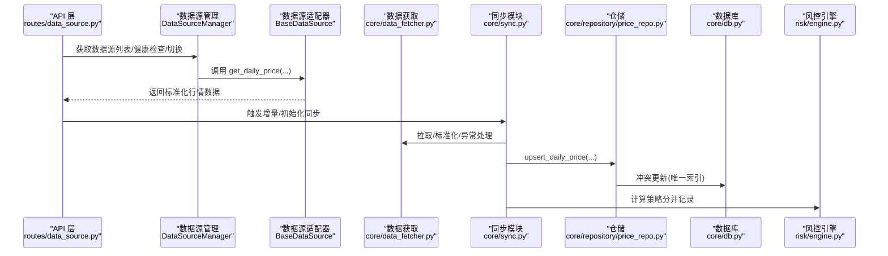
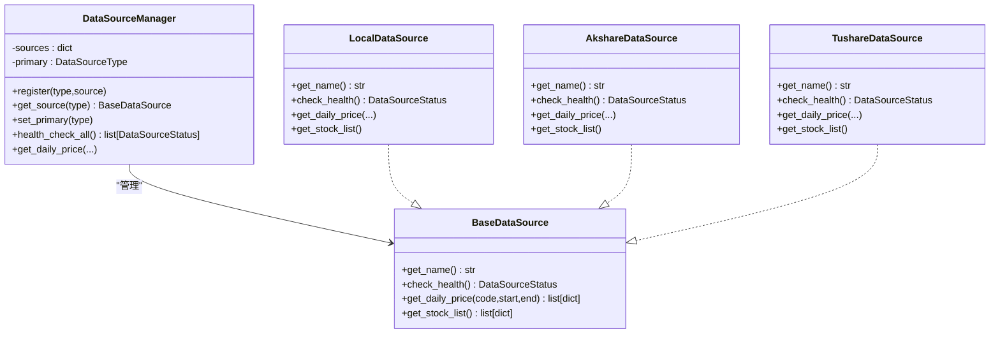
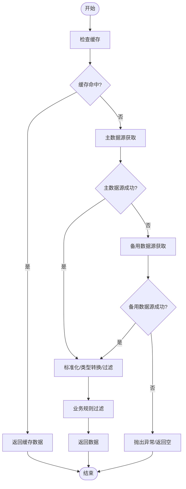
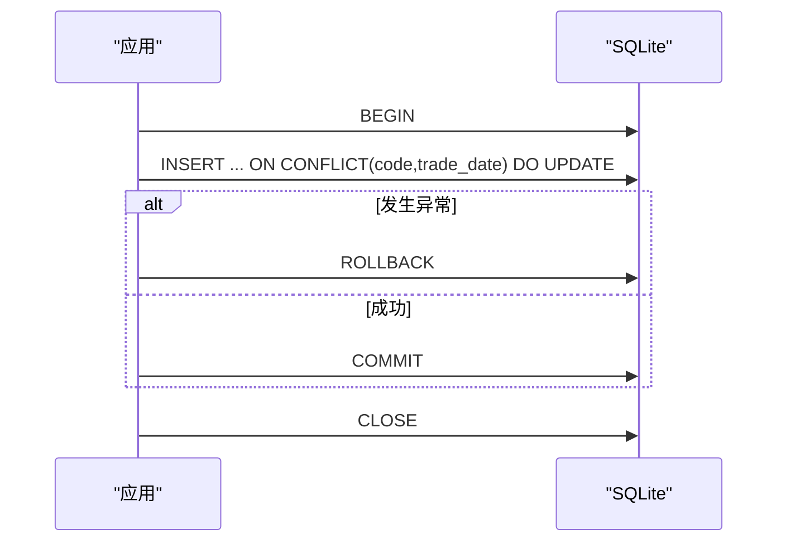
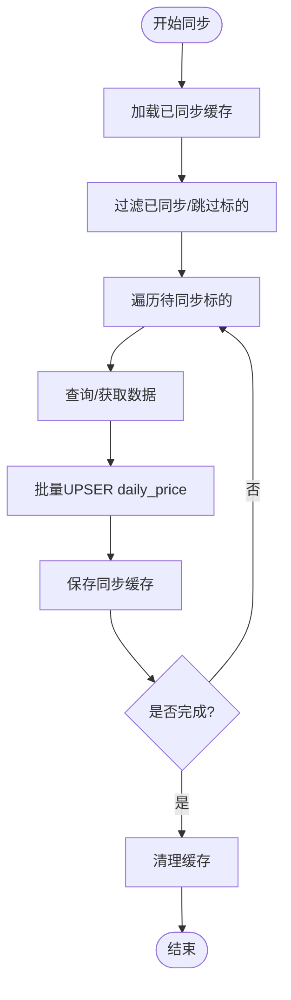
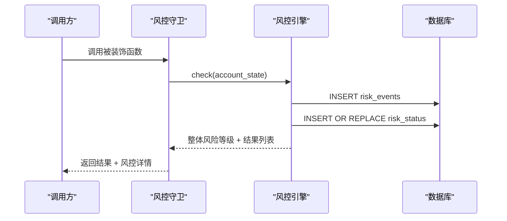
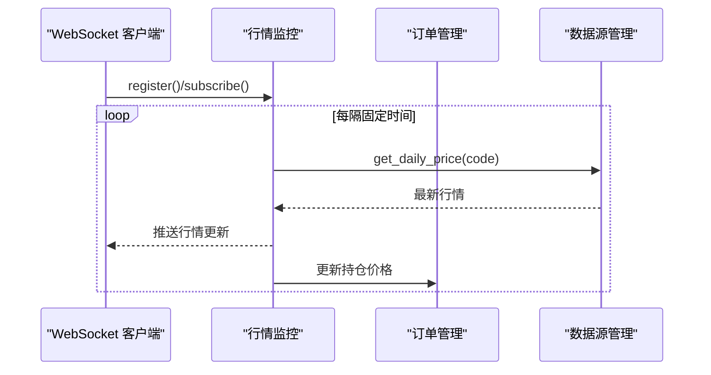
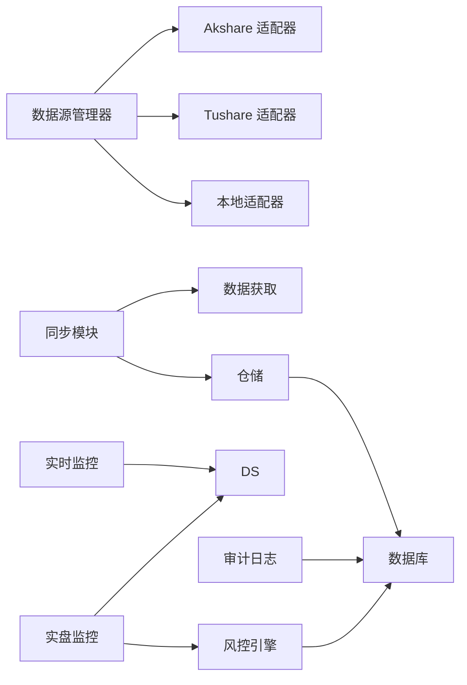

# 数据质量保证

<cite>
**本文引用的文件**
- [core/data_fetcher.py](file://core/data_fetcher.py)
- [core/db.py](file://core/db.py)
- [ministries/rites/data_source_manager.py](file://ministries/rites/data_source_manager.py)
- [ministries/rites/akshare_source.py](file://ministries/rites/akshare_source.py)
- [ministries/rites/tushare_source.py](file://ministries/rites/tushare_source.py)
- [core/sync.py](file://core/sync.py)
- [core/repository/price_repo.py](file://core/repository/price_repo.py)
- [risk/engine.py](file://risk/engine.py)
- [risk/guard.py](file://risk/guard.py)
- [routes/data_source.py](file://routes/data_source.py)
- [core/audit.py](file://core/audit.py)
- [ministries/rites/market_monitor.py](file://ministries/rites/market_monitor.py)
- [live/monitor.py](file://live/monitor.py)
- [ministries/works/monitor.py](file://ministries/works/monitor.py)
- [routes/common.py](file://routes/common.py)
</cite>

## 目录
1. [简介](#简介)
2. [项目结构](#项目结构)
3. [核心组件](#核心组件)
4. [架构总览](#架构总览)
5. [详细组件分析](#详细组件分析)
6. [依赖分析](#依赖分析)
7. [性能考虑](#性能考虑)
8. [故障排查指南](#故障排查指南)
9. [结论](#结论)
10. [附录](#附录)

## 简介
本文件面向AIQuant项目的“数据质量保证”主题，系统梳理并解释项目中已有的数据验证规则、去重策略、一致性保障、清洗与预处理流程、监控与告警机制、质量报告与统计分析，以及持续优化策略与最佳实践。内容以仓库现有实现为基础，结合代码级分析与可视化图示，帮助开发者与运维人员理解并扩展数据质量体系。

## 项目结构
AIQuant围绕“数据源接入—数据同步—数据库存储—策略评分—风控与监控—审计与告警”的链路组织模块，其中数据质量相关的关键模块包括：
- 数据源管理与适配：多数据源接入、健康检查、主备切换
- 数据获取与标准化：统一格式、类型转换、异常处理
- 数据库层：唯一约束、冲突更新、事务与回滚
- 同步与去重：断点续传、覆盖率控制、唯一索引
- 风控与监控：实时告警、阈值控制、状态记录
- 审计与可观测性：审计日志、系统指标、告警推送

图表来源
- [ministries/rites/data_source_manager.py:111-178](file://ministries/rites/data_source_manager.py#L111-L178)
- [ministries/rites/akshare_source.py:15-100](file://ministries/rites/akshare_source.py#L15-L100)
- [ministries/rites/tushare_source.py:16-127](file://ministries/rites/tushare_source.py#L16-L127)
- [core/data_fetcher.py:173-223](file://core/data_fetcher.py#L173-L223)
- [core/sync.py:462-668](file://core/sync.py#L462-L668)
- [core/repository/price_repo.py:13-47](file://core/repository/price_repo.py#L13-L47)
- [core/db.py:26-39](file://core/db.py#L26-L39)
- [risk/engine.py:13-71](file://risk/engine.py#L13-L71)
- [core/audit.py:16-39](file://core/audit.py#L16-L39)
- [ministries/rites/market_monitor.py:21-132](file://ministries/rites/market_monitor.py#L21-L132)
- [live/monitor.py:55-155](file://live/monitor.py#L55-L155)
- [ministries/works/monitor.py:29-101](file://ministries/works/monitor.py#L29-L101)

章节来源
- [ministries/rites/data_source_manager.py:111-178](file://ministries/rites/data_source_manager.py#L111-L178)
- [core/data_fetcher.py:173-223](file://core/data_fetcher.py#L173-L223)
- [core/sync.py:462-668](file://core/sync.py#L462-L668)
- [core/repository/price_repo.py:13-47](file://core/repository/price_repo.py#L13-L47)
- [core/db.py:26-39](file://core/db.py#L26-L39)

## 核心组件
- 数据源管理与健康检查：统一抽象、状态枚举、主备切换、健康检查接口
- 数据获取与标准化：baostock/akshare/tushare多源获取、格式标准化、类型转换、异常处理
- 数据库层：上下文管理连接、唯一索引、冲突更新、事务回滚
- 同步与去重：断点续传、覆盖率阈值、唯一索引约束、批量写入
- 风控与审计：风控检查与记录、审计日志记录与查询
- 实时监控：WebSocket行情推送、实盘监控告警、系统指标采集

章节来源
- [ministries/rites/data_source_manager.py:18-46](file://ministries/rites/data_source_manager.py#L18-L46)
- [ministries/rites/akshare_source.py:21-43](file://ministries/rites/akshare_source.py#L21-L43)
- [ministries/rites/tushare_source.py:33-63](file://ministries/rites/tushare_source.py#L33-L63)
- [core/data_fetcher.py:79-133](file://core/data_fetcher.py#L79-L133)
- [core/db.py:26-39](file://core/db.py#L26-L39)
- [core/sync.py:462-668](file://core/sync.py#L462-L668)
- [core/repository/price_repo.py:13-47](file://core/repository/price_repo.py#L13-L47)
- [risk/engine.py:51-71](file://risk/engine.py#L51-L71)
- [core/audit.py:16-39](file://core/audit.py#L16-L39)
- [ministries/rites/market_monitor.py:108-152](file://ministries/rites/market_monitor.py#L108-L152)
- [live/monitor.py:102-155](file://live/monitor.py#L102-L155)
- [ministries/works/monitor.py:36-101](file://ministries/works/monitor.py#L36-L101)

## 架构总览
下图展示数据质量相关的关键交互：数据源管理负责健康检查与主备切换；数据获取模块进行标准化与异常处理；同步模块负责断点续传与覆盖率控制；数据库层通过唯一索引与冲突更新实现去重；风控与审计贯穿全流程；监控模块提供实时告警与系统指标。

图表来源
- [routes/data_source.py:25-111](file://routes/data_source.py#L25-L111)
- [ministries/rites/data_source_manager.py:136-178](file://ministries/rites/data_source_manager.py#L136-L178)
- [ministries/rites/akshare_source.py:45-81](file://ministries/rites/akshare_source.py#L45-L81)
- [ministries/rites/tushare_source.py:65-103](file://ministries/rites/tushare_source.py#L65-L103)
- [core/data_fetcher.py:173-223](file://core/data_fetcher.py#L173-L223)
- [core/sync.py:462-668](file://core/sync.py#L462-L668)
- [core/repository/price_repo.py:13-47](file://core/repository/price_repo.py#L13-L47)
- [core/db.py:42-47](file://core/db.py#L42-L47)
- [risk/engine.py:51-71](file://risk/engine.py#L51-L71)

## 详细组件分析

### 数据源管理与健康检查
- 抽象基类定义统一接口：名称、健康检查、日线/列表获取
- 状态模型包含可用性、延迟、错误计数、质量等级
- 管理器支持注册、主数据源设置、全量健康检查、自动切换

图表来源
- [ministries/rites/data_source_manager.py:48-151](file://ministries/rites/data_source_manager.py#L48-L151)
- [ministries/rites/akshare_source.py:15-100](file://ministries/rites/akshare_source.py#L15-L100)
- [ministries/rites/tushare_source.py:16-127](file://ministries/rites/tushare_source.py#L16-L127)

章节来源
- [ministries/rites/data_source_manager.py:18-46](file://ministries/rites/data_source_manager.py#L18-L46)
- [ministries/rites/akshare_source.py:21-43](file://ministries/rites/akshare_source.py#L21-L43)
- [ministries/rites/tushare_source.py:33-63](file://ministries/rites/tushare_source.py#L33-L63)

### 数据获取与标准化（数据验证与清洗）
- 主数据源优先：baostock，失败自动降级至akshare/tushare
- 格式标准化：统一列名、日期格式、数值类型转换
- 异常处理：空数据返回、异常捕获、缓存命中与降级
- 业务规则：过滤ST/退市/北交所不支持标的

图表来源
- [core/data_fetcher.py:173-223](file://core/data_fetcher.py#L173-L223)
- [core/data_fetcher.py:79-133](file://core/data_fetcher.py#L79-L133)
- [core/data_fetcher.py:136-166](file://core/data_fetcher.py#L136-L166)

章节来源
- [core/data_fetcher.py:79-133](file://core/data_fetcher.py#L79-L133)
- [core/data_fetcher.py:136-166](file://core/data_fetcher.py#L136-L166)
- [core/data_fetcher.py:173-223](file://core/data_fetcher.py#L173-L223)

### 数据库层与一致性保障（事务、原子操作、回滚）
- 连接管理：上下文管理器，自动提交/回滚
- 唯一索引：daily_price/index_daily/stock_info等表的唯一约束
- 冲突更新：UPSERT（ON CONFLICT）实现幂等写入
- 事务语义：显式try/except/finally确保异常时回滚

图表来源
- [core/db.py:26-39](file://core/db.py#L26-L39)
- [core/db.py:42-47](file://core/db.py#L42-L47)
- [core/repository/price_repo.py:13-47](file://core/repository/price_repo.py#L13-L47)

章节来源
- [core/db.py:26-39](file://core/db.py#L26-L39)
- [core/db.py:42-47](file://core/db.py#L42-L47)
- [core/repository/price_repo.py:13-47](file://core/repository/price_repo.py#L13-L47)

### 同步与去重（断点续传、覆盖率、唯一约束）
- 断点续传：缓存已同步股票集合，支持重启续跑
- 覆盖率阈值：按全市场覆盖率动态确定增量日期范围
- 唯一索引：按(code, trade_date)去重，避免重复写入
- 批量写入：批量插入/更新，减少IO

图表来源
- [core/sync.py:422-460](file://core/sync.py#L422-L460)
- [core/sync.py:529-540](file://core/sync.py#L529-L540)
- [core/sync.py:628-636](file://core/sync.py#L628-L636)
- [core/repository/price_repo.py:13-47](file://core/repository/price_repo.py#L13-L47)

章节来源
- [core/sync.py:422-460](file://core/sync.py#L422-L460)
- [core/sync.py:529-540](file://core/sync.py#L529-L540)
- [core/sync.py:628-636](file://core/sync.py#L628-L636)
- [core/repository/price_repo.py:13-47](file://core/repository/price_repo.py#L13-L47)

### 风控与审计（业务规则校验、记录与查询）
- 风控引擎：聚合规则检查，记录风险事件与状态
- 审计日志：统一记录操作、用户、IP、耗时、结果
- 风控装饰器：对函数执行前后注入风控检查结果

图表来源
- [risk/guard.py:36-74](file://risk/guard.py#L36-L74)
- [risk/engine.py:19-49](file://risk/engine.py#L19-L49)
- [risk/engine.py:51-71](file://risk/engine.py#L51-L71)
- [risk/engine.py:73-127](file://risk/engine.py#L73-L127)

章节来源
- [risk/guard.py:36-74](file://risk/guard.py#L36-L74)
- [risk/engine.py:19-49](file://risk/engine.py#L19-L49)
- [risk/engine.py:51-71](file://risk/engine.py#L51-L71)
- [core/audit.py:16-39](file://core/audit.py#L16-L39)

### 实时监控与告警（异常检测与通知）
- 实时行情监控：WebSocket推送、订阅管理、定时拉取
- 实盘监控：止损/止盈/价格异动阈值告警、回调与Webhook
- 系统监控：CPU/内存/磁盘/数据库大小等指标采集与状态查询

图表来源
- [ministries/rites/market_monitor.py:108-152](file://ministries/rites/market_monitor.py#L108-L152)
- [live/monitor.py:91-155](file://live/monitor.py#L91-L155)
- [ministries/works/monitor.py:36-101](file://ministries/works/monitor.py#L36-L101)

章节来源
- [ministries/rites/market_monitor.py:108-152](file://ministries/rites/market_monitor.py#L108-L152)
- [live/monitor.py:91-155](file://live/monitor.py#L91-L155)
- [ministries/works/monitor.py:36-101](file://ministries/works/monitor.py#L36-L101)

## 依赖分析
- 模块耦合
  - 数据源管理器与各适配器解耦，便于扩展新数据源
  - 同步模块依赖数据获取与仓储，仓储依赖数据库
  - 风控与审计贯穿应用层，形成横切关注点
- 外部依赖
  - baostock/akshare/tushare等第三方数据源
  - SQLite作为本地存储
  - WebSocket与HTTP服务（Flask蓝图）

图表来源
- [ministries/rites/data_source_manager.py:111-178](file://ministries/rites/data_source_manager.py#L111-L178)
- [core/sync.py:16-26](file://core/sync.py#L16-L26)
- [core/repository/price_repo.py:8-10](file://core/repository/price_repo.py#L8-L10)
- [risk/engine.py:76-125](file://risk/engine.py#L76-L125)
- [core/audit.py:13-36](file://core/audit.py#L13-L36)
- [ministries/rites/market_monitor.py:18-34](file://ministries/rites/market_monitor.py#L18-L34)
- [live/monitor.py:20-21](file://live/monitor.py#L20-L21)

章节来源
- [ministries/rites/data_source_manager.py:111-178](file://ministries/rites/data_source_manager.py#L111-L178)
- [core/sync.py:16-26](file://core/sync.py#L16-L26)
- [core/repository/price_repo.py:8-10](file://core/repository/price_repo.py#L8-L10)
- [risk/engine.py:76-125](file://risk/engine.py#L76-L125)
- [core/audit.py:13-36](file://core/audit.py#L13-L36)
- [ministries/rites/market_monitor.py:18-34](file://ministries/rites/market_monitor.py#L18-L34)
- [live/monitor.py:20-21](file://live/monitor.py#L20-L21)

## 性能考虑
- 并发与锁：baostock查询非线程安全，需为每个线程独立登录；多线程场景建议拆分任务或使用连接池
- 批量写入：仓储层使用executemany与批量更新，减少往返次数
- 缓存与断点：缓存已同步股票集合，避免重复请求
- 唯一索引：利用ON CONFLICT减少重复写入成本
- 监控频率：实时监控与系统监控采用固定间隔，避免过度轮询

## 故障排查指南
- 数据源不可用
  - 检查健康检查接口与状态质量等级
  - 切换主数据源或启用备用数据源
- 同步失败
  - 查看断点缓存文件是否存在
  - 检查覆盖率阈值与日期范围
  - 关注唯一索引冲突与类型转换异常
- 风控阻断
  - 查询风险事件表与风控状态表
  - 检查规则阈值与账户状态
- 审计日志
  - 使用审计日志查询接口定位问题
  - 关注异常与失败结果

章节来源
- [routes/data_source.py:46-62](file://routes/data_source.py#L46-L62)
- [core/sync.py:422-460](file://core/sync.py#L422-L460)
- [risk/engine.py:130-167](file://risk/engine.py#L130-L167)
- [core/audit.py:107-146](file://core/audit.py#L107-L146)

## 结论
AIQuant在数据质量方面已具备较为完善的基础设施：多数据源健康检查与自动切换、标准化与异常处理、数据库唯一约束与冲突更新、断点续传与覆盖率控制、风控与审计贯穿、实时监控与系统指标。建议在此基础上进一步完善数据质量指标体系、自动化质量报告与趋势分析，并建立跨模块的质量门禁与回归测试，持续提升数据可靠性与可维护性。

## 附录
- 数据质量指标建议
  - 覆盖率：全市场/单标的覆盖比例
  - 准确性：数值范围、格式一致性、缺失率
  - 一致性：跨数据源一致性比对、时间序列连续性
  - 健康度：数据源可用率、延迟、错误率
- 告警与通知
  - 实时行情监控与实盘监控告警分级
  - Webhook回调与日志输出
- 质量报告与统计分析
  - 周期性生成质量报告，包含趋势与改进建议
  - 与回测/策略评分模块联动，追踪质量对策略表现的影响