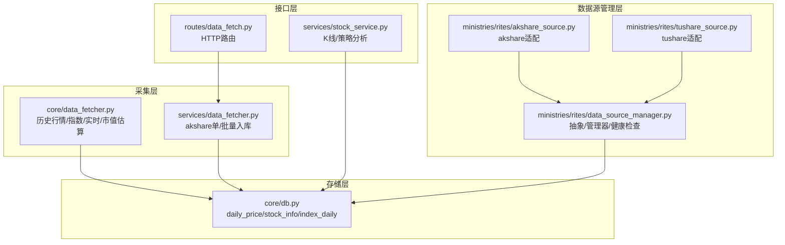
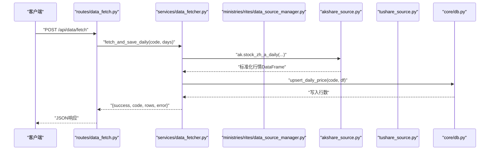
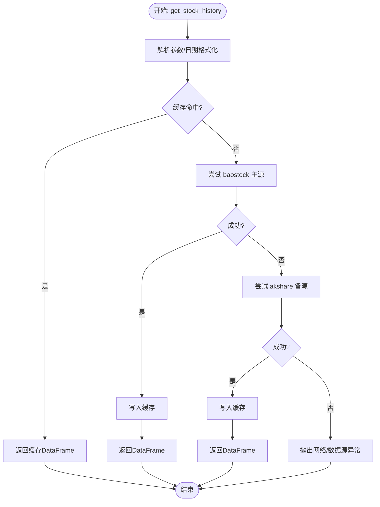
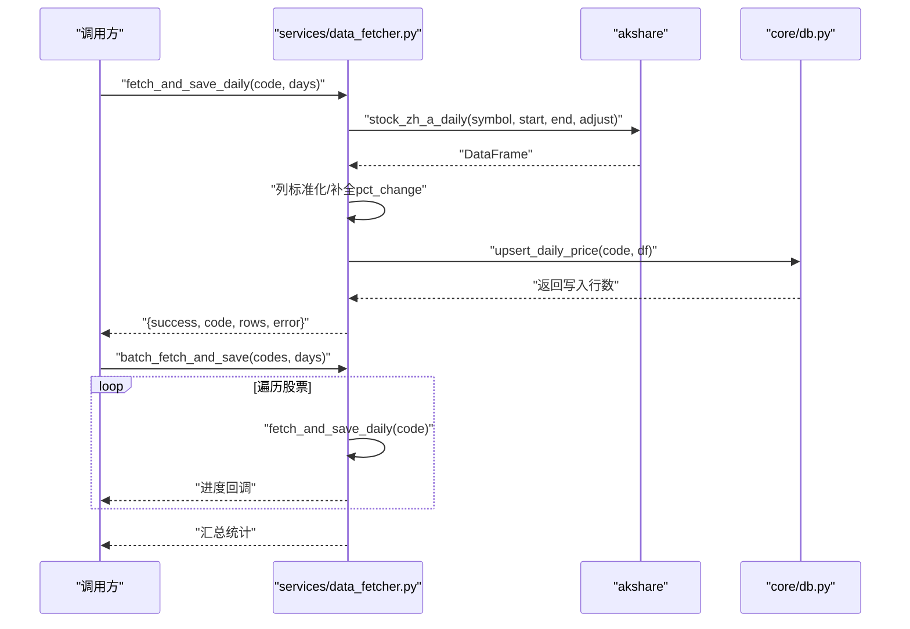
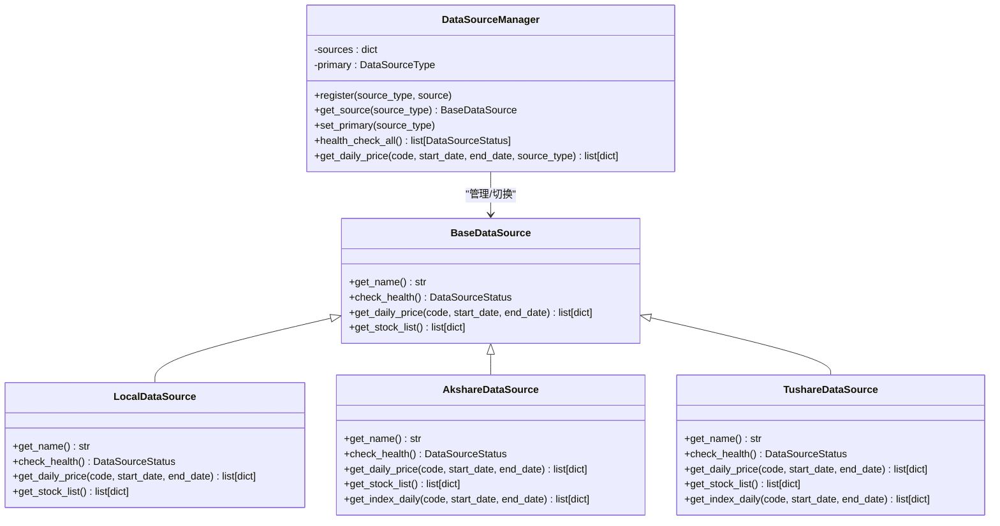
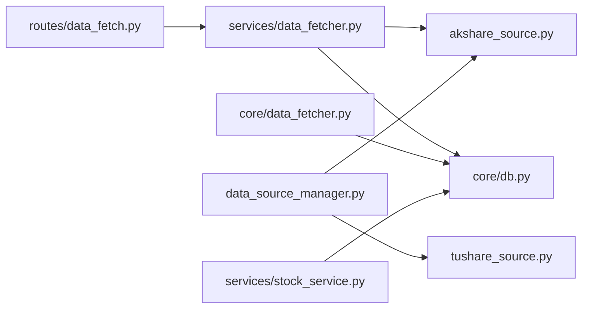

# 数据采集器

<cite>
**本文引用的文件**
- [core/data_fetcher.py](file://core/data_fetcher.py)
- [services/data_fetcher.py](file://services/data_fetcher.py)
- [ministries/rites/data_source_manager.py](file://ministries/rites/data_source_manager.py)
- [ministries/rites/akshare_source.py](file://ministries/rites/akshare_source.py)
- [ministries/rites/tushare_source.py](file://ministries/rites/tushare_source.py)
- [core/db.py](file://core/db.py)
- [routes/data_fetch.py](file://routes/data_fetch.py)
- [services/stock_service.py](file://services/stock_service.py)
</cite>

## 目录
1. [简介](#简介)
2. [项目结构](#项目结构)
3. [核心组件](#核心组件)
4. [架构总览](#架构总览)
5. [组件详解](#组件详解)
6. [依赖关系分析](#依赖关系分析)
7. [性能考量](#性能考量)
8. [故障排查指南](#故障排查指南)
9. [结论](#结论)
10. [附录](#附录)

## 简介
本文件面向AIQuant的数据采集体系，聚焦于数据采集器的设计与实现，系统阐述DataFetcher类（以及相关模块）的架构、流程控制、异常处理、性能优化与数据质量保障，并说明与外部数据源（baostock、akshare、tushare）的集成方式与协议处理策略。文档同时给出关键流程的可视化图示，帮助读者快速理解与落地。

## 项目结构
围绕数据采集的关键模块分布如下：
- 核心采集层：core/data_fetcher.py 提供A股行情、指数、股票基础信息、实时价格、市值估算等采集能力；并内置baostock主源与akshare备源的自动降级逻辑。
- 服务封装层：services/data_fetcher.py 提供基于akshare的单/批量行情拉取与入库服务。
- 数据源管理：ministries/rites/data_source_manager.py 定义统一数据源抽象与管理器，支持多源注册、健康检查与自动切换。
- 数据源适配：ministries/rites/akshare_source.py、ministries/rites/tushare_source.py 分别对akshare与tushare进行标准化适配。
- 数据存储：core/db.py 定义SQLite表结构与常用读写接口（daily_price、stock_info等），支撑本地数据持久化。
- 接口路由：routes/data_fetch.py 对外暴露HTTP接口，对接服务层。
- 业务服务：services/stock_service.py 使用采集与存储能力，提供K线、策略分析等上层功能。

图表来源
- [core/data_fetcher.py:1-578](file://core/data_fetcher.py#L1-L578)
- [services/data_fetcher.py:1-106](file://services/data_fetcher.py#L1-L106)
- [ministries/rites/data_source_manager.py:1-190](file://ministries/rites/data_source_manager.py#L1-L190)
- [ministries/rites/akshare_source.py:1-135](file://ministries/rites/akshare_source.py#L1-L135)
- [ministries/rites/tushare_source.py:1-167](file://ministries/rites/tushare_source.py#L1-L167)
- [core/db.py:1-800](file://core/db.py#L1-L800)
- [routes/data_fetch.py:1-82](file://routes/data_fetch.py#L1-L82)
- [services/stock_service.py:1-194](file://services/stock_service.py#L1-L194)

章节来源
- [core/data_fetcher.py:1-578](file://core/data_fetcher.py#L1-L578)
- [services/data_fetcher.py:1-106](file://services/data_fetcher.py#L1-L106)
- [ministries/rites/data_source_manager.py:1-190](file://ministries/rites/data_source_manager.py#L1-L190)
- [ministries/rites/akshare_source.py:1-135](file://ministries/rites/akshare_source.py#L1-L135)
- [ministries/rites/tushare_source.py:1-167](file://ministries/rites/tushare_source.py#L1-L167)
- [core/db.py:1-800](file://core/db.py#L1-L800)
- [routes/data_fetch.py:1-82](file://routes/data_fetch.py#L1-L82)
- [services/stock_service.py:1-194](file://services/stock_service.py#L1-L194)

## 核心组件
- DataFetcher（核心采集器）：提供历史行情、指数、股票信息、实时价格、热门股票、市场指数、市值估算等能力；内置baostock主源与akshare备源的自动降级策略。
- 服务采集器（服务层）：封装akshare的单/批量行情拉取与入库，提供进度回调与统计。
- 数据源管理器：定义统一抽象与健康检查，支持多源注册与自动切换。
- 数据源适配器：分别对akshare与tushare进行标准化，统一列名与时间格式。
- 数据库接口：提供upsert、查询、索引等能力，支撑本地数据持久化。

章节来源
- [core/data_fetcher.py:173-223](file://core/data_fetcher.py#L173-L223)
- [services/data_fetcher.py:17-106](file://services/data_fetcher.py#L17-L106)
- [ministries/rites/data_source_manager.py:111-178](file://ministries/rites/data_source_manager.py#L111-L178)
- [ministries/rites/akshare_source.py:45-82](file://ministries/rites/akshare_source.py#L45-L82)
- [ministries/rites/tushare_source.py:65-103](file://ministries/rites/tushare_source.py#L65-L103)
- [core/db.py:543-578](file://core/db.py#L543-L578)

## 架构总览
下图展示从接口到采集、存储的整体链路，以及多数据源的管理与切换：

图表来源
- [routes/data_fetch.py:17-28](file://routes/data_fetch.py#L17-L28)
- [services/data_fetcher.py:17-74](file://services/data_fetcher.py#L17-L74)
- [ministries/rites/akshare_source.py:45-82](file://ministries/rites/akshare_source.py#L45-L82)
- [core/db.py:543-578](file://core/db.py#L543-L578)

## 组件详解

### DataFetcher（核心采集器）
DataFetcher位于core/data_fetcher.py，承担以下职责：
- 历史行情采集：优先baostock，失败自动降级akshare；支持复权参数与缓存。
- 股票列表与搜索：baostock主，akshare备。
- 实时价格：baostock最近收盘价。
- 指数数据：baostock主，akshare备。
- 市值估算：基于baostock换手率反推流通股本，无频率限制。
- 代码格式转换：统一A股代码格式（含北交所）。

图表来源
- [core/data_fetcher.py:173-223](file://core/data_fetcher.py#L173-L223)
- [core/data_fetcher.py:194-222](file://core/data_fetcher.py#L194-L222)

章节来源
- [core/data_fetcher.py:79-134](file://core/data_fetcher.py#L79-L134)
- [core/data_fetcher.py:136-167](file://core/data_fetcher.py#L136-L167)
- [core/data_fetcher.py:173-223](file://core/data_fetcher.py#L173-L223)
- [core/data_fetcher.py:281-332](file://core/data_fetcher.py#L281-L332)
- [core/data_fetcher.py:371-424](file://core/data_fetcher.py#L371-L424)
- [core/data_fetcher.py:472-531](file://core/data_fetcher.py#L472-L531)

### 服务采集器（基于akshare）
服务层封装了akshare的单/批量采集与入库流程，提供进度回调与统计汇总：
- 单只采集：校验列、补全pct_change、写入数据库。
- 批量采集：遍历股票列表，聚合统计结果。

图表来源
- [services/data_fetcher.py:17-74](file://services/data_fetcher.py#L17-L74)
- [services/data_fetcher.py:76-106](file://services/data_fetcher.py#L76-L106)
- [core/db.py:543-578](file://core/db.py#L543-L578)

章节来源
- [services/data_fetcher.py:17-74](file://services/data_fetcher.py#L17-L74)
- [services/data_fetcher.py:76-106](file://services/data_fetcher.py#L76-L106)

### 数据源管理器与适配器
数据源管理器定义统一抽象与健康检查，支持多源注册与自动切换：
- 抽象基类：定义名称、健康检查、日线、股票列表接口。
- 本地数据源：基于本地数据库的读取。
- akshare适配器：标准化列名与日期格式。
- tushare适配器：基于token初始化，标准化列名与日期格式。

图表来源
- [ministries/rites/data_source_manager.py:48-178](file://ministries/rites/data_source_manager.py#L48-L178)
- [ministries/rites/akshare_source.py:15-135](file://ministries/rites/akshare_source.py#L15-L135)
- [ministries/rites/tushare_source.py:16-167](file://ministries/rites/tushare_source.py#L16-L167)

章节来源
- [ministries/rites/data_source_manager.py:111-178](file://ministries/rites/data_source_manager.py#L111-L178)
- [ministries/rites/akshare_source.py:45-82](file://ministries/rites/akshare_source.py#L45-L82)
- [ministries/rites/tushare_source.py:65-103](file://ministries/rites/tushare_source.py#L65-L103)

### 数据质量与一致性
- 数据验证：列存在性检查、数值类型转换、缺失值剔除。
- 去重与完整性：数据库层使用唯一索引（如daily_price(code, trade_date)），Upsert保证幂等。
- 时间序列规范：统一trade_date为字符串或datetime，排序后返回。
- 指数与股票列表：标准化列名与格式，确保后续分析一致。

章节来源
- [services/data_fetcher.py:60-70](file://services/data_fetcher.py#L60-L70)
- [core/db.py:543-578](file://core/db.py#L543-L578)
- [core/db.py:631-666](file://core/db.py#L631-L666)
- [ministries/rites/akshare_source.py:60-79](file://ministries/rites/akshare_source.py#L60-L79)
- [ministries/rites/tushare_source.py:86-99](file://ministries/rites/tushare_source.py#L86-L99)

### 异常处理机制
- 网络异常：对外抛出RuntimeError，提示“请检查网络”；内部捕获并尝试降级。
- 数据格式错误：列名不匹配或空DataFrame时返回空结果或抛错；服务层对缺失列进行补全。
- 超时与限流：baostock无显式频率限制；akshare/tushare通过重试与降级策略缓解。
- 健康检查：数据源适配器提供check_health，管理器统一收集状态。

章节来源
- [core/data_fetcher.py:210-222](file://core/data_fetcher.py#L210-L222)
- [services/data_fetcher.py:72-73](file://services/data_fetcher.py#L72-L73)
- [ministries/rites/akshare_source.py:21-43](file://ministries/rites/akshare_source.py#L21-L43)
- [ministries/rites/tushare_source.py:33-63](file://ministries/rites/tushare_source.py#L33-L63)

### 性能优化策略
- 缓存机制：按日期范围生成缓存文件，命中直接返回，避免重复请求。
- 批量处理：服务层批量写入数据库，减少事务开销。
- 并发控制：baostock登录采用线程锁保护；服务层可扩展为异步/并发队列（当前为顺序执行）。
- 无频率限制场景：市值估算使用baostock换手率反推，无需sleep。
- 存储优化：SQLite WAL模式、索引（code+date、date）提升查询效率。

章节来源
- [core/data_fetcher.py:194-202](file://core/data_fetcher.py#L194-L202)
- [services/data_fetcher.py:89-96](file://services/data_fetcher.py#L89-L96)
- [core/db.py:26-40](file://core/db.py#L26-L40)
- [core/db.py:92-93](file://core/db.py#L92-L93)
- [core/data_fetcher.py:551-567](file://core/data_fetcher.py#L551-L567)

### 与外部数据源的集成与协议处理
- baostock：登录态管理（全局单例+锁）、代码格式转换、历史K线查询、指数查询、实时价格回溯。
- akshare：多接口降级（东方财富→新浪），列名标准化，指数接口适配。
- tushare：Token初始化，列名标准化，指数映射与格式化。

章节来源
- [core/data_fetcher.py:31-44](file://core/data_fetcher.py#L31-L44)
- [core/data_fetcher.py:50-72](file://core/data_fetcher.py#L50-L72)
- [core/data_fetcher.py:136-167](file://core/data_fetcher.py#L136-L167)
- [ministries/rites/akshare_source.py:45-82](file://ministries/rites/akshare_source.py#L45-L82)
- [ministries/rites/tushare_source.py:19-29](file://ministries/rites/tushare_source.py#L19-L29)
- [ministries/rites/tushare_source.py:134-141](file://ministries/rites/tushare_source.py#L134-L141)

## 依赖关系分析
- 路由层依赖服务层；服务层依赖akshare与数据库；核心采集器可独立工作，亦可被服务层复用。
- 数据源管理器解耦具体实现，便于扩展新数据源。
- 数据库层提供统一的Upsert与查询接口，降低上层复杂度。

图表来源
- [routes/data_fetch.py:12-12](file://routes/data_fetch.py#L12-L12)
- [services/data_fetcher.py:28-28](file://services/data_fetcher.py#L28-L28)
- [ministries/rites/data_source_manager.py:114-130](file://ministries/rites/data_source_manager.py#L114-L130)
- [core/db.py:543-578](file://core/db.py#L543-L578)

章节来源
- [routes/data_fetch.py:12-12](file://routes/data_fetch.py#L12-L12)
- [services/data_fetcher.py:28-28](file://services/data_fetcher.py#L28-L28)
- [ministries/rites/data_source_manager.py:114-130](file://ministries/rites/data_source_manager.py#L114-L130)
- [core/db.py:543-578](file://core/db.py#L543-L578)

## 性能考量
- 缓存优先：优先读取本地缓存文件，显著降低外部请求次数。
- 批量入库：服务层批量写入数据库，减少事务提交次数。
- 无锁优化：baostock登录使用锁保护，但查询本身无频率限制，适合全量扫描。
- 索引与查询：合理使用索引，避免全表扫描；按需裁剪列与日期范围。
- 异步扩展：未来可在服务层引入异步/并发队列，进一步提升吞吐。

## 故障排查指南
- 网络问题：查看异常信息中的“请检查网络”，确认代理/防火墙与DNS。
- akshare限速：出现空数据或异常时，观察降级逻辑是否生效；必要时增加重试间隔。
- tushare配置：确认环境变量TUSHARE_TOKEN已设置，否则健康检查会失败。
- 数据库异常：检查表结构与索引是否存在；关注Upsert冲突处理。
- 实时价格异常：回溯最近交易日，确认baostock数据可用。

章节来源
- [core/data_fetcher.py:210-222](file://core/data_fetcher.py#L210-L222)
- [services/data_fetcher.py:72-73](file://services/data_fetcher.py#L72-L73)
- [ministries/rites/tushare_source.py:25-28](file://ministries/rites/tushare_source.py#L25-L28)
- [core/db.py:543-578](file://core/db.py#L543-L578)

## 结论
本数据采集体系以core/data_fetcher为核心，结合服务层与数据源管理器，实现了多数据源的统一接入与自动降级、完善的异常处理与数据质量保障、以及针对不同场景的性能优化策略。通过本地缓存、批量入库与索引优化，整体具备良好的可扩展性与稳定性，能够满足A股行情数据的采集与分析需求。

## 附录
- 关键接口与职责
  - get_stock_history：主备源自动降级的历史行情获取。
  - fetch_and_save_daily/batch_fetch_and_save：akshare单/批量入库服务。
  - DataSourceManager：多数据源注册、健康检查与自动切换。
  - upsert_daily_price/get_daily_price：数据库写入与查询。
- 建议
  - 在生产环境启用缓存目录清理策略，避免磁盘膨胀。
  - 对高频调用场景引入异步/并发队列与熔断机制。
  - 定期运行健康检查，监控各数据源可用性与延迟。