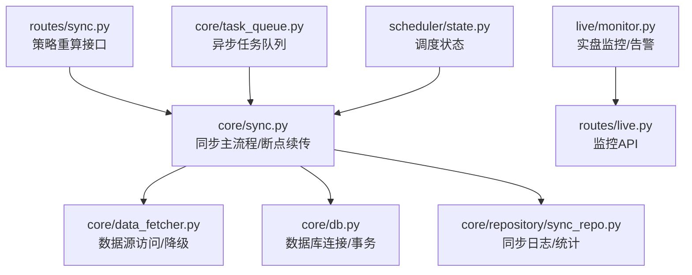
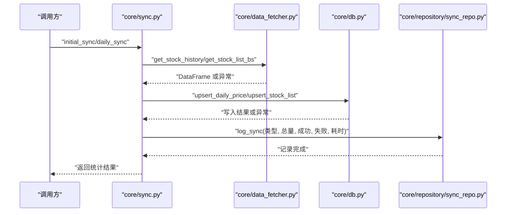
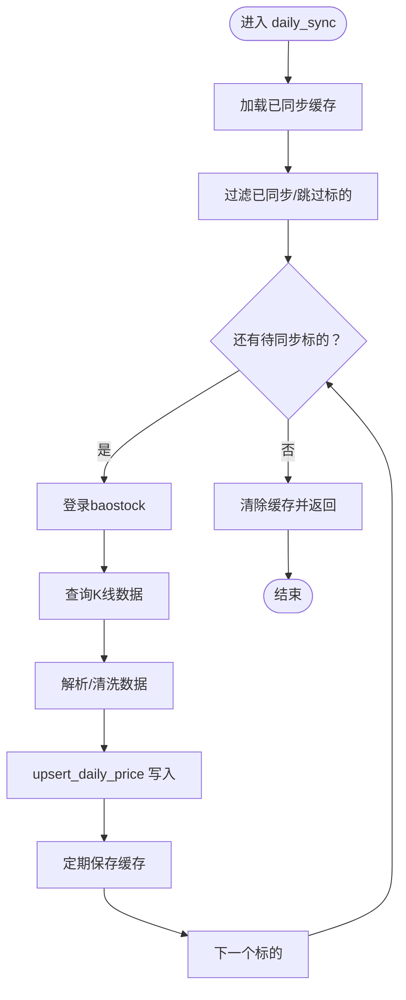
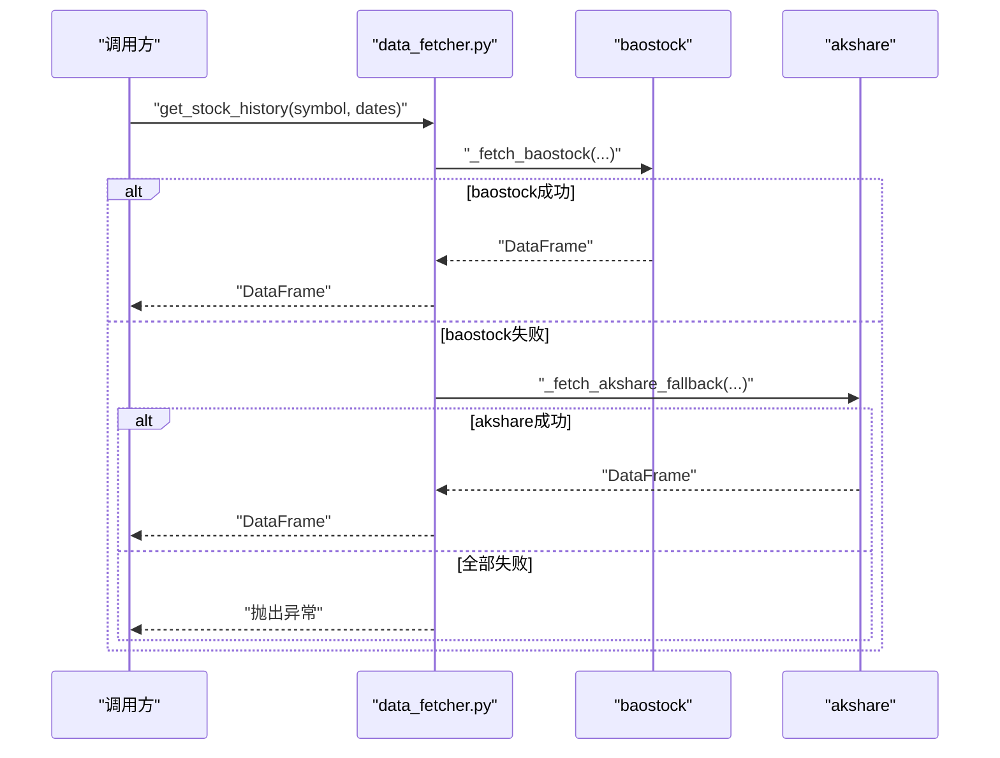
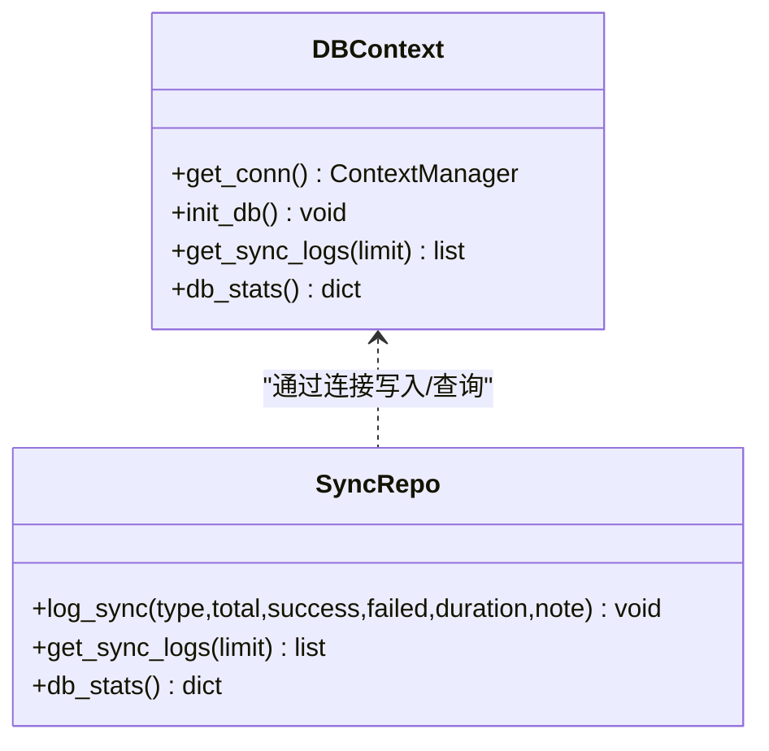
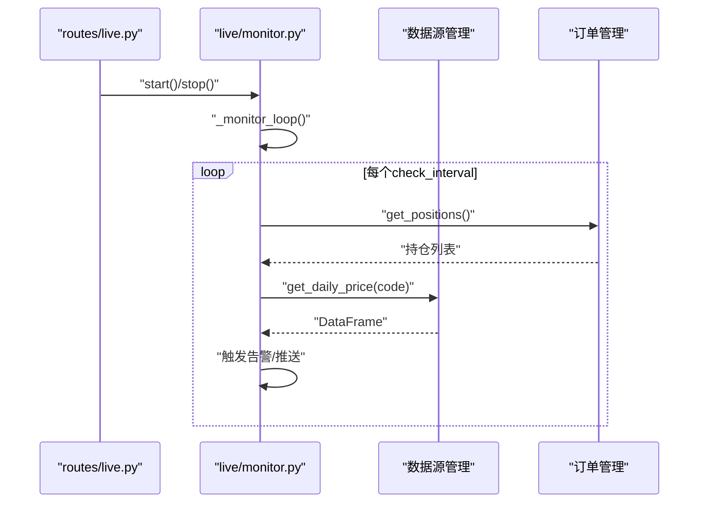
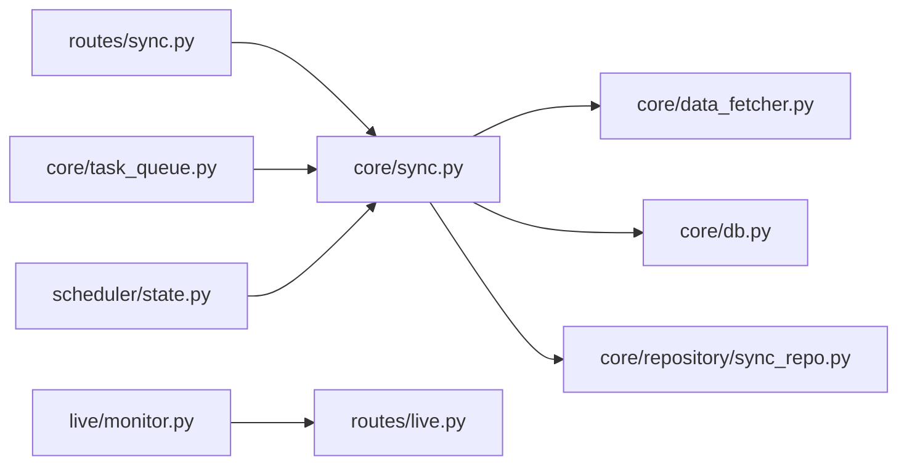
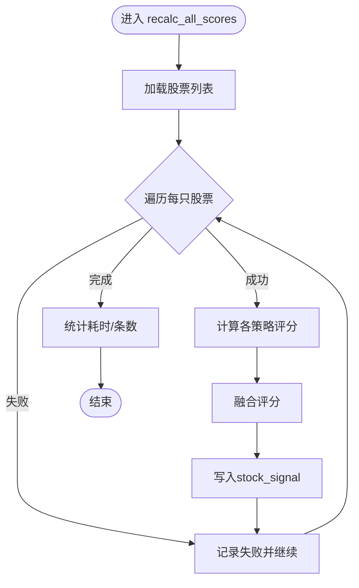

# 错误处理与恢复

<cite>
**本文引用的文件**
- [core/sync.py](file://core/sync.py)
- [core/data_fetcher.py](file://core/data_fetcher.py)
- [core/db.py](file://core/db.py)
- [core/repository/sync_repo.py](file://core/repository/sync_repo.py)
- [routes/sync.py](file://routes/sync.py)
- [live/monitor.py](file://live/monitor.py)
- [routes/live.py](file://routes/live.py)
- [core/task_queue.py](file://core/task_queue.py)
- [scheduler/state.py](file://scheduler/state.py)
</cite>

## 目录
1. [简介](#简介)
2. [项目结构](#项目结构)
3. [核心组件](#核心组件)
4. [架构总览](#架构总览)
5. [详细组件分析](#详细组件分析)
6. [依赖分析](#依赖分析)
7. [性能考虑](#性能考虑)
8. [故障排查指南](#故障排查指南)
9. [结论](#结论)
10. [附录](#附录)

## 简介
本文件聚焦于AIQuant项目的数据同步错误处理与恢复机制，围绕以下目标展开：
- 错误分类与处理策略：网络错误、数据源错误、格式错误、业务逻辑错误
- 重试机制：指数退避、最大重试次数、超时控制
- 断点续传：同步状态记录、进度保存与恢复
- 故障恢复：数据修复、状态清理、系统自愈
- 日志与监控：错误分类、日志格式、告警机制
- 数据保护：事务回滚、数据备份、一致性维护
- 最佳实践与常见问题

## 项目结构
与数据同步错误处理与恢复直接相关的模块分布如下：
- 同步主流程与断点续传：core/sync.py
- 数据源访问与降级：core/data_fetcher.py
- 数据库连接与事务：core/db.py
- 同步日志与统计：core/repository/sync_repo.py
- 同步接口与策略重算：routes/sync.py
- 实盘监控与告警：live/monitor.py、routes/live.py
- 异步任务队列：core/task_queue.py
- 调度状态：scheduler/state.py

**图表来源**
- [core/sync.py](file://core/sync.py)
- [core/data_fetcher.py](file://core/data_fetcher.py)
- [core/db.py](file://core/db.py)
- [core/repository/sync_repo.py](file://core/repository/sync_repo.py)
- [routes/sync.py](file://routes/sync.py)
- [live/monitor.py](file://live/monitor.py)
- [routes/live.py](file://routes/live.py)
- [core/task_queue.py](file://core/task_queue.py)
- [scheduler/state.py](file://scheduler/state.py)

**章节来源**
- [core/sync.py](file://core/sync.py)
- [core/data_fetcher.py](file://core/data_fetcher.py)
- [core/db.py](file://core/db.py)
- [core/repository/sync_repo.py](file://core/repository/sync_repo.py)
- [routes/sync.py](file://routes/sync.py)
- [live/monitor.py](file://live/monitor.py)
- [routes/live.py](file://routes/live.py)
- [core/task_queue.py](file://core/task_queue.py)
- [scheduler/state.py](file://scheduler/state.py)

## 核心组件
- 同步主流程与断点续传：负责初始化历史同步与每日增量同步，包含进度缓存、跳过逻辑、覆盖率阈值与指数同步。
- 数据源访问与降级：封装baostock为主、akshare为备的多源拉取与自动降级。
- 数据库连接与事务：提供上下文管理器，自动提交/回滚，保障一致性。
- 同步日志与统计：记录每次同步的类型、总量、成功/失败、耗时与备注，并提供数据库统计。
- 实盘监控与告警：对持仓进行周期扫描，触发止损、止盈、价格异动等告警。
- 异步任务队列：提供任务提交、状态跟踪、回调通知，适配批量评分与同步等后台任务。
- 调度状态：记录同步/扫描运行状态，便于外部观察。

**章节来源**
- [core/sync.py](file://core/sync.py)
- [core/data_fetcher.py](file://core/data_fetcher.py)
- [core/db.py](file://core/db.py)
- [core/repository/sync_repo.py](file://core/repository/sync_repo.py)
- [live/monitor.py](file://live/monitor.py)
- [routes/live.py](file://routes/live.py)
- [core/task_queue.py](file://core/task_queue.py)
- [scheduler/state.py](file://scheduler/state.py)

## 架构总览
下图展示数据同步从入口到落库的关键路径，以及错误处理与恢复的触点：

**图表来源**
- [core/sync.py](file://core/sync.py)
- [core/data_fetcher.py](file://core/data_fetcher.py)
- [core/db.py](file://core/db.py)
- [core/repository/sync_repo.py](file://core/repository/sync_repo.py)

## 详细组件分析

### 同步主流程与断点续传（core/sync.py）
- 初始化历史同步（initial_sync）
  - 自动拉取股票列表，过滤ST/退市/北交所等不支持标的
  - 逐只同步历史行情，支持断点续传（.sync_cache目录保存已同步集合）
  - 按批次间隔与基础延迟控制请求速率
  - 记录同步日志
- 每日增量同步（daily_sync）
  - 基于“最近交易日”与“覆盖率阈值”确定同步区间
  - 单线程访问baostock，避免线程安全问题
  - 实时保存同步缓存（每10只写入一次），异常退出保留缓存以支持断点续传
  - 同步完成后清除缓存；若未完成则保留缓存
  - 同步主要指数至end_date
- 策略评分（sync_strategy_score）
  - 对历史全量计算策略评分并批量写入

**图表来源**
- [core/sync.py](file://core/sync.py)

**章节来源**
- [core/sync.py](file://core/sync.py)

### 数据源访问与降级（core/data_fetcher.py）
- 主数据源：baostock
  - 登录管理（全局单例+锁），确保线程安全
  - 代码格式转换（支持纯数字/带前缀）
  - 查询失败抛出异常，便于上层捕获
- 备用数据源：akshare
  - 多接口降级（东方财富→新浪），失败自动切换
  - 标准化列名与索引，缺失数据返回空DataFrame
- 缓存与容错
  - 历史行情CSV缓存（data_cache目录）
  - 所有数据源均失败时抛出明确错误提示

**图表来源**
- [core/data_fetcher.py](file://core/data_fetcher.py)

**章节来源**
- [core/data_fetcher.py](file://core/data_fetcher.py)

### 数据库连接与事务（core/db.py）
- 连接管理
  - 上下文管理器，自动commit/rollback
  - WAL模式与synchronous设置提升并发与可靠性
- 同步日志与统计
  - 提供get_sync_logs查询最近同步记录
  - 提供db_stats统计数据库关键指标

**图表来源**
- [core/db.py](file://core/db.py)
- [core/repository/sync_repo.py](file://core/repository/sync_repo.py)

**章节来源**
- [core/db.py](file://core/db.py)
- [core/repository/sync_repo.py](file://core/repository/sync_repo.py)

### 同步接口与策略重算（routes/sync.py）
- 接口/recalc_all_scores
  - 全量补算历史评分，并将满足阈值的日期写入stock_signal
  - 对异常进行捕获并记录，不影响整体流程

**章节来源**
- [routes/sync.py](file://routes/sync.py)

### 实盘监控与告警（live/monitor.py、routes/live.py）
- 实盘监控
  - 周期扫描持仓，检查止损、止盈、价格异动
  - 告警等级与去重控制，支持Webhook推送
- 监控API
  - 提供启动/停止、状态查询、告警列表、解决告警、清空告警、配置更新等接口

**图表来源**
- [live/monitor.py](file://live/monitor.py)
- [routes/live.py](file://routes/live.py)

**章节来源**
- [live/monitor.py](file://live/monitor.py)
- [routes/live.py](file://routes/live.py)

### 异步任务队列（core/task_queue.py）
- 任务生命周期：提交→运行→成功/失败→回调通知
- 状态跟踪：pending/running/success/failed/cancelled
- 线程池执行器，适合批量评分、同步等后台任务

**章节来源**
- [core/task_queue.py](file://core/task_queue.py)

### 调度状态（scheduler/state.py）
- 记录同步/扫描运行状态与最后结果，便于外部观察与治理

**章节来源**
- [scheduler/state.py](file://scheduler/state.py)

## 依赖分析
- 同步模块对数据源与数据库的依赖清晰，错误在上层被捕获并记录
- 监控模块与数据源/订单管理解耦，通过接口抽象实现
- 任务队列与调度状态为上层提供可观测与可控能力

**图表来源**
- [core/sync.py](file://core/sync.py)
- [core/data_fetcher.py](file://core/data_fetcher.py)
- [core/db.py](file://core/db.py)
- [core/repository/sync_repo.py](file://core/repository/sync_repo.py)
- [routes/sync.py](file://routes/sync.py)
- [live/monitor.py](file://live/monitor.py)
- [routes/live.py](file://routes/live.py)
- [core/task_queue.py](file://core/task_queue.py)
- [scheduler/state.py](file://scheduler/state.py)

**章节来源**
- [core/sync.py](file://core/sync.py)
- [core/data_fetcher.py](file://core/data_fetcher.py)
- [core/db.py](file://core/db.py)
- [core/repository/sync_repo.py](file://core/repository/sync_repo.py)
- [routes/sync.py](file://routes/sync.py)
- [live/monitor.py](file://live/monitor.py)
- [routes/live.py](file://routes/live.py)
- [core/task_queue.py](file://core/task_queue.py)
- [scheduler/state.py](file://scheduler/state.py)

## 性能考虑
- 请求节流：初始化阶段使用批次间隔与基础延迟，避免触发上游限流
- 降级策略：主数据源失败自动切换备用数据源，减少整体失败率
- 缓存利用：历史行情CSV缓存减少重复下载
- 数据库优化：WAL模式、索引、唯一约束保障写入效率与一致性
- 监控频率：实盘监控间隔可配置，兼顾及时性与系统负载

[本节为通用建议，不直接分析具体文件]

## 故障排查指南

### 错误分类与处理策略
- 网络错误
  - 现象：数据源接口不可达、超时
  - 处理：自动降级到备用数据源；必要时重试（见“重试机制”）
- 数据源错误
  - 现象：返回空数据、字段缺失、格式不一致
  - 处理：在解析阶段进行严格校验与清洗；失败则记录并跳过
- 格式错误
  - 现象：数值转换异常、索引缺失
  - 处理：在数据清洗阶段捕获并丢弃异常行；记录失败原因
- 业务逻辑错误
  - 现象：覆盖率不足、北交所不支持、ST/退市过滤
  - 处理：在同步前进行过滤；对不支持标的跳过并记录

### 重试机制
- 指数退避：当前实现未显式实现指数退避，建议在调用层引入
- 最大重试次数：当前未设置上限，建议在调用层增加上限控制
- 超时控制：数据源访问层使用requests超时参数，建议在调用层统一配置
- 建议
  - 在routes层或调用层封装重试装饰器，结合指数退避与上限控制
  - 对不同类型的错误区分对待（网络/数据源/格式/业务）

### 断点续传
- 状态记录：使用.sync_cache目录保存已同步股票集合
- 进度保存：每10只写入一次缓存，异常退出保留缓存
- 恢复机制：重启后加载缓存，跳过已同步标的，继续未完成部分
- 清理策略：全部完成后清除缓存；部分完成后保留缓存

**章节来源**
- [core/sync.py](file://core/sync.py)

### 故障恢复策略
- 数据修复：对失败的标的单独重试或人工介入；策略重算接口可全量补算
- 状态清理：监控告警清空、任务队列清理已完成任务
- 系统自愈：监控模块自动推送告警；任务队列回调通知

**章节来源**
- [routes/sync.py](file://routes/sync.py)
- [live/monitor.py](file://live/monitor.py)
- [routes/live.py](file://routes/live.py)
- [core/task_queue.py](file://core/task_queue.py)

### 错误日志记录与监控
- 同步日志：记录同步类型、总量、成功/失败、耗时、备注
- 数据库统计：提供股票数、行情条数、最早/最新日期、数据库大小
- 实盘告警：按等级与类别记录，支持Webhook推送
- 建议
  - 统一日志格式与级别
  - 对关键错误建立告警阈值与去重策略

**章节来源**
- [core/repository/sync_repo.py](file://core/repository/sync_repo.py)
- [core/db.py](file://core/db.py)
- [live/monitor.py](file://live/monitor.py)
- [routes/live.py](file://routes/live.py)

### 数据保护
- 事务回滚：数据库连接管理器自动回滚异常，保障一致性
- 数据备份：历史行情CSV缓存作为轻量备份
- 一致性维护：唯一约束（code, trade_date）、索引优化查询

**章节来源**
- [core/db.py](file://core/db.py)

### 最佳实践与常见问题
- 最佳实践
  - 显式设置重试上限与指数退避
  - 对不同错误类型采用差异化策略
  - 使用断点续传与缓存，提升稳定性
  - 统一日志与监控，建立告警闭环
- 常见问题
  - 北交所股票不支持：已在过滤逻辑中跳过
  - 覆盖率不足：根据min_coverage阈值决定是否全量补齐
  - 实时监控告警过多：调整阈值与去重策略

**章节来源**
- [core/sync.py](file://core/sync.py)
- [core/data_fetcher.py](file://core/data_fetcher.py)
- [live/monitor.py](file://live/monitor.py)

## 结论
AIQuant在数据同步方面具备完善的断点续传与降级策略，配合数据库事务与日志统计形成较为完整的错误处理与恢复体系。为进一步增强鲁棒性，建议在调用层引入指数退避重试、统一超时与上限控制、完善错误分类与告警策略，并持续优化监控与自愈能力。

[本节为总结性内容，不直接分析具体文件]

## 附录

### 关键流程图：策略评分补算

**图表来源**
- [routes/sync.py](file://routes/sync.py)