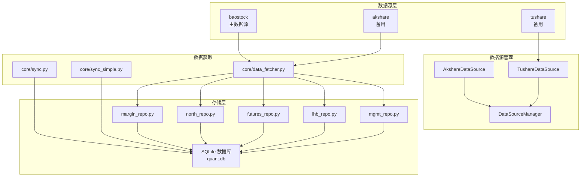
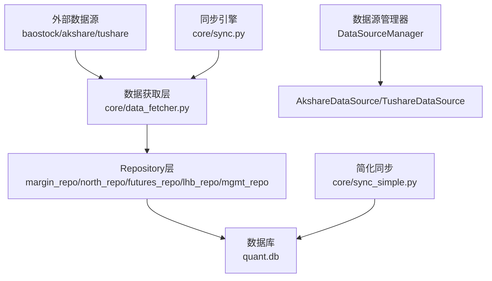
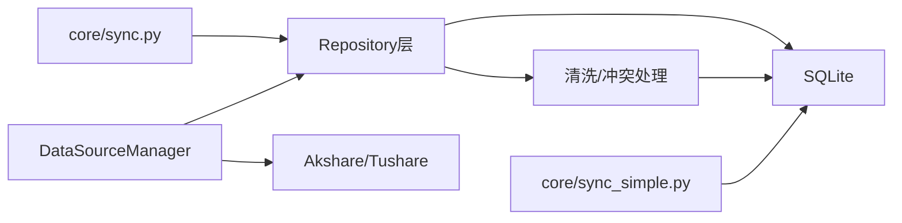

# 市场数据表

<cite>
**本文引用的文件**
- [core/db.py](file://core/db.py)
- [core/repository/margin_repo.py](file://core/repository/margin_repo.py)
- [core/repository/north_repo.py](file://core/repository/north_repo.py)
- [core/repository/futures_repo.py](file://core/repository/futures_repo.py)
- [core/repository/lhb_repo.py](file://core/repository/lhb_repo.py)
- [core/repository/mgmt_repo.py](file://core/repository/mgmt_repo.py)
- [core/data_fetcher.py](file://core/data_fetcher.py)
- [ministries/rites/data_source_manager.py](file://ministries/rites/data_source_manager.py)
- [ministries/rites/akshare_source.py](file://ministries/rites/akshare_source.py)
- [ministries/rites/tushare_source.py](file://ministries/rites/tushare_source.py)
- [core/sync.py](file://core/sync.py)
- [core/sync_simple.py](file://core/sync_simple.py)
</cite>

## 目录
1. [简介](#简介)
2. [项目结构](#项目结构)
3. [核心组件](#核心组件)
4. [架构总览](#架构总览)
5. [详细组件分析](#详细组件分析)
6. [依赖分析](#依赖分析)
7. [性能考虑](#性能考虑)
8. [故障排查指南](#故障排查指南)
9. [结论](#结论)
10. [附录](#附录)

## 简介
本文件面向AIQuant项目的“专业市场数据表”，系统梳理以下表的结构设计、数据来源、更新频率与业务用途，并给出金融衍生品、监管数据与资金流向数据的处理方式，以及数据质量保证与异常处理机制。涉及表包括：
- index_daily 指数每日行情表
- stock_margin 融资融券汇总表
- stock_margin_detail 融资融券明细表
- stock_hsgt_north 沪深港通北向资金表
- index_futures 指数期货表
- stock_lhb_detail 龙虎榜明细表
- stock_mgmt_holding 高管增减持表

## 项目结构
围绕“专业市场数据表”的核心模块与文件如下：
- 数据库与表定义：core/db.py
- 专业数据表的Repository层：core/repository/*.py
- 数据源适配与统一管理：ministries/rites/*.py
- 历史与增量同步：core/sync.py、core/sync_simple.py
- 历史行情与指数数据获取：core/data_fetcher.py

图表来源
- [core/data_fetcher.py:12-578](file://core/data_fetcher.py#L12-L578)
- [ministries/rites/data_source_manager.py:111-190](file://ministries/rites/data_source_manager.py#L111-L190)
- [ministries/rites/akshare_source.py:15-135](file://ministries/rites/akshare_source.py#L15-L135)
- [ministries/rites/tushare_source.py:16-167](file://ministries/rites/tushare_source.py#L16-L167)
- [core/sync.py:1-760](file://core/sync.py#L1-L760)
- [core/sync_simple.py:1-173](file://core/sync_simple.py#L1-L173)
- [core/db.py:57-427](file://core/db.py#L57-L427)

章节来源
- [core/db.py:57-427](file://core/db.py#L57-L427)
- [core/repository/margin_repo.py:1-186](file://core/repository/margin_repo.py#L1-L186)
- [core/repository/north_repo.py:1-117](file://core/repository/north_repo.py#L1-L117)
- [core/repository/futures_repo.py:1-109](file://core/repository/futures_repo.py#L1-L109)
- [core/repository/lhb_repo.py:1-99](file://core/repository/lhb_repo.py#L1-L99)
- [core/repository/mgmt_repo.py:1-103](file://core/repository/mgmt_repo.py#L1-L103)
- [core/data_fetcher.py:12-578](file://core/data_fetcher.py#L12-L578)
- [ministries/rites/data_source_manager.py:11-190](file://ministries/rites/data_source_manager.py#L11-L190)
- [ministries/rites/akshare_source.py:1-135](file://ministries/rites/akshare_source.py#L1-L135)
- [ministries/rites/tushare_source.py:1-167](file://ministries/rites/tushare_source.py#L1-L167)
- [core/sync.py:1-760](file://core/sync.py#L1-L760)
- [core/sync_simple.py:1-173](file://core/sync_simple.py#L1-L173)

## 核心组件
- 数据库与表定义：统一在数据库初始化时创建，包含专业数据表的结构、索引与迁移逻辑。
- Repository层：针对每张专业表提供标准化的upsert与查询方法，统一清洗与冲突处理。
- 数据源管理：抽象数据源接口，支持本地数据库、akshare、tushare等，具备健康检查与自动切换能力。
- 同步与缓存：提供历史初始化、增量同步、本地缓存导入与降频拉取等策略，保障数据完整性与时效性。

章节来源
- [core/db.py:57-427](file://core/db.py#L57-L427)
- [core/repository/margin_repo.py:29-186](file://core/repository/margin_repo.py#L29-L186)
- [core/repository/north_repo.py:27-117](file://core/repository/north_repo.py#L27-L117)
- [core/repository/futures_repo.py:27-109](file://core/repository/futures_repo.py#L27-L109)
- [core/repository/lhb_repo.py:27-99](file://core/repository/lhb_repo.py#L27-L99)
- [core/repository/mgmt_repo.py:27-103](file://core/repository/mgmt_repo.py#L27-L103)
- [ministries/rites/data_source_manager.py:111-190](file://ministries/rites/data_source_manager.py#L111-L190)

## 架构总览
下图展示“专业市场数据表”在系统中的位置与交互关系。

图表来源
- [core/data_fetcher.py:12-578](file://core/data_fetcher.py#L12-L578)
- [ministries/rites/data_source_manager.py:111-190](file://ministries/rites/data_source_manager.py#L111-L190)
- [core/repository/margin_repo.py:27-186](file://core/repository/margin_repo.py#L27-L186)
- [core/repository/north_repo.py:27-117](file://core/repository/north_repo.py#L27-L117)
- [core/repository/futures_repo.py:27-109](file://core/repository/futures_repo.py#L27-L109)
- [core/repository/lhb_repo.py:27-99](file://core/repository/lhb_repo.py#L27-L99)
- [core/repository/mgmt_repo.py:27-103](file://core/repository/mgmt_repo.py#L27-L103)
- [core/sync.py:1-760](file://core/sync.py#L1-L760)
- [core/sync_simple.py:1-173](file://core/sync_simple.py#L1-L173)
- [core/db.py:57-427](file://core/db.py#L57-L427)

## 详细组件分析

### index_daily 指数每日行情表
- 结构要点
  - 主键：(code, trade_date)，唯一约束
  - 字段：code、trade_date、open、high、low、close、volume、amount、pct_change
  - 索引：code+trade_date、trade_date
- 数据来源
  - 历史与增量：通过数据获取层统一拉取，写入 index_daily 表
  - 数据源：baostock（主）、akshare（备）
- 更新频率
  - 历史：一次性初始化
  - 增量：每日同步主要指数（如上证指数、深证成指、沪深300、中证500、中证1000）
- 业务用途
  - 大盘择时、跨市场比较、宏观趋势分析
- 数据质量与异常
  - 通过统一列名映射与数值类型转换，避免脏数据
  - 指数同步失败时记录错误并继续其他指数

章节来源
- [core/db.py:96-110](file://core/db.py#L96-L110)
- [core/sync.py:91-130](file://core/sync.py#L91-L130)
- [core/data_fetcher.py:371-424](file://core/data_fetcher.py#L371-L424)

### stock_margin 融资融券汇总表
- 结构要点
  - 主键：trade_date，唯一约束
  - 字段：trade_date、sse_*（上交所）、szse_*（深交所）、total_*（全市场合计）
- 数据来源
  - 通过Repository层upsert，支持多源数据清洗与合并
- 更新频率
  - 日频，按交易日更新
- 业务用途
  - 监测市场杠杆水平、流动性状况、情绪指标
- 数据质量与异常
  - 清洗空值与异常字符，统一数值类型
  - 冲突按日期更新，避免重复写入

章节来源
- [core/db.py:226-244](file://core/db.py#L226-L244)
- [core/repository/margin_repo.py:29-80](file://core/repository/margin_repo.py#L29-L80)

### stock_margin_detail 融资融券明细表
- 结构要点
  - 主键：(code, trade_date)，唯一约束
  - 字段：code、trade_date、name、exchange、margin_balance、margin_buy、margin_repay、short_volume、short_sell、short_repay、short_balance、total_balance
- 数据来源
  - 个股维度明细，按日期与代码写入
- 更新频率
  - 日频
- 业务用途
  - 个股杠杆行为追踪、资金流向分析、异常交易监控
- 数据质量与异常
  - 清洗空值与异常字符，统一数值类型
  - 冲突按 (code, trade_date) 更新

章节来源
- [core/db.py:247-263](file://core/db.py#L247-L263)
- [core/repository/margin_repo.py:114-162](file://core/repository/margin_repo.py#L114-L162)

### stock_hsgt_north 沪深港通北向资金表
- 结构要点
  - 主键：trade_date，唯一约束
  - 字段：trade_date、north_*（北向）、hgt_*（沪股通）、sgt_*（深股通）
- 数据来源
  - Repository层upsert，支持多源数据清洗与合并
- 更新频率
  - 日频
- 业务用途
  - 资金流向监测、外资情绪分析、跨市场联动研究
- 数据质量与异常
  - 清洗空值与异常字符，统一数值类型
  - 冲突按日期更新

章节来源
- [core/db.py:266-288](file://core/db.py#L266-L288)
- [core/repository/north_repo.py:27-87](file://core/repository/north_repo.py#L27-L87)

### index_futures 指数期货表
- 结构要点
  - 主键：(trade_date, symbol)，唯一约束
  - 字段：trade_date、symbol、variety、open、high、low、close、volume、open_interest、turnover、settle、pre_settle
- 数据来源
  - Repository层upsert，支持多源数据清洗与合并
- 更新频率
  - 日频
- 业务用途
  - 期现套利、跨期套利、波动率研究、对冲工具选择
- 数据质量与异常
  - 清洗空值与异常字符，统一数值类型
  - 冲突按 (trade_date, symbol) 更新

章节来源
- [core/db.py:291-308](file://core/db.py#L291-L308)
- [core/repository/futures_repo.py:27-71](file://core/repository/futures_repo.py#L27-L71)

### stock_lhb_detail 龙虎榜明细表
- 结构要点
  - 主键：(trade_date, code)，唯一约束
  - 字段：trade_date、code、name、close_price、pct_change、net_buy、buy_amt、sell_amt、total_amt、mkt_total_amt、net_buy_ratio、turnover_rate、float_mkt_cap、reason、perf_1d/perf_2d/perf_5d/perf_10d
- 数据来源
  - Repository层upsert，支持多源数据清洗与合并
- 更新频率
  - 日频
- 业务用途
  - 主力资金行为识别、热点轮动分析、短期趋势预测
- 数据质量与异常
  - 清洗空值与异常字符，统一数值类型
  - 冲突按 (trade_date, code) 更新

章节来源
- [core/db.py:311-332](file://core/db.py#L311-L332)
- [core/repository/lhb_repo.py:27-69](file://core/repository/lhb_repo.py#L27-L69)

### stock_mgmt_holding 高管增减持表
- 结构要点
  - 主键：(trade_date, code, holder_name)，唯一约束
  - 字段：trade_date、code、name、ann_date、holder_name、hold_vol、hold_ratio、share_type、executive_name、position、relation
- 数据来源
  - Repository层upsert，支持多源数据清洗与合并
- 更新频率
  - 日频
- 业务用途
  - 内幕信息线索、管理层信心信号、治理风险评估
- 数据质量与异常
  - 清洗空值与异常字符，统一数值类型
  - 冲突按 (trade_date, code, holder_name) 更新

章节来源
- [core/db.py:337-356](file://core/db.py#L337-L356)
- [core/repository/mgmt_repo.py:27-70](file://core/repository/mgmt_repo.py#L27-L70)

## 依赖分析
- Repository层对数据库的依赖
  - 所有专业表均通过统一连接管理与事务控制进行写入与查询
  - 冲突处理采用“按主键/唯一键更新”的策略，避免重复与数据错乱
- 数据源管理器
  - 抽象BaseDataSource接口，支持本地数据库、akshare、tushare等
  - 提供健康检查与自动切换，增强系统鲁棒性
- 同步策略
  - 历史初始化：baostock主数据源，支持断点续传
  - 增量同步：每日按交易日推进，指数同步独立于个股覆盖率
  - 简化同步：优先本地缓存，再以低频拉取新数据

图表来源
- [core/repository/margin_repo.py:27-186](file://core/repository/margin_repo.py#L27-L186)
- [core/repository/north_repo.py:27-117](file://core/repository/north_repo.py#L27-L117)
- [core/repository/futures_repo.py:27-109](file://core/repository/futures_repo.py#L27-L109)
- [core/repository/lhb_repo.py:27-99](file://core/repository/lhb_repo.py#L27-L99)
- [core/repository/mgmt_repo.py:27-103](file://core/repository/mgmt_repo.py#L27-L103)
- [core/sync.py:462-668](file://core/sync.py#L462-L668)
- [core/sync_simple.py:24-90](file://core/sync_simple.py#L24-L90)
- [ministries/rites/data_source_manager.py:111-190](file://ministries/rites/data_source_manager.py#L111-L190)

章节来源
- [core/repository/margin_repo.py:27-186](file://core/repository/margin_repo.py#L27-L186)
- [core/repository/north_repo.py:27-117](file://core/repository/north_repo.py#L27-L117)
- [core/repository/futures_repo.py:27-109](file://core/repository/futures_repo.py#L27-L109)
- [core/repository/lhb_repo.py:27-99](file://core/repository/lhb_repo.py#L27-L99)
- [core/repository/mgmt_repo.py:27-103](file://core/repository/mgmt_repo.py#L27-L103)
- [core/sync.py:462-668](file://core/sync.py#L462-L668)
- [core/sync_simple.py:24-90](file://core/sync_simple.py#L24-L90)
- [ministries/rites/data_source_manager.py:111-190](file://ministries/rites/data_source_manager.py#L111-L190)

## 性能考虑
- 数据库层面
  - WAL模式与常规同步配置提升并发写入性能
  - 为高频查询字段建立索引（如code+trade_date、trade_date）
- 写入策略
  - 使用“冲突即更新”的批量插入，减少重复写入成本
  - 数值类型统一与空值清洗，降低后续计算开销
- 同步策略
  - 历史初始化baostock主数据源，无频率限制，速度快
  - 增量同步按交易日推进，指数同步独立于个股覆盖率
  - 简化同步优先本地缓存，再以低频拉取，降低对外部接口压力

章节来源
- [core/db.py:26-40](file://core/db.py#L26-L40)
- [core/sync.py:319-390](file://core/sync.py#L319-L390)
- [core/sync.py:462-668](file://core/sync.py#L462-L668)
- [core/sync_simple.py:94-143](file://core/sync_simple.py#L94-L143)

## 故障排查指南
- 数据源不可用
  - DataSourceManager健康检查失败时，自动切换至备用数据源或本地数据库
  - akshare/tushare接口异常时，记录错误并继续其他数据源
- 写入冲突
  - Repository层按唯一键更新，若出现重复主键，检查上游数据是否重复或时间格式不一致
- 日期格式问题
  - 统一使用“YYYY-MM-DD”格式，Repository层提供格式化函数
- 网络与超时
  - 历史初始化阶段baostock无频率限制；增量同步阶段建议单线程登录，避免并发登录导致的不稳定
- 数据缺失
  - 指数同步失败不影响其他指数；个股北交所不支持时跳过
- 缓存与断点
  - 增量同步支持断点续传缓存，失败后可恢复；本地缓存导入后自动清理

章节来源
- [ministries/rites/data_source_manager.py:136-177](file://ministries/rites/data_source_manager.py#L136-L177)
- [ministries/rites/akshare_source.py:21-43](file://ministries/rites/akshare_source.py#L21-L43)
- [ministries/rites/tushare_source.py:33-63](file://ministries/rites/tushare_source.py#L33-L63)
- [core/repository/margin_repo.py:34-58](file://core/repository/margin_repo.py#L34-L58)
- [core/repository/north_repo.py:32-60](file://core/repository/north_repo.py#L32-L60)
- [core/repository/futures_repo.py:32-54](file://core/repository/futures_repo.py#L32-L54)
- [core/repository/lhb_repo.py:32-52](file://core/repository/lhb_repo.py#L32-L52)
- [core/repository/mgmt_repo.py:32-53](file://core/repository/mgmt_repo.py#L32-L53)
- [core/sync.py:549-644](file://core/sync.py#L549-L644)
- [core/sync_simple.py:42-90](file://core/sync_simple.py#L42-L90)

## 结论
AIQuant对“专业市场数据表”的设计遵循“统一建模、多源接入、冲突即更新、索引优化”的原则。通过Repository层与数据源管理器，系统实现了高可靠、可扩展的数据采集与存储；通过历史初始化与增量同步策略，兼顾了时效性与稳定性。金融衍生品、监管与资金流向数据在统一的表结构与清洗流程下，能够满足策略研究与风控分析的需求。

## 附录
- 数据表初始化SQL与索引定义参见数据库初始化脚本
- Repository层提供标准的upsert与查询接口，便于上层策略与服务模块调用
- 同步模块提供命令行入口，便于运维与调试

章节来源
- [core/db.py:57-427](file://core/db.py#L57-L427)
- [core/sync.py:734-760](file://core/sync.py#L734-L760)
- [core/sync_simple.py:146-173](file://core/sync_simple.py#L146-L173)