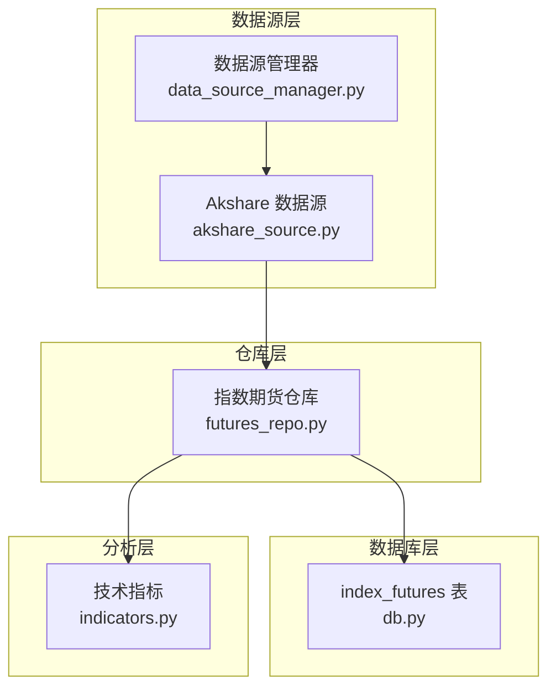
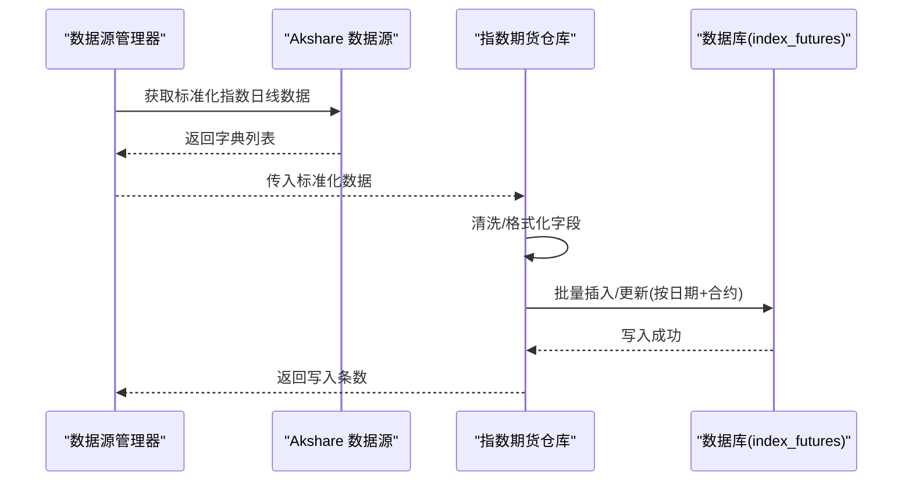
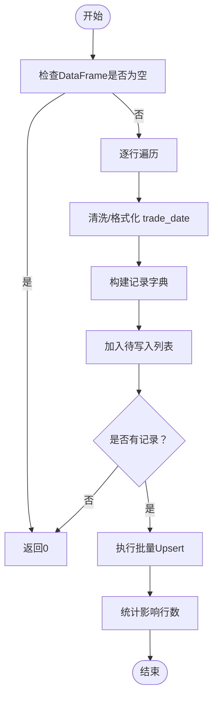
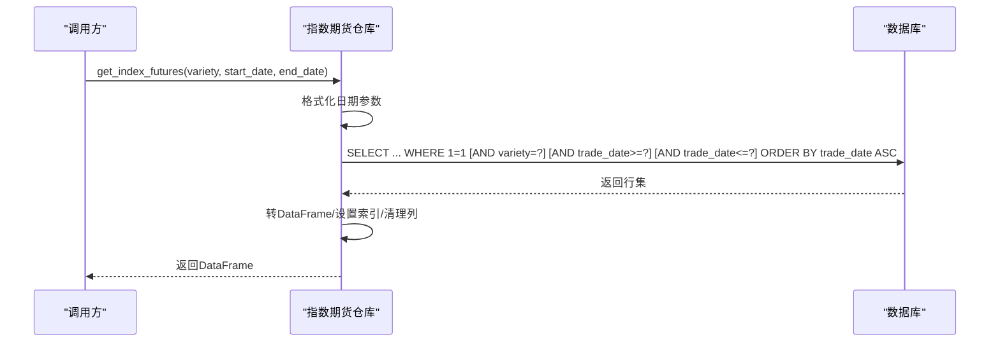
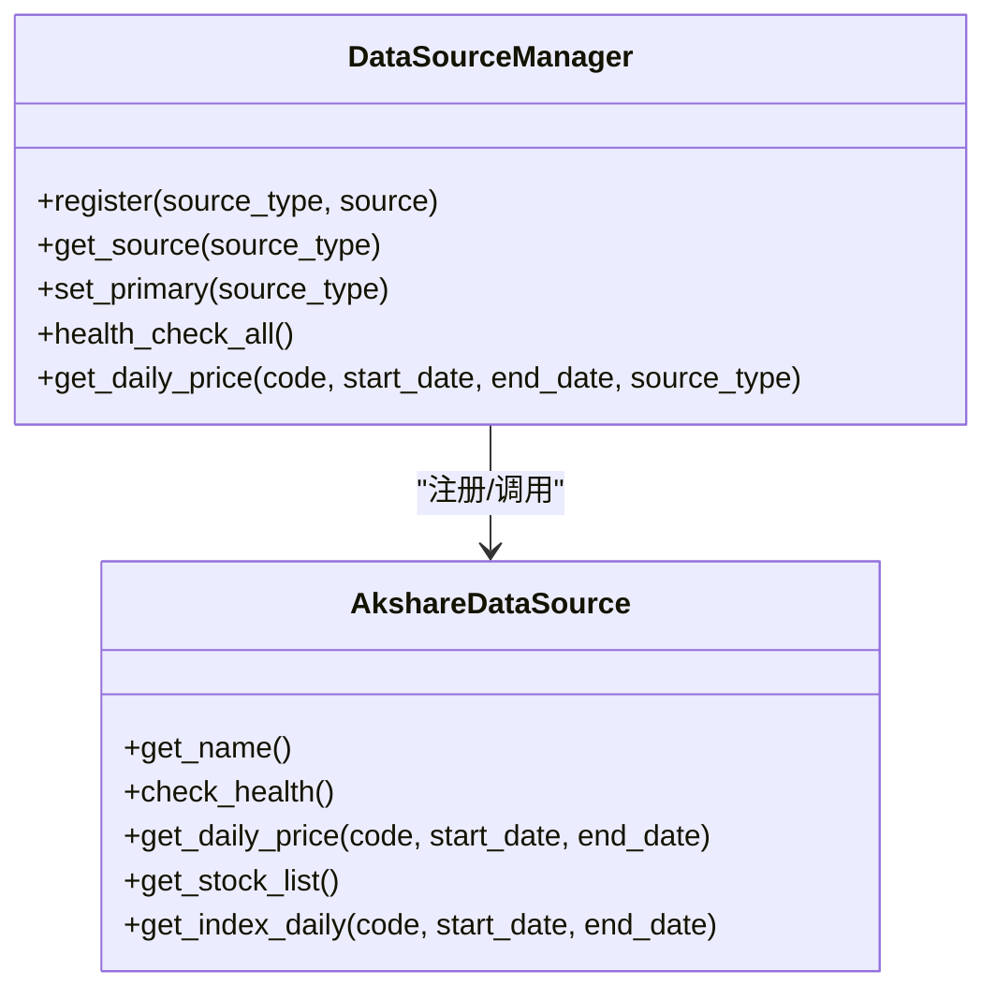
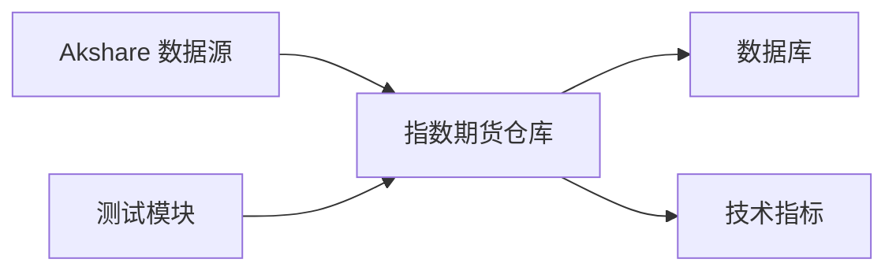

# 指数期货数据表

<cite>
**本文引用的文件**
- [futures_repo.py](file://core/repository/futures_repo.py)
- [db.py](file://core/db.py)
- [akshare_source.py](file://ministries/rites/akshare_source.py)
- [data_source_manager.py](file://ministries/rites/data_source_manager.py)
- [indicators.py](file://strategy/indicators.py)
- [test_repository.py](file://tests/test_repository.py)
</cite>

## 目录
1. [简介](#简介)
2. [项目结构](#项目结构)
3. [核心组件](#核心组件)
4. [架构概览](#架构概览)
5. [详细组件分析](#详细组件分析)
6. [依赖分析](#依赖分析)
7. [性能考虑](#性能考虑)
8. [故障排查指南](#故障排查指南)
9. [结论](#结论)
10. [附录](#附录)

## 简介
本文件面向AIQuant系统中的“指数期货”数据表（index_futures），系统性说明其用途、字段含义、数据来源、查询与写入流程，并提供基于该表的数据分析与套利应用思路。该表用于存储股指期货的交易数据，支持按合约代码与交易日期进行唯一约束，便于增量更新与回测分析。

## 项目结构
围绕指数期货数据表的关键文件与职责如下：
- 数据表定义与索引：在数据库层定义了 index_futures 表及索引，确保高效查询与去重。
- 仓库层（Repository）：提供 upsert、查询与最新日期查询等方法，负责数据清洗与入库。
- 数据源层：通过多数据源管理器统一接入 akshare 等外部数据源，标准化输出格式。
- 技术指标层：提供常用技术指标计算，便于对指数期货数据进行分析与策略开发。
- 测试：验证仓库模块可导入与基本行为。

图表来源
- [futures_repo.py:1-109](file://core/repository/futures_repo.py#L1-L109)
- [db.py:290-308](file://core/db.py#L290-L308)
- [akshare_source.py:1-135](file://ministries/rites/akshare_source.py#L1-L135)
- [data_source_manager.py:111-178](file://ministries/rites/data_source_manager.py#L111-L178)
- [indicators.py:192-236](file://strategy/indicators.py#L192-L236)

章节来源
- [futures_repo.py:1-109](file://core/repository/futures_repo.py#L1-L109)
- [db.py:290-308](file://core/db.py#L290-L308)
- [akshare_source.py:1-135](file://ministries/rites/akshare_source.py#L1-L135)
- [data_source_manager.py:111-178](file://ministries/rites/data_source_manager.py#L111-L178)
- [indicators.py:192-236](file://strategy/indicators.py#L192-L236)

## 核心组件
- 指数期货仓库（upsert_index_futures、get_index_futures、get_latest_futures_date）
  - upsert_index_futures：将标准化后的指数期货数据批量写入或更新 index_futures 表，按 trade_date + symbol 唯一键冲突时执行更新。
  - get_index_futures：按品种、起止日期过滤并返回时间序列DataFrame，索引为 trade_date。
  - get_latest_futures_date：查询指定品种的最新交易日期。
- 数据库表（index_futures）
  - 字段：id、trade_date、symbol、variety、open、high、low、close、volume、open_interest、turnover、settle、pre_settle；唯一键为 (trade_date, symbol)，并建立索引以优化查询。
- 数据源管理器与 Akshare 适配器
  - 通过数据源管理器统一接入 akshare 等数据源，标准化列名并返回字典列表，供仓库层写入。

章节来源
- [futures_repo.py:27-108](file://core/repository/futures_repo.py#L27-L108)
- [db.py:290-308](file://core/db.py#L290-L308)
- [akshare_source.py:45-82](file://ministries/rites/akshare_source.py#L45-L82)
- [data_source_manager.py:153-177](file://ministries/rites/data_source_manager.py#L153-L177)

## 架构概览
下图展示从数据源到数据库再到分析层的整体流程，以及关键方法之间的调用关系。

图表来源
- [data_source_manager.py:153-177](file://ministries/rites/data_source_manager.py#L153-L177)
- [akshare_source.py:101-134](file://ministries/rites/akshare_source.py#L101-L134)
- [futures_repo.py:27-71](file://core/repository/futures_repo.py#L27-L71)
- [db.py:290-308](file://core/db.py#L290-L308)

## 详细组件分析

### 数据表结构与字段说明
- 表名：index_futures
- 唯一键：(trade_date, symbol)
- 索引：按 trade_date、按 (trade_date, variety) 建立索引
- 字段含义（均以数值型为主，缺失值统一为NULL）：
  - trade_date：交易日期（文本格式，YYYY-MM-DD）
  - symbol：合约代码（如“IF2412”）
  - variety：合约品种（如“沪深300股指期货”）
  - open：开盘价
  - high：最高价
  - low：最低价
  - close：收盘价
  - volume：成交量
  - open_interest：持仓量
  - turnover：成交额
  - settle：结算价
  - pre_settle：昨结算价

字段映射与入库逻辑参考以下路径：
- [字段映射与入库SQL:58-70](file://core/repository/futures_repo.py#L58-L70)
- [表结构定义与索引:290-308](file://core/db.py#L290-L308)

章节来源
- [futures_repo.py:58-70](file://core/repository/futures_repo.py#L58-L70)
- [db.py:290-308](file://core/db.py#L290-L308)

### 数据写入流程（Upsert）
- 输入：标准化后的DataFrame（至少包含 trade_date、symbol、variety、open、high、low、close、volume、open_interest、turnover、settle、pre_settle）
- 清洗与格式化：
  - 日期：统一为字符串YYYY-MM-DD；若为datetime对象或8位数字字符串，会做相应截断/转换。
  - 数值：将“-”、空字符串、None转换为NULL；非数值异常转为NULL。
- 批量写入：使用参数化SQL执行批量INSERT…ON CONFLICT…UPDATE，避免重复主键冲突导致失败。
- 返回：写入/更新的记录数量。

图表来源
- [futures_repo.py:27-71](file://core/repository/futures_repo.py#L27-L71)

章节来源
- [futures_repo.py:27-71](file://core/repository/futures_repo.py#L27-L71)

### 数据查询与索引使用
- 支持按品种（variety）、起止日期（start_date、end_date）过滤，返回按 trade_date 排序的DataFrame，索引为 trade_date。
- 查询逻辑通过WHERE子句拼接参数化条件，最终按日期升序排序。
- 索引使用：
  - idx_if_date：加速按日期过滤
  - idx_if_date_var：加速按日期+品种组合过滤

图表来源
- [futures_repo.py:74-97](file://core/repository/futures_repo.py#L74-L97)
- [db.py:290-308](file://core/db.py#L290-L308)

章节来源
- [futures_repo.py:74-97](file://core/repository/futures_repo.py#L74-L97)
- [db.py:290-308](file://core/db.py#L290-L308)

### 数据源接入与标准化
- 数据源管理器支持多种数据源（如 akshare、tushare、baostock、yfinance、local），并提供主备切换与健康检查。
- Akshare 适配器：
  - 标准化列名：将 akshare 的中文列名映射为统一英文字段（如 trade_date、open、high、low、close、volume、amount、turnover 等）。
  - 输出格式：字典列表，供仓库层批量写入。

图表来源
- [data_source_manager.py:111-178](file://ministries/rites/data_source_manager.py#L111-L178)
- [akshare_source.py:15-134](file://ministries/rites/akshare_source.py#L15-L134)

章节来源
- [data_source_manager.py:111-178](file://ministries/rites/data_source_manager.py#L111-L178)
- [akshare_source.py:45-82](file://ministries/rites/akshare_source.py#L45-L82)

### 技术指标与分析应用
- 指标计算：提供 MA、EMA、MACD、RSI、KDJ、布林带、ATR、OBV、VWAP、CCI、DMI 等指标，便于对指数期货数据进行多维度分析。
- 应用建议：
  - 趋势跟踪：结合 MA/EMA/MACD/DMI 判断方向与强度。
  - 震荡识别：RSI/KDJ/CCI 辅助判断超买/超卖区域。
  - 波动与风险：ATR 用于止损与仓位控制；布林带宽度反映市场波动收敛/发散。
  - 成交量确认：OBV/VWAP/VOLUME_RATIO 验证价格突破的有效性。

章节来源
- [indicators.py:192-236](file://strategy/indicators.py#L192-L236)

## 依赖分析
- 仓库层依赖数据库连接（通过 core.db.get_conn），并在事务内执行批量写入。
- 数据源层通过数据源管理器统一调度，Akshare 适配器负责标准化输出。
- 分析层依赖仓库层提供的DataFrame，进行指标计算与策略回测。

图表来源
- [futures_repo.py:7-9](file://core/repository/futures_repo.py#L7-L9)
- [akshare_source.py:15-134](file://ministries/rites/akshare_source.py#L15-L134)
- [indicators.py:192-236](file://strategy/indicators.py#L192-L236)
- [test_repository.py:14-61](file://tests/test_repository.py#L14-L61)

章节来源
- [futures_repo.py:7-9](file://core/repository/futures_repo.py#L7-L9)
- [akshare_source.py:15-134](file://ministries/rites/akshare_source.py#L15-L134)
- [indicators.py:192-236](file://strategy/indicators.py#L192-L236)
- [test_repository.py:14-61](file://tests/test_repository.py#L14-L61)

## 性能考虑
- 唯一键与索引：(trade_date, symbol) 唯一键保证幂等写入；idx_if_date 与 idx_if_date_var 优化按日期与日期+品种的查询。
- 批量写入：使用 executemany 与参数化SQL减少往返开销，提升吞吐。
- 数据清洗：在入库前统一格式与类型，降低后续查询与分析的异常风险。
- 查询优化：按需传入起止日期与品种，避免全表扫描。

章节来源
- [futures_repo.py:58-71](file://core/repository/futures_repo.py#L58-L71)
- [db.py:290-308](file://core/db.py#L290-L308)

## 故障排查指南
- 写入失败或无记录：
  - 检查输入DataFrame是否为空或列缺失（trade_date、symbol、variety、open、high、low、close、volume、open_interest、turnover、settle、pre_settle）。
  - 确认日期格式是否为YYYY-MM-DD或可解析字符串。
- 查询无结果：
  - 核对品种名称与日期范围是否正确；确认索引是否生效。
- 数据源问题：
  - 使用数据源管理器的健康检查接口确认可用性；必要时切换主数据源或启用备用数据源。
- 类型异常：
  - 数值字段中的“-”、空字符串、None会被清洗为NULL；如出现NaN，请检查上游数据源或标准化过程。

章节来源
- [futures_repo.py:12-18](file://core/repository/futures_repo.py#L12-L18)
- [futures_repo.py:27-56](file://core/repository/futures_repo.py#L27-L56)
- [data_source_manager.py:136-151](file://ministries/rites/data_source_manager.py#L136-L151)

## 结论
指数期货数据表（index_futures）在AIQuant中承担着股指期货交易数据的存储与查询职责。通过仓库层的幂等写入、数据库层的索引优化与数据源层的标准化接入，系统实现了高可靠、高性能的数据管线。配合技术指标层的丰富工具，用户可在该表基础上开展趋势、震荡、波动与成交量等多维度分析，并为后续策略回测与套利应用打下坚实基础。

## 附录

### 字段清单与含义
- trade_date：交易日期（YYYY-MM-DD）
- symbol：合约代码（如 IF2412）
- variety：合约品种（如“沪深300股指期货”）
- open：开盘价
- high：最高价
- low：最低价
- close：收盘价
- volume：成交量
- open_interest：持仓量
- turnover：成交额
- settle：结算价
- pre_settle：昨结算价

章节来源
- [db.py:290-308](file://core/db.py#L290-L308)

### 数据来源与标准化要点
- 数据源：Akshare 等外部数据源
- 标准化：统一列名为 trade_date、open、high、low、close、volume、amount、turnover 等，日期格式为YYYY-MM-DD
- 输出：字典列表，供仓库层批量写入

章节来源
- [akshare_source.py:61-78](file://ministries/rites/akshare_source.py#L61-L78)
- [akshare_source.py:101-134](file://ministries/rites/akshare_source.py#L101-L134)

### 查询与分析示例（步骤说明）
- 按品种与日期范围查询：调用 get_index_futures(variety, start_date, end_date)，返回按 trade_date 排序的DataFrame。
- 计算技术指标：使用 calc_all_indicators 对DataFrame进行指标扩展，再进行策略信号生成与回测。
- 套利思路（概念性）：
  - 跨期套利：利用不同到期月份合约间的价差收敛特性，结合ATR与布林带宽度判断入场与出场时机。
  - 跨品种套利：在不同指数期货间寻找相关性与协整关系，采用滚动协整检验与残差序列进行配对交易。
  - 成交量与波动率联动：结合OBV与ATR，识别突破有效性与风险暴露。

章节来源
- [futures_repo.py:74-97](file://core/repository/futures_repo.py#L74-L97)
- [indicators.py:192-236](file://strategy/indicators.py#L192-L236)