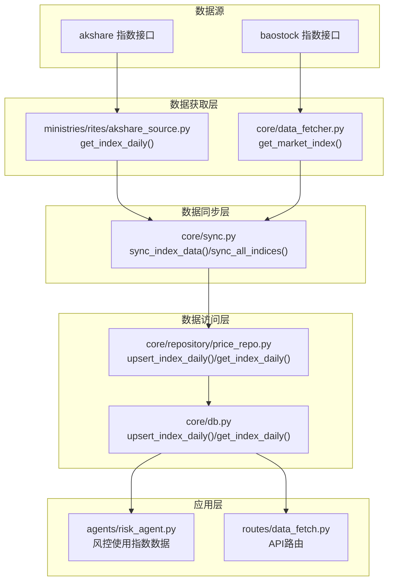
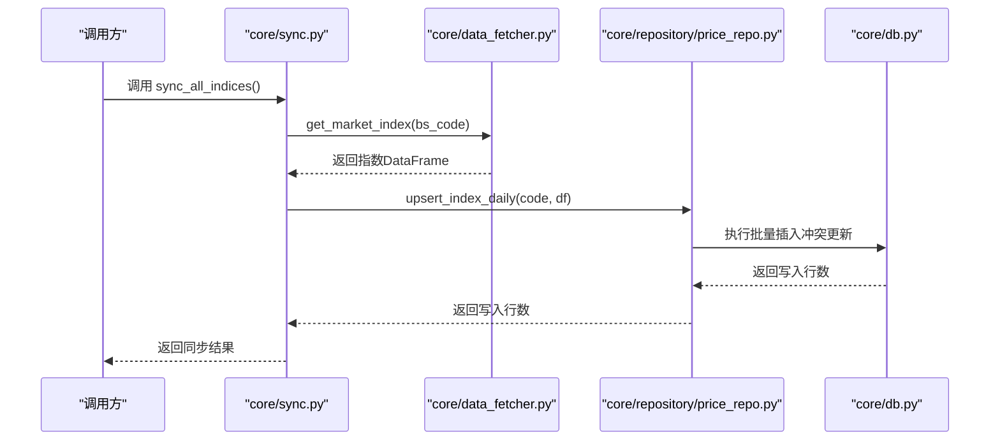
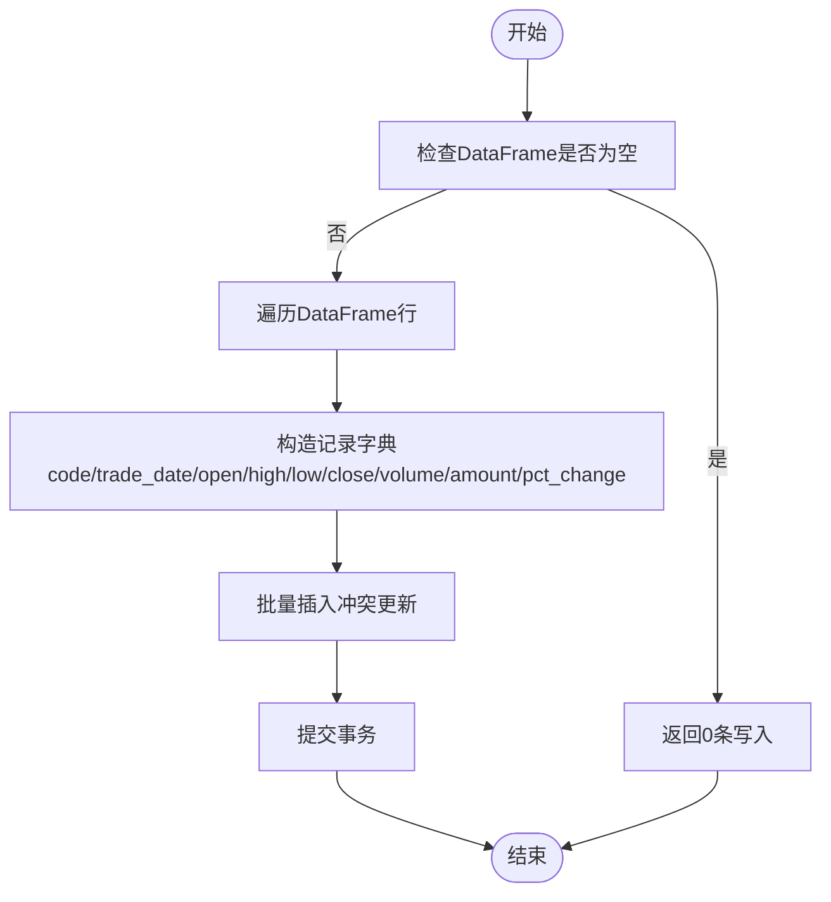
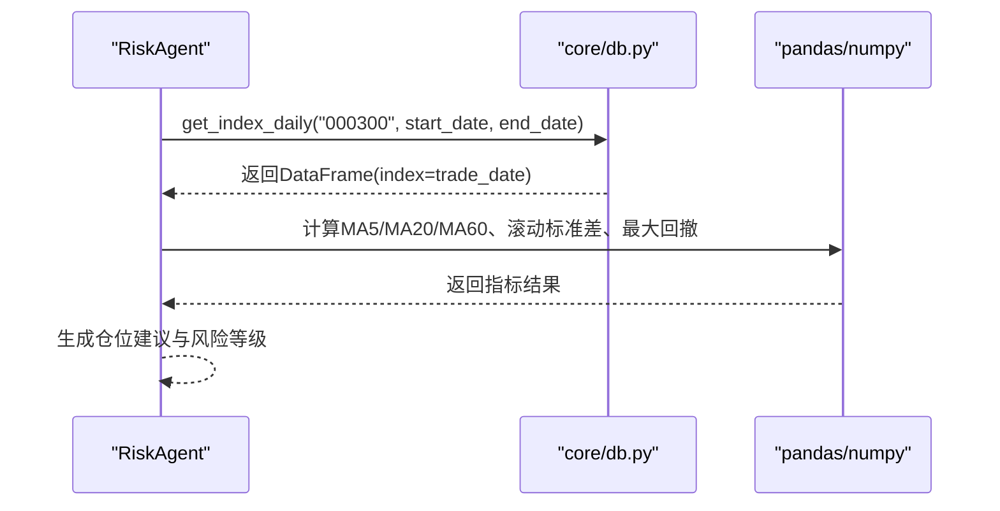
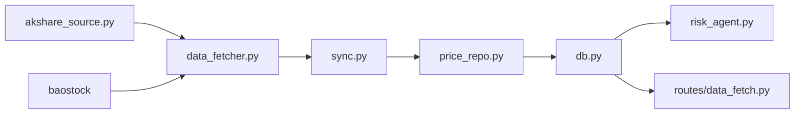

# 指数每日行情表

<cite>
**本文档引用的文件**
- [core/db.py](file://core/db.py)
- [core/repository/price_repo.py](file://core/repository/price_repo.py)
- [core/sync.py](file://core/sync.py)
- [ministries/rites/akshare_source.py](file://ministries/rites/akshare_source.py)
- [core/data_fetcher.py](file://core/data_fetcher.py)
- [agents/risk_agent.py](file://agents/risk_agent.py)
- [routes/data_fetch.py](file://routes/data_fetch.py)
</cite>

## 目录
1. [简介](#简介)
2. [项目结构](#项目结构)
3. [核心组件](#核心组件)
4. [架构概览](#架构概览)
5. [详细组件分析](#详细组件分析)
6. [依赖分析](#依赖分析)
7. [性能考虑](#性能考虑)
8. [故障排除指南](#故障排除指南)
9. [结论](#结论)
10. [附录](#附录)

## 简介
本文件面向AIQuant项目中的指数每日行情表（index_daily），系统性说明其用途、数据结构、命名规则、与个股日线的区别、合成计算方法与权重调整机制，并提供查询、分析与可视化的使用示例。index_daily表专门用于存储沪深300、中证500、中证1000等主要指数的每日行情数据，服务于大盘择时与宏观风控场景。

## 项目结构
围绕指数数据的关键文件与职责如下：
- 数据库定义与访问：core/db.py（建表、upsert、查询）、core/repository/price_repo.py（数据访问层封装）
- 数据同步与来源：core/sync.py（指数同步入口）、core/data_fetcher.py（baostock/akshare指数数据获取）、ministries/rites/akshare_source.py（akshare指数接口适配）
- 应用集成：agents/risk_agent.py（风控模块使用指数数据）、routes/data_fetch.py（API路由）

**图表来源**
- [core/sync.py:91-131](file://core/sync.py#L91-L131)
- [core/data_fetcher.py:371-424](file://core/data_fetcher.py#L371-L424)
- [ministries/rites/akshare_source.py:101-134](file://ministries/rites/akshare_source.py#L101-L134)
- [core/repository/price_repo.py:134-197](file://core/repository/price_repo.py#L134-L197)
- [core/db.py:672-737](file://core/db.py#L672-L737)
- [agents/risk_agent.py:117-177](file://agents/risk_agent.py#L117-L177)
- [routes/data_fetch.py:17-81](file://routes/data_fetch.py#L17-L81)

**章节来源**
- [core/db.py:95-110](file://core/db.py#L95-L110)
- [core/sync.py:78-84](file://core/sync.py#L78-L84)
- [core/repository/price_repo.py:1-237](file://core/repository/price_repo.py#L1-L237)
- [core/data_fetcher.py:371-424](file://core/data_fetcher.py#L371-L424)
- [ministries/rites/akshare_source.py:101-134](file://ministries/rites/akshare_source.py#L101-L134)
- [agents/risk_agent.py:117-177](file://agents/risk_agent.py#L117-L177)
- [routes/data_fetch.py:17-81](file://routes/data_fetch.py#L17-L81)

## 核心组件
- 指数每日行情表（index_daily）
  - 字段：code、trade_date、open、high、low、close、volume、amount、pct_change
  - 索引：code+trade_date唯一索引、trade_date索引
  - 用途：存储主要宽基指数日线，支撑风控、择时与回测
- 数据访问层
  - upsert_index_daily：批量写入（冲突更新）
  - get_index_daily：按指数代码与时间范围查询，返回以trade_date为索引的DataFrame
- 数据同步
  - sync_index_data/sync_all_indices：拉取并写入主要指数（沪深300、中证500、中证1000等）
  - get_market_index：baostock/akshare统一指数数据获取
- 应用集成
  - 风控Agent使用沪深300计算MA趋势与波动率
  - API路由提供数据状态查询

**章节来源**
- [core/db.py:95-110](file://core/db.py#L95-L110)
- [core/repository/price_repo.py:134-197](file://core/repository/price_repo.py#L134-L197)
- [core/sync.py:91-131](file://core/sync.py#L91-L131)
- [core/data_fetcher.py:371-424](file://core/data_fetcher.py#L371-L424)
- [agents/risk_agent.py:117-177](file://agents/risk_agent.py#L117-L177)

## 架构概览
指数数据从数据源获取，经过统一接口封装，进入同步流程，最终写入index_daily表。应用层（风控、回测、API）通过数据访问层读取数据。

**图表来源**
- [core/sync.py:91-131](file://core/sync.py#L91-L131)
- [core/data_fetcher.py:371-424](file://core/data_fetcher.py#L371-L424)
- [core/repository/price_repo.py:134-167](file://core/repository/price_repo.py#L134-L167)
- [core/db.py:672-706](file://core/db.py#L672-L706)

## 详细组件分析

### 数据表结构与字段说明
- 表名：index_daily
- 关键字段
  - code：指数代码（如000300、000905、000852）
  - trade_date：交易日期（YYYY-MM-DD）
  - open/high/low/close：开盘/最高/最低/收盘价
  - volume/amount：成交量/成交额
  - pct_change：涨跌幅
- 约束与索引
  - 唯一索引：(code, trade_date)
  - 索引：trade_date
- 与个股日线（daily_price）差异
  - 指数表仅包含OHLCV与涨跌幅，不包含个股策略评分字段
  - 个股表额外包含vol_score/ma_score/diverge_score/bottom_score/whale_score/fusion_score等策略评分列

**章节来源**
- [core/db.py:95-110](file://core/db.py#L95-L110)
- [core/db.py:72-93](file://core/db.py#L72-L93)

### 指数代码命名规则与数据格式
- 指数代码
  - 使用中国证监会分类的宽基指数代码：000300（沪深300）、000905（中证500）、000852（中证1000）、000001（上证指数）、399001（深证成指）
  - 代码长度为6位数字，前缀不带市场标识
- 数据格式
  - DataFrame列：open、high、low、close、volume、amount、pct_change
  - 索引：trade_date（datetime）
  - 日期格式：YYYY-MM-DD字符串或可解析的日期对象

**章节来源**
- [core/sync.py:78-84](file://core/sync.py#L78-L84)
- [core/repository/price_repo.py:134-197](file://core/repository/price_repo.py#L134-L197)
- [core/db.py:672-737](file://core/db.py#L672-L737)

### 与个股日线的区别：合成计算与权重调整
- 指数合成逻辑
  - 指数日线由成分股按权重合成而来，通常采用自由流通市值加权
  - 指数的开盘价通常为成分股前一交易日收盘价按权重的加权和
  - 指数的最高/最低/收盘价为成分股当日的加权聚合
  - 成交量/成交额为成分股当日的简单加总
- 权重调整机制
  - 权重定期调整（例如季度初），调整后对历史数据进行复权处理
  - 复权处理保证指数序列连续性，避免因成分股调整导致的断点
- 个股日线差异
  - 个股日线为单只股票的真实交易数据，包含OHLCV与涨跌幅
  - 个股日线还包含策略评分字段，用于回测与信号融合

**章节来源**
- [core/data_fetcher.py:371-424](file://core/data_fetcher.py#L371-L424)
- [core/sync.py:91-131](file://core/sync.py#L91-L131)

### 数据写入与读取流程
- 写入流程（批量插入+冲突更新）
  - 输入：指数DataFrame（index=trade_date，columns=[open,high,low,close,volume,amount,pct_change]）
  - 输出：写入index_daily表，若同(code, trade_date)存在则更新对应字段
- 读取流程（条件查询+索引优化）
  - 输入：指数代码、起止日期（YYYY-MM-DD或YYYYMMDD）
  - 输出：以trade_date为索引的DataFrame，过滤id与code列

**图表来源**
- [core/repository/price_repo.py:134-167](file://core/repository/price_repo.py#L134-L167)
- [core/db.py:672-706](file://core/db.py#L672-L706)

**章节来源**
- [core/repository/price_repo.py:134-197](file://core/repository/price_repo.py#L134-L197)
- [core/db.py:672-737](file://core/db.py#L672-L737)

### 数据同步与来源
- 主要指数清单
  - 000001（上证指数）、399001（深证成指）、000300（沪深300）、000905（中证500）、000852（中证1000）
- 同步入口
  - sync_all_indices：同步所有主要指数
  - sync_index_data：同步单个指数
- 数据源
  - baostock为主数据源，akshare为备用
  - akshare_source提供标准化接口，统一列名与日期格式

**章节来源**
- [core/sync.py:78-84](file://core/sync.py#L78-L84)
- [core/sync.py:91-131](file://core/sync.py#L91-L131)
- [core/data_fetcher.py:371-424](file://core/data_fetcher.py#L371-L424)
- [ministries/rites/akshare_source.py:101-134](file://ministries/rites/akshare_source.py#L101-L134)

### 应用集成：风控与回测使用示例
- 风控模块使用
  - 读取沪深300近90日收盘价，计算MA5/MA20/MA60趋势与最大回撤
  - 计算20日收益波动率作为市场波动率评估指标
- 回测与分析
  - 可基于index_daily表进行跨期比较、趋势分析与策略回测

**图表来源**
- [agents/risk_agent.py:117-177](file://agents/risk_agent.py#L117-L177)
- [core/db.py:709-737](file://core/db.py#L709-L737)

**章节来源**
- [agents/risk_agent.py:117-177](file://agents/risk_agent.py#L117-L177)
- [core/db.py:709-737](file://core/db.py#L709-L737)

## 依赖分析
- 指数数据流依赖链
  - 数据源（baostock/akshare）→ 统一接口（get_market_index）→ 同步模块（sync_index_data）→ 数据访问层（upsert_index_daily）→ 应用层（风控/回测/API）
- 关键耦合点
  - 指数代码与数据源映射（baostock前缀与akshare接口）
  - DataFrame列名标准化（trade_date/open/high/low/close/volume/amount/pct_change）
  - 唯一索引约束（code, trade_date）保障幂等写入

**图表来源**
- [core/sync.py:91-131](file://core/sync.py#L91-L131)
- [core/data_fetcher.py:371-424](file://core/data_fetcher.py#L371-L424)
- [core/repository/price_repo.py:134-167](file://core/repository/price_repo.py#L134-L167)
- [core/db.py:672-706](file://core/db.py#L672-L706)
- [agents/risk_agent.py:117-177](file://agents/risk_agent.py#L117-L177)
- [routes/data_fetch.py:17-81](file://routes/data_fetch.py#L17-L81)

**章节来源**
- [core/sync.py:91-131](file://core/sync.py#L91-L131)
- [core/data_fetcher.py:371-424](file://core/data_fetcher.py#L371-L424)
- [core/repository/price_repo.py:134-167](file://core/repository/price_repo.py#L134-L167)
- [core/db.py:672-706](file://core/db.py#L672-L706)
- [agents/risk_agent.py:117-177](file://agents/risk_agent.py#L117-L177)
- [routes/data_fetch.py:17-81](file://routes/data_fetch.py#L17-L81)

## 性能考虑
- 写入性能
  - 使用executemany批量插入，配合ON CONFLICT更新，减少往返次数
  - PRAGMA设置提升并发写入稳定性
- 查询性能
  - 为code+trade_date建立唯一索引，trade_date建立普通索引，满足高频按日期范围查询
- 数据一致性
  - 唯一索引防止重复写入
  - 冲突更新确保历史数据更新时字段完整性

[本节为通用指导，无需具体文件分析]

## 故障排除指南
- 指数数据为空
  - 检查数据源接口可用性与返回数据是否为空
  - 确认指数代码是否在支持列表内
- 写入失败或重复
  - 检查DataFrame是否为空
  - 确认trade_date与code格式是否符合约束
- 读取结果为空
  - 检查日期范围格式（YYYY-MM-DD或YYYYMMDD）
  - 确认指数代码是否存在

**章节来源**
- [ministries/rites/akshare_source.py:101-134](file://ministries/rites/akshare_source.py#L101-L134)
- [core/data_fetcher.py:371-424](file://core/data_fetcher.py#L371-L424)
- [core/repository/price_repo.py:170-197](file://core/repository/price_repo.py#L170-L197)
- [core/db.py:709-737](file://core/db.py#L709-L737)

## 结论
index_daily表为AIQuant的大盘数据基础设施，提供主要宽基指数的标准化日线数据。通过baostock/akshare双数据源与统一接口封装，结合高效的批量写入与索引设计，满足风控、回测与可视化需求。与个股日线相比，指数表专注于OHLCV与涨跌幅，不包含个股策略评分，适合大盘择时与宏观分析场景。

[本节为总结，无需具体文件分析]

## 附录

### 查询、分析与可视化使用示例
- 查询沪深300指数（2024年）
  - 使用get_index_daily("000300", "2024-01-01", "2024-12-31")
  - 返回以trade_date为索引的DataFrame
- 计算MA趋势与波动率（参考风控模块逻辑）
  - 使用pandas rolling计算MA5/MA20/MA60
  - 使用pct_change计算收益序列并求滚动标准差
- 可视化建议
  - 使用matplotlib/seaborn绘制收盘价与成交量
  - 添加移动平均线与涨跌幅柱状图

**章节来源**
- [agents/risk_agent.py:117-177](file://agents/risk_agent.py#L117-L177)
- [core/db.py:709-737](file://core/db.py#L709-L737)