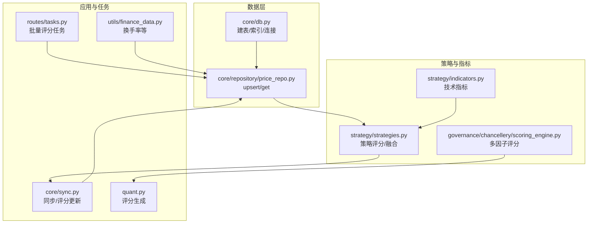
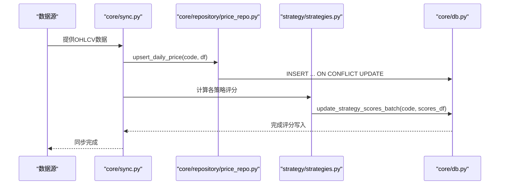
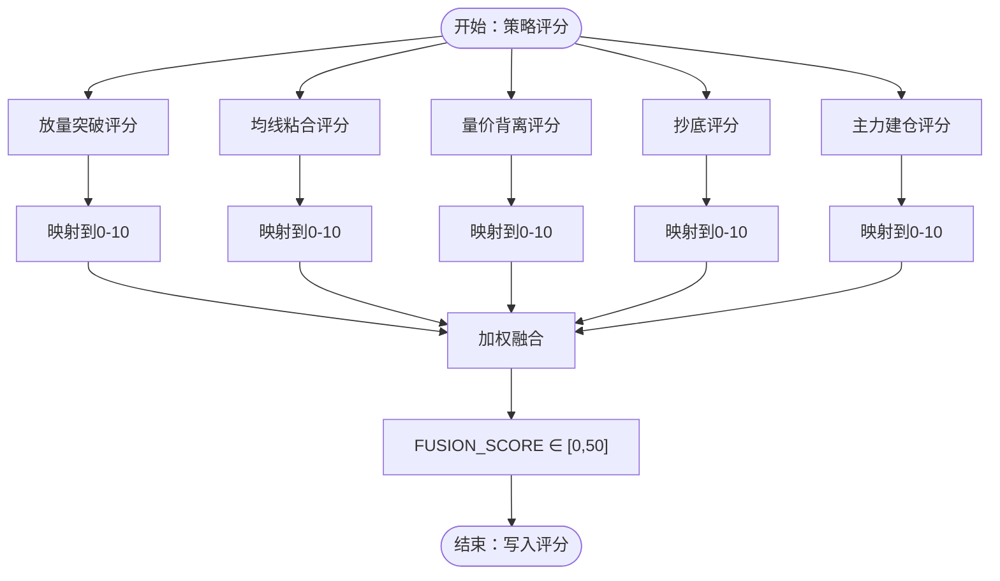
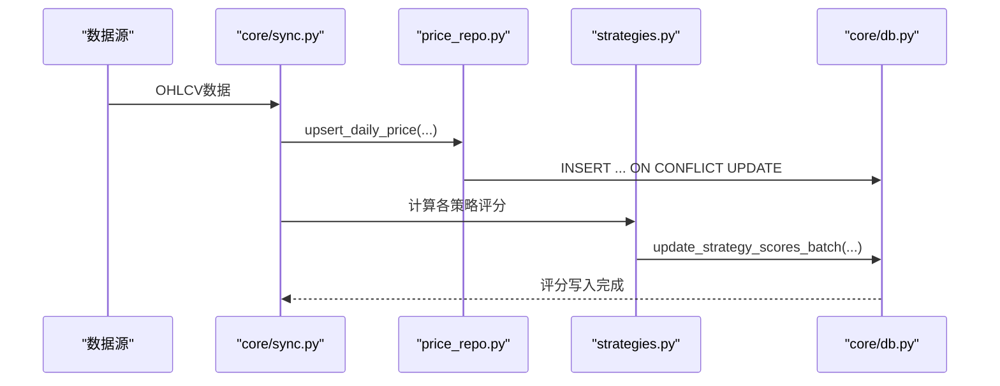
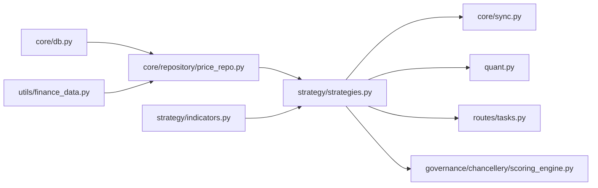

# 日线行情数据表

<cite>
**本文引用的文件**
- [core/db.py](file://core/db.py)
- [core/repository/price_repo.py](file://core/repository/price_repo.py)
- [strategy/indicators.py](file://strategy/indicators.py)
- [strategy/strategies.py](file://strategy/strategies.py)
- [governance/chancellery/scoring_engine.py](file://governance/chancellery/scoring_engine.py)
- [utils/finance_data.py](file://utils/finance_data.py)
- [core/sync.py](file://core/sync.py)
- [quant.py](file://quant.py)
- [routes/tasks.py](file://routes/tasks.py)
</cite>

## 目录
1. [简介](#简介)
2. [项目结构](#项目结构)
3. [核心组件](#核心组件)
4. [架构概览](#架构概览)
5. [详细组件分析](#详细组件分析)
6. [依赖关系分析](#依赖关系分析)
7. [性能考量](#性能考量)
8. [故障排查指南](#故障排查指南)
9. [结论](#结论)

## 简介
本文件面向AIQuant项目的日线行情数据表(daily_price)，系统性说明OHLCV基础字段与衍生指标字段的设计理念、计算方法、数据更新机制、索引优化与查询性能考量。目标读者既包括开发者也包括对量化技术感兴趣的非专业用户。

## 项目结构
围绕日线行情数据表(daily_price)的关键代码分布在以下模块：
- 数据库定义与连接：core/db.py
- 数据访问层：core/repository/price_repo.py
- 技术指标计算：strategy/indicators.py
- 策略评分与融合：strategy/strategies.py
- 多因子评分引擎：governance/chancellery/scoring_engine.py
- 换手率等财务辅助：utils/finance_data.py
- 数据同步与评分更新：core/sync.py、quant.py
- 批量评分任务：routes/tasks.py

图表来源
- [core/db.py:71-110](file://core/db.py#L71-L110)
- [core/repository/price_repo.py:13-129](file://core/repository/price_repo.py#L13-L129)
- [strategy/indicators.py:192-236](file://strategy/indicators.py#L192-L236)
- [strategy/strategies.py:36-430](file://strategy/strategies.py#L36-L430)
- [governance/chancellery/scoring_engine.py:246-314](file://governance/chancellery/scoring_engine.py#L246-L314)
- [core/sync.py:17-26](file://core/sync.py#L17-L26)
- [quant.py:90-125](file://quant.py#L90-L125)
- [routes/tasks.py:46-81](file://routes/tasks.py#L46-L81)
- [utils/finance_data.py:145-161](file://utils/finance_data.py#L145-L161)

章节来源
- [core/db.py:71-110](file://core/db.py#L71-L110)
- [core/repository/price_repo.py:13-129](file://core/repository/price_repo.py#L13-L129)
- [strategy/indicators.py:192-236](file://strategy/indicators.py#L192-L236)
- [strategy/strategies.py:36-430](file://strategy/strategies.py#L36-L430)
- [governance/chancellery/scoring_engine.py:246-314](file://governance/chancellery/scoring_engine.py#L246-L314)
- [core/sync.py:17-26](file://core/sync.py#L17-L26)
- [quant.py:90-125](file://quant.py#L90-L125)
- [routes/tasks.py:46-81](file://routes/tasks.py#L46-L81)
- [utils/finance_data.py:145-161](file://utils/finance_data.py#L145-L161)

## 核心组件
- 表结构与索引
  - daily_price：存储OHLCV及衍生评分字段，包含唯一约束(code, trade_date)，并建立(code, trade_date)与(trade_date)索引，便于按股票或按日期快速检索。
  - index_daily：用于大盘指数行情，同样具备索引优化。
- 数据访问层
  - upsert_daily_price：将DataFrame写入或更新到daily_price，确保OHLCV与pct_change、turnover等字段一致性。
  - get_daily_price：按股票代码与日期范围查询，返回索引为日期的DataFrame。
  - update_strategy_scores_batch：批量更新策略评分字段（vol_score、ma_score、diverge_score、bottom_score、whale_score、fusion_score）。
- 指标与评分
  - 技术指标：提供MA、EMA、MACD、RSI、KDJ、布林带、ATR、OBV、VWAP、CCI、DMI、量比等，作为策略输入。
  - 策略评分：放量突破、均线粘合、量价背离、抄底、主力建仓五类策略分别输出0-3原始分，经映射到0-10后按权重融合得到FUSION_SCORE。
  - 多因子评分：趋势、动量、波动率、成交量、质量五大因子，加权合成0-100分并分级。
- 数据同步与更新
  - 同步流程：先拉取OHLCV数据写入daily_price，再计算各策略评分并批量写入评分字段，最后生成信号与报告。
  - 批量评分任务：按股票列表批量评分并排序输出TopN。

章节来源
- [core/db.py:71-110](file://core/db.py#L71-L110)
- [core/repository/price_repo.py:13-129](file://core/repository/price_repo.py#L13-L129)
- [strategy/indicators.py:192-236](file://strategy/indicators.py#L192-L236)
- [strategy/strategies.py:36-430](file://strategy/strategies.py#L36-L430)
- [governance/chancellery/scoring_engine.py:246-314](file://governance/chancellery/scoring_engine.py#L246-L314)
- [core/sync.py:17-26](file://core/sync.py#L17-L26)
- [routes/tasks.py:46-81](file://routes/tasks.py#L46-L81)

## 架构概览
日线行情数据表(daily_price)是AIQuant的核心数据资产，贯穿“数据采集→指标计算→策略评分→信号生成→回测验证”的完整链路。

图表来源
- [core/sync.py:17-26](file://core/sync.py#L17-L26)
- [core/repository/price_repo.py:13-92](file://core/repository/price_repo.py#L13-L92)
- [strategy/strategies.py:36-430](file://strategy/strategies.py#L36-L430)
- [core/db.py:581-623](file://core/db.py#L581-L623)

## 详细组件分析

### OHLCV基础字段
- open：开盘价
- high：最高价
- low：最低价
- close：收盘价
- volume：成交量（股）
- amount：成交额（元）
- pct_change：涨跌幅（日）
- turnover：换手率（日）

这些字段构成日线行情的最小可用集，既可用于基础技术分析，也为后续衍生指标与评分提供输入。

章节来源
- [core/db.py:71-110](file://core/db.py#L71-L110)
- [core/repository/price_repo.py:13-41](file://core/repository/price_repo.py#L13-L41)

### 衍生指标字段设计理念与计算方法
- vol_score（量能评分）
  - 设计理念：衡量当日放量强度与均线多头排列的协同程度，反映短期量能驱动趋势的强度。
  - 计算方法：来源于放量突破策略，将量比、多头排列强度、3日涨幅等条件连续化打分，映射至0-10区间。
  - 写入方式：通过update_strategy_scores_batch批量更新。
- ma_score（均线评分）
  - 设计理念：衡量均线粘合后向上发散的强度，反映趋势形成过程中的均线系统状态。
  - 计算方法：基于均线粘合度、向上发散强度与量能稳定度的连续化打分，映射至0-10区间。
  - 写入方式：通过update_strategy_scores_batch批量更新。
- diverge_score（量价背离评分）
  - 设计理念：检测价格创新低而成交量未创新高的底背离信号，捕捉潜在反转动能。
  - 计算方法：底背离强度、反弹强度与趋势逆转确认度的组合打分，映射至0-10区间。
  - 写入方式：通过update_strategy_scores_batch批量更新。
- bottom_score（底部评分）
  - 设计理念：识别连续下跌后的放量反弹形态，捕捉阶段性底部信号。
  - 计算方法：下跌深度、放量反弹强度与趋势确认的组合打分，映射至0-10区间。
  - 写入方式：通过update_strategy_scores_batch批量更新。
- whale_score（主力评分）
  - 设计理念：通过成交量分布与价格行为特征，识别主力资金可能的建仓迹象。
  - 计算方法：主力建仓策略的多因子打分，映射至0-10区间。
  - 写入方式：通过update_strategy_scores_batch批量更新。
- fusion_score（融合评分）
  - 设计理念：将五类策略评分按权重融合，得到单一综合信号，便于统一阈值筛选与回测。
  - 计算方法：各策略原始分（0-3）映射到0-10后，按权重加权求和，最终归一化至0-50。
  - 写入方式：通过update_strategy_scores_batch批量更新。

图表来源
- [strategy/strategies.py:36-430](file://strategy/strategies.py#L36-L430)
- [core/db.py:581-623](file://core/db.py#L581-L623)

章节来源
- [strategy/strategies.py:36-430](file://strategy/strategies.py#L36-L430)
- [core/db.py:581-623](file://core/db.py#L581-L623)

### 数据更新机制
- 写入流程
  - upsert_daily_price：将OHLCV与pct_change、turnover写入daily_price，若冲突则按列更新，保证数据一致性。
  - update_strategy_scores_batch：仅更新策略评分字段，避免重复写入OHLCV，减少IO开销。
- 同步与评分
  - core/sync.py：负责从数据源拉取OHLCV，写入daily_price，随后调用策略模块计算评分并批量写入。
  - quant.py：在策略评分基础上生成融合评分，并用于下单决策。
  - routes/tasks.py：批量评分任务，按日期筛选并输出TopN候选。

图表来源
- [core/sync.py:17-26](file://core/sync.py#L17-L26)
- [core/repository/price_repo.py:13-92](file://core/repository/price_repo.py#L13-L92)
- [strategy/strategies.py:36-430](file://strategy/strategies.py#L36-L430)
- [core/db.py:581-623](file://core/db.py#L581-L623)

章节来源
- [core/repository/price_repo.py:13-92](file://core/repository/price_repo.py#L13-L92)
- [core/sync.py:17-26](file://core/sync.py#L17-L26)
- [quant.py:90-125](file://quant.py#L90-L125)
- [routes/tasks.py:46-81](file://routes/tasks.py#L46-L81)

### 索引优化与查询性能
- 索引设计
  - daily_price(code, trade_date)：唯一索引，保障按股票+日期的唯一性与高效查询。
  - daily_price(trade_date)：按日期查询的辅助索引，支持时间序列分析。
- 查询路径
  - get_daily_price：按code过滤并可选日期范围，最终按trade_date升序返回索引为日期的DataFrame。
- 性能建议
  - 使用索引覆盖的WHERE子句（code、trade_date）以减少全表扫描。
  - 批量写入策略评分时使用executemany或循环批量UPDATE，降低事务开销。
  - 对于高频查询，可在应用层缓存常用股票的时间序列片段。

章节来源
- [core/db.py:71-110](file://core/db.py#L71-L110)
- [core/repository/price_repo.py:95-129](file://core/repository/price_repo.py#L95-L129)

## 依赖关系分析
- 数据库层
  - daily_price与stock_info、stock_signal、positions、trades等表存在外键关系（迁移脚本中可见）。
  - daily_price与index_daily分别服务于个股与大盘行情。
- 访问层
  - price_repo依赖core/db的连接与SQL执行，提供upsert与查询接口。
- 策略与指标
  - strategy/indicators.py提供技术指标，供strategy/strategies.py与governance/chancellery/scoring_engine.py使用。
- 应用层
  - core/sync.py协调数据同步与评分更新；quant.py在策略评分基础上生成融合评分；routes/tasks.py提供批量评分任务。

图表来源
- [core/db.py:71-110](file://core/db.py#L71-L110)
- [core/repository/price_repo.py:13-129](file://core/repository/price_repo.py#L13-L129)
- [strategy/indicators.py:192-236](file://strategy/indicators.py#L192-L236)
- [strategy/strategies.py:36-430](file://strategy/strategies.py#L36-L430)
- [governance/chancellery/scoring_engine.py:246-314](file://governance/chancellery/scoring_engine.py#L246-L314)
- [core/sync.py:17-26](file://core/sync.py#L17-L26)
- [quant.py:90-125](file://quant.py#L90-L125)
- [routes/tasks.py:46-81](file://routes/tasks.py#L46-L81)
- [utils/finance_data.py:145-161](file://utils/finance_data.py#L145-L161)

章节来源
- [core/db.py:71-110](file://core/db.py#L71-L110)
- [core/repository/price_repo.py:13-129](file://core/repository/price_repo.py#L13-L129)
- [strategy/indicators.py:192-236](file://strategy/indicators.py#L192-L236)
- [strategy/strategies.py:36-430](file://strategy/strategies.py#L36-L430)
- [governance/chancellery/scoring_engine.py:246-314](file://governance/chancellery/scoring_engine.py#L246-L314)
- [core/sync.py:17-26](file://core/sync.py#L17-L26)
- [quant.py:90-125](file://quant.py#L90-L125)
- [routes/tasks.py:46-81](file://routes/tasks.py#L46-L81)
- [utils/finance_data.py:145-161](file://utils/finance_data.py#L145-L161)

## 性能考量
- 存储与并发
  - 使用SQLite WAL模式与NORMAL同步策略，在并发写入与可靠性之间取得平衡。
  - 使用executemany批量插入与批量UPDATE，减少事务提交次数。
- 查询优化
  - 通过(code, trade_date)与(trade_date)索引，支持按股票与按日期的高效查询。
  - 查询时尽量使用日期范围过滤，避免全表扫描。
- 计算与缓存
  - 指标计算采用滚动窗口与向量化操作，结合策略评分映射与融合，控制计算复杂度。
  - 对于跨表查询（如与stock_info联结），优先在SQL层面完成，减少Python侧拼接成本。

[本节为通用性能指导，无需特定文件来源]

## 故障排查指南
- 数据写入异常
  - 确认DataFrame列名与类型：open、high、low、close、volume、amount、pct_change、turnover。
  - 检查ON CONFLICT更新逻辑是否生效，避免重复键冲突导致的写入失败。
- 评分未更新
  - 确认update_strategy_scores_batch的参数格式与列名一致（vol_score、ma_score、diverge_score、bottom_score、whale_score、fusion_score）。
  - 检查trade_date格式（YYYY-MM-DD），确保与数据库一致。
- 查询结果为空
  - 检查get_daily_price的日期格式与边界，确认start_date/end_date格式转换逻辑。
  - 确认索引是否存在且未被破坏。
- 换手率缺失
  - 检查stock_info是否具备float_shares字段，必要时通过迁移脚本自动添加。
  - 使用calculate_turnover_rate进行换手率计算，若float_shares未知则返回None。

章节来源
- [core/repository/price_repo.py:13-92](file://core/repository/price_repo.py#L13-L92)
- [core/db.py:581-623](file://core/db.py#L581-L623)
- [core/repository/price_repo.py:95-129](file://core/repository/price_repo.py#L95-L129)
- [utils/finance_data.py:145-161](file://utils/finance_data.py#L145-L161)

## 结论
日线行情数据表(daily_price)在AIQuant中承担着承上启下的关键角色：它承载OHLCV与基础涨跌幅、换手率等字段，同时通过策略评分与融合评分形成统一的信号输出。依托合理的索引设计与批量写入策略，系统在数据一致性、查询效率与扩展性方面实现了良好平衡。建议在生产环境中持续监控评分更新与查询性能，并根据业务需求适时调整索引与缓存策略。