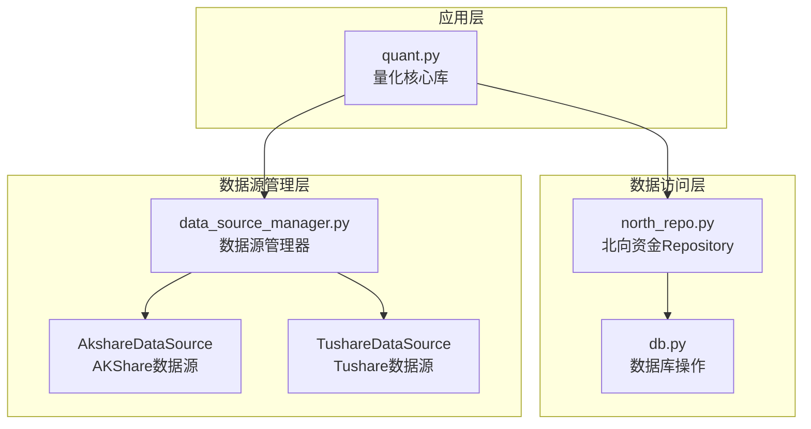
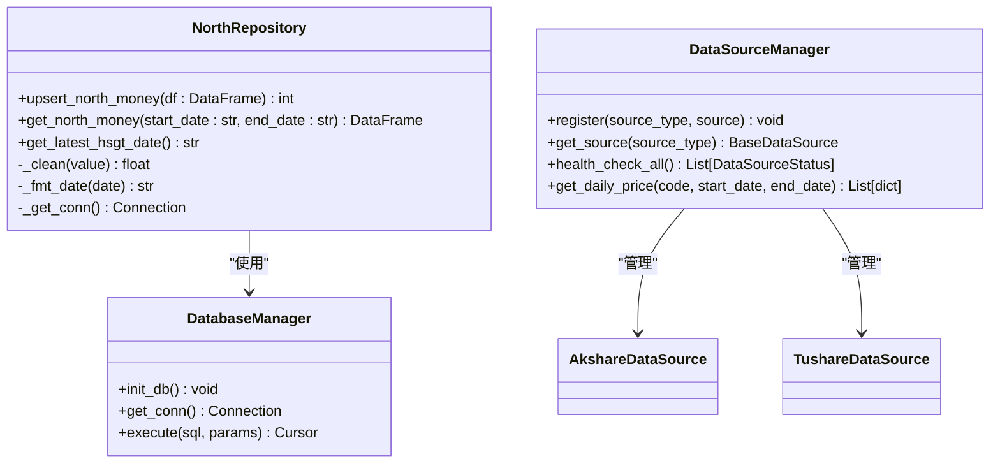
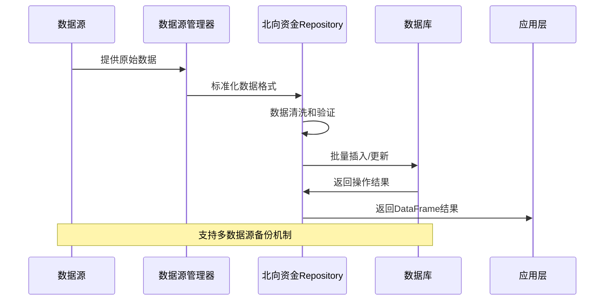
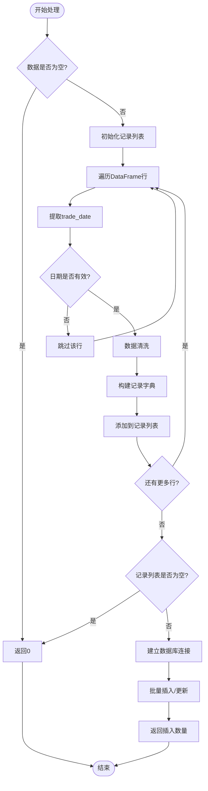
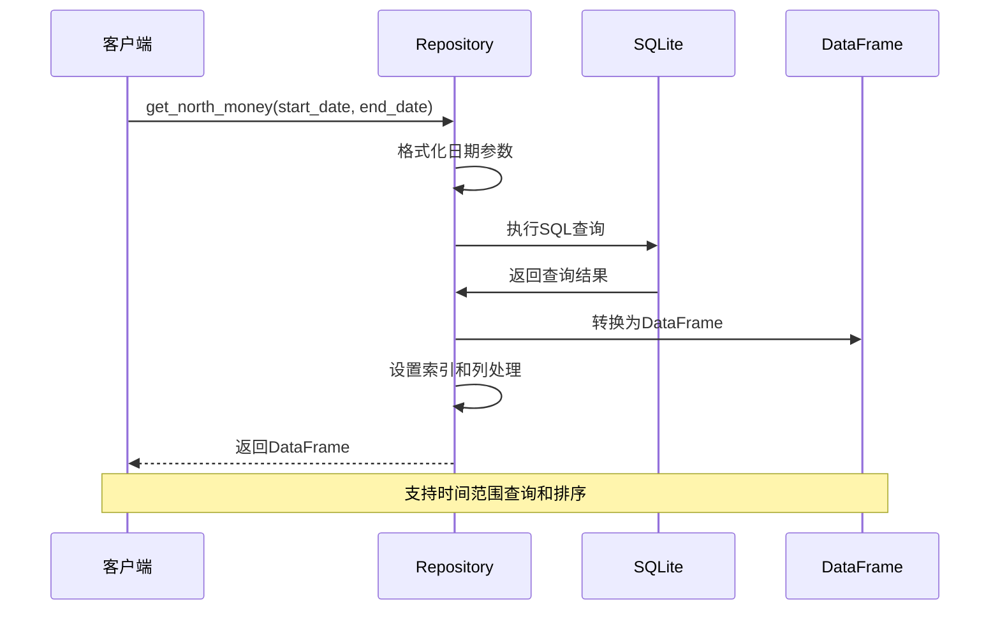
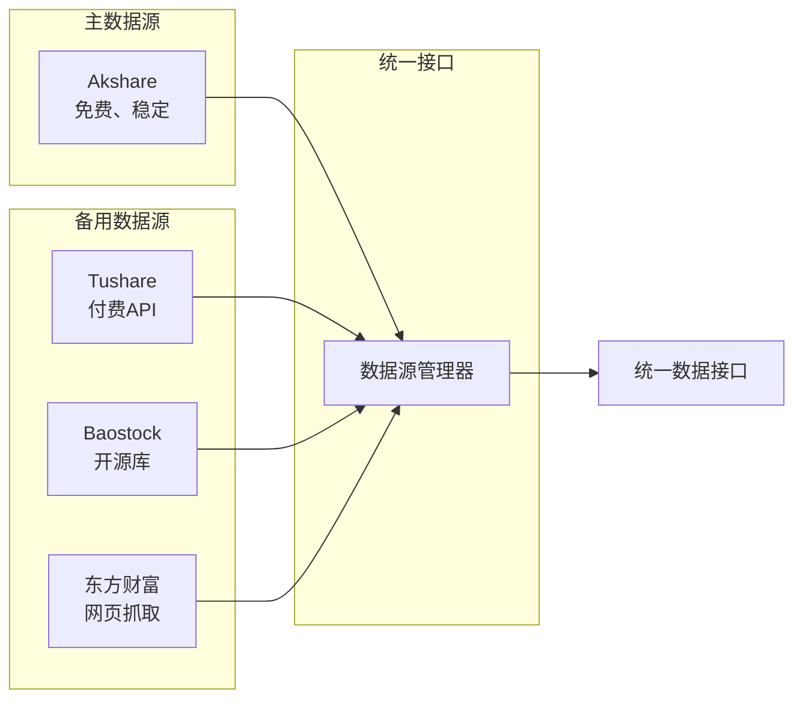
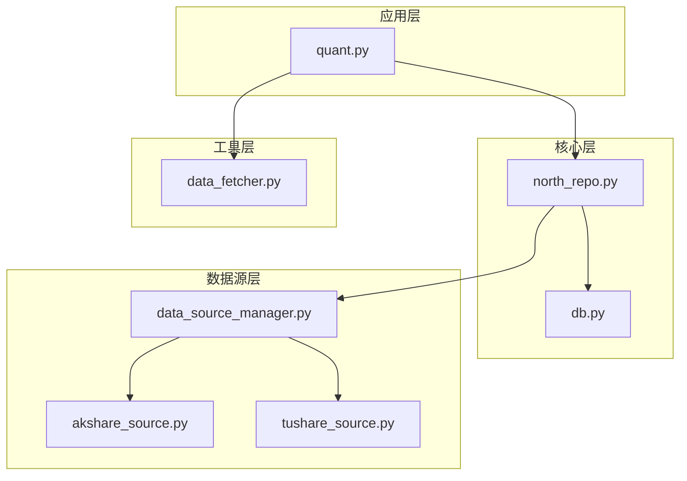

# 沪深港通北向资金表

<cite>
**本文档引用的文件**
- [north_repo.py](file://core/repository/north_repo.py)
- [db.py](file://core/db.py)
- [quant.py](file://quant.py)
- [akshare_source.py](file://ministries/rites/akshare_source.py)
- [tushare_source.py](file://ministries/rites/tushare_source.py)
- [data_source_manager.py](file://ministries/rites/data_source_manager.py)
</cite>

## 目录
1. [简介](#简介)
2. [项目结构](#项目结构)
3. [核心组件](#核心组件)
4. [架构概览](#架构概览)
5. [详细组件分析](#详细组件分析)
6. [依赖关系分析](#依赖关系分析)
7. [性能考虑](#性能考虑)
8. [故障排除指南](#故障排除指南)
9. [结论](#结论)

## 简介

沪深港通北向资金表(stock_hsgt_north)是AIQuant系统中用于记录沪股通、深股通和港股通资金流向数据的核心数据表。该表采用SQLite数据库存储，提供了完整的北向资金统计功能，包括：

- **北向整体资金流向**：记录整个北向资金的净买入、买入金额、卖出金额等关键指标
- **沪股通专项统计**：针对上海市场的资金流向进行细分统计
- **深股通专项统计**：针对深圳市场的资金流向进行细分统计
- **港股通专项统计**：针对香港市场的资金流向进行细分统计

该表的设计遵循了统一的数据标准化原则，确保不同来源的数据能够被正确解析和存储。

## 项目结构

AIQuant项目采用模块化架构设计，北向资金数据处理涉及以下关键模块：

**图表来源**
- [north_repo.py:1-117](file://core/repository/north_repo.py#L1-L117)
- [db.py:265-288](file://core/db.py#L265-L288)
- [data_source_manager.py:111-190](file://ministries/rites/data_source_manager.py#L111-L190)

**章节来源**
- [north_repo.py:1-117](file://core/repository/north_repo.py#L1-L117)
- [db.py:265-288](file://core/db.py#L265-L288)

## 核心组件

### 数据表结构

stock_hsgt_north表采用SQLite数据库存储，包含以下核心字段：

| 字段类别 | 字段名称 | 数据类型 | 描述 |
|---------|----------|----------|------|
| **基础信息** | trade_date | TEXT NOT NULL | 交易日期，唯一索引 |
| **北向整体** | north_net_buy | REAL | 北向净买入金额 |
| | north_buy_amt | REAL | 北向买入总金额 |
| | north_sell_amt | REAL | 北向卖出总金额 |
| | north_cum_net | REAL | 北向累计净买额 |
| | north_daily_flow | REAL | 北向日度流量 |
| | north_balance | REAL | 北向余额 |
| | north_market_cap | REAL | 北向持股市值 |
| **沪股通(HGT)** | hgt_net_buy | REAL | 沪股通净买入 |
| | hgt_buy_amt | REAL | 沪股通买入金额 |
| | hgt_sell_amt | REAL | 沪股通卖出金额 |
| | hgt_cum_net | REAL | 沪股通累计净买额 |
| | hgt_daily_flow | REAL | 沪股通日度流量 |
| **深股通(SGT)** | sgt_net_buy | REAL | 深股通净买入 |
| | sgt_buy_amt | REAL | 深股通买入金额 |
| | sgt_sell_amt | REAL | 深股通卖出金额 |
| | sgt_cum_net | REAL | 深股通累计净买额 |
| | sgt_daily_flow | REAL | 深股通日度流量 |

### 数据仓库模式

北向资金数据采用Repository模式进行管理，提供以下核心功能：

**图表来源**
- [north_repo.py:27-116](file://core/repository/north_repo.py#L27-L116)
- [data_source_manager.py:111-190](file://ministries/rites/data_source_manager.py#L111-L190)

**章节来源**
- [north_repo.py:27-116](file://core/repository/north_repo.py#L27-L116)
- [db.py:265-288](file://core/db.py#L265-L288)

## 架构概览

AIQuant系统的北向资金处理架构采用分层设计，确保数据的准确性和系统的可维护性：

**图表来源**
- [akshare_source.py:45-82](file://ministries/rites/akshare_source.py#L45-L82)
- [north_repo.py:27-87](file://core/repository/north_repo.py#L27-L87)

### 数据流处理流程

系统采用ETL(Extract, Transform, Load)模式处理北向资金数据：

1. **数据提取**：从多个数据源获取原始数据
2. **数据转换**：标准化字段格式，进行数据清洗
3. **数据加载**：批量插入到SQLite数据库
4. **数据查询**：提供灵活的查询接口

**章节来源**
- [akshare_source.py:15-135](file://ministries/rites/akshare_source.py#L15-L135)
- [tushare_source.py:16-167](file://ministries/rites/tushare_source.py#L16-L167)

## 详细组件分析

### 数据仓库实现

#### upsert_north_money方法

该方法实现了北向资金数据的批量插入和更新功能：

**图表来源**
- [north_repo.py:27-87](file://core/repository/north_repo.py#L27-L87)

#### 数据清洗机制

系统采用严格的字段清洗机制，确保数据质量：

| 字段类型 | 清洗规则 | 处理方式 |
|---------|---------|---------|
| 数值字段 | "-"、空字符串、None | 转换为None |
| 数值字段 | 无法转换的字符串 | 转换为None |
| 日期字段 | datetime对象 | 提取日期部分 |
| 日期字段 | 8位数字字符串 | 格式化为YYYY-MM-DD |
| 日期字段 | 其他格式 | 截取前10位 |

**章节来源**
- [north_repo.py:12-24](file://core/repository/north_repo.py#L12-L24)
- [north_repo.py:27-87](file://core/repository/north_repo.py#L27-L87)

### 数据查询接口

#### get_north_money方法

提供灵活的北向资金数据查询功能：

**图表来源**
- [north_repo.py:90-110](file://core/repository/north_repo.py#L90-L110)

#### get_latest_hsgt_date方法

提供最新的北向资金日期查询功能，用于数据同步控制：

**章节来源**
- [north_repo.py:90-116](file://core/repository/north_repo.py#L90-L116)

### 数据源集成

#### 多数据源支持

系统支持多种数据源，确保数据获取的可靠性：

**图表来源**
- [akshare_source.py:15-44](file://ministries/rites/akshare_source.py#L15-L44)
- [tushare_source.py:16-63](file://ministries/rites/tushare_source.py#L16-L63)

#### 数据源健康检查

系统提供自动化的数据源健康检查机制：

**章节来源**
- [akshare_source.py:21-43](file://ministries/rites/akshare_source.py#L21-L43)
- [tushare_source.py:33-63](file://ministries/rites/tushare_source.py#L33-L63)

## 依赖关系分析

### 组件耦合度

北向资金系统的组件设计遵循低耦合高内聚的原则：

**图表来源**
- [quant.py:23-25](file://quant.py#L23-L25)
- [north_repo.py:7-9](file://core/repository/north_repo.py#L7-L9)

### 外部依赖

系统对外部依赖的管理：

| 依赖包 | 版本要求 | 用途 | 备注 |
|-------|---------|------|------|
| pandas | >=1.3.0 | 数据处理 | 核心依赖 |
| sqlite3 | 内置 | 数据存储 | 无需额外安装 |
| akshare | >=1.9.0 | 数据获取 | 主数据源 |
| tushare | >=1.2.84 | 数据获取 | 备用数据源 |
| baostock | >=0.2.9 | 数据获取 | 备用数据源 |

**章节来源**
- [quant.py:16-25](file://quant.py#L16-L25)
- [akshare_source.py:9](file://ministries/rites/akshare_source.py#L9)

## 性能考虑

### 数据库优化

系统采用以下优化策略提升性能：

1. **索引优化**：为trade_date字段建立唯一索引，确保查询效率
2. **批量操作**：使用executemany进行批量插入，减少数据库往返
3. **内存管理**：合理控制DataFrame大小，避免内存溢出
4. **连接池**：复用数据库连接，减少连接开销

### 查询性能

查询接口的性能优化：

- **条件查询**：支持灵活的时间范围查询
- **索引利用**：充分利用trade_date索引
- **数据类型优化**：使用REAL类型存储数值，节省空间
- **缓存机制**：DataFrame结果可重复使用

## 故障排除指南

### 常见问题及解决方案

#### 数据源连接失败

**问题描述**：Akshare或Tushare数据源连接超时

**解决方案**：
1. 检查网络连接状态
2. 验证API密钥配置
3. 查看数据源健康状态
4. 切换到备用数据源

#### 数据格式错误

**问题描述**：trade_date字段格式不正确导致插入失败

**解决方案**：
1. 使用_date_format函数统一日期格式
2. 检查输入数据的日期字段
3. 验证日期范围的有效性

#### 数据库操作异常

**问题描述**：SQLite数据库操作抛出异常

**解决方案**：
1. 检查数据库文件权限
2. 验证表结构完整性
3. 查看具体的错误信息
4. 重启数据库连接

**章节来源**
- [north_repo.py:12-18](file://core/repository/north_repo.py#L12-L18)
- [akshare_source.py:21-43](file://ministries/rites/akshare_source.py#L21-L43)

## 结论

沪深港通北向资金表(stock_hsgt_north)是AIQuant系统中的重要数据基础设施，具有以下特点：

### 设计优势

1. **完整的数据覆盖**：涵盖北向资金的整体和细分统计
2. **灵活的数据源支持**：多数据源备份机制确保数据可靠性
3. **高效的查询接口**：提供便捷的数据访问能力
4. **严格的数据质量控制**：完善的清洗和验证机制

### 应用价值

- **量化分析**：为技术分析和策略研究提供数据支撑
- **风险控制**：帮助识别市场资金流向变化
- **决策支持**：为投资决策提供数据参考
- **系统监控**：实时跟踪北向资金动态

### 发展建议

1. **扩展数据维度**：增加更多细分统计指标
2. **优化查询性能**：考虑分区表等高级优化技术
3. **增强可视化**：提供更丰富的数据展示功能
4. **完善监控告警**：建立数据异常检测机制

该表的设计充分体现了AIQuant系统在数据管理方面的专业性和前瞻性，为后续的功能扩展奠定了坚实的基础。