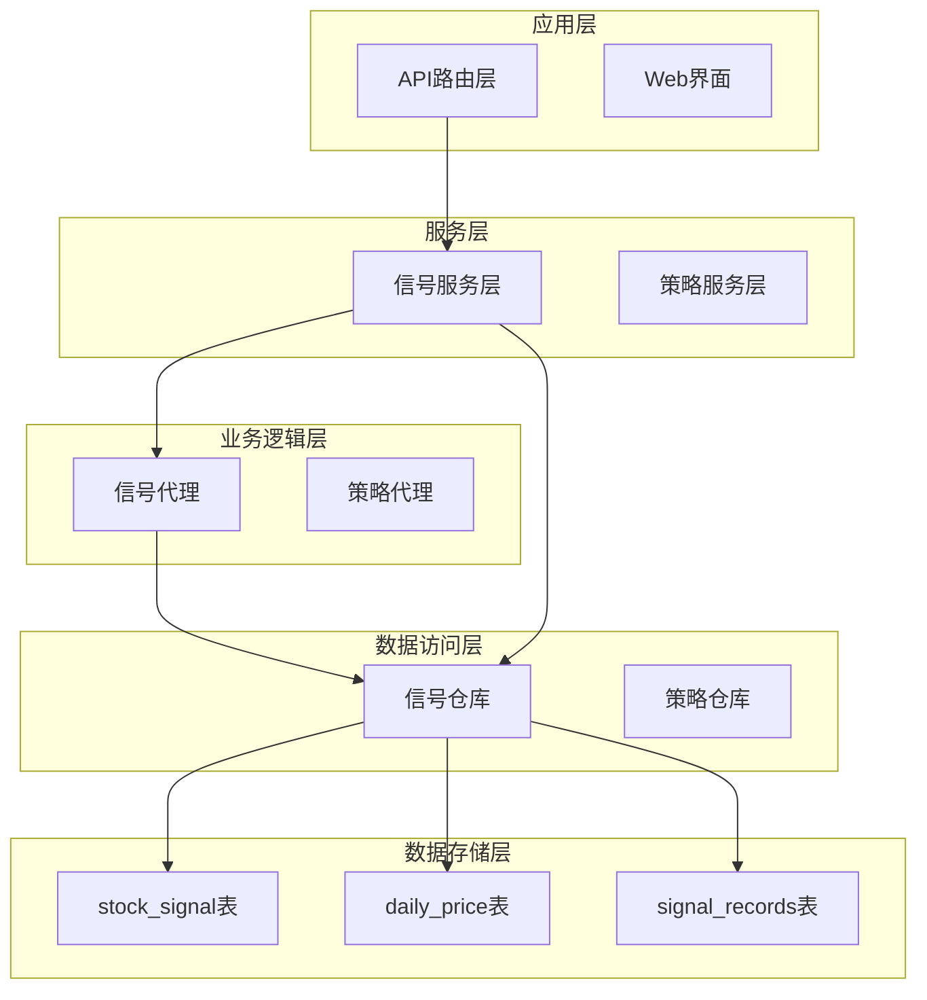
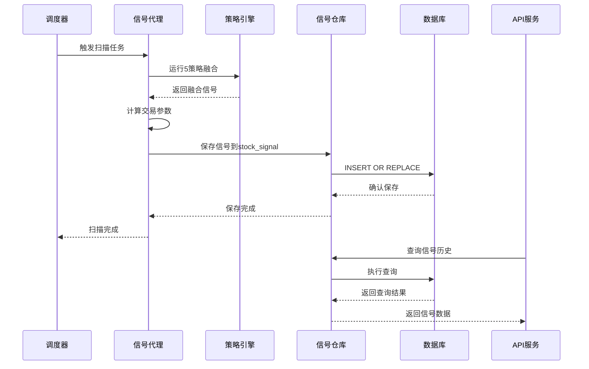
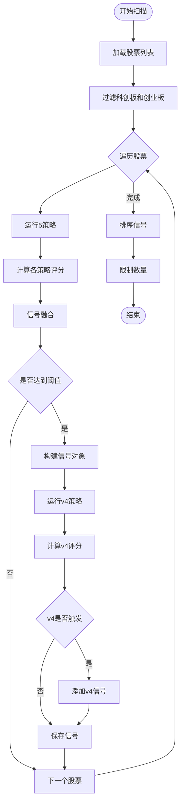
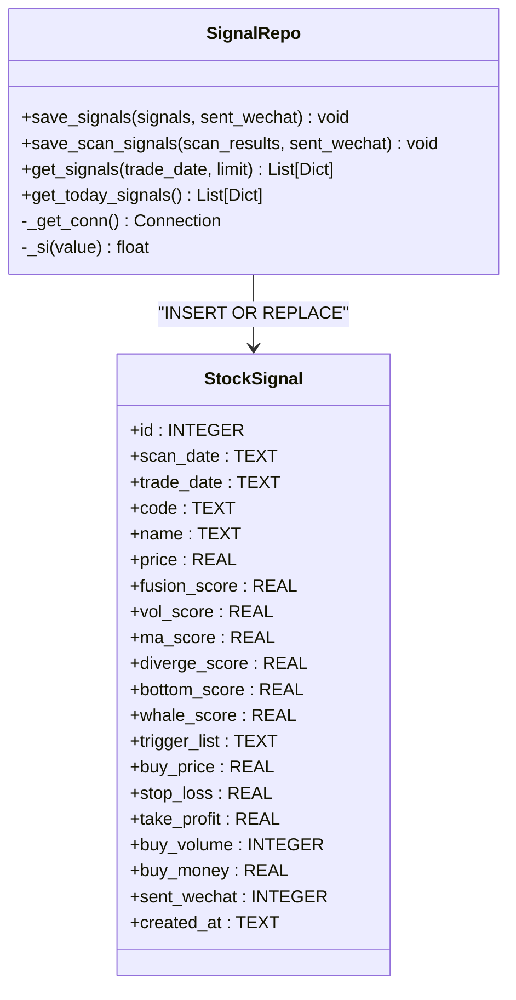
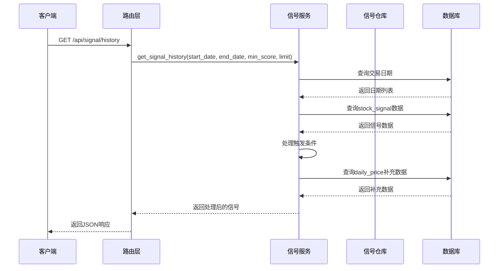
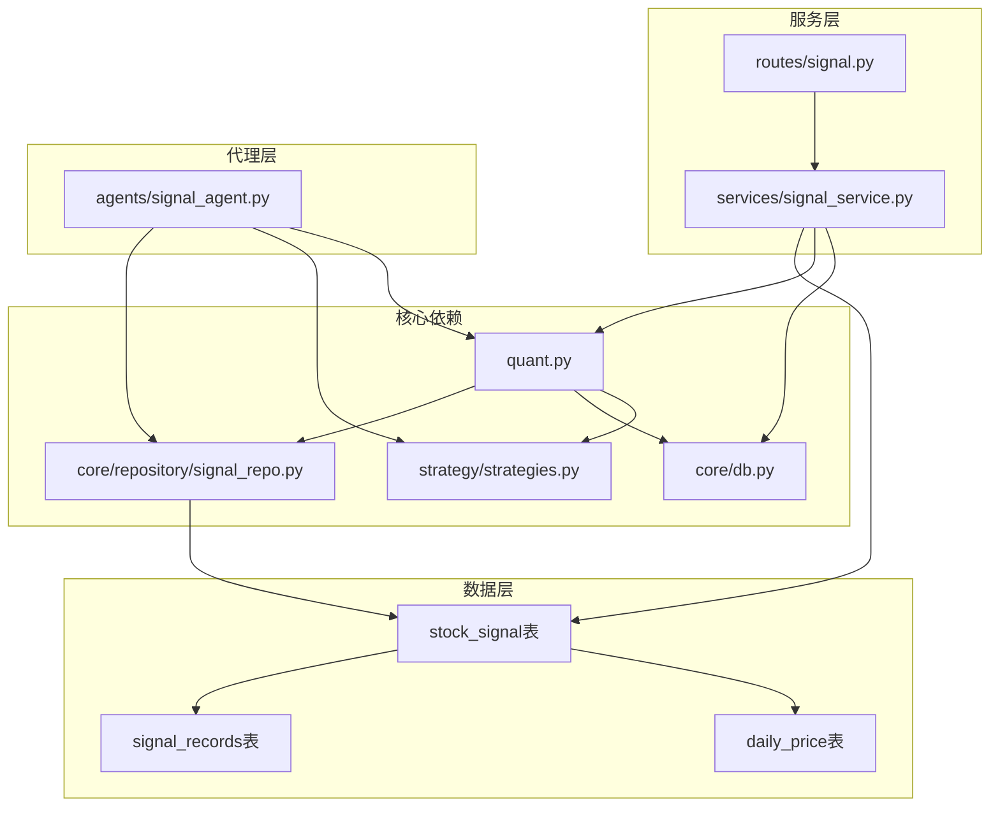

# 策略信号表

<cite>
**本文档引用的文件**
- [core/db.py](file://core/db.py)
- [core/repository/signal_repo.py](file://core/repository/signal_repo.py)
- [services/signal_service.py](file://services/signal_service.py)
- [routes/signal.py](file://routes/signal.py)
- [agents/signal_agent.py](file://agents/signal_agent.py)
- [strategy/strategies.py](file://strategy/strategies.py)
- [quant.py](file://quant.py)
</cite>

## 目录
1. [简介](#简介)
2. [项目结构](#项目结构)
3. [核心组件](#核心组件)
4. [架构概览](#架构概览)
5. [详细组件分析](#详细组件分析)
6. [依赖关系分析](#依赖关系分析)
7. [性能考虑](#性能考虑)
8. [故障排除指南](#故障排除指南)
9. [结论](#结论)

## 简介

AIQuant项目中的策略信号表(stock_signal)是一个关键的数据存储组件，专门用于存储策略扫描产生的推荐信号。该表设计用于支持多种量化策略的信号管理，包括传统的5策略融合扫描和新的v4超跌反弹策略。

stock_signal表的核心作用是：
- 存储每日策略扫描产生的股票推荐信号
- 提供信号历史查询和分析功能
- 支持不同策略类型的信号展示和比较
- 为交易决策提供数据支撑

## 项目结构

AIQuant项目采用模块化的架构设计，策略信号表相关的组件分布在多个层次：

**图表来源**
- [core/db.py:112-137](file://core/db.py#L112-L137)
- [core/repository/signal_repo.py:14-44](file://core/repository/signal_repo.py#L14-L44)
- [services/signal_service.py:12-243](file://services/signal_service.py#L12-L243)

**章节来源**
- [core/db.py:112-137](file://core/db.py#L112-L137)
- [core/repository/signal_repo.py:1-119](file://core/repository/signal_repo.py#L1-L119)

## 核心组件

### stock_signal表结构

stock_signal表是策略信号存储的核心，包含以下关键字段：

| 字段名 | 类型 | 描述 | 约束 |
|--------|------|------|------|
| id | INTEGER | 主键，自增 | PRIMARY KEY |
| scan_date | TEXT | 扫描日期 | NOT NULL, 索引 |
| trade_date | TEXT | 交易日期 | NOT NULL, 索引 |
| code | TEXT | 股票代码 | NOT NULL |
| name | TEXT | 股票名称 |  |
| price | REAL | 当前价格 |  |
| fusion_score | REAL | 融合评分 |  |
| vol_score | REAL | 量能评分 |  |
| ma_score | REAL | 均线评分 |  |
| diverge_score | REAL | 背离评分 |  |
| bottom_score | REAL | 底部评分 |  |
| whale_score | REAL | 主力评分 |  |
| trigger_list | TEXT | 触发条件列表(JSON) |  |
| buy_price | REAL | 买入价格 |  |
| stop_loss | REAL | 止损价 |  |
| take_profit | REAL | 止盈价 |  |
| buy_volume | INTEGER | 买入数量 |  |
| buy_money | REAL | 买入金额 |  |
| sent_wechat | INTEGER | 微信通知状态 | DEFAULT 0 |
| created_at | TEXT | 创建时间 |  |

### 唯一索引设计

为了确保数据完整性，stock_signal表采用了复合唯一索引：
- `(scan_date, code)`：确保同一天同一股票只有一条记录
- `trade_date`：便于按交易日期查询

**章节来源**
- [core/db.py:112-137](file://core/db.py#L112-L137)

## 架构概览

AIQuant的信号处理架构采用分层设计，从策略扫描到信号存储再到查询展示：

**图表来源**
- [agents/signal_agent.py:47-108](file://agents/signal_agent.py#L47-L108)
- [core/repository/signal_repo.py:46-99](file://core/repository/signal_repo.py#L46-L99)
- [services/signal_service.py:12-123](file://services/signal_service.py#L12-L123)

## 详细组件分析

### 信号生成流程

信号生成是整个系统的核心流程，涉及多个策略的协同工作：

**图表来源**
- [agents/signal_agent.py:47-108](file://agents/signal_agent.py#L47-L108)
- [quant.py:289-337](file://quant.py#L289-L337)

### 评分体系详解

AIQuant采用多维度评分体系，每个策略都有独立的评分标准：

#### 5策略融合评分

| 策略类型 | 评分范围 | 计算方法 | 触发阈值 |
|----------|----------|----------|----------|
| 放量突破 | 0-10分 | 量比×0.5 + 多头排列×0.5 + 3日涨幅×1.0 | ≥2.0 |
| 均线粘合 | 0-10分 | 粘合度×0.5 + 向上发散×0.5 + 量能稳定×1.0 | ≥1.0 |
| 量价背离 | 0-10分 | 底背离强度×0.5 + 反弹强度×0.5 + 趋势确认×1.0 | ≥1.0 |
| 抄底 | 0-10分 | 下跌深度×0.5 + 反弹强度×0.5 + 放量强度×1.0 | ≥1.0 |
| 主力建仓 | 0-10分 | 低位程度×0.5 + 放量程度×0.5 + 涨幅控制×1.0 | ≥1.0 |

#### 融合评分计算

融合评分采用加权平均算法：
- 各策略原始分(0-3) → 映射到(0-10)
- 加权求和：`融合分 = Σ(策略分_i × 权重_i) × (10/3) × 5`
- 最终融合分范围：0-50分
- 触发阈值：≥28.0分

#### v4超跌反弹评分

v4策略采用连续打分机制：
- 下跌深度：(-20日跌幅) × 0.25
- 站上MA5：(收盘价-MA5)/MA5 × 0.25  
- 温和放量：(3日均量/5日均量-1) × 0.25
- RSI区间：(RSI-35)/15 × 0.25
- 总分范围：0-4分，映射到0-50分
- 触发阈值：≥1.8分

**章节来源**
- [strategy/strategies.py:36-255](file://strategy/strategies.py#L36-L255)
- [strategy/strategies.py:281-360](file://strategy/strategies.py#L281-L360)
- [strategy/strategies.py:368-431](file://strategy/strategies.py#L368-L431)

### 数据访问层

数据访问层提供了完整的CRUD操作和查询功能：

#### 信号保存机制

**图表来源**
- [core/repository/signal_repo.py:14-44](file://core/repository/signal_repo.py#L14-L44)
- [core/repository/signal_repo.py:46-99](file://core/repository/signal_repo.py#L46-L99)

#### 信号查询服务

信号查询服务提供了灵活的查询接口：

**图表来源**
- [services/signal_service.py:12-123](file://services/signal_service.py#L12-L123)
- [routes/signal.py:12-27](file://routes/signal.py#L12-L27)

**章节来源**
- [core/repository/signal_repo.py:14-119](file://core/repository/signal_repo.py#L14-L119)
- [services/signal_service.py:12-243](file://services/signal_service.py#L12-L243)

## 依赖关系分析

AIQuant项目中各个组件之间的依赖关系如下：

**图表来源**
- [quant.py:23-35](file://quant.py#L23-L35)
- [agents/signal_agent.py:16-27](file://agents/signal_agent.py#L16-L27)
- [services/signal_service.py](file://services/signal_service.py#L9)

### 关键依赖点

1. **策略引擎依赖**：所有信号生成都依赖于策略引擎的计算结果
2. **数据库连接**：通过统一的连接管理器处理所有数据库操作
3. **配置管理**：策略参数和阈值通过全局变量集中管理
4. **API接口**：提供标准化的RESTful接口供前端调用

**章节来源**
- [quant.py:23-35](file://quant.py#L23-L35)
- [agents/signal_agent.py:16-27](file://agents/signal_agent.py#L16-L27)

## 性能考虑

### 数据库优化

1. **索引设计**：
   - 复合索引`(scan_date, code)`确保快速查询
   - `trade_date`索引支持按日期范围查询
   - WAL模式提升并发写入性能

2. **查询优化**：
   - 使用参数化查询防止SQL注入
   - 限制查询结果数量避免内存溢出
   - 分页查询支持大数据集处理

3. **数据类型选择**：
   - REAL类型用于浮点数评分
   - TEXT类型存储JSON格式的触发条件
   - INTEGER类型存储布尔值(0/1)

### 内存管理

1. **批量操作**：
   - 使用executemany进行批量插入
   - 分批处理大量数据避免内存峰值

2. **连接池**：
   - 统一的连接管理器确保连接复用
   - 自动事务管理和错误回滚

### 缓存策略

1. **策略结果缓存**：
   - 避免重复计算相同股票的策略结果
   - 支持强制重算模式

2. **查询结果缓存**：
   - 频繁查询的数据可以考虑缓存
   - 设置合理的缓存失效时间

## 故障排除指南

### 常见问题及解决方案

#### 1. 数据库连接问题

**症状**：操作数据库时报连接错误
**原因**：SQLite连接超时或数据库文件被其他进程占用
**解决方案**：
- 检查数据库文件权限
- 确保没有其他进程访问数据库
- 增加连接超时时间

#### 2. 策略计算异常

**症状**：某些股票无法生成信号
**原因**：数据缺失或计算异常
**解决方案**：
- 检查股票数据完整性
- 验证策略参数设置
- 查看具体异常堆栈信息

#### 3. API查询超时

**症状**：信号查询响应缓慢
**原因**：查询条件过于宽泛或数据量过大
**解决方案**：
- 限制查询日期范围
- 增加查询阈值
- 优化前端分页

#### 4. 数据不一致

**症状**：stock_signal表与其他表数据不匹配
**原因**：事务未正确提交或并发访问冲突
**解决方案**：
- 检查事务提交逻辑
- 确保唯一索引约束
- 实施适当的锁机制

**章节来源**
- [core/repository/signal_repo.py:14-44](file://core/repository/signal_repo.py#L14-L44)
- [services/signal_service.py:24-41](file://services/signal_service.py#L24-L41)

## 结论

AIQuant项目的策略信号表(stock_signal)设计合理，实现了以下目标：

1. **全面性**：支持多种策略类型的信号管理
2. **可扩展性**：模块化设计便于功能扩展
3. **高性能**：合理的索引设计和查询优化
4. **可靠性**：完善的错误处理和事务管理
5. **易用性**：清晰的API接口和数据结构

通过5策略融合和v4超跌反弹两种主要策略，系统能够为投资者提供多样化的投资建议。评分体系的设计既保证了信号质量，又便于用户理解和使用。

未来可以考虑的改进方向：
- 增加更多技术指标作为评分依据
- 实现信号回测验证功能
- 优化查询性能支持更大数据集
- 增强异常监控和告警机制