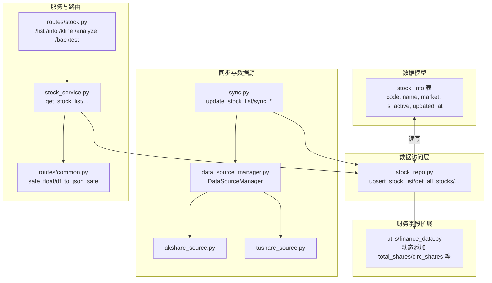
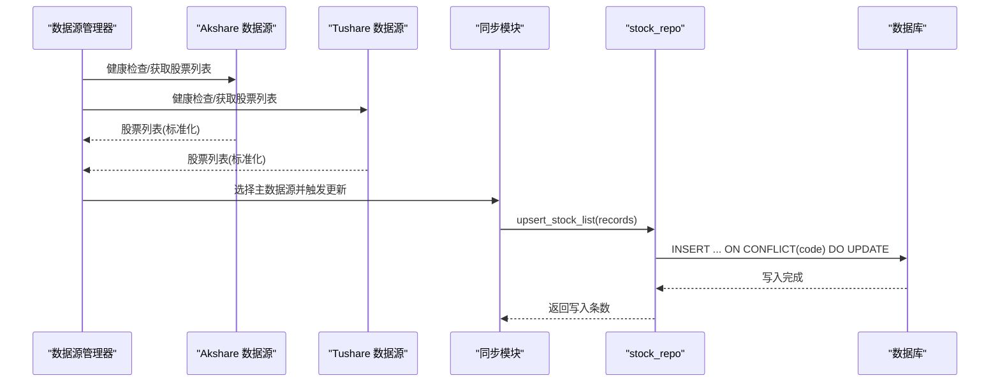
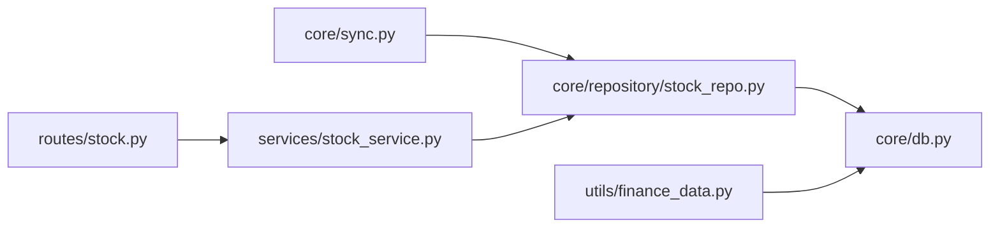

# 股票基本信息表

<cite>
**本文引用的文件**
- [core/db.py](file://core/db.py)
- [core/repository/stock_repo.py](file://core/repository/stock_repo.py)
- [core/sync.py](file://core/sync.py)
- [ministries/rites/data_source_manager.py](file://ministries/rites/data_source_manager.py)
- [ministries/rites/akshare_source.py](file://ministries/rites/akshare_source.py)
- [ministries/rites/tushare_source.py](file://ministries/rites/tushare_source.py)
- [services/stock_service.py](file://services/stock_service.py)
- [routes/stock.py](file://routes/stock.py)
- [routes/common.py](file://routes/common.py)
- [utils/finance_data.py](file://utils/finance_data.py)
</cite>

## 目录
1. [简介](#简介)
2. [项目结构](#项目结构)
3. [核心组件](#核心组件)
4. [架构总览](#架构总览)
5. [详细组件分析](#详细组件分析)
6. [依赖分析](#依赖分析)
7. [性能考虑](#性能考虑)
8. [故障排查指南](#故障排查指南)
9. [结论](#结论)
10. [附录](#附录)

## 简介
本文件面向“AIQuant”项目的股票基本信息表（stock_info），系统性说明其字段结构、命名规则、市场分类、数据来源与更新流程、质量保障机制，并提供股票列表查询、状态管理与批量更新的API使用示例与最佳实践。

## 项目结构
围绕 stock_info 的关键代码分布在以下模块：
- 数据库定义与迁移：core/db.py
- 数据访问层（Repository）：core/repository/stock_repo.py
- 数据同步与入库：core/sync.py
- 数据源管理与适配：ministries/rites/data_source_manager.py、akshare_source.py、tushare_source.py
- 服务层与API路由：services/stock_service.py、routes/stock.py
- 通用工具：routes/common.py
- 财务字段扩展：utils/finance_data.py

图表来源
- [core/db.py:62-69](file://core/db.py#L62-L69)
- [core/repository/stock_repo.py:13-79](file://core/repository/stock_repo.py#L13-L79)
- [core/sync.py:136-176](file://core/sync.py#L136-L176)
- [ministries/rites/data_source_manager.py:111-178](file://ministries/rites/data_source_manager.py#L111-L178)
- [services/stock_service.py:23-45](file://services/stock_service.py#L23-L45)
- [routes/stock.py:27-87](file://routes/stock.py#L27-L87)
- [utils/finance_data.py:51-81](file://utils/finance_data.py#L51-L81)

章节来源
- [core/db.py:62-69](file://core/db.py#L62-L69)
- [core/repository/stock_repo.py:13-79](file://core/repository/stock_repo.py#L13-L79)
- [core/sync.py:136-176](file://core/sync.py#L136-L176)
- [ministries/rites/data_source_manager.py:111-178](file://ministries/rites/data_source_manager.py#L111-L178)
- [services/stock_service.py:23-45](file://services/stock_service.py#L23-L45)
- [routes/stock.py:27-87](file://routes/stock.py#L27-L87)
- [utils/finance_data.py:51-81](file://utils/finance_data.py#L51-L81)

## 核心组件
- stock_info 表：存储股票基础信息，主键为 code；包含 name、market、is_active、updated_at 等字段。
- Repository 层（stock_repo.py）：封装 upsert_stock_list、批量市值更新、查询活跃股票、按代码查名称等操作。
- 同步模块（sync.py）：负责从 akshare 拉取股票列表并写入 stock_info，过滤 ST/退市/北交所等不支持或不合规标的。
- 数据源管理（data_source_manager.py、akshare_source.py、tushare_source.py）：统一抽象数据源接口，提供健康检查与数据获取能力。
- 服务与路由（services/stock_service.py、routes/stock.py）：对外提供股票列表、K线、分析、回测等接口。
- 财务字段扩展（utils/finance_data.py）：按需为 stock_info 动态添加 total_shares、circ_shares 等财务字段。

章节来源
- [core/db.py:62-69](file://core/db.py#L62-L69)
- [core/repository/stock_repo.py:13-79](file://core/repository/stock_repo.py#L13-L79)
- [core/sync.py:136-176](file://core/sync.py#L136-L176)
- [ministries/rites/data_source_manager.py:111-178](file://ministries/rites/data_source_manager.py#L111-L178)
- [services/stock_service.py:23-45](file://services/stock_service.py#L23-L45)
- [routes/stock.py:27-87](file://routes/stock.py#L27-L87)
- [utils/finance_data.py:51-81](file://utils/finance_data.py#L51-L81)

## 架构总览
下图展示 stock_info 的数据流：数据源经由数据源管理器选择与健康检查，同步模块负责拉取与入库，Repository 提供统一访问接口，服务层与路由层对外提供查询与分析能力。

图表来源
- [ministries/rites/data_source_manager.py:111-178](file://ministries/rites/data_source_manager.py#L111-L178)
- [ministries/rites/akshare_source.py:83-99](file://ministries/rites/akshare_source.py#L83-L99)
- [ministries/rites/tushare_source.py:105-126](file://ministries/rites/tushare_source.py#L105-L126)
- [core/sync.py:136-176](file://core/sync.py#L136-L176)
- [core/repository/stock_repo.py:13-28](file://core/repository/stock_repo.py#L13-L28)

## 详细组件分析

### 字段结构与语义
- code（股票代码）
  - 类型：TEXT（主键）
  - 说明：唯一标识股票。同步模块会将 akshare 的“代码”标准化写入。
  - 示例路径：[core/sync.py:152-169](file://core/sync.py#L152-L169)
- name（股票名称）
  - 类型：TEXT（NOT NULL）
  - 说明：股票中文简称。同步模块会将 akshare 的“名称”标准化写入。
  - 示例路径：[core/sync.py:152-169](file://core/sync.py#L152-L169)
- market（所属市场）
  - 类型：TEXT
  - 说明：上交所（SH）、深交所（SZ）。同步模块根据代码前缀自动标注。
  - 示例路径：[core/sync.py:158](file://core/sync.py#L158)
- is_active（是否活跃）
  - 类型：INTEGER（默认 1）
  - 说明：是否参与活跃筛选。Repository 查询活跃股票时默认仅返回 is_active=1 的记录。
  - 示例路径：[core/repository/stock_repo.py:62-70](file://core/repository/stock_repo.py#L62-L70)
- updated_at（更新时间）
  - 类型：TEXT
  - 说明：入库时写入当前时间戳，便于追踪数据新鲜度。
  - 示例路径：[core/repository/stock_repo.py:18](file://core/repository/stock_repo.py#L18)

章节来源
- [core/db.py:62-69](file://core/db.py#L62-L69)
- [core/repository/stock_repo.py:62-79](file://core/repository/stock_repo.py#L62-L79)
- [core/sync.py:152-169](file://core/sync.py#L152-L169)

### 股票代码命名规则与市场分类标准
- 代码来源：来自 akshare 的股票列表接口，字段标准化为 code、name。
- 市场分类：
  - 上交所（SH）：以 600/601/603/605/688/689 开头的代码
  - 深交所（SZ）：以 000/001/002/003/300/301 开头的代码
  - 北交所（BJ）：以 430/830/870/920 开头的代码（同步模块明确跳过）
- 代码格式转换：同步模块提供将 akshare 代码转换为 baostock 格式（含交易所前缀）的辅助逻辑，但 stock_info 仅存储纯数字 code 与 market 分类。
- 示例路径：
  - [core/sync.py:158](file://core/sync.py#L158)
  - [core/sync.py:181-214](file://core/sync.py#L181-L214)

章节来源
- [core/sync.py:158-169](file://core/sync.py#L158-L169)
- [core/sync.py:181-214](file://core/sync.py#L181-L214)

### 股票信息的获取方式、更新频率与数据质量保证
- 获取方式
  - 从 akshare 拉取股票列表并写入 stock_info：update_stock_list
  - 通过 Repository 查询活跃股票列表：get_all_stocks(active_only=True)
  - 通过服务层组合行情与评分：get_stock_list
- 更新频率
  - 股票列表：首次初始化或手动触发
  - 日常行情：每日增量同步（见 daily_sync），并计算策略评分批量写入
- 数据质量保证
  - 数据源健康检查：Local/Akshare/Tushare 均提供 check_health
  - 过滤规则：跳过 ST、退市、北交所（因 baostock 不支持）
  - 唯一键约束：INSERT ... ON CONFLICT(code) DO UPDATE，避免重复与脏数据
  - 财务字段按需扩展：utils/finance_data.py 在首次使用时自动添加 total_shares、circ_shares 等列
- 示例路径：
  - [core/sync.py:136-176](file://core/sync.py#L136-L176)
  - [core/repository/stock_repo.py:62-70](file://core/repository/stock_repo.py#L62-L70)
  - [ministries/rites/data_source_manager.py:111-178](file://ministries/rites/data_source_manager.py#L111-L178)
  - [utils/finance_data.py:51-81](file://utils/finance_data.py#L51-L81)

章节来源
- [core/sync.py:136-176](file://core/sync.py#L136-L176)
- [core/repository/stock_repo.py:62-70](file://core/repository/stock_repo.py#L62-L70)
- [ministries/rites/data_source_manager.py:111-178](file://ministries/rites/data_source_manager.py#L111-L178)
- [utils/finance_data.py:51-81](file://utils/finance_data.py#L51-L81)

### API 使用示例（股票列表查询、状态管理、批量更新）

- 股票列表查询
  - 路由：GET /stock/list
  - 参数：with_score（是否包含融合评分）
  - 返回：包含 stocks（code/name/market/trade_date/价格/成交量/评分等）与 trade_date
  - 示例路径：
    - [routes/stock.py:27-34](file://routes/stock.py#L27-L34)
    - [services/stock_service.py:23-45](file://services/stock_service.py#L23-L45)
- 单只股票信息
  - 路由：GET /stock/info
  - 参数：symbol（股票代码）
  - 返回：info（来自服务层聚合）
  - 示例路径：
    - [routes/stock.py:67-72](file://routes/stock.py#L67-L72)
- K线数据
  - 路由：GET /stock/kline
  - 参数：code、start_date、end_date
  - 返回：按日期排序的 K 线数组
  - 示例路径：
    - [routes/stock.py:37-50](file://routes/stock.py#L37-L50)
    - [services/stock_service.py:48-67](file://services/stock_service.py#L48-L67)
- 股票分析与回测
  - 路由：GET /stock/analyze 与 GET /stock/backtest
  - 参数：symbol、start_date、strategy、capital
  - 返回：K线、指标、买卖信号、回测指标等
  - 示例路径：
    - [routes/stock.py:53-87](file://routes/stock.py#L53-L87)
    - [services/stock_service.py:70-126](file://services/stock_service.py#L70-L126)
    - [services/stock_service.py:146-193](file://services/stock_service.py#L146-L193)

- 状态管理（活跃状态）
  - 查询活跃股票：get_all_stocks(active_only=True) 会自动过滤 is_active=1
  - 示例路径：
    - [core/repository/stock_repo.py:62-70](file://core/repository/stock_repo.py#L62-L70)

- 批量更新（股票列表）
  - 同步入口：update_stock_list
  - 写入逻辑：upsert_stock_list（INSERT ... ON CONFLICT(code) DO UPDATE）
  - 示例路径：
    - [core/sync.py:136-176](file://core/sync.py#L136-L176)
    - [core/repository/stock_repo.py:13-28](file://core/repository/stock_repo.py#L13-L28)

- 批量市值更新（可选财务字段）
  - 同步入口：sync_market_cap
  - 写入逻辑：batch_update_market_cap（批量 UPDATE）
  - 示例路径：
    - [core/sync.py:715-728](file://core/sync.py#L715-L728)
    - [core/repository/stock_repo.py:40-50](file://core/repository/stock_repo.py#L40-L50)

章节来源
- [routes/stock.py:27-87](file://routes/stock.py#L27-L87)
- [services/stock_service.py:23-45](file://services/stock_service.py#L23-L45)
- [services/stock_service.py:48-67](file://services/stock_service.py#L48-L67)
- [services/stock_service.py:70-126](file://services/stock_service.py#L70-L126)
- [services/stock_service.py:146-193](file://services/stock_service.py#L146-L193)
- [core/repository/stock_repo.py:13-28](file://core/repository/stock_repo.py#L13-L28)
- [core/repository/stock_repo.py:40-50](file://core/repository/stock_repo.py#L40-L50)
- [core/sync.py:136-176](file://core/sync.py#L136-L176)
- [core/sync.py:715-728](file://core/sync.py#L715-L728)

## 依赖分析
- 表结构依赖：stock_info 作为其他表（daily_price、stock_signal 等）的上游基础表，被 join 或外键关联。
- 模块耦合：
  - sync.py 依赖 akshare/tushare 与 stock_repo
  - stock_repo 依赖 core.db 的连接与事务
  - services/stock_service.py 依赖 core.data_fetcher 与 core.db
  - routes/stock.py 依赖 services/stock_service 与 core.data_fetcher
- 外部依赖：
  - akshare、baostock、tushare（数据源）
  - sqlite（存储）

图表来源
- [core/sync.py:17-21](file://core/sync.py#L17-L21)
- [core/repository/stock_repo.py:8-10](file://core/repository/stock_repo.py#L8-L10)
- [services/stock_service.py:7-9](file://services/stock_service.py#L7-L9)
- [routes/stock.py:9-10](file://routes/stock.py#L9-L10)
- [utils/finance_data.py:42-48](file://utils/finance_data.py#L42-L48)

章节来源
- [core/sync.py:17-21](file://core/sync.py#L17-L21)
- [core/repository/stock_repo.py:8-10](file://core/repository/stock_repo.py#L8-L10)
- [services/stock_service.py:7-9](file://services/stock_service.py#L7-L9)
- [routes/stock.py:9-10](file://routes/stock.py#L9-L10)
- [utils/finance_data.py:42-48](file://utils/finance_data.py#L42-L48)

## 性能考虑
- 批量写入：upsert_stock_list 使用 executemany + ON CONFLICT，减少往返次数，提升吞吐。
- 查询优化：get_all_stocks 支持 active_only 并按 code 排序，适合前端分页与筛选。
- 数据源选择：Local 作为主数据源，Akshare/Tushare 作为备选，提高可用性与稳定性。
- 断点续传：daily_sync 支持缓存已同步股票集合，避免重复抓取。
- 财务字段惰性扩展：仅在需要时添加列，避免不必要的 DDL。

章节来源
- [core/repository/stock_repo.py:13-28](file://core/repository/stock_repo.py#L13-L28)
- [core/repository/stock_repo.py:62-70](file://core/repository/stock_repo.py#L62-L70)
- [ministries/rites/data_source_manager.py:111-178](file://ministries/rites/data_source_manager.py#L111-L178)
- [core/sync.py:422-460](file://core/sync.py#L422-L460)
- [utils/finance_data.py:51-81](file://utils/finance_data.py#L51-L81)

## 故障排查指南
- 股票列表为空
  - 检查 update_stock_list 是否成功执行
  - 确认 akshare 接口可用与过滤规则（ST/退市/北交所）
  - 示例路径：
    - [core/sync.py:136-176](file://core/sync.py#L136-L176)
- 查询不到股票
  - 确认 code 是否为纯数字且符合 market 分类规则
  - 使用 get_stock_name 回退逻辑（不存在返回 code）
  - 示例路径：
    - [core/repository/stock_repo.py:73-79](file://core/repository/stock_repo.py#L73-L79)
- 数据源不可用
  - 使用 DataSourceManager.health_check_all 查看各数据源状态
  - 切换主数据源或启用备用数据源
  - 示例路径：
    - [ministries/rites/data_source_manager.py:136-151](file://ministries/rites/data_source_manager.py#L136-L151)
- K线或分析接口报错
  - 检查 start_date/end_date 格式与 trade_date 最新日期
  - 使用 routes/common.safe_float 做数值清洗
  - 示例路径：
    - [routes/stock.py:37-50](file://routes/stock.py#L37-L50)
    - [routes/common.py:9-19](file://routes/common.py#L9-L19)

章节来源
- [core/sync.py:136-176](file://core/sync.py#L136-L176)
- [core/repository/stock_repo.py:73-79](file://core/repository/stock_repo.py#L73-L79)
- [ministries/rites/data_source_manager.py:136-151](file://ministries/rites/data_source_manager.py#L136-L151)
- [routes/stock.py:37-50](file://routes/stock.py#L37-L50)
- [routes/common.py:9-19](file://routes/common.py#L9-L19)

## 结论
stock_info 作为 AIQuant 的核心基础表，通过清晰的字段设计、严格的过滤与去重策略、以及多数据源的健康检查与降级机制，实现了稳定可靠的股票基础信息管理。结合 Repository、服务层与路由层的分层设计，既满足了查询与分析需求，也为后续扩展（如财务字段）提供了良好的演进空间。

## 附录

### 字段定义一览
- code：TEXT（主键）
- name：TEXT（NOT NULL）
- market：TEXT
- is_active：INTEGER（默认 1）
- updated_at：TEXT
- total_shares：REAL（按需扩展）
- circ_shares：REAL（按需扩展）
- 其他财务字段：eps、pe_ttm、pb（按需扩展）

章节来源
- [core/db.py:62-69](file://core/db.py#L62-L69)
- [utils/finance_data.py:51-81](file://utils/finance_data.py#L51-L81)