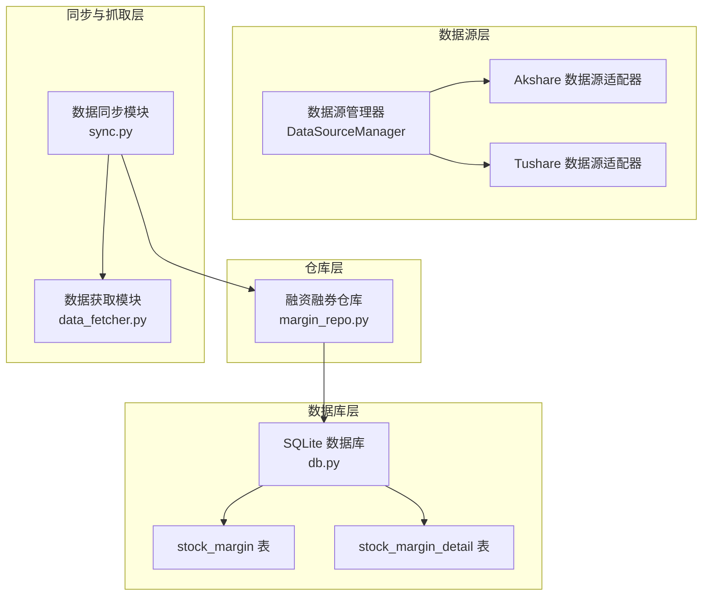
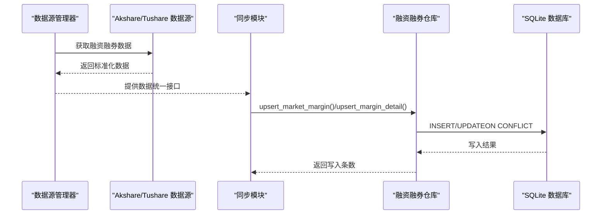
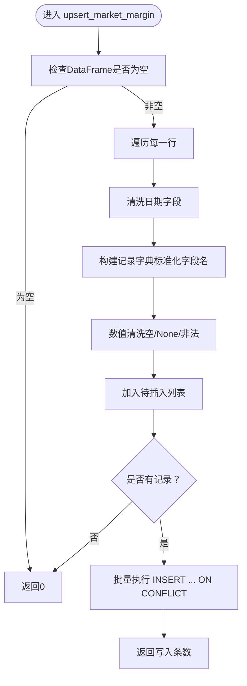
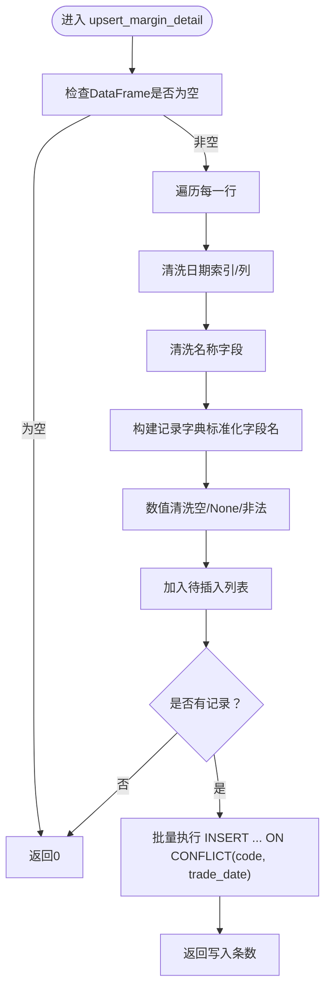
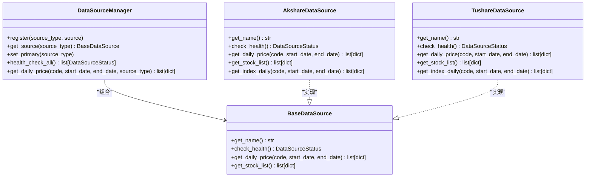
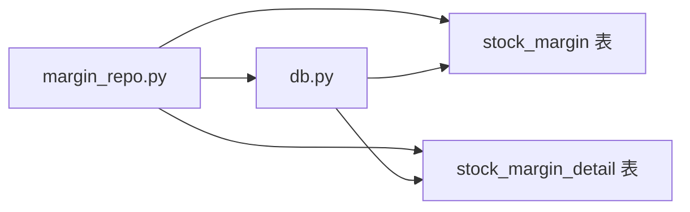
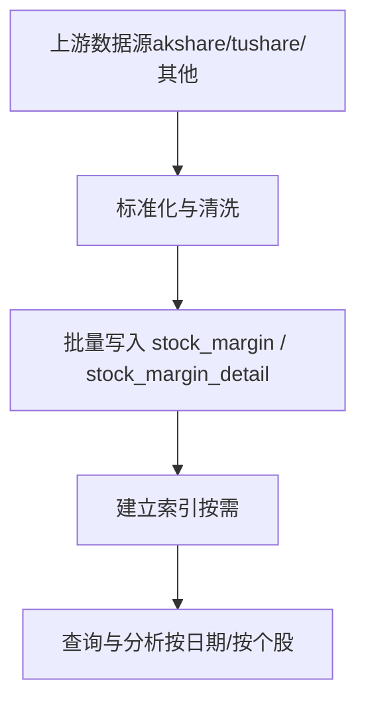

# 融资融券数据表

<cite>
**本文引用的文件**
- [margin_repo.py](file://core/repository/margin_repo.py)
- [db.py](file://core/db.py)
- [data_source_manager.py](file://ministries/rites/data_source_manager.py)
- [akshare_source.py](file://ministries/rites/akshare_source.py)
- [tushare_source.py](file://ministries/rites/tushare_source.py)
- [sync.py](file://core/sync.py)
- [data_fetcher.py](file://core/data_fetcher.py)
</cite>

## 目录
1. [简介](#简介)
2. [项目结构](#项目结构)
3. [核心组件](#核心组件)
4. [架构概览](#架构概览)
5. [详细组件分析](#详细组件分析)
6. [依赖分析](#依赖分析)
7. [性能考虑](#性能考虑)
8. [故障排查指南](#故障排查指南)
9. [结论](#结论)
10. [附录](#附录)

## 简介
本文件面向AIQuant项目的融资融券数据表，系统性说明“stock_margin（全市场融资融券汇总）”和“stock_margin_detail（个股融资融券明细）”两张表的结构设计、字段含义、数据来源与处理流程，并提供分析与应用示例，帮助开发者与使用者高效理解与使用该数据体系。

## 项目结构
围绕融资融券数据的关键文件与职责如下：
- 数据库层：负责表结构定义与连接管理
- 仓库层：封装对数据库的写入、查询与更新逻辑
- 数据源层：提供统一的数据源抽象与具体实现（akshare、tushare等）
- 同步与抓取层：负责增量/历史数据的拉取与入库
- 应用层：策略、回测、风控等模块可直接读取这些数据

图表来源
- [margin_repo.py:1-186](file://core/repository/margin_repo.py#L1-L186)
- [db.py:225-263](file://core/db.py#L225-L263)
- [data_source_manager.py:111-190](file://ministries/rites/data_source_manager.py#L111-L190)
- [akshare_source.py:15-135](file://ministries/rites/akshare_source.py#L15-L135)
- [tushare_source.py:16-167](file://ministries/rites/tushare_source.py#L16-L167)
- [sync.py:1-760](file://core/sync.py#L1-L760)
- [data_fetcher.py:1-578](file://core/data_fetcher.py#L1-L578)

章节来源
- [margin_repo.py:1-186](file://core/repository/margin_repo.py#L1-L186)
- [db.py:225-263](file://core/db.py#L225-L263)

## 核心组件
- stock_margin（全市场融资融券汇总）
  - 用途：记录每日全市场的融资融券总体规模与结构，便于宏观视角分析市场杠杆行为与风险偏好。
  - 关键字段：交易日期、上交所/深交所融资余额、融资买入额、融券余量、融券卖出量、深市融资融券比例、两市合计指标等。
- stock_margin_detail（个股融资融券明细）
  - 用途：记录个股每日的融资融券分项数据，支持个股层面的因子构建与策略回测。
  - 关键字段：股票代码、交易日期、名称、交易所、融资余额、融资买入额、融资偿还额、融券余量、融券卖出量、融券偿还量、融券余额、融资融券余额等。

章节来源
- [margin_repo.py:27-110](file://core/repository/margin_repo.py#L27-L110)
- [margin_repo.py:112-186](file://core/repository/margin_repo.py#L112-L186)
- [db.py:225-263](file://core/db.py#L225-L263)

## 架构概览
下图展示从数据源到数据库再到应用层的整体流程，以及融资融券数据在系统中的位置与交互关系。

图表来源
- [data_source_manager.py:111-190](file://ministries/rites/data_source_manager.py#L111-L190)
- [akshare_source.py:15-135](file://ministries/rites/akshare_source.py#L15-L135)
- [tushare_source.py:16-167](file://ministries/rites/tushare_source.py#L16-L167)
- [sync.py:1-760](file://core/sync.py#L1-L760)
- [margin_repo.py:27-186](file://core/repository/margin_repo.py#L27-L186)
- [db.py:225-263](file://core/db.py#L225-L263)

## 详细组件分析

### stock_margin（全市场融资融券汇总）
- 表结构与索引
  - 主键自增id；唯一约束trade_date；索引idx_margin_date(trade_date)。
  - 字段包括：上交所/深交所融资余额、融资买入额、融券余量、融券卖出量、深市融资融券比例、两市合计指标等。
- 写入逻辑
  - upsert_market_margin(df)：将DataFrame标准化后批量写入，遇到重复trade_date时按字段逐一更新。
  - 日期清洗：支持多种输入格式（YYYYMMDD、YYYY-MM-DD、datetime对象等），统一转为YYYY-MM-DD。
  - 数值清洗：将空字符串、连字符、None等视为缺失值，其余尝试转浮点数。
- 查询逻辑
  - get_market_margin(start_date, end_date)：按日期范围查询并返回以trade_date为索引的DataFrame。
  - get_latest_margin_date()：查询最新交易日。

图表来源
- [margin_repo.py:27-81](file://core/repository/margin_repo.py#L27-L81)

章节来源
- [margin_repo.py:27-110](file://core/repository/margin_repo.py#L27-L110)
- [db.py:225-244](file://core/db.py#L225-L244)

### stock_margin_detail（个股融资融券明细）
- 表结构与索引
  - 主键自增id；唯一约束(code, trade_date)；索引idx_md_code_date(code, trade_date)。
  - 字段包括：股票代码、名称、交易所、融资余额、融资买入额、融资偿还额、融券余量、融券卖出量、融券偿还量、融券余额、融资融券余额等。
- 写入逻辑
  - upsert_margin_detail(code, df, exchange)：按个股维度批量写入明细数据，重复时更新除code/trade_date外的字段。
  - 日期与名称清洗：支持多种索引/列名（trade_date、信用交易日期、日期、name、证券简称、标的证券简称等）。
- 查询逻辑
  - get_margin_detail(code, start_date, end_date)：按个股与日期范围查询，返回以trade_date为索引的DataFrame。

图表来源
- [margin_repo.py:112-162](file://core/repository/margin_repo.py#L112-L162)

章节来源
- [margin_repo.py:112-186](file://core/repository/margin_repo.py#L112-L186)
- [db.py:246-263](file://core/db.py#L246-L263)

### 数据源与统一接口
- 数据源抽象
  - BaseDataSource定义了统一接口：名称、健康检查、日线数据获取、股票列表获取等。
  - DataSourceManager负责注册与选择数据源，支持主备切换与健康检查。
- 具体实现
  - AkshareDataSource：通过akshare获取A股行情与指数数据，提供健康检查与标准化列名。
  - TushareDataSource：通过tushare获取A股行情与指数数据，提供健康检查与标准化列名。
- 在融资融券场景中的作用
  - 当前仓库层未直接依赖上述数据源，而是通过上层同步模块或外部脚本进行数据采集与入库。数据源层为未来扩展提供统一抽象。

图表来源
- [data_source_manager.py:48-190](file://ministries/rites/data_source_manager.py#L48-L190)
- [akshare_source.py:15-135](file://ministries/rites/akshare_source.py#L15-L135)
- [tushare_source.py:16-167](file://ministries/rites/tushare_source.py#L16-L167)

章节来源
- [data_source_manager.py:1-190](file://ministries/rites/data_source_manager.py#L1-L190)
- [akshare_source.py:1-135](file://ministries/rites/akshare_source.py#L1-L135)
- [tushare_source.py:1-167](file://ministries/rites/tushare_source.py#L1-L167)

### 数据同步与抓取
- 同步模块
  - 提供历史初始化与每日增量同步能力，支持断点续传与缓存。
  - 与数据库层配合，维护行情、指数、信号等多类数据。
- 数据获取模块
  - 提供baostock为主、akshare为备的多接口降级机制，保证稳定性。
  - 为上层提供统一的公开接口，如获取历史行情、股票列表、指数数据等。

章节来源
- [sync.py:1-760](file://core/sync.py#L1-L760)
- [data_fetcher.py:1-578](file://core/data_fetcher.py#L1-L578)

## 依赖分析
- 仓库层依赖数据库层
  - 通过core/db.py提供的连接管理与建表脚本，确保表结构一致与事务安全。
- 仓库层与数据源层解耦
  - 仓库层不直接依赖具体数据源，便于替换与扩展。
- 查询与索引
  - stock_margin按trade_date建立唯一索引与普通索引，适合按日期范围查询。
  - stock_margin_detail按(code, trade_date)建立唯一索引，适合个股维度查询。

图表来源
- [margin_repo.py:1-186](file://core/repository/margin_repo.py#L1-L186)
- [db.py:225-263](file://core/db.py#L225-L263)

章节来源
- [margin_repo.py:1-186](file://core/repository/margin_repo.py#L1-L186)
- [db.py:225-263](file://core/db.py#L225-L263)

## 性能考虑
- 批量写入
  - 使用executemany与ON CONFLICT更新，减少往返次数，提升入库效率。
- 索引设计
  - stock_margin：按trade_date建立索引，加速按日期范围查询。
  - stock_margin_detail：按(code, trade_date)建立唯一索引，避免重复写入并加速按个股查询。
- 数据清洗
  - 数值清洗与日期格式化在入库前完成，避免后续查询阶段的额外处理。
- 并发与事务
  - 通过上下文管理器确保事务提交/回滚与连接关闭，保障一致性与资源释放。

## 故障排查指南
- 常见问题
  - 日期格式不一致：确保传入trade_date为YYYY-MM-DD或可解析的8位数字格式。
  - 数值异常：空字符串、连字符、None会被清洗为NULL；非法字符将导致转换失败。
  - 重复键冲突：stock_margin唯一约束trade_date；stock_margin_detail唯一约束(code, trade_date)。
- 定位方法
  - 使用get_latest_margin_date()确认最新入库日期。
  - 使用get_market_margin()/get_margin_detail()按日期范围验证数据完整性。
  - 检查数据库连接与权限，确保INSERT/UPDATE语句可执行。

章节来源
- [margin_repo.py:83-110](file://core/repository/margin_repo.py#L83-L110)
- [margin_repo.py:165-186](file://core/repository/margin_repo.py#L165-L186)

## 结论
AIQuant的融资融券数据表采用清晰的分层设计：数据源层提供统一抽象与多接口降级，仓库层负责标准化与入库，数据库层提供稳定的表结构与索引。stock_margin与stock_margin_detail分别满足宏观与微观两个维度的分析需求，具备良好的扩展性与可维护性。

## 附录

### 字段含义与命名对照（汇总表）
- trade_date：交易日期（YYYY-MM-DD）
- sse_margin_balance：上交所融资余额
- sse_margin_buy：上交所融资买入
- sse_short_balance：上交所融券余量
- sse_short_volume：上交所融券卖出
- szse_margin_balance：深交所融资余额
- szse_margin_buy：深交所融资买入
- szse_short_balance：深交所融券余量
- szse_short_volume：深交所融券卖出
- szse_margin_ratio：深市融资融券比例
- total_margin_balance：两市融资余额合计
- total_margin_buy：两市融资买入额
- total_short_balance：两市融券余量合计
- total_margin：两市融资融券余额合计

章节来源
- [db.py:225-244](file://core/db.py#L225-L244)
- [margin_repo.py:27-81](file://core/repository/margin_repo.py#L27-L81)

### 字段含义与命名对照（明细表）
- code：股票代码
- trade_date：交易日期（YYYY-MM-DD）
- name：股票名称
- exchange：交易所（如SZ）
- margin_balance：融资余额
- margin_buy：融资买入额
- margin_repay：融资偿还额
- short_volume：融券余量
- short_sell：融券卖出量
- short_repay：融券偿还量
- short_balance：融券余额
- total_balance：融资融券余额

章节来源
- [db.py:246-263](file://core/db.py#L246-L263)
- [margin_repo.py:112-162](file://core/repository/margin_repo.py#L112-L162)

### 数据来源与处理流程（概念示意）
- 数据来源：可通过数据源管理器对接akshare、tushare等，或由上层脚本/同步模块拉取。
- 处理流程：标准化列名与日期格式，数值清洗，批量写入数据库，按需建立索引。
- 应用方式：按日期范围查询汇总表进行宏观分析；按个股查询明细表进行因子构建与回测。

[此图为概念示意，不对应具体文件]