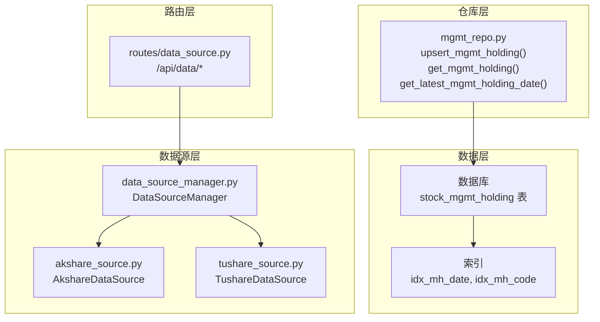
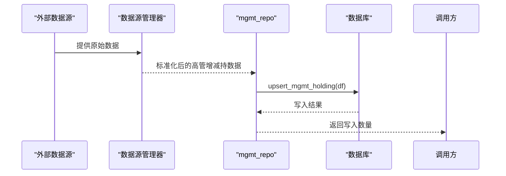
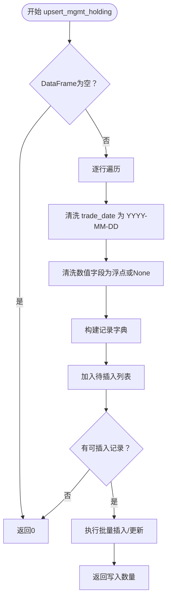
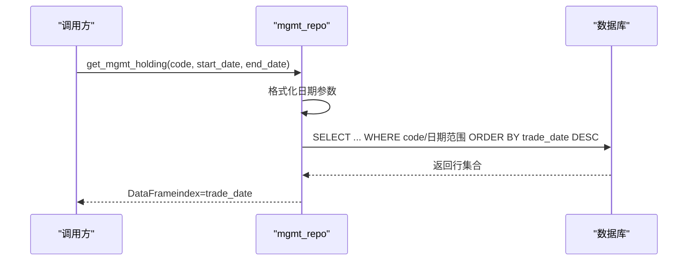
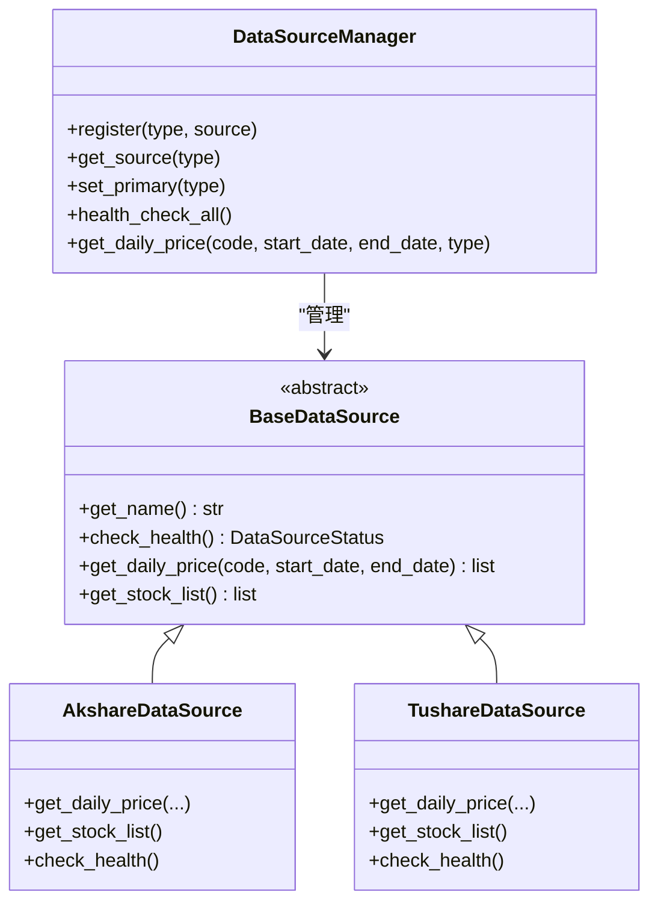
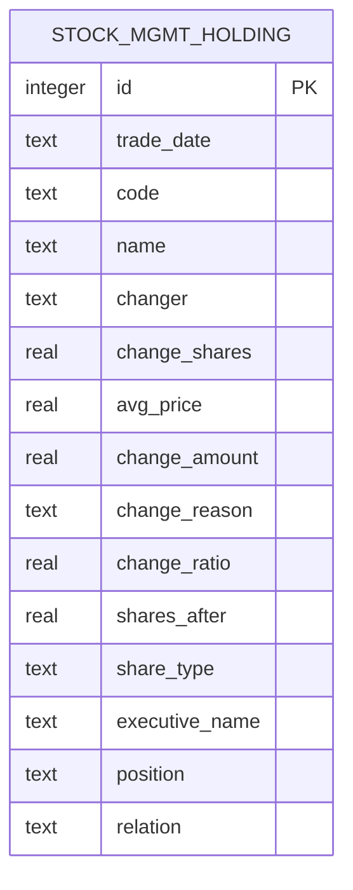

# 高管增减持数据表

<cite>
**本文引用的文件**
- [core/db.py](file://core/db.py)
- [core/repository/mgmt_repo.py](file://core/repository/mgmt_repo.py)
- [ministries/rites/data_source_manager.py](file://ministries/rites/data_source_manager.py)
- [ministries/rites/akshare_source.py](file://ministries/rites/akshare_source.py)
- [ministries/rites/tushare_source.py](file://ministries/rites/tushare_source.py)
- [routes/data_source.py](file://routes/data_source.py)
</cite>

## 目录
1. [简介](#简介)
2. [项目结构](#项目结构)
3. [核心组件](#核心组件)
4. [架构概览](#架构概览)
5. [详细组件分析](#详细组件分析)
6. [依赖分析](#依赖分析)
7. [性能考虑](#性能考虑)
8. [故障排查指南](#故障排查指南)
9. [结论](#结论)
10. [附录](#附录)

## 简介
本文件面向AIQuant系统中的“高管增减持数据表”（stock_mgmt_holding），系统性说明该表的用途、字段含义、数据来源与处理流程、查询接口以及与股价关系的分析方法。该表用于存储上市公司高管在特定交易日对所持股份进行增持或减持的详细记录，是量化研究与风控体系中重要的内生信号来源。

## 项目结构
与高管增减持数据表直接相关的代码分布在以下模块：
- 数据库定义与索引：core/db.py
- 数据写入与查询仓库层：core/repository/mgmt_repo.py
- 数据源管理与适配：ministries/rites/data_source_manager.py、ministries/rites/akshare_source.py、ministries/rites/tushare_source.py
- API路由示例（数据源健康检查与切换）：routes/data_source.py

图表来源
- [core/db.py:336-356](file://core/db.py#L336-L356)
- [core/repository/mgmt_repo.py:27-102](file://core/repository/mgmt_repo.py#L27-L102)
- [ministries/rites/data_source_manager.py:111-189](file://ministries/rites/data_source_manager.py#L111-L189)
- [ministries/rites/akshare_source.py:15-135](file://ministries/rites/akshare_source.py#L15-L135)
- [ministries/rites/tushare_source.py:16-167](file://ministries/rites/tushare_source.py#L16-L167)
- [routes/data_source.py:25-112](file://routes/data_source.py#L25-L112)

章节来源
- [core/db.py:336-356](file://core/db.py#L336-L356)
- [core/repository/mgmt_repo.py:27-102](file://core/repository/mgmt_repo.py#L27-L102)
- [ministries/rites/data_source_manager.py:111-189](file://ministries/rites/data_source_manager.py#L111-L189)
- [ministries/rites/akshare_source.py:15-135](file://ministries/rites/akshare_source.py#L15-L135)
- [ministries/rites/tushare_source.py:16-167](file://ministries/rites/tushare_source.py#L16-L167)
- [routes/data_source.py:25-112](file://routes/data_source.py#L25-L112)

## 核心组件
- 数据库表定义与索引
  - 表名：stock_mgmt_holding
  - 主键：自增id
  - 唯一约束：(trade_date, code, changer, change_shares, avg_price)
  - 索引：按交易日、按股票代码
- 仓库层接口
  - upsert_mgmt_holding(df)：批量写入或更新高管增减持记录
  - get_mgmt_holding(code, start_date, end_date)：按条件查询并返回时间序列DataFrame
  - get_latest_mgmt_holding_date()：获取最新交易日
- 数据源层
  - DataSourceManager统一管理多数据源（本地、AkShare、Tushare）
  - AkshareDataSource/TushareDataSource标准化外部数据格式

章节来源
- [core/db.py:336-356](file://core/db.py#L336-L356)
- [core/repository/mgmt_repo.py:27-102](file://core/repository/mgmt_repo.py#L27-L102)
- [ministries/rites/data_source_manager.py:111-189](file://ministries/rites/data_source_manager.py#L111-L189)

## 架构概览
高管增减持数据在系统内的流转路径如下：
- 外部数据源（AkShare/Tushare/本地）提供原始数据
- DataSourceManager负责健康检查与主备切换
- mgmt_repo将数据清洗、标准化后写入stock_mgmt_holding表
- 查询接口按时间序列返回数据，支持按股票与日期范围过滤

图表来源
- [core/repository/mgmt_repo.py:27-70](file://core/repository/mgmt_repo.py#L27-L70)
- [ministries/rites/data_source_manager.py:111-189](file://ministries/rites/data_source_manager.py#L111-L189)

## 详细组件分析

### 数据表字段说明
注意：当前仓库层实际写入字段与数据库表定义存在差异，详见“依赖分析”章节。下述字段含义基于数据库表定义（非仓库层写入字段）：

- trade_date：交易日期（文本，YYYY-MM-DD）
- code：股票代码
- name：股票名称
- changer：变动人（如高管姓名或其一致行动人）
- change_shares：变动股数（数值）
- avg_price：平均价格（数值）
- change_amount：变动金额（数值）
- change_reason：变动原因（如二级市场买卖、司法冻结等）
- change_ratio：占总股本比例（数值）
- shares_after：变动后持股数（数值）
- share_type：股份性质（如无限售条件流通股、高管锁定股等）
- executive_name：高管姓名
- position：高管职务
- relation：与上市公司关系（如本人、配偶、父母、子女等）

章节来源
- [core/db.py:336-353](file://core/db.py#L336-L353)

### 仓库层写入逻辑（mgmt_repo）
- 输入：pandas DataFrame（包含trade_date、code、name、holder_name、hold_vol、hold_ratio、share_type、executive_name、position、relation等字段）
- 清洗与转换：
  - trade_date：统一为YYYY-MM-DD格式；若为对象则取日期部分，字符串截断到YYYY-MM-DD
  - 数值字段：空值、连字符转为None，其余尝试转为浮点数
  - 文本字段：空值转为空字符串
- 写入策略：INSERT … ON CONFLICT(trade_date, code, holder_name) DO UPDATE
- 返回：本次写入影响的记录数

图表来源
- [core/repository/mgmt_repo.py:27-70](file://core/repository/mgmt_repo.py#L27-L70)

章节来源
- [core/repository/mgmt_repo.py:27-70](file://core/repository/mgmt_repo.py#L27-L70)

### 查询与索引（mgmt_repo/get_mgmt_holding）
- 支持按股票代码与日期范围过滤
- 默认按交易日降序排列
- 返回时间序列DataFrame（索引为trade_date）

图表来源
- [core/repository/mgmt_repo.py:73-96](file://core/repository/mgmt_repo.py#L73-L96)

章节来源
- [core/repository/mgmt_repo.py:73-96](file://core/repository/mgmt_repo.py#L73-L96)

### 数据源层与API（可选）
- DataSourceManager提供多数据源健康检查与主备切换
- 路由示例展示如何查询数据源状态与切换主数据源
- 本节为概念性说明，不直接对应具体表结构

图表来源
- [ministries/rites/data_source_manager.py:111-189](file://ministries/rites/data_source_manager.py#L111-L189)
- [ministries/rites/akshare_source.py:15-135](file://ministries/rites/akshare_source.py#L15-L135)
- [ministries/rites/tushare_source.py:16-167](file://ministries/rites/tushare_source.py#L16-L167)

章节来源
- [ministries/rites/data_source_manager.py:111-189](file://ministries/rites/data_source_manager.py#L111-L189)
- [ministries/rites/akshare_source.py:15-135](file://ministries/rites/akshare_source.py#L15-L135)
- [ministries/rites/tushare_source.py:16-167](file://ministries/rites/tushare_source.py#L16-L167)
- [routes/data_source.py:25-112](file://routes/data_source.py#L25-L112)

## 依赖分析
- 字段一致性问题
  - 数据库表定义包含字段：changer、change_shares、avg_price、change_amount、change_reason、change_ratio、shares_after、share_type、executive_name、position、relation
  - 仓库层写入字段：ann_date、holder_name、hold_vol、hold_ratio、share_type、executive_name、position、relation
  - 差异点：数据库定义中的多个字段未在仓库层写入；仓库层写入了ann_date、holder_name、hold_vol，但数据库表中未见对应字段
- 唯一约束与冲突处理
  - 数据库唯一约束：(trade_date, code, changer, change_shares, avg_price)
  - 仓库层冲突键：(trade_date, code, holder_name)
  - 存在字段不一致导致的潜在冲突与数据覆盖风险
- 索引与查询
  - 数据库建立按交易日与股票代码的索引，有利于高频查询
  - 仓库层查询接口支持按股票与日期范围过滤

图表来源
- [core/db.py:336-353](file://core/db.py#L336-L353)

章节来源
- [core/db.py:336-353](file://core/db.py#L336-L353)
- [core/repository/mgmt_repo.py:27-70](file://core/repository/mgmt_repo.py#L27-L70)

## 性能考虑
- 写入性能
  - 使用批量executemany提升写入吞吐
  - ON CONFLICT策略避免重复写入，减少主键冲突开销
- 查询性能
  - 交易日与股票代码索引支持高效过滤
  - 返回DataFrame并以trade_date为索引，便于时间序列分析
- 数据质量
  - 写入前对日期与数值字段进行清洗，降低异常数据对查询与分析的影响

章节来源
- [core/repository/mgmt_repo.py:27-70](file://core/repository/mgmt_repo.py#L27-L70)
- [core/db.py:355-356](file://core/db.py#L355-L356)

## 故障排查指南
- 写入无结果
  - 检查输入DataFrame是否为空或字段缺失
  - 确认trade_date是否能被正确解析为YYYY-MM-DD
- 写入数量为0
  - 可能因所有行的trade_date为空而被跳过
- 查询不到数据
  - 确认股票代码与日期范围是否正确
  - 检查数据库中是否存在对应记录
- 数据库字段不一致
  - 若需使用数据库表定义中的字段，请同步仓库层写入逻辑

章节来源
- [core/repository/mgmt_repo.py:27-102](file://core/repository/mgmt_repo.py#L27-L102)

## 结论
stock_mgmt_holding表为AIQuant提供了高管增减持的标准化数据基础。当前仓库层写入字段与数据库表定义存在差异，建议统一字段映射与唯一约束，确保数据一致性与可维护性。结合索引与时间序列查询能力，可支撑进一步的量化分析与风控应用。

## 附录

### 监管要求与披露机制（概述）
- 披露时点：通常在发生权益变动后2个交易日内公告
- 披露内容：变动人、变动日期、增减股数、均价、变动后持股比例、资金来源/去向、后续计划等
- 一致性校验：可通过change_ratio与shares_after核对变动逻辑一致性
- 风险提示：需关注高管清仓、集中减持等高敏感情形

### 高管行为与股价关系的分析方法（概述）
- 事件研究法：以公告日或交易日为基准，计算前后窗口期累计超额收益
- 事件窗口：如(-2, 2)、(-5, 5)交易日，对比个股与市场组合的收益差异
- 控制变量：控制行业、市值、流动性等因素
- 动态跟踪：观察高管连续减持/增持期间的股价走势与成交量变化
- 因果推断：结合消息面与技术面指标，评估高管行为对市场情绪与定价的影响