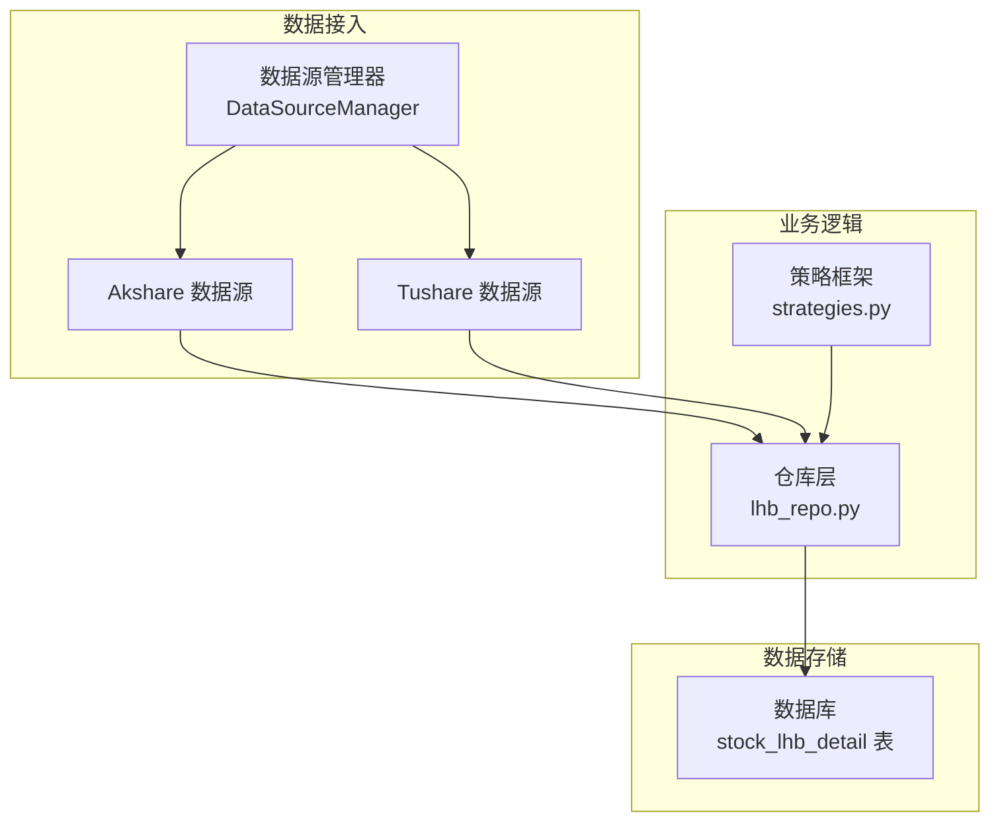
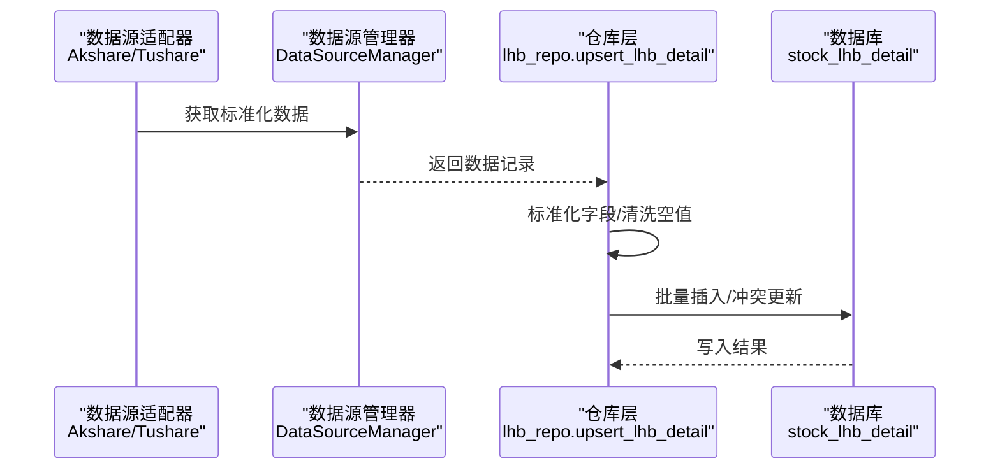
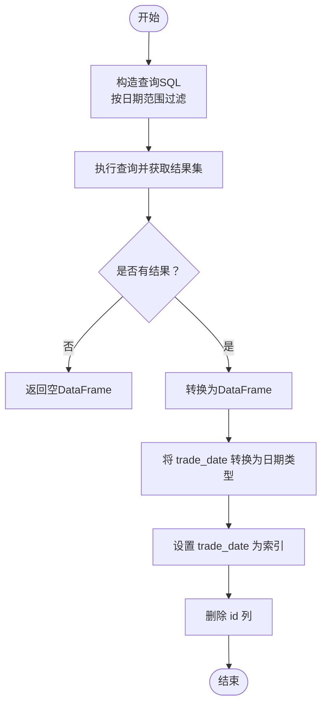
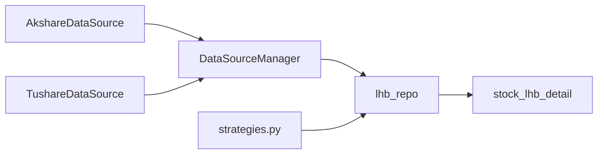

# 龙虎榜明细数据表

<cite>
**本文引用的文件**
- [core/db.py](file://core/db.py)
- [core/repository/lhb_repo.py](file://core/repository/lhb_repo.py)
- [ministries/rites/akshare_source.py](file://ministries/rites/akshare_source.py)
- [ministries/rites/tushare_source.py](file://ministries/rites/tushare_source.py)
- [ministries/rites/data_source_manager.py](file://ministries/rites/data_source_manager.py)
- [routes/data_source.py](file://routes/data_source.py)
- [strategy/strategies.py](file://strategy/strategies.py)
</cite>

## 目录
1. [简介](#简介)
2. [项目结构](#项目结构)
3. [核心组件](#核心组件)
4. [架构概览](#架构概览)
5. [详细组件分析](#详细组件分析)
6. [依赖分析](#依赖分析)
7. [性能考虑](#性能考虑)
8. [故障排查指南](#故障排查指南)
9. [结论](#结论)
10. [附录](#附录)

## 简介
本文档围绕 AIQuant 项目中的“龙虎榜明细数据表（stock_lhb_detail）”进行系统化说明，目标包括：
- 明确该表用于存储上市公司龙虎榜交易明细数据
- 解释各字段含义与用途
- 说明数据来源、入库流程与查询接口
- 提供基于该表的交易策略应用思路与示例路径

## 项目结构
与“龙虎榜明细数据表”直接相关的代码分布在以下模块：
- 数据库定义：core/db.py
- 仓库层（入库/查询）：core/repository/lhb_repo.py
- 数据源适配器（Akshare/Tushare）：ministries/rites/akshare_source.py、ministries/rites/tushare_source.py
- 数据源管理器与API：ministries/rites/data_source_manager.py、routes/data_source.py
- 策略框架（可结合该表构建策略）：strategy/strategies.py

图表来源
- [core/db.py:310-334](file://core/db.py#L310-L334)
- [core/repository/lhb_repo.py:1-99](file://core/repository/lhb_repo.py#L1-L99)
- [ministries/rites/data_source_manager.py:111-178](file://ministries/rites/data_source_manager.py#L111-L178)
- [ministries/rites/akshare_source.py:45-81](file://ministries/rites/akshare_source.py#L45-L81)
- [ministries/rites/tushare_source.py:65-103](file://ministries/rites/tushare_source.py#L65-L103)
- [strategy/strategies.py:1-200](file://strategy/strategies.py#L1-L200)

章节来源
- [core/db.py:310-334](file://core/db.py#L310-L334)
- [core/repository/lhb_repo.py:1-99](file://core/repository/lhb_repo.py#L1-L99)
- [ministries/rites/data_source_manager.py:111-178](file://ministries/rites/data_source_manager.py#L111-L178)
- [ministries/rites/akshare_source.py:45-81](file://ministries/rites/akshare_source.py#L45-L81)
- [ministries/rites/tushare_source.py:65-103](file://ministries/rites/tushare_source.py#L65-L103)
- [strategy/strategies.py:1-200](file://strategy/strategies.py#L1-L200)

## 核心组件
- stock_lhb_detail 表：用于存储每日个股龙虎榜交易明细，包含交易日期、股票代码、名称、价格涨跌、资金流向、换手率、市值、上榜原因及后续涨跌幅等字段。
- 仓库层（lhb_repo.py）：负责将上游数据标准化后批量写入数据库，并提供按日期范围查询与最新日期查询能力。
- 数据源适配器：Akshare/Tushare 提供标准化的数据接口，便于统一入库。
- 数据源管理器与API：统一管理多数据源、健康检查与主备切换。

章节来源
- [core/db.py:310-334](file://core/db.py#L310-L334)
- [core/repository/lhb_repo.py:27-98](file://core/repository/lhb_repo.py#L27-L98)
- [ministries/rites/akshare_source.py:45-81](file://ministries/rites/akshare_source.py#L45-L81)
- [ministries/rites/tushare_source.py:65-103](file://ministries/rites/tushare_source.py#L65-L103)
- [ministries/rites/data_source_manager.py:111-178](file://ministries/rites/data_source_manager.py#L111-L178)

## 架构概览
下图展示从数据源到入库再到查询的整体流程：

图表来源
- [core/repository/lhb_repo.py:27-69](file://core/repository/lhb_repo.py#L27-L69)
- [ministries/rites/akshare_source.py:45-81](file://ministries/rites/akshare_source.py#L45-L81)
- [ministries/rites/tushare_source.py:65-103](file://ministries/rites/tushare_source.py#L65-L103)
- [ministries/rites/data_source_manager.py:153-177](file://ministries/rites/data_source_manager.py#L153-L177)

## 详细组件分析

### 数据表结构与字段说明
stock_lhb_detail 表用于存储上市公司龙虎榜交易明细，关键字段如下：
- trade_date：交易日期（文本格式，唯一索引的一部分）
- code：股票代码（唯一索引的一部分）
- name：股票名称
- close_price：当日收盘价
- pct_change：涨跌幅
- net_buy：净买入额
- buy_amt：买入金额
- sell_amt：卖出金额
- total_amt：成交总额
- mkt_total_amt：市场总成交额
- net_buy_ratio：净买占比
- turnover_rate：换手率
- float_mkt_cap：流通市值
- reason：上榜原因
- perf_1d：次日涨跌幅
- perf_2d：2日涨跌幅
- perf_5d：5日涨跌幅
- perf_10d：10日涨跌幅

字段设计要点：
- 唯一约束（trade_date, code）确保同一天同一股票仅存一条明细
- 建立索引（idx_lhb_date、idx_lhb_code）以优化按日期与股票代码的查询

章节来源
- [core/db.py:310-334](file://core/db.py#L310-L334)

### 仓库层：入库与查询
- upsert_lhb_detail(df)：将上游标准化后的 DataFrame 批量写入 stock_lhb_detail。入库前会清洗空值与异常格式，并对 trade_date 做格式化；采用 ON CONFLICT(trade_date, code) DO UPDATE 实现幂等更新。
- get_lhb_detail(start_date, end_date)：按日期范围查询，支持排序（先按日期降序，再按净买入额降序）。
- get_latest_lhb_date()：查询表内最新交易日期。

字段映射与清洗逻辑：
- trade_date：支持 datetime.date、字符串（YYYYMMDD 或更长）、数值等输入，统一转为 YYYY-MM-DD 文本
- 数值字段（close、pct_change、turnover、total_buy、total_sell、net_buy 等）统一清洗为空/“-”/None 时为 NULL
- 字段命名与表结构保持一致，便于直接 INSERT

章节来源
- [core/repository/lhb_repo.py:27-98](file://core/repository/lhb_repo.py#L27-L98)

### 数据源适配器与统一接入
- AkshareDataSource：通过 akshare 获取日线数据并标准化列名，返回统一格式记录
- TushareDataSource：通过 tushare 获取日线数据并标准化列名，返回统一格式记录
- DataSourceManager：统一管理多数据源，提供健康检查、主备切换与自动回退机制
- 路由接口：/api/data/sources、/api/data/health、/api/data/switch 提供数据源状态查询与主数据源切换

章节来源
- [ministries/rites/akshare_source.py:45-81](file://ministries/rites/akshare_source.py#L45-L81)
- [ministries/rites/tushare_source.py:65-103](file://ministries/rites/tushare_source.py#L65-L103)
- [ministries/rites/data_source_manager.py:111-178](file://ministries/rites/data_source_manager.py#L111-L178)
- [routes/data_source.py:25-86](file://routes/data_source.py#L25-L86)

### 查询与可视化流程

图表来源
- [core/repository/lhb_repo.py:72-92](file://core/repository/lhb_repo.py#L72-L92)

## 依赖分析
- 仓库层依赖数据库连接（core.db.get_conn），通过 SQL 执行批量写入与查询
- 数据源适配器通过 DataSourceManager 注册并被统一调用
- 策略框架可直接读取该表数据进行信号生成与回测

图表来源
- [core/repository/lhb_repo.py:7-9](file://core/repository/lhb_repo.py#L7-L9)
- [ministries/rites/data_source_manager.py:111-178](file://ministries/rites/data_source_manager.py#L111-L178)
- [strategy/strategies.py:1-200](file://strategy/strategies.py#L1-L200)

章节来源
- [core/repository/lhb_repo.py:7-9](file://core/repository/lhb_repo.py#L7-L9)
- [ministries/rites/data_source_manager.py:111-178](file://ministries/rites/data_source_manager.py#L111-L178)
- [strategy/strategies.py:1-200](file://strategy/strategies.py#L1-L200)

## 性能考虑
- 批量写入：upsert_lhb_detail 使用 executemany 并在数据库层面做冲突更新，减少往返开销
- 索引优化：对 trade_date 与 code 建有索引，有利于高频查询与去重
- 数据清洗：入库前统一清洗空值与异常格式，避免脏数据影响后续统计与回测
- 主备切换：数据源管理器在主数据源不可用时自动回退至备用数据源，提升可用性

[本节为通用建议，无需特定文件引用]

## 故障排查指南
- 数据源不可用
  - 检查数据源健康状态：/api/data/health
  - 切换主数据源：/api/data/switch
  - 参考：[routes/data_source.py:46-86](file://routes/data_source.py#L46-L86)
- 入库失败或数据异常
  - 确认 trade_date 格式是否符合 YYYY-MM-DD
  - 检查数值字段是否包含“-”或空字符串
  - 参考：[core/repository/lhb_repo.py:27-69](file://core/repository/lhb_repo.py#L27-L69)
- 查询结果为空
  - 检查日期范围参数是否正确
  - 参考：[core/repository/lhb_repo.py:72-92](file://core/repository/lhb_repo.py#L72-L92)
- 数据一致性
  - stock_lhb_detail 对 (trade_date, code) 建有唯一约束，确保幂等写入
  - 参考：[core/db.py:331](file://core/db.py#L331)

章节来源
- [routes/data_source.py:46-86](file://routes/data_source.py#L46-L86)
- [core/repository/lhb_repo.py:27-69](file://core/repository/lhb_repo.py#L27-L69)
- [core/repository/lhb_repo.py:72-92](file://core/repository/lhb_repo.py#L72-L92)
- [core/db.py:331](file://core/db.py#L331)

## 结论
stock_lhb_detail 表为 AIQuant 提供了标准化的龙虎榜交易明细数据基础，配合仓库层的入库与查询能力、多数据源的统一接入与健康检查机制，能够稳定支撑策略研究与回测。建议在实际使用中：
- 明确字段含义与口径，确保上游数据质量
- 合理利用索引与查询条件，提高检索效率
- 结合策略框架对该表数据进行信号挖掘与验证

[本节为总结性内容，无需特定文件引用]

## 附录

### 字段定义与含义对照
- trade_date：交易日期
- code：股票代码
- name：股票名称
- close_price：当日收盘价
- pct_change：涨跌幅
- net_buy：净买入额
- buy_amt：买入金额
- sell_amt：卖出金额
- total_amt：成交总额
- mkt_total_amt：市场总成交额
- net_buy_ratio：净买占比
- turnover_rate：换手率
- float_mkt_cap：流通市值
- reason：上榜原因
- perf_1d：次日涨跌幅
- perf_2d：2日涨跌幅
- perf_5d：5日涨跌幅
- perf_10d：10日涨跌幅

章节来源
- [core/db.py:310-334](file://core/db.py#L310-L334)

### 龙虎榜筛选条件与上榜机制说明
- 筛选条件（来自字段语义与命名）
  - 交易日期范围：通过 get_lhb_detail(start_date, end_date) 控制
  - 资金规模：net_buy、buy_amt、sell_amt、total_amt、mkt_total_amt
  - 换手与流动性：turnover_rate、float_mkt_cap
  - 涨跌表现：close_price、pct_change、perf_1d/perf_2d/perf_5d/perf_10d
  - 上榜原因：reason
- 上榜机制（概念性说明）
  - 龙虎榜通常由交易所根据“日换手率偏离度”“日振幅偏离度”“日成交金额偏离度”等指标筛选，具体阈值以官方公告为准。本表字段可作为后续策略筛选与回测的依据，但不直接反映“是否上榜”的判定逻辑。

[本节为概念性说明，无需特定文件引用]

### 基于该表的交易策略应用示例（思路与路径）
- 示例1：资金驱动型策略
  - 思路：选取 net_buy_ratio 高且 turnover_rate 较大的股票，观察其次日与2日涨跌幅（perf_1d、perf_2d）表现
  - 实施路径：
    - 读取数据：[core/repository/lhb_repo.py:72-92](file://core/repository/lhb_repo.py#L72-L92)
    - 计算指标：基于表内字段计算换手率、净买占比等
    - 信号生成：参考策略框架中的打分与信号生成方式（如放量突破、均线粘合等）
      - 参考：[strategy/strategies.py:36-91](file://strategy/strategies.py#L36-L91)、[strategy/strategies.py:98-134](file://strategy/strategies.py#L98-L134)
- 示例2：事件驱动型策略
  - 思路：结合 reason 字段（如“有价格涨跌幅偏离值的证券”等）筛选特定事件，跟踪其短期涨跌幅（perf_1d 至 perf_10d）
  - 实施路径：
    - 过滤条件：按 reason 进行分组统计与筛选
    - 回测验证：将 perf_1d/perf_2d/perf_5d/perf_10d 作为目标变量进行回测

章节来源
- [core/repository/lhb_repo.py:72-92](file://core/repository/lhb_repo.py#L72-L92)
- [strategy/strategies.py:36-91](file://strategy/strategies.py#L36-L91)
- [strategy/strategies.py:98-134](file://strategy/strategies.py#L98-L134)