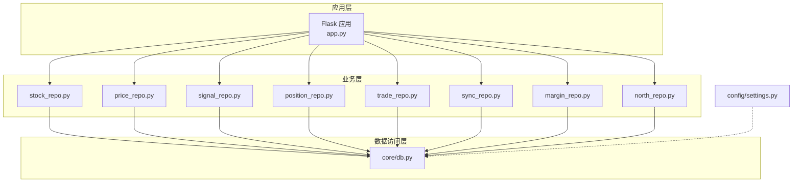
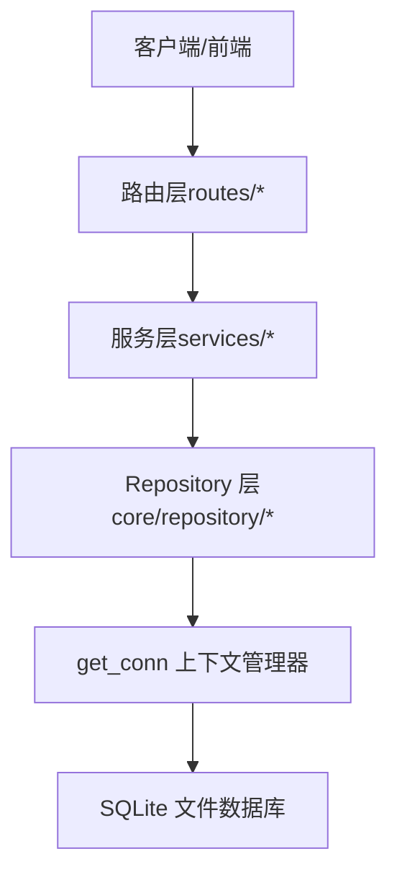
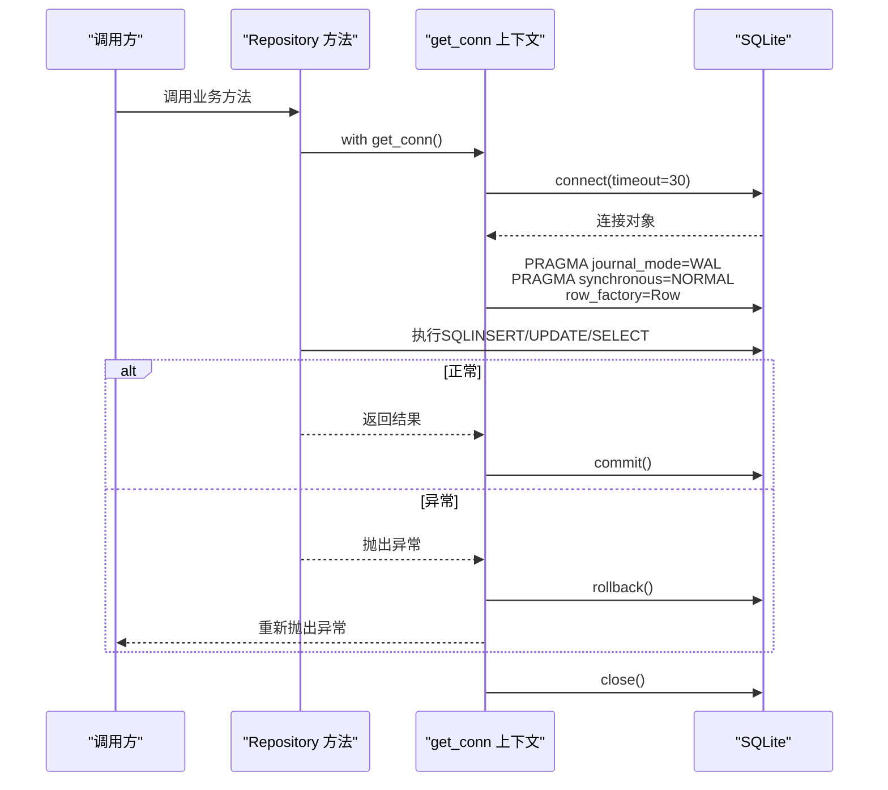
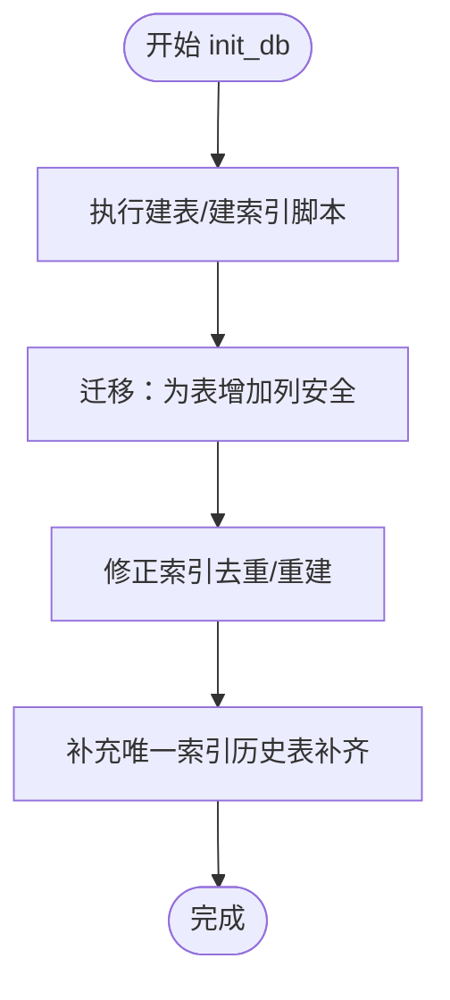
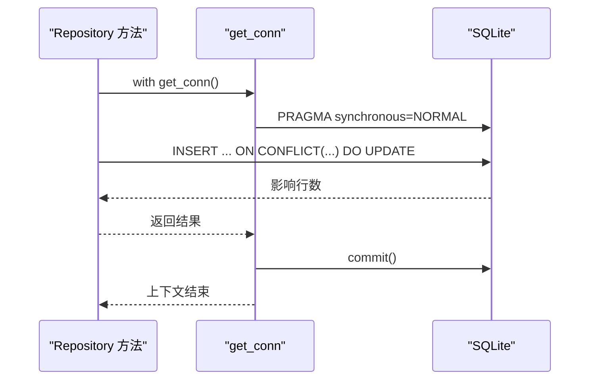
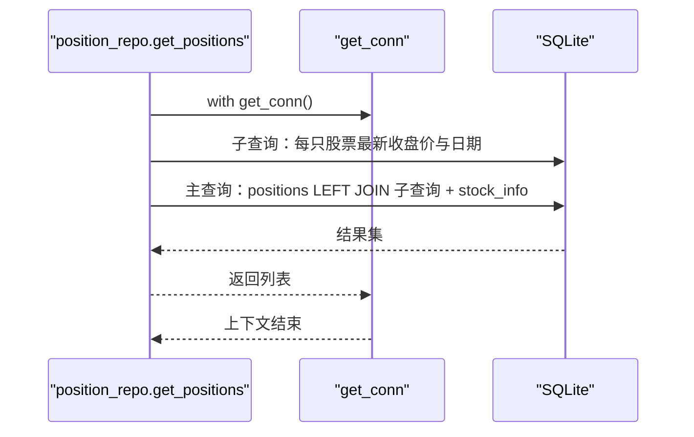
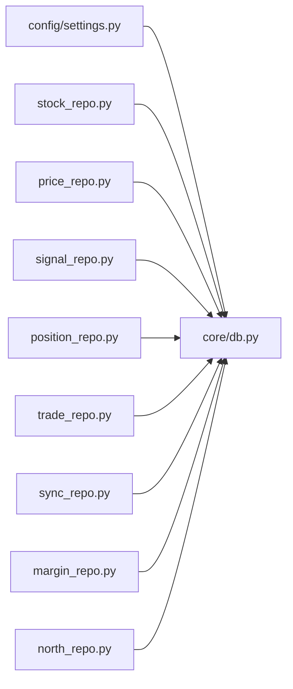

# 数据库操作

<cite>
**本文引用的文件**
- [core/db.py](file://core/db.py)
- [config/settings.py](file://config/settings.py)
- [core/repository/stock_repo.py](file://core/repository/stock_repo.py)
- [core/repository/price_repo.py](file://core/repository/price_repo.py)
- [core/repository/signal_repo.py](file://core/repository/signal_repo.py)
- [core/repository/position_repo.py](file://core/repository/position_repo.py)
- [core/repository/trade_repo.py](file://core/repository/trade_repo.py)
- [core/repository/sync_repo.py](file://core/repository/sync_repo.py)
- [core/repository/margin_repo.py](file://core/repository/margin_repo.py)
- [core/repository/north_repo.py](file://core/repository/north_repo.py)
- [app.py](file://app.py)
</cite>

## 目录
1. [简介](#简介)
2. [项目结构](#项目结构)
3. [核心组件](#核心组件)
4. [架构总览](#架构总览)
5. [详细组件分析](#详细组件分析)
6. [依赖分析](#依赖分析)
7. [性能考虑](#性能考虑)
8. [故障排查指南](#故障排查指南)
9. [结论](#结论)
10. [附录](#附录)

## 简介
本文件面向AIQuant项目的数据库操作，系统化阐述以下主题：
- 数据库连接管理与事务处理
- 批量操作与upsert策略
- 数据库初始化、表结构与索引策略
- SQLite配置（WAL模式、同步级别等）对性能与一致性的权衡
- 跨表查询、数据一致性与并发控制
- 数据迁移机制与版本演进
- 备份与恢复建议、性能优化与故障处理

## 项目结构
数据库相关代码主要集中在以下位置：
- 核心数据库模块：core/db.py
- 配置文件：config/settings.py（数据库路径等基础配置）
- Repository层：core/repository/*（面向业务的DAO封装，统一调用core/db.py中的get_conn）

图表来源
- [app.py:1-164](file://app.py#L1-L164)
- [core/db.py:1-1213](file://core/db.py#L1-L1213)
- [config/settings.py:1-25](file://config/settings.py#L1-L25)

章节来源
- [core/db.py:1-1213](file://core/db.py#L1-L1213)
- [config/settings.py:1-25](file://config/settings.py#L1-L25)

## 核心组件
- 连接管理与事务
  - get_conn上下文管理器负责建立连接、设置PRAGMA、自动提交或回滚、关闭连接。
  - PRAGMA配置：journal_mode=WAL、synchronous=NORMAL、row_factory=sqlite3.Row。
- 初始化与迁移
  - init_db一次性执行建表与索引；迁移函数安全地为旧表增加列；修正索引以满足唯一约束。
- 批量与upsert
  - 使用executemany与ON CONFLICT（或INSERT OR REPLACE）实现高效批量写入与去重更新。
- Repository层
  - 各业务模块（stock、price、signal、position、trade、sync、margin、north）均通过_get_conn()复用核心连接管理。

章节来源
- [core/db.py:26-40](file://core/db.py#L26-L40)
- [core/db.py:57-467](file://core/db.py#L57-L467)
- [core/repository/stock_repo.py:8-80](file://core/repository/stock_repo.py#L8-L80)
- [core/repository/price_repo.py:8-237](file://core/repository/price_repo.py#L8-L237)
- [core/repository/signal_repo.py:9-119](file://core/repository/signal_repo.py#L9-L119)
- [core/repository/position_repo.py:7-138](file://core/repository/position_repo.py#L7-L138)
- [core/repository/trade_repo.py:7-77](file://core/repository/trade_repo.py#L7-L77)
- [core/repository/sync_repo.py:8-55](file://core/repository/sync_repo.py#L8-L55)
- [core/repository/margin_repo.py:7-186](file://core/repository/margin_repo.py#L7-L186)
- [core/repository/north_repo.py:7-117](file://core/repository/north_repo.py#L7-L117)

## 架构总览
下图展示数据库层在系统中的职责与交互：

图表来源
- [core/db.py:26-40](file://core/db.py#L26-L40)
- [core/repository/stock_repo.py:8-10](file://core/repository/stock_repo.py#L8-L10)
- [core/repository/price_repo.py:8-10](file://core/repository/price_repo.py#L8-L10)
- [core/repository/signal_repo.py:9-11](file://core/repository/signal_repo.py#L9-L11)
- [core/repository/position_repo.py:7-9](file://core/repository/position_repo.py#L7-L9)
- [core/repository/trade_repo.py:7-9](file://core/repository/trade_repo.py#L7-L9)
- [core/repository/sync_repo.py:8-10](file://core/repository/sync_repo.py#L8-L10)
- [core/repository/margin_repo.py:7-9](file://core/repository/margin_repo.py#L7-L9)
- [core/repository/north_repo.py:7-9](file://core/repository/north_repo.py#L7-L9)

## 详细组件分析

### 连接管理与事务处理
- get_conn上下文管理器
  - 建立连接：timeout=30秒，避免阻塞。
  - 设置PRAGMA：
    - journal_mode=WAL：写时复制，显著提升并发读写能力。
    - synchronous=NORMAL：在性能与安全性之间折中，减少fsync频率。
    - row_factory=sqlite3.Row：支持字典式与索引式两种访问方式。
  - 事务语义：try/finally确保异常时回滚并抛出；正常退出时commit；最后关闭连接。
- 事务边界
  - 每个业务方法内部以“with get_conn()”为单位开启事务，适合短事务场景。
  - 对于需要强一致性的跨表写入，可在同一with块内完成，避免跨事务不一致。

图表来源
- [core/db.py:26-40](file://core/db.py#L26-L40)

章节来源
- [core/db.py:26-40](file://core/db.py#L26-L40)

### SQLite配置与性能影响
- WAL模式（journal_mode=WAL）
  - 优点：允许多读+写并发，写入不阻塞读取，适合高频写入场景。
  - 注意：需要合适的fsync策略与磁盘I/O能力支撑。
- 同步级别（synchronous=NORMAL）
  - 优点：降低fsync频率，提高写入吞吐。
  - 风险：系统崩溃时可能丢失最近少量事务，但可接受于高频数据写入场景。
- row_factory
  - 提升查询结果可读性，便于pandas.DataFrame转换与字典访问。

章节来源
- [core/db.py:28-31](file://core/db.py#L28-L31)

### 数据库初始化与迁移
- 初始化流程
  - init_db一次性执行所有建表与索引创建脚本，确保首次部署即具备完整Schema。
- 迁移策略
  - _safe_add_column：安全地为旧表增加列，避免重复执行失败。
  - 修正索引：先DROP再CREATE，确保唯一性约束与查询效率。
  - 补齐唯一索引：针对历史建表后补充缺失的UNIQUE约束索引。
- 版本演进
  - 通过条件性迁移与索引重建，逐步增强Schema以满足业务需求。

图表来源
- [core/db.py:57-467](file://core/db.py#L57-L467)

章节来源
- [core/db.py:57-467](file://core/db.py#L57-L467)

### upsert与批量操作策略
- stock_info/upsert_stock_list
  - 使用executemany + ON CONFLICT(code) DO UPDATE，实现批量写入与去重更新。
- daily_price/upsert_daily_price
  - 使用executemany + ON CONFLICT(code, trade_date) DO UPDATE，按日期覆盖行情。
- index_daily/upsert_index_daily
  - 同上，指数行情批量写入。
- stock_signal/save_scan_signals
  - 使用INSERT OR REPLACE，按scan_date+code去重，覆盖式写入策略扫描结果。
- positions/update_strategy_scores_batch
  - 关闭外键检查后逐条更新策略评分，保证高并发下的稳定性。
- trades/save_account_snapshot
  - 使用ON CONFLICT(snapshot_date) DO UPDATE，实现账户快照幂等更新。

图表来源
- [core/repository/stock_repo.py:13-28](file://core/repository/stock_repo.py#L13-L28)
- [core/repository/price_repo.py:13-47](file://core/repository/price_repo.py#L13-L47)
- [core/repository/signal_repo.py:46-99](file://core/repository/signal_repo.py#L46-L99)
- [core/repository/position_repo.py:76-82](file://core/repository/position_repo.py#L76-L82)
- [core/repository/trade_repo.py:42-57](file://core/repository/trade_repo.py#L42-L57)

章节来源
- [core/repository/stock_repo.py:13-28](file://core/repository/stock_repo.py#L13-L28)
- [core/repository/price_repo.py:13-47](file://core/repository/price_repo.py#L13-L47)
- [core/repository/signal_repo.py:46-99](file://core/repository/signal_repo.py#L46-L99)
- [core/repository/position_repo.py:76-82](file://core/repository/position_repo.py#L76-L82)
- [core/repository/trade_repo.py:42-57](file://core/repository/trade_repo.py#L42-L57)

### 跨表查询与一致性
- 持仓查询（positions + daily_price + stock_info）
  - 使用子查询获取每只股票的最新收盘价与日期，再LEFT JOIN拼接名称与最新价。
  - 逻辑：优先使用实时最新价，其次使用持仓记录中的current_price。
- 持仓汇总统计
  - 通过子查询聚合每只股票最新价，结合shares计算实时市值、成本与盈亏。
- 一致性保障
  - 通过短事务与PRAGMA设置在性能与一致性间取得平衡；跨表读取采用JOIN与子查询，避免跨事务不一致。

图表来源
- [core/repository/position_repo.py:85-101](file://core/repository/position_repo.py#L85-L101)
- [core/db.py:952-983](file://core/db.py#L952-L983)

章节来源
- [core/repository/position_repo.py:85-101](file://core/repository/position_repo.py#L85-L101)
- [core/db.py:952-983](file://core/db.py#L952-L983)

### 并发控制与锁竞争
- WAL模式显著降低写入锁竞争，提升并发度。
- 短事务与批量写入减少锁持有时间。
- 对于高并发写入场景，建议：
  - 控制单次批量大小（参考配置中的同步批次大小）。
  - 避免长事务，尽量将多个写入放在同一事务中提交。
  - 在业务层进行必要的去重与幂等处理（ON CONFLICT/INSERT OR REPLACE）。

章节来源
- [core/db.py:28-31](file://core/db.py#L28-L31)
- [config/settings.py:20](file://config/settings.py#L20)

### 数据备份与恢复
- 备份
  - 使用SQLite内置备份API或复制数据库文件进行物理备份。
  - 建议在低峰期执行备份，或在WAL模式下进行在线备份。
- 恢复
  - 从备份文件恢复至新数据库文件，验证init_db后的Schema与索引完整性。
- 迁移与回滚
  - 通过迁移脚本与索引重建实现Schema演进；必要时可回退到上一个版本的备份。

（本节为通用实践建议，不直接分析具体源码）

### 性能优化建议
- 索引策略
  - 为高频查询字段建立复合索引与单列索引，如code+trade_date、trade_date等。
  - 对唯一约束字段建立唯一索引，确保数据一致性与查询效率。
- 批量写入
  - 使用executemany与ON CONFLICT/INSERT OR REPLACE，减少往返次数。
  - 控制批量大小，避免单次事务过大导致锁竞争与内存占用。
- PRAGMA调优
  - WAL模式与NORMAL同步级别适合高频写入；如需更强一致性，可临时调整为FULL。
- 查询优化
  - 使用子查询与LEFT JOIN减少重复扫描；对大表查询添加LIMIT与WHERE条件。

章节来源
- [core/db.py:61-427](file://core/db.py#L61-L427)
- [config/settings.py:20](file://config/settings.py#L20)

## 依赖分析
- Repository层依赖core/db.py的get_conn，形成清晰的分层：路由层→服务层→Repository层→数据访问层。
- 配置层（config/settings.py）提供DB_PATH等基础配置，被core/db.py使用。

图表来源
- [config/settings.py:7-8](file://config/settings.py#L7-L8)
- [core/db.py:19](file://core/db.py#L19)
- [core/repository/stock_repo.py:8-10](file://core/repository/stock_repo.py#L8-L10)
- [core/repository/price_repo.py:8-10](file://core/repository/price_repo.py#L8-L10)
- [core/repository/signal_repo.py:9-11](file://core/repository/signal_repo.py#L9-L11)
- [core/repository/position_repo.py:7-9](file://core/repository/position_repo.py#L7-L9)
- [core/repository/trade_repo.py:7-9](file://core/repository/trade_repo.py#L7-L9)
- [core/repository/sync_repo.py:8-10](file://core/repository/sync_repo.py#L8-L10)
- [core/repository/margin_repo.py:7-9](file://core/repository/margin_repo.py#L7-L9)
- [core/repository/north_repo.py:7-9](file://core/repository/north_repo.py#L7-L9)

章节来源
- [config/settings.py:7-8](file://config/settings.py#L7-L8)
- [core/db.py:19](file://core/db.py#L19)

## 性能考虑
- WAL模式与NORMAL同步级别在本项目中已默认启用，适合高频写入与并发读取场景。
- 批量写入与upsert策略有效降低往返次数与锁竞争。
- 建议结合业务峰值与磁盘I/O能力，评估是否需要进一步调优PRAGMA参数或批量大小。

章节来源
- [core/db.py:28-31](file://core/db.py#L28-L31)
- [config/settings.py:20](file://config/settings.py#L20)

## 故障排查指南
- 连接超时
  - 检查timeout设置与磁盘I/O；确认WAL文件未被占用。
- 写入阻塞
  - 确认是否处于长事务；适当拆分批量；检查锁竞争热点。
- 数据不一致
  - 核对唯一索引与ON CONFLICT策略；核查跨表查询的JOIN条件与子查询逻辑。
- 迁移失败
  - 检查迁移脚本与索引重建顺序；必要时回滚到备份并重试。

章节来源
- [core/db.py:26-40](file://core/db.py#L26-L40)
- [core/db.py:57-467](file://core/db.py#L57-L467)

## 结论
AIQuant的数据库层通过清晰的分层设计与高效的批量写入策略，实现了高性能、可维护的数据存取。WAL模式与合理的PRAGMA配置在并发与性能之间取得良好平衡；Repository层统一复用连接管理，确保事务边界与一致性。配合完善的初始化与迁移机制，系统能够稳定演进并满足高频数据写入与复杂查询需求。

## 附录

### 数据库初始化与表结构要点
- 建表与索引：一次性执行建表与索引创建脚本，确保Schema完整。
- 迁移：安全增加列、修正索引、补齐唯一索引。
- Schema演进：通过条件性迁移与索引重建，逐步增强功能。

章节来源
- [core/db.py:57-467](file://core/db.py#L57-L467)

### 配置文件与数据库路径
- 数据库路径：DB_PATH指向core/quant.db，便于集中管理与部署。

章节来源
- [config/settings.py:7-8](file://config/settings.py#L7-L8)