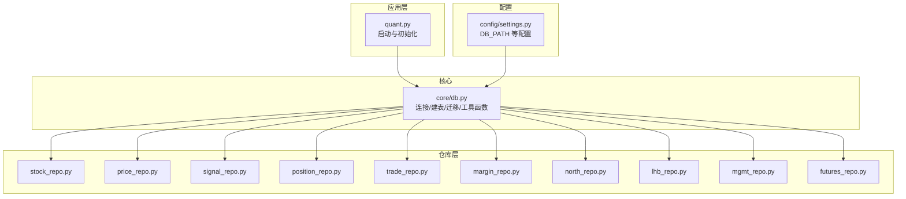
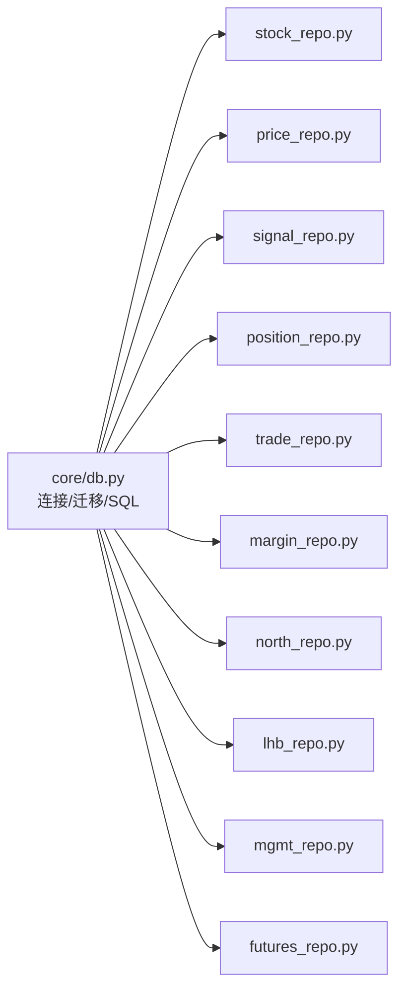

# 数据库设计

<cite>
**本文引用的文件**
- [core/db.py](file://core/db.py)
- [config/settings.py](file://config/settings.py)
- [core/repository/stock_repo.py](file://core/repository/stock_repo.py)
- [core/repository/price_repo.py](file://core/repository/price_repo.py)
- [core/repository/signal_repo.py](file://core/repository/signal_repo.py)
- [core/repository/position_repo.py](file://core/repository/position_repo.py)
- [core/repository/trade_repo.py](file://core/repository/trade_repo.py)
- [core/repository/margin_repo.py](file://core/repository/margin_repo.py)
- [core/repository/north_repo.py](file://core/repository/north_repo.py)
- [core/repository/lhb_repo.py](file://core/repository/lhb_repo.py)
- [core/repository/mgmt_repo.py](file://core/repository/mgmt_repo.py)
- [core/repository/futures_repo.py](file://core/repository/futures_repo.py)
- [quant.py](file://quant.py)
</cite>

## 目录
1. [简介](#简介)
2. [项目结构](#项目结构)
3. [核心组件](#核心组件)
4. [架构总览](#架构总览)
5. [详细组件分析](#详细组件分析)
6. [依赖分析](#依赖分析)
7. [性能考虑](#性能考虑)
8. [故障排查指南](#故障排查指南)
9. [结论](#结论)
10. [附录](#附录)

## 简介
本文件系统化梳理 AIQuant 项目的数据库设计方案，聚焦于本地 SQLite 存储的表结构、字段定义、索引策略、表间关系与迁移机制，并结合仓库层（Repository）封装说明典型数据流与使用方式。重点覆盖以下核心表：
- stock_info：股票基本信息
- daily_price：日线行情与策略评分
- stock_signal：策略扫描推荐
- positions：持仓记录
- trades：交易记录
- account_snapshots：账户资产快照
并扩展说明指数行情、融资融券、北向资金、龙虎榜、高管持股、股指期货等扩展表的设计理念与用途。

## 项目结构
数据库相关代码主要分布在以下位置：
- 核心连接与初始化：core/db.py
- 配置路径：config/settings.py
- 仓库层封装：core/repository/*（stock_repo、price_repo、signal_repo、position_repo、trade_repo、margin_repo、north_repo、lhb_repo、mgmt_repo、futures_repo）
- 启动与初始化入口：quant.py

图表来源
- [core/db.py:57-466](file://core/db.py#L57-L466)
- [config/settings.py:6-8](file://config/settings.py#L6-L8)
- [quant.py:595-605](file://quant.py#L595-L605)

章节来源
- [core/db.py:57-466](file://core/db.py#L57-L466)
- [config/settings.py:6-8](file://config/settings.py#L6-L8)
- [quant.py:595-605](file://quant.py#L595-L605)

## 核心组件
本节概述数据库初始化流程、连接管理、迁移策略与关键表的职责边界。

- 连接管理与PRAGMA设置
  - 使用上下文管理器确保事务提交/回滚与连接关闭。
  - PRAGMA 设置：WAL 模式提升并发；synchronous=NORMAL 平衡性能与可靠性；row_factory 支持字典式访问。
- 初始化流程
  - 一次性执行建表与索引脚本，保证幂等。
  - 迁移步骤：安全添加列、修正唯一索引、补充缺失唯一索引。
- 迁移策略
  - 通过“尝试执行 ALTER TABLE ADD COLUMN，捕获 OperationalError 忽略”实现“列已存在则跳过”的安全迁移。
  - 对 stock_signal 的唯一索引进行重建以去除冗余列，确保扫描日期+代码的唯一性。
  - 对 daily_price 的唯一索引进行补充，避免重复建表导致的数据不一致。

章节来源
- [core/db.py:26-39](file://core/db.py#L26-L39)
- [core/db.py:45-50](file://core/db.py#L45-L50)
- [core/db.py:57-466](file://core/db.py#L57-L466)

## 架构总览
下图展示核心表之间的关系与典型数据流向。注意：仓库层方法负责调用核心连接与SQL执行，具体字段与约束以各表定义为准。

```mermaid
erDiagram
STOCK_INFO {
text code PK
text name
text market
integer is_active
text updated_at
}
DAILY_PRICE {
integer id PK
text code
text trade_date
real open
real high
real low
real close
real volume
real amount
real pct_change
real turnover
real vol_score
real ma_score
real diverge_score
real bottom_score
real whale_score
real fusion_score
}
INDEX_DAILY {
integer id PK
text code
text trade_date
real open
real high
real low
real close
real volume
real amount
real pct_change
}
STOCK_SIGNAL {
integer id PK
text scan_date
text trade_date
text code
text name
real price
real fusion_score
real vol_score
real ma_score
real diverge_score
real bottom_score
real whale_score
text trigger_list
real buy_price
real stop_loss
real take_profit
integer buy_volume
real buy_money
integer sent_wechat
text created_at
}
SIGNAL_RECORDS {
integer id PK
text scan_time
text trade_date
text code
text name
real price
integer score
real stop_loss
real take_profit
integer buy_volume
real buy_money
integer sent_wechat
text note
}
POSITIONS {
integer id PK
text code
text name
text entry_date
real entry_price
integer shares
real current_price
real stop_loss
real take_profit
text position_type
text status
text strategy
text note
text created_at
text updated_at
real commission
}
TRADES {
integer id PK
integer position_id
text code
text name
text trade_date
text direction
real price
integer shares
real amount
real commission
real slippage
text reason
text note
text created_at
}
ACCOUNT_SNAPSHOTS {
integer id PK
text snapshot_date
real total_assets
real cash
real position_value
integer positions_count
real total_cost
real total_pnl
real pnl_pct
text created_at
}
STOCK_MARGIN {
integer id PK
text trade_date
real sse_margin_balance
real sse_margin_buy
real sse_short_balance
real sse_short_volume
real szse_margin_balance
real szse_margin_buy
real szse_short_balance
real szse_short_volume
real szse_margin_ratio
real total_margin_balance
real total_margin_buy
real total_short_balance
real total_margin
}
STOCK_MARGIN_DETAIL {
integer id PK
text code
text trade_date
text name
text exchange
real margin_balance
real margin_buy
real margin_repay
real short_volume
real short_sell
real short_repay
real short_balance
real total_balance
}
STOCK_HSGT_NORTH {
integer id PK
text trade_date
real north_net_buy
real north_buy_amt
real north_sell_amt
real north_cum_net
real north_daily_flow
real north_balance
real north_market_cap
real hgt_net_buy
real hgt_buy_amt
real hgt_sell_amt
real hgt_cum_net
real hgt_daily_flow
real sgt_net_buy
real sgt_buy_amt
real sgt_sell_amt
real sgt_cum_net
real sgt_daily_flow
}
INDEX_FUTURES {
integer id PK
text trade_date
text symbol
text variety
real open
real high
real low
real close
real volume
real open_interest
real turnover
real settle
real pre_settle
}
STOCK_LHB_DETAIL {
integer id PK
text trade_date
text code
text name
real close_price
real pct_change
real net_buy
real buy_amt
real sell_amt
real total_amt
real mkt_total_amt
real net_buy_ratio
real turnover_rate
real float_mkt_cap
text reason
real perf_1d
real perf_2d
real perf_5d
real perf_10d
}
STOCK_MGMT_HOLDING {
integer id PK
text trade_date
text code
text name
text changer
real change_shares
real avg_price
real change_amount
text change_reason
real change_ratio
real shares_after
text share_type
text executive_name
text position
text relation
}
RISK_EVENTS {
integer id PK
text pipeline_id
text rule_name
text category
text level
text message
real metric_value
real threshold
text suggestion
text created_at
}
RISK_STATUS {
text account_id PK
text overall_level
text active_rules
real current_drawdown
integer current_positions
real total_exposure
real available_capital
text last_check
text block_reason
text updated_at
}
BLACKLIST {
integer id PK
text stock_code
text reason
text created_by
text created_at
text expiry_date
text removed_at
}
RISK_OVERRIDES {
integer id PK
text rule_name
text reason
text operator
text approver
text status
text created_at
text expires_at
text approved_at
}
AUDIT_LOG {
integer id PK
text user_id
text action
text resource
text detail
text ip_address
text created_at
}
DAILY_PRICE }o--|| STOCK_INFO : "code"
TRADES }o--|| POSITIONS : "position_id"
STOCK_SIGNAL }o--|| STOCK_INFO : "code"
DAILY_PRICE ||--o{ STOCK_SIGNAL : "评分/筛选"
```

图表来源
- [core/db.py:61-426](file://core/db.py#L61-L426)

## 详细组件分析

### stock_info 股票基本信息表
- 设计理念
  - 记录股票基础元数据，主键为 code，便于快速定位与关联。
  - 提供 is_active 与 updated_at 字段，支持启用/停用与更新时间追踪。
  - 后续扩展市值相关字段（总股本、流通股本），通过迁移安全添加。
- 字段与约束
  - code：主键，文本型。
  - name：非空文本。
  - market：文本型。
  - is_active：整型，默认 1。
  - updated_at：文本型。
- 索引与查询
  - 仓库层提供批量写入、按状态过滤、按代码查询名称等常用查询。
- 迁移与扩展
  - 通过安全添加列的方式增加 total_shares、circ_shares 字段，不影响既有数据。

章节来源
- [core/db.py:63-69](file://core/db.py#L63-L69)
- [core/db.py:442-444](file://core/db.py#L442-L444)
- [core/repository/stock_repo.py:13-80](file://core/repository/stock_repo.py#L13-L80)

### daily_price 日线行情表
- 设计理念
  - 存储 OHLCV 与涨跌幅、换手等基础行情，同时承载策略评分（vol_score、ma_score、diverge_score、bottom_score、whale_score、fusion_score 等）。
  - 通过 code+trade_date 唯一键约束，确保单股票单日期唯一。
- 字段与约束
  - 主键 id（自增）。
  - code、trade_date、open、high、low、close、volume、amount、pct_change、turnover 等。
  - 多个策略评分字段默认 0，便于后续批量更新。
  - 唯一键约束：(code, trade_date)。
- 索引策略
  - idx_daily_code_date：(code, trade_date)
  - idx_daily_date：trade_date
- 读写接口
  - upsert_daily_price：批量写入或更新 OHLCV。
  - update_strategy_scores_batch：批量更新策略评分（独立更新，不触碰 OHLCV）。
  - get_daily_price：按日期范围查询并返回带日期索引的 DataFrame。
- 迁移与一致性
  - 迁移阶段补充唯一索引，保证重复建表后的数据一致性。

章节来源
- [core/db.py:71-94](file://core/db.py#L71-L94)
- [core/db.py:458-464](file://core/db.py#L458-L464)
- [core/repository/price_repo.py:13-47](file://core/repository/price_repo.py#L13-L47)
- [core/repository/price_repo.py:50-93](file://core/repository/price_repo.py#L50-L93)
- [core/repository/price_repo.py:95-129](file://core/repository/price_repo.py#L95-L129)

### stock_signal 策略信号表
- 设计理念
  - 记录每日策略扫描产生的推荐信号，包含融合评分与各子因子评分、止盈止损、买卖金额/手数等。
  - 唯一索引基于 scan_date 与 code，确保同一天同一股票仅保留一条推荐。
- 字段与约束
  - 主键 id。
  - scan_date、trade_date、code、name、price、fusion_score、vol_score、ma_score、diverge_score、bottom_score、whale_score。
  - trigger_list：JSON 文本存储触发规则列表。
  - buy_price、stop_loss、take_profit、buy_volume、buy_money、sent_wechat、created_at。
- 索引策略
  - idx_sig_scan_trade_code：(scan_date, code) 唯一
  - idx_sig_trade_date：trade_date
- 写入与查询
  - save_scan_signals：批量写入扫描推荐。
  - get_signals/get_today_signals：按日期或当日查询。

章节来源
- [core/db.py:112-137](file://core/db.py#L112-L137)
- [core/repository/signal_repo.py:46-99](file://core/repository/signal_repo.py#L46-L99)
- [core/repository/signal_repo.py:102-119](file://core/repository/signal_repo.py#L102-L119)

### positions 持仓记录表
- 设计理念
  - 记录每笔持仓的开仓信息、风控参数、当前价格与状态，支持部分/全部平仓与汇总统计。
- 字段与约束
  - 主键 id。
  - code、name、entry_date、entry_price、shares、current_price、stop_loss、take_profit、position_type、status、strategy、note、created_at、updated_at、commission。
  - status 默认 holding；position_type 默认 long。
- 索引策略
  - idx_position_code：code
  - idx_position_status：status
- 业务接口
  - add_position、close_position、partial_close_position、update_position_price、get_positions、get_position_by_id、get_position_by_code、delete_position、get_position_summary。

章节来源
- [core/db.py:168-186](file://core/db.py#L168-L186)
- [core/repository/position_repo.py:12-138](file://core/repository/position_repo.py#L12-L138)

### trades 交易记录表
- 设计理念
  - 记录每笔委托成交，与 positions 关联（position_id），便于回放与复盘。
- 字段与约束
  - 主键 id。
  - position_id、code、name、trade_date、direction、price、shares、amount、commission、slippage、reason、note、created_at。
- 索引策略
  - idx_trade_code：code
  - idx_trade_date：trade_date
- 业务接口
  - add_trade：新增交易记录。
  - get_trades：按代码/限制条数查询。

章节来源
- [core/db.py:190-206](file://core/db.py#L190-L206)
- [core/repository/trade_repo.py:12-38](file://core/repository/trade_repo.py#L12-L38)

### account_snapshots 账户资产快照表
- 设计理念
  - 记录每日总资产、现金、持仓价值、总盈亏与收益率等，支持回测与实盘监控。
- 字段与约束
  - 主键 id。
  - snapshot_date（唯一）、total_assets、cash、position_value、positions_count、total_cost、total_pnl、pnl_pct、created_at。
- 索引策略
  - idx_snapshot_date：snapshot_date
- 业务接口
  - save_account_snapshot：按日期写入或更新。
  - get_account_snapshots、get_latest_snapshot：查询历史快照。

章节来源
- [core/db.py:210-223](file://core/db.py#L210-L223)
- [core/repository/trade_repo.py:42-77](file://core/repository/trade_repo.py#L42-L77)

### 扩展表概览（设计理念与用途）
- index_daily 指数日线行情
  - 用途：大盘择时与宏观视角分析。
  - 约束：(code, trade_date) 唯一。
  - 索引：idx_index_code_date、idx_index_date。
- stock_margin / stock_margin_detail 融资融券
  - 用途：杠杆资金与做空行为监测。
  - 约束：stock_margin 唯一索引(trade_date)，stock_margin_detail 唯一索引(code, trade_date)。
  - 索引：idx_margin_date、idx_md_code_date。
- stock_hsgt_north 北向资金
  - 用途：外资流入流出监测。
  - 约束：唯一索引(trade_date)。
  - 索引：idx_hsgt_date。
- index_futures 指数期货
  - 用途：跨品种套利与对冲参考。
  - 约束：唯一索引(trade_date, symbol)。
  - 索引：idx_if_date、idx_if_date_var。
- stock_lhb_detail 龙虎榜
  - 用途：游资行为与异动追踪。
  - 约束：唯一索引(trade_date, code)。
  - 索引：idx_lhb_date、idx_lhb_code。
- stock_mgmt_holding 高管增减持
  - 用途：治理风险与管理层态度观察。
  - 约束：唯一索引(trade_date, code, holder_name)。
  - 索引：idx_mh_date、idx_mh_code。
- 风控与合规扩展
  - risk_events、risk_status、blacklist、risk_overrides、audit_log：支撑风控引擎与审计留痕。

章节来源
- [core/db.py:95-111](file://core/db.py#L95-L111)
- [core/db.py:225-244](file://core/db.py#L225-L244)
- [core/db.py:246-263](file://core/db.py#L246-L263)
- [core/db.py:265-288](file://core/db.py#L265-L288)
- [core/db.py:290-309](file://core/db.py#L290-L309)
- [core/db.py:310-334](file://core/db.py#L310-L334)
- [core/db.py:336-357](file://core/db.py#L336-L357)
- [core/db.py:358-386](file://core/db.py#L358-L386)
- [core/db.py:388-399](file://core/db.py#L388-L399)
- [core/db.py:401-414](file://core/db.py#L401-L414)
- [core/db.py:416-426](file://core/db.py#L416-L426)

## 依赖分析
- 组件耦合
  - 仓库层统一通过 core/db.py 的 get_conn 获取连接，确保 PRAGMA 设置与事务控制一致。
  - 表间关系清晰：daily_price 与 stock_info 通过 code 关联；trades 与 positions 通过 position_id 关联；stock_signal 与 stock_info 通过 code 关联。
- 外部依赖
  - 使用 sqlite3、pandas、json、datetime 等标准库。
- 潜在循环依赖
  - 仓库层导入 core/db 的 get_conn，未见反向导入，整体无循环依赖迹象。

图表来源
- [core/db.py:57-466](file://core/db.py#L57-L466)
- [core/repository/*.py](file://core/repository/stock_repo.py)

章节来源
- [core/db.py:57-466](file://core/db.py#L57-L466)
- [core/repository/stock_repo.py](file://core/repository/stock_repo.py)
- [core/repository/price_repo.py](file://core/repository/price_repo.py)
- [core/repository/signal_repo.py](file://core/repository/signal_repo.py)
- [core/repository/position_repo.py](file://core/repository/position_repo.py)
- [core/repository/trade_repo.py](file://core/repository/trade_repo.py)
- [core/repository/margin_repo.py](file://core/repository/margin_repo.py)
- [core/repository/north_repo.py](file://core/repository/north_repo.py)
- [core/repository/lhb_repo.py](file://core/repository/lhb_repo.py)
- [core/repository/mgmt_repo.py](file://core/repository/mgmt_repo.py)
- [core/repository/futures_repo.py](file://core/repository/futures_repo.py)

## 性能考虑
- WAL 模式
  - PRAGMA journal_mode=WAL 提升读写并发能力，适合多线程/多进程场景。
- 同步级别
  - PRAGMA synchronous=NORMAL 在性能与可靠性之间取得平衡，适用于本地 SQLite 场景。
- 索引策略
  - 针对高频查询字段建立复合/单列索引，减少全表扫描。
  - 对唯一键约束的表（如 daily_price、stock_signal、stock_margin 等）利用唯一索引加速去重与更新。
- 批量写入
  - 使用 executemany 与 ON CONFLICT 子句减少往返次数，提高吞吐。
- 查询优化
  - 日期范围查询前先格式化日期字符串，避免隐式转换。
  - 使用索引覆盖的查询谓词，尽量命中复合索引最左前缀。

章节来源
- [core/db.py:26-39](file://core/db.py#L26-L39)
- [core/db.py:92-93](file://core/db.py#L92-L93)
- [core/db.py:135-136](file://core/db.py#L135-L136)
- [core/db.py:187-188](file://core/db.py#L187-L188)
- [core/db.py:207-208](file://core/db.py#L207-L208)
- [core/db.py:223](file://core/db.py#L223)
- [core/db.py:243](file://core/db.py#L243)
- [core/db.py:263](file://core/db.py#L263)
- [core/db.py:308-309](file://core/db.py#L308-L309)
- [core/db.py:333-334](file://core/db.py#L333-L334)
- [core/db.py:355-356](file://core/db.py#L355-L356)
- [core/db.py:413-414](file://core/db.py#L413-L414)
- [core/db.py:426](file://core/db.py#L426)

## 故障排查指南
- 初始化失败
  - 确认 DB_PATH 是否可写，检查权限与磁盘空间。
  - 若重复执行建表，确认唯一索引与迁移逻辑是否已执行。
- 迁移异常
  - 列已存在时会忽略（安全添加列），若出现约束错误，检查目标表结构与历史迁移记录。
- 查询慢
  - 检查 WHERE 条件是否命中索引；对日期字段统一格式化后再查询。
- 数据重复
  - 确认唯一键约束是否生效（如 daily_price 的 code+trade_date）。
- 事务问题
  - 使用 get_conn 上下文管理器确保异常时自动回滚。

章节来源
- [core/db.py:45-50](file://core/db.py#L45-L50)
- [core/db.py:446-456](file://core/db.py#L446-L456)
- [core/db.py:458-464](file://core/db.py#L458-L464)

## 结论
本数据库设计围绕本地 SQLite 构建，采用 WAL 提升并发、synchronous=NORMAL 平衡性能与可靠性，并通过严格的唯一键与索引策略保障高频查询效率。核心表覆盖了从行情、信号、持仓、交易到账户快照的完整量化闭环，同时扩展了多类宏观与治理主题数据，满足回测与实盘监控需求。迁移机制以“安全添加列 + 唯一索引重建 + 补充唯一索引”为核心，兼顾向前兼容与演进能力。

## 附录

### 数据库初始化与表创建流程
- 初始化入口
  - 通过 quant.py 启动时调用 init_db 完成建表与迁移。
- 初始化步骤
  - 执行建表/建索引脚本（纯 SQL，幂等）。
  - 安全添加列（策略评分、commission、市值字段）。
  - 修正 stock_signal 唯一索引（scan_date+code）。
  - 补充 daily_price 唯一索引。
- 连接与事务
  - get_conn 提供 PRAGMA 设置与上下文事务管理。

章节来源
- [quant.py:595-605](file://quant.py#L595-L605)
- [core/db.py:57-466](file://core/db.py#L57-L466)
- [core/db.py:26-39](file://core/db.py#L26-L39)

### 表间关系与外键说明
- 明确的外键关系
  - trades.position_id → positions.id
  - daily_price.code → stock_info.code
  - stock_signal.code → stock_info.code
- 逻辑外键
  - stock_signal.scan_date+code 组合唯一，用于标识每日扫描结果。
  - daily_price(code, trade_date) 唯一，防止重复写入。
  - 其他扩展表（如 margin/detail、lhb、futures 等）均以 trade_date 或 (code, trade_date) 作为唯一约束，确保时间序列完整性。

章节来源
- [core/db.py:189-190](file://core/db.py#L189-L190)
- [core/db.py:73-91](file://core/db.py#L73-L91)
- [core/db.py:113-137](file://core/db.py#L113-L137)
- [core/db.py:226-244](file://core/db.py#L226-L244)
- [core/db.py:247-263](file://core/db.py#L247-L263)
- [core/db.py:311-334](file://core/db.py#L311-L334)
- [core/db.py:291-309](file://core/db.py#L291-L309)
- [core/db.py:337-357](file://core/db.py#L337-L357)

### 索引策略与查询建议
- 常用查询维度
  - 按股票代码：idx_daily_code_date、idx_position_code、idx_trade_code、idx_md_code_date、idx_lhb_code、idx_mh_code。
  - 按日期：idx_daily_date、idx_sig_trade_date、idx_margin_date、idx_hsgt_date、idx_snapshot_date、idx_if_date、idx_if_date_var、idx_lhb_date、idx_mh_date、idx_audit_time。
- 建议
  - 对高频日期范围查询，确保日期格式统一。
  - 对唯一键约束的表，优先使用 ON CONFLICT 或 REPLACE/UPSERT 语义，减少重复写入成本。

章节来源
- [core/db.py:92-93](file://core/db.py#L92-L93)
- [core/db.py:135-136](file://core/db.py#L135-L136)
- [core/db.py:187-188](file://core/db.py#L187-L188)
- [core/db.py:207-208](file://core/db.py#L207-L208)
- [core/db.py:223](file://core/db.py#L223)
- [core/db.py:243](file://core/db.py#L243)
- [core/db.py:263](file://core/db.py#L263)
- [core/db.py:308-309](file://core/db.py#L308-L309)
- [core/db.py:333-334](file://core/db.py#L333-L334)
- [core/db.py:355-356](file://core/db.py#L355-L356)
- [core/db.py:413-414](file://core/db.py#L413-L414)
- [core/db.py:426](file://core/db.py#L426)