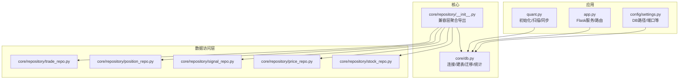
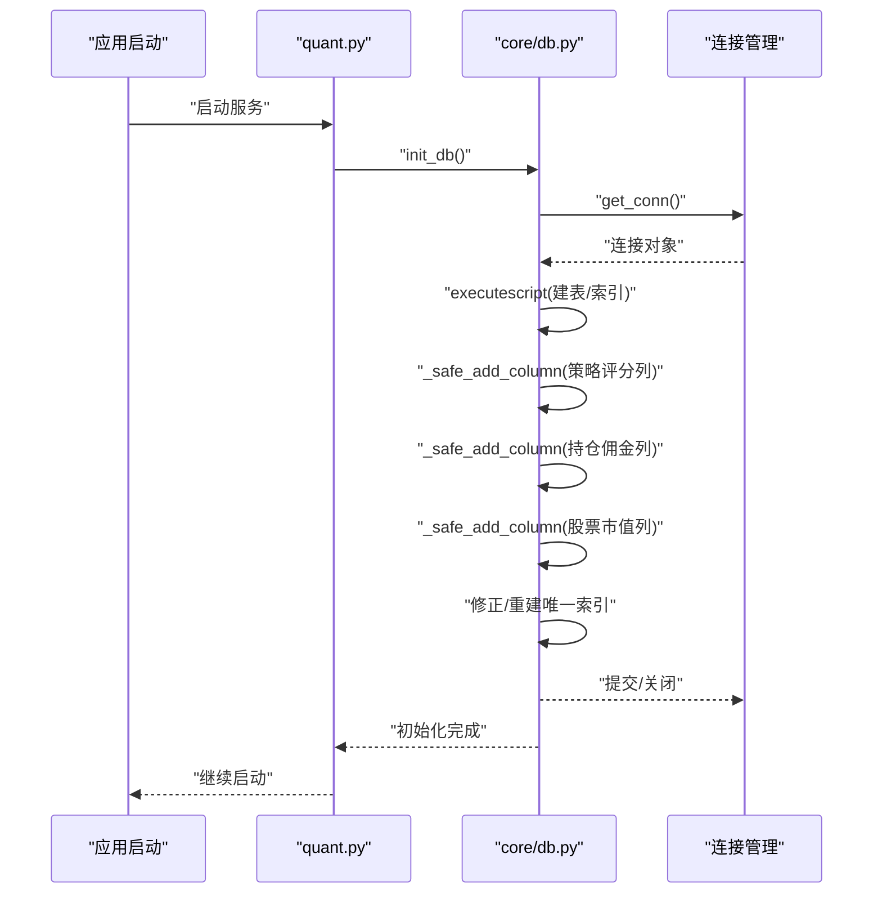
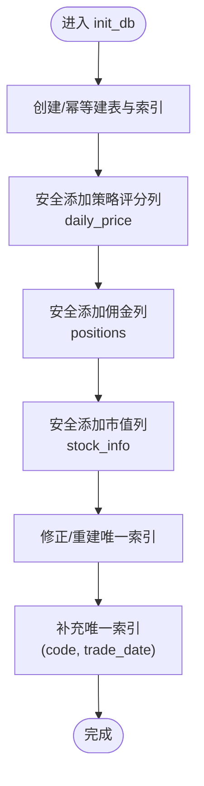
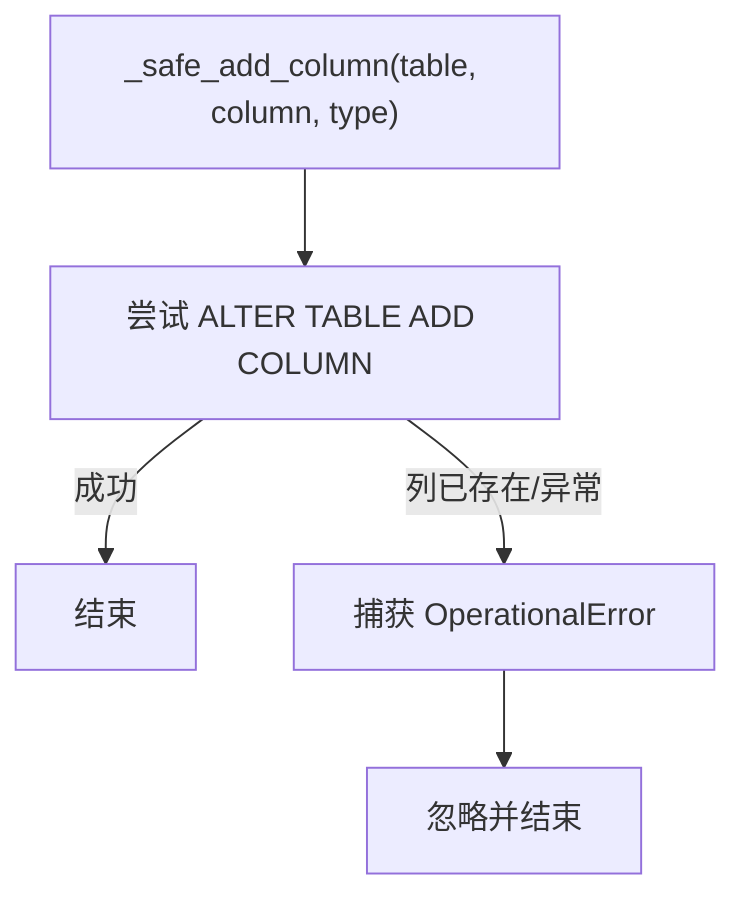
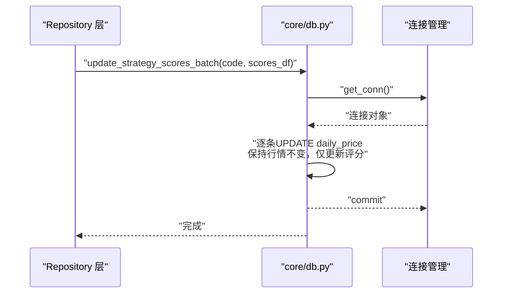
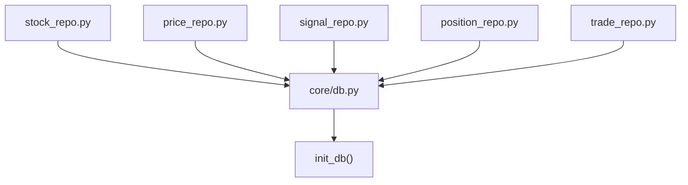
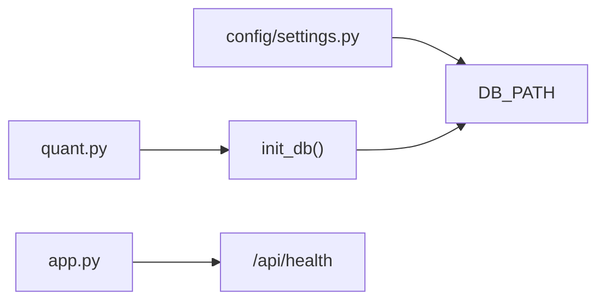

# 数据迁移

<cite>
**本文引用的文件**
- [core/db.py](file://core/db.py)
- [core/repository/__init__.py](file://core/repository/__init__.py)
- [core/repository/stock_repo.py](file://core/repository/stock_repo.py)
- [core/repository/price_repo.py](file://core/repository/price_repo.py)
- [core/repository/signal_repo.py](file://core/repository/signal_repo.py)
- [core/repository/position_repo.py](file://core/repository/position_repo.py)
- [core/repository/trade_repo.py](file://core/repository/trade_repo.py)
- [quant.py](file://quant.py)
- [app.py](file://app.py)
- [config/settings.py](file://config/settings.py)
</cite>

## 目录
1. [简介](#简介)
2. [项目结构](#项目结构)
3. [核心组件](#核心组件)
4. [架构总览](#架构总览)
5. [详细组件分析](#详细组件分析)
6. [依赖分析](#依赖分析)
7. [性能考量](#性能考量)
8. [故障排查指南](#故障排查指南)
9. [结论](#结论)
10. [附录](#附录)

## 简介
本文件面向AIQuant项目的数据库迁移机制，围绕数据库版本管理、表结构变更与数据迁移策略展开，重点解释以下内容：
- _init_db函数中的迁移逻辑与执行顺序
- _safe_add_column安全添加列机制与向后兼容性处理
- 旧版本数据到新版本数据的转换过程、数据完整性保证与回滚机制
- 迁移脚本示例、版本升级流程与数据验证方法
- 生产环境迁移注意事项与最佳实践

## 项目结构
AIQuant采用“核心数据库模块 + 按表拆分的数据访问层（Repository）”的组织方式：
- 核心数据库模块负责连接管理、建表与迁移、统计与兼容层导出
- Repository层按表拆分，封装具体CRUD，新代码优先使用
- 应用入口在quant.py中调用init_db进行初始化，并在app.py中提供健康检查等接口

图表来源
- [core/db.py:26-41](file://core/db.py#L26-L41)
- [core/repository/__init__.py:1-7](file://core/repository/__init__.py#L1-L7)
- [quant.py:23-25](file://quant.py#L23-L25)
- [app.py:39-72](file://app.py#L39-L72)
- [config/settings.py:6-8](file://config/settings.py#L6-L8)

章节来源
- [core/db.py:26-41](file://core/db.py#L26-L41)
- [core/repository/__init__.py:1-7](file://core/repository/__init__.py#L1-L7)
- [quant.py:23-25](file://quant.py#L23-L25)
- [app.py:39-72](file://app.py#L39-L72)
- [config/settings.py:6-8](file://config/settings.py#L6-L8)

## 核心组件
- 连接管理与事务控制：提供上下文管理器，开启WAL模式与NORMAL同步，自动commit/rollback/关闭连接，确保并发与一致性
- 迁移辅助函数_safe_add_column：在SQLite中安全添加列（列存在则忽略），避免重复迁移报错
- 初始化函数init_db：一次性执行建表、索引与迁移步骤，保证新旧版本共存时的平滑过渡
- 数据访问层（Repository）：按表拆分的CRUD封装，新代码优先使用，兼容层统一导出

章节来源
- [core/db.py:26-41](file://core/db.py#L26-L41)
- [core/db.py:45-51](file://core/db.py#L45-L51)
- [core/db.py:57-466](file://core/db.py#L57-L466)
- [core/repository/__init__.py:1-7](file://core/repository/__init__.py#L1-L7)

## 架构总览
数据库迁移在应用启动阶段集中执行，遵循“先建表/索引，再迁移列与索引，最后补充唯一约束”的顺序，确保幂等与可回退。

图表来源
- [quant.py:595-597](file://quant.py#L595-L597)
- [core/db.py:57-466](file://core/db.py#L57-L466)
- [core/db.py:26-41](file://core/db.py#L26-L41)

## 详细组件分析

### _init_db函数中的迁移逻辑
- 建表与索引：通过单一executescript语句创建所有表及常用索引，确保幂等
- 策略评分列迁移：为daily_price表批量添加策略评分列（如vol_score、ma_score、diverge_score、bottom_score、whale_score、fusion_score、strategy_score、strategy_signal），使用_safe_add_column保证列不存在时才添加
- 持仓佣金列迁移：为positions表添加commission列
- 股票市值列迁移：为stock_info表添加total_shares与circ_shares列
- 唯一索引修正：先尝试删除旧索引，再创建新的唯一索引（scan_date, code），确保扫描推荐记录的唯一性
- 唯一约束补充：为daily_price补充(code, trade_date)唯一索引，避免重复写入

图表来源
- [core/db.py:57-466](file://core/db.py#L57-L466)

章节来源
- [core/db.py:57-466](file://core/db.py#L57-L466)

### _safe_add_column安全添加列机制与向后兼容性
- 实现原理：通过捕获SQLite的OperationalError（列已存在）来实现“存在即跳过”，避免重复迁移失败
- 兼容性策略：
  - 对于新增列，默认值与类型设计考虑历史数据的默认填充
  - 对于索引变更，先删除旧索引，再创建新索引，确保幂等
  - 对于唯一约束补充，通过try-except包裹，避免重复执行导致异常

图表来源
- [core/db.py:45-51](file://core/db.py#L45-L51)

章节来源
- [core/db.py:45-51](file://core/db.py#L45-L51)

### 旧版本到新版本的数据转换与完整性保证
- 策略评分列迁移：为历史daily_price记录补充策略评分列，使用update_strategy_scores_batch进行批量更新，避免覆盖行情数据
- 唯一索引修正：通过DROP INDEX + CREATE UNIQUE INDEX的方式，确保扫描推荐记录的唯一性，避免重复插入
- 唯一约束补充：为daily_price补充(code, trade_date)唯一索引，防止重复写入
- 事务与回滚：连接管理器在异常时自动rollback，保证迁移过程中断不会破坏现有数据

图表来源
- [core/db.py:581-628](file://core/db.py#L581-L628)

章节来源
- [core/db.py:581-628](file://core/db.py#L581-L628)

### 数据访问层与迁移的关系
- Repository层通过兼容层导出统一接口，新代码优先使用，减少对核心db.py的直接依赖
- Repository层的CRUD操作均通过_get_conn()获取连接，复用核心连接管理的事务与WAL设置

图表来源
- [core/repository/stock_repo.py:8-10](file://core/repository/stock_repo.py#L8-L10)
- [core/repository/price_repo.py:8-10](file://core/repository/price_repo.py#L8-L10)
- [core/repository/signal_repo.py:9-11](file://core/repository/signal_repo.py#L9-L11)
- [core/repository/position_repo.py:7-9](file://core/repository/position_repo.py#L7-L9)
- [core/repository/trade_repo.py:7-9](file://core/repository/trade_repo.py#L7-L9)
- [core/db.py:26-41](file://core/db.py#L26-L41)

章节来源
- [core/repository/stock_repo.py:8-10](file://core/repository/stock_repo.py#L8-L10)
- [core/repository/price_repo.py:8-10](file://core/repository/price_repo.py#L8-L10)
- [core/repository/signal_repo.py:9-11](file://core/repository/signal_repo.py#L9-L11)
- [core/repository/position_repo.py:7-9](file://core/repository/position_repo.py#L7-L9)
- [core/repository/trade_repo.py:7-9](file://core/repository/trade_repo.py#L7-L9)
- [core/db.py:26-41](file://core/db.py#L26-L41)

## 依赖分析
- 应用启动依赖：quant.py在启动时调用init_db，确保数据库结构就绪
- 服务健康检查：app.py提供/api/health接口，便于迁移后验证服务可用性
- 数据库路径：config/settings.py定义DB_PATH，确保迁移前后路径一致

图表来源
- [config/settings.py:6-8](file://config/settings.py#L6-L8)
- [quant.py:595-597](file://quant.py#L595-L597)
- [app.py:131-133](file://app.py#L131-L133)

章节来源
- [config/settings.py:6-8](file://config/settings.py#L6-L8)
- [quant.py:595-597](file://quant.py#L595-L597)
- [app.py:131-133](file://app.py#L131-L133)

## 性能考量
- WAL模式与NORMAL同步：提升并发写入性能，降低锁竞争
- 批量写入与冲突更新：upsert_daily_price与upsert_index_daily使用ON CONFLICT DO UPDATE，减少重复写入
- PRAGMA设置：在批量更新策略评分时关闭外键检查，减少约束校验开销
- 唯一索引：通过唯一索引避免重复数据，减少后续查询与聚合成本

## 故障排查指南
- 迁移失败（列已存在）：确认是否已执行_safe_add_column，或是否重复迁移
- 唯一索引冲突：检查是否存在重复记录，必要时清理或去重后再重建索引
- 连接异常：检查WAL与同步设置是否生效，确认数据库文件权限
- 数据不一致：利用事务回滚机制，定位异常点并重试

章节来源
- [core/db.py:45-51](file://core/db.py#L45-L51)
- [core/db.py:57-466](file://core/db.py#L57-L466)
- [core/db.py:26-41](file://core/db.py#L26-L41)

## 结论
AIQuant的数据库迁移机制以“幂等、向后兼容、可回退”为核心原则，通过集中初始化与安全添加列策略，确保在新旧版本共存时平滑演进。配合Repository层的按表拆分与统一导出，既提升了可维护性，也降低了迁移风险。

## 附录

### 迁移脚本示例（概念性）
- 建表与索引：使用executescript一次性创建
- 安全添加列：遍历目标表，逐列调用_safe_add_column
- 重建唯一索引：先DROP，再CREATE UNIQUE
- 批量评分更新：使用update_strategy_scores_batch

章节来源
- [core/db.py:57-466](file://core/db.py#L57-L466)
- [core/db.py:45-51](file://core/db.py#L45-L51)
- [core/db.py:581-628](file://core/db.py#L581-L628)

### 版本升级流程（建议）
- 备份数据库文件
- 启动应用，自动执行init_db
- 校验关键表结构与索引
- 验证数据完整性（唯一索引、评分列）
- 回滚测试（模拟异常场景）

章节来源
- [quant.py:595-597](file://quant.py#L595-L597)
- [core/db.py:57-466](file://core/db.py#L57-L466)

### 数据验证方法（建议）
- 查询统计：db_stats输出股票数、行情记录数、最新日期、数据库大小
- 唯一性校验：检查(code, trade_date)唯一索引是否生效
- 关键列存在性：确认策略评分列、市值列、佣金列均已存在

章节来源
- [core/db.py:921-939](file://core/db.py#L921-L939)
- [core/db.py:57-466](file://core/db.py#L57-L466)

### 生产环境迁移注意事项与最佳实践
- 业务低峰期执行迁移
- 提前备份数据库文件
- 使用只读副本或离线迁移验证
- 监控WAL与磁盘空间
- 逐步灰度发布，回滚预案准备充分