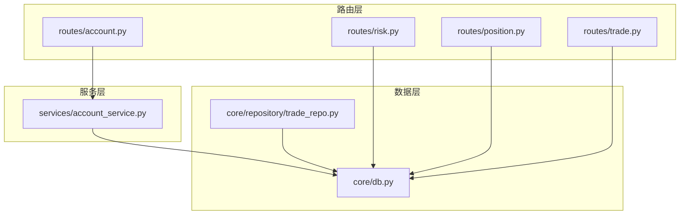
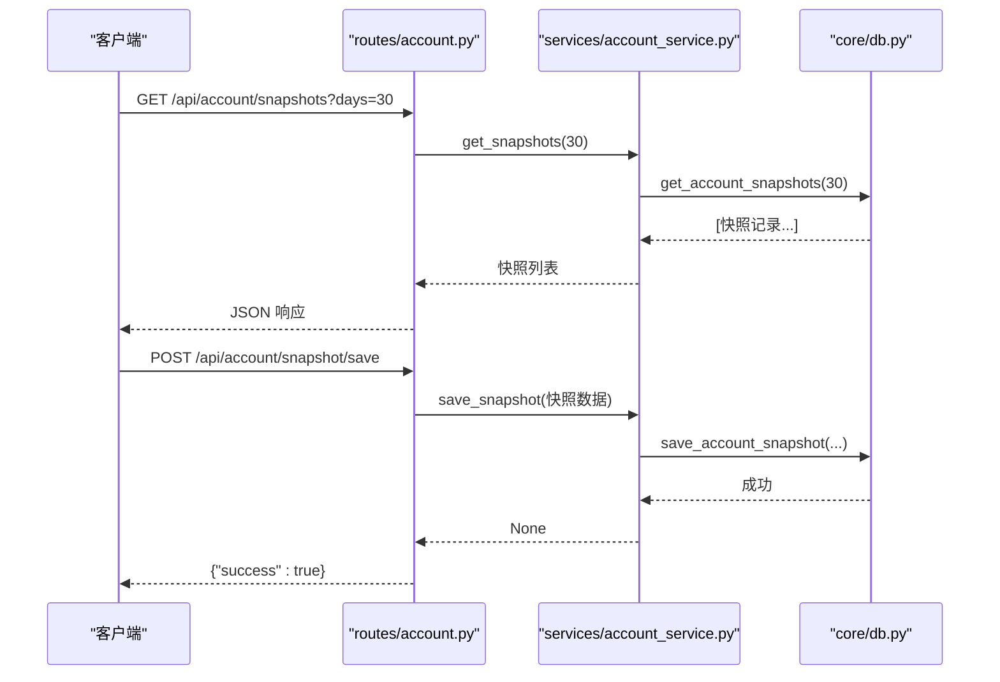
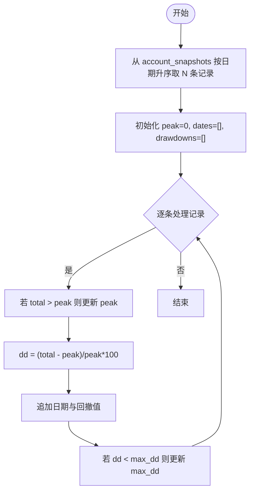
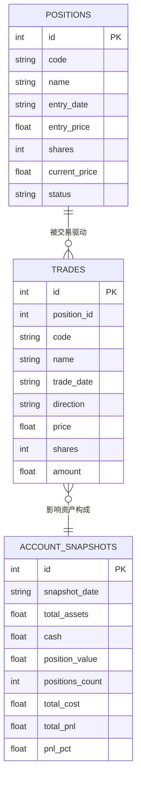
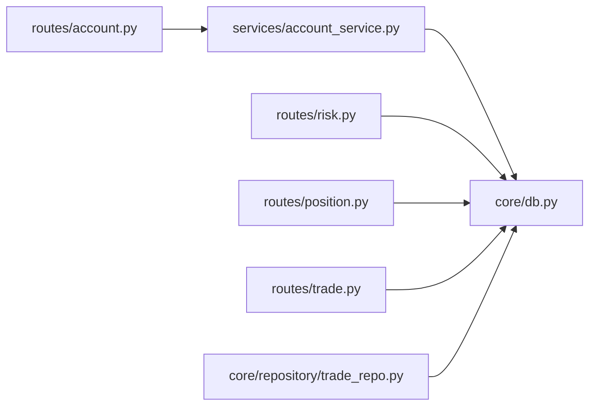

# account_snapshots 账户资产快照表

<cite>
**本文档引用的文件**
- [core/db.py](file://core/db.py)
- [routes/account.py](file://routes/account.py)
- [services/account_service.py](file://services/account_service.py)
- [routes/risk.py](file://routes/risk.py)
- [core/repository/trade_repo.py](file://core/repository/trade_repo.py)
- [routes/position.py](file://routes/position.py)
- [routes/trade.py](file://routes/trade.py)
- [core/repository/position_repo.py](file://core/repository/position_repo.py)
- [config/settings.py](file://config/settings.py)
</cite>

## 目录
1. [简介](#简介)
2. [项目结构](#项目结构)
3. [核心组件](#核心组件)
4. [架构总览](#架构总览)
5. [详细组件分析](#详细组件分析)
6. [依赖关系分析](#依赖关系分析)
7. [性能考量](#性能考量)
8. [故障排查指南](#故障排查指南)
9. [结论](#结论)
10. [附录](#附录)

## 简介
本文件系统性阐述 account_snapshots 账户资产快照表的设计与使用，覆盖以下方面：
- 表结构与字段含义
- 快照生成频率、计算方法与数据聚合策略
- 时间序列分析与趋势追踪能力
- 与持仓记录、交易记录的关联关系
- 基于快照的投资组合分析与风险评估方法
- 财务指标计算公式与报表生成思路

## 项目结构
围绕 account_snapshots 的相关代码分布在以下层次：
- 数据层：SQLite 初始化与表结构定义、快照读写接口
- 服务层：账户快照服务封装
- 路由层：HTTP 接口暴露
- 关联模块：持仓与交易记录，风控回撤计算

图表来源
- [routes/account.py:1-38](file://routes/account.py#L1-L38)
- [services/account_service.py:1-31](file://services/account_service.py#L1-L31)
- [core/db.py:210-223](file://core/db.py#L210-L223)
- [core/repository/trade_repo.py:40-77](file://core/repository/trade_repo.py#L40-L77)
- [routes/risk.py:246-298](file://routes/risk.py#L246-L298)

章节来源
- [routes/account.py:1-38](file://routes/account.py#L1-L38)
- [services/account_service.py:1-31](file://services/account_service.py#L1-L31)
- [core/db.py:210-223](file://core/db.py#L210-L223)
- [core/repository/trade_repo.py:40-77](file://core/repository/trade_repo.py#L40-L77)
- [routes/risk.py:246-298](file://routes/risk.py#L246-L298)

## 核心组件
- 表结构与索引
  - 表名：account_snapshots
  - 主键：id
  - 重要索引：idx_snapshot_date(snapshot_date)
  - 字段说明（见下节“表结构设计”）

- 数据访问接口
  - 保存快照：支持同日去重更新或插入
  - 查询历史：按日期倒序返回最近 N 天
  - 查询最新：按日期倒序返回最新一条

- 路由接口
  - 获取历史快照：GET /api/account/snapshots?days=N
  - 获取最新快照：GET /api/account/snapshot/latest
  - 保存快照：POST /api/account/snapshot/save

- 风控回撤计算
  - 基于 account_snapshots 表计算回撤曲线与最大回撤

章节来源
- [core/db.py:210-223](file://core/db.py#L210-L223)
- [core/db.py:1050-1101](file://core/db.py#L1050-L1101)
- [routes/account.py:11-38](file://routes/account.py#L11-L38)
- [routes/risk.py:246-298](file://routes/risk.py#L246-L298)

## 架构总览
account_snapshots 在系统中的位置与交互如下：

图表来源
- [routes/account.py:11-38](file://routes/account.py#L11-L38)
- [services/account_service.py:10-30](file://services/account_service.py#L10-L30)
- [core/db.py:1050-1101](file://core/db.py#L1050-L1101)

## 详细组件分析

### 表结构设计
account_snapshots 用于记录账户在不同时点的资产状况快照，字段定义如下：
- id：自增主键
- snapshot_date：快照日期（YYYY-MM-DD）
- total_assets：总资产
- cash：现金余额
- position_value：持仓价值
- positions_count：持仓数量
- total_cost：总成本
- total_pnl：总盈亏
- pnl_pct：总盈亏比例
- created_at：记录创建时间

索引与约束
- 对 snapshot_date 建立索引，便于按日期查询与排序
- 业务上按日去重（同日多次写入会更新而非重复插入）

章节来源
- [core/db.py:210-223](file://core/db.py#L210-L223)

### 快照生成频率与数据聚合策略
- 生成频率
  - 按日生成：函数内部以当日日期作为去重键，确保同日仅保留一条快照
  - 若当日已有快照，则执行更新；否则插入新记录

- 数据聚合策略
  - 资产聚合来源于外部计算：总资产=现金+持仓价值
  - 持仓价值来自实时行情与持仓数量的乘积汇总
  - 总成本、总盈亏与盈亏比例由持仓汇总逻辑计算并传入

- 同日去重机制
  - 通过 snapshot_date 唯一键约束（数据库层）与业务层检查相结合，避免重复写入

章节来源
- [core/db.py:1050-1081](file://core/db.py#L1050-L1081)
- [core/repository/trade_repo.py:42-57](file://core/repository/trade_repo.py#L42-L57)

### 财务指标计算与报表生成
- 资产构成
  - 总资产 = 现金余额 + 持仓价值
- 盈亏与比例
  - 总盈亏 = 持仓价值 − 总成本
  - 盈亏比例 = 总盈亏 ÷ 总成本 × 100%
- 报表维度
  - 时间序列：按 snapshot_date 排序的历史快照
  - 统计摘要：最新快照、N 日内变化、最大回撤等

章节来源
- [core/db.py:1136-1154](file://core/db.py#L1136-L1154)

### 时间序列分析与趋势追踪
- 回撤分析
  - 基于 account_snapshots 表按日期升序遍历，维护历史峰值
  - 当日回撤 = (当日总资产 − 历史峰值) ÷ 历史峰值 × 100
  - 输出：日期序列、回撤序列、最大回撤、当前回撤

图表来源
- [routes/risk.py:246-298](file://routes/risk.py#L246-L298)

章节来源
- [routes/risk.py:246-298](file://routes/risk.py#L246-L298)

### 与持仓记录、交易记录的关联关系
- 与持仓的关系
  - 持仓价值与总成本来自 positions 表的汇总计算
  - 持仓数量来自持有状态的持仓条目计数
- 与交易的关系
  - 交易记录用于驱动账户现金流与持仓变动
  - 快照通常在交易执行后或每日收盘后生成

图表来源
- [core/db.py:168-186](file://core/db.py#L168-L186)
- [core/db.py:190-206](file://core/db.py#L190-L206)
- [core/db.py:210-223](file://core/db.py#L210-L223)

章节来源
- [core/db.py:168-186](file://core/db.py#L168-L186)
- [core/db.py:190-206](file://core/db.py#L190-L206)
- [core/db.py:210-223](file://core/db.py#L210-L223)

### 投资组合分析与风险评估
- 组合分析
  - 基于快照可观察资产规模、现金占比、持仓集中度（结合 positions_count 与 position_value）
  - 变化率与波动可通过相邻快照差分或对数变换衡量
- 风险评估
  - 回撤分析：最大回撤与当前回撤用于评估下行风险
  - 风控阈值：可将回撤阈值纳入风控规则，触发限制或阻断

章节来源
- [routes/risk.py:246-298](file://routes/risk.py#L246-L298)

## 依赖关系分析
- 路由到服务到数据层的调用链
  - 路由层负责参数解析与响应封装
  - 服务层负责类型转换与调用数据层
  - 数据层负责数据库连接、SQL 执行与结果映射

图表来源
- [routes/account.py:1-38](file://routes/account.py#L1-L38)
- [services/account_service.py:1-31](file://services/account_service.py#L1-L31)
- [core/db.py:1050-1101](file://core/db.py#L1050-L1101)
- [routes/risk.py:246-298](file://routes/risk.py#L246-L298)
- [routes/position.py:1-116](file://routes/position.py#L1-L116)
- [routes/trade.py:1-43](file://routes/trade.py#L1-L43)
- [core/repository/trade_repo.py:40-77](file://core/repository/trade_repo.py#L40-L77)

章节来源
- [routes/account.py:1-38](file://routes/account.py#L1-L38)
- [services/account_service.py:1-31](file://services/account_service.py#L1-L31)
- [core/db.py:1050-1101](file://core/db.py#L1050-L1101)
- [routes/risk.py:246-298](file://routes/risk.py#L246-L298)
- [routes/position.py:1-116](file://routes/position.py#L1-L116)
- [routes/trade.py:1-43](file://routes/trade.py#L1-L43)
- [core/repository/trade_repo.py:40-77](file://core/repository/trade_repo.py#L40-L77)

## 性能考量
- 数据库连接与事务
  - 使用上下文管理器确保事务提交与回滚，减少异常导致的锁持有
- 索引优化
  - idx_snapshot_date 提升按日期查询与排序效率
- 写入策略
  - 同日去重更新避免重复索引冲突与数据膨胀
- I/O 与批处理
  - 快照写入为单条记录级操作，适合高频调用场景

章节来源
- [core/db.py:26-39](file://core/db.py#L26-L39)
- [core/db.py:223](file://core/db.py#L223)
- [core/db.py:1050-1081](file://core/db.py#L1050-L1081)

## 故障排查指南
- 常见问题
  - 快照未更新：确认是否为同日重复写入，检查 snapshot_date 是否正确
  - 查询为空：确认 days 参数是否过大，或数据库中是否存在对应日期
  - 回撤计算异常：检查 account_snapshots 中是否存在空值或非数值
- 排查步骤
  - 核对路由参数与请求体格式
  - 检查服务层类型转换是否成功
  - 直接查询数据库表验证数据完整性
- 相关接口
  - 获取历史快照：GET /api/account/snapshots?days=N
  - 获取最新快照：GET /api/account/snapshot/latest
  - 保存快照：POST /api/account/snapshot/save
  - 回撤曲线：GET /api/risk/drawdown?days=N

章节来源
- [routes/account.py:11-38](file://routes/account.py#L11-L38)
- [routes/risk.py:246-298](file://routes/risk.py#L246-L298)
- [core/db.py:1083-1101](file://core/db.py#L1083-L1101)

## 结论
account_snapshots 为账户资产提供了高时效、低冗余的日频快照能力，配合持仓与交易数据可实现：
- 精准的时间序列分析与回撤评估
- 简洁的报表生成与可视化基础
- 与风控体系的无缝对接

建议在业务侧统一快照生成时机（如每日收盘后），并完善缺失值校验与异常告警，以保证数据质量。

## 附录

### API 定义
- 获取历史快照
  - 方法：GET
  - 路径：/api/account/snapshots?days=N
  - 响应：包含快照数组的 JSON
- 获取最新快照
  - 方法：GET
  - 路径：/api/account/snapshot/latest
  - 响应：单条快照记录
- 保存快照
  - 方法：POST
  - 路径：/api/account/snapshot/save
  - 请求体：包含总资产、现金、持仓价值、持仓数量、总成本、总盈亏、盈亏比例等字段
- 回撤曲线
  - 方法：GET
  - 路径：/api/risk/drawdown?days=N
  - 响应：日期序列、回撤序列、最大回撤、当前回撤

章节来源
- [routes/account.py:11-38](file://routes/account.py#L11-L38)
- [routes/risk.py:246-298](file://routes/risk.py#L246-L298)